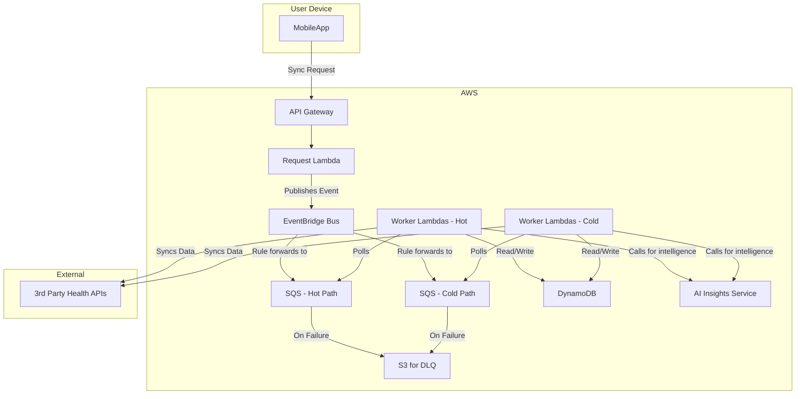
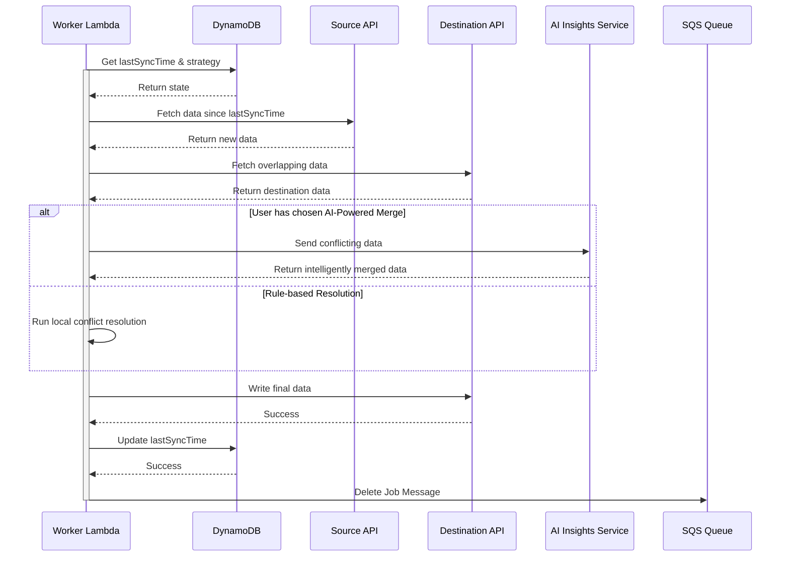
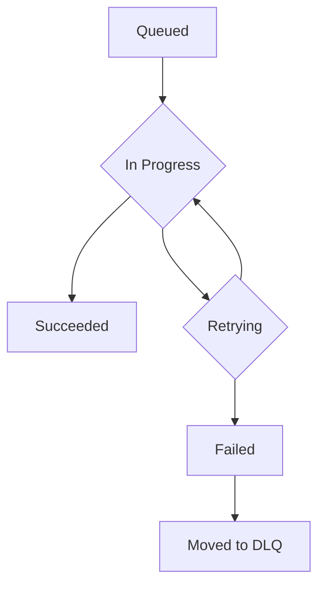

## Dependencies

### Core Dependencies
- `02-product-scope.md` - Product Scope, Personas & MVP Definition
- `06-technical-architecture.md` - Technical Architecture
- `07-apis-integration.md` - APIs & Integration Requirements
- `17-error-handling.md` - Error Handling, Logging & Monitoring
- `30-sync-mapping.md` - Source-Destination Sync Mapping

### Strategic / Indirect Dependencies
- `01-context-vision.md` - Context & Vision
- `16-performance-optimization.md` - Performance & Scalability
- `31-historical-data.md` - Historical Data Handling
- `40-error-recovery.md` - Error Recovery & Troubleshooting

---

# PRD Section 5: Data Synchronization & Reliability

## 1. Executive Summary

This document provides the detailed technical and functional specification for SyncWell's core data synchronization engine. The primary objective is to create a highly reliable, secure, and efficient system for transferring health data. The success of the entire application is fundamentally dependent on the robustness and integrity of this engine.

This document serves as a blueprint for the **product and engineering teams**, detailing the specific architecture, algorithms, and policies required. A well-defined sync engine is the most critical and complex component of the project; this specification aims to de-risk its development by providing a clear and comprehensive plan.

## 2. Sync Engine Architecture

The data synchronization engine is a server-side, event-driven system built on AWS, as defined in `06-technical-architecture.md`. This architecture is designed for massive scale and reliability, separating real-time and historical syncs into "hot" and "cold" paths.

*   **`API Gateway` + `Request Lambda`:** The public-facing entry point. The mobile app calls this endpoint to request a sync. The Lambda validates the request and publishes a semantic event (e.g., `SyncJobRequested`) to the central EventBridge bus.
*   **`EventBridge Event Bus`:** The central nervous system for our backend. It receives events from producers (like the `RequestLambda`) and routes them to consumers based on defined rules. This decouples services from one another.
*   **`SQS Queues`:** For sync jobs, an EventBridge rule forwards the event to a primary, durable SQS queue. This queue acts as a critical buffer, absorbing traffic spikes and ensuring that sync jobs are never lost, even if the worker fleet is down.
*   **`Worker Lambdas`:** The heart of the engine. A fleet of serverless functions that pull jobs from the queues and execute them. Each worker is responsible for the full lifecycle of a single sync job.
*   **`DataProvider` (Interface):** A standardized interface within the worker code that each third-party integration (Fitbit, Garmin, etc.) must implement.
*   **`Smart Conflict Resolution Engine`:** A core component within the worker lambda that analyzes data from the source and destination to intelligently resolve conflicts before writing. This engine can now leverage the **AI Insights Service**.
*   **`AI Insights Service`:** As detailed in the technical architecture, this service provides ML and LLM-powered intelligence, including advanced conflict resolution models.
*   **`DynamoDB`:** The **`SyncWellMetadata`** table is used to store all essential, non-ephemeral state for the sync process. This includes user configurations, connection status, and sync metadata. Its single-table design is detailed in `06-technical-architecture.md`.
*   **`S3 for Dead-Letter Queues`**: Messages that fail processing repeatedly are sent to a Dead-Letter Queue (DLQ) and stored in an S3 bucket for analysis and manual reprocessing.

## 3. The Synchronization Algorithm (Server-Side Delta Sync)

The `Worker Lambda` will follow this algorithm for each job pulled from the SQS queue:

1.  **Job Dequeue:** The worker receives a job message (e.g., "Sync Steps for User X from Fitbit to Google Fit").
2.  **Get State from DynamoDB:** The worker performs a `GetItem` call on the `SyncWellMetadata` table to retrieve the `SyncConfig` item.
    *   **PK:** `USER#{userId}`
    *   **SK:** `SYNCCONFIG#{sourceId}#to#{destId}#{dataType}`
    *   This single read provides the `lastSyncTime` and the user's chosen `conflictResolutionStrategy`.
3.  **Fetch New Data:** It calls the `fetchData(since: lastSyncTime)` method on the source `DataProvider` (e.g., `FitbitProvider`). If new data is found, the algorithm proceeds.
4.  **Fetch Destination Data for Conflict Resolution:** To enable conflict resolution, the worker fetches potentially overlapping data from the destination `DataProvider`. The time range for this query is calculated based on the timestamps of the new data fetched from the source, plus a small buffer to account for potential clock skew (e.g., `[min_source_timestamp - 5_minutes, max_source_timestamp + 5_minutes]`).
5.  **Smart Conflict Resolution:** The `Smart Conflict Resolution Engine` is invoked. It compares the source and destination data and applies the user's chosen strategy. If the strategy is `AI-Powered Merge`, it calls the **AI Insights Service**. It outputs a final, clean list of data points to be written.
6.  **Write Data:** The worker calls the `writeData()` method on the destination provider with the conflict-free data.
7.  **Update State in DynamoDB:** Upon successful completion, the worker performs an `UpdateItem` call on the `SyncConfig` item in `SyncWellMetadata` to set the new `lastSyncTime` for the connection.
8.  **Delete Job Message:** The worker deletes the job message from the SQS queue to mark it as complete.

## 4. Smart Conflict Resolution Engine

This engine is a core feature of SyncWell, designed to eliminate data duplication and loss. It offers several strategies that Pro users can choose from, catering to our key user personas. For "Sarah," who values simplicity, the default `Prioritize Source` is a "set it and forget it" solution. For "Alex," who wants ultimate control, the ability to choose a strategy, especially the `AI-Powered Merge`, is a key differentiator.

*   **`Prioritize Source`:** The default behavior. New data from the source platform will always overwrite any existing data in the destination for the same time period.
*   **`Prioritize Destination`:** Never overwrite existing data. If a conflicting entry is found in the destination, the source entry is ignored.
*   **`AI-Powered Merge` (Activities Only - Pro Feature):** This advanced strategy uses a machine learning model to create the best possible "superset" of the data. Instead of fixed rules, it makes an intelligent prediction.
    *   **Mechanism:** The worker lambda sends the two conflicting activity records (as JSON) to the `AI Insights Service`.
    *   **Intelligence:** The service's ML model, trained on thousands of examples of merged activities, analyzes the data. It might learn, for example, that a user's Garmin device provides more reliable GPS data, while their Wahoo chest strap provides more accurate heart rate data.
    *   **Output:** The AI service returns a single, merged activity record that combines the best attributes of both sources. For example, it could take the GPS track from a Garmin device and combine it with Heart Rate data from a Wahoo chest strap for the same activity, creating a single, more complete workout file. This is far more flexible and powerful than hard-coded rules.
    *   **Fallback Mechanism:** **Reliability of the core sync is paramount.** If the `AI Insights Service` is unavailable, times out, or returns an error, the Conflict Resolution Engine **will not fail the sync job**. Instead, it will log the error and automatically fall back to the default `Prioritize Source` strategy.
    *   **User Transparency:** To ensure transparency for this premium feature, the sync job's result will be marked with a `MERGE_FALLBACK` status in our system. While this will not trigger a push notification, the user's sync history within the app will display an informational icon next to the relevant sync, indicating that an AI-powered merge could not be performed and a standard resolution was used instead. This maintains a high level of trust with our paying users.

## 5. Data Integrity

*   **Durable Queueing & Idempotency:** By using SQS, we guarantee that a sync job will be processed "at-least-once". To handle rare cases of a message being delivered twice (e.g., after a worker crash), our worker logic is designed to be idempotent. Idempotency is achieved by using the `MessageId` from the SQS message as an idempotency key. Before processing, the worker will check if a job with this `MessageId` has already been successfully completed within a recent time window (e.g., 15 minutes, matching the SQS visibility timeout). This check prevents the same job from being processed multiple times and creating duplicate data.
*   **Transactional State:** State updates in DynamoDB are atomic. The `lastSyncTime` is only updated if the entire write operation to the destination platform succeeds.
*   **Dead Letter Queue (DLQ):** If a job fails repeatedly (e.g., due to a persistent third-party API error or a problem with the AI service), SQS will automatically move it to a DLQ. This allows for manual inspection and debugging without blocking the main queue.

## 5a. Historical Data Sync (`cold-path`)

Handling a user's request to sync several years of historical data (User Story **US-10**) presents a significant challenge. A single, long-running job is brittle and prone to failure. To address this, we will use **AWS Step Functions**, a managed workflow orchestrator that aligns with our serverless-first architecture.

1.  **Workflow Orchestration with AWS Step Functions:** When a user requests a historical sync, the `Request Lambda` initiates a new execution of a pre-defined Step Functions state machine. This approach provides superior reliability, state management, and observability compared to a manual orchestration solution.

2.  **State Machine Logic:** The state machine, as detailed in `06-technical-architecture.md`, will perform the following steps:
    *   **Initiate Sync Job:** A Lambda function prepares the sync, determining the total number of data chunks to be processed (e.g., one chunk per month of historical data).
    *   **Map State for Parallel Processing:** The state machine will use a `Map` state to iterate over the array of chunks. This allows for parallel execution of the sync task for each chunk, dramatically improving performance.
    *   **Process One Chunk:** For each chunk, a dedicated `Cold-Path Worker Lambda` is invoked. It fetches the data from the source, transforms it, and writes it to the destination.
    *   **Built-in Error Handling & Retries:** Step Functions provides robust, configurable retry logic for transient errors. If a chunk fails repeatedly, it can be caught and logged to a Dead-Letter Queue without halting the entire workflow.
    *   **Finalize Sync:** Once all chunks are processed, a final Lambda function updates the overall job status to `COMPLETED`.

3.  **Progress Tracking:** The Step Functions execution itself serves as the progress record. The mobile app can query a backend API that uses the `DescribeExecution` API call to get the current status, number of completed chunks, and overall progress of the historical sync.

4.  **Rate Limiting & Throttling:** The `Cold-Path Worker Lambdas` invoked by Step Functions are subject to the same third-party API rate limits. The rate-limiting service will prioritize `hot-path` (real-time) syncs over these `cold-path` jobs.

*(Note: This section directly impacts `31-historical-data.md` and `16-performance-optimization.md`, which will be updated to reflect this AWS Step Functions-based strategy.)*

## 6. Functional & Non-Functional Requirements
*(Unchanged)*

## 7. Risk Analysis & Mitigation
*(Unchanged)*

## 8. Visual Diagrams

### Sync Engine Architecture (with AI Service)

### Sequence Diagram for Delta Sync (with AI-Powered Merge)

### State Machine for a Sync Job
*(Unchanged)*

## 9. Research & Recommendations on AI/Agentic Workflows

As part of a research spike, we evaluated several tools to enhance the project's AI capabilities, specifically for the `AI Insights Service`.

*   **Tools Considered:**
    *   **n8n:** A workflow automation tool. Evaluated as not suitable for the core product's real-time, custom-coded sync engine.
    *   **LangChain:** A framework for developing LLM-powered applications. This was already included in the technical architecture and remains the recommended tool for straightforward LLM interactions (like generating user summaries).
    *   **crewAI:** A framework for orchestrating multiple collaborating AI agents. Evaluated as overkill for the current scope of AI features.
    *   **LangGraph:** An extension of LangChain for building stateful, multi-step AI agents.

*   **Recommendation:**
    *   We recommend **LangGraph** for implementing the `Interactive AI Troubleshooter` feature, as specified in `06-technical-architecture.md` and `24-user-support.md`.
    *   **Rationale:** LangGraph's ability to model conversational flows as a graph is a perfect fit for a troubleshooting agent that needs to ask clarifying questions, remember context, and guide a user through a decision tree. This provides a more robust and powerful user experience than a simple, single-call LLM.

*(Section 10 has been removed to align with the decision to standardize on the AWS-native serverless architecture and avoid the operational complexity of a self-hosted open-source stack.)*
