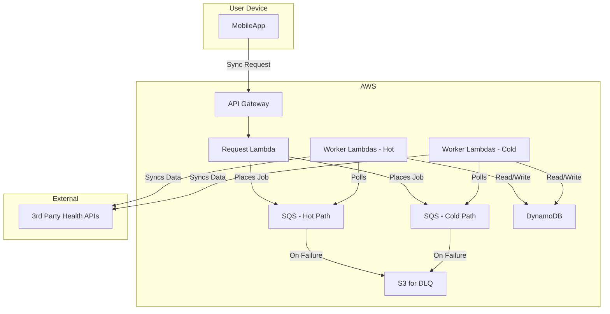
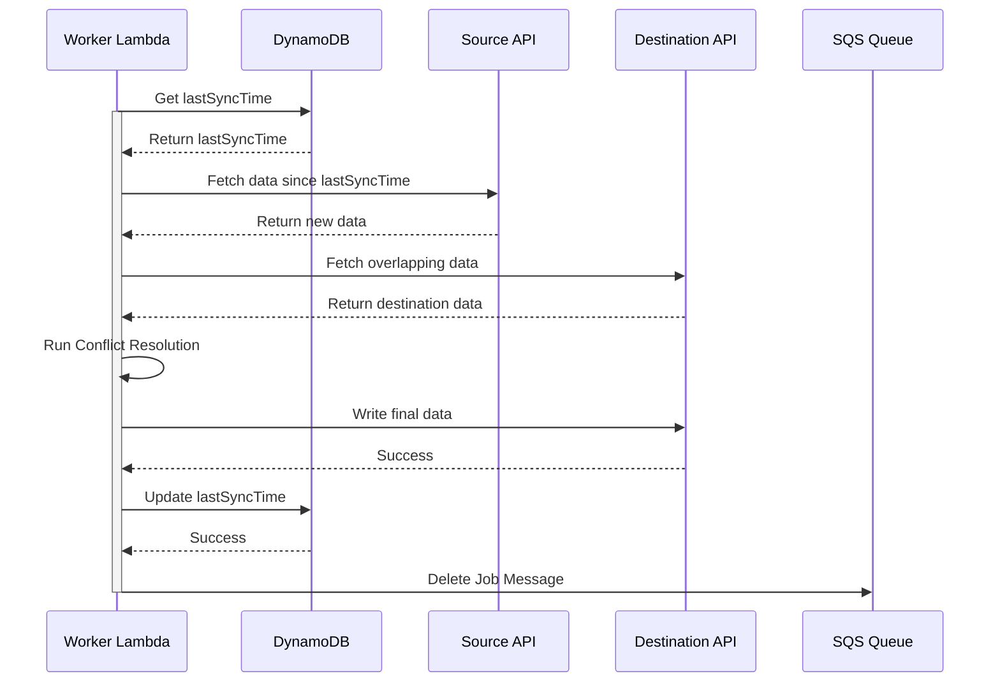
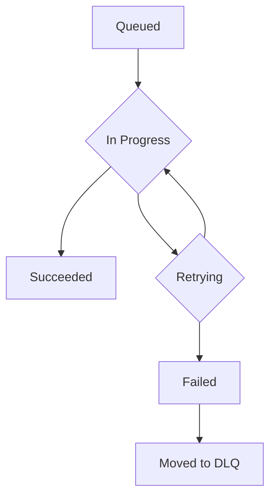

## Dependencies

### Core Dependencies
- `02-product-scope.md` - Product Scope, Personas & MVP Definition
- `06-technical-architecture.md` - Technical Architecture
- `07-apis-integration.md` - APIs & Integration Requirements
- `17-error-handling.md` - Error Handling, Logging & Monitoring
- `30-sync-mapping.md` - Source-Destination Sync Mapping

### Strategic / Indirect Dependencies
- `01-context-vision.md` - Context & Vision
- `16-performance-optimization.md` - Performance & Scalability
- `31-historical-data.md` - Historical Data Handling
- `40-error-recovery.md` - Error Recovery & Troubleshooting

---

# PRD Section 5: Data Synchronization & Reliability

## 1. Executive Summary

This document provides the detailed technical and functional specification for SyncWell's core data synchronization engine. The primary objective is to create a highly reliable, secure, and efficient system for transferring health data. The success of the entire application is fundamentally dependent on the robustness and integrity of this engine.

This document serves as a blueprint for the **product and engineering teams**, detailing the specific architecture, algorithms, and policies required. A well-defined sync engine is the most critical and complex component of the project; this specification aims to de-risk its development by providing a clear and comprehensive plan.

## 2. Sync Engine Architecture

The data synchronization engine is a server-side, event-driven system built on AWS, as defined in `06-technical-architecture.md`. This architecture is designed for massive scale and reliability, separating real-time and historical syncs into "hot" and "cold" paths.

*   **`API Gateway` + `Request Lambda`:** The public-facing entry point. The mobile app calls this endpoint to request a sync. The Lambda validates the request and places a job message into the appropriate SQS queue (hot or cold path).
*   **`SQS Queues`:** Two primary, durable queues (one for real-time, one for historical) act as a buffer, ensuring sync jobs are never lost.
*   **`Worker Lambdas`:** The heart of the engine. A fleet of serverless functions that pull jobs from the queues and execute them. Each worker is responsible for the full lifecycle of a single sync job.
*   **`DataProvider` (Interface):** A standardized interface within the worker code that each third-party integration (Fitbit, Garmin, etc.) must implement.
*   **`Smart Conflict Resolution Engine`:** A core component within the worker lambda that analyzes data from the source and destination to intelligently resolve conflicts before writing.
*   **`DynamoDB`:** Used to store essential state required for the sync process, such as `lastSyncTime` for each connection and user-defined conflict resolution rules.
*   **`S3 for Dead-Letter Queues`**: Messages that fail processing repeatedly are sent to a Dead-Letter Queue (DLQ) and stored in an S3 bucket for analysis and manual reprocessing.

## 3. The Synchronization Algorithm (Server-Side Delta Sync)

The `Worker Lambda` will follow this algorithm for each job pulled from the SQS queue:

1.  **Job Dequeue:** The worker receives a job message (e.g., "Sync Steps for User X from Fitbit to Google Fit").
2.  **Get State from DynamoDB:** The worker retrieves the `lastSyncTime` and the user's chosen `conflictResolutionStrategy` for this connection from DynamoDB.
3.  **Fetch New Data:** It calls the `fetchData(since: lastSyncTime)` method on the source `DataProvider` (e.g., `FitbitProvider`).
4.  **Fetch Destination Data:** To enable conflict resolution, it also fetches potentially overlapping data from the destination `DataProvider` for the same time period.
5.  **Smart Conflict Resolution:** The `Smart Conflict Resolution Engine` is invoked. It compares the source and destination data and applies the user's chosen strategy (see below). It outputs a final, clean list of data points to be written.
6.  **Write Data:** The worker calls the `writeData()` method on the destination provider with the conflict-free data.
7.  **Update State in DynamoDB:** Upon successful completion, the worker updates the `lastSyncTime` for this connection in DynamoDB.
8.  **Delete Job Message:** The worker deletes the job message from the SQS queue to mark it as complete.

## 4. Smart Conflict Resolution Engine

This engine is a core feature of SyncWell, designed to eliminate data duplication and loss. Pro users can choose from the following strategies:

*   **`Prioritize Source`:** The default behavior. New data from the source platform will always overwrite any existing data in the destination for the same time period.
*   **`Prioritize Destination`:** Never overwrite existing data. If a conflicting entry is found in the destination, the source entry is ignored.
*   **`Merge Intelligently` (Activities Only):** This advanced strategy attempts to create a "superset" of the data.
    *   **Rule 1 (Metadata):** It will use the start time and duration from the source entry.
    *   **Rule 2 (Primary Metrics):** It will take the distance and calories from the source with the highest value (assuming more is better).
    *   **Rule 3 (Rich Data):** It will merge detailed data streams. For example, it can take GPS data from a Garmin device and combine it with Heart Rate data from a Wahoo chest strap for the same activity, creating a single, more complete workout file.

## 5. Data Integrity

*   **Durable Queueing:** By using SQS, we guarantee that a sync job will be processed "at-least-once". Our worker logic is idempotent (re-running the same job will not create duplicates) to handle rare cases of a message being delivered twice.
*   **Transactional State:** State updates in DynamoDB are atomic. The `lastSyncTime` is only updated if the entire write operation to the destination platform succeeds.
*   **Dead Letter Queue (DLQ):** If a job fails repeatedly (e.g., due to a persistent third-party API error), SQS will automatically move it to a DLQ. This allows for manual inspection and debugging without blocking the main queue.

## 6. Functional & Non-Functional Requirements

### Functional Requirements

*   **Delta Syncing:** The system must only fetch data that has changed since the last successful sync for a given connection.
*   **Conflict Resolution:** The system must implement the "Source Priority" conflict resolution strategy.
*   **Manual & Automatic Triggers:** The sync process can be initiated either manually by the user or automatically on a schedule.
*   **Clear Status Feedback:** The UI must clearly show the `lastSyncTime` for each connection.

### Non-Functional Requirements

*   **Reliability:** Target a **>99.9%** sync job success rate.
*   **Data Integrity:** Zero data corruption. Data must be transferred losslessly.
*   **Performance (Service Level Objectives):**
    *   **P99 API Response Time:** The initial sync request to the API Gateway must respond in **<200ms**.
    *   **P95 Job Completion Time:** A typical delta sync job must be fully processed and completed in **<15 seconds**.
*   **API Rate Limiting Compliance:** Each `DataProvider` in the worker lambdas must implement a robust exponential backoff and retry mechanism to gracefully handle third-party rate limits.
*   **Security:** All communication between the mobile app and the backend, and between the backend and third-party APIs, must use TLS 1.2+.
*   **Infrastructure Reproducibility**: The entire backend infrastructure must be defined as code (IaC) using Terraform to ensure consistency and disaster recovery capabilities.

## 7. Risk Analysis & Mitigation

| Risk ID | Risk Description | Probability | Impact | Mitigation Strategy |
| :--- | :--- | :--- | :--- | :--- |
| **R-13** | A third-party API returns unexpected or malformed data, causing sync failures. | High | High | Implement robust error handling and data validation in each `DataProvider`. Use a "dead letter queue" for failed sync jobs to allow for manual inspection and reprocessing. |
| **R-14**| A third-party API changes in a backward-incompatible way, breaking an integration. | Medium | High | Implement contract testing and versioned `DataProviders`. Have a robust monitoring and alerting system to detect an increase in API errors quickly. |
| **R-15**| The complexity of handling different data formats and API quirks is underestimated. | Medium | High | Start with a small number of well-documented APIs. Build a modular and extensible architecture. Write comprehensive unit tests for the data mapping logic in each provider. |
| **R-16**| User OAuth tokens are leaked or compromised, leading to unauthorized data access. | Low | Critical | Implement strict IAM roles for backend services. Encrypt all secrets at rest. Follow security best practices for credential handling and never log sensitive tokens. |

## 8. Visual Diagrams

### Sync Engine Architecture

### Sequence Diagram for Delta Sync

### State Machine for a Sync Job

