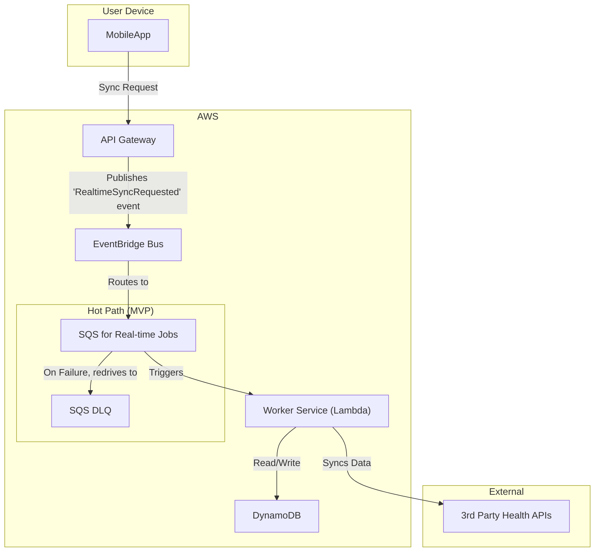
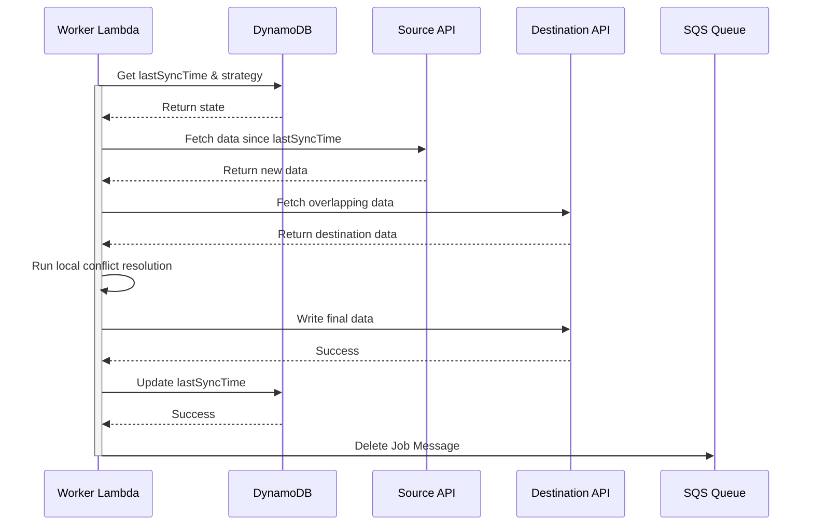
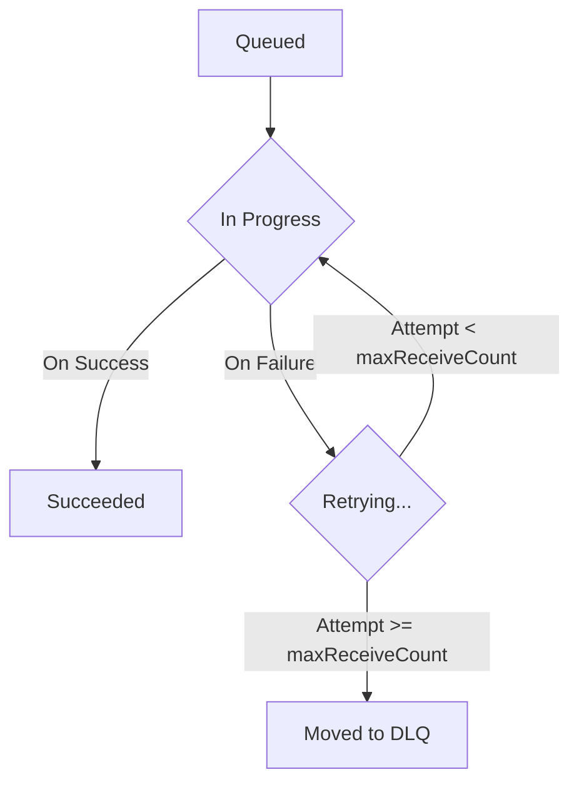

## Dependencies

### Core Dependencies
- `02-product-scope.md` - Product Scope, Personas & MVP Definition
- `06-technical-architecture.md` - Technical Architecture
- `07-apis-integration.md` - APIs & Integration Requirements
- `17-error-handling.md` - Error Handling, Logging & Monitoring
- `30-sync-mapping.md` - Source-Destination Sync Mapping

### Strategic / Indirect Dependencies
- `01-context-vision.md` - Context & Vision
- `16-performance-optimization.md` - Performance & Scalability
- `31-historical-data.md` - Historical Data Handling
- `40-error-recovery.md` - Error Recovery & Troubleshooting

---

# PRD Section 5: Data Synchronization & Reliability

## 1. Executive Summary

This document provides the detailed technical and functional specification for SyncWell's core data synchronization engine. The primary objective is to create a highly reliable, secure, and efficient system for transferring health data. The success of the entire application is fundamentally dependent on the robustness and integrity of this engine.

This document serves as a blueprint for the **product and engineering teams**, detailing the specific architecture, algorithms, and policies required. A well-defined sync engine is the most critical and complex component of the project; this specification aims to de-risk its development by providing a clear and comprehensive plan.

## 2. Sync Engine Architecture (MVP)

The data synchronization engine for the MVP is a server-side, event-driven system built on AWS, as defined in `06-technical-architecture.md`. The architecture is designed for reliability and is focused exclusively on the **"Hot Path"** for handling syncs of recent data.

*   **Hot Path (for Real-time Syncs):** This path is optimized for low-latency, high-volume, short-lived sync jobs. It uses an SQS queue to reliably buffer requests and decouple the API from the workers.
*   **Post-MVP (Cold Path):** The architecture for long-running historical data backfills (the "Cold Path") is a post-MVP feature. The detailed design, which uses AWS Step Functions, is captured in `45-future-enhancements.md`.

The core components for the MVP are:
*   **`API Gateway`:** The public-facing entry point. It uses **direct service integrations** to validate requests and publish events, enhancing performance and reducing cost.
*   **`EventBridge Event Bus`:** The central nervous system. It receives `RealtimeSyncRequested` events directly from API Gateway and routes them to the SQS queue.
*   **`SQS Queue`:** A primary, durable SQS queue that acts as a critical buffer for real-time sync jobs, absorbing traffic spikes and ensuring no jobs are lost.
*   **`SQS Dead-Letter Queue (DLQ)`:** A secondary SQS queue configured as the DLQ for the primary queue. If a `WorkerLambda` fails to process a message after multiple retries, SQS automatically moves the message here for analysis.
*   **`Worker Service (AWS Lambda)`:** The heart of the engine. A serverless function running on AWS Lambda that contains the core sync logic, invoked by SQS messages.
*   **`DataProvider` (Interface):** A standardized interface within the worker code that each third-party integration must implement.
*   **`Conflict Resolution Engine`:** A component within the worker that resolves data conflicts using simple, deterministic rules.
*   **`DynamoDB`:** The `SyncWellMetadata` table stores all essential state for the sync process.

## 3. The Synchronization Algorithm (Server-Side Delta Sync for MVP)

The `Worker Lambda` will follow this algorithm for each job pulled from the SQS queue:

1.  **Job Dequeue:** The Lambda function receives a job message (e.g., "Sync Steps for User X from Fitbit to Google Fit").
2.  **Get State from DynamoDB:** The worker task performs a `GetItem` call on the `SyncWellMetadata` table to retrieve the `SyncConfig` item. This read provides the `lastSyncTime` and the user's chosen `conflictResolutionStrategy`.
3.  **Fetch New Data:** It calls the `fetchData(since: lastSyncTime, dataType: job.dataType)` method on the source `DataProvider`. The `dataType` (e.g., "steps", "workouts") is retrieved from the job payload.
4.  **Fetch Destination Data for Conflict Resolution:** To enable conflict resolution, the worker fetches potentially overlapping data from the destination `DataProvider`, again specifying the `dataType`. The time range for this query will be the exact time range of the new data fetched from the source.
5.  **Conflict Resolution:** The `Conflict Resolution Engine` is invoked. It compares the source and destination data and applies the user's chosen strategy (e.g., "Prioritize Source").
6.  **Write Data:** The worker calls the generic `pushData(data: conflictFreeData)` method on the destination provider.
7.  **Handle Partial Failures:** The worker **must** inspect the `PushResult` returned from the `pushData` call. For the MVP, if the push is not completely successful, the entire job will be considered failed. The worker will throw an error, allowing SQS to retry the job. This is a safe-by-default strategy.
8.  **Update State in DynamoDB:** Only upon full successful completion, the worker performs an `UpdateItem` call on the `SyncConfig` item in `SyncWellMetadata` to set the new `lastSyncTime`.
9.  **Delete Job Message:** The worker deletes the job message from the SQS queue to mark it as complete.

## 4. Conflict Resolution Engine (MVP)

For the MVP, the engine is designed to be simple, reliable, and deterministic. It offers a limited set of rules-based strategies. The advanced "AI-Powered Merge" feature is a post-MVP enhancement, with its design captured in `45-future-enhancements.md`.

### 4.1. Conflict Detection Algorithm

A conflict is detected if a `source` activity and a `destination` activity have time ranges that overlap by more than a configured threshold (defaulting to **60 seconds**).

### 4.2. Resolution Strategies (MVP)

*   **`Prioritize Source` (Default):** New data from the source platform will always overwrite any existing data in the destination for the same time period.
*   **`Prioritize Destination`:** Never overwrite existing data. If a conflicting entry is found in the destination, the source entry is ignored.

## 5. Data Integrity

*   **Durable Queueing & Idempotency:** The combination of SQS and Lambda guarantees that a real-time sync job will be processed "at-least-once". To prevent duplicate processing, the system uses a robust, end-to-end idempotency strategy based on a client-generated `Idempotency-Key`, as defined in `06-technical-architecture.md`.
*   **Transactional State:** State updates in DynamoDB are atomic. The `lastSyncTime` is only updated if the entire write operation to the destination platform succeeds.
*   **Dead Letter Queue (DLQ):** If a job fails repeatedly (e.g., due to a persistent third-party API error), SQS will automatically move it to a DLQ. This allows for manual inspection and debugging without blocking the main queue.

## 5a. Historical Data Sync (Post-MVP)

Handling a user's request to sync several years of historical data is a key feature planned for a post-MVP release. It requires a more complex "Cold Path" architecture using AWS Step Functions to ensure reliability over long-running jobs. The detailed specification for this feature is deferred and captured in `45-future-enhancements.md`.

## 6. Functional & Non-Functional Requirements
*(Unchanged)*

## 7. Risk Analysis & Mitigation
*(Unchanged)*

## 8. Visual Diagrams

### Sync Engine Architecture (MVP)

### Sequence Diagram for Delta Sync (MVP)

### Lifecycle of a Hot Path Sync Job Message
*(This diagram illustrates the lifecycle of a single message in the SQS queue, not an AWS Step Functions state machine)*

## 9. Research & Recommendations on AI/Agentic Workflows

As part of a research spike, we evaluated several tools to enhance the project's AI capabilities, specifically for the `AI Insights Service`.

*   **Tools Considered:**
    *   **n8n:** A workflow automation tool. Evaluated as not suitable for the core product's real-time, custom-coded sync engine.
    *   **LangChain:** A framework for developing LLM-powered applications. This was already included in the technical architecture and remains the recommended tool for straightforward LLM interactions (like generating user summaries).
    *   **crewAI:** A framework for orchestrating multiple collaborating AI agents. Evaluated as overkill for the current scope of AI features.
    *   **LangGraph:** An extension of LangChain for building stateful, multi-step AI agents.

*   **Recommendation:**
    *   We recommend **LangGraph** for implementing the `Interactive AI Troubleshooter` feature, as specified in `06-technical-architecture.md` and `24-user-support.md`.
    *   **Rationale:** LangGraph's ability to model conversational flows as a graph is a perfect fit for a troubleshooting agent that needs to ask clarifying questions, remember context, and guide a user through a decision tree. This provides a more robust and powerful user experience than a simple, single-call LLM.

*(Section 10 has been removed to align with the decision to standardize on the AWS-native serverless architecture and avoid the operational complexity of a self-hosted open-source stack.)*
