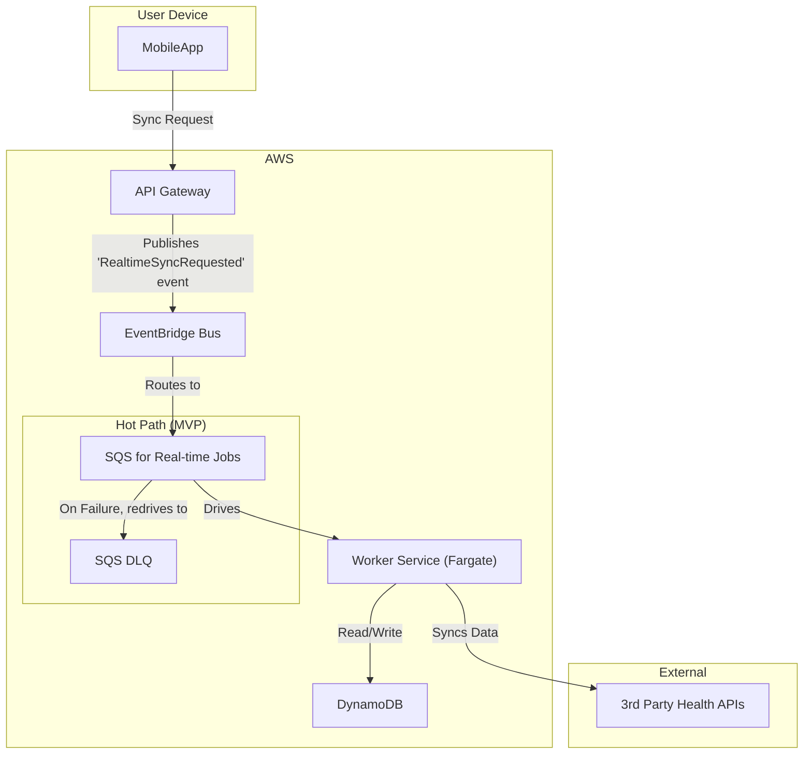
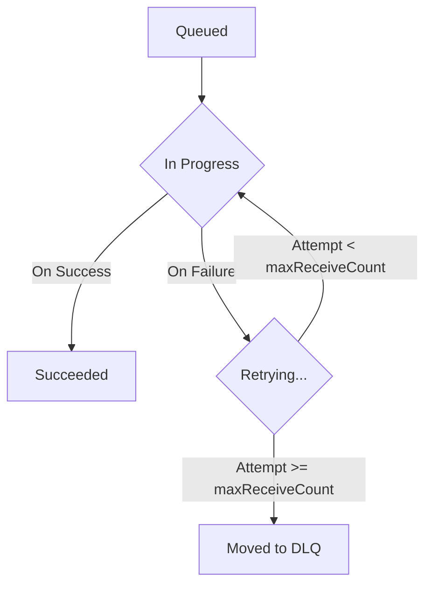
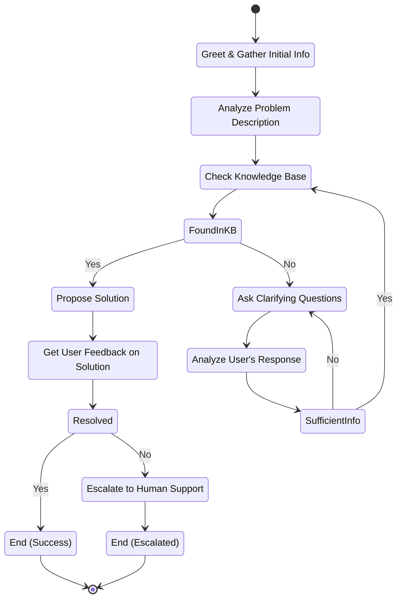

## Dependencies

### Core Dependencies
- `02-product-scope.md` - Product Scope, Personas & MVP Definition
- `06-technical-architecture.md` - Technical Architecture
- `07-apis-integration.md` - APIs & Integration Requirements
- `17-error-handling.md` - Error Handling, Logging & Monitoring
- `30-sync-mapping.md` - Source-Destination Sync Mapping

### Strategic / Indirect Dependencies
- `01-context-vision.md` - Context & Vision
- `16-performance-optimization.md` - Performance & Scalability
- `31-historical-data.md` - Historical Data Handling
- `40-error-recovery.md` - Error Recovery & Troubleshooting

---

# PRD Section 5: Data Synchronization & Reliability

## 1. Executive Summary

This document provides the detailed technical and functional specification for SyncWell's core data synchronization engine. The primary objective is to create a highly reliable, secure, and efficient system for transferring health data. The success of the entire application is fundamentally dependent on the robustness and integrity of this engine.

This document serves as a blueprint for the **product and engineering teams**, detailing the specific architecture, algorithms, and policies required. A well-defined sync engine is the most critical and complex component of the project; this specification aims to de-risk its development by providing a clear and comprehensive plan.

## 2. Sync Engine Architecture (MVP)

The data synchronization engine for the MVP is a server-side, event-driven system built on AWS, as defined in `06-technical-architecture.md`. The architecture is designed for reliability and is focused exclusively on the **"Hot Path"** for handling syncs of recent data. It incorporates a multi-faceted sync strategy to optimize for cost and performance:
*   **Webhook-First Model:** For providers that support it, a push-based webhook model provides the most efficient, real-time syncs.
*   **Tiered Sync Frequency:** For polling-based providers, sync frequency is aligned with the user's subscription tier.
*   **Adaptive Polling:** To further optimize polling, an intelligent adaptive polling mechanism is used to adjust sync frequency based on user activity.
These strategies are detailed in the main technical architecture document.

*   **Hot Path (for Real-time Syncs):** This path is optimized for low-latency, high-volume, short-lived sync jobs. It uses an SQS queue to reliably buffer requests and decouple the API from the workers.
*   **Post-MVP (Cold Path):** The architecture for long-running historical data backfills (the "Cold Path") is a post-MVP feature. The detailed design, which uses AWS Step Functions, is captured in `45-future-enhancements.md`.

The core components for the MVP are:
*   **`API Gateway`:** The public-facing entry point. It uses **direct service integrations** to validate requests and publish events, enhancing performance and reducing cost.
*   **`EventBridge Event Bus`:** The central nervous system. It receives `RealtimeSyncRequested` events directly from API Gateway and routes them to the SQS queue.
*   **`SQS Queue`:** A primary, durable SQS queue that acts as a critical buffer for real-time sync jobs, absorbing traffic spikes and ensuring no jobs are lost.
*   **`SQS Dead-Letter Queue (DLQ)`:** A secondary SQS queue configured as the DLQ for the primary queue. If a `WorkerFargateTask` fails to process a message after multiple retries, SQS automatically moves the message here for analysis.
*   **`Worker Service (AWS Fargate)`:** The heart of the engine. A containerized service running on AWS Fargate that contains the core sync logic, invoked by SQS messages.
*   **`DataProvider` (Interface):** A standardized interface within the worker code that each third-party integration must implement.
*   **`Conflict Resolution Engine`:** A component within the worker that resolves data conflicts using simple, deterministic rules.
*   **`DynamoDB`:** The `SyncWellMetadata` table stores all essential state for the sync process.

## 3. The Synchronization Algorithm (Server-Side Delta Sync for MVP)

The `Worker Fargate Task` will follow this algorithm for each job pulled from the SQS queue:

1.  **Job Dequeue:** The Fargate task receives a job message (e.g., "Sync Steps for User X from Fitbit to Google Fit").
2.  **Get State from DynamoDB:** The worker task performs a `GetItem` call on the `SyncWellMetadata` table to retrieve the `SyncConfig` item. This read provides the `lastSyncTime` and the user's chosen `conflictResolutionStrategy`.
3.  **Fetch New Data:** It calls the `fetchData(since: lastSyncTime, dataType: job.dataType)` method on the source `DataProvider`. The `dataType` (e.g., "steps", "workouts") is retrieved from the job payload.
4.  **Fetch Destination Data for Conflict Resolution:** To enable conflict resolution, the worker fetches potentially overlapping data from the destination `DataProvider`, again specifying the `dataType`. The time range for this query will be the exact time range of the new data fetched from the source.
5.  **Conflict Resolution:** The `Conflict Resolution Engine` is invoked. It compares the source and destination data and applies the user's chosen strategy (e.g., "Prioritize Source").
6.  **Write Data:** The worker calls the generic `pushData(data: conflictFreeData)` method on the destination provider.
7.  **Handle Partial Failures:** The worker **must** inspect the `PushResult` returned from the `pushData` call. For the MVP, if the push is not completely successful, the entire job will be considered failed. The worker will throw an error, allowing SQS to retry the job. This is a safe-by-default strategy. It is expected that on the subsequent retry, the entire batch of data will be re-processed. Destination systems are responsible for providing their own idempotency (e.g., based on activity timestamp and source ID) to prevent data duplication.
8.  **Update State in DynamoDB:** Only upon full successful completion, the worker performs an `UpdateItem` call on the `SyncConfig` item in `SyncWellMetadata` to set the new `lastSyncTime`.
9.  **Delete Job Message:** The worker deletes the job message from the SQS queue to mark it as complete.

## 4. Conflict Resolution Engine (MVP)

For the MVP, the engine is designed to be simple, reliable, and deterministic. It offers a limited set of rules-based strategies. The advanced "AI-Powered Merge" feature is a post-MVP enhancement, with its design captured in `45-future-enhancements.md`.

### 4.1. Conflict Detection Algorithm

A conflict is detected if a `source` activity and a `destination` activity have time ranges that overlap by more than a configured threshold (defaulting to **60 seconds**). This threshold is a global setting managed in AWS AppConfig.

### 4.2. Resolution Strategies (MVP)

*   **`Prioritize Source` (Default):** New data from the source platform will always overwrite any existing data in the destination for the same time period.
*   **`Prioritize Destination`:** Never overwrite existing data. If a conflicting entry is found in the destination, the source entry is ignored.

## 5. Data Integrity

*   **Durable Queueing & Idempotency:** The combination of SQS and Fargate guarantees that a real-time sync job will be processed "at-least-once". To prevent duplicate processing, the system uses a robust, end-to-end idempotency strategy based on a client-generated `Idempotency-Key`, as defined in `06-technical-architecture.md`.
*   **Transactional State:** State updates in DynamoDB are atomic. The `lastSyncTime` is only updated if the entire write operation to the destination platform succeeds.
*   **Dead Letter Queue (DLQ):** If a job fails repeatedly (e.g., due to a persistent third-party API error), SQS will automatically move it to a DLQ. This allows for manual inspection and debugging without blocking the main queue.

## 5a. Historical Data Sync (Post-MVP)

Handling a user's request to sync several years of historical data is a key feature planned for a post-MVP release. It requires a more complex "Cold Path" architecture using AWS Step Functions to ensure reliability over long-running jobs. The detailed specification for this feature is deferred and captured in `45-future-enhancements.md`.

## 5b. User Support Flow for DLQ Messages

When a sync job permanently fails and is moved to the Dead-Letter Queue (DLQ), it represents a failure that the system could not automatically resolve. These cases require manual intervention and clear user communication.

*   **Monitoring & Alerting:** An AWS CloudWatch alarm MUST be configured to trigger when the `ApproximateNumberOfMessagesVisible` metric for the DLQ is greater than zero. This alarm will notify the on-call support engineer via PagerDuty.
*   **Investigation Process:**
    1.  The support engineer will manually inspect the message contents in the DLQ to identify the `userId`, `connectionId`, and the error message.
    2.  The engineer will use this information to look up the error details in the centralized logging system (e.g., CloudWatch Logs).
    3.  The goal is to determine if the failure is due to a bug in SyncWell, an issue with a third-party API, or a problem with the user's account (e.g., corrupted data at the source).
*   **User Communication & SLA:**
    *   **SLA:** The user MUST be contacted within **24 hours** of the initial failure.
    *   **Communication:** The user will be contacted via email. The support ticket will be tracked in the primary CRM (e.g., Zendesk). The communication should be transparent, explaining that a sync failed and that the team is investigating.
    *   **Resolution:** Once the root cause is identified, the support engineer will work to resolve the issue. This may involve asking the user to re-authenticate their connection or, in the case of a bug, creating a high-priority ticket for the engineering team.
*   **[NEEDS_CLARIFICATION: Q-06] Legal & Compliance Review:** The process of manually inspecting user sync jobs, even if it only involves metadata, has privacy implications. This entire DLQ handling and user notification process MUST be reviewed by a legal and data privacy expert before the system is launched to ensure compliance with regulations like GDPR.
*   **[REC-MED-04] Draft User Support Playbook for DLQ:**
    *   **Objective:** To provide a clear, step-by-step process for support engineers to resolve failed sync jobs from the DLQ.
    *   **Triage Steps:**
        1.  **Identify Error Type:** From the PagerDuty alert, open the message in the SQS DLQ console. Examine the `errorMessage` attribute.
        2.  **Check for Known Issues:** Search the internal knowledge base (e.g., Confluence) for the error message to see if this is a known, ongoing incident.
        3.  **Categorize the Error:**
            *   **Category 1: Third-Party API Failure (e.g., `5xx` error from a partner API):** Check the partner's public status page. If there is a known outage, link the support ticket to the master incident ticket. No immediate user action is needed beyond the initial notification.
            *   **Category 2: Bad Data (e.g., `400 Bad Request`):** This indicates a likely bug in our `DataProvider` (we sent malformed data) or an unannounced breaking change in the partner's API. This is high priority. The message should be re-queued for processing later, and a P1 bug ticket must be filed with the full message payload for engineering to analyze.
            *   **Category 3: Authentication Failure (e.g., `401 Unauthorized`):** This should be rare, as the main error handling flow should catch this. If it appears in the DLQ, it may indicate a bug in our auth error handling. The user may need to be prompted to reconnect, but engineering should investigate the root cause.
    *   **Communication Templates:**
        *   **Initial Contact (24hr SLA):** "Hi [User], we're writing to let you know that a recent data sync from [Source] to [Destination] failed due to an unexpected error. Our engineering team is investigating the issue. We will update you as soon as we have more information. We apologize for the inconvenience."
        *   **Resolution (Bug Fix):** "Hi [User], we've resolved the issue that caused your sync to fail. We have re-processed the data, and everything should now be up to date. Please let us know if you see any other problems."
        *   **Resolution (User Action Needed):** "Hi [User], to resolve the issue with your [Source] connection, please go to Settings > Connected Apps in the SyncWell app, disconnect [Source], and then reconnect it. This will refresh your credentials and should fix the problem."

## 6. Functional & Non-Functional Requirements
*(Unchanged)*

## 7. Risk Analysis & Mitigation
*(Unchanged)*

## 8. Visual Diagrams

### Sync Engine Architecture (MVP)
This diagram illustrates the flow of a real-time sync request through the event-driven, serverless architecture. The components are designed to be decoupled, scalable, and resilient.

1.  **Request Initiation (`MobileApp`)**: The user initiates a sync from the mobile application. The app sends a secure HTTPS request to the API Gateway endpoint.
2.  **Ingestion & Decoupling (`API Gateway` -> `EventBridge`)**: The API Gateway validates the request and, using a direct service integration, publishes a `RealtimeSyncRequested` event to the EventBridge bus. This decouples the client-facing API from the backend processing.
3.  **Buffering (`EventBridge` -> `HotQueue`)**: An EventBridge rule filters for these events and routes them to the primary SQS queue (`HotQueue`). This queue acts as a durable buffer, absorbing traffic spikes and ensuring no sync jobs are lost.
4.  **Processing (`HotQueue` -> `WorkerFargateTask`)**: The SQS queue is polled by the `WorkerFargateTask`. This containerized service contains the core business logic to perform the synchronization as detailed in "The Synchronization Algorithm".
5.  **State Management & Data Sync (`WorkerFargateTask` -> `DynamoDB` & `ThirdPartyAPIs`)**: The worker reads and writes state information (like `lastSyncTime`) from DynamoDB and communicates with the external third-party APIs to fetch and push health data.
6.  **Fault Tolerance (`HotQueue` -> `DLQ_SQS`)**: If the `WorkerFargateTask` fails to process a message after multiple retries (due to a persistent error), the message is automatically moved from the `HotQueue` to the Dead-Letter Queue (`DLQ_SQS`) for manual inspection by support engineers. This prevents a single "poison pill" message from blocking the entire sync pipeline.

### Sequence Diagram for Delta Sync (MVP)

This diagram details the step-by-step interaction between the `Worker Lambda` and other services
during a single, successful delta sync job. This sequence is the core of the synchronization
algorithm defined in Section 3 of 05-data-sync.md.

1.  Get State (`Get lastSyncTime & strategy`): The worker begins by retrieving the `SyncConfig` item from DynamoDB. This provides the `lastSyncTime`, which acts as a high-water mark, and the user's chosen `conflictResolutionStrategy`.
2.  Fetch from Source (`Fetch data since lastSyncTime`): Using the `lastSyncTime`, the worker calls the source `DataProvider` to fetch only the new data that has arrived since the last successful sync.
3.  Fetch from Destination (`Fetch overlapping data`): To prepare for conflict resolution, the worker fetches data from the destination provider for the exact time range covered by the new source data. This is necessary to detect potential overwrites or duplicates.
4.  Resolve Conflicts (`Run local conflict resolution`): The `Conflict Resolution Engine` compares the source and destination datasets. It applies the user's strategy (e.g., "Prioritize Source") to produce a final, conflict-free set of data to be written.
5.  Write to Destination (`Write final data`): The worker pushes the processed data to the destination `DataProvider`. The worker inspects the result of this operation to ensure it was 100% successful.
6.  Update State (`Update lastSyncTime`): Only after a fully successful write, the worker updates the `lastSyncTime` in DynamoDB. This atomic update ensures that if any part of the process fails, the state is not advanced, and the job can be safely retried.
7.  Acknowledge Completion (`Delete Job Message`): The final step is to delete the message from the SQS queue. This signals that the job is complete and prevents it from being processed again.

### Lifecycle of a Hot Path Sync Job Message
*(This diagram illustrates the lifecycle of a single message in the SQS queue, not an AWS Step Functions state machine)*

The following steps detail the journey of a single sync job message, ensuring reliability and fault tolerance through the native features of Amazon SQS.

1.  **Queued:** A `RealtimeSyncRequested` event is routed to the primary SQS queue. The message is now durably stored and waiting to be processed by a worker.
2.  **In Progress:** A `WorkerFargateTask` instance polls the queue and receives the message. Upon receipt, SQS makes the message temporarily invisible to other consumers for a configured `VisibilityTimeout` period. This prevents other workers from processing the same job simultaneously.
3.  **Succeeded:** If the `WorkerFargateTask` successfully completes all steps of the synchronization algorithm (fetching, resolving conflicts, writing data, and updating state), it makes an explicit call to SQS to delete the message from the queue. This marks the job as complete.
4.  **Retrying:** If the worker encounters a transient error (e.g., a temporary network issue, a brief third-party API outage) or a bug, it will throw an exception. It does **not** delete the message. When the `VisibilityTimeout` expires, the message reappears in the queue and can be picked up by another worker for a new attempt. SQS automatically increments the message's internal `ReceiveCount`.
5.  **Moved to DLQ:** The SQS queue is configured with a `maxReceiveCount` threshold (e.g., 5 attempts). If a message fails to be processed successfully after this many attempts, SQS automatically gives up and moves the message to the configured Dead-Letter Queue (DLQ). This "poison pill" handling prevents a single, consistently failing job from blocking the entire sync pipeline. The DLQ can then be inspected by support engineers to diagnose the root cause of the failure.

## 9. Research & Recommendations on AI/Agentic Workflows

As part of a research spike, we evaluated several tools to enhance the project's AI capabilities, specifically for the `AI Insights Service`.

*   **Tools Considered:**
    *   **n8n:** A workflow automation tool. Evaluated as not suitable for the core product's real-time, custom-coded sync engine.
    *   **LangChain:** A framework for developing LLM-powered applications. This was already included in the technical architecture and remains the recommended tool for straightforward LLM interactions (like generating user summaries).
    *   **crewAI:** A framework for orchestrating multiple collaborating AI agents. Evaluated as overkill for the current scope of AI features.
    *   **LangGraph:** An extension of LangChain for building stateful, multi-step AI agents.

*   **Recommendation:**
    *   We recommend **LangGraph** for implementing the `Interactive AI Troubleshooter` feature, as specified in `06-technical-architecture.md` and `24-user-support.md`.
    *   **Rationale:** LangGraph's ability to model conversational flows as a graph is a perfect fit for a troubleshooting agent that needs to ask clarifying questions, remember context, and guide a user through a decision tree. This provides a more robust and powerful user experience than a simple, single-call LLM.
    *   **[C-003]** The diagram below illustrates the proposed state machine for the LangGraph-based AI Troubleshooter.

### AI Troubleshooter State Machine (LangGraph)

The state machine below represents the agent's internal logic. Each node is a step in the process, and the edges represent the flow of conversation based on conditions and user input. The agent's state (e.g., conversation history, extracted entities) is passed between nodes.

1.  **Greet & Gather Info (`GreetUser`)**: The graph's entry point. The agent greets the user and prompts for their issue, establishing the initial conversation state.

2.  **Analyze & Check KB (`AnalyzeProblem`, `CheckKB`)**: This node uses an LLM to analyze the user's free-text problem description. It extracts key entities (e.g., provider names, error messages) and then uses a `Tool` to perform a semantic search against a vector database of our Help Center articles and known issues.

3.  **Decision: Found in KB? (`FoundInKB`)**: This is a conditional edge. Based on the search results from the previous step, the graph routes the conversation:
    *   **Yes:** If a high-confidence match is found, the flow proceeds to `ProposeSolution`.
    *   **No:** If no relevant information is found, the agent needs more context and moves to `AskClarifyingQuestion`.

4.  **Clarification Loop (`AskClarifyingQuestion` -> `AnalyzeUserResponse` -> `SufficientInfo`)**: This is a sub-cycle to gather more information.
    *   The agent uses an LLM to generate a targeted question based on the conversation history.
    *   After the user responds, the new information is added to the state.
    *   A conditional edge (`SufficientInfo`) determines if the agent should re-attempt the KB search (`CheckKB`) or if it needs to ask another question.

5.  **Propose & Verify (`ProposeSolution` -> `GetUserFeedback`)**: The agent presents the potential solution from the knowledge base and asks the user if it worked.

6.  **Decision: Resolved? (`Resolved`)**: This is the final conditional edge based on the user's feedback.
    *   **Yes:** The conversation moves to the `EndSuccess` terminal state.
    *   **No:** The issue is escalated. The agent proceeds to `EscalateToHuman`.

7.  **Escalate to Human (`EscalateToHuman`)**: This node's job is to prepare a seamless handoff. It uses an LLM to generate a concise summary of the entire interaction (user's problem, steps taken, failed solution). This summary is then used to pre-populate a support ticket, which is then passed to the `EndEscalated` state.

