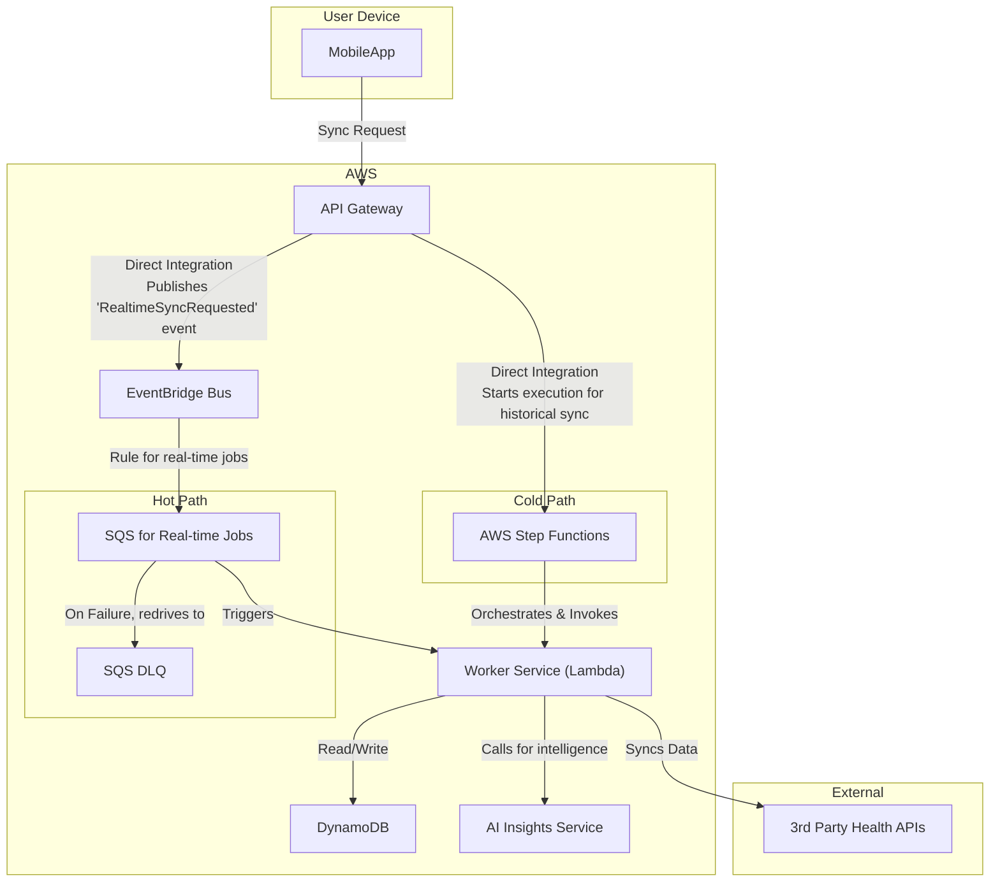
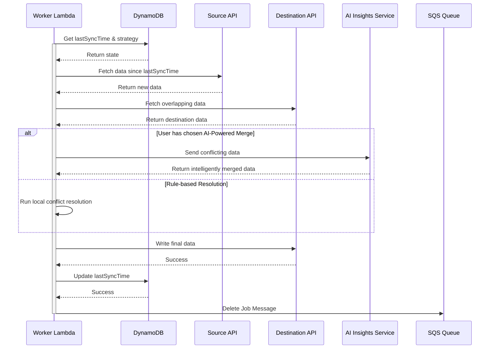
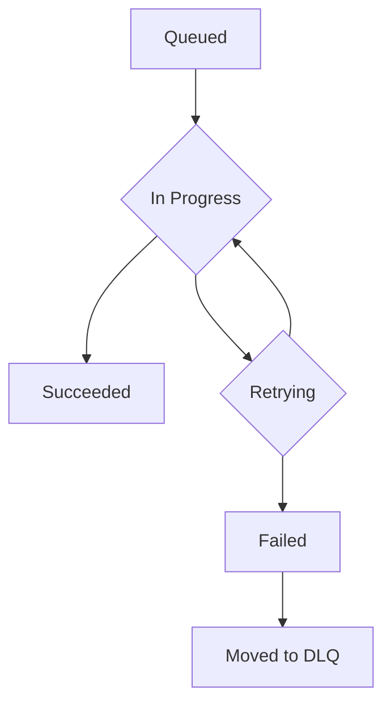

## Dependencies

### Core Dependencies
- `02-product-scope.md` - Product Scope, Personas & MVP Definition
- `06-technical-architecture.md` - Technical Architecture
- `07-apis-integration.md` - APIs & Integration Requirements
- `17-error-handling.md` - Error Handling, Logging & Monitoring
- `30-sync-mapping.md` - Source-Destination Sync Mapping

### Strategic / Indirect Dependencies
- `01-context-vision.md` - Context & Vision
- `16-performance-optimization.md` - Performance & Scalability
- `31-historical-data.md` - Historical Data Handling
- `40-error-recovery.md` - Error Recovery & Troubleshooting

---

# PRD Section 5: Data Synchronization & Reliability

## 1. Executive Summary

This document provides the detailed technical and functional specification for SyncWell's core data synchronization engine. The primary objective is to create a highly reliable, secure, and efficient system for transferring health data. The success of the entire application is fundamentally dependent on the robustness and integrity of this engine.

This document serves as a blueprint for the **product and engineering teams**, detailing the specific architecture, algorithms, and policies required. A well-defined sync engine is the most critical and complex component of the project; this specification aims to de-risk its development by providing a clear and comprehensive plan.

## 2. Sync Engine Architecture

The data synchronization engine is a server-side, event-driven system built on AWS, as defined in `06-technical-architecture.md`. This architecture is designed for massive scale and reliability, separating syncs into two distinct paths:

*   **Hot Path (for Real-time Syncs):** This path is optimized for low-latency, high-volume, short-lived sync jobs. It uses an SQS queue to reliably buffer requests and decouple the API from the workers.
*   **Cold Path (for Historical Syncs):** This path is designed for long-running, complex, and potentially error-prone historical data backfills. It uses AWS Step Functions to orchestrate the entire workflow, providing state management, error handling, and observability.

The core components are:
*   **`API Gateway`:** The public-facing entry point. It uses **direct service integrations** to validate requests and route them to the appropriate path, enhancing performance and reducing cost by removing the need for an intermediate Lambda function.
*   **`EventBridge Event Bus`:** The central nervous system for the hot path. It receives `RealtimeSyncRequested` events directly from API Gateway and routes them to the SQS queue.
*   **`SQS Queue (Hot Path)`:** A primary, durable SQS queue that acts as a critical buffer for real-time sync jobs, absorbing traffic spikes and ensuring no jobs are lost.
*   **`SQS Dead-Letter Queue (DLQ)`:** A secondary SQS queue configured as the DLQ for the primary queue. If a `WorkerLambda` fails to process a message after multiple retries, SQS automatically moves the message here for analysis, preventing it from blocking the main queue.
*   **`AWS Step Functions (Cold Path)`:** A managed workflow orchestrator that manages the entire lifecycle of a historical sync, with executions started directly by API Gateway.
*   **`Worker Service (AWS Lambda)`:** The heart of the engine. A serverless function running on AWS Lambda that contains the core sync logic. It's invoked either in response to SQS messages (for hot path jobs) or by the Step Functions orchestrator (for cold path jobs).
*   **`DataProvider` (Interface):** A standardized interface within the worker code that each third-party integration must implement.
*   **`Smart Conflict Resolution Engine`:** A core component within the worker that intelligently resolves data conflicts before writing.
*   **`DynamoDB`:** The `SyncWellMetadata` table stores all essential state for the sync process.

## 3. The Synchronization Algorithm (Server-Side Delta Sync)

The `Worker Lambda` will follow this algorithm for each job pulled from the SQS queue:

1.  **Job Dequeue:** The Lambda function receives a job message (e.g., "Sync Steps for User X from Fitbit to Google Fit").
2.  **Get State from DynamoDB:** The worker task performs a `GetItem` call on the `SyncWellMetadata` table to retrieve the `SyncConfig` item.
    *   **PK:** `USER#{userId}`
    *   **SK:** `SYNCCONFIG#{sourceId}#to#{destId}#{dataType}`
    *   This single read provides the `lastSyncTime` and the user's chosen `conflictResolutionStrategy`.
3.  **Fetch New Data:** It calls the `fetchData(since: lastSyncTime)` method on the source `DataProvider` (e.g., `FitbitProvider`). If new data is found, the algorithm proceeds.
4.  **Fetch Destination Data for Conflict Resolution:** To enable conflict resolution, the worker fetches potentially overlapping data from the destination `DataProvider`. The time range for this query is calculated based on the timestamps of the new data fetched from the source, plus a small buffer to account for potential clock skew (e.g., `[min_source_timestamp - 5_minutes, max_source_timestamp + 5_minutes]`). (Note: This buffer is a configurable parameter that will be tuned based on real-world clock skew observations.)
5.  **Smart Conflict Resolution:** The `Smart Conflict Resolution Engine` is invoked. It compares the source and destination data and applies the user's chosen strategy. If the strategy is `AI-Powered Merge`, it calls the **AI Insights Service**. It outputs a final, clean list of data points to be written.
6.  **Write Data:** The worker calls the `writeData()` method on the destination provider with the conflict-free data.
7.  **Update State in DynamoDB:** Upon successful completion, the worker performs an `UpdateItem` call on the `SyncConfig` item in `SyncWellMetadata` to set the new `lastSyncTime` for the connection.
8.  **Delete Job Message:** The worker deletes the job message from the SQS queue to mark it as complete.

## 4. Smart Conflict Resolution Engine

This engine is a core feature of SyncWell, designed to eliminate data duplication and loss. It offers several strategies that Pro users can choose from, catering to our key user personas. For "Sarah," who values simplicity, the default `Prioritize Source` is a "set it and forget it" solution. For "Alex," who wants ultimate control, the ability to choose a strategy, especially the `AI-Powered Merge`, is a key differentiator.

### 4.1. Conflict Detection Algorithm

Before the engine can resolve a conflict, it must first detect one. A conflict that is eligible for the `AI-Powered Merge` strategy is detected using the following algorithm:

1.  **Candidate Selection:** The algorithm considers new activities fetched from the `source` and potentially overlapping activities from the `destination`.
2.  **Time Overlap Check:** A conflict is identified if a `source` activity and a `destination` activity have time ranges that overlap by more than a configured threshold (defaulting to **60 seconds** to account for minor recording discrepancies). This value will be tuned based on provider-specific behavior.
3.  **Activity Type Match:** The overlapping activities must be of a compatible type. For example, a "Run" can be compared with another "Run", but a "Run" and a "Swim" at the same time are considered two distinct valid activities, not a conflict.
4.  **Exclusion of Exact Duplicates:** If the two overlapping activities have the same `sourceId` and `sourceProvider`, they are considered an exact technical duplicate (e.g., from a re-sync of the same data) and are not sent for AI resolution. The duplicate is simply ignored.

Only if all these conditions are met are the two activity records sent to the AI Insights Service for an intelligent merge.

### 4.2. Resolution Strategies

*   **`Prioritize Source`:** The default behavior. New data from the source platform will always overwrite any existing data in the destination for the same time period.
*   **`Prioritize Destination`:** Never overwrite existing data. If a conflicting entry is found in the destination, the source entry is ignored.
*   **`AI-Powered Merge` (Activities Only - Pro Feature):** This advanced strategy uses a machine learning model to create the best possible "superset" of the data. Instead of fixed rules, it makes an intelligent prediction.
    *   **Data Privacy & Anonymization:** To protect user privacy, all data sent to the AI service for merging **must** be anonymized in real-time. The detailed technical implementation of this critical privacy feature, including the real-time anonymization proxy, latency considerations, and PII stripping strategy, is specified in `06-technical-architecture.md`, Section "Real-Time Anonymization for Operational AI".
    *   **API Contract:** The request from the worker to the Anonymizer Proxy will conform to the following contract:
        ```
        // POST /v1/merge-activities
        {
          "sourceActivity": { ... }, // CanonicalWorkout model
          "destinationActivity": { ... } // CanonicalWorkout model
        }
        ```
        The expected success response will be:
        ```
        // 200 OK
        {
          "mergedActivity": { ... } // CanonicalWorkout model
        }
        ```
    *   **Intelligence:** The service's ML model, trained on thousands of examples of merged activities, analyzes the data. It might learn, for example, that a user's Garmin device provides more reliable GPS data, while their Wahoo chest strap provides more accurate heart rate data.
    *   **Output:** The AI service returns a single, merged activity record that combines the best attributes of both sources. For example, it could take the GPS track from a Garmin device and combine it with Heart Rate data from a Wahoo chest strap for the same activity, creating a single, more complete workout file. This is far more flexible and powerful than hard-coded rules.
    *   **Fallback Mechanism:** **Reliability of the core sync is paramount.** If the `AI Insights Service` is unavailable, times out, or returns an error, the Conflict Resolution Engine **will not fail the sync job**. Instead, it will log the error and automatically fall back to the default `Prioritize Source` strategy.
    *   **User Transparency:** To ensure transparency for this premium feature, the result of the sync job will be stored in a `SyncHistory` record with a `resolution` attribute set to either `AI_MERGE` or `FALLBACK_PRIORITIZE_SOURCE`. The mobile client will read this history and display an informational icon next to any sync that used the fallback, with a tooltip explaining what happened. This maintains a high level of trust with our paying users.

## 5. Data Integrity

*   **Durable Queueing & Idempotency:** The combination of SQS and Lambda guarantees that a real-time sync job will be processed "at-least-once". To prevent duplicate processing in the rare case of a message being delivered more than once, the system uses a robust, end-to-end idempotency strategy. As defined in `06-technical-architecture.md`, a unique `Idempotency-Key` generated by the client is passed through the entire system. The worker task checks for this key in a central store before processing to ensure the job has not already been completed, guaranteeing at-most-once processing.
*   **Transactional State:** State updates in DynamoDB are atomic. The `lastSyncTime` is only updated if the entire write operation to the destination platform succeeds.
*   **Dead Letter Queue (DLQ):** If a job fails repeatedly (e.g., due to a persistent third-party API error or a problem with the AI service), SQS will automatically move it to a DLQ. This allows for manual inspection and debugging without blocking the main queue.

## 5a. Historical Data Sync (`cold-path`)

Handling a user's request to sync several years of historical data (User Story **US-10**) presents a significant challenge. A single, long-running job is brittle and prone to failure. To address this, we will use **AWS Step Functions**, a managed workflow orchestrator that aligns with our serverless-first architecture.

1.  **Workflow Orchestration with AWS Step Functions:** When a user requests a historical sync via the API, a direct integration between **API Gateway and AWS Step Functions** initiates a new execution of a pre-defined state machine. This approach provides superior reliability, state management, and observability compared to a manual orchestration solution, while reducing cost and latency by removing an unnecessary Lambda invocation.

2.  **State Machine Logic:** The state machine, as detailed in `06-technical-architecture.md`, will perform the following steps:
    *   **Initiate and Chunk Sync Job:** A Lambda function prepares the sync. To avoid timeouts and handle users with high data density, a **dynamic chunking algorithm** is used instead of a fixed time window. The logic is as follows:
        1.  The function first queries the source provider for an estimated count of records in the requested historical date range.
        2.  It then divides this total count by a maximum number of records per chunk (e.g., 5,000 records), a configurable value.
        3.  This calculation determines the total number of chunks required. The state machine will then be invoked to process this array of chunks, where each chunk is defined by a start and end date calculated to contain approximately the maximum number of records.
        4.  This dynamic approach ensures that chunks for a very active user cover shorter time periods, while chunks for a less active user cover longer periods, optimizing for a consistent job size rather than a fixed duration.
    *   **Map State for Parallel Processing:** The state machine will use a `Map` state to iterate over the array of chunks. This allows for parallel execution of the sync task for each chunk, dramatically improving performance.
    *   **Process One Chunk:** For each chunk, a dedicated `Worker Lambda` function is invoked. It fetches the data from the source, transforms it, and writes it to the destination. This use of Lambda is ideal for the highly parallel, on-demand nature of this task.
    *   **Built-in Error Handling & Retries:** Step Functions provides robust, configurable retry logic for transient errors. If a chunk fails repeatedly, it can be caught and logged to a Dead-Letter Queue without halting the entire workflow.
    *   **Finalize Sync:** Once all chunks are processed, a final Lambda function updates the overall job status to `COMPLETED`.

3.  **Progress Tracking:** The Step Functions execution itself serves as the progress record. The mobile app can query a backend API that uses the `DescribeExecution` API call to get the current status, number of completed chunks, and overall progress of the historical sync.

4.  **Rate Limiting & Throttling:** The `Cold-Path Worker Tasks` invoked by Step Functions are subject to the same third-party API rate limits. The rate-limiting service will prioritize `hot-path` (real-time) syncs over these `cold-path` jobs.

*(Note: This section directly impacts `31-historical-data.md` and `16-performance-optimization.md`, which will be updated to reflect this AWS Step Functions-based strategy.)*

## 6. Functional & Non-Functional Requirements
*(Unchanged)*

## 7. Risk Analysis & Mitigation
*(Unchanged)*

## 8. Visual Diagrams

### Sync Engine Architecture


### Sequence Diagram for Delta Sync (with AI-Powered Merge)


### State Machine for a Sync Job
*(Unchanged)*


## 9. Research & Recommendations on AI/Agentic Workflows

As part of a research spike, we evaluated several tools to enhance the project's AI capabilities, specifically for the `AI Insights Service`.

*   **Tools Considered:**
    *   **n8n:** A workflow automation tool. Evaluated as not suitable for the core product's real-time, custom-coded sync engine.
    *   **LangChain:** A framework for developing LLM-powered applications. This was already included in the technical architecture and remains the recommended tool for straightforward LLM interactions (like generating user summaries).
    *   **crewAI:** A framework for orchestrating multiple collaborating AI agents. Evaluated as overkill for the current scope of AI features.
    *   **LangGraph:** An extension of LangChain for building stateful, multi-step AI agents.

*   **Recommendation:**
    *   We recommend **LangGraph** for implementing the `Interactive AI Troubleshooter` feature, as specified in `06-technical-architecture.md` and `24-user-support.md`.
    *   **Rationale:** LangGraph's ability to model conversational flows as a graph is a perfect fit for a troubleshooting agent that needs to ask clarifying questions, remember context, and guide a user through a decision tree. This provides a more robust and powerful user experience than a simple, single-call LLM.

*(Section 10 has been removed to align with the decision to standardize on the AWS-native serverless architecture and avoid the operational complexity of a self-hosted open-source stack.)*
