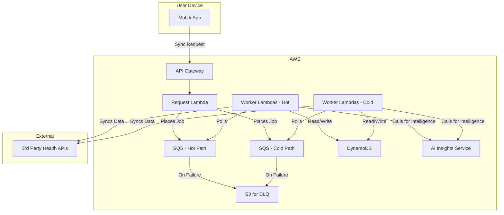
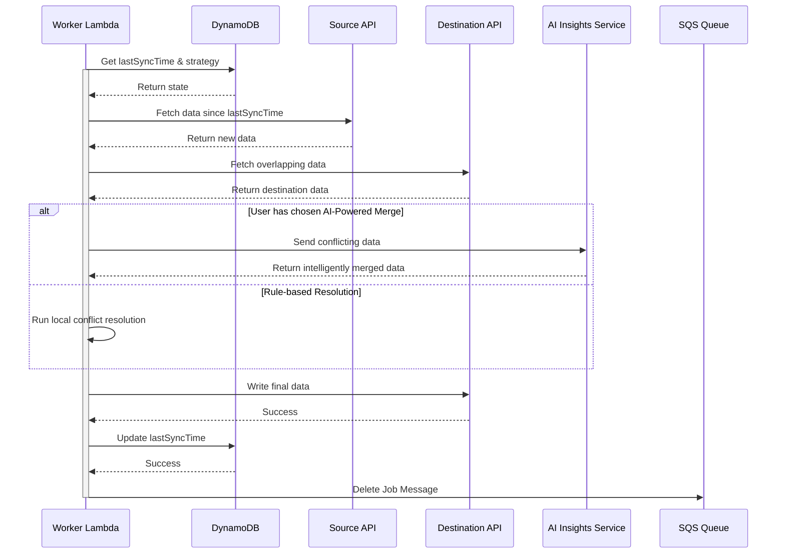
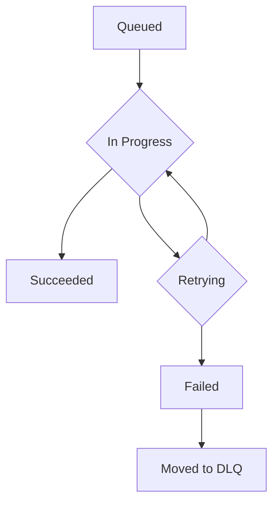

## Dependencies

### Core Dependencies
- `02-product-scope.md` - Product Scope, Personas & MVP Definition
- `06-technical-architecture.md` - Technical Architecture
- `07-apis-integration.md` - APIs & Integration Requirements
- `17-error-handling.md` - Error Handling, Logging & Monitoring
- `30-sync-mapping.md` - Source-Destination Sync Mapping

### Strategic / Indirect Dependencies
- `01-context-vision.md` - Context & Vision
- `16-performance-optimization.md` - Performance & Scalability
- `31-historical-data.md` - Historical Data Handling
- `40-error-recovery.md` - Error Recovery & Troubleshooting

---

# PRD Section 5: Data Synchronization & Reliability

## 1. Executive Summary

This document provides the detailed technical and functional specification for SyncWell's core data synchronization engine. The primary objective is to create a highly reliable, secure, and efficient system for transferring health data. The success of the entire application is fundamentally dependent on the robustness and integrity of this engine.

This document serves as a blueprint for the **product and engineering teams**, detailing the specific architecture, algorithms, and policies required. A well-defined sync engine is the most critical and complex component of the project; this specification aims to de-risk its development by providing a clear and comprehensive plan.

## 2. Sync Engine Architecture

The data synchronization engine is a server-side, event-driven system built on AWS, as defined in `06-technical-architecture.md`. This architecture is designed for massive scale and reliability, separating real-time and historical syncs into "hot" and "cold" paths.

*   **`API Gateway` + `Request Lambda`:** The public-facing entry point. The mobile app calls this endpoint to request a sync. The Lambda validates the request and places a job message into the appropriate SQS queue (hot or cold path).
*   **`SQS Queues`:** Two primary, durable queues (one for real-time, one for historical) act as a buffer, ensuring sync jobs are never lost.
*   **`Worker Lambdas`:** The heart of the engine. A fleet of serverless functions that pull jobs from the queues and execute them. Each worker is responsible for the full lifecycle of a single sync job.
*   **`DataProvider` (Interface):** A standardized interface within the worker code that each third-party integration (Fitbit, Garmin, etc.) must implement.
*   **`Smart Conflict Resolution Engine`:** A core component within the worker lambda that analyzes data from the source and destination to intelligently resolve conflicts before writing. This engine can now leverage the **AI Insights Service**.
*   **`AI Insights Service`:** As detailed in the technical architecture, this service provides ML and LLM-powered intelligence, including advanced conflict resolution models.
*   **`DynamoDB`:** The **`SyncWellMetadata`** table is used to store all essential, non-ephemeral state for the sync process. This includes user configurations, connection status, and sync metadata. Its single-table design is detailed in `06-technical-architecture.md`.
*   **`S3 for Dead-Letter Queues`**: Messages that fail processing repeatedly are sent to a Dead-Letter Queue (DLQ) and stored in an S3 bucket for analysis and manual reprocessing.

## 3. The Synchronization Algorithm (Server-Side Delta Sync)

The `Worker Lambda` will follow this algorithm for each job pulled from the SQS queue:

1.  **Job Dequeue:** The worker receives a job message (e.g., "Sync Steps for User X from Fitbit to Google Fit").
2.  **Get State from DynamoDB:** The worker performs a `GetItem` call on the `SyncWellMetadata` table to retrieve the `SyncConfig` item.
    *   **PK:** `USER#{userId}`
    *   **SK:** `SYNCCONFIG#{sourceId}#to##{destId}##{dataType}`
    *   This single read provides the `lastSyncTime` and the user's chosen `conflictResolutionStrategy`.
3.  **Fetch New Data:** It calls the `fetchData(since: lastSyncTime)` method on the source `DataProvider` (e.g., `FitbitProvider`).
4.  **Fetch Destination Data:** To enable conflict resolution, it also fetches potentially overlapping data from the destination `DataProvider` for the same time period.
5.  **Smart Conflict Resolution:** The `Smart Conflict Resolution Engine` is invoked. It compares the source and destination data and applies the user's chosen strategy. If the strategy is `AI-Powered Merge`, it calls the **AI Insights Service**. It outputs a final, clean list of data points to be written.
6.  **Write Data:** The worker calls the `writeData()` method on the destination provider with the conflict-free data.
7.  **Update State in DynamoDB:** Upon successful completion, the worker performs an `UpdateItem` call on the `SyncConfig` item in `SyncWellMetadata` to set the new `lastSyncTime` for the connection.
8.  **Delete Job Message:** The worker deletes the job message from the SQS queue to mark it as complete.

## 4. Smart Conflict Resolution Engine

This engine is a core feature of SyncWell, designed to eliminate data duplication and loss. It offers several strategies that Pro users can choose from, catering to our key user personas. For "Sarah," who values simplicity, the default `Prioritize Source` is a "set it and forget it" solution. For "Alex," who wants ultimate control, the ability to choose a strategy, especially the `AI-Powered Merge`, is a key differentiator.

*   **`Prioritize Source`:** The default behavior. New data from the source platform will always overwrite any existing data in the destination for the same time period.
*   **`Prioritize Destination`:** Never overwrite existing data. If a conflicting entry is found in the destination, the source entry is ignored.
*   **`AI-Powered Merge` (Activities Only - Pro Feature):** This advanced strategy uses a machine learning model to create the best possible "superset" of the data. Instead of fixed rules, it makes an intelligent prediction.
    *   **Mechanism:** The worker lambda sends the two conflicting activity records (as JSON) to the `AI Insights Service`.
    *   **Intelligence:** The service's ML model, trained on thousands of examples of merged activities, analyzes the data. It might learn, for example, that a user's Garmin device provides more reliable GPS data, while their Wahoo chest strap provides more accurate heart rate data.
    *   **Output:** The AI service returns a single, merged activity record that combines the best attributes of both sources. For example, it could take the GPS track from a Garmin device and combine it with Heart Rate data from a Wahoo chest strap for the same activity, creating a single, more complete workout file. This is far more flexible and powerful than hard-coded rules.
    *   **Fallback Mechanism:** **Reliability of the core sync is paramount.** If the `AI Insights Service` is unavailable, times out, or returns an error, the Conflict Resolution Engine **will not fail the sync job**. Instead, it will log the error and automatically fall back to the default `Prioritize Source` strategy. The conflict will be flagged in our monitoring system for later analysis, and a potential feature could allow users to review these "failed merges" at a later time.

## 5. Data Integrity

*   **Durable Queueing:** By using SQS, we guarantee that a sync job will be processed "at-least-once". Our worker logic is idempotent (re-running the same job will not create duplicates) to handle rare cases of a message being delivered twice.
*   **Transactional State:** State updates in DynamoDB are atomic. The `lastSyncTime` is only updated if the entire write operation to the destination platform succeeds.
*   **Dead Letter Queue (DLQ):** If a job fails repeatedly (e.g., due to a persistent third-party API error or a problem with the AI service), SQS will automatically move it to a DLQ. This allows for manual inspection and debugging without blocking the main queue.

## 5a. Historical Data Sync (`cold-path`)

Handling a user's request to sync several years of historical data (User Story **US-10**) presents a significant challenge. A single, long-running job is brittle and prone to failure. To address this, we will implement a robust "cold path" process.

1.  **Job Orchestration:** When a user requests a historical sync for a date range (e.g., Jan 1, 2020 to Dec 31, 2023), the `Request Lambda` does not create a single job. Instead, it acts as an orchestrator:
    *   It creates a parent "Historical Sync Job" item in the `SyncWellMetadata` table. This item, defined in `06-technical-architecture.md`, tracks the overall progress of the historical sync.
    *   It breaks the total date range into smaller, logical **chunks** (e.g., one-month intervals).
    *   It then enqueues one message in the `cold-queue` for each chunk (e.g., "Sync Jan 2020", "Sync Feb 2020", etc.).

2.  **Chunked Execution:**
    *   The `Cold-Path Worker Lambdas` are configured to poll the `cold-queue`. Each worker processes one chunk at a time.
    *   This is inherently more resilient. If the job for "March 2021" fails, it does not impact the processing of "April 2021". The failed job can be retried independently.

3.  **Progress Tracking & Resumability:**
    *   As each chunk-job is successfully completed, the worker updates the parent Orchestration Record in DynamoDB.
    *   This allows the mobile app to query the status of the overall historical sync and show meaningful progress to the user (e.g., "Synced 18 of 48 months...").
    *   This design also means the entire process is pausable and resumable.

4.  **Rate Limiting & Throttling:**
    *   The cold path workers are subject to the same third-party API rate limits. The separation of hot and cold queues helps ensure that a large historical sync does not consume the entire rate limit budget, preserving it for real-time syncs. The rate-limiting mechanism is detailed in `07-apis-integration.md`.

*(Note: This section directly impacts `31-historical-data.md` and `16-performance-optimization.md`, which will need to be updated to reflect this chunking strategy.)*

## 6. Functional & Non-Functional Requirements
*(Unchanged)*

## 7. Risk Analysis & Mitigation
*(Unchanged)*

## 8. Visual Diagrams

### Sync Engine Architecture (with AI Service)

### Sequence Diagram for Delta Sync (with AI-Powered Merge)

### State Machine for a Sync Job
*(Unchanged)*

## 9. Research & Recommendations on AI/Agentic Workflows

As part of a research spike, we evaluated several tools to enhance the project's AI capabilities, specifically for the `AI Insights Service`.

*   **Tools Considered:**
    *   **n8n:** A workflow automation tool. Evaluated as not suitable for the core product's real-time, custom-coded sync engine.
    *   **LangChain:** A framework for developing LLM-powered applications. This was already included in the technical architecture and remains the recommended tool for straightforward LLM interactions (like generating user summaries).
    *   **crewAI:** A framework for orchestrating multiple collaborating AI agents. Evaluated as overkill for the current scope of AI features.
    *   **LangGraph:** An extension of LangChain for building stateful, multi-step AI agents.

*   **Recommendation:**
    *   We recommend **LangGraph** for implementing the `Interactive AI Troubleshooter` feature, as specified in `06-technical-architecture.md` and `24-user-support.md`.
    *   **Rationale:** LangGraph's ability to model conversational flows as a graph is a perfect fit for a troubleshooting agent that needs to ask clarifying questions, remember context, and guide a user through a decision tree. This provides a more robust and powerful user experience than a simple, single-call LLM.

## 10. Recommendations for Open-Source Adoption

To further enhance the reliability and observability of the data sync engine, the following open-source tools are recommended. These align with the solutions proposed in the main technical architecture document.

| Category | Recommended Tool | Strategic Benefit & Rationale for Data Sync |
| :--- | :--- | :--- |
| **Workflow Orchestration** | **Temporal.io** | **To Replace Manual Orchestration for Historical Syncs.** The current "cold path" design for historical syncs relies on a Lambda function to break down and enqueue jobs. This can be complex to manage and monitor. Temporal is purpose-built for such long-running, stateful workflows. Adopting it would make the historical sync process significantly more robust, automatically handle retries and failures of individual chunks, and provide deep visibility into the workflow's state. |
| **MLOps** | **MLflow** | **To Improve the AI Conflict Resolution Workflow.** The `AI-Powered Merge` feature relies on a model in the AI Insights Service. MLflow would provide a structured way to manage the lifecycle of this model. It allows for tracking experiments with different merge strategies, versioning models to ensure reproducibility, and streamlining the process of deploying updated models, thereby improving the quality and reliability of the AI-powered sync features. |
| **Observability** | **OpenTelemetry & Jaeger** | **For Deep Visibility into Sync Job Execution.** While CloudWatch provides essential logs and metrics, a combination of OpenTelemetry for instrumentation and Jaeger for distributed tracing would offer much deeper, vendor-neutral insights. It would allow engineers to trace a single sync job from the initial API request, through SQS, to the final worker execution, including its calls to third-party APIs and the AI service. This is invaluable for pinpointing performance bottlenecks and debugging complex failures in the sync pipeline. |
| **Policy as Code** | **Open Policy Agent (OPA)** | **For Defining Complex Sync Rules.** As the sync engine grows, rules for conflict resolution, data routing, or even user-specific permissions can become complex. OPA allows these rules to be defined as code, separate from the main application logic. This makes the rules easier to manage, audit, and update without requiring a full redeployment of the sync workers. |
| **DB Schema Migration** | **Flyway / Liquibase** | **For Managing Sync State Schema.** Even though DynamoDB is schemaless, the application's model of the data stored within it (e.g., the structure of the `Orchestration Record` for historical syncs) has a schema. These tools provide a version-controlled way to manage changes to these data structures, ensuring smooth deployments. |
| **Real-time Pub/Sub** | **Socket.IO / Centrifugo** | **For Live Sync Progress Updates.** To enhance the user experience, these tools could be used to push live updates about sync status to the mobile app, providing immediate feedback to the user without them needing to pull-to-refresh. |
| **Data Integration (ELT)** | **Airbyte / dbt** | **For Evolving into a Data Platform.** If the business decides to leverage the collected data for analytics, Airbyte could be used to pipe data to a central warehouse, and dbt could be used to transform it for analysis. This provides a clear path for evolving the sync engine into a more comprehensive data platform. |
