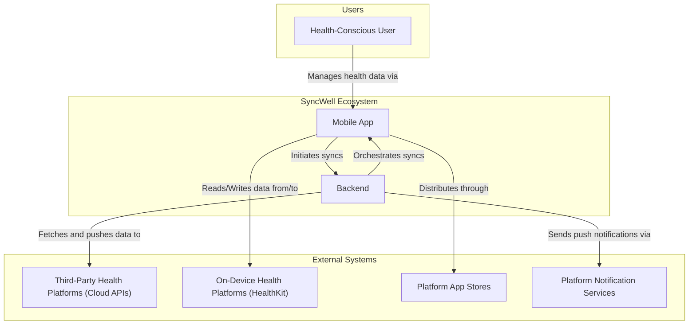
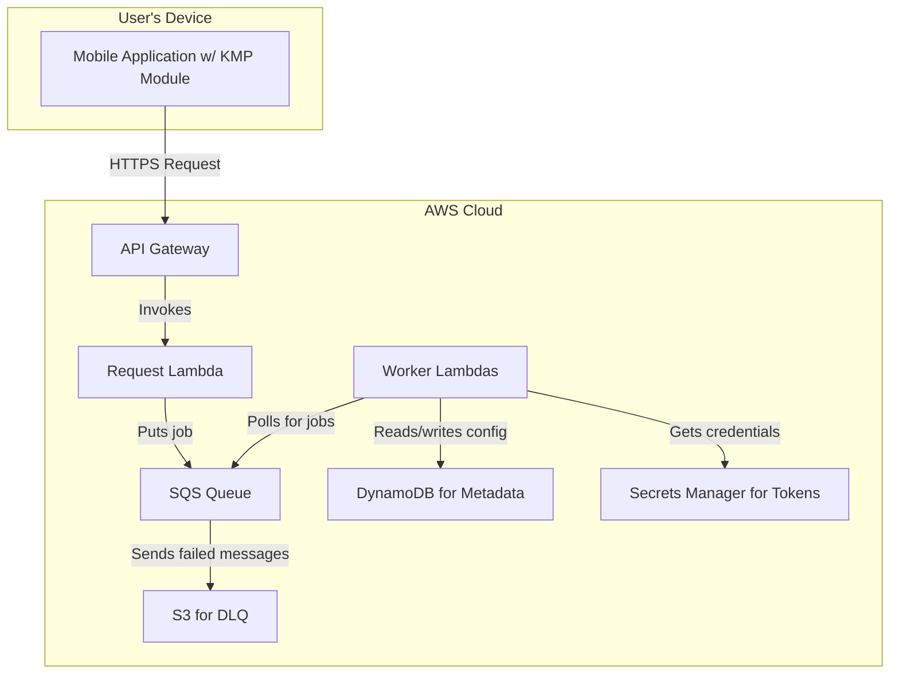
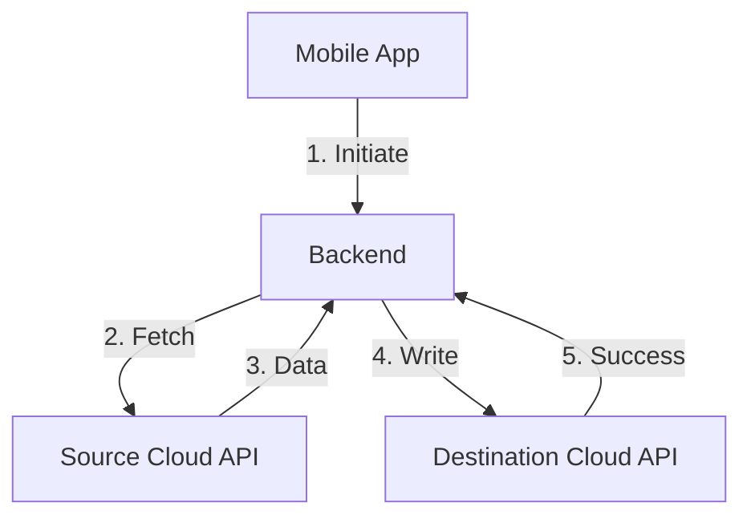
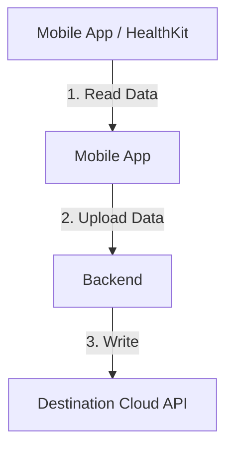
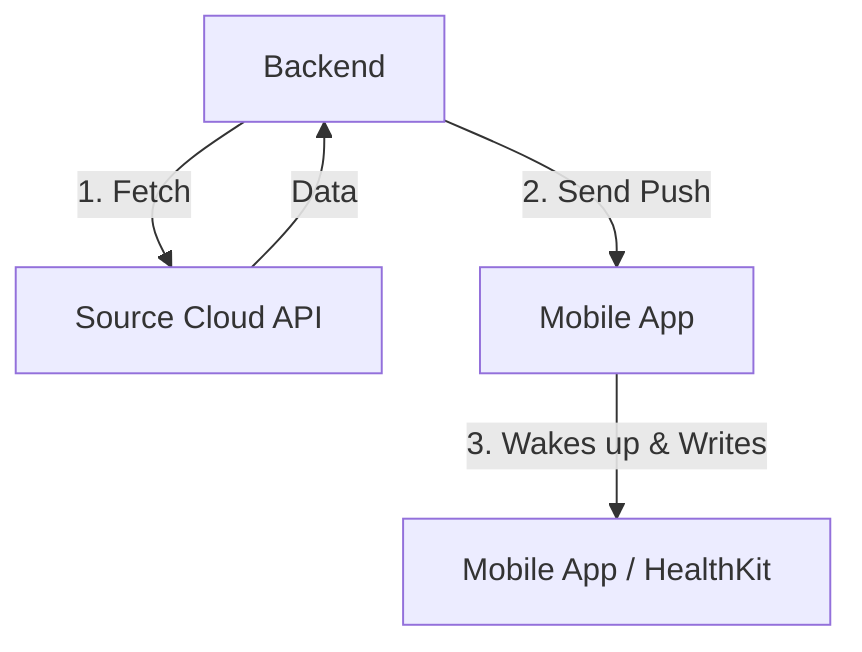

## Dependencies

### Core Dependencies
- `05-data-sync.md` - Data Synchronization & Reliability
- `07-apis-integration.md` - APIs & Integration Requirements
- `16-performance-optimization.md` - Performance & Scalability
- `17-error-handling.md` - Error Handling, Logging & Monitoring
- `18-backup-recovery.md` - Backup & Disaster Recovery
- `19-security-privacy.md` - Data Security & Privacy Policies
- `29-notifications-alerts.md` - Push Notifications & Alerts

### Strategic / Indirect Dependencies
- `01-context-vision.md` - Context & Vision
- `02-product-scope.md` - Product Scope, Personas & MVP Definition
- `14-qa-testing.md` - QA, Testing & Release Strategy
- `21-risks.md` - Risks, Constraints & Mitigation
- `25-release-management.md` - Release Management & Versioning
- `44-contingency-planning.md` - Contingency & Rollback Plans

---

# PRD Section 6: Technical Architecture, Security & Compliance

## 1. Executive Summary

This document specifies the complete technical architecture for the SyncWell application. The architecture is designed for high availability, massive scalability, and robust security to support **1 million Daily Active Users (DAU)**. It adheres to modern cloud-native principles and is engineered for a high-performing product team.

We will use the **C4 Model** as a framework to describe the architecture. The core architectural principles are **modularity**, **security by design**, and **privacy by default**. A key feature is its **hybrid sync model**, which combines a serverless backend for cloud-to-cloud syncs with on-device processing for integrations requiring native SDKs (e.g., Apple HealthKit). This approach maximizes reliability and performance.

## 2. Architectural Model (C4)

### Level 1: System Context

This diagram shows the system in its environment, illustrating its relationship with users and external systems.

### Level 2: Containers

This level zooms into the system boundary to show the high-level technical containers.

1.  **Mobile Application (Kotlin Multiplatform & Native UI)**
    *   **Description:** The user-facing application that runs on iOS or Android. It handles all user interactions and is a key component of the hybrid sync model.
    *   **Technology:** Kotlin Multiplatform (KMP) for shared business logic, SwiftUI for iOS, Jetpack Compose for Android.
    *   **Responsibilities:**
        *   Provides a high-performance, native User Interface.
        *   Manages the OAuth 2.0 authentication flow and securely transmits tokens to the backend.
        *   For device-native integrations (Apple HealthKit), it performs the data reading and writing directly on the device, orchestrated by the backend.
        *   Initiates all sync requests to the backend.
2.  **Scalable Serverless Backend (AWS)**
    *   **Description:** An event-driven, serverless backend on AWS that orchestrates all syncs. It does not **persist** any raw user health data; data is only processed ephemerally in memory during active sync jobs.
    *   **Technology:** AWS Lambda, API Gateway, SQS, DynamoDB, AWS Secrets Manager.
    *   **Responsibilities:**
        *   **Orchestration:** Manages the state and triggers for all sync jobs.
        *   **Cloud-to-Cloud Syncs:** Worker Lambdas execute the full sync logic for cloud-based APIs (e.g., Fitbit, Garmin).
        *   **Secure Credential Storage:** Securely stores and manages user OAuth tokens for third-party APIs using AWS Secrets Manager.
        *   **Metadata Storage:** Uses DynamoDB to store user configuration, sync state, and job metadata.

### Level 3: Components (Inside the KMP Shared Module)

The KMP module contains the core business logic. This code can be executed **on the device** (for HealthKit syncs) or **on the backend** (if using a JVM-based Lambda), maximizing code reuse.

*   **`SyncManager`:** Orchestrates the sync process based on instructions from the backend.
*   **`ConflictResolutionEngine`:** Detects and resolves data conflicts.
*   **`ProviderManager`:** Manages the different `DataProvider` modules.
*   **`DataProvider (Interface)`:** A standardized interface for all third-party integrations.
*   **`ApiClient`:** Handles HTTP calls to backend and third-party services.
*   **`SecureStorageWrapper`:** Abstraction for Keychain/Keystore (on-device) and AWS Secrets Manager (on-backend).

## 3. Sync Models: A Hybrid Architecture

To ensure reliability and accommodate platform constraints, SyncWell uses a hybrid architecture.

### Model 1: Cloud-to-Cloud Sync

*   **Use Case:** Syncing between two cloud-based services (e.g., Fitbit to Strava).
*   **Flow:**
    1.  Mobile app initiates the sync via API Gateway.
    2.  The backend worker lambda handles the entire process: fetches data from the source API, resolves conflicts, and writes data to the destination API.
    3.  **Advantage:** Highly reliable and does not depend on the user's device being online.

### Model 2: Device-to-Cloud Sync

*   **Use Case:** Syncing from a device-native source to a cloud destination (e.g., Apple Health to Fitbit).
*   **Flow:**
    1.  A background task on the mobile app reads data from the native source (e.g., HealthKit).
    2.  The mobile app sends this data to a secure endpoint on our backend.
    3.  A backend worker lambda receives the data and writes it to the destination cloud API.
    4.  **Advantage:** The only way to get data out of sandboxed, on-device sources like HealthKit.

### Model 3: Cloud-to-Device Sync

*   **Use Case:** Syncing from a cloud source to a device-native destination (e.g., Garmin to Apple Health).
*   **Flow:**
    1.  The backend worker lambda fetches data from the source cloud API.
    2.  The worker stores the data temporarily in a secure, time-limited cache (e.g., Redis or a signed S3 URL).
    3.  The backend sends a silent push notification to the user's device.
    4.  The mobile app, upon receiving the notification, wakes up, downloads the data from the temporary cache, and writes it to the native destination (e.g., HealthKit).
    5.  **Advantage:** Allows writing data to on-device stores reliably.

## 4. Technology Stack & Rationale

| Component | Technology | Rationale |
| :--- | :--- | :--- |
| **Cross-Platform Framework** | **Kotlin Multiplatform (KMP)** | **Code Reuse & Performance.** KMP allows sharing the complex business logic (sync engine, data providers) across the mobile app and potentially the backend (if using a JVM Lambda), while maintaining native UI performance. |
| **On-Device Database** | **SQLDelight** | **Cross-Platform & Type-Safe.** Generates type-safe Kotlin APIs from SQL, ensuring data consistency across iOS and Android. |
| **Serverless Backend** | **AWS (Lambda, SQS, DynamoDB)** | **Massive Scalability & Reliability.** Event-driven architecture to meet our 1M DAU target with pay-per-use cost efficiency. |
| **Secure Credential Storage** | **AWS Secrets Manager** | **Security & Manageability.** Provides a secure, managed service for storing, rotating, and retrieving the OAuth tokens required by our backend workers. |
| **Infrastructure as Code** | **Terraform** | **Reproducibility & Control.** Manages all cloud infrastructure as code, ensuring our setup is version-controlled and easily reproducible. |
| **CI/CD**| **GitHub Actions** | **Automation & Quality.** Automates the build, test, and deployment of the mobile app and backend services. |

## 5. Security & Compliance

### Security Measures

*   **Data Encryption in Transit:** All network traffic will use TLS 1.2+. Certificate Pinning will be implemented for API calls to our own backend.
*   **Data Encryption at Rest:**
    *   **Backend:** User OAuth tokens are encrypted and stored in AWS Secrets Manager.
    *   **On-Device:** Any sensitive data is stored in the native Keychain (iOS) and Keystore (Android).
*   **Code Security:** Production builds will be obfuscated. Dependency scanning (Snyk) will be integrated into the CI/CD pipeline.

### Compliance
*   User health data is only ever processed **ephemerally in memory** on our backend servers during an active sync job. It is **never persisted** on our systems.
*   For integrations requiring native SDKs (like Apple Health), data processing occurs on the user's device, further enhancing privacy. This hybrid model is designed to be compliant with GDPR, CCPA, and other privacy regulations.

## 6. Open-Source Tools and Packages

| Category | Tool/Package | Description |
| :--- | :--- | :--- |
| **Mobile Development** | **Kotlin Multiplatform** | Core framework for sharing code. |
| | **SwiftUI / Jetpack Compose** | Modern UI frameworks for iOS and Android. |
| | **SQLDelight** | KMP library for type-safe SQL. |
| | **Ktor** | KMP HTTP client. |
| **Backend Development** | **AWS Lambda, SQS, DynamoDB** | Core AWS services for the serverless backend. |
| | **Terraform** | Infrastructure as Code tool. |
| **Testing** | **JUnit, XCTest, Turbine, MockK** | Standard libraries for testing Kotlin and Swift code. |
| **CI/CD** | **GitHub Actions, Fastlane** | CI/CD platform and mobile release automation. |
| **Static Analysis** | **Detekt, SwiftLint** | Static analysis tools for Kotlin and Swift. |
| **Dependency Scanning** | **Snyk** | Vulnerability scanning for dependencies. |
