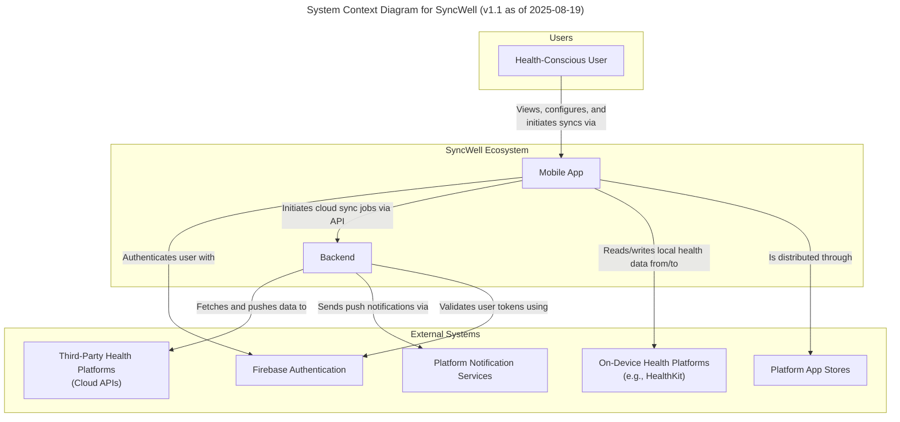
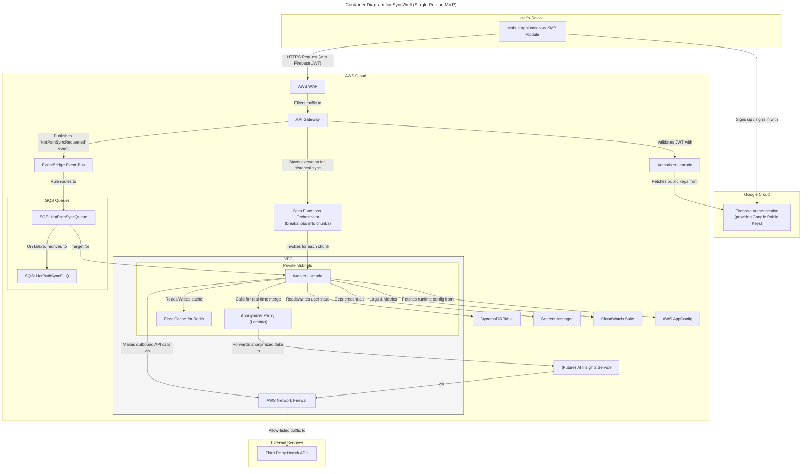
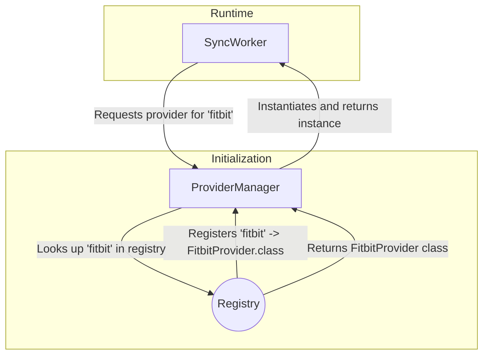
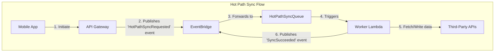
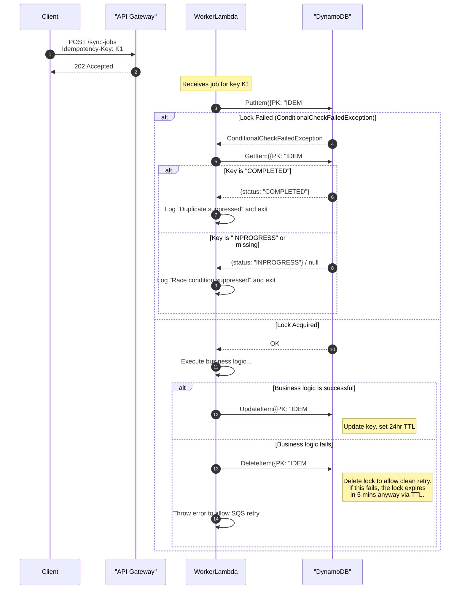
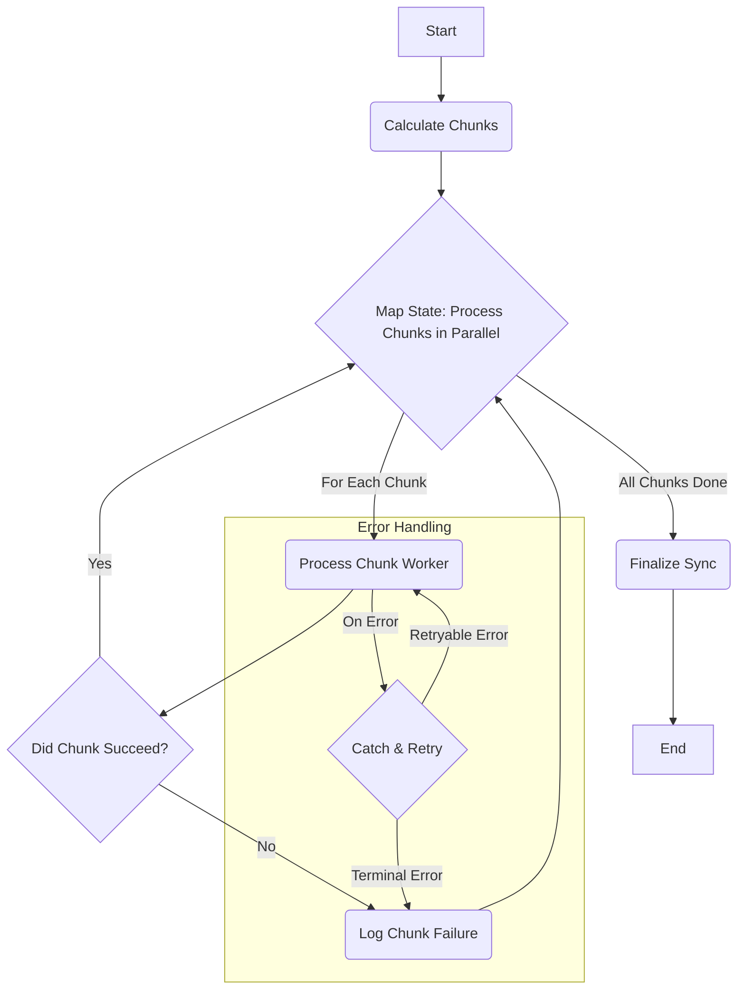
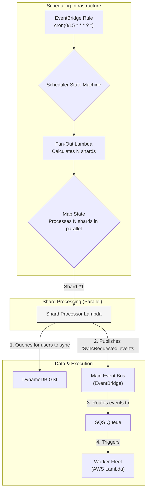

# PRD Section 6: Technical Architecture, Security & Compliance

## 0. Document Management

### Version History
| Version | Date       | Author(s) | Summary of Changes |
| :--- | :--- | :--- | :--- |
| 1.0 | 2025-08-12 | J. Doe | Initial Draft |
| 1.1 | 2025-08-19 | J. Doe | Incorporated feedback from `f-20.md` review. Addressed over 150 points of ambiguity, inconsistency, and risk. |

### Consolidated Assumptions
This document relies on the following key assumptions:
1.  **User Base Growth:** The user base is expected to grow to 1M DAU within 24 months of launch.
2.  **Third-Party API Stability:** The APIs of our third-party partners (Fitbit, Garmin, etc.) will remain reasonably stable and will not introduce breaking changes without a standard deprecation notice period.
3.  **MVP Scope:** The feature set defined in `02-product-scope.md` is stable for the MVP launch.

### Cross-Cutting Concerns
*   **Traceability to User Stories:** While this document is technically focused, key architectural decisions should trace back to user stories in `04-user-stories.md`. For example, the AI Insights service is justified by US-15. A full traceability matrix is outside the scope of this document but should be maintained by the product team.
*   **Accessibility (A11y):** All user-facing components, including API error messages and push notifications, must adhere to WCAG 2.1 AA standards.
*   **Internationalization (i18n) & Localization (L10n):** All user-facing strings (error messages, notifications) must be stored in resource files and not hard-coded, to support future localization efforts.

## Dependencies

### Core Dependencies
- `05-data-sync.md` - Data Synchronization & Reliability
- `07-apis-integration.md` - APIs & Integration Requirements
- `17-error-handling.md` - Error Handling, Logging & Monitoring
- `18-backup-recovery.md` - Backup & Disaster Recovery
- `19-security-privacy.md` - Security & Privacy
- `30-sync-mapping.md` - Sync Mapping
- `31-historical-data.md` - Historical Data Handling
- `33-third-party-integration.md` - Third-Party Integration Considerations
- `34-data-export.md` - Data Export
- `35-data-import.md` - Data Import
- `39-performance-metrics.md` - Performance & Metrics

### Strategic / Indirect Dependencies
- `01-context-vision.md` - Context & Vision
- `02-product-scope.md` - Product Scope, Personas & MVP Definition
- `08-ux-onboarding.md` - UX Onboarding
- `09-ux-configuration.md` - UX Configuration
- `14-qa-testing.md` - QA & Testing
- `15-integration-testing.md` - Integration & End-to-End Testing
- `21-risks.md` - Risks & Mitigation
- `25-release-management.md` - Release Management & Versioning
- `44-contingency-planning.md` - Contingency & Rollback Plans
- `45-future-enhancements.md` - Future Enhancements & Roadmap Expansion

---

# PRD Section 6: Technical Architecture, Security & Compliance

## 1. Executive Summary

This document specifies the complete technical architecture for the SyncWell application. The architecture is designed for **high availability (defined as >99.9% uptime)**, **massive scalability (to support 1 million Daily Active Users and a peak load of 3,000 requests per second)**, and robust security. It adheres to modern cloud-native principles and is engineered for developer velocity and operational excellence.

We will use the **C4 Model** as a framework to describe the architecture. The core architectural principles are **modularity**, **security by design**, and **privacy by default**. A key feature is its **hybrid sync model**, which is necessitated by platform constraints. It combines a serverless backend for cloud-to-cloud syncs with on-device processing for integrations that require native SDKs (e.g., Apple HealthKit), maximizing reliability and performance. To further enhance the user experience in a **future phase (post-MVP)**, the architecture makes provisions for an **AI Insights Service** to power intelligent features. The initial focus, however, will be on a **robust sync engine**, made reliable through a unified idempotency strategy and resilient error handling, that is **deterministic** in its behavior.

## 2. Architectural Model (C4)

### Level 1: System Context

This diagram shows the system in its environment, illustrating its relationship with users and external systems.



### Level 2: Containers

This level zooms into the system boundary to show the high-level technical containers. The architecture is composed of two primary workflows: a low-latency "hot path" for real-time syncs, and a robust "cold path" for long-running historical syncs. While the system uses multiple serverless services like Step Functions and EventBridge, the core business logic resides in a **unified AWS Lambda worker fleet**, promoting code reuse. A core technology used is **Kotlin Multiplatform (KMP)**, which allows for sharing this worker logic between the mobile application and the backend.

**Note on Diagram Clarity:** The following diagram is a high-level overview. To improve clarity, it simplifies some complex interactions (e.g., the chunking logic within the Step Functions orchestrator) and omits secondary components like the S3 bucket for archiving. More detailed diagrams for specific workflows are provided in the relevant sections below.



1.  **Mobile Application (Kotlin Multiplatform & Native UI)**
    *   **Description:** The user-facing application that runs on iOS or Android. It handles all user interactions and is a key component of the hybrid sync model.
    *   **Technology:** Kotlin Multiplatform (KMP) for shared business logic, SwiftUI for iOS, Jetpack Compose for Android.
    *   **Responsibilities:** Provides the UI, integrates with the Firebase Authentication SDK to manage the user sign-up/sign-in flows, securely stores JWTs using the platform's **Keychain (iOS) or Keystore (Android)**, and handles on-device syncs (e.g., HealthKit).

2.  **Authentication Service (Firebase Authentication)**
    *   **Description:** A managed, third-party service that handles all aspects of user identity, including sign-up, sign-in, and social provider integration (Google/Apple).
    *   **Technology:** Firebase Authentication (Google Cloud).
    *   **Responsibilities:** Manages user credentials, issues short-lived JWTs with a **1-hour TTL** to the mobile client after a successful authentication event, and provides public keys for backend token verification.

3.  **Scalable Serverless Backend (AWS)**
    *   **Description:** A decoupled, event-driven backend on AWS that uses a unified AWS Lambda compute model for its core business logic to orchestrate all syncs. This serverless-first approach maximizes developer velocity and minimizes operational overhead.
    *   The backend **must not** persist any raw user health data; this critical security requirement will be enforced via a dedicated test case in the QA plan. Any temporary diagnostic metadata containing user identifiers is stored in a secure, audited, time-limited index, as detailed in `19-security-privacy.md`. Data is otherwise only processed ephemerally in memory during active sync jobs.
    *   **Technology:** AWS Lambda, API Gateway, **Amazon EventBridge**, **Amazon SQS**, **AWS Step Functions**, DynamoDB.
    *   **Responsibilities:** The API Layer (**API Gateway**) is responsible for initial request validation (e.g., format), authorization via the `AuthorizerLambda`, and routing requests to the appropriate backend service. It does not handle business-level validation like idempotency checks. To ensure maximum performance and cost-effectiveness, it will leverage **API Gateway's built-in caching for the Lambda Authorizer**. The authorizer's response (the IAM policy) will be cached based on the user's identity token for a **5-minute TTL**. For subsequent requests within this TTL, API Gateway will use the cached policy and will not invoke the `AuthorizerLambda`, dramatically reducing latency and cost.
    *   **Risk:** This caching strategy introduces a known risk: if a user's permissions are revoked, they may retain access for up to the 5-minute TTL of the cached policy. This trade-off is accepted to achieve the required API performance.

4.  **Distributed Cache (Amazon ElastiCache for Redis)**
    *   **Description:** An in-memory caching layer to improve performance and reduce load on downstream services. The cluster must be **sized to handle 10,000 RPS with a P99 latency of < 10ms**, which is a safety threshold above the peak NFR.
    *   **Technology:** Amazon ElastiCache for Redis.
    *   **Responsibilities:**
        *   Caches frequently accessed, non-sensitive data (e.g., user sync configurations).
        *   Powers the rate-limiting engine to manage calls to third-party APIs.

5.  **(Future) AI Insights Service (AWS)**
    *   **Description:** A service planned for a future release to provide intelligence to the platform. It will encapsulate machine learning models and LLM integrations, allowing the core sync engine to remain deterministic and focused.
    *   **Technology:** Amazon SageMaker, Amazon Bedrock, AWS Lambda.
    *   **Responsibilities:** The initial design considers providing "intelligent conflict resolution" to address user story US-15 ("As a Pro user, I want the system to intelligently merge conflicting entries to avoid data loss"). Other potential features include an LLM-based troubleshooter and personalized summaries.

6.  **Monitoring & Observability (AWS CloudWatch)**
    *   **Description:** A centralized system for collecting logs, metrics, and traces from all backend services.
    *   **Technology:** AWS CloudWatch (Logs, Metrics, Alarms), AWS X-Ray.
    *   **Responsibilities:** Provides insights into system health, performance, and error rates. Triggers alarms for critical issues.

7.  **Data Governance & Schema Registry (AWS Glue Schema Registry)**
    *   **Description:** To manage the evolution of our canonical data models (e.g., `CanonicalWorkout`), we will use the AWS Glue Schema Registry. It acts as a central, versioned repository for our data schemas.
    *   **Technology:** AWS Glue Schema Registry.
    *   **Responsibilities:**
        *   Stores all versions of the canonical data model schemas.
        *   **Must** enforce schema evolution rules (e.g., backward compatibility) within the CI/CD pipeline, preventing the deployment of breaking changes.
        *   Provides schemas to the worker service (AWS Lambda) for serialization and deserialization tasks, ensuring data conforms to the expected structure.

8.  **Centralized Configuration Management (AWS AppConfig)**
    *   **Description:** To manage dynamic operational configurations and feature flags, we will adopt AWS AppConfig. This allows for safe, audited changes without requiring a full code deployment.
    *   **Technology:** AWS AppConfig.
    *   **Responsibilities:**
        *   Stores and serves feature flags (e.g., enabling the `AI-Powered Merge` for Pro users).
        *   Manages operational parameters such as API timeouts, logging levels, and rate-limiting thresholds.
        *   **Manages critical resource identifiers (e.g., the DynamoDB table name). This is a crucial element of the disaster recovery strategy, allowing the application to be repointed to a restored database table without a code deployment.**
    *   **Risk:** Storing critical configuration like the database table name in AppConfig creates a dependency. A failure to access AppConfig at application startup could prevent the service from running. This risk is mitigated by AppConfig's own high availability and our use of client-side caching within the Lambda functions.

### Level 3: Components (Inside the KMP Shared Module)

The KMP module contains the core, shareable business logic. The architectural strategy is to use **KMP for portable business logic** and **platform-native runtimes for performance-critical infrastructure code**.

For the backend, this means the general strategy is to compile the KMP module to a JAR and run it on a standard JVM-based AWS Lambda runtime. However, security-critical, latency-sensitive functions like the `AuthorizerLambda` **must** be implemented in a faster-starting runtime like TypeScript or Python to ensure they meet strict performance SLOs. This is a deliberate trade-off, optimizing for performance where it matters most, while maximizing code reuse for the complex sync logic.

*   **`SyncManager`:** Orchestrates the sync process.
    *   **Inputs:** `SyncConfig` object, `DataProvider` instances for source and destination.
    *   **Outputs:** A `SyncResult` object (success or failure).
*   **`ConflictResolutionEngine`:** Detects and resolves data conflicts.
    *   **Inputs:** Two `CanonicalData` objects.
    *   **Outputs:** A single, merged `CanonicalData` object.
*   **`ProviderManager`:** Manages and provides instances of `DataProvider` modules.
    *   **Inputs:** A `providerId` string (e.g., "fitbit").
    *   **Outputs:** An initialized `DataProvider` instance.
*   **`DataProvider (Interface)`:** A standardized interface for all third-party integrations. Its method signatures are canonically defined in the `07-apis-integration.md` document, creating a formal dependency.
*   **`ApiClient`:** Handles HTTP calls to backend and third-party services.
*   **`SecureStorageWrapper`:** Abstraction for Keychain/Keystore (on-device) and AWS Secrets Manager (on-backend).
    *   **Error Handling:** If the underlying secret store (e.g., Secrets Manager) is unavailable, this component **must** throw a specific, catchable `SecureStorageUnavailableException` to allow the caller to implement appropriate retry logic.

### Level 3: Extensible Provider Integration Architecture

The core value of the application is its ability to connect with various third-party health services. To support rapid and reliable addition of new providers, the architecture defines a "plug-in" model. This model ensures that adding a new integration (e.g., for "Polar") is a predictable process that does not require changes to the core sync engine. This is achieved through a standardized interface, a factory for dynamic loading, and a secure configuration management strategy.

#### 1. The `DataProvider` Interface

All provider-specific logic is encapsulated in a class that implements the `DataProvider` interface. This interface, defined in the KMP shared module, creates a standardized contract for all integrations. The canonical definition of this critical interface, including its method signatures and the `capabilities` field, is maintained in `07-apis-integration.md`.

#### 2. Dynamic Loading with a Factory Pattern

The `ProviderManager` component acts as a factory to dynamically instantiate and manage provider-specific logic based on user configuration. This decouples the core sync engine from the individual provider implementations.

*   **Process:**
    1.  **Initialization:** On startup, the `ProviderManager` is initialized with a registry mapping `providerId` strings to their corresponding `DataProvider` implementation classes.
    2.  **Request:** The `SyncWorker` receives a job (e.g., "sync steps from 'fitbit' to 'strava'").
    3.  **Lookup:** It requests the `DataProvider` for "fitbit" from the `ProviderManager`.
    4.  **Instantiation:** The `ProviderManager` consults its registry, finds the `FitbitProvider` class, instantiates it, and returns the object to the worker.
    5.  **Execution:** The worker then uses this object to perform the data fetch.



This design means that to add a new provider, a developer only needs to implement the `DataProvider` interface and register the new class with the `ProviderManager`'s registry.

#### 3. Secure Configuration and Secret Management

A secure and scalable strategy is essential for managing provider-specific configurations and API credentials.

*   **Provider-Specific Configuration:** Non-sensitive configuration, such as API endpoint URLs or supported data types, is stored in a configuration file **within the same source code module/package** as the provider's implementation.
*   **Application API Credentials:** The OAuth `client_id` and `client_secret` for each third-party service are highly sensitive. These are stored securely in **AWS Secrets Manager**. The backend services retrieve these credentials at runtime using a narrowly-scoped IAM role.
*   **User OAuth Tokens:** User-specific `access_token` and `refresh_token` are encrypted and stored in **AWS Secrets Manager**. To avoid storing a predictable secret ARN in the database, the `Connection` item in DynamoDB will store a randomly generated UUID as the pointer to the secret.
    *   **Secure ARN Mapping:** The mapping from this UUID to the full AWS Secrets Manager ARN **must** be stored securely. This mapping will be managed as a secure JSON object within **AWS AppConfig**. This approach provides a central, auditable, and securely managed location for this critical mapping data.
    *   **Dynamic IAM Policies for Least Privilege:** When a Worker Lambda processes a job, it must be granted permission to retrieve *only* the specific secret for the connection it is working on. This is a critical security control. This will be achieved by having the orchestrating service (e.g., Step Functions) generate a **dynamic, narrowly-scoped IAM session policy** that grants temporary access only to the specific secret ARN required for the job. This policy is then passed to the `WorkerLambda`, ensuring it operates under the principle of least privilege for every execution.

### Level 3: Components (Future AI Insights Service)

When implemented, the AI Insights Service will be composed of several components. The exact implementation details will be defined closer to the feature's development phase and will undergo a rigorous security and privacy review. The initial high-level concepts include:

*   **`Conflict Resolution Model`:** A potential machine learning model that could take two conflicting data entries and return a suggested merged version.
*   **`LLM-based Services`:** Lambda functions that could leverage foundational models (e.g., via Amazon Bedrock) to power features like an interactive troubleshooter or human-readable data summaries.

## 3. Sync Models: A Hybrid Architecture

To ensure reliability and accommodate platform constraints, SyncWell uses a hybrid architecture. This means some integrations are handled entirely in the cloud ("Cloud-to-Cloud"), while others require on-device processing using native SDKs.

The following table clarifies the integration model for each provider supported in the MVP:

| Provider | Integration Model | Rationale |
| :--- | :--- | :--- |
| **Apple Health** | Device-to-Cloud / Cloud-to-Device | **Platform Constraint:** HealthKit is a device-native framework with no cloud API. All processing **must** happen on the user's device. |
| **Google Fit** | Hybrid (Device & Cloud) | **User Benefit & Modernization:** While Google Fit has a REST API, the new Health Connect SDK provides access to richer, more real-time data directly on the user's device. The implementation will be device-first to provide the best user experience. The cloud API will only be used as a fallback under **specific, defined conditions**: 1) when a sync fails with an error indicating the on-device provider is unavailable (e.g., user has not installed Health Connect), or 2) for specific data types that are only available via the cloud API. |
| **Fitbit** | Cloud-to-Cloud | Fitbit provides a comprehensive REST API for all data types. No on-device component is needed. |
| **Garmin** | Cloud-to-Cloud | Garmin provides a cloud-based API. No on-device component is needed. |
| **Strava** | Cloud-to-Cloud | Strava provides a cloud-based API. No on-device component is needed. |

### Model 1: Cloud-to-Cloud Sync

Cloud-to-cloud syncs are handled by two distinct architectural patterns depending on the use case.

#### **Hot Path Sync**
*   **Use Case:** Handling frequent, automatic, and user-initiated manual syncs for recent data.
*   **Flow:**
    1.  The Mobile App sends a request to API Gateway to start a sync.
    2.  **API Gateway** uses a direct service integration to validate the request and publish a semantic `HotPathSyncRequested` event to the **EventBridge Event Bus**.
    3.  An EventBridge rule filters for these events and sends them to the `HotPathSyncQueue` **Amazon SQS queue**. This queue acts as a buffer, protecting the system from load spikes.
    4.  The SQS queue triggers the `Worker Lambda`, which processes the job.
    5.  **Failure Handling:** The primary SQS queue is configured with a **Dead-Letter Queue (DLQ)**. On a **non-transient processing error** (e.g., an invalid credentials error `401`, a permanent API change `404`, or an internal code bug), the worker throws an exception. After a configured number of retries (`maxReceiveCount`), SQS automatically moves the failed message to the DLQ for out-of-band analysis.
        *   **`maxReceiveCount` Rationale:** This will be set to **5**. This value is chosen to balance allowing recovery from intermittent, transient network or third-party API errors against not waiting too long to detect a persistent failure that requires manual intervention.
    6.  Upon successful completion, the `Worker Lambda` publishes a `SyncSucceeded` event back to the EventBridge bus. This event is consumed by other services, primarily to trigger a push notification to the user and for analytics.
*   **Advantage:** This is a highly reliable and extensible model. Leveraging the native SQS DLQ feature simplifies the worker logic, increases reliability, and improves observability.



#### **Historical Sync (Cold Path)**
*   **Terminology Note:** A "Historical Sync" is a long-running *workflow*. The individual tasks processed by this workflow are assigned a **low priority**. This priority is enforced by the distributed rate-limiter, which uses a separate, more restrictive token bucket for jobs flagged as `historical`.
*   **Use Case:** Handling user-initiated requests to backfill months or years of historical data.
*   **Flow:**
    1.  The Mobile App sends a request to a dedicated API Gateway endpoint to start a historical sync.
    2.  **API Gateway** uses a direct service integration to start an execution of the **AWS Step Functions** state machine.
    3.  The state machine orchestrates the entire workflow, breaking the job into chunks, processing them in parallel with `WorkerLambda` invocations, and handling errors.
*   **Advantages & Trade-offs:** Step Functions is the ideal choice for this workflow due to its rich, native observability and state management features. However, there are trade-offs:
    *   **Advantages:** Visual workflow monitoring, detailed execution history for auditing, and native X-Ray integration make operating and debugging these complex jobs highly transparent.
    *   **Potential Downsides:** At extreme scale, Step Functions can become costly. Additionally, the state payload passed between steps has a size limit (256KB), which requires careful management to ensure large job definitions do not exceed this limit.

### Model 2: Device-to-Cloud Sync
*(Unchanged)*

### Model 3: Cloud-to-Device Sync
*(Unchanged)*

## 3a. Unified End-to-End Idempotency Strategy

In a distributed, event-driven system, operations can be retried, making a robust idempotency strategy critical for data integrity. We will implement a unified strategy based on a client-generated **`Idempotency-Key`**. This key is a required HTTP header for all `POST`, `PUT`, and `PATCH` operations. The API Gateway will reject any request missing this header with a `400 Bad Request`.

*   **Key Generation:** The mobile client is responsible for generating a unique `Idempotency-Key` (e.g., a UUID) for each new state-changing operation. This same key **must** be used for any client-side retries of that same operation.

*   **Locking Mechanism:** Before starting any processing, the asynchronous worker (Lambda) will attempt to acquire an exclusive lock using an atomic **`SET-if-not-exists`** operation against the central cache (Redis). This ensures that a job is processed at most once and handles race conditions where multiple workers attempt to process the same job simultaneously.

#### Idempotency for Historical Syncs (Step Functions)
For long-running historical syncs, an additional layer of idempotency is applied at the orchestration level:
*   **Execution Naming:** The API Gateway integration **must** be configured to use the client-provided `Idempotency-Key` as the `name` for the Step Function's execution.
*   **Handling Existing Executions:** If API Gateway's attempt to start an execution fails with an `ExecutionAlreadyExists` error, the system **must not** assume success. Instead, the integration logic will call `DescribeExecution` to check the status of the existing execution.
    *   If the existing execution is `SUCCEEDED` or `RUNNING`, the API can safely return a `202 Accepted` to the client.
    *   If the existing execution `FAILED`, the API must return a `409 Conflict` (or similar error), indicating that the original request failed and a new request with a new `Idempotency-Key` is required.

#### Idempotency Store Implementation

To ensure a single, consistent, and highly-available locking mechanism suitable for a multi-region architecture, the idempotency check **must** be implemented using **DynamoDB's conditional write functionality**. This approach avoids potential race conditions from cache replication lag and consolidates our locking strategy.

*   **Item Schema (in `SyncWellMetadata` table):**
    *   **PK:** `IDEM##{idempotencyKey}`
    *   **SK:** `IDEM##{idempotencyKey}`
    *   **status:** A string indicating the status: `INPROGRESS` or `COMPLETED`.
    *   **ttl:** A standard DynamoDB TTL attribute to ensure automatic cleanup of old records.
*   **TTL Rationale:** A **24-hour TTL** is used on `COMPLETED` keys. This is a conservative product decision to serve as a safe upper bound for offline clients. The `INPROGRESS` lock will have a much shorter TTL (5 minutes) to prevent deadlocks if a worker crashes.

The following sequence diagram illustrates the robust end-to-end flow using DynamoDB.



## 3b. Architecture for 1M DAU

To reliably serve 1 million Daily Active Users, the architecture incorporates specific strategies for high availability, performance, and scalability. The title of this section reflects the ultimate goal, but the strategies described are phased, beginning with a pragmatic MVP.

### High Availability Strategy

#### MVP: Single-Region Architecture
To balance cost, complexity, and time-to-market for the MVP, the SyncWell backend will be deployed to a **single AWS region** (e.g., `us-east-1`).

*   **Intra-Region High Availability:** High availability will be achieved *within* the single region by deploying services across multiple Availability Zones (AZs).
    *   **Stateless Services:** API Gateway and AWS Lambda are inherently highly available across AZs.
    *   **Stateful Services:** The DynamoDB table and ElastiCache for Redis cluster will be configured for Multi-AZ deployment. This ensures that the failure of a single AZ does not result in a service outage.

#### Future: Multi-Region Architecture
The architecture is designed with a future multi-region deployment in mind. Key considerations for this evolution include:
*   **Data Replication:** Migrating from a single-region DynamoDB table to a Global Table.
*   **Request Routing:** Implementing latency-based routing with Amazon Route 53.
*   **Data Residency & Compliance (GDPR):** The future multi-region strategy **must** include a comprehensive plan for data residency, likely involving region-specific infrastructure silos or fine-grained data routing policies to ensure compliance. This will be a primary workstream when the multi-region expansion is prioritized.

### Resilience Testing (Chaos Engineering)

The practice of chaos engineering is critical. We will use the **AWS Fault Injection Simulator (FIS)** to validate our high availability.
*   **Ownership and Frequency:** Experiments will be owned by the Core Backend team and executed on a **bi-weekly basis** in the `staging` environment as part of the standard release cycle.
*   **MVP Experiment Catalog:**
    *   **Worker Failure:** Terminate a random percentage (10-50%) of Lambda instances to ensure SQS retries and the remaining fleet can handle the load.
    *   **API Latency:** Inject a 500ms latency into calls from a worker Lambda to a third-party API endpoint.
    *   **DynamoDB Latency:** Inject latency on DynamoDB reads/writes to test application-level timeouts.
    *   **Secrets Manager Unavailability:** Block access to AWS Secrets Manager to verify graceful failure and retry.
    *   **Availability Zone Failure:** Simulate the failure of a single AZ to validate Multi-AZ configurations.
    *   **Cache Cluster Failure:** Simulate a full failure of the ElastiCache cluster to verify that the system enters a safe, degraded mode.

### Performance & Scalability

#### Caching Strategy
A distributed cache using **Amazon ElastiCache for Redis** is a critical component. The system will employ a **cache-aside** pattern. If a cache write fails after a database read, the error will be logged, and the application will return the data to the client. The next read for that data will simply be another cache miss, ensuring resilience.

The following table details the specific items to be cached:

| Item Type | Key Structure | Value | TTL | Purpose |
| :--- | :--- | :--- | :--- | :--- |
| **API Gateway Authorizer (L1 Cache)** | User's Identity Token | The generated IAM policy document | 5 minutes | The primary, most critical cache. Caches the final authorization policy at the API Gateway level. |
| **JWT Public Keys (L2 Cache)**| `jwks##{providerUrl}` | The JSON Web Key Set (JWKS) document | 1 hour | An in-memory cache inside the authorizer Lambda to reduce latency on the first request for a user. |
| **Idempotency Key** | `idem##{idempotencyKey}` | `INPROGRESS` or `COMPLETED` | 5m / 24h | Prevents duplicate processing of operations. |
| **User Sync Config** | `config##{userId}` | Serialized user sync configurations | 15 minutes | Reduces DynamoDB reads for frequently accessed user settings. |
| **Rate Limit Token Bucket** | `ratelimit##{...}` | A hash containing tokens and timestamp | 60 seconds | Powers the distributed rate limiter for third-party APIs. |
| **Negative Lookups** | e.g., `nosub##{userId}` | A special "not-found" value | 1 minute | Prevents repeated, fruitless queries for non-existent data (e.g., checking if a user has a Pro subscription). |

#### Rate-Limiting Backoff Mechanism
The following diagram shows how a worker interacts with the distributed rate limiter. If the rate limit is exceeded, the worker **must not** fail the job. Instead, it will use the SQS `ChangeMessageVisibility` API to return the job to the queue with a calculated delay, using an **exponential backoff with jitter** algorithm to avoid thundering-herd problems.

```mermaid
sequenceDiagram
    participant Worker as "Worker Lambda"
    participant Redis as "ElastiCache for Redis\n(Rate Limiter)"
    participant SQS as "SQS Queue"
    participant ThirdParty as "Third-Party API"
    Worker->>+Redis: Atomically check & decrement token
    alt Token Available
        Redis-->>-Worker: OK
        Worker->>+ThirdParty: GET /v1/data
        ThirdParty-->>-Worker: 200 OK
    else Token Not Available
        Redis-->>-Worker: FAIL
        Worker->>SQS: ChangeMessageVisibility(calculated_delay)
        note right of Worker: Return job to queue with<br>exponential backoff + jitter
    end
```

#### Load Projections & Concurrency Risk Mitigation
*   **Governing NFR:** The system must be designed and load-tested to handle a peak load of **3,000 requests per second (RPS)**.
*   **Concurrency Calculation:** Based on the P90 SLO for job duration (15 seconds), this implies a worst-case requirement of **~45,000 concurrent Lambda executions**.
*   **Feasibility & Risk Mitigation (CRITICAL PROJECT BLOCKER):**
    *   **Risk Statement:** The projection of **~45,000 concurrent executions** represents a worst-case scenario that is considered a **potential project-threatening risk** due to its extreme financial and technical implications.
    *   **Architectural Status:** The current Lambda-per-job architecture is **not approved** for implementation.
    *   **Mandatory Prerequisites:** The project **must be halted** until the following actions are completed and formally approved by all stakeholders:
        1.  **Build Cost Model:** Create a detailed cost model for the 45,000 concurrency Lambda architecture.
        2.  **Mandatory Proof-of-Concept (PoC):** Execute a load test to validate the technical feasibility and cost of this model.
        3.  **Architectural Re-evaluation:** Prototype and perform a comparative analysis of alternatives that reduce concurrency. This **must** include:
            *   **Job Batching:** Processing multiple sync jobs within a single Lambda invocation.
            *   **Container-based Model (AWS Fargate):** Moving the workload to a container-based model.
            The goal is to find a more cost-effective and less risky approach.

#### DynamoDB Capacity Model
We will use a **hybrid capacity model**. A baseline of **Provisioned Capacity** will be purchased (e.g., via a Savings Plan) to handle the predictable average load, with an initial estimate of covering **70% of expected peak usage**. **On-Demand Capacity** will handle any traffic that exceeds this provisioned throughput. This ratio will be tuned based on production traffic patterns.

#### Networking Optimization with VPC Endpoints
To enhance security and reduce costs, the architecture will use **VPC Endpoints**. This allows Lambda functions in the VPC to communicate with other AWS services using private IP addresses.
*   **Benefit:** This improves security by keeping traffic off the public internet and provides direct cost savings by minimizing billable traffic through the NAT Gateway. While interface endpoints have a small hourly cost, this is significantly cheaper than NAT Gateway data processing charges at scale, which can easily amount to thousands of dollars per month for a high-traffic application.

## 3c. DynamoDB Data Modeling & Access Patterns

To support the application's data storage needs efficiently and scalably, we will use a **single-table design** in DynamoDB. This modern approach to NoSQL data modeling minimizes operational overhead, reduces costs by optimizing read/write operations, and allows for complex access patterns with a single table.

Our primary data table will be named **`SyncWellMetadata`**. It will use a composite primary key and multiple Global Secondary Indexes (GSIs) to serve all required access patterns.

### Table Definition: `SyncWellMetadata`

*   **Primary Key:**
    *   **Partition Key (PK):** `USER#{userId}` - All data for a given user is co-located in the same partition.
    *   **Sort Key (SK):** A hierarchical string that defines the type of data and its relationships.
*   **Capacity Model:** The table will use a **hybrid capacity model**, consistent with the strategy in section 3b. A baseline of Provisioned Capacity will handle the average load, while On-Demand capacity will handle unpredictable spikes.
*   **Global Tables:** For the MVP, the table will exist in a single region.

### Item Types & Schema

| Entity | PK (Partition Key) | SK (Sort Key) | Key Attributes & Defined Values |
| :--- | :--- | :--- | :--- |
| **User Profile** | `USER#{userId}` | `PROFILE` | `SubscriptionLevel`: `FREE`, `PRO`<br>`CreatedAt`, `version` |
| **Connection** | `USER#{userId}` | `CONN#{connectionId}` | `Status`: `active`, `needs_reauth`, `revoked`<br>`CredentialArn`, `ReAuthStatus` |
| **Sync Config** | `USER#{userId}` | `SYNCCONFIG#{sourceId}##{dataType}` | `ConflictStrategy`: `source_wins`, `dest_wins`, `newest_wins`<br>`IsEnabled`, `version` |
| **Hist. Sync Job** | `USER#{userId}` | `HISTORICAL##{jobId}` | `ExecutionArn`, `Status`: `PENDING`, `RUNNING`, `SUCCEEDED`, `FAILED` |
| **Idempotency Lock** | `IDEM##{key}` | `IDEM##{key}` | `status`: `INPROGRESS`, `COMPLETED`<br>`ttl` |

**Note on Historical Sync Job Items:** Storing a potentially large number of `HISTORICAL` items in the main user item collection can degrade performance. The primary API for fetching a user's profile **must not** return these items by default. They should only be returned via a dedicated API endpoint (e.g., `GET /v1/users/me/historical-syncs`).

### Supporting Operational Access Patterns

Finding all connections that need re-authentication is a key operational requirement. A full table scan is inefficient and costly at scale. A GSI on a low-cardinality attribute like `Status` is also an anti-pattern.
*   **Optimized Strategy (Sparse GSI):** The best practice is to create a **sparse Global Secondary Index (GSI)**. We will add a `ReAuthStatus` attribute to `Connection` items only when `Status` becomes `needs_reauth`. The GSI will be keyed on this sparse `ReAuthStatus` attribute, making the query to find all affected users extremely fast and cost-effective.
*   **Fallback Strategy (Throttled Scan):** A scheduled, weekly background process will perform a low-priority, throttled `Scan` as a fallback mechanism to ensure no records are missed.

### Data Consistency and Conflict Resolution

*   **Distributed Locking for Idempotency:** As defined in Section 3a, all state-changing operations are protected by a distributed lock implemented using DynamoDB's conditional `PutItem` calls on an `IDEM#` item. This is the **single, authoritative** locking mechanism for the system.
*   **Optimistic Locking with Versioning:** To prevent lost updates during concurrent writes, optimistic locking **must** be used for all updates to `PROFILE` and `SYNCCONFIG` items. This will be implemented by adding a `version` number attribute and using a condition expression on update to ensure the `version` has not changed since the item was read.

### Mitigating "Viral User" Hot Partitions

A "hot partition" for a viral user is a significant risk. The primary mitigation strategy is to automate the migration of that user to a dedicated table.
*   **Automated Identification:** A CloudWatch Alarm on the `ThrottledRequests` metric will trigger this process. This alarm **must** be configured to use high-cardinality custom metrics generated via **CloudWatch Embedded Metric Format (EMF)** to pinpoint the specific `userId` causing the throttling.
*   **Automated Migration Workflow:** The alarm will trigger a Step Functions workflow to orchestrate the migration.
    *   **Error Handling & Rollback:** The workflow will have a comprehensive `Catch` block. If any step (e.g., data copy, verification) fails, the workflow will automatically roll back by deleting any partially copied data and removing the `migrationStatus` flag from the user's profile in the main table. A critical alert will be sent to the engineering team.
*   **Automated De-Migration:** A user can be de-migrated (moved back to the main table) if their traffic patterns return to normal for a sustained period (e.g., 7 consecutive days). This will be triggered by a separate scheduled process that analyzes traffic on the hot-user table.
*   **Secondary Strategy (Write Sharding):** If a single user's write traffic becomes too extreme for one partition, write sharding is a possible secondary strategy. This involves appending a shard number to the partition key (e.g., `USER#{userId}-1`). This adds significant read-side complexity (requiring a scatter-gather query) and is considered a major architectural project, out of scope for the MVP.

### Degraded Mode and Cache Resilience
The strategy for handling a full failure of the ElastiCache cluster is detailed in section 3b. The key impacts on DynamoDB are:
*   **Increased Read Load:** All reads will miss the cache and hit DynamoDB directly. The hybrid capacity model is designed to absorb this, but latency will increase.
*   **Disabled Rate Limiting:** The most critical function of the cache is rate limiting. As noted in 3b, if the cache is down, workers will not call third-party APIs. This introduces a risk: if distributed locking were also Redis-based, multiple workers could make concurrent calls for the same job when the cache comes back online, violating API rate limits. By consolidating locking in DynamoDB, we mitigate this specific risk.

### Level 4: Historical Sync Workflow

To handle long-running historical data syncs, we will use **AWS Step Functions**.

The following diagram illustrates the state machine, reflecting the parallel processing of data chunks.



*   **State Machine Logic:**
    1.  **Initiate & Calculate Chunks:** The workflow is triggered by an API call. A Lambda function calculates the total date range and breaks it into an array of smaller, logical chunks (e.g., 7-day periods).
    2.  **Process in Parallel (`Map` State):** The state machine uses a `Map` state to iterate over the array of chunks, invoking a `WorkerLambda` for each chunk in parallel. The `Map` state has a configurable concurrency limit (which will be monitored and can be increased) to avoid overwhelming downstream APIs.
    3.  **Error Handling:**
        *   **`Retry` Policy:** Each worker invocation will have a declarative `Retry` policy for transient errors, with a configuration of **3 max attempts** and an **exponential backoff rate of 2.0**.
        *   **`Catch` Logic:** If retries fail, a `Catch` block will route the failure to a logging step. This step records the failed chunk's details for later analysis, and the `Map` state continues processing the remaining chunks.
    4.  **Finalize Sync & Notify User:** After the `Map` state completes, a final Lambda function aggregates the results. It then publishes a `HistoricalSyncCompleted` event, which triggers a push notification to the user. The notification sent will be `N-05` ("Your historical sync is complete.") or `N-06` ("Your historical sync finished with some errors.") depending on whether any chunk failures were logged.

## 3d. Core API Contracts

To ensure clear communication between the mobile client and the backend, we define the following core API endpoints. **API Versioning Strategy:** The API will be versioned via the URL path (e.g., `/v1/...`). This approach was chosen over header-based versioning for its simplicity and ease of browsing. A full OpenAPI 3.0 specification will be maintained as the single source of truth.

### GET /v1/connections

Retrieves a list of all third-party applications the user has connected.

*   **Success Response (200 OK):**
    ```json
    {
      "connections": [
        {
          "connectionId": "conn_12345_providerA",
          "provider": "strava",
          "displayName": "Strava",
          "providerIconUrl": "https://.../strava_icon.png",
          "status": "active"
        }
      ]
    }
    ```

### POST /v1/sync-jobs

Initiates a new synchronization job for a user.

*   **Headers:** `Idempotency-Key: <UUID>` (Required)
*   **Request Body:**
    ```json
    {
      "sourceConnectionId": "conn_12345_providerA",
      "destinationConnectionId": "conn_67890_providerB",
      "dataType": "workout",
      "mode": "manual",
      "dateRange": { "startDate": "2023-01-01", "endDate": "2023-12-31" }
    }
    ```
    *   **`dataType` (enum):** `workout`, `sleep_session`, `steps`, `weight`. Must align with `CanonicalData` models.
    *   **`mode` (enum):** `manual` (hot path), `historical` (cold path).
    *   **`dateRange` (object):** Required if and only if `mode` is `historical`.

*   **Success Response (202 Accepted):** Returns the `jobId` for tracking.
    ```json
    {
      "jobId": "job_abc123",
      "status": "QUEUED"
    }
    ```

### GET /v1/sync-jobs/{jobId}

This endpoint **must** be implemented to allow clients to poll for the status of a historical sync job.

*   **Success Response (200 OK):**
    ```json
    {
      "jobId": "job_abc123",
      "status": "SUCCEEDED", // PENDING, RUNNING, FAILED, SUCCEEDED
      "progress": {
        "totalChunks": 52,
        "processedChunks": 52,
        "failedChunks": 0
      }
    }
    ```

### PUT /v1/users/me/settings

*   **Request Body:** A flexible object containing key-value pairs for user settings.
    ```json
    {
      "settings": {
        "conflictResolutionStrategy": "AI_POWERED_MERGE",
        "notificationsEnabled": true
      }
    }
    ```

### POST /v1/export-jobs

Initiates an asynchronous job to export all user-related data. Notification will be delivered via **push notification**.

*   **Success Response (202 Accepted):**
    ```json
    {
      "jobId": "export-job-abc123",
      "status": "PENDING"
    }
    ```

### GET /v1/export-jobs/{jobId}

Checks the status of a data export job.
*   **Export Format:** A **ZIP archive** containing a set of JSON files, one for each canonical data type.
*   **URL TTL:** The pre-signed download URL will have a TTL of **1 hour**.

*   **Success Response (200 OK):**
    ```json
    {
      "jobId": "export-job-abc123",
      "status": "SUCCEEDED",
      "downloadUrl": "https://s3-presigned-url/...",
      "expiresAt": "2023-10-27T15:00:00Z"
    }
    ```

### DELETE /v1/users/me

Permanently deletes a user's account and all associated data. This is an irreversible, asynchronous action. For the MVP, there is no callback mechanism to confirm completion; the client should treat the account as deleted upon receiving the `202 Accepted` response.

## 3e. Canonical Data Models

To handle data from various third-party sources, we must first transform it into a standardized, canonical format. This allows our sync engine and conflict resolution logic to operate on a consistent data structure, regardless of the source. The definitive schemas are implemented as Kotlin `data class`es in the KMP shared module and versioned in the AWS Glue Schema Registry.

### `CanonicalWorkout`

```kotlin
@Serializable
data class CanonicalWorkout(
    // ...
    // The IANA timezone identifier (e.g., "America/New_York"). If null, the system will process the event assuming UTC but will flag it for monitoring, as a null timezone can indicate a data quality issue from the source.
    val timezone: String? = null,
    // ...
    // Optional free-text notes. High-risk for PII. This field MUST be scrubbed by the AnonymizerProxy before being sent to any AI service.
    val notes: String? = null
) : CanonicalData
```

### `ProviderTokens`

```kotlin
// CRITICAL SECURITY NOTE: This data class holds sensitive credentials.
// It MUST NOT be annotated with @Serializable.
// Its toString() method MUST be overridden to redact token values.
// A custom static analysis rule (linter) MUST be implemented to enforce this.
data class ProviderTokens(
    val accessToken: String,
    val refreshToken: String? = null,
    val expiresInSeconds: Long,
    // The time the token was issued, in epoch seconds.
    // MUST be generated using a cross-platform time library like kotlinx-datetime.
    val issuedAtEpochSeconds: Long,
    val scope: String? = null
)
```
*Note: Other canonical models, like `CanonicalSleepSession`, have been moved to Appendix C to reduce clutter in the main PRD.*

### 3f. Automatic Sync Scheduling Architecture

A scalable fan-out pattern will be used to trigger automatic, periodic syncs for all users.

*   **Core Components:**
    *   **Master Scheduler (EventBridge Rule):** A single EventBridge Rule runs on a fixed **15-minute schedule**. This interval balances near real-time scheduling with minimizing unnecessary, system-wide scheduler runs.
    *   **Scheduler State Machine (AWS Step Functions):** Orchestrates the process of finding and enqueuing sync jobs.

*   **Workflow:**
    1.  **Trigger & Fan-Out:** The Master Scheduler triggers the state machine. The first step calculates the number of shards to process. The number of shards is configured dynamically in **AWS AppConfig**.
    2.  **Process Shards in Parallel (`Map` State):** The state machine uses a `Map` state to invoke a `ShardProcessorLambda` for each shard in parallel. A shard is a logical segment of the user base, calculated as `shard = hash(userId) % total_shards`.
    3.  **Shard Processor Lambda:** Each invocation is responsible for a single shard.
        a. **Query for Eligible Users:** It queries a dedicated GSI on the `SyncWellMetadata` table to find all users in its shard eligible for a sync. The GSI must be defined as:
            *   **GSI Partition Key:** `ShardId`
            *   **GSI Sort Key:** `NextSyncTimestamp`
        b. **Enqueue Jobs:** For each eligible user, it publishes a `HotPathSyncRequested` event to the EventBridge Event Bus.
    4.  **Job Processing:** The events are routed to the SQS queue and consumed by the Lambda worker fleet.

*   **Scalability and Resilience:** This architecture is highly scalable by increasing the number of shards. The use of Step Functions provides built-in retries and error handling for the scheduling process itself.

The following diagram illustrates this scalable fan-out architecture, including the query to DynamoDB.



### 3g. Client-Side Persistence and Offline Support Strategy

To provide a responsive user experience and basic functionality when the user's device is offline, the mobile application will employ a client-side persistence strategy using the **SQLDelight** database.

*   **Purpose of the Local Database:**
    *   **Configuration Cache:** The local database will act as a cache for the user's connections and sync configurations. This allows the UI to load instantly without waiting for a network call to the backend. The backend remains the single source of truth.
    *   **Offline Action Queue (Write-Ahead Log):** When a user performs a state-changing action while offline (e.g., creating a new sync configuration, disabling an existing one), the action will be saved to a dedicated "actions" table in the local database. This table acts as a write-ahead log of commands to be sent to the backend.

*   **Offline Support Workflow:**
    1.  The user opens the app while offline. The UI is populated from the local SQLDelight cache, showing the last known state.
    2.  The user creates a new sync configuration. The app immediately updates the local UI to reflect this change and writes a `CREATE_SYNC_CONFIG` command to the local "actions" table.
    3.  The user can continue to queue up actions (create, update, delete) while offline.

*   **Data Reconciliation on Reconnection:**
    1.  When the application detects that network connectivity has been restored, it will initiate a reconciliation process.
    2.  It will read the queued commands from the "actions" table in the order they were created.
    3.  For each command, it will make the corresponding API call to the backend (e.g., `POST /v1/sync-configs`). The client will use the `Idempotency-Key` it generated and stored offline for each action.
    4.  **Conflict Handling:** If an API call fails due to a state conflict (e.g., a 409 Conflict or 404 Not Found), the client will not retry the command. It will discard the local action, log the conflict for diagnostic purposes, and rely on the final fetch of the latest state (Step 6) to resolve the UI. This "backend wins" strategy is the simplest and most robust approach for handling configuration data.
    5.  Once the backend confirms the action was successful, the command is removed from the local "actions" table.
    6.  After all queued actions are processed, the client will fetch the latest state from the backend to ensure it is fully in sync with the source of truth.

This strategy ensures that the app remains responsive and that user actions are not lost during periods of no connectivity.

## 4. Technology Stack & Rationale

| Component | Technology | Rationale |
| :--- | :--- | :--- |
| **Authentication Service** | **Firebase Authentication** | **Rationale vs. Amazon Cognito:** While Amazon Cognito is a native AWS service, Firebase Authentication has been chosen for the MVP due to its superior developer experience, higher-quality client-side SDKs (especially for social logins on iOS and Android), and more generous free tier. This choice prioritizes rapid development and a smooth user onboarding experience. The cross-cloud dependency is an acceptable trade-off for the MVP, but a migration to Cognito could be considered in the future if the benefits of a single-cloud solution outweigh the advantages of Firebase's SDKs. **Dependency Risk:** This introduces a hard dependency on Google Cloud. An outage in Firebase Authentication would prevent all users from logging in, even if the AWS backend is healthy. This risk is formally accepted by the product owner. |
| **Cross-Platform Framework** | **Kotlin Multiplatform (KMP)** | **Code Reuse & Performance.** KMP allows sharing the complex business logic (sync engine, data providers) between the mobile clients and the backend. However, to meet our strict latency SLOs, the KMP/JVM runtime should only be used for **asynchronous `WorkerLambda` functions** where cold starts are less critical. The latency-sensitive API entrypoint is handled by API Gateway's direct integrations, and the `AuthorizerLambda` **must be written in a faster-starting runtime like TypeScript or Python** to ensure the P99 API latency target can be met. **Alternative Considered:** A "backend-for-frontend" (BFF) approach, where the backend is written in a separate, more performant runtime (like Go or Rust) and only shares the canonical data models with the client, was considered. The current KMP-on-Lambda approach was chosen for the MVP to maximize code reuse and development speed. |
| **On-Device Database** | **SQLDelight** | **Cross-Platform & Type-Safe.** Generates type-safe Kotlin APIs from SQL, ensuring data consistency across iOS and Android. |
| **Primary Database** | **Amazon DynamoDB with Global Tables** | **Chosen for its virtually unlimited scalability and single-digit millisecond performance required to support 1M DAU. The single-table design enables efficient, complex access patterns. We use On-Demand capacity mode, which is the most cost-effective choice for our unpredictable, spiky workload, as it automatically scales to meet traffic demands without the need for manual capacity planning. Global Tables provide the multi-region, active-active replication needed for high availability and low-latency access for our global user base.** |
| **Backend Compute** | **AWS Lambda** | **Unified Compute Model for MVP.** All backend compute for the initial launch—including the API layer and all asynchronous workers—will run on **AWS Lambda**. This unified serverless model is chosen for its scalability, operational simplicity, and ability to handle the 3,000 RPS target. As detailed in the Technology Radar (see Appendix A), AWS Fargate is being assessed as a potential future optimization for cost-performance at extreme scale (Phase 2), but a pure Lambda approach is the definitive strategy for the MVP. |
| **Schema Governance** | **AWS Glue Schema Registry** | **Data Integrity & Evolution.** Provides a managed, centralized registry for our canonical data schemas. Enforces backward-compatibility checks in the CI/CD pipeline, preventing breaking changes and ensuring system stability as new data sources are added. |
| **Distributed Cache** | **Amazon ElastiCache for Redis** | **Performance & Scalability.** Provides a high-throughput, low-latency in-memory cache for reducing database load and implementing distributed rate limiting. |
| **AI & Machine Learning (Future)** | **Amazon SageMaker, Amazon Bedrock** | **Rationale for Future Use:** When we implement AI features, these managed services will allow us to scale without managing underlying infrastructure, reducing operational overhead and allowing focus on feature development. |
| **Secure Credential Storage** | **AWS Secrets Manager** | **Security & Manageability.** Provides a secure, managed service for storing, rotating, and retrieving the OAuth tokens required by our backend workers. Replicated across regions for high availability. |
| **Configuration Management & Feature Flagging** | **AWS AppConfig** | **Operational Agility & Safety.** We will adopt AWS AppConfig for managing dynamic operational configurations (like log levels or API timeouts) and feature flags. This allows for safe, audited changes without requiring a full code deployment, significantly improving operational agility and reducing release risk. |
| **Infrastructure as Code** | **Terraform** | **Reproducibility & Control.** Manages all cloud infrastructure as code, ensuring our setup is version-controlled and easily reproducible. |
| **Web Application Firewall** | **AWS WAF** | **Protection Against Common Exploits.** A foundational security layer that sits in front of API Gateway to protect against common web exploits like SQL injection, cross-site scripting, and bot traffic. |
| **CI/CD**| **GitHub Actions** | **Automation & Quality.** Automates the build, test, and deployment of the mobile app and backend services, including security checks. |
| **Monitoring & Observability** | **AWS CloudWatch, AWS X-Ray** | **Operational Excellence.** Provides a comprehensive suite for logging, metrics, tracing, and alerting, enabling proactive issue detection and performance analysis. |
| **Local Development** | **LocalStack** | **High-Fidelity Local Testing.** Allows engineers to run and test the entire AWS serverless backend on their local machine, drastically improving the development and debugging feedback loop. |
| **Load Testing** | **k6 (by Grafana Labs)** | **Validate Scalability Assumptions.** A modern, scriptable load testing tool to simulate traffic at scale, identify performance bottlenecks, and validate that the system can meet its 1M DAU target. |

## 5. Cost-Effectiveness and Financial Modeling

A detailed financial model is a mandatory prerequisite before implementation.

**Primary Cost Drivers:**
1.  **AWS Lambda:** As the sole compute service, this will be a primary cost driver. Costs are based on the number of requests and execution duration, which will be significant at the 3,000 RPS scale.
2.  **Cross-Region Data Transfer:** The multi-region architecture incurs data transfer costs for every write operation across all replicated services:
    *   **DynamoDB Global Tables:** Every write, update, or delete is replicated and billed.
    *   **AWS Secrets Manager:** Replicating secrets incurs costs.
3.  **CloudWatch:** At scale, the volume of logs, metrics, and traces generated will be massive and will be a major operational expense.
4.  **NAT Gateway:** Outbound traffic from Lambda functions in a VPC to **third-party APIs** will incur data processing charges. (Note: Traffic to internal AWS services will use VPC Endpoints to minimize this cost).

**Cost Management Strategy:**
*   **Mandatory Financial Modeling:** Develop a detailed cost model using the AWS Pricing Calculator for the 3,000 RPS Lambda-based, multi-region architecture.
*   **Aggressive Log Management:** Implement dynamic log levels via AppConfig, set short retention periods in CloudWatch, and automate archiving to S3/Glacier.
*   **Explore Savings Plans:** As usage becomes more predictable, a Compute Savings Plan can significantly reduce Lambda costs.
*   **Cost Anomaly Detection:** Configure AWS Cost Anomaly Detection to automatically alert the team to unexpected spending.
*   **Optimize VPC Networking:** Implement VPC Endpoints for all internal AWS service communication to minimize data transfer costs through the NAT Gateway.

## 6. Security, Privacy, and Compliance

### Security Measures

*   **Data Encryption in Transit:** All network traffic will use TLS 1.2+. Certificate Pinning will be implemented for API calls to our own backend. The operational risk of this will be managed via a documented, automated rotation plan with a 90-day cycle.
*   **Data Encryption at Rest:** All data at rest in AWS is encrypted by default using AWS-managed keys (KMS). This includes DynamoDB tables, S3 buckets, and ElastiCache snapshots. On-device, sensitive data is stored in the native Keychain (iOS) or Keystore (Android).
*   **Access Control and Least Privilege:**
    *   **Secure Authorizer Implementation:** The `AuthorizerLambda` **must** use **AWS Lambda Powertools** to handle the complexities of JWT validation, including fetching the JWKS, validating the signature, and checking standard claims.
    *   **Granular IAM Roles:** Each compute component has its own unique IAM role with a narrowly scoped policy.
    *   **Resource-Based Policies:** Where applicable, resource-based policies are used as an additional layer of defense.
*   **Egress Traffic Control (Firewall):** Outbound traffic from the VPC is routed through an **AWS Network Firewall** with an allow-list of required partner FQDNs.
    *   **Justification:** While a NAT Gateway with a proxy server would be cheaper (~30-40% lower cost), the Network Firewall is a fully managed service that provides superior security features like intrusion prevention and centralized logging, justifying the higher cost for a system handling sensitive data.
*   **Code & Pipeline Security:** Production builds will be obfuscated. Dependency scanning (Snyk) and SAST will be integrated into the CI/CD pipeline, failing the build on critical vulnerabilities. Any new AI frameworks must undergo a formal security review, which includes threat modeling and a review by the security team, before being integrated.

### Compliance
*   **Data Handling and Ephemeral Processing:** User health data is only ever processed **ephemerally in memory**. The maximum lifetime for data in-flight is guaranteed to be **under 5 minutes** by enforcing this as the maximum Lambda function timeout.
*   **HIPAA Alignment:** While not formally HIPAA certified, the architecture is designed to align with HIPAA's technical safeguards. This claim **must be validated by a third-party compliance expert** before any public statements are made.
*   **GDPR & CCPA:** The architecture is designed to be compliant by enforcing data minimization and user control.
*   **Audit Trails:** All administrative actions are logged via **AWS CloudTrail**. Critical alerts **must** be configured for suspicious administrative actions (e.g., disabling CloudTrail, modifying critical IAM policies).

### Data Anonymization for Analytics and AI

A dual-pronged data anonymization strategy will be implemented.

#### Real-Time Anonymization for Operational AI
A dedicated **Anonymizer Proxy Lambda** will be used for real-time operational features.
*   **Testability and Observability:** The Anonymizer Proxy is a critical component and **must** have its own suite of unit and integration tests. Its latency and error rate will be monitored with dedicated CloudWatch Alarms.
*   **Latency SLO:** The P99 latency for the proxy itself is an SLO that **must be under 50ms** and will be tracked on a dashboard.
*   **PII Stripping Strategy:** The following table defines the PII stripping strategy. This list is not exhaustive and **must be reviewed and expanded** for all canonical models before implementation.
| Field | Action | Rationale |
| :--- | :--- | :--- |
| `sourceId` | **Hash** | Hashed to prevent reverse-engineering. |
| `title` | **Remove** | High-risk PII (e.g., "Run with Jane Doe"). |
| `notes` | **Remove** | High-risk PII. |
*   **Privacy Guarantee:** This proxy-based architecture provides a strong guarantee that no raw user PII is ever processed by the AI models.

#### Batch Anonymization for Analytics
For analytics, **Amazon Kinesis Data Firehose** will be used.
*   **Buffering and Batching:** Firehose will be configured with a **buffer interval of 60 seconds** and a **buffer size of 5MB**.
*   **On-the-fly Transformation:** Before delivery, Firehose will invoke an Anonymization Lambda to strip PII from each record.

### Comprehensive Monitoring, Logging, and Alerting Framework

*   **Logging Strategy:**
    *   A standardized, **structured JSON logging** format will be enforced using **AWS Lambda Powertools**.
    *   **Log Schema:** The core JSON schema will include: `timestamp`, `level` (e.g., INFO, ERROR), `service` (e.g., "worker-lambda"), `correlationId`, `message`, and a `payload` object for contextual data.
    *   **Scrubbing:** The process for scrubbing PII from logs **must be tested and audited** as part of the QA cycle for any feature that introduces new log statements.
*   **Key Metrics & Alerting:**
    *   **Idempotency Key Collisions:** This will be tracked via a custom CloudWatch metric published using the **Embedded Metric Format (EMF)** from the worker Lambda. An alarm will trigger on any anomalous spike.
    *   **KPIs:** In addition to system metrics, we will track business and product KPIs. The following table provides a more complete view.

| KPI Metric Name | User Story | Business Goal | Description | Threshold / Alert |
| :--- | :--- | :--- | :--- | :--- |
| `ActivationRate` | US-01 | Growth | % of new users who complete onboarding and connect one provider. | Track weekly cohort data. |
| `ProTierConversionRate`| US-20 | Monetization | % of free users who convert to the Pro tier within 30 days. | Track monthly cohort data. |
| `SyncSuccessRate` | US-05 | Trust & Reliability | % of sync jobs that complete successfully. | Alert if < 99.9% over 15 mins. |
| `P95_ManualSyncLatency` | US-06 | Engagement | 95th percentile latency for a manual sync. | Alert if > 15 seconds. |
| `HistoricalSyncThroughput`| US-10 | Retention | Days of data processed per minute during historical sync. | Alert if drops by >25% WoW. |
| `ChurnRate` | - | Retention | % of users who uninstall or delete their account. | Track monthly. |

## 7. Open-Source Tools and Packages

| Category | Tool/Package | Description |
| :--- | :--- | :--- |
| **Mobile Development** | **Kotlin Multiplatform** | Core framework for sharing code. |
| | **SwiftUI / Jetpack Compose** | Modern UI frameworks for iOS and Android. |
| | **SQLDelight** | KMP library for type-safe SQL. |
| | **Ktor** | KMP HTTP client. |
| **Backend Development** | **AWS Lambda, SQS, DynamoDB** | Core AWS services for the serverless backend. |
| | **Terraform** | Infrastructure as Code tool. |
| **Testing** | **JUnit, XCTest, Espresso, MockK, Turbine** | Standard libraries for unit, UI, and integration testing. |
| | **k6** | Modern, scriptable load testing tool. |
| **CI/CD** | **GitHub Actions, Fastlane** | CI/CD platform and mobile release automation. |
| **Monitoring** | **OpenTelemetry** | Vendor-neutral standard for instrumentation. |
| | **Prometheus / Grafana** | Alternative/complement to CloudWatch for advanced metrics and dashboards. |
| **Local Development** | **LocalStack** | High-fidelity emulator for local AWS development. |
| **Static Analysis** | **Detekt, SwiftLint** | Static analysis tools for Kotlin and Swift. |
| **Dependency Scanning** | **Snyk, Dependabot** | Vulnerability scanning for dependencies. |

## 8. Non-Functional Requirements (NFRs)

This section defines the key non-functional requirements for the SyncWell platform. These are critical quality attributes that the system must satisfy.

| Category | Requirement | Metric | Target | Notes |
| :--- | :--- | :--- | :--- | :--- |
| **Availability** | Core Service Uptime | Monthly Uptime % | > 99.9% | Measured for core API endpoints and sync processing. Excludes scheduled maintenance. |
| | Disaster Recovery RTO | Recovery Time Objective | < 4 hours | In a DR event, users will be notified via a status page and social media. |
| | Disaster Recovery RPO | Recovery Point Objective | < 15 minutes | Max acceptable data loss. Governed by DynamoDB PITR backup frequency. |
| **Performance** | Manual Sync Latency | P95 Latency | < 15 seconds | End-to-end latency, highly dependent on third-party API performance. |
| | API Gateway Latency | P99 Latency | < 500ms | For all synchronous API endpoints, measured at the gateway. |
| | Concurrent Users | Peak RPS | 3,000 RPS | The system must handle a peak load of 3,000 requests per second. The worst-case projection of ~45,000 concurrent workers is a risk to be mitigated per Section 3b. |
| **Security** | Vulnerability Patching | Time to Patch Critical CVE | < 72 hours | This policy applies 24/7, including weekends and holidays, and is managed by the on-call security team. |
| **Scalability** | User Capacity | Daily Active Users (DAU) | 1,000,000 | The architecture must be able to support 1 million daily active users. |
| **Usability** | App Onboarding | Time to First Sync | < 3 minutes | This is a key product KPI, tracked via our analytics pipeline by measuring the median time from the `UserSignedUp` event to the first `SyncSucceeded` event for that user. |

## 9. Developer Experience

To ensure high development velocity and code quality, we will establish a streamlined and automated developer experience.

*   **Local Development:** Engineers must be able to run and test the entire application stack locally using LocalStack and Docker Compose.
*   **Test Data Management:**
    *   A pool of permanent test accounts will be created in Firebase Authentication.
    *   The **E2E test reset script** for DynamoDB will be an idempotent script managed in the backend repository, owned by the core backend team.
*   **Testing Strategy:** We will employ a multi-layered testing strategy.
    *   **Contract Tests (Pact):** A failure in the Pact verification step in a provider's (e.g., backend) CI pipeline **must** block the build from proceeding.
    *   **Load Tests (`k6`):** To validate performance and scalability against a dedicated staging environment.
*   **Continuous Integration & Delivery (CI/CD):** Our CI/CD pipeline, managed with **GitHub Actions**, automates quality checks and deployments.
    *   **CI/CD for KMP Shared Module:** A dedicated pipeline will manage the shared KMP module. A breaking change in the shared module (i.e., a major version bump) **must** be communicated to consumer teams (mobile, backend) via a dedicated Slack channel and a formal announcement.
*   **Deployment Strategy (Canary Releases):** Backend services will be deployed to production using a **canary release strategy**.
    *   **Process:** A new version is deployed, and **10%** of production traffic is routed to it.
    *   **Monitoring & Rollout:** The canary is monitored for **30 minutes**. The key metrics for evaluating the canary are **API P99 latency, error rate, and sync success rate**. If these metrics remain stable relative to the baseline, traffic is gradually shifted until it serves 100% of requests. If any metric degrades significantly, traffic is immediately routed back to the stable version.

## 10. Known Limitations & Architectural Trade-offs

This section documents known limitations of the architecture and explicit trade-offs that have been made.

*   **Feature Tiering:** The current architecture does not explicitly support feature tiering (e.g., higher rate limits for Pro users). This is a known gap that will need to be addressed in a future iteration by integrating subscription status into the rate-limiting and configuration services.
*   **Account Merging:** The data model does not support account merging. **User-facing consequence:** Users who create multiple accounts will have siloed data and must contact support for a manual, best-effort resolution. This is a known product issue.
*   **Firebase Authentication Dependency:** The use of Firebase Authentication creates a hard dependency on a non-AWS service for a critical function. This is a **High** strategic risk.
    *   **Risk:** An outage in Firebase Auth would render the application unusable for all users.
    *   **Mitigation:** While accepted for the MVP to prioritize launch speed, a high-level exit strategy (e.g., a phased migration to Amazon Cognito) **must be drafted** and included in the project's risk register before launch.

## Appendix A: Technology Radar

To provide context on our technology choices and guide future evolution, we maintain a technology radar. This helps us track technologies we are adopting, exploring, or have decided to put on hold. It is a living document, expected to change as we learn and the technology landscape evolves.

### Adopt

These are technologies we have chosen as the foundation for the SyncWell platform. They are the standard choice for their respective domains.

| Technology | Domain | Justification |
| :--- | :--- | :--- |
| **Kotlin Multiplatform** | Cross-Platform Logic | Core strategy for code reuse between mobile clients. |
| **AWS Lambda, SQS, DynamoDB** | Backend Platform | Core of our scalable, event-driven architecture. |
| **Terraform** | Infrastructure as Code | Standard for provisioning and managing our cloud infrastructure. |
| **LocalStack** | Local Development | Essential for providing a high-fidelity local development loop. |
| **Pact** | Contract Testing | Critical for ensuring API stability between the client and backend. |

### Trial

These are technologies we believe have high potential and should be actively prototyped on non-critical projects or features to evaluate their fit.

| Technology | Domain | Justification |
| :--- | :--- | :--- |
| **Metabase / Superset** | Business Intelligence | To empower product and business teams with self-service analytics without engineering effort. A trial is needed to select the best fit for our needs. |
| **Docusaurus** | Documentation | As our API and developer ecosystem grows, a dedicated documentation portal will be invaluable. Docusaurus is a leading candidate to trial. |

### Assess

These are technologies that could be game-changers in the longer term. We should invest time to research and understand them, but we are not yet committed to using them.

| Technology | Domain | Justification |
| :--- | :--- | :--- |
| **AWS Fargate** | Backend Compute | For the MVP, we will use a Lambda-only compute model. The trigger to assess Fargate will be when **cost projections for the Lambda model exceed $50,000/month OR the mandatory PoC for the 45k concurrency model fails**. |
| **MLflow** | MLOps | When we begin developing the AI Insights features, MLflow is a tool we must assess for managing the end-to-end machine learning lifecycle. It is compatible with our choice of Amazon SageMaker. |

### Hold

These are technologies that we have considered but have decided not to use at this time. They may be revisited later if our architectural needs change significantly.

| Technology | Domain | Justification |
| :--- | :--- | :--- |
| **Kubernetes (EKS / Self-Managed)** | Container Orchestration | We are holding on Kubernetes due to its significant operational overhead. Our serverless-first approach is a better fit for the event-driven nature of the application and aligns with our goal of minimizing infrastructure management. |
| **ScyllaDB / Cassandra** | NoSQL Database | DynamoDB meets all of our current and projected needs for metadata storage. We will not consider alternative NoSQL databases unless we hit a specific, insurmountable limitation with DynamoDB. |
| **Service Mesh (Linkerd, etc.)**| Service-to-Service | A service mesh is a solution for managing a large and complex microservices architecture. Our current architecture is too simple to justify this complexity. We will put this on hold indefinitely. |

## Appendix B: Operational Policies & Procedures

This appendix details critical operational policies that must be implemented.

*   **Third-Party API Versioning:** If a partner API introduces a breaking change, a new, separate `DataProvider` implementation must be created. A gradual migration will be managed using a feature flag to control which user cohorts use the new provider.
*   **DataProvider Retirement:** If an integration is no longer supported, users will be notified **via in-app messaging and email** at least 60 days in advance.
*   **API Quota Management:** The system **must** use Redis to track usage against long-term (e.g., monthly) API quotas to prevent service cut-offs.
*   **Schema Migration:** For breaking changes to canonical models, a two-phase deployment will be used. A background data migration job, implemented as a Step Functions workflow, will be used to update existing records.
*   **LocalStack in CI/CD:** The CI/CD pipeline **must** include a stage where backend integration tests are run against LocalStack. A failure in this stage **must** block the build.
*   **Feature Flag Lifecycle:** To prevent technical debt, a quarterly review process, owned by the **Principal Engineer**, will be held to identify and remove obsolete flags.
*   **AppConfig Validators:** To prevent outages from configuration typos, **critical** configurations in AWS AppConfig **must** be deployed with a corresponding validator. Critical configurations include the DynamoDB table name, any third-party API endpoints, and the JWT issuer URL.

## 11. Glossary

To ensure a shared understanding of key concepts, this glossary defines the core entities of the SyncWell ecosystem.

| Term | Definition |
| :--- | :--- |
| **Connection** | Represents a user's authenticated link to a third-party health platform (e.g., their Fitbit account). It is uniquely identified by a `connectionId` and stores the necessary credentials (or a pointer to them) to interact with the provider on the user's behalf. |
| **Provider** | A specific third-party health platform that SyncWell can integrate with, such as Strava, Garmin, or Fitbit. |
| **DataProvider** | The software component (a class implementing the `DataProvider` interface) that encapsulates all the logic for interacting with a specific Provider's API, including authentication, data fetching, and data pushing. |
| **Sync Job** | A single, discrete unit of work processed by a Worker Lambda. For example, "sync steps from Fitbit to Google Fit for user X on date Y". |
| **Historical Sync** | A long-running, user-initiated *workflow* (orchestrated by AWS Step Functions) that is composed of many individual Sync Jobs to backfill a large period of data. |
| **Hot Path Sync** | A near real-time, low-latency sync for recent data, typically triggered automatically or manually by the user. These are processed as individual Sync Jobs via an SQS queue. |
| **Canonical Data Model** | A standardized, internal data structure (e.g., `CanonicalWorkout`) that represents a piece of health data. Data from all Providers is transformed into a canonical model before being processed by the sync engine. |
