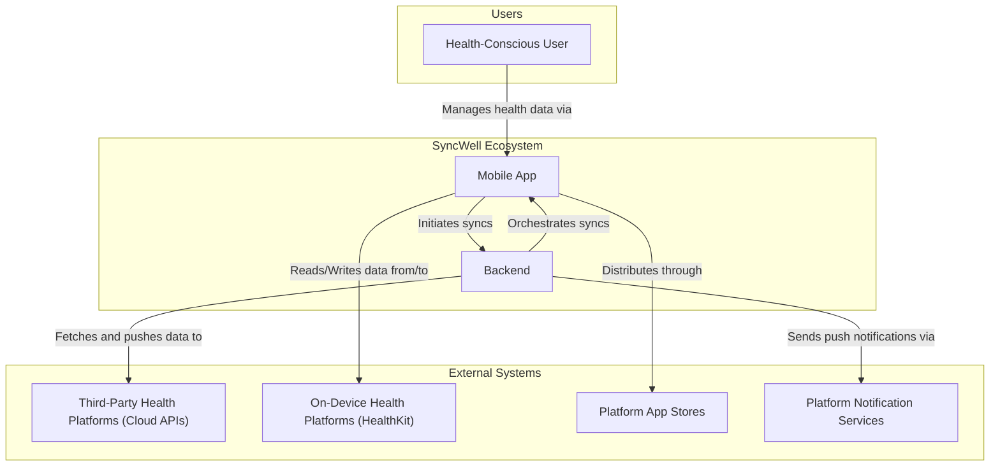
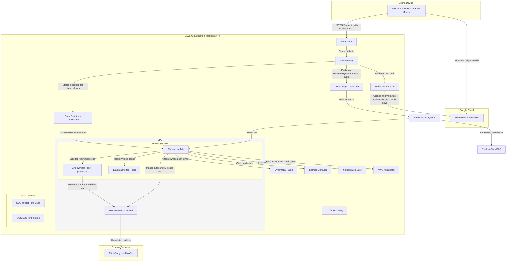
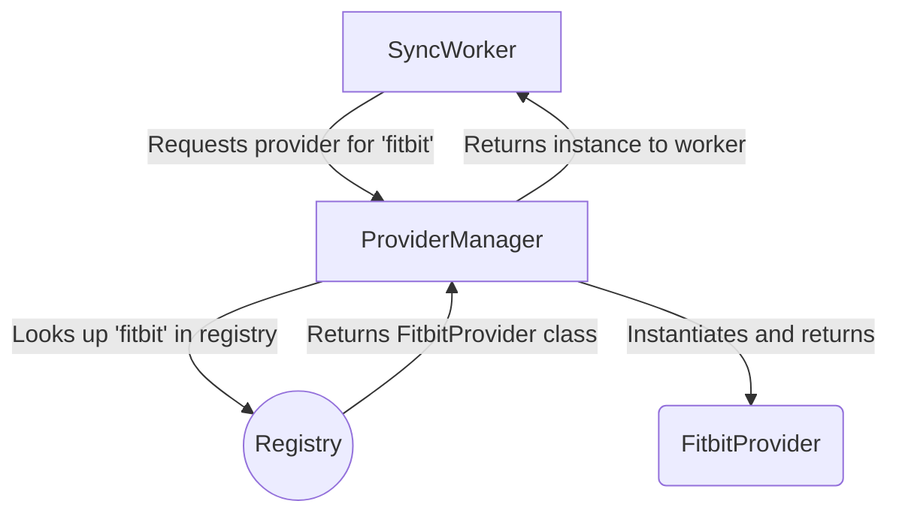
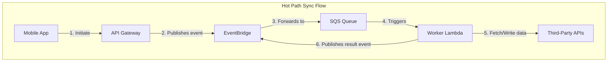
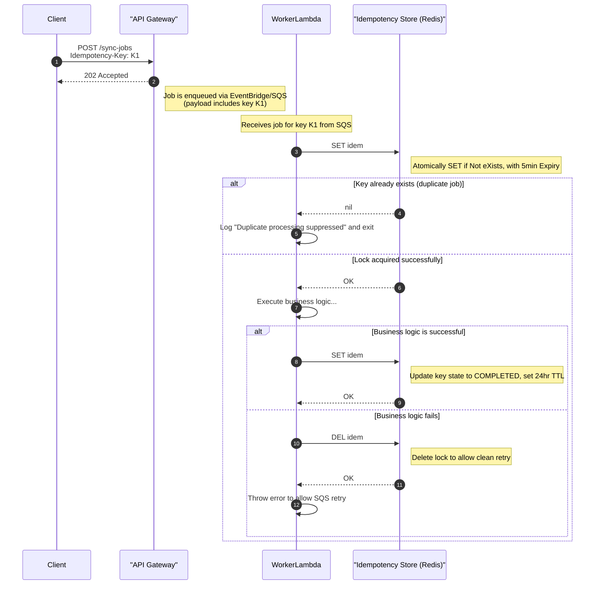
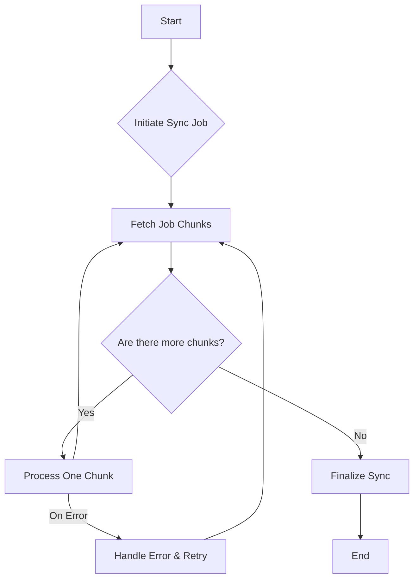
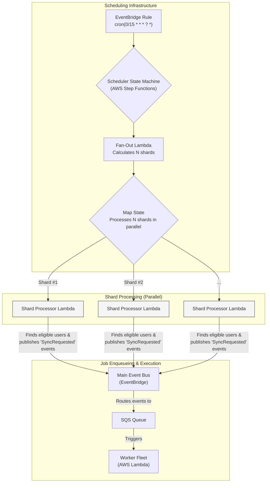

## Dependencies

### Core Dependencies
- `05-data-sync.md` - Data Synchronization & Reliability
- `07-apis-integration.md` - APIs & Integration Requirements
- `16-performance-optimization.md` - Performance & Scalability
- `17-error-handling.md` - Error Handling, Logging & Monitoring
- `18-backup-recovery.md` - Backup & Disaster Recovery
- `19-security-privacy.md` - Data Security & Privacy Policies
- `29-notifications-alerts.md` - Push Notifications & Alerts

### Strategic / Indirect Dependencies
- `01-context-vision.md` - Context & Vision
- `02-product-scope.md` - Product Scope, Personas & MVP Definition
- `14-qa-testing.md` - QA, Testing & Release Strategy
- `21-risks.md` - Risks, Constraints & Mitigation
- `25-release-management.md` - Release Management & Versioning
- `44-contingency-planning.md` - Contingency & Rollback Plans

---

# PRD Section 6: Technical Architecture, Security & Compliance

## 1. Executive Summary

This document specifies the complete technical architecture for the SyncWell application. The architecture is designed for high availability, massive scalability, and robust security to support **1 million Daily Active Users (DAU)**. It adheres to modern cloud-native principles and is engineered for a high-performing product team.

We will use the **C4 Model** as a framework to describe the architecture. The core architectural principles are **modularity**, **security by design**, and **privacy by default**. A key feature is its **hybrid sync model**, which combines a serverless backend for cloud-to-cloud syncs with on-device processing for integrations requiring native SDKs (e.g., Apple HealthKit). This approach maximizes reliability and performance. To further enhance the user experience *in the future*, the architecture makes provisions for an **AI Insights Service** to power intelligent features. The initial focus, however, will be on a robust and deterministic sync engine.

## 2. Architectural Model (C4)

### Level 1: System Context

This diagram shows the system in its environment, illustrating its relationship with users and external systems. It remains unchanged.



### Level 2: Containers

This level zooms into the system boundary to show the high-level technical containers. The architecture is composed of two primary workflows: a low-latency "hot path" for real-time syncs, and a robust "cold path" for long-running historical syncs, both powered by a unified AWS Lambda compute model. A core technology used is **Kotlin Multiplatform (KMP)**, which allows for sharing code between the mobile application and the backend.

**Note on Diagram Clarity:** The following diagram is a high-level overview intended to show the primary components and their most critical interactions. It is dense by nature. More detailed diagrams for specific workflows (e.g., Idempotency, Scheduling, Rate Limiting) are provided in the relevant sections below to explain those flows with greater clarity.



1.  **Mobile Application (Kotlin Multiplatform & Native UI)**
    *   **Description:** The user-facing application that runs on iOS or Android. It handles all user interactions and is a key component of the hybrid sync model.
    *   **Technology:** Kotlin Multiplatform (KMP) for shared business logic, SwiftUI for iOS, Jetpack Compose for Android.
    *   **Responsibilities:** Provides the UI, integrates with the Firebase Authentication SDK to manage the user sign-up/sign-in flows, securely stores JWTs, and handles on-device syncs (e.g., HealthKit).

2.  **Authentication Service (Firebase Authentication)**
    *   **Description:** A managed, third-party service that handles all aspects of user identity, including sign-up, sign-in, and social provider integration (Google/Apple).
    *   **Technology:** Firebase Authentication (Google Cloud).
    *   **Responsibilities:** Manages user credentials, issues short-lived JWTs to the mobile client after a successful authentication event, and provides public keys for backend token verification.

3.  **Scalable Serverless Backend (AWS)**
    *   **Description:** A decoupled, event-driven backend on AWS that uses a **unified AWS Lambda compute model** to orchestrate all syncs. This serverless-first approach maximizes developer velocity and minimizes operational overhead.
    *   The backend does not persist any raw user health data; any temporary diagnostic metadata containing user identifiers is stored in a secure, audited, time-limited index, as detailed in `19-security-privacy.md`. Data is otherwise only processed ephemerally in memory during active sync jobs.
    *   **Technology:** AWS Lambda, API Gateway, **Amazon EventBridge**, **Amazon SQS**, **AWS Step Functions**, DynamoDB Global Tables.
    *   **Responsibilities:** The API Layer (**API Gateway**) is responsible for initial request validation (e.g., format), authorization via the `AuthorizerLambda`, and routing requests to the appropriate backend service. It does not handle business-level validation like idempotency checks. To ensure maximum performance and cost-effectiveness, it will leverage **API Gateway's built-in caching for the Lambda Authorizer**. The authorizer's response (the IAM policy) will be cached based on the user's identity token for a configurable TTL (e.g., 5 minutes). For subsequent requests within this TTL, API Gateway will use the cached policy and will not invoke the `AuthorizerLambda`, dramatically reducing latency and cost. The Worker Service (also Lambda) is responsible for executing all cloud-to-cloud sync jobs, securely storing credentials, and storing user metadata. The `sub` (user ID) from the validated JWT is used to identify the user for all backend operations.

4.  **Distributed Cache (Amazon ElastiCache for Redis)**
    *   **Description:** An in-memory caching layer to improve performance and reduce load on downstream services. The cluster must be sized appropriately to handle the high volume of requests from the worker fleet, particularly for the rate-limiting functions which will be under heavy load at 10,000 RPS.
    *   **Technology:** Amazon ElastiCache for Redis.
    *   **Responsibilities:**
        *   Caches frequently accessed, non-sensitive data (e.g., user sync configurations).
        *   Powers the rate-limiting engine to manage calls to third-party APIs.

5.  **(Future) AI Insights Service (AWS)**
    *   **Description:** A service planned for a future release to provide intelligence to the platform. It will encapsulate machine learning models and LLM integrations, allowing the core sync engine to remain deterministic and focused.
    *   **Technology:** Amazon SageMaker, Amazon Bedrock, AWS Lambda.
    *   **Responsibilities:** The initial design considers providing intelligent conflict resolution, an LLM-based troubleshooter, and personalized summaries.

6.  **Monitoring & Observability (AWS CloudWatch)**
    *   **Description:** A centralized system for collecting logs, metrics, and traces from all backend services.
    *   **Technology:** AWS CloudWatch (Logs, Metrics, Alarms), AWS X-Ray.
    *   **Responsibilities:** Provides insights into system health, performance, and error rates. Triggers alarms for critical issues.

7.  **Data Governance & Schema Registry (AWS Glue Schema Registry)**
    *   **Description:** To manage the evolution of our canonical data models (e.g., `CanonicalWorkout`), we will use the AWS Glue Schema Registry. It acts as a central, versioned repository for our data schemas.
    *   **Technology:** AWS Glue Schema Registry.
    *   **Responsibilities:**
        *   Stores all versions of the canonical data model schemas.
        *   Enforces schema evolution rules (e.g., backward compatibility) within the CI/CD pipeline, preventing the deployment of breaking changes.
        *   Provides schemas to the worker service (AWS Lambda) for serialization and deserialization tasks, ensuring data conforms to the expected structure.

8.  **Centralized Configuration Management (AWS AppConfig)**
    *   **Description:** To manage dynamic operational configurations (like log levels or API timeouts) and feature flags, we will adopt AWS AppConfig. This allows for safe, audited changes without requiring a full code deployment.
    *   **Technology:** AWS AppConfig.
    *   **Responsibilities:**
        *   Stores and serves feature flags (e.g., enabling the `AI-Powered Merge` for Pro users).
        *   Manages operational parameters, allowing for real-time adjustments.
        *   **Manages critical resource identifiers (e.g., the DynamoDB table name). This is a crucial element of the disaster recovery strategy, allowing the application to be repointed to a restored database table without a code deployment.**
        *   Provides validation and deployment strategies for configuration changes, reducing the risk of outages.

### Level 3: Components (Inside the KMP Shared Module)

The KMP module contains the core business logic. This code can be executed **on the device** (for HealthKit syncs) or **on the backend**. For the backend, the general strategy is to compile the KMP module to a JAR and run it on a standard JVM-based AWS Lambda runtime to maximize code reuse.

However, a key exception will be made for the security-critical, latency-sensitive `AuthorizerLambda`. To ensure it meets the strict performance SLOs for API requests, it **must** be implemented in a faster-starting runtime like TypeScript or Python, as detailed in the Technology Stack section.

*   **`SyncManager`:** Orchestrates the sync process based on instructions from the backend.
*   **`ConflictResolutionEngine`:** Detects data conflicts. The initial version will use deterministic strategies (e.g., newest data wins, source priority).
*   **`ProviderManager`:** Manages the different `DataProvider` modules.
*   **`DataProvider (Interface)`:** A standardized interface for all third-party integrations.
*   **`ApiClient`:** Handles HTTP calls to backend and third-party services.
*   **`SecureStorageWrapper`:** Abstraction for Keychain/Keystore (on-device) and AWS Secrets Manager (on-backend).

### Level 3: Extensible Provider Integration Architecture

The core value of the application is its ability to connect with various third-party health services. To support rapid and reliable addition of new providers, the architecture defines a "plug-in" model. This model ensures that adding a new integration (e.g., for "Polar") is a predictable process that does not require changes to the core sync engine. This is achieved through a standardized interface, a factory for dynamic loading, and a secure configuration management strategy.

#### 1. The `DataProvider` Interface

All provider-specific logic is encapsulated in a class that implements the `DataProvider` interface. This interface, defined in the KMP shared module, creates a standardized contract for all integrations. The canonical definition of this critical interface, including the `capabilities` field, is maintained in `07-apis-integration.md`.

#### 2. Dynamic Loading with a Factory Pattern

The `ProviderManager` component acts as a factory to dynamically instantiate and manage provider-specific logic based on user configuration. This decouples the core sync engine from the individual provider implementations.

*   **Process:**
    1.  The `SyncWorker` receives a job (e.g., "sync steps from 'fitbit' to 'strava'").
    2.  It requests the `DataProvider` for "fitbit" from the `ProviderManager`.
    3.  The `ProviderManager` consults its internal registry, finds the `FitbitProvider` class, instantiates it, and returns the object to the worker.
    4.  The worker then uses this object to perform the data fetch.



This design means that to add a new provider, a developer only needs to implement the `DataProvider` interface and register the new class with the `ProviderManager`. No other code changes are needed.

#### 3. Secure Configuration and Secret Management

A secure and scalable strategy is essential for managing provider-specific configurations and API credentials.

*   **Provider-Specific Configuration:** Non-sensitive configuration, such as API endpoint URLs or supported data types, is stored in a configuration file co-located with the provider's implementation in the codebase.
*   **Application API Credentials:** The OAuth `client_id` and `client_secret` for each third-party service are highly sensitive. These are stored securely in **AWS Secrets Manager**. The backend services retrieve these credentials at runtime using a narrowly-scoped IAM role that grants access only to the secrets required for that service.
    *   **User OAuth Tokens:** User-specific `access_token` and `refresh_token` are never stored directly in the database. They are encrypted and stored in **AWS Secrets Manager**. To avoid storing a predictable ARN, the `Connection` item in DynamoDB will store a randomly generated UUID as the pointer to the secret. The application will then use this UUID to look up the full ARN from a secure mapping, adding a layer of indirection and security. When a Worker Lambda processes a job, its IAM role grants it permission to retrieve *only* the specific secret for the a connection it is working on, enforcing the principle of least privilege.

### Level 3: Components (Future AI Insights Service)

When implemented, the AI Insights Service will be composed of several components. The exact implementation details will be defined closer to the feature's development phase and will undergo a rigorous security and privacy review. The initial high-level concepts include:

*   **`Conflict Resolution Model`:** A potential machine learning model that could take two conflicting data entries and return a suggested merged version.
*   **`LLM-based Services`:** Lambda functions that could leverage foundational models (e.g., via Amazon Bedrock) to power features like an interactive troubleshooter or human-readable data summaries.

## 3. Sync Models: A Hybrid Architecture

To ensure reliability and accommodate platform constraints, SyncWell uses a hybrid architecture. This means some integrations are handled entirely in the cloud ("Cloud-to-Cloud"), while others require on-device processing using native SDKs (like Apple's HealthKit or Google's Health Connect).

The following table clarifies the integration model for each provider supported in the MVP:

| Provider | Integration Model | Rationale |
| :--- | :--- | :--- |
| **Apple Health** | Device-to-Cloud / Cloud-to-Device | HealthKit is a device-native framework with no cloud API. All processing must happen on the user's device. |
| **Google Fit** | Hybrid (Device & Cloud) | While Google Fit has a REST API, the new Health Connect SDK is the preferred, modern way to integrate on Android. The implementation will be device-first. The cloud API will only be used as a fallback under specific, defined conditions, such as when a sync fails with an error indicating the on-device provider is unavailable, or for data types that are only available via the cloud API. |
| **Fitbit** | Cloud-to-Cloud | Fitbit provides a comprehensive REST API for all data types. No on-device component is needed. |
| **Garmin** | Cloud-to-Cloud | Garmin provides a cloud-based API. No on-device component is needed. |
| **Strava** | Cloud-to-Cloud | Strava provides a cloud-based API. No on-device component is needed. |

### Model 1: Cloud-to-Cloud Sync

Cloud-to-cloud syncs are handled by two distinct architectural patterns depending on the use case.

#### **Hot Path Sync**
*   **Use Case:** Handling frequent, automatic, and user-initiated manual syncs for recent data.
*   **Flow:**
    1.  The Mobile App sends a request to API Gateway to start a sync.
    2.  **API Gateway** uses a direct service integration to validate the request and publish a semantic `HotPathSyncRequested` event to the **EventBridge Event Bus**.
    3.  An EventBridge rule filters for these events and sends them to the primary **Amazon SQS queue** for Hot Path jobs. This queue acts as a buffer, protecting the system from load spikes.
    4.  The SQS queue triggers the `Worker Lambda`, which processes the job.
    5.  **Failure Handling:** The worker's logic is simplified. On a non-transient processing error, it throws an exception. The primary SQS queue is configured with a **Dead-Letter Queue (DLQ)**. After a configured number of retries (`maxReceiveCount` will be set to **5**), SQS automatically moves the failed message to the DLQ for out-of-band analysis. This value balances allowing recovery from transient errors against not waiting too long to detect a persistent failure.
    6.  Upon successful completion, the `Worker Lambda` can publish a result event back to the bus for other services to consume.
*   **Advantage:** This is a highly reliable and extensible model. Leveraging the native SQS DLQ feature simplifies the worker logic, increases reliability, and improves observability.



#### **Historical Sync (Cold Path)**
*   **Terminology Note:** A "Historical Sync" is a long-running *workflow*. The individual tasks processed by this workflow are assigned a *low priority* for rate-limiting purposes to ensure they do not interfere with real-time user jobs.
*   **Use Case:** Handling user-initiated requests to backfill months or years of historical data.
*   **Flow:**
    1.  The Mobile App sends a request to a dedicated API Gateway endpoint to start a historical sync.
    2.  **API Gateway** uses a direct service integration to validate the request and start an execution of the **AWS Step Functions** state machine.
    3.  The state machine orchestrates the entire workflow, breaking the job into chunks, processing them in parallel with `WorkerLambda` invocations, and handling errors. The detailed workflow is described in the "Historical Sync Workflow" section below.
*   **Advantage:** Step Functions is the ideal choice for this workflow due to its rich, native observability features, which are critical for operating and debugging complex, long-running jobs at scale. The architecture will explicitly leverage:
    *   **Visual Workflow Monitoring:** Using the visual execution graph in the AWS Console to trace the path of each historical sync job in real-time and quickly identify the exact point of failure.
    *   **Detailed Execution History:** Relying on the detailed, event-by-event log of every state transition, including inputs and outputs, which is invaluable for auditing and debugging.
    *   **AWS X-Ray Integration:** Enabling end-to-end tracing to generate a service map that visualizes the entire workflow, including time spent in each state and in the invoked Lambda functions.
    These features make the process far more reliable and transparent than orchestration with a single, long-lived function.

### Model 2: Device-to-Cloud Sync
*(Unchanged)*

### Model 3: Cloud-to-Device Sync
*(Unchanged)*

## 3a. Unified End-to-End Idempotency Strategy

In a distributed, event-driven system, operations can be retried at multiple levels, making a robust idempotency strategy critical for data integrity. We will implement a single, unified strategy based on a client-generated **`Idempotency-Key`**. This key ensures that an operation is processed at most once by the asynchronous backend workers.

*   **Key Generation:** The mobile client is responsible for generating a unique `Idempotency-Key` (e.g., a UUID) for each new state-changing operation. This same key **must** be used for any retries of that same operation.

*   **End-to-End Flow:**
    1.  **API Request:** The client sends a `POST` request, including the `Idempotency-Key` in the HTTP header.
    2.  **API Gateway:** Using a direct service integration, API Gateway passes the request payload and the `Idempotency-Key` directly to the backend service (EventBridge for real-time syncs, Step Functions for historical syncs). It does not perform any idempotency checks itself.
    3.  **Asynchronous Worker Execution:** The worker (Lambda) receives the event, which includes the `Idempotency-Key`. Before starting any processing, it implements a **two-phase idempotency lock** against the central store (Redis), as detailed in the sequence diagram below. This robust pattern ensures that a job is not only prevented from being processed twice, but also handles race conditions where two workers attempt to process the same job simultaneously.

*   **Benefit:** This approach simplifies the architecture by consolidating all idempotency logic within the asynchronous worker. While this means a duplicate request consumes minimal resources until it is checked by the worker, it is a sound trade-off for the reduced latency and operational simplicity at the API layer.

#### Idempotency for Historical Syncs (Step Functions)
For long-running historical syncs initiated via Step Functions, an additional layer of idempotency is applied at the orchestration level:
*   **Execution Naming:** The API Gateway integration **must** be configured to use the client-provided `Idempotency-Key` from the request as the `name` for the Step Function's execution. This ensures that a given `Idempotency-Key` can only ever start one execution.
*   **Handling Existing Executions:** API Gateway's integration will attempt to start a new state machine execution with this name. If the call fails with an `ExecutionAlreadyExists` error, it signifies that the operation was already successfully initiated. The integration mapping can be configured to catch this specific error and return a `202 Accepted` response to the client. This prevents duplicate state machine executions for the same historical sync job.

#### Idempotency Store Implementation

The idempotency store will be implemented in the ElastiCache for Redis cluster with the following schema:
*   **Key:** `idem#<Idempotency-Key>` (e.g., `idem#a1b2c3d4-e5f6-7890-1234-567890abcdef`)
*   **Value:** The serialized JSON response that was originally returned to the client (e.g., the `202 Accepted` response for a sync job).
*   **TTL (Time-to-Live):** 24 hours. This duration is chosen as a safe upper bound to handle reasonable client-side retry windows. For example, if a user's device is offline for several hours, the client-side job scheduler may retry the operation once connectivity is restored. A 24-hour TTL ensures that even in these edge cases, the operation is not erroneously processed twice.

The following sequence diagram illustrates the end-to-end flow, where the idempotency check is handled entirely by the asynchronous worker.



The flow in this diagram can be broken down as follows:
1.  **Client Request:** The client initiates a request, providing a unique `Idempotency-Key`.
2.  **API Gateway:** The gateway immediately accepts the request and forwards the job for asynchronous processing, returning `202 Accepted` to the client.
3.  **Worker Lock Acquisition:** When a worker receives the job, it first attempts to acquire a lock. It tries to atomically `SET` the idempotency key in Redis with a value of `INPROGRESS` and a short TTL, but only if the key does not already exist (`NX` option).
4.  **Duplicate/In-Progress Check:**
    *   If the `SET` operation succeeds, the worker has acquired the lock and can begin processing.
    *   If the `SET` operation fails, the key already exists. The worker should then `GET` the key's value. If the value is `COMPLETED`, the job is a duplicate, and the worker can exit gracefully. If the value is `INPROGRESS`, another worker is currently processing the job, and the current worker can also exit.
5.  **Execution and Finalization:** If the worker successfully acquired the lock, it executes the business logic.
    *   **On Success:** It updates the key's value to `COMPLETED` and sets a longer TTL (e.g., 24 hours).
    *   **On Failure:** It `DEL`etes the key entirely. This removes the `INPROGRESS` lock, allowing a subsequent retry (e.g., from SQS) to attempt the job cleanly.

## 3b. Architecture for 1M DAU

To reliably serve 1 million Daily Active Users, the architecture incorporates specific strategies for high availability, performance, and scalability.

### High Availability: MVP Single-Region Architecture

To balance cost, complexity, and time-to-market for the MVP, the SyncWell backend will be deployed to a **single AWS region**. This decision resolves a critical contradiction within the initial architecture and simplifies the compliance strategy regarding data residency. While a global multi-region architecture is the long-term goal, a single-region deployment is the pragmatic and responsible choice for the initial launch.

*   **MVP Deployment:** The entire backend infrastructure will be deployed in a single, primary AWS region (e.g., `us-east-1`). This includes all compute (Lambda), database (DynamoDB), and networking resources.

*   **Intra-Region High Availability:** High availability will be achieved *within* the single region by deploying services across multiple Availability Zones (AZs).
    *   **Stateless Services:** API Gateway and AWS Lambda are inherently highly available across AZs.
    *   **Stateful Services:** The DynamoDB table and ElastiCache for Redis cluster will be configured for Multi-AZ deployment. This ensures that the failure of a single AZ does not result in a service outage.

*   **Future Multi-Region Strategy:** The architecture is designed with a future multi-region deployment in mind. Key considerations for this evolution include:
    *   **Data Replication:** Migrating from a single-region DynamoDB table to a Global Table.
    *   **Request Routing:** Implementing latency-based routing with Amazon Route 53.
    *   **Data Residency & Compliance (GDPR):** The single-region MVP approach simplifies compliance with data residency regulations like GDPR. The future multi-region strategy **must** include a comprehensive plan for data residency, potentially involving region-specific infrastructure silos or fine-grained data routing policies to ensure compliance. This will be a primary workstream when the multi-region expansion is prioritized.

*   **Resilience Testing (Chaos Engineering):** The practice of chaos engineering remains critical, even in a single-region setup. We will use the **AWS Fault Injection Simulator (FIS)** to validate our intra-region high availability.

    **MVP Experiment Catalog:**
    *   **Worker Failure:** Terminate a random percentage (10-50%) of Lambda instances to ensure that SQS retries and the remaining fleet can handle the load.
    *   **API Latency:** Inject a 500ms latency into calls from a worker Lambda to a third-party API endpoint to verify that timeouts and retry logic work as expected.
    *   **DynamoDB Latency:** Inject latency on DynamoDB reads/writes to test application-level timeouts.
    *   **Secrets Manager Unavailability:** Block access to AWS Secrets Manager for a short period to verify that the worker fails gracefully when it cannot retrieve credentials and that the job is correctly returned to the queue for a later retry.
    *   **Availability Zone Failure:** Use FIS to simulate the failure of a single Availability Zone to validate that our Multi-AZ configuration for DynamoDB and ElastiCache works as expected and that the system remains operational.
    *   **Cache Cluster Failure:** Simulate a full failure of the ElastiCache cluster to verify that the system enters a safe, degraded mode and does not overwhelm the database (i.e., test the "cache stampede" scenario).

### Performance & Scalability: Caching, Load Projections & Networking

*   **Caching Strategy:** A distributed cache using **Amazon ElastiCache for Redis** is a critical component for minimizing latency, reducing load on backend services, and enabling key functionality. The system will employ a **cache-aside** pattern for all caching. When the application needs data, it first queries the cache. If the data is present (a cache hit), it is returned immediately. If the data is not present (a cache miss), the application retrieves the data from the source of truth (e.g., DynamoDB), stores it in the cache with a defined Time-to-Live (TTL), and then returns it.

    The following table details the specific items to be cached:

    | Item Type | Key Structure | Value | TTL | Invalidation Strategy | Purpose |
    | :--- | :--- | :--- | :--- | :--- | :--- |
    | **Idempotency Key** | `idem##{idempotencyKey}` | The original JSON response | 24 hours | TTL-based | Prevents duplicate processing of operations. |
    | **User Sync Config** | `config##{userId}` | Serialized JSON of all user's sync configs | 15 minutes | TTL-based | Reduces DynamoDB reads for frequently accessed user settings. |
    | **Rate Limit Token Bucket** | `ratelimit##{providerKey}` | A hash containing tokens and timestamp | 60 seconds | TTL-based | Powers the distributed rate limiter for third-party APIs. |
| **API Gateway Authorizer (L1 Cache)** | User's Identity Token | The generated IAM policy document | 5 minutes | TTL-based (in API Gateway) | The primary, most critical cache. Caches the final authorization policy at the API Gateway level, avoiding a Lambda invocation entirely for most requests. |
| **JWT Public Keys (L2 Cache)**| `jwks##{providerUrl}` | The JSON Web Key Set (JWKS) document | 1 hour | TTL-based (in-memory) | A secondary, in-memory cache inside the authorizer Lambda. It caches the public keys from auth providers (e.g., Google) and is only used when the L1 API Gateway cache misses, further reducing latency on the first request for a given user. |
| **Negative Lookups** | Varies | Special "not-found" value | 1 minute | TTL-based | To prevent repeated, fruitless database queries for non-existent data, negative lookups (confirming an item does not exist) will also be cached. |

To visually explain the rate-limiting pattern, the following diagram shows how a worker interacts with the distributed rate limiter before calling an external service.

```mermaid
sequenceDiagram
    participant Worker as "Worker Lambda"
    participant Redis as "ElastiCache for Redis\n(Rate Limiter)"
    participant SQS as "SQS Queue"
    participant ThirdParty as "Third-Party API"

    Worker->>Worker: Need to call external API
    Worker->>+Redis: Atomically check & decrement token\nKey: "ratelimit##{providerKey}"

    alt Token Available
        Redis-->>-Worker: OK
        Worker->>+ThirdParty: GET /v1/data
        ThirdParty-->>-Worker: 200 OK
    else Token Not Available (Rate Limit Exceeded)
        Redis-->>-Worker: FAIL
        Worker->>SQS: ChangeMessageVisibility(delay)
        note right of Worker: Return job to queue with a delay
    end

```

This sequence diagram shows a **Worker Lambda** needing to make an external API call. Before doing so, it first interacts with the **ElastiCache for Redis** cluster. If a token is available, it proceeds. If the rate limit is exceeded, the worker **must not** simply fail. Instead, it will use the SQS `ChangeMessageVisibility` API call to return the job to the queue with a visibility timeout (a delay). This is more efficient than a full failure and retry, as it provides more precise control over the backoff period.

The workflow for the distributed rate limiter is as follows:
1.  The **Worker Lambda** is about to make an API call to a third-party service.
2.  It makes an atomic call to the **ElastiCache for Redis** cluster to check for and consume a token.
3.  **If a token was available**, the worker proceeds to make the outbound API call to the **Third-Party API**.
4.  **If a token was not available** (the rate limit has been exceeded), the worker **must not** make the external call. Instead, it must call the SQS `ChangeMessageVisibility` API to return the message to the queue with a calculated delay. This is the designated backoff mechanism.

*   **Load Projections & Resource Estimation:**
    *   **Assumptions (Bottom-Up Estimation):**
        *   1,000,000 DAU.
        *   Average user has 3 active sync configurations.
        *   Syncs run automatically every ~1 hour (24 syncs/day). Manual syncs add 25% overhead.
        *   Peak usage is concentrated in a 4-hour window (e.g., 7-9am and 8-10pm), accounting for 50% of daily traffic.
    *   **Bottom-Up Calculation:**
        *   Total daily requests: `1M users * 3 configs * 24 syncs/day * 1.25 = 90M requests/day`.
        *   Average RPS: `90M / 86400s = ~1,042 RPS`.
        *   Peak RPS from this model: `45M / 14400s = ~3,125 RPS`.
    *   **Governing Non-Functional Requirement (NFR):**
        *   To ensure the system is highly resilient and can handle viral growth, the governing NFR is for the system to handle a peak load of **3,000 requests per second (RPS)**.
        *   **The architecture must be designed, provisioned, and load-tested to meet this 3,000 RPS target.** This is the definitive scalability goal.
    *   **Worker Concurrency (Lambda) & SQS (at 3,000 RPS):**
        *   The critical metric for provisioning is peak concurrency. SQS can easily handle this throughput.
        *   To ensure the system can meet its performance targets under realistic, worst-case conditions, the concurrency calculation **must** be based on the P90 Service Level Objective (SLO) for job duration (15 seconds), not an optimistic average.
        *   Required Concurrency (Worst-Case) = `3,000 jobs/s * 15s/job = 45,000 concurrent Lambda executions`.
        *   **Provisioned Concurrency:** Given that the `WorkerLambda` uses a KMP/JVM runtime with known cold start latencies, **Provisioned Concurrency** will be enabled for the `WorkerLambda` fleet. This keeps a specified number of execution environments warm and ready to respond instantly. This strategy is critical for eliminating cold start latency and making performance more predictable.
    *   **Feasibility & Risk Mitigation (CRITICAL PROJECT BLOCKER):**
        *   The projection of **~45,000 concurrent executions** represents a worst-case scenario that is financially and technically extreme. This finding is considered a **potential project-threatening risk**. The architecture must not be approved for implementation until this risk is fully mitigated.
        *   The following actions are **mandatory, project-blocking prerequisites** before implementation can begin:
            1.  **Halt Project & Build Cost Model:** The project **must be halted** until a detailed cost model for this level of concurrency is created, presented to, and explicitly approved by all project stakeholders. The financial viability of this approach is questionable and must be proven.
            2.  **Mandatory Proof-of-Concept:** A proof-of-concept load test **must be executed** to validate that this level of concurrency is technically achievable and does not overwhelm downstream dependencies (especially third-party APIs). This is not a post-design task; it is a prerequisite for architectural acceptance.
            3.  **Architectural Re-evaluation:** The architecture **must be re-evaluated** to identify and prioritize alternatives that reduce concurrency. Strategies like batching multiple sync jobs within a single Lambda invocation or moving the workload to a container-based model (e.g., AWS Fargate) must be prototyped and compared against the current Lambda-per-job model. The goal is to find a more cost-effective and less risky approach.
            4.  **Secure Service Limit Increases:** Any approved architecture will still require significant scale. The required AWS account limits for Lambda concurrency (or other services) must be formally requested and approved well in advance of launch.
    *   **DynamoDB:**
        *   We will use a **hybrid capacity model**. A baseline of **Provisioned Capacity** will be purchased via a Savings Plan to cost-effectively handle the predictable average load. **On-Demand Capacity** will handle any traffic that exceeds the provisioned throughput, providing the best of both worlds in terms of cost and elasticity.

*   **Networking Optimization with VPC Endpoints:**
    *   **Context:** The `WorkerLambda` functions run within a VPC to access the ElastiCache cluster. By default, any outbound traffic from this Lambda to other AWS services (like DynamoDB, SQS, EventBridge, and S3) would be routed through a NAT Gateway, incurring data processing costs and routing traffic over the public internet.
    *   **Strategy:** To enhance security and significantly reduce costs, the architecture will use **VPC Endpoints**. This allows the Lambda functions to communicate with other AWS services using private IP addresses within the AWS network, bypassing the public internet and the NAT Gateway for this traffic.
        *   **Gateway Endpoints:** Free endpoints will be configured for **Amazon S3** and **DynamoDB**.
        *   **Interface Endpoints:** Privately-accessible endpoints will be configured for **SQS**, **EventBridge**, and **Secrets Manager**. While these have a small hourly cost, it is generally much lower than processing large volumes of API traffic through a NAT Gateway.
    *   **Benefit:** This is an AWS best practice that improves the security posture of the application by keeping AWS service traffic off the public internet, and it provides a direct cost saving by minimizing billable traffic through the NAT Gateway.

## 3c. DynamoDB Data Modeling & Access Patterns

To support the application's data storage needs efficiently and scalably, we will use a **single-table design** in DynamoDB. This modern approach to NoSQL data modeling minimizes operational overhead, reduces costs by optimizing read/write operations, and allows for complex access patterns with a single table.

Our primary data table will be named **`SyncWellMetadata`**. It will use a composite primary key and a Global Secondary Index (GSI) to serve all required access patterns.

### Table Definition: `SyncWellMetadata`

*   **Primary Key:**
    *   **Partition Key (PK):** `USER#{userId}` - All data for a given user is co-located in the same partition, enabling efficient retrieval of a user's entire profile with a single query.
    *   **Sort Key (SK):** A hierarchical string that defines the type of data and its relationships (e.g., `PROFILE`, `CONN#{connectionId}`).
*   **Capacity Mode:** On-Demand. For the MVP, the table will use On-Demand capacity mode. This is the most cost-effective and flexible choice for the initial unpredictable workload, as it automatically scales to meet traffic demands without the need for manual capacity planning.
*   **Global Tables:** For the MVP, the table will exist in a single region. It will not be configured as a Global Table. This is a simplification to reduce cost and complexity, and can be enabled in a future phase.

### Item Types & Schema

Below are the different data entities, or "item types," that will be stored in the `SyncWellMetadata` table.

| Entity | PK (Partition Key) | SK (Sort Key) | Key Attributes & Purpose |
| :--- | :--- | :--- | :--- |
| **User Profile** | `USER#{userId}` | `PROFILE` | `SubscriptionLevel`, `CreatedAt`. Stores top-level user attributes. A user's profile is the root item for all their related data. |
| **Connection** | `USER#{userId}` | `CONN#{connectionId}` | `Status` (`active`, `needs_reauth`), `CredentialArn`. Represents a user's authenticated link to a 3rd party (e.g., Fitbit). This is referred to as a "Connection". |
| **Sync Config** | `USER#{userId}` | `SYNCCONFIG#{sourceId}#to#{destId}##{dataType}` | `LastSyncTime`, `ConflictStrategy`, `IsEnabled`. Defines a single data sync flow for a user. |
| **Hist. Sync Job** | `USER#{userId}` | `HISTORICAL##{orchestrationId}` | `ExecutionArn`, `StartDate`, `Status`. Acts as a pointer to the AWS Step Functions execution that orchestrates a large historical data sync. The definitive status is stored in the state machine itself. |

*Example SYNCCONFIG SK:* `SYNCCONFIG#fitbit#to#googlefit##steps`.

**Note on Sparse Attributes:** This single-table design makes use of sparse attributes. Attributes that are not relevant to a particular item type (e.g., a `LastSyncTime` attribute on a `PROFILE` item) are not stored at all for that item. This is a core feature of NoSQL databases and is highly efficient, as it reduces both storage costs and the amount of data transferred for each read operation.

**Note on Historical Sync Job Items:** Storing a potentially large number of `HISTORICAL` items in the same item collection as the `PROFILE` and `CONN` items can lead to performance degradation when fetching core user data. The query to "Get all settings for a user" (`PK = USER#{userId}`) will retrieve these job items, increasing payload size and read costs. The initial mitigation of relying on client-side filtering is weak and error-prone.
**Stronger Mitigation Strategy:** A more robust, backend-enforced mitigation will be used. The primary API endpoint for fetching a user's profile and settings **must not** return `HISTORICAL` job items by default. These items should only be returned if explicitly requested via a separate API endpoint (e.g., `GET /v1/users/me/historical-syncs`) or a specific query parameter. This ensures that the most common API calls remain fast and efficient.

### Supporting Operational Access Patterns

Some access patterns are for infrequent, non-time-sensitive operational tasks, not for real-time user-facing requests. A common example is finding all users who need to be notified to re-authenticate a service. Creating a Global Secondary Index (GSI) on a low-cardinality attribute like `Status` is an anti-pattern that leads to severe performance issues ("hot partitions").

Instead, we will address this with a more robust and scalable approach:

*   **Background Scans:** A scheduled, periodic background process (e.g., a weekly Lambda) will perform a DynamoDB `Scan` operation on the table to find all connections with a `needs_reauth` status. Because scans are slow and consume read capacity, this job will be configured to run at a very low, throttled rate during off-peak hours to avoid impacting production traffic. This is a standard and cost-effective pattern for non-urgent, full-table queries.

### Distributed Locking with DynamoDB

To prevent race conditions in our highly concurrent environment (e.g., two workers processing the same sync job simultaneously), a robust distributed locking mechanism is required. As detailed in `18-backup-recovery.md`, using a replicated cache for this purpose is an anti-pattern in a multi-region architecture due to replication lag.

Therefore, we will use **DynamoDB's conditional write functionality** to implement a correct and consistent distributed lock.

*   **Mechanism:** A worker will attempt to acquire a lock by creating a specific lock item in the `SyncWellMetadata` table. This `PutItem` operation will have a **condition expression** that causes it to fail if an item with that primary key already exists.
*   **Item Schema:**
    *   **PK:** `USER#{userId}`
    *   **SK:** `LOCK##{lockScope}` (e.g., `LOCK##syncJob`)
    *   **ttl:** A short TTL (e.g., 5 minutes) to automatically release the lock in case of a worker crash, preventing deadlocks.
*   **Consistency:** This leverages DynamoDB's strong consistency for write operations, providing a reliable locking mechanism that is safe for a multi-region, active-active deployment.

### Core Access Patterns Supported

This single-table design efficiently serves the following critical access patterns:

| Use Case | Access Pattern | DynamoDB Operation | Efficiency |
| :--- | :--- | :--- | :--- |
| **Get all settings for a user** | Fetch all records for a given user. | `Query` on `PK = USER#{userId}` | **High** |
| **Get state for a single sync job** | Fetch the `LastSyncTime` and `ConflictStrategy`. | `GetItem` with `PK` and `SK = SYNCCONFIG#{...}` | **Very High** |
| **Update `lastSyncTime` after sync** | Update a single sync configuration. | `UpdateItem` with `PK` and `SK = SYNCCONFIG#{...}` | **Very High** |
| **Mark a connection as invalid** | Update a connection's status to `needs_reauth`. | `UpdateItem` with `PK` and `SK = CONN#{...}` | **Very High** |
| **Get progress of a historical sync** | Fetch the orchestration record for a user. | `GetItem` with `PK` and `SK = HISTORICAL#{...}` | **Very High** |
| **Find all users to notify for re-auth**| Find all connections with status `needs_reauth`. | `Scan` operation (run as a low-priority, background job). | **Low (by design)** |

This structure provides a flexible and scalable foundation for our application's metadata needs.

### Data Consistency and Conflict Resolution

While the single-region architecture avoids multi-master write conflicts, race conditions can still occur with highly concurrent workers. To prevent data loss from simultaneous updates, the following strategies will be employed:

*   **Distributed Locking:** For stateful processes like sync jobs, a DynamoDB-based distributed lock will be used to ensure only one worker can operate on a specific resource at a time, as detailed in the "Distributed Locking" section.
*   **Optimistic Locking with Versioning:** For updates to critical user configuration data (e.g., a `SYNCCONFIG` item), the application **must** use optimistic locking. This will be implemented by:
    1.  Adding a `version` attribute (a number) to the DynamoDB item.
    2.  When reading the item, the application notes the current `version`.
    3.  When writing an update, the application will use a **condition expression** to ensure the `version` number on the server is the same as when it was read.
    4.  If the condition check passes, the update succeeds, and the `version` number is incremented.
    5.  If the condition check fails, it means another process updated the item in the meantime. The client must re-read the data, re-apply its change, and try the write again.
This approach replaces the high-risk "last writer wins" strategy with a safe, industry-standard pattern for preventing lost updates.

**Mitigating "Viral User" Hot Partitions:** While the single-table design is highly efficient, it presents a "hot partition" risk for a "viral user" whose activity dramatically exceeds the norm. Because all data for one user resides on the same physical partition, their high traffic could lead to throttling. The strategy to mitigate this must be chosen carefully to balance performance and complexity.

**Primary Strategy: "Hot User" Isolation via Dedicated Table**

The recommended primary strategy is to isolate the hot user's data into a separate, dedicated DynamoDB table. This provides complete performance isolation with minimal architectural complexity.

    *   **Identification and Mitigation:**
        *   **Automated Identification:** A user is identified as "hot" via a CloudWatch Alarm on the `ThrottledRequests` metric for the `SyncWellMetadata` table. This alarm **must** be configured to use high-cardinality custom metrics (e.g., using CloudWatch Embedded Metric Format) to pinpoint the specific `userId` causing the throttling, as this is not possible with standard metrics.
        *   **Automated Mitigation Workflow:** A manual response to a "hot user" alert is not a scalable or reliable solution. The mitigation process **must be automated**. The CloudWatch alarm will trigger a Step Functions workflow that orchestrates the entire migration process without human intervention.

*   **Automated Migration Workflow (via Step Functions):**
    1.  **Trigger:** The CloudWatch alarm on `ThrottledRequests` triggers the "Hot User Migration" Step Functions state machine, passing the `userId` as input.
    2.  **Flag for Migration:** The first step is a Lambda function that flags the user's `PROFILE` item with a `migrationStatus: "IN_PROGRESS"` attribute. This prevents race conditions.
    3.  **Copy Data:** A parallel step copies all items for the user from the main table to the dedicated `SyncWellMetadata_HotUsers` table.
    4.  **Verify Data:** The workflow verifies that the data has been copied correctly.
    5.  **Activate Redirect:** Upon successful verification, the workflow updates the user's "pointer" item in the main table, setting `isHot: true` and `migrationStatus: "COMPLETED"`. This atomically switches all new application traffic to the hot table.
    6.  **Alerting:** The workflow sends a notification to a Slack channel to inform the engineering team that a user has been automatically migrated.

*   **Application Logic:**
    *   The application's data access layer will check the `isHot` flag (which can be heavily cached) to determine which table to query. If the flag is true, all requests are routed to the `SyncWellMetadata_HotUsers` table.

*   **Advantages of Automation:**
    *   **Scalability:** The system can respond to "hot user" events automatically, 24/7, without requiring an engineer to be paged.
    *   **Reliability:** An automated, tested workflow is far less prone to human error than a manual script-based process.
    *   **Speed:** The time to mitigate is reduced from minutes/hours to seconds, protecting overall system health.

*   **Manual Override:** A manual, script-based process may be maintained for emergency use or for de-migrating a user, but it must be subject to the most stringent peer review and safety checks. The primary path **must** be the automated one.

*   **Advantages:**
    *   **Simplicity:** This approach avoids the significant read-side complexity of other techniques like write-sharding, as the application logic only needs to select a table name, not query multiple shards and merge results.
    *   **Isolation:** It provides perfect performance isolation, ensuring that a high-volume user cannot impact the performance of the general user population.

**Secondary Strategy: Application-Level Write Sharding**

Application-level write sharding should only be considered if the "hot table" strategy proves insufficient (e.g., if a single user's traffic becomes so extreme it could overwhelm a single table's partition limit).

*   **Concept:** This feature involves distributing a single user's data across multiple partitions within the *same* table by appending a shard number to the partition key (e.g., `USER#{userId}-1`, `USER#{userId}-2`).
*   **Read-Side Complexity:** This approach introduces significant implementation complexity. Fetching all data for a sharded user requires the application to query all N shards and merge the results in the application logic, which increases latency and cost.
*   **Write-Heavy User Scenario:** The "hot table" strategy is primarily designed for read-heavy users. A user whose write traffic is high enough to threaten the partition's throughput is a different and more complex scenario. While the "hot table" still provides some isolation, true write-sharding would be the ultimate solution. This would be a major architectural project and is considered out of scope for the MVP, but it is a known "unknown" that must be monitored.

Given its simplicity and effectiveness, the "hot table" strategy will be the first and preferred solution to be implemented and assessed.

#### Degraded Mode and Cache Resilience

The ElastiCache for Redis cluster is a critical component for performance and system stability. The strategy for handling a cache failure is multi-layered.

*   **High Availability (Within a Region):** To prevent a single node failure from causing an outage, the ElastiCache for Redis cluster **must** be deployed in a **Multi-AZ configuration**. This provides automatic failover to a replica in a different Availability Zone, which is transparent to the application and handles the most common failure scenarios.

*   **Resilience to Full Cluster Failure (Degraded Mode):** In the rare event of a full cluster failure that Multi-AZ cannot mitigate, the system must fail safely.
    *   **Mechanism:** If the application cannot connect to the Redis cluster, it will enter a **degraded mode**.
    *   **Impact:**
        *   **Latency:** API and sync latency will increase significantly as all caching is bypassed.
        *   **Distributed Locking:** This feature will be disabled. This is a significant degradation. The impact is as follows:
            *   **Risk Analysis:** Without distributed locking, two `WorkerLambda` instances could start processing the same sync job for the same user concurrently. The end-to-end `Idempotency-Key` mechanism (see Section 3a) is the primary safeguard against data corruption, as it prevents the final state from being written more than once. However, the concurrent processing could still lead to duplicated outbound API calls to third-party services, which is inefficient and could, in rare edge cases, cause issues with those providers.
            *   **Mitigation:** The risk is accepted as a temporary degradation. The core data integrity is protected by the idempotency key. The system will continue to function, albeit less efficiently, until the cache is restored.
        *   **Rate Limiting:** This is the most critical function. In a degraded mode, the system **will not** proceed without rate limiting. Instead, all worker Lambdas will treat the failure to get a rate limit token as a transient error and will back off, effectively slowing down or pausing all third-party API calls until the cache is restored. This is a critical safety mechanism to prevent overwhelming downstream APIs.
        *   **Alerting:** A critical alert will be triggered to notify the on-call team of the cache failure.
This strategy ensures that a cache failure results in a slower, but safe, service, not a complete or dangerous one.

### Level 4: Historical Sync Workflow

To handle long-running, complex, and potentially error-prone processes like a user's historical data sync, we will use a dedicated workflow orchestrator. **AWS Step Functions** is the ideal choice as it is a fully managed service that aligns with our serverless-first approach, providing excellent reliability, state management, and observability out of the box.

The following diagram illustrates the state machine for a historical sync job.



*   **State Machine Logic:**
    1.  **Initiate & Calculate Chunks:** The workflow is triggered, and a Lambda function calculates the date range, breaking it into an array of smaller, logical chunks.
    2.  **Process in Parallel (`Map` State):** The state machine uses a `Map` state to iterate over the array of chunks, invoking a Worker Lambda for each chunk in parallel. This dramatically improves performance.
    3.  **Process One Chunk:** The Worker Lambda is responsible for the core logic: fetching data for its assigned chunk, transforming it, and writing it to the destination platform.
    4.  **Error Handling:** The state machine has a declarative `Retry` policy for transient errors. The `Map` state can also be configured with a `Catch` block to handle and log persistent failures for a specific chunk without halting the entire workflow.
    5.  **Finalize Sync & Notify User:** After the `Map` state completes, a final Lambda function is invoked. Its responsibility is to publish a `HistoricalSyncCompleted` or `HistoricalSyncFailed` event. This event triggers a push notification to the user (e.g., `N-05` or `N-06`) to inform them of the outcome. This push-based approach is far more efficient and provides a better user experience than requiring the client to poll for status.

## 3d. Core API Contracts

To ensure clear communication between the mobile client and the backend, we define the following core API endpoints. This is not an exhaustive list but represents the most critical interactions. The API will be versioned via the URL path (e.g., `/v1/...`). A full OpenAPI 3.0 specification will be maintained in the repository as the single source of truth.

### GET /v1/connections

Retrieves a list of all third-party applications the user has connected to their SyncWell account.

*   **Success Response (200 OK):**

    ```json
    {
      "connections": [
        {
          "connectionId": "conn_12345_providerA",
          "provider": "providerA",
          "displayName": "Provider A",
          "status": "active"
        },
        {
          "connectionId": "conn_67890_providerB",
          "provider": "providerB",
          "displayName": "Provider B",
          "status": "active"
        }
      ]
    }
    ```

### POST /v1/sync-jobs

Initiates a new synchronization job for a user.

*   **Headers:**
    *   `Idempotency-Key: <UUID>` (Required for all `POST` operations)
*   **Request Body:**

    ```json
    {
      "sourceConnectionId": "conn_12345_providerA",
      "destinationConnectionId": "conn_67890_providerB",
      "dataType": "workout",
      "mode": "manual",
      "dateRange": {
        "startDate": "2023-01-01",
        "endDate": "2023-12-31"
      }
    }
    ```
    *   **`dataType` (enum):** `steps`, `weight`, `sleep`, `workout`
    *   **`mode` (enum):**
        *   `manual`: A sync explicitly triggered by the user for recent data. This is a hot-path operation.
        *   `historical`: A sync triggered by the user to backfill a large amount of data. This is a cold-path operation that starts the Step Functions orchestrator.
    *   **`dateRange` (object):** This field is **required** if and only if `mode` is `historical`. If `mode` is `historical` and this field is omitted, the API will return a `400 Bad Request`.
    *   **Note on Automatic Syncs:** Automatic background syncs are not triggered via this public API. They are initiated by an internal scheduling mechanism (e.g., an Amazon EventBridge scheduled rule) that places jobs directly onto the event bus.

*   **Success Response (202 Accepted):**

    The backend immediately acknowledges the request and queues it for processing.

    ```json
    {
      "jobId": "job_abc123",
      "status": "QUEUED",
      "message": "Sync job has been queued for processing."
    }
    ```
    *   **Note on `jobId`:** The returned `jobId` will be the same as the `Idempotency-Key` provided by the client in the request header. This allows for end-to-end traceability of the operation. A `GET /v1/sync-jobs/{jobId}` endpoint may be added in the future to allow clients to poll for job status.

*   **Error Response (400 Bad Request):**

    ```json
    {
      "error": "InvalidConnectionId",
      "message": "The specified source or destination connection ID does not exist or is invalid."
    }
    ```

### 3d-2. User & Data Management APIs

These endpoints provide critical user control over their settings and data, as required by privacy regulations like GDPR.

#### PUT /v1/users/me/settings

Updates a user's application-level settings.

*   **Request Body:**

    ```json
    {
      "settings": {
        "conflictResolutionStrategy": "AI_POWERED_MERGE"
      }
    }
    ```

*   **Success Response (200 OK):**

    ```json
    {
      "settings": {
        "conflictResolutionStrategy": "AI_POWERED_MERGE"
      }
    }
    ```

#### POST /v1/export-jobs

Initiates an asynchronous job to export all user-related data.

*   **Headers:**
    *   `Idempotency-Key: <UUID>` (Required)
*   **Request Body:** (Empty)

*   **Success Response (202 Accepted):**

    ```json
    {
      "jobId": "export-job-abc123",
      "status": "PENDING",
      "message": "Your data export has been initiated. You will receive a notification when it is ready."
    }
    ```

#### GET /v1/export-jobs/{jobId}

Checks the status of a data export job.

*   **Success Response (200 OK):**
    ```json
    {
      "jobId": "export-job-abc123",
      "status": "SUCCEEDED",
      "downloadUrl": "https://s3-presigned-url/..."
    }
    ```

#### DELETE /v1/users/me

Permanently deletes a user's account and all associated data. This is an irreversible action that is performed asynchronously.

*   **Request Body:** (Empty)

*   **Success Response (202 Accepted):**

    A successful response indicates that the asynchronous deletion process has been queued. It does not guarantee immediate deletion.

## 3e. Canonical Data Models

To handle data from various third-party sources, we must first transform it into a standardized, canonical format. This allows our sync engine and conflict resolution logic to operate on a consistent data structure, regardless of the source.

Below are examples of our core canonical models. The definitive schemas are implemented as Kotlin `data class`es in the KMP shared module and versioned in the AWS Glue Schema Registry.

### `CanonicalWorkout`

Represents a single workout or activity session. The definitive schema is implemented as a Kotlin `data class` in the KMP shared module.

```kotlin
import kotlinx.serialization.Serializable

@Serializable
enum class CanonicalActivityType {
    RUN, CYCLE, SWIM, STRENGTH_TRAINING, WALK, HIKE, OTHER
}

@Serializable
data class CanonicalWorkout(
    // A unique identifier for the workout from its source system.
    val sourceId: String,

    // The platform the workout originated from (e.g., "strava", "garmin").
    val sourceProvider: String,

    // The type of activity.
    val activityType: CanonicalActivityType,

    // Timestamps in ISO 8601 format (UTC). While stored in UTC, the original timezone is essential for correct interpretation.
    val startTimestamp: String,
    val endTimestamp: String,

    // The IANA timezone identifier (e.g., "America/New_York") in which the activity occurred.
    val timezone: String? = null,

    // Duration of the workout in seconds.
    val durationSeconds: Double,

    // Distance in meters.
    val distanceMeters: Double? = null,

    // Energy burned in kilocalories.
    val energyKcal: Double? = null,

    // Optional title or name for the activity.
    val title: String? = null,

    // Optional free-text notes about the activity. High-risk for PII.
    val notes: String? = null
) : CanonicalData
```

### `ProviderTokens`

This is a core, shared data structure for securely handling credentials.

```kotlin
// CRITICAL SECURITY NOTE: This data class holds sensitive credentials.
// It MUST NOT be annotated with @Serializable to prevent accidental leakage.
// Its toString() method MUST be overridden to redact token values before logging.
data class ProviderTokens(
    // The primary token used to authenticate API requests.
    val accessToken: String,

    // The token used to refresh an expired access token. May be null for some providers.
    val refreshToken: String? = null,

    // The lifetime of the access token in seconds from the time of issuance.
    val expiresInSeconds: Long,

    // The time the token was issued, in epoch seconds. Used with expiresInSeconds to calculate the absolute expiration time.
    val issuedAtEpochSeconds: Long, // Note: System.currentTimeMillis() is JVM-specific and has been removed. Time should be injected.

    // A space-separated list of scopes granted by the user.
    val scope: String? = null
)
```

### `CanonicalSleepSession`

Represents a period of sleep. The definitive schema is implemented as a Kotlin `data class` in the KMP shared module. **Note:** This data model is defined for future use and is not processed by any sync job in the MVP.

```kotlin
import kotlinx.serialization.Serializable

@Serializable
data class CanonicalSleepSession(
    val sourceId: String,
    val sourceProvider: String,

    // Timestamps in ISO 8601 format (UTC). While stored in UTC, the original timezone is essential for correct interpretation of sleep cycles.
    val startTimestamp: String,
    val endTimestamp: String,

    // The IANA timezone identifier (e.g., "America/New_York") in which the sleep session occurred.
    val timezone: String? = null,

    // Total time in bed, in seconds.
    val timeInBedSeconds: Long,

    // Total time asleep (timeInBed - awake time), in seconds.
    val timeAsleepSeconds: Long,

    // Time spent in different sleep stages, in seconds.
    val deepSleepSeconds: Long? = null,
    val lightSleepSeconds: Long? = null,
    val remSleepSeconds: Long? = null,
    val awakeSeconds: Long? = null
)
```

### 3f. Automatic Sync Scheduling Architecture

Triggering automatic, periodic syncs for potentially millions of users is a significant architectural challenge. A naive approach, such as creating a separate EventBridge scheduled rule for each user, is not scalable and would quickly exceed AWS resource limits. Instead, we will implement a scalable, fan-out pattern using a single scheduled trigger that orchestrates job creation for all users.

**Core Components:**

*   **Master Scheduler (EventBridge Rule):** A single EventBridge Rule is configured to run on a fixed schedule (e.g., every 15 minutes). This rule's sole purpose is to trigger a "Scheduler" Step Functions state machine.
*   **Scheduler State Machine (AWS Step Functions):** This state machine orchestrates the process of finding and enqueuing sync jobs for all eligible users.

**Workflow:**

1.  **Trigger:** The Master Scheduler triggers the Scheduler State Machine.
2.  **Fan-Out Shards:** The first step is a Lambda function that determines the total number of "shards" to process. A shard is a logical segment of our user base (e.g., based on a hash of the `userId`). This fan-out approach allows us to process the user base in parallel. For example, we might use 100 shards.
3.  **Process Shards in Parallel (`Map` State):** The state machine uses a `Map` state to iterate over the array of shard IDs (e.g., `[0, 1, ..., 99]`). This invokes a "Shard Processor" Lambda for each shard in parallel.
4.  **Shard Processor Lambda:** Each invocation of this Lambda is responsible for a single shard. It performs the following logic:
    a. **Query for Eligible Users:** It queries the `SyncWellMetadata` DynamoDB table for all users within its assigned shard whose `lastSyncTime` is older than the configured sync interval (e.g., 1 hour). To make this query efficient, a GSI will be required.
    b. **Enqueue Jobs:** For each eligible user and sync configuration, the Lambda generates a `RealtimeSyncRequested` event and publishes it to the main EventBridge Event Bus.
5.  **Job Processing:** From this point, the process follows the standard "hot path" for real-time syncs: the events are routed to the SQS queue and consumed by the Lambda worker fleet.

**Scalability and Resilience:**

*   This architecture is highly scalable. To handle more users, we can simply increase the number of shards, allowing the `Map` state to process them with higher concurrency.
*   The use of Step Functions provides built-in retries and error handling for the scheduling process itself.
*   This pattern decouples the scheduling logic from the sync execution logic, improving resilience and maintainability.

The following diagram illustrates this scalable fan-out architecture:



This diagram illustrates the entire scheduling pipeline. The process begins with a single **EventBridge Rule** that runs on a fixed schedule (e.g., every 15 minutes). This rule triggers a **Step Functions State Machine**, which orchestrates the main workflow. The state machine first calculates the number of parallel shards required to process the user base, then uses a **Map State** to invoke a `Shard Processor Lambda` for each shard simultaneously. Each Lambda instance is responsible for finding all users within its assigned shard who are due for a sync. It then publishes individual `SyncRequested` events to the main **EventBridge Bus**, which routes them to the SQS queue for the Lambda worker fleet to process. This fan-out architecture is highly scalable and avoids the anti-pattern of managing millions of individual timers.

### 3g. Client-Side Persistence and Offline Support Strategy

To provide a responsive user experience and basic functionality when the user's device is offline, the mobile application will employ a client-side persistence strategy using the **SQLDelight** database.

*   **Purpose of the Local Database:**
    *   **Configuration Cache:** The local database will act as a cache for the user's connections and sync configurations. This allows the UI to load instantly without waiting for a network call to the backend. The backend remains the single source of truth.
    *   **Offline Action Queue (Write-Ahead Log):** When a user performs a state-changing action while offline (e.g., creating a new sync configuration, disabling an existing one), the action will be saved to a dedicated "actions" table in the local database. This table acts as a write-ahead log of commands to be sent to the backend.

*   **Offline Support Workflow:**
    1.  The user opens the app while offline. The UI is populated from the local SQLDelight cache, showing the last known state.
    2.  The user creates a new sync configuration. The app immediately updates the local UI to reflect this change and writes a `CREATE_SYNC_CONFIG` command to the local "actions" table.
    3.  The user can continue to queue up actions (create, update, delete) while offline.

*   **Data Reconciliation on Reconnection:**
    1.  When the application detects that network connectivity has been restored, it will initiate a reconciliation process.
    2.  It will read the queued commands from the "actions" table in the order they were created.
    3.  For each command, it will make the corresponding API call to the backend (e.g., `POST /v1/sync-configs`). The client will use the `Idempotency-Key` it generated and stored offline for each action.
    4.  **Conflict Handling:** If an API call fails due to a state conflict (e.g., a 409 Conflict or 404 Not Found), the client will not retry the command. It will discard the local action, log the conflict for diagnostic purposes, and rely on the final fetch of the latest state (Step 6) to resolve the UI. This "backend wins" strategy is the simplest and most robust approach for handling configuration data.
    5.  Once the backend confirms the action was successful, the command is removed from the local "actions" table.
    6.  After all queued actions are processed, the client will fetch the latest state from the backend to ensure it is fully in sync with the source of truth.

This strategy ensures that the app remains responsive and that user actions are not lost during periods of no connectivity.

## 4. Technology Stack & Rationale

| Component | Technology | Rationale |
| :--- | :--- | :--- |
| **Authentication Service** | **Firebase Authentication** | **Rationale vs. Amazon Cognito:** While Amazon Cognito is a native AWS service, Firebase Authentication has been chosen for the MVP due to its superior developer experience, higher-quality client-side SDKs (especially for social logins on iOS and Android), and more generous free tier. This choice prioritizes rapid development and a smooth user onboarding experience. The cross-cloud dependency is an acceptable trade-off for the MVP, but a migration to Cognito could be considered in the future if the benefits of a single-cloud solution outweigh the advantages of Firebase's SDKs. **Dependency Risk:** This introduces a hard dependency on Google Cloud. An outage in Firebase Authentication would prevent all users from logging in, even if the AWS backend is healthy. This risk is formally accepted by the product owner. |
| **Cross-Platform Framework** | **Kotlin Multiplatform (KMP)** | **Code Reuse & Performance.** KMP allows sharing the complex business logic (sync engine, data providers) between the mobile clients and the backend. However, to meet our strict latency SLOs, the KMP/JVM runtime should only be used for **asynchronous `WorkerLambda` functions** where cold starts are less critical. The latency-sensitive API entrypoint is handled by API Gateway's direct integrations, and the `AuthorizerLambda` **must be written in a faster-starting runtime like TypeScript or Python** to ensure the P99 API latency target can be met. **Alternative Considered:** A "backend-for-frontend" (BFF) approach, where the backend is written in a separate, more performant runtime (like Go or Rust) and only shares the canonical data models with the client, was considered. The current KMP-on-Lambda approach was chosen for the MVP to maximize code reuse and development speed. |
| **On-Device Database** | **SQLDelight** | **Cross-Platform & Type-Safe.** Generates type-safe Kotlin APIs from SQL, ensuring data consistency across iOS and Android. |
| **Primary Database** | **Amazon DynamoDB with Global Tables** | **Chosen for its virtually unlimited scalability and single-digit millisecond performance required to support 1M DAU. The single-table design enables efficient, complex access patterns. We use On-Demand capacity mode, which is the most cost-effective choice for our unpredictable, spiky workload, as it automatically scales to meet traffic demands without the need for manual capacity planning. Global Tables provide the multi-region, active-active replication needed for high availability and low-latency access for our global user base.** |
| **Backend Compute** | **AWS Lambda** | **Unified Compute Model for MVP.** All backend compute for the initial launch—including the API layer and all asynchronous workers—will run on **AWS Lambda**. This unified serverless model is chosen for its scalability, operational simplicity, and ability to handle the 3,000 RPS target. As detailed in the Technology Radar (see Appendix A), AWS Fargate is being assessed as a potential future optimization for cost-performance at extreme scale (Phase 2), but a pure Lambda approach is the definitive strategy for the MVP. |
| **Schema Governance** | **AWS Glue Schema Registry** | **Data Integrity & Evolution.** Provides a managed, centralized registry for our canonical data schemas. Enforces backward-compatibility checks in the CI/CD pipeline, preventing breaking changes and ensuring system stability as new data sources are added. |
| **Distributed Cache** | **Amazon ElastiCache for Redis** | **Performance & Scalability.** Provides a high-throughput, low-latency in-memory cache for reducing database load and implementing distributed rate limiting. |
| **AI & Machine Learning (Future)** | **Amazon SageMaker, Amazon Bedrock** | **Rationale for Future Use:** When we implement AI features, these managed services will allow us to scale without managing underlying infrastructure, reducing operational overhead and allowing focus on feature development. |
| **Secure Credential Storage** | **AWS Secrets Manager** | **Security & Manageability.** Provides a secure, managed service for storing, rotating, and retrieving the OAuth tokens required by our backend workers. Replicated across regions for high availability. |
| **Configuration Management & Feature Flagging** | **AWS AppConfig** | **Operational Agility & Safety.** We will adopt AWS AppConfig for managing dynamic operational configurations (like log levels or API timeouts) and feature flags. This allows for safe, audited changes without requiring a full code deployment, significantly improving operational agility and reducing release risk. |
| **Infrastructure as Code** | **Terraform** | **Reproducibility & Control.** Manages all cloud infrastructure as code, ensuring our setup is version-controlled and easily reproducible. |
| **Web Application Firewall** | **AWS WAF** | **Protection Against Common Exploits.** A foundational security layer that sits in front of API Gateway to protect against common web exploits like SQL injection, cross-site scripting, and bot traffic. |
| **CI/CD**| **GitHub Actions** | **Automation & Quality.** Automates the build, test, and deployment of the mobile app and backend services, including security checks. |
| **Monitoring & Observability** | **AWS CloudWatch, AWS X-Ray** | **Operational Excellence.** Provides a comprehensive suite for logging, metrics, tracing, and alerting, enabling proactive issue detection and performance analysis. |
| **Local Development** | **LocalStack** | **High-Fidelity Local Testing.** Allows engineers to run and test the entire AWS serverless backend on their local machine, drastically improving the development and debugging feedback loop. |
| **Load Testing** | **k6 (by Grafana Labs)** | **Validate Scalability Assumptions.** A modern, scriptable load testing tool to simulate traffic at scale, identify performance bottlenecks, and validate that the system can meet its 1M DAU target. |

## 5. Cost-Effectiveness and Financial Modeling

A detailed financial model is a mandatory prerequisite before implementation.

**Primary Cost Drivers:**
1.  **AWS Lambda:** As the sole compute service, this will be a primary cost driver. Costs are based on the number of requests and execution duration, which will be significant at the 3,000 RPS scale.
2.  **Cross-Region Data Transfer:** The multi-region architecture incurs data transfer costs for every write operation across all replicated services:
    *   **DynamoDB Global Tables:** Every write, update, or delete is replicated and billed.
    *   **AWS Secrets Manager:** Replicating secrets incurs costs.
3.  **CloudWatch:** At scale, the volume of logs, metrics, and traces generated will be massive and will be a major operational expense.
4.  **NAT Gateway:** Outbound traffic from Lambda functions in a VPC to **third-party APIs** will incur data processing charges. (Note: Traffic to internal AWS services will use VPC Endpoints to minimize this cost).

**Cost Management Strategy:**
*   **Mandatory Financial Modeling:** Develop a detailed cost model using the AWS Pricing Calculator for the 3,000 RPS Lambda-based, multi-region architecture.
*   **Aggressive Log Management:** Implement dynamic log levels via AppConfig, set short retention periods in CloudWatch, and automate archiving to S3/Glacier.
*   **Explore Savings Plans:** As usage becomes more predictable, a Compute Savings Plan can significantly reduce Lambda costs.
*   **Cost Anomaly Detection:** Configure AWS Cost Anomaly Detection to automatically alert the team to unexpected spending.
*   **Optimize VPC Networking:** Implement VPC Endpoints for all internal AWS service communication to minimize data transfer costs through the NAT Gateway.

## 6. Security, Privacy, and Compliance

### Security Measures

*   **Data Encryption in Transit:** All network traffic will use TLS 1.2+. Certificate Pinning will be implemented for API calls to our own backend. This is a defense-in-depth measure against sophisticated man-in-the-middle attacks, and its operational risk will be managed via a careful certificate rotation plan.
*   **Data Encryption at Rest:**
    *   **Backend:** All data stored at rest in the AWS cloud is encrypted by default. Specifically, user OAuth tokens are encrypted in AWS Secrets Manager, DynamoDB tables are encrypted using AWS-managed keys, and the S3 bucket used for the Dead-Letter Queue is encrypted. All underlying encryption is managed by the AWS Key Management Service (KMS).
    *   **On-Device:** Any sensitive data (e.g., cached tokens) is stored in the native, hardware-backed secure storage systems: the Keychain on iOS and the Keystore on Android.
*   **Access Control and Least Privilege:** Access to all backend resources is governed by the principle of least privilege. We use AWS Identity and Access Management (IAM) to enforce this.
    *   **Secure Authorizer Implementation:** The `AuthorizerLambda` is a security-critical component. To prevent common vulnerabilities and adhere to security best practices, it **must** use a well-vetted, open-source library for all JWT validation logic. A library like **AWS Lambda Powertools** will be used to handle the complexities of fetching the JWKS, validating the signature, and checking standard claims (`iss`, `aud`, `exp`). This avoids implementing complex and error-prone security logic from scratch.
    *   **Granular IAM Roles:** Each compute component (e.g., API Gateway's IAM role, the Authorizer Lambda, and each Worker Lambda) has its own unique IAM role with a narrowly scoped policy. For example, a worker Lambda for a specific third-party service is only granted permission to access the specific secrets and DynamoDB records relevant to its task. It cannot access resources related to other services.
    *   **Resource-Based Policies:** Where applicable, resource-based policies are used as an additional layer of defense. For example, the AWS Secrets Manager secret containing third-party tokens will have a resource policy that only allows access from the specific IAM roles of the workers that need it.
*   **Egress Traffic Control (Firewall):** To enforce the principle of least privilege at the network layer, an egress firewall will be implemented to control outbound traffic from the VPC. The `WorkerLambda` functions need to call third-party APIs, and this traffic will be routed through an **AWS Network Firewall**. A firewall policy will be configured with an allow-list of the specific Fully Qualified Domain Names (FQDNs) for required partners (Fitbit, Strava, etc.). This provides defense in depth; if a function were compromised, this control would prevent it from exfiltrating data or communicating with malicious domains. It also provides a centralized point for auditing all outbound connections.
    *   **Justification for AWS Network Firewall:** The choice of AWS Network Firewall is a deliberate trade-off prioritizing security and operational simplicity over cost. While simpler solutions like a NAT Gateway with a proxy server (e.g., Squid on Fargate) can achieve FQDN allow-listing, Network Firewall provides a fully managed, highly available solution with advanced features like intrusion prevention and centralized logging, which are desirable for a system operating at our target scale and handling sensitive data. The higher cost is accepted in exchange for this enhanced, managed security posture.
*   **Code & Pipeline Security:** Production builds will be obfuscated. Dependency scanning (Snyk) and static application security testing (SAST) will be integrated into the CI/CD pipeline, failing the build if critical vulnerabilities are found. Any new open-source AI frameworks (like `LangGraph`) must undergo a formal security review and threat modeling exercise before being integrated.

### Compliance
*   **Data Handling and Ephemeral Processing:** User health data is only ever processed **ephemerally in memory** on our backend servers during an active sync job. It is **never persisted** on our systems. The maximum lifetime for data in-flight during a sync job is 5 minutes, after which it is guaranteed to be purged. This core architectural principle is our primary safeguard for user privacy.
*   **HIPAA Alignment:** While the service does not currently operate under a Business Associate Agreement (BAA) and is not formally HIPAA certified, the architecture is designed to align with HIPAA's technical safeguards. By never persisting Protected Health Information (PHI), we minimize our compliance scope. Should formal HIPAA certification be required in the future, the existing architecture provides a strong foundation.
*   **GDPR & CCPA:** For integrations requiring native SDKs (like Apple Health), data processing occurs on the user's device, further enhancing privacy. This hybrid model is designed to be compliant with GDPR, CCPA, and other privacy regulations by enforcing data minimization and user control.
*   **Audit Trails:** All administrative actions and API calls to the AWS backend are logged via **AWS CloudTrail**. This provides a comprehensive, immutable audit trail that is critical for security analysis and compliance, tracking who did what, and when.
*   **AI Service Privacy:** The future AI Insights Service will be designed to not store any Personal Health Information (PHI). Data sent for inference will be processed ephemerally.

### Data Anonymization for Analytics and AI
To enable future product improvements through analytics and machine learning without compromising user privacy, a strict, dual-pronged data anonymization strategy will be implemented. This strategy differentiates between the needs of batch analytics and real-time operational AI features.

#### Real-Time Anonymization for Operational AI
For features like the AI-Powered Merge, which require a synchronous, real-time response, a dedicated **Anonymizer Proxy Lambda** will be used. This is a critical component for fulfilling our "privacy by design" promise for real-time operational features. It is explicitly designed to address the privacy gap for synchronous AI requests, as distinct from the batch analytics pipeline.

*   **Mechanism:** The `WorkerLambda` does not call the `AI Insights Service` directly. Instead, it makes a synchronous, request-response invocation to the `AnonymizerProxy`. This proxy function's sole responsibility is to strip or replace all PII from the request payload in real-time before forwarding the now-anonymized data to the `AI Insights Service`.
    *   **Implementation Details:** The `AnonymizerProxy` will be a lightweight AWS Lambda function written in Python for performance. It is expected to require minimal memory (<256MB) and its P99 latency is included in the overall performance budget.

    The following diagram illustrates this synchronous, privacy-enhancing request flow:

    ```mermaid
    sequenceDiagram
        participant Worker as Worker Lambda
        participant Anonymizer as Anonymizer Proxy Lambda
        participant AIService as AI Insights Service

        Worker->>+Anonymizer: POST /anonymize-and-process<br>(Payload with PII)
        Anonymizer->>Anonymizer: Strip PII from payload
        Anonymizer->>+AIService: POST /process<br>(Anonymized Payload)
        AIService-->>-Anonymizer: Merged data response
        Anonymizer-->>-Worker: Pass-through response
    ```

*   **Latency Impact:** The introduction of this synchronous proxy adds a small amount of latency to the AI-powered merge workflow.
    *   **Expected Overhead:** The P99 latency for the `AnonymizerProxy` Lambda itself (excluding the downstream call to the AI service) is expected to be **under 50ms**.
    *   **SLO Consideration:** This additional latency is factored into the overall end-to-end sync time SLO. The performance of this proxy will be closely monitored with its own CloudWatch alarms.

*   **PII Stripping Strategy:** The anonymization process must be explicit and auditable. The following table defines the specific action that the `AnonymizerProxy` **must** take for each field in the `CanonicalWorkout` model before forwarding it to the AI service.

| Field | Action | Rationale |
| :--- | :--- | :--- |
| `sourceId` | **Hash** | Hashed to prevent reverse-engineering, but allows the AI to see if two activities came from the same original source. |
| `sourceProvider` | **Keep** | Kept as-is. This is low-risk, non-PII and essential context for the AI model. |
| `activityType` | **Keep** | Kept as-is. Essential context. |
| `startTimestamp`| **Generalize** | Generalized to the hour (e.g., `2023-10-27T14:30:15Z` -> `2023-10-27T14:00:00Z`). Removes precision that could identify a user. |
| `endTimestamp` | **Generalize** | Generalized to the hour. |
| `durationSeconds`| **Keep** | Kept as-is. Essential context. |
| `distanceMeters` | **Keep** | Kept as-is. Essential context. |
| `energyKcal` | **Keep** | Kept as-is. Essential context. |
| `title` | **Remove** | High-risk PII (e.g., "Run with Jane Doe"). Must be completely removed. |
| `notes` | **Remove** | High-risk PII. Must be completely removed. |

*   **Privacy Guarantee:** This proxy-based architecture provides a strong guarantee that no raw user PII is ever processed or seen by the AI models, upholding our core privacy principles in a low-latency manner suitable for operational workflows.

#### Batch Anonymization for Analytics
To handle analytics data at scale, a robust and cost-effective ingestion pipeline is required. At 1M DAU, sending millions of individual events directly to an analytics endpoint would be inefficient and expensive. To solve this, the architecture will use **Amazon Kinesis Data Firehose**.
    *   **Buffering and Batching:** The EventBridge bus will forward all raw analytics events to a Kinesis Data Firehose delivery stream. Firehose will be configured with conservative buffering hints (e.g., buffer interval of 60 seconds, buffer size of 5MB) to balance latency with cost-effectiveness. All data delivered to S3 will be GZIP compressed and partitioned by date (`YYYY/MM/DD/HH`) to optimize for downstream querying with Amazon Athena. This dramatically reduces the number of ingest requests and associated costs.
    *   **On-the-fly Transformation:** Before delivering the data, Firehose will invoke the dedicated **Anonymization Lambda**. This function receives the entire batch of events, strips all Personally Identifiable Information (PII) from each record, and returns the scrubbed batch to Firehose. This ensures that only anonymized, privacy-safe data is ever persisted.

    The following diagram illustrates this privacy-enhancing data flow:

    ```mermaid
    graph TD
        subgraph "Main Application"
            A[Worker Lambda] -- "1. Publishes 'SyncCompleted' event<br>with raw data" --> B[EventBridge Bus];
        end

        subgraph "Anonymization & Analytics Pipeline"
            C[Kinesis Data Firehose] -- "3. Invokes for transformation" --> D[Anonymization Lambda];
            B -- "2. Rule forwards events" --> C;
            D -- "Returns anonymized batch" --> C;
            C -- "4. Delivers compressed batch" --> E[Analytics Service<br>(S3 Data Lake)];
        end

        style C fill:#f9f9f9,stroke:#333,stroke-width:2px
    ```

    This diagram shows the scalable and privacy-preserving analytics ingestion pipeline:
    1.  A **Worker Lambda** from the main application publishes an event containing raw data to the central **EventBridge Bus**.
    2.  An EventBridge rule forwards these events to **Kinesis Data Firehose**.
    3.  Firehose buffers the events and invokes the **Anonymization Lambda** with a large batch of records for transformation. The Lambda strips all PII and returns the anonymized records.
    4.  Firehose compresses the anonymized batch and delivers it to the **Analytics Service** (S3 Data Lake). This batching and compression approach is significantly more scalable and cost-effective than processing individual events.

*   **Data Stripping:** The pipeline will remove or hash direct identifiers (like user IDs) and remove indirect identifiers (like exact timestamps or unique location data). For example, a precise timestamp would be generalized to "morning" or "afternoon".
*   **Privacy-Preserving Aggregation:** The anonymized data can then be aggregated to identify broad patterns (e.g., "what percentage of users sync workout data on weekends?") without exposing any individual's behavior. This ensures that our analytics and AI initiatives can proceed without violating our core privacy promises.

### Comprehensive Monitoring, Logging, and Alerting Framework
For operational excellence, a robust observability framework is critical. This is not just for error detection, but for proactively ensuring the system is delivering on its promises to the user.

*   **Tooling Stack:**
    *   **Metrics & Logs:** **AWS CloudWatch** will serve as the primary platform for collecting metrics and logs from all services.
    *   **Tracing:** **AWS X-Ray** will be enabled across API Gateway and Lambda functions to provide end-to-end request tracing, which is essential for debugging latency and complex workflows.
    *   **Dashboards:** While AWS CloudWatch provides default dashboards, **Grafana** will be used to build more comprehensive, at-a-glance dashboards, consuming data from CloudWatch. This provides a more powerful and flexible visualization layer.

*   **Logging Strategy:**
    *   A standardized, **structured JSON logging** format will be enforced for all services. To ensure consistency and automate best practices, all Lambda functions **must** use the **AWS Lambda Powertools for TypeScript** library.
    *   **Log Sanitization:** All user-provided input **must** be sanitized or properly escaped before being included in any structured log entry to prevent log injection vulnerabilities.
    *   **Log Content:** Powertools will be used to automatically inject a `correlationId` into all log entries, allowing a single request to be traced through the distributed system.
    *   **Scrubbing:** All logs **must be scrubbed** of any PHI, PII, or other sensitive user data before being written. Powertools' logging utility can assist with this, but careful implementation is required.

*   **Key Metrics & Alerting:**
    *   **Alerting Flow:** Critical alerts will follow a defined path: **CloudWatch Alarms → Amazon SNS → PagerDuty/Slack**. This ensures that the on-call team is immediately notified of production issues. Non-critical alerts may be routed to a separate Slack channel for awareness.
    *   **Critical Alert Triggers:** Alarms will be configured for key performance indicators (KPIs) and system health metrics, including but not limited to:
        *   **Sync Health:** `SyncSuccessRate` < 99.9%, `SyncFailureRate` > 0.1% over a 15-minute period.
        *   **API Performance:** P99 latency on core API endpoints > 500ms.
        *   **Queue Health:** `ApproximateAgeOfOldestMessage` in the primary SQS queue > 5 minutes, or a non-zero message count in any Dead-Letter Queue (DLQ).
        *   **Function Health:** High error rates (`Errors` metric) or throttles on critical Lambda functions.
        *   **Resource Utilization:** High cache eviction rate in ElastiCache.
        *   **Idempotency Key Collisions:** An anomalous spike in the rate of idempotency key hits for a specific client version. This would be a custom metric and could indicate a bug in the client's key generation logic, which is a critical, silent failure mode.

*   **Dashboards:**
    *   Dashboards in Grafana will be organized by service and user-facing feature (e.g., "User Onboarding," "Cloud Sync," "Historical Import").
    *   They will provide a real-time view of the KPIs listed in this document, allowing for proactive monitoring of system health.

#### Key Performance Indicators (KPIs)

In addition to generic system metrics, we will track a set of specific KPIs that are directly tied to business goals and user stories.

| KPI Metric Name | User Story | Business Goal | Description | Threshold / Alert |
| :--- | :--- | :--- | :--- | :--- |
| `SyncSuccessRate` | US-05 | Trust & Reliability | Percentage of sync jobs that complete successfully. | Alert if < 99.9% over 15 mins. |
| `P95_ManualSyncLatency` | US-06 | Engagement & Control | 95th percentile latency for a user-initiated manual sync to complete. | Alert if > 5 seconds. |
| `HistoricalSyncThroughput` | US-10 | Conversion & Retention | Number of days/records processed per minute during a historical sync. | Alert on significant drops. |
| `ReAuthRate` | US-13 | Trust & Privacy | Rate at which syncs fail due to invalid tokens, requiring user re-authentication. | Alert on unusual spikes. |
| `NewUser_TimeToFirstSync` | US-02 | Activation | Time from user signup to the first successful data sync. | Track median time. |

## 7. Open-Source Tools and Packages

| Category | Tool/Package | Description |
| :--- | :--- | :--- |
| **Mobile Development** | **Kotlin Multiplatform** | Core framework for sharing code. |
| | **SwiftUI / Jetpack Compose** | Modern UI frameworks for iOS and Android. |
| | **SQLDelight** | KMP library for type-safe SQL. |
| | **Ktor** | KMP HTTP client. |
| **Backend Development** | **AWS Lambda, SQS, DynamoDB** | Core AWS services for the serverless backend. |
| | **Terraform** | Infrastructure as Code tool. |
| **Testing** | **JUnit, XCTest, Espresso, MockK, Turbine** | Standard libraries for unit, UI, and integration testing. |
| | **k6** | Modern, scriptable load testing tool. |
| **CI/CD** | **GitHub Actions, Fastlane** | CI/CD platform and mobile release automation. |
| **Monitoring** | **OpenTelemetry** | Vendor-neutral standard for instrumentation. |
| | **Prometheus / Grafana** | Alternative/complement to CloudWatch for advanced metrics and dashboards. |
| **Local Development** | **LocalStack** | High-fidelity emulator for local AWS development. |
| **Static Analysis** | **Detekt, SwiftLint** | Static analysis tools for Kotlin and Swift. |
| **Dependency Scanning** | **Snyk, Dependabot** | Vulnerability scanning for dependencies. |

## 8. Non-Functional Requirements (NFRs)

This section defines the key non-functional requirements for the SyncWell platform. These are critical quality attributes that the system must satisfy.

| Category | Requirement | Metric | Target | Notes |
| :--- | :--- | :--- | :--- | :--- |
| **Availability** | Core Service Uptime | Monthly Uptime % | > 99.9% | Measured for core API endpoints and sync processing. Excludes scheduled maintenance. |
| | Disaster Recovery RTO | Recovery Time Objective | < 4 hours | Maximum time to restore service in the DR region after a primary region failure is declared. |
| | Disaster Recovery RPO | Recovery Point Objective | < 15 minutes | Maximum acceptable data loss in a disaster recovery scenario. Governed by PITR backup frequency. |
| | Cache Failover RTO | Recovery Time Objective | < 5 minutes | Time for the ElastiCache cluster to automatically fail over to a Multi-AZ replica within the same region. |
| **Performance** | Manual Sync Latency | P95 Latency | < 45 seconds | This end-to-end latency is highly dependent on third-party API performance. Internal processing time will be tracked separately as a more precise SLO. |
| | API Gateway Latency | P99 Latency | < 500ms | For all synchronous API endpoints, measured at the gateway. |
| | Global User Read Latency | P95 Latency | < 200ms | For users accessing data from a local regional replica of the DynamoDB Global Table. |
| | Concurrent Users | Peak Concurrent Lambdas | > 17,500 | Must be able to scale to handle peak load concurrency. Requires significant AWS limit increases and has major cost and architectural implications. |
| **Security** | Data Encryption | TLS Version | TLS 1.2+ | All traffic in transit must use modern, secure protocols. |
| | Vulnerability Patching | Time to Patch Critical CVE | < 72 hours | Time from when a critical vulnerability in a dependency is identified to when it is patched in production. |
| **Scalability** | User Capacity | Daily Active Users (DAU) | 1,000,000 | The architecture must be able to support 1 million daily active users without degradation. |
| **Usability** | App Onboarding | Time to First Sync | < 3 minutes | Median time from a new user finishing signup to their first successful data sync. |

## 9. Developer Experience

To ensure high development velocity and code quality, we will establish a streamlined and automated developer experience.

*   **Local Development:** Engineers must be able to run and test the entire application stack locally. This will be achieved using:
    *   **LocalStack:** To provide a high-fidelity local emulator of AWS services (Lambda, SQS, DynamoDB, etc.).
    *   **Docker Compose:** To orchestrate the running of LocalStack and any other local dependencies.
*   **Test Data Management:** A coherent strategy for managing test data is essential for reliable automated testing.
    *   **Test Account Provisioning:** A pool of permanent test accounts (e.g., `test-user-01@syncwell.com`) will be created in Firebase Authentication.
    *   **Backend State Reset:** For E2E and integration tests that modify backend state, a dedicated, automated cleanup process is required. Before each test run against the staging environment, a script will be invoked to reset the DynamoDB data for the test accounts to a known, clean state. This ensures that tests are repeatable and not influenced by the results of previous runs.
*   **Testing Strategy:** We will employ a multi-layered testing strategy:
    *   **Unit Tests:** To test individual functions and classes in isolation. Mocking frameworks like MockK will be used.
    *   **Integration Tests:** To test the interaction between components, such as a Lambda function's interaction with a DynamoDB table (running against LocalStack).
    *   **Contract Tests:** To ensure the mobile app and backend APIs can evolve independently without breaking each other, we will use **Pact**. The backend will publish its API contract, and the mobile client will test against this contract in its CI pipeline.
    *   **End-to-End (E2E) Tests:** To test complete user flows. For the mobile app, this will involve UI automation frameworks like Espresso and XCUITest.
    *   **Load Tests:** To validate performance and scalability, using `k6` to script and execute tests against a dedicated staging environment.
*   **Continuous Integration & Delivery (CI/CD):** Our CI/CD pipeline, managed with **GitHub Actions**, automates quality checks and deployments. The goal is to enable rapid, reliable, and repeatable releases.

*   **CI/CD for Kotlin Multiplatform (KMP) Shared Module:** The use of a shared KMP module introduces complexity into the CI/CD process, as it is a dependency for both the mobile and backend applications. A dedicated pipeline will be created to manage this:
    1.  **Build & Test:** On every commit to the shared module, a pipeline runs its unit and integration tests.
    2.  **Versioning & Publishing:** When a pull request is merged, the module's version is automatically incremented (using semantic versioning). The pipeline then builds and publishes the mobile (AAR/XCFramework) and backend (JAR) artifacts to a private artifact repository (e.g., AWS CodeArtifact).
    3.  **Consumption:** The mobile and backend application build pipelines will declare a dependency on a specific, stable version of the shared module. Updating to a new version is a deliberate action that involves changing the version number in the dependency file and running all integration tests to ensure compatibility.

    ```mermaid
    graph TD
        subgraph "Development Workflow"
            A[Commit to Feature Branch] --> B{Pull Request};
        end

        subgraph "CI Pipeline (on PR)"
            B --> C[Run Linters & Unit Tests];
            C --> D[Run Integration & SAST Tests];
            D --> E[Validate Schema];
            E --> F{All Checks Pass?};
        end

        subgraph "Manual Review"
            F -- Yes --> G[Code Review & Approval];
            F -- No --> H[Fix Issues];
            H --> A;
        end

        subgraph "CD Pipeline (Post-Merge)"
            G --> I[Merge to 'main' branch];
            I --> J[Deploy to Staging];
            J --> K[Run E2E & DAST Tests];
            K --> L{Create Release Tag};
            L --> M[Deploy to Production];
            M --> N[Release to App Stores];
        end
    ```

    *   **Quality Gates:** The pipeline enforces several automated quality gates:
        *   **On every commit:** Run linters, static analysis tools (Detekt, SwiftLint), and all unit tests.
        *   **On every pull request:** Run all integration tests, Static Application Security Testing (SAST) scans (Snyk), and validate data model schemas against the AWS Glue Schema Registry.
        *   **On merge to `main`:** Automatically deploy to the staging environment, then trigger E2E tests and Dynamic Application Security Testing (DAST) scans.
    *   **Production Release:** A release to production is triggered by creating a version tag (e.g., `v1.2.0`), which automates the deployment of backend services and the mobile app release process (using Fastlane).

*   **Deployment Strategy (Canary Releases):** To minimize the risk of production incidents, all backend services will be deployed to production using a **canary release strategy**.
    *   **Process:** When a new version is deployed, a small percentage of production traffic (e.g., 5%) will be routed to the new version (the "canary"), while the majority of traffic continues to go to the stable, existing version.
    *   **Monitoring:** The canary is closely monitored for an increase in error rates, latency, or other key metrics.
    *   **Rollout/Rollback:** If the canary version performs as expected for a predefined period (e.g., 1 hour), traffic is gradually shifted to it until it serves 100% of requests. If any issues are detected, traffic is immediately routed back to the stable version, and the canary is rolled back. This strategy significantly reduces the blast radius of a potentially bad deployment.

## 10. Known Limitations & Architectural Trade-offs

This section documents known limitations of the architecture and explicit trade-offs that have been made.

*   **Feature Tiering:** This document does not provide a comprehensive list of which features belong to the "Free" vs. "Pro" subscription tiers. This will be defined in a separate, product-focused specification.
*   **Account Merging:** The current data model, which partitions all data by `USER#{userId}`, does not support account merging. If a user accidentally creates two separate accounts (e.g., one with Google Sign-In, one with Apple Sign-In), there is no automated process to merge them. This would require a complex, manual engineering process and is considered a non-supported feature for the MVP.
*   **Cross-Cloud Dependency & Firebase Exit Strategy:** The use of Firebase Authentication creates a hard dependency on Google Cloud for a critical function (user login). This was a deliberate trade-off to leverage Firebase's superior client-side SDKs and developer experience for the MVP. A long-term exit strategy has not been defined, and migrating 1M+ users to a new identity provider would be a massive and costly undertaking. This risk is accepted for the MVP to prioritize launch speed.

## Appendix A: Technology Radar

To provide context on our technology choices and guide future evolution, we maintain a technology radar. This helps us track technologies we are adopting, exploring, or have decided to put on hold. It is a living document, expected to change as we learn and the technology landscape evolves.

### Adopt

These are technologies we have chosen as the foundation for the SyncWell platform. They are the standard choice for their respective domains.

| Technology | Domain | Justification |
| :--- | :--- | :--- |
| **Kotlin Multiplatform** | Cross-Platform Logic | Core strategy for code reuse between mobile clients. |
| **AWS Lambda, SQS, DynamoDB** | Backend Platform | Core of our scalable, event-driven architecture. |
| **Terraform** | Infrastructure as Code | Standard for provisioning and managing our cloud infrastructure. |
| **LocalStack** | Local Development | Essential for providing a high-fidelity local development loop. |
| **Pact** | Contract Testing | Critical for ensuring API stability between the client and backend. |

### Trial

These are technologies we believe have high potential and should be actively prototyped on non-critical projects or features to evaluate their fit.

| Technology | Domain | Justification |
| :--- | :--- | :--- |
| **Metabase / Superset** | Business Intelligence | To empower product and business teams with self-service analytics without engineering effort. A trial is needed to select the best fit for our needs. |
| **Docusaurus** | Documentation | As our API and developer ecosystem grows, a dedicated documentation portal will be invaluable. Docusaurus is a leading candidate to trial. |

### Assess

These are technologies that could be game-changers in the longer term. We should invest time to research and understand them, but we are not yet committed to using them.

| Technology | Domain | Justification |
| :--- | :--- | :--- |
| **AWS Fargate** | Backend Compute | For the MVP, we will use a Lambda-only compute model. However, as the service scales to 10,000+ RPS (Phase 2), AWS Fargate with Graviton processors is the leading candidate for the "hot path" worker fleet to optimize cost-performance. We will assess its viability as we approach that scale. |
| **MLflow** | MLOps | When we begin developing the AI Insights features, MLflow is a tool we must assess for managing the end-to-end machine learning lifecycle. It is compatible with our choice of Amazon SageMaker. |

### Hold

These are technologies that we have considered but have decided not to use at this time. They may be revisited later if our architectural needs change significantly.

| Technology | Domain | Justification |
| :--- | :--- | :--- |
| **Kubernetes (EKS / Self-Managed)** | Container Orchestration | We are holding on the added complexity of a full Kubernetes platform. Our serverless-first approach with AWS Lambda meets our needs without the management overhead of a Kubernetes cluster. We may assess container-based orchestration with AWS Fargate in the future if a specific use case requires it. |
| **ScyllaDB / Cassandra** | NoSQL Database | DynamoDB meets all of our current and projected needs for metadata storage. We will not consider alternative NoSQL databases unless we hit a specific, insurmountable limitation with DynamoDB. |
| **Service Mesh (Linkerd, etc.)**| Service-to-Service | A service mesh is a solution for managing a large and complex microservices architecture. Our current architecture is too simple to justify this complexity. We will put this on hold indefinitely. |

## Appendix B: Operational Policies & Procedures

This appendix details critical operational policies and procedures that must be implemented to ensure the long-term health, stability, and maintainability of the SyncWell platform.

### B.1. Third-Party API Versioning Strategy (#84)
The `DataProvider` architecture must be version-aware. If a third-party API introduces a breaking change (e.g., v2), a new, separate `DataProvider` implementation (e.g., `StravaV4Provider`) must be created. The system will choose the correct provider version based on a user's connection metadata. This ensures that breaking API changes do not affect existing users and allows for gradual migration.

### B.2. DataProvider Retirement Policy (#98)
If a third-party service is deprecated or an integration is no longer supported, a formal retirement process must be followed. This includes: 1) Notifying affected users in-app at least 60 days in advance. 2) Disabling the creation of new syncs for the provider. 3) On the retirement date, automatically disabling all active syncs and revoking stored credentials.

### B.3. New Provider Data Backfill Policy (#88)
When a new provider is added, existing users will not be offered an automatic historical backfill, as this could cause an unpredictable load spike. Instead, users will be notified of the new provider and can choose to initiate a historical sync manually. The potential load from these manual syncs must be modeled and factored into capacity planning.

### B.4. API Quota Management (#90)
In addition to rate limits (requests per second), some provider APIs have daily or monthly quotas. The system must include a mechanism, likely using Redis, to track usage against these long-term quotas to prevent the service from being cut off. Each `DataProvider` is responsible for reporting its API call count to this central service.

### B.5. Schema Migration Strategy (#92)
For breaking changes to the canonical data models, a "two-phase" deployment strategy will be used. 1) The new code is deployed, but it is written to be able to handle both the old and new schema versions. 2) A background data migration job is run to update all existing records to the new schema. 3) Once the migration is complete, a second deployment can remove the backward-compatibility code.

### B.6. CI/CD Environment Strategy (#85)
The CI/CD pipeline will manage three core environments:
*   **`development`:** A shared environment for developers to test features during active development.
*   **`staging`:** A production-like environment used for running E2E tests, load tests, and for final QA before a release.
*   **`production`:** The live user-facing environment.

### B.7. LocalStack in CI/CD (#95)
To provide a faster and cheaper feedback loop, the CI/CD pipeline **must** include a stage where backend integration tests are run against a LocalStack instance. This ensures that core service integrations work correctly before deploying to a full AWS environment.

### B.8. Test Data Management (#62)
The process for resetting test account data in the `staging` environment must be automated. This will be achieved via a version-controlled script that can be invoked by authorized developers. The script will use the DynamoDB API to delete and re-populate all data for the pool of permanent test accounts.

### B.9. CI/CD for Operational Tooling (#65)
Operational components like the `DLQAnalyzer` are critical infrastructure and must be managed with the same rigor as the main application. They will have their own CI/CD pipeline for automated testing and deployment. Their configuration (e.g., known error patterns) will be stored in a manageable format (e.g., a JSON file in S3) and updated via a safe deployment process.

### B.10. Client-Side API Versioning Strategy (#89)
The mobile client must be able to handle backend API version changes gracefully. The strategy is as follows:
*   The backend will support the current (`/vN/`) and previous (`/vN-1/`) major API versions for at least 6 months.
*   If the client makes a request to a deprecated but supported version, the API will include a `Warning` header in the response.
*   If the client makes a request to an unsupported, ancient version, the API will return a `426 Upgrade Required` response, prompting the user to update their app.

### B.11. Feature Flag Lifecycle (#102)
To prevent technical debt, a formal process for managing feature flags will be enforced. A flag must have a designated owner and a target removal date in its definition. A quarterly review process will be held to identify and remove obsolete flags from both AWS AppConfig and the codebase.

### B.12. AppConfig Validators (#51)
To prevent outages from configuration typos, critical configuration values in AWS AppConfig **must** be deployed with a corresponding validator. For example, a value for a DynamoDB table name must use a regex validator that matches the expected ARN format.

## 11. Glossary

To ensure a shared understanding of key concepts, this glossary defines the core entities of the SyncWell ecosystem.

| Term | Definition |
| :--- | :--- |
| **Connection** | Represents a user's authenticated link to a third-party health platform (e.g., their Fitbit account). It is uniquely identified by a `connectionId` and stores the necessary credentials (or a pointer to them) to interact with the provider on the user's behalf. |
| **Provider** | A specific third-party health platform that SyncWell can integrate with, such as Strava, Garmin, or Fitbit. |
| **DataProvider** | The software component (a class implementing the `DataProvider` interface) that encapsulates all the logic for interacting with a specific Provider's API, including authentication, data fetching, and data pushing. |
| **Sync Job** | A single, discrete unit of work processed by a Worker Lambda. For example, "sync steps from Fitbit to Google Fit for user X on date Y". |
| **Historical Sync** | A long-running, user-initiated *workflow* (orchestrated by AWS Step Functions) that is composed of many individual Sync Jobs to backfill a large period of data. |
| **Hot Path Sync** | A near real-time, low-latency sync for recent data, typically triggered automatically or manually by the user. These are processed as individual Sync Jobs via an SQS queue. |
| **Canonical Data Model** | A standardized, internal data structure (e.g., `CanonicalWorkout`) that represents a piece of health data. Data from all Providers is transformed into a canonical model before being processed by the sync engine. |
