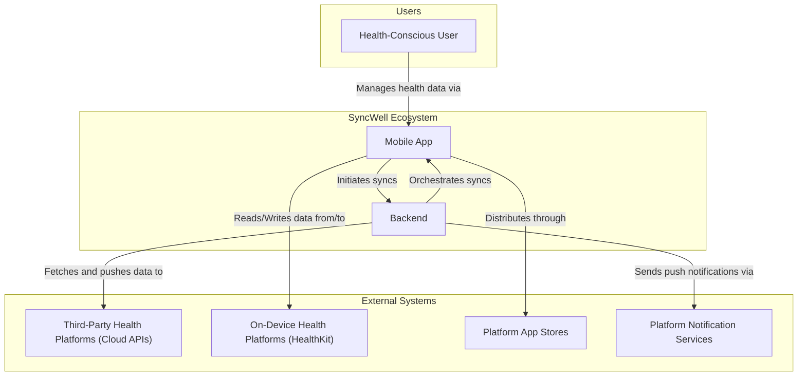
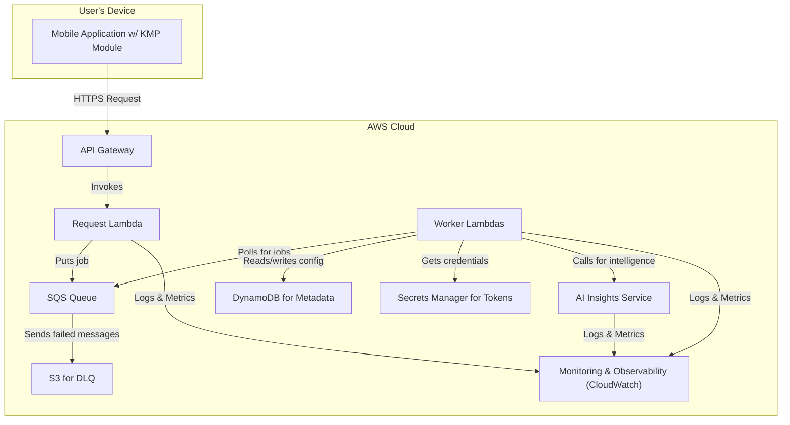
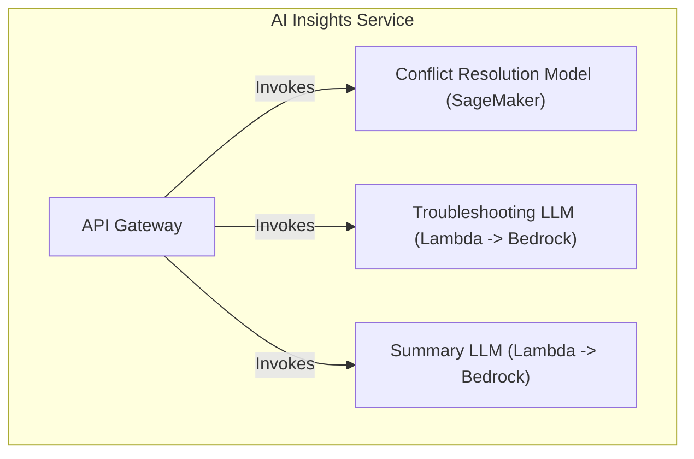
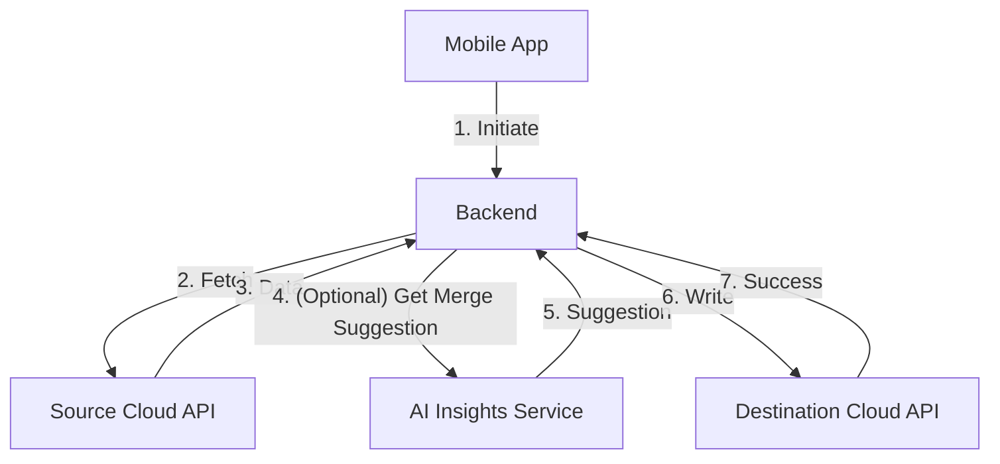

## Dependencies

### Core Dependencies
- `05-data-sync.md` - Data Synchronization & Reliability
- `07-apis-integration.md` - APIs & Integration Requirements
- `16-performance-optimization.md` - Performance & Scalability
- `17-error-handling.md` - Error Handling, Logging & Monitoring
- `18-backup-recovery.md` - Backup & Disaster Recovery
- `19-security-privacy.md` - Data Security & Privacy Policies
- `29-notifications-alerts.md` - Push Notifications & Alerts

### Strategic / Indirect Dependencies
- `01-context-vision.md` - Context & Vision
- `02-product-scope.md` - Product Scope, Personas & MVP Definition
- `14-qa-testing.md` - QA, Testing & Release Strategy
- `21-risks.md` - Risks, Constraints & Mitigation
- `25-release-management.md` - Release Management & Versioning
- `44-contingency-planning.md` - Contingency & Rollback Plans

---

# PRD Section 6: Technical Architecture, Security & Compliance

## 1. Executive Summary

This document specifies the complete technical architecture for the SyncWell application. The architecture is designed for high availability, massive scalability, and robust security to support **1 million Daily Active Users (DAU)**. It adheres to modern cloud-native principles and is engineered for a high-performing product team.

We will use the **C4 Model** as a framework to describe the architecture. The core architectural principles are **modularity**, **security by design**, and **privacy by default**. A key feature is its **hybrid sync model**, which combines a serverless backend for cloud-to-cloud syncs with on-device processing for integrations requiring native SDKs (e.g., Apple HealthKit). This approach maximizes reliability and performance. To further enhance the user experience, the architecture includes an **AI Insights Service** to power intelligent features like smart conflict resolution and personalized summaries.

## 2. Architectural Model (C4)

### Level 1: System Context

This diagram shows the system in its environment, illustrating its relationship with users and external systems. It remains unchanged.

### Level 2: Containers

This level zooms into the system boundary to show the high-level technical containers. We introduce the **AI Insights Service** for intelligent features and a dedicated **Monitoring & Observability** container.

1.  **Mobile Application (Kotlin Multiplatform & Native UI)**
    *   **Description:** The user-facing application that runs on iOS or Android. It handles all user interactions and is a key component of the hybrid sync model.
    *   **Technology:** Kotlin Multiplatform (KMP) for shared business logic, SwiftUI for iOS, Jetpack Compose for Android.
    *   **Responsibilities:** Provides the UI, manages the start of the auth flow, and handles on-device syncs (e.g., HealthKit).

2.  **Scalable Serverless Backend (AWS)**
    *   **Description:** An event-driven, serverless backend on AWS that orchestrates all syncs. It does not **persist** any raw user health data; data is only processed ephemerally in memory during active sync jobs.
    *   **Technology:** AWS Lambda, API Gateway, SQS, DynamoDB, AWS Secrets Manager.
    *   **Responsibilities:** Orchestrates sync jobs, executes cloud-to-cloud syncs, securely stores credentials, and stores user metadata.

3.  **AI Insights Service (AWS)**
    *   **Description:** A new service dedicated to providing intelligence to the platform. It encapsulates machine learning models and LLM integrations, allowing the core sync engine to remain deterministic and focused.
    *   **Technology:** Amazon SageMaker, Amazon Bedrock / OpenAI APIs, AWS Lambda.
    *   **Responsibilities:**
        *   Provides intelligent conflict resolution suggestions.
        *   Powers an LLM-based interactive troubleshooter.
        *   Generates personalized weekly summaries for users.

4.  **Monitoring & Observability (AWS CloudWatch)**
    *   **Description:** A centralized system for collecting logs, metrics, and traces from all backend services.
    *   **Technology:** AWS CloudWatch (Logs, Metrics, Alarms), AWS X-Ray.
    *   **Responsibilities:** Provides insights into system health, performance, and error rates. Triggers alarms for critical issues.

### Level 3: Components (Inside the KMP Shared Module)

The KMP module contains the core business logic. This code can be executed **on the device** (for HealthKit syncs) or **on the backend** (if using a JVM-based Lambda), maximizing code reuse.

*   **`SyncManager`:** Orchestrates the sync process based on instructions from the backend.
*   **`ConflictResolutionEngine`:** Detects data conflicts. *Now enhanced to optionally call the AI Insights Service for merge suggestions.*
*   **`ProviderManager`:** Manages the different `DataProvider` modules.
*   **`DataProvider (Interface)`:** A standardized interface for all third-party integrations.
*   **`ApiClient`:** Handles HTTP calls to backend and third-party services.
*   **`SecureStorageWrapper`:** Abstraction for Keychain/Keystore (on-device) and AWS Secrets Manager (on-backend).

### Level 3: Components (Inside the AI Insights Service)

This diagram shows the components within the new `AI Insights Service`.

*   **`API Gateway`:** A secure entry point for the service.
*   **`Conflict Resolution Model`:** A custom-trained machine learning model hosted on a SageMaker endpoint. It takes two conflicting data entries and returns a suggested merged version.
*   **`Troubleshooting LLM`:** A Lambda function that acts as a proxy to a foundational LLM (e.g., via Amazon Bedrock). It is primed with SyncWell's documentation to provide conversational support.
*   **`Summary LLM`:** A Lambda function that takes a user's weekly data and uses an LLM to generate a human-readable, insightful summary.

## 3. Sync Models: A Hybrid Architecture

To ensure reliability and accommodate platform constraints, SyncWell uses a hybrid architecture.

### Model 1: Cloud-to-Cloud Sync

*   **Use Case:** Syncing between two cloud-based services (e.g., Fitbit to Strava).
*   **Flow:**
    1.  Mobile app initiates the sync via API Gateway.
    2.  The backend worker lambda handles the entire process: fetches data from the source API, **(optional) consults the AI Insights Service to resolve conflicts**, and writes data to the destination API.
    3.  **Advantage:** Highly reliable and does not depend on the user's device being online.

### Model 2: Device-to-Cloud Sync
*(Unchanged)*

### Model 3: Cloud-to-Device Sync
*(Unchanged)*

## 4. Technology Stack & Rationale

| Component | Technology | Rationale |
| :--- | :--- | :--- |
| **Cross-Platform Framework** | **Kotlin Multiplatform (KMP)** | **Code Reuse & Performance.** KMP allows sharing the complex business logic (sync engine, data providers) across the mobile app and a potential JVM backend, while maintaining native UI performance. |
| **On-Device Database** | **SQLDelight** | **Cross-Platform & Type-Safe.** Generates type-safe Kotlin APIs from SQL, ensuring data consistency across iOS and Android. |
| **Serverless Backend** | **AWS (Lambda, SQS, DynamoDB)** | **Massive Scalability & Reliability.** Event-driven architecture to meet our 1M DAU target with pay-per-use cost efficiency. |
| **AI & Machine Learning** | **Amazon SageMaker, Amazon Bedrock** | **Managed & Scalable AI.** Provides managed services for training/hosting ML models and accessing foundational LLMs, reducing operational overhead and allowing focus on feature development. |
| **Secure Credential Storage** | **AWS Secrets Manager** | **Security & Manageability.** Provides a secure, managed service for storing, rotating, and retrieving the OAuth tokens required by our backend workers. |
| **Infrastructure as Code** | **Terraform** | **Reproducibility & Control.** Manages all cloud infrastructure as code, ensuring our setup is version-controlled and easily reproducible. |
| **CI/CD**| **GitHub Actions** | **Automation & Quality.** Automates the build, test, and deployment of the mobile app and backend services, including security checks. |
| **Monitoring & Observability** | **AWS CloudWatch, AWS X-Ray** | **Operational Excellence.** Provides a comprehensive suite for logging, metrics, tracing, and alerting, enabling proactive issue detection and performance analysis. |

## 5. Cost-Effectiveness at Scale (1M DAU)

The architecture is explicitly designed to be cost-effective while scaling to 1 million Daily Active Users.

1.  **Serverless First:** The core backend is built on AWS Lambda, SQS, and DynamoDB. This is a pay-per-use model. If there are no syncs, we pay virtually nothing. As usage scales to 1M DAU, costs scale linearly with it. This avoids the high fixed costs of provisioning and managing a large fleet of servers.
2.  **Efficient Data Handling:** The backend processes data ephemerally and does not store raw health data, which dramatically reduces storage costs and security liabilities. Metadata is stored in DynamoDB, which is highly cost-effective for key-value lookups at scale.
3.  **Kotlin Multiplatform (KMP):** While primarily a development velocity benefit, KMP reduces costs by minimizing the need for separate, specialized engineering teams for each platform. A single team can manage the core logic across iOS, Android, and potentially a JVM backend.
4.  **Managed AI Services:** Using Amazon SageMaker and Bedrock abstracts away the complexity and cost of managing GPU clusters for model training and inference. We pay for the API calls and endpoint hosting, which is more cost-effective than building and maintaining this infrastructure from scratch.
5.  **Right-Sized Resources:** Infrastructure as Code (Terraform) allows us to define and manage resource allocation precisely. Lambda memory, DynamoDB capacity, and other resources can be fine-tuned based on real-world usage data from our monitoring systems, preventing over-provisioning.

## 6. Security, Compliance & Observability

### Security Measures

*   **Data Encryption in Transit:** All network traffic will use TLS 1.2+. Certificate Pinning will be implemented for API calls to our own backend.
*   **Data Encryption at Rest:**
    *   **Backend:** User OAuth tokens are encrypted and stored in AWS Secrets Manager. DynamoDB tables are encrypted at rest.
    *   **On-Device:** Any sensitive data is stored in the native Keychain (iOS) and Keystore (Android).
*   **Code & Pipeline Security:** Production builds will be obfuscated. Dependency scanning (Snyk) and static application security testing (SAST) will be integrated into the CI/CD pipeline, failing the build if critical vulnerabilities are found.

### Compliance
*   User health data is only ever processed **ephemerally in memory** on our backend servers during an active sync job. It is **never persisted** on our systems.
*   For integrations requiring native SDKs (like Apple Health), data processing occurs on the user's device, further enhancing privacy. This hybrid model is designed to be compliant with GDPR, CCPA, and other privacy regulations.
*   The AI Insights Service will be designed to not store any Personal Health Information (PHI). Data sent for inference will be processed ephemerally.

### Monitoring, Logging, and Alerting
A robust observability strategy is critical for operating a reliable service at scale.
*   **Logging:** All Lambda functions will use structured logging (JSON format). Logs will be shipped to AWS CloudWatch Logs. Sensitive information (e.g., user IDs, health data) will be stripped from logs before they are written.
*   **Metrics:** Key application and business metrics will be published to AWS CloudWatch Metrics. This includes:
    *   `SyncJobSuccessRate`, `SyncJobDuration`
    *   `ApiErrorRate` (per third-party provider)
    *   `QueueDepth` (for SQS queues)
    *   `ActiveUsers`
*   **Tracing:** AWS X-Ray will be enabled for all services (API Gateway, Lambda) to provide end-to-end tracing of requests. This is invaluable for debugging performance bottlenecks.
*   **Alerting:** AWS CloudWatch Alarms will be configured to automatically notify the on-call team via PagerDuty for critical issues, such as:
    *   A significant spike in the `SyncJobFailureRate`.
    *   High latency in a core service.
    *   Dead-Letter Queue (DLQ) message count above zero.
*   **Dashboards:** Pre-configured dashboards in CloudWatch will provide an at-a-glance view of system health, organized by service.

## 7. Open-Source Tools and Packages

| Category | Tool/Package | Description |
| :--- | :--- | :--- |
| **Mobile Development** | **Kotlin Multiplatform** | Core framework for sharing code. |
| | **SwiftUI / Jetpack Compose** | Modern UI frameworks for iOS and Android. |
| | **SQLDelight** | KMP library for type-safe SQL. |
| | **Ktor** | KMP HTTP client. |
| **Backend Development** | **AWS Lambda, SQS, DynamoDB** | Core AWS services for the serverless backend. |
| | **Terraform** | Infrastructure as Code tool. |
| **AI/ML** | **Hugging Face Transformers** | For sourcing pre-trained models or fine-tuning. |
| | **scikit-learn** | For building the initial conflict resolution model. |
| | **LangChain** | Framework for developing LLM-powered applications. |
| **Testing** | **JUnit, XCTest, Turbine, MockK** | Standard libraries for testing Kotlin and Swift code. |
| **CI/CD** | **GitHub Actions, Fastlane** | CI/CD platform and mobile release automation. |
| **Monitoring** | **OpenTelemetry** | Vendor-neutral standard for instrumentation. |
| | **Prometheus / Grafana** | Alternative/complement to CloudWatch for advanced metrics and dashboards. |
| **Static Analysis** | **Detekt, SwiftLint** | Static analysis tools for Kotlin and Swift. |
| **Dependency Scanning** | **Snyk, Dependabot** | Vulnerability scanning for dependencies. |
