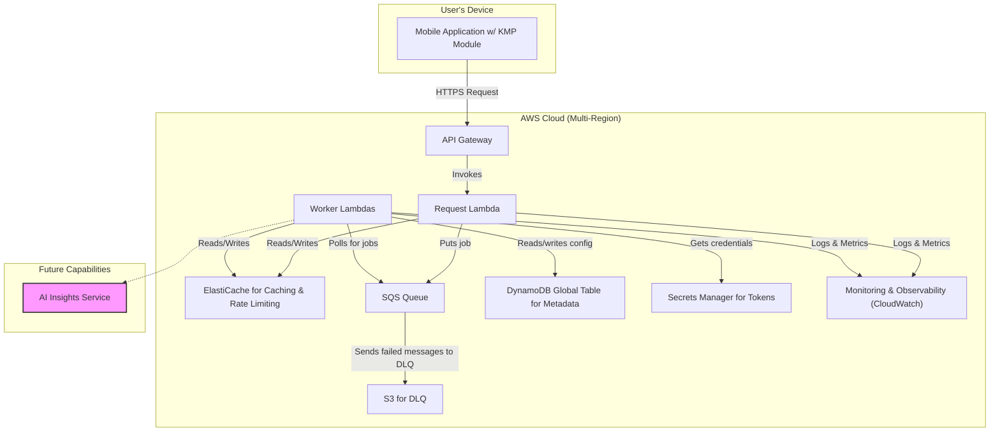

## Dependencies

### Core Dependencies
- `05-data-sync.md` - Data Synchronization & Reliability
- `07-apis-integration.md` - APIs & Integration Requirements
- `16-performance-optimization.md` - Performance & Scalability
- `17-error-handling.md` - Error Handling, Logging & Monitoring
- `18-backup-recovery.md` - Backup & Disaster Recovery
- `19-security-privacy.md` - Data Security & Privacy Policies
- `29-notifications-alerts.md` - Push Notifications & Alerts

### Strategic / Indirect Dependencies
- `01-context-vision.md` - Context & Vision
- `02-product-scope.md` - Product Scope, Personas & MVP Definition
- `14-qa-testing.md` - QA, Testing & Release Strategy
- `21-risks.md` - Risks, Constraints & Mitigation
- `25-release-management.md` - Release Management & Versioning
- `44-contingency-planning.md` - Contingency & Rollback Plans

---

# PRD Section 6: Technical Architecture, Security & Compliance

## 1. Executive Summary

This document specifies the complete technical architecture for the SyncWell application. The architecture is designed for high availability, massive scalability, and robust security to support **1 million Daily Active Users (DAU)**. It adheres to modern cloud-native principles and is engineered for a high-performing product team.

We will use the **C4 Model** as a framework to describe the architecture. The core architectural principles are **modularity**, **security by design**, and **privacy by default**. A key feature is its **hybrid sync model**, which combines a serverless backend for cloud-to-cloud syncs with on-device processing for integrations requiring native SDKs (e.g., Apple HealthKit). This approach maximizes reliability and performance. To further enhance the user experience *in the future*, the architecture makes provisions for an **AI Insights Service** to power intelligent features. The initial focus, however, will be on a robust and deterministic sync engine.

## 2. Architectural Model (C4)

### Level 1: System Context

This diagram shows the system in its environment, illustrating its relationship with users and external systems. It remains unchanged.


### Level 2: Containers

This level zooms into the system boundary to show the high-level technical containers. For the initial launch, the focus is on the core sync engine, with provisions for future enhancements like an AI service.



1.  **Mobile Application (Kotlin Multiplatform & Native UI)**
    *   **Description:** The user-facing application that runs on iOS or Android. It handles all user interactions and is a key component of the hybrid sync model.
    *   **Technology:** Kotlin Multiplatform (KMP) for shared business logic, SwiftUI for iOS, Jetpack Compose for Android.
    *   **Responsibilities:** Provides the UI, manages the start of the auth flow, and handles on-device syncs (e.g., HealthKit).

2.  **Scalable Serverless Backend (AWS)**
    *   **Description:** An event-driven, serverless backend on AWS that orchestrates all syncs. It does not **persist** any raw user health data; data is only processed ephemerally in memory during active sync jobs.
    *   **Technology:** AWS Lambda, API Gateway, SQS, DynamoDB Global Tables.
    *   **Responsibilities:** Orchestrates sync jobs, executes cloud-to-cloud syncs, securely stores credentials, and stores user metadata.

3.  **Distributed Cache (Amazon ElastiCache for Redis)**
    *   **Description:** An in-memory caching layer to improve performance and reduce load on downstream services.
    *   **Technology:** Amazon ElastiCache for Redis.
    *   **Responsibilities:**
        *   Caches frequently accessed, non-sensitive data (e.g., user sync configurations).
        *   Acts as a distributed lock manager to prevent concurrent sync job collisions for the same user.
        *   Powers the rate-limiting engine to manage calls to third-party APIs.

4.  **(Future) AI Insights Service (AWS)**
    *   **Description:** A service planned for a future release to provide intelligence to the platform. It will encapsulate machine learning models and LLM integrations, allowing the core sync engine to remain deterministic and focused.
    *   **Technology:** Amazon SageMaker, Amazon Bedrock, AWS Lambda.
    *   **Responsibilities:** The initial design considers providing intelligent conflict resolution, an LLM-based troubleshooter, and personalized summaries.

5.  **Monitoring & Observability (AWS CloudWatch)**
    *   **Description:** A centralized system for collecting logs, metrics, and traces from all backend services.
    *   **Technology:** AWS CloudWatch (Logs, Metrics, Alarms), AWS X-Ray.
    *   **Responsibilities:** Provides insights into system health, performance, and error rates. Triggers alarms for critical issues.

### Level 3: Components (Inside the KMP Shared Module)

The KMP module contains the core business logic. This code can be executed **on the device** (for HealthKit syncs) or **on the backend** (if using a JVM-based Lambda), maximizing code reuse.

*   **`SyncManager`:** Orchestrates the sync process based on instructions from the backend.
*   **`ConflictResolutionEngine`:** Detects data conflicts. The initial version will use deterministic strategies (e.g., newest data wins, source priority).
*   **`ProviderManager`:** Manages the different `DataProvider` modules.
*   **`DataProvider (Interface)`:** A standardized interface for all third-party integrations.
*   **`ApiClient`:** Handles HTTP calls to backend and third-party services.
*   **`SecureStorageWrapper`:** Abstraction for Keychain/Keystore (on-device) and AWS Secrets Manager (on-backend).

### Level 3: Components (Future AI Insights Service)

When implemented, the AI Insights Service will be composed of several components. The exact implementation details will be defined closer to the feature's development phase and will undergo a rigorous security and privacy review. The initial high-level concepts include:

*   **`Conflict Resolution Model`:** A potential machine learning model that could take two conflicting data entries and return a suggested merged version.
*   **`LLM-based Services`:** Lambda functions that could leverage foundational models (e.g., via Amazon Bedrock) to power features like an interactive troubleshooter or human-readable data summaries.

## 3. Sync Models: A Hybrid Architecture

To ensure reliability and accommodate platform constraints, SyncWell uses a hybrid architecture.

### Model 1: Cloud-to-Cloud Sync

*   **Use Case:** Syncing between two cloud-based services (e.g., Garmin to Strava).
*   **Flow:**
    1.  Mobile app initiates the sync via API Gateway.
    2.  The backend worker lambda handles the entire process: it fetches data from the source API, applies a deterministic conflict resolution strategy (e.g., newest data wins), and writes data to the destination API.
    3.  **Advantage:** Highly reliable and does not depend on the user's device being online.


### Model 2: Device-to-Cloud Sync
*(Unchanged)*

### Model 3: Cloud-to-Device Sync
*(Unchanged)*

## 3a. Architecture for 1M DAU

To reliably serve 1 million Daily Active Users, the architecture incorporates specific strategies for high availability, performance, and scalability.

### High Availability: Global Multi-Region Architecture

Given the requirement for a global launch across 5 continents, a high-availability, active-active multi-region architecture is essential to provide low-latency access for users worldwide and ensure resilience against regional outages.

*   **Deployment:** The entire backend infrastructure will be deployed in at least three geographically dispersed AWS regions (e.g., `us-east-1` for the Americas, `eu-west-1` for Europe/Africa, `ap-southeast-1` for Asia-Pacific). This can be expanded as the user base grows.
*   **Request Routing:** **Amazon Route 53** will be configured with **Latency-Based Routing**. This will direct users to the AWS region that provides the lowest network latency, improving their application experience. Route 53 health checks will automatically detect if a region is unhealthy and redirect traffic to the next nearest healthy region.
*   **Data Replication & Consistency:**
    *   **DynamoDB Global Tables:** User metadata and sync configurations will be stored in a DynamoDB Global Table. This provides built-in, fully managed, multi-master replication across all deployed regions, ensuring that data written in one region is automatically propagated to others with low latency.
    *   **Write Conflict Resolution:** By using a multi-master database, write conflicts can occur (e.g., if a user changes a setting in two regions simultaneously). Our application will be designed to be idempotent, and for configuration data, we will rely on DynamoDB's default "last writer wins" conflict resolution strategy. This is an acceptable trade-off for the types of non-transactional metadata we are storing.
*   **Credential Storage:** **AWS Secrets Manager** secrets will be replicated to each active region. This ensures that worker Lambdas in any region can access the necessary third-party OAuth tokens to perform sync jobs.
*   **Resilience Testing (Chaos Engineering):** To proactively validate our multi-region high availability, we will practice chaos engineering. We will use the **AWS Fault Injection Simulator (FIS)** to inject faults into our pre-production environments. Example experiments include terminating Lambda functions, introducing latency between services, or simulating the failure of an entire AWS region. This practice is critical for building confidence in our system's ability to withstand turbulent conditions in production.

### Performance & Scalability: Caching & Load Projections

*   **Caching Strategy:** A distributed cache using **Amazon ElastiCache for Redis** is introduced to minimize latency and reduce load on backend services. It will be used for:
    1.  **Session/Configuration Caching:** Caching user sync configurations to reduce repeated reads from DynamoDB.
    2.  **Third-Party API Rate Limiting:** As a central counter/token bucket store to manage and enforce rate limits across the distributed worker fleet.
    3.  **Distributed Locking:** To prevent race conditions, such as two workers trying to perform the same sync job for the same user simultaneously.

*   **Load Projections & Resource Estimation:**
    *   **Assumptions:**
        *   1,000,000 DAU.
        *   Average user has 3 active sync configurations.
        *   Syncs run automatically every ~1 hour (24 syncs/day). Manual syncs add 25% overhead.
        *   Peak usage is concentrated in a 4-hour window (e.g., 7-9am and 8-10pm), accounting for 50% of daily traffic.
    *   **API Gateway & Request Lambdas:**
        *   Total daily requests: `1M users * 3 configs * 24 syncs/day * 1.25 = 90M requests/day`.
        *   Average RPS: `90M / 86400s = ~1,042 RPS`.
        *   Peak RPS: 50% of requests (`45M`) occur in a 4-hour window (`14,400s`). The peak RPS is `45M / 14400s = ~3,125 RPS`. This confirms the previous estimate was in a reasonable range, but is now based on a clearer model. API Gateway and Lambda scale automatically to handle this.
    *   **Worker Lambdas & SQS:**
        *   Total daily jobs: `90M jobs/day`.
        *   SQS can handle virtually unlimited throughput. The key is Lambda concurrency, which must be sized for peak load.
        *   Assuming an average job takes 5 seconds, the required concurrency during peak hours is `3,125 jobs/s * 5s/job = 15,625 concurrent executions`.
        *   This peak concurrency number is critical. The default AWS account limit (1,000) must be significantly increased, and this level of concurrency has major cost implications that must be factored into financial models.
    *   **DynamoDB:**
        *   We will use **On-Demand Capacity Mode**. This is more cost-effective for spiky, unpredictable workloads than provisioned throughput. It automatically scales to handle the required read/write operations, although we must monitor for throttling if traffic patterns become extreme.

## 3b. DynamoDB Data Modeling & Access Patterns

To support the application's data storage needs efficiently and scalably, we will use a **single-table design** in DynamoDB. This modern approach to NoSQL data modeling minimizes operational overhead, reduces costs by optimizing read/write operations, and allows for complex access patterns with a single table.

Our primary data table will be named **`SyncWellMetadata`**. It will use a composite primary key and a Global Secondary Index (GSI) to serve all required access patterns.

### Table Definition: `SyncWellMetadata`

*   **Primary Key:**
    *   **Partition Key (PK):** `USER#{userId}` - All data for a given user is co-located in the same partition, enabling efficient retrieval of a user's entire profile with a single query.
    *   **Sort Key (SK):** A hierarchical string that defines the type of data and its relationships (e.g., `PROFILE`, `CONN#{connectionId}`).
*   **Capacity Mode:** On-Demand. This is ideal for our unpredictable, spiky traffic patterns, automatically scaling capacity to meet load.
*   **Global Tables:** The table will be configured as a DynamoDB Global Table, providing active-active multi-region replication for high availability and low-latency reads for a global user base.

### Item Types & Schema

Below are the different data entities, or "item types," that will be stored in the `SyncWellMetadata` table.

| Entity | PK (Partition Key) | SK (Sort Key) | Key Attributes & Purpose |
| :--- | :--- | :--- | :--- |
| **User Profile** | `USER#{userId}` | `PROFILE` | `SubscriptionLevel`, `CreatedAt`. Stores top-level user attributes. A user's profile is the root item for all their related data. |
| **Connection** | `USER#{userId}` | `CONN#{connectionId}` | `Status` (`active`, `needs_reauth`), `CredentialArn`. Represents a user's authenticated link to a 3rd party (e.g., Fitbit). This is referred to as a "Connection". |
| **Sync Config** | `USER#{userId}` | `SYNCCONFIG#{sourceId}#to#{destId}#to#{dataType}` | `LastSyncTime`, `ConflictStrategy`, `IsEnabled`. Defines a single data sync flow for a user. |
| **Hist. Sync Job** | `USER#{userId}` | `HISTORICAL##{orchestrationId}` | `ExecutionArn`, `StartDate`, `Status`. Acts as a pointer to the AWS Step Functions execution that orchestrates a large historical data sync. The definitive status is stored in the state machine itself. |

*Example `SYNCCONFIG` SK:* `SYNCCONFIG#fitbit#to#googlefit#steps` (Note: single `#` delimiters are used for clarity and parsing reliability).

### Supporting Operational Access Patterns

Some access patterns are for infrequent, non-time-sensitive operational tasks, not for real-time user-facing requests. A common example is finding all users who need to be notified to re-authenticate a service. Creating a Global Secondary Index (GSI) on a low-cardinality attribute like `Status` is an anti-pattern that leads to severe performance issues ("hot partitions").

Instead, we will address this with a more robust and scalable approach:

*   **Background Scans:** A scheduled, periodic background process (e.g., a weekly Lambda) will perform a DynamoDB `Scan` operation on the table to find all connections with a `needs_reauth` status. Because scans are slow and consume read capacity, this job will be configured to run at a very low, throttled rate during off-peak hours to avoid impacting production traffic. This is a standard and cost-effective pattern for non-urgent, full-table queries.

### Core Access Patterns Supported

This single-table design efficiently serves the following critical access patterns:

| Use Case | Access Pattern | DynamoDB Operation | Efficiency |
| :--- | :--- | :--- | :--- |
| **Get all settings for a user** | Fetch all records for a given user. | `Query` on `PK = USER#{userId}` | **High** |
| **Get state for a single sync job** | Fetch the `LastSyncTime` and `ConflictStrategy`. | `GetItem` with `PK` and `SK = SYNCCONFIG#{...}` | **Very High** |
| **Update `lastSyncTime` after sync** | Update a single sync configuration. | `UpdateItem` with `PK` and `SK = SYNCCONFIG#{...}` | **Very High** |
| **Mark a connection as invalid** | Update a connection's status to `needs_reauth`. | `UpdateItem` with `PK` and `SK = CONN#{...}` | **Very High** |
| **Get progress of a historical sync** | Fetch the orchestration record for a user. | `GetItem` with `PK` and `SK = HISTORICAL#{...}` | **Very High** |
| **Find all users to notify for re-auth**| Find all connections with status `needs_reauth`. | `Scan` operation (run as a low-priority, background job). | **Low (by design)** |

This structure provides a flexible and scalable foundation for our application's metadata needs.

### Level 4: Historical Sync Workflow

To handle long-running, complex, and potentially error-prone processes like a user's historical data sync, we will use a dedicated workflow orchestrator. **AWS Step Functions** is the ideal choice as it is a fully managed service that aligns with our serverless-first approach, providing excellent reliability, state management, and observability out of the box.

The following diagram illustrates the state machine for a historical sync job.


*   **State Machine Logic:**
    1.  **Initiate & Calculate Chunks:** The workflow is triggered, and a Lambda function calculates the date range, breaking it into an array of smaller, logical chunks.
    2.  **Process in Parallel (`Map` State):** The state machine uses a `Map` state to iterate over the array of chunks, invoking a worker Lambda for each chunk in parallel. This dramatically improves performance.
    3.  **Process One Chunk:** The worker Lambda is responsible for the core logic: fetching data for its assigned chunk, transforming it, and writing it to the destination platform.
    4.  **Error Handling:** The state machine has a declarative `Retry` policy for transient errors. The `Map` state can also be configured with a `Catch` block to handle and log persistent failures for a specific chunk without halting the entire workflow.
    5.  **Finalize Sync:** After the `Map` state completes, a final Lambda function is invoked to send a "success" push notification to the user.

## 3c. Core API Contracts

To ensure clear communication between the mobile client and the backend, we define the following core API endpoints. This is not an exhaustive list but represents the most critical interactions. The API will be versioned via the URL path (e.g., `/v1/...`).

### POST /v1/sync-jobs

Initiates a new synchronization job for a user.

*   **Request Body:**

    ```json
    {
      "sourceConnectionId": "conn_12345_fitbit",
      "destinationConnectionId": "conn_67890_strava",
      "dataType": "steps",
      "mode": "automatic" // "automatic" or "manual"
    }
    ```

*   **Success Response (202 Accepted):**

    The backend immediately acknowledges the request and queues it for processing.

    ```json
    {
      "jobId": "job_abc123",
      "status": "QUEUED",
      "message": "Sync job has been queued for processing."
    }
    ```

*   **Error Response (400 Bad Request):**

    ```json
    {
      "error": "InvalidConnectionId",
      "message": "The specified source or destination connection ID does not exist or is invalid."
    }
    ```

## 3d. Canonical Data Models

To handle data from various third-party sources, we must first transform it into a standardized, canonical format. This allows our sync engine and conflict resolution logic to operate on a consistent data structure, regardless of the source.

Below are examples of our core canonical models.

### `CanonicalWorkout`

Represents a single workout or activity session.

```typescript
interface CanonicalWorkout {
  // A unique identifier for the workout from its source system.
  sourceId: string;

  // The platform the workout originated from (e.g., "strava", "garmin").
  sourceProvider: string;

  // The type of activity. We will maintain a standard enum of activities.
  // e.g., "run", "cycle", "swim", "strength_training"
  activityType: string;

  // Timestamps in ISO 8601 format (UTC).
  startTimestamp: string;
  endTimestamp: string;

  // Duration of the workout in seconds.
  durationSeconds: number;

  // Distance in meters.
  distanceMeters?: number;

  // Energy burned in kilocalories.
  energyKcal?: number;

  // Optional title or name for the activity.
  title?: string;
}
```

### `CanonicalSleepSession`

Represents a period of sleep.

```typescript
interface CanonicalSleepSession {
  sourceId: string;
  sourceProvider: string;

  // Timestamps in ISO 8601 format (UTC).
  startTimestamp: string;
  endTimestamp: string;

  // Total time in bed, in seconds.
  timeInBedSeconds: number;

  // Total time asleep (timeInBed - awake time), in seconds.
  timeAsleepSeconds: number;

  // Time spent in different sleep stages, in seconds.
  deepSleepSeconds?: number;
  lightSleepSeconds?: number;
  remSleepSeconds?: number;
  awakeSeconds?: number;
}
```

## 4. Technology Stack & Rationale

| Component | Technology | Rationale |
| :--- | :--- | :--- |
| **Cross-Platform Framework** | **Kotlin Multiplatform (KMP)** | **Code Reuse & Performance.** KMP allows sharing the complex business logic (sync engine, data providers) across the mobile app and a potential JVM backend, while maintaining native UI performance. |
| **On-Device Database** | **SQLDelight** | **Cross-Platform & Type-Safe.** Generates type-safe Kotlin APIs from SQL, ensuring data consistency across iOS and Android. |
| **Serverless Backend** | **AWS (Lambda, SQS, DynamoDB)** | **Massive Scalability & Reliability.** Event-driven architecture to meet our 1M DAU target with pay-per-use cost efficiency. |
| **Distributed Cache** | **Amazon ElastiCache for Redis** | **Performance & Scalability.** Provides a high-throughput, low-latency in-memory cache for reducing database load and implementing distributed rate limiting. |
| **AI & Machine Learning (Future)** | **Amazon SageMaker, Amazon Bedrock** | **Rationale for Future Use:** When we implement AI features, these managed services will allow us to scale without managing underlying infrastructure, reducing operational overhead and allowing focus on feature development. |
| **Secure Credential Storage** | **AWS Secrets Manager** | **Security & Manageability.** Provides a secure, managed service for storing, rotating, and retrieving the OAuth tokens required by our backend workers. Replicated across regions for high availability. |
| **Infrastructure as Code** | **Terraform** | **Reproducibility & Control.** Manages all cloud infrastructure as code, ensuring our setup is version-controlled and easily reproducible. |
| **CI/CD**| **GitHub Actions** | **Automation & Quality.** Automates the build, test, and deployment of the mobile app and backend services, including security checks. |
| **Monitoring & Observability** | **AWS CloudWatch, AWS X-Ray** | **Operational Excellence.** Provides a comprehensive suite for logging, metrics, tracing, and alerting, enabling proactive issue detection and performance analysis. |
| **Local Development** | **LocalStack** | **High-Fidelity Local Testing.** Allows engineers to run and test the entire AWS serverless backend on their local machine, drastically improving the development and debugging feedback loop. |
| **Load Testing** | **k6 (by Grafana Labs)** | **Validate Scalability Assumptions.** A modern, scriptable load testing tool to simulate traffic at scale, identify performance bottlenecks, and validate that the system can meet its 1M DAU target. |
| **Feature Flagging** | **Unleash** | **Decouple Deployment from Release.** A feature flagging system is critical for safely deploying new code to production, enabling canary releases, A/B testing, and instant rollbacks, significantly reducing release risk. |

## 5. Cost-Effectiveness at Scale (1M DAU)

The architecture is explicitly designed to be cost-effective while scaling to 1 million Daily Active Users.

1.  **Serverless First:** The core backend is built on AWS Lambda, SQS, and DynamoDB. This is a pay-per-use model. If there are no syncs, we pay virtually nothing. As usage scales to 1M DAU, costs scale linearly with it. This avoids the high fixed costs of provisioning and managing a large fleet of servers.
2.  **Efficient Data Handling:** The backend processes data ephemerally and does not store raw health data, which dramatically reduces storage costs and security liabilities. Metadata is stored in DynamoDB, which is highly cost-effective for key-value lookups at scale.
3.  **Kotlin Multiplatform (KMP):** While primarily a development velocity benefit, KMP reduces costs by minimizing the need for separate, specialized engineering teams for each platform. A single team can manage the core logic across iOS, Android, and potentially a JVM backend.
4.  **Managed AI Services:** Using Amazon SageMaker and Bedrock abstracts away the complexity and cost of managing GPU clusters for model training and inference. We pay for the API calls and endpoint hosting, which is more cost-effective than building and maintaining this infrastructure from scratch.
5.  **Right-Sized Resources:** Infrastructure as Code (Terraform) allows us to define and manage resource allocation precisely. Lambda memory, DynamoDB capacity, and other resources can be fine-tuned based on real-world usage data from our monitoring systems, preventing over-provisioning.
6.  **Monitoring Global Data Transfer Costs:** While the multi-region architecture provides significant performance and availability benefits, it introduces costs for cross-region data transfer. Every write to a DynamoDB Global Table incurs a data transfer cost. This will be a key metric to monitor, and we must factor it into our financial projections.

## 6. Security, Compliance & Observability

### Security Measures

*   **Data Encryption in Transit:** All network traffic will use TLS 1.2+. Certificate Pinning will be implemented for API calls to our own backend. This is a defense-in-depth measure against sophisticated man-in-the-middle attacks, and its operational risk will be managed via a careful certificate rotation plan.
*   **Data Encryption at Rest:**
    *   **Backend:** User OAuth tokens are encrypted and stored in AWS Secrets Manager. DynamoDB tables are encrypted at rest.
    *   **On-Device:** Any sensitive data is stored in the native Keychain (iOS) and Keystore (Android).
*   **Code & Pipeline Security:** Production builds will be obfuscated. Dependency scanning (Snyk) and static application security testing (SAST) will be integrated into the CI/CD pipeline, failing the build if critical vulnerabilities are found.

### Compliance
*   User health data is only ever processed **ephemerally in memory** on our backend servers during an active sync job. It is **never persisted** on our systems. The maximum lifetime for data in-flight during a sync job is 5 minutes, after which it is guaranteed to be purged.
*   For integrations requiring native SDKs (like Apple Health), data processing occurs on the user's device, further enhancing privacy. This hybrid model is designed to be compliant with GDPR, CCPA, and other privacy regulations.
*   The AI Insights Service will be designed to not store any Personal Health Information (PHI). Data sent for inference will be processed ephemerally.

### Monitoring, Logging, and Alerting
A robust observability strategy is critical for operating a reliable service at scale. This is not just about error detection, but about proactively ensuring the system is delivering on the user stories.

*   **Logging:** All Lambda functions will use structured logging (JSON format). Logs will be shipped to AWS CloudWatch Logs. **All logs must be scrubbed of any PHI or user-identifiable information before being written.**
*   **Tracing:** AWS X-Ray will be enabled for all services (API Gateway, Lambda) to provide end-to-end tracing of requests. This is invaluable for debugging performance bottlenecks in the sync pipeline.
*   **Alerting:** AWS CloudWatch Alarms will be configured to automatically notify the on-call team via PagerDuty for critical issues, such as:
    *   A significant spike in the `SyncJobFailureRate`.
    *   High P99 latency in a core service.
    *   Dead-Letter Queue (DLQ) message count above zero.
    *   A sudden drop in `ActiveUsers`.
    *   High cache eviction rate in ElastiCache.
*   **Dashboards:** Pre-configured dashboards in CloudWatch will provide an at-a-glance view of system health, organized by service and by user-facing feature.

#### Key Performance Indicators (KPIs)

In addition to generic system metrics, we will track a set of specific KPIs that are directly tied to business goals and user stories.

| KPI Metric Name | User Story | Business Goal | Description | Threshold / Alert |
| :--- | :--- | :--- | :--- | :--- |
| `SyncSuccessRate` | US-05 | Trust & Reliability | Percentage of sync jobs that complete successfully. | Alert if < 99.9% over 15 mins. |
| `P95_ManualSyncLatency` | US-06 | Engagement & Control | 95th percentile latency for a user-initiated manual sync to complete. | Alert if > 5 seconds. |
| `HistoricalSyncThroughput` | US-10 | Conversion & Retention | Number of days/records processed per minute during a historical sync. | Alert on significant drops. |
| `ReAuthRate` | US-13 | Trust & Privacy | Rate at which syncs fail due to invalid tokens, requiring user re-authentication. | Alert on unusual spikes. |
| `NewUser_TimeToFirstSync` | US-02 | Activation | Time from user signup to the first successful data sync. | Track median time. |

## 7. Open-Source Tools and Packages

| Category | Tool/Package | Description |
| :--- | :--- | :--- |
| **Mobile Development** | **Kotlin Multiplatform** | Core framework for sharing code. |
| | **SwiftUI / Jetpack Compose** | Modern UI frameworks for iOS and Android. |
| | **SQLDelight** | KMP library for type-safe SQL. |
| | **Ktor** | KMP HTTP client. |
| **Backend Development** | **AWS Lambda, SQS, DynamoDB** | Core AWS services for the serverless backend. |
| | **Terraform** | Infrastructure as Code tool. |
| **Testing** | **JUnit, XCTest, Turbine, MockK** | Standard libraries for unit and integration testing. |
| | **k6** | Modern, scriptable load testing tool. |
| **CI/CD** | **GitHub Actions, Fastlane** | CI/CD platform and mobile release automation. |
| **Monitoring** | **OpenTelemetry** | Vendor-neutral standard for instrumentation. |
| | **Prometheus / Grafana** | Alternative/complement to CloudWatch for advanced metrics and dashboards. |
| **Local Development** | **LocalStack** | High-fidelity emulator for local AWS development. |
| **Release Management** | **Unleash** | Open-source feature flagging system. |
| **Static Analysis** | **Detekt, SwiftLint** | Static analysis tools for Kotlin and Swift. |
| **Dependency Scanning** | **Snyk, Dependabot** | Vulnerability scanning for dependencies. |

## 8. Non-Functional Requirements (NFRs)

This section defines the key non-functional requirements for the SyncWell platform. These are critical quality attributes that the system must satisfy.

| Category | Requirement | Metric | Target | Notes |
| :--- | :--- | :--- | :--- | :--- |
| **Availability** | Core Service Uptime | Monthly Uptime % | > 99.9% | Measured for core API endpoints and sync processing. Excludes scheduled maintenance. |
| | Disaster Recovery RTO | Recovery Time Objective | < 4 hours | Maximum time to restore service in the DR region after a primary region failure is declared. |
| | Disaster Recovery RPO | Recovery Point Objective | < 15 minutes | Maximum acceptable data loss in a disaster recovery scenario. Governed by PITR backup frequency. |
| **Performance** | Manual Sync Latency | P95 Latency | < 5 seconds | The 95th percentile for a user-initiated cloud-to-cloud sync to complete. |
| | API Gateway Latency | P99 Latency | < 500ms | For all synchronous API endpoints, measured at the gateway. |
| | Global User Read Latency | P95 Latency | < 200ms | For users accessing data from a local regional replica of the DynamoDB Global Table. |
| | Concurrent Users | Peak Concurrent Lambdas | > 15,000 | Must be able to scale to handle peak load concurrency. Requires AWS limit increases. |
| **Security** | Data Encryption | TLS Version | TLS 1.2+ | All traffic in transit must use modern, secure protocols. |
| | Vulnerability Patching | Time to Patch Critical CVE | < 72 hours | Time from when a critical vulnerability in a dependency is identified to when it is patched in production. |
| **Scalability** | User Capacity | Daily Active Users (DAU) | 1,000,000 | The architecture must be able to support 1 million daily active users without degradation. |
| **Usability** | App Onboarding | Time to First Sync | < 3 minutes | Median time from a new user finishing signup to their first successful data sync. |

## 9. Developer Experience

To ensure high development velocity and code quality, we will establish a streamlined and automated developer experience.

*   **Local Development:** Engineers must be able to run and test the entire application stack locally. This will be achieved using:
    *   **LocalStack:** To provide a high-fidelity local emulator of AWS services (Lambda, SQS, DynamoDB, etc.).
    *   **Docker Compose:** To orchestrate the running of LocalStack and any other local dependencies.
*   **Testing Strategy:** We will employ a multi-layered testing strategy:
    *   **Unit Tests:** To test individual functions and classes in isolation. Mocking frameworks like MockK will be used.
    *   **Integration Tests:** To test the interaction between components, such as a Lambda function's interaction with a DynamoDB table (running against LocalStack).
    *   **Contract Tests:** To ensure the mobile app and backend APIs can evolve independently without breaking each other, we will use **Pact**. The backend will publish its API contract, and the mobile client will test against this contract in its CI pipeline.
    *   **End-to-End (E2E) Tests:** To test complete user flows. For the mobile app, this will involve UI automation frameworks like Espresso and XCUITest.
    *   **Load Tests:** To validate performance and scalability, using `k6` to script and execute tests against a dedicated staging environment.
*   **Continuous Integration & Delivery (CI/CD):** Our CI/CD pipeline, managed with **GitHub Actions**, will automate the following:
    *   **On every commit:** Run linters, static analysis tools (Detekt, SwiftLint), and all unit tests.
    *   **On every pull request:** Run all integration tests and Static Application Security Testing (SAST) scans (Snyk).
    *   **On merge to `main`:**
        *   Automatically deploy the backend services to the staging environment.
        *   Trigger E2E tests against the staging environment.
        *   Run Dynamic Application Security Testing (DAST) scans against the staging API using **OWASP ZAP**.
    *   **On release tag:** Automate the deployment of backend services to production and the mobile app release process to the app stores (using Fastlane).

## Appendix A: Technology Radar

To provide context on our technology choices and guide future evolution, we maintain a technology radar. This helps us track technologies we are adopting, exploring, or have decided to put on hold. It is a living document, expected to change as we learn and the technology landscape evolves.

### Adopt

These are technologies we have chosen as the foundation for the SyncWell platform. They are the standard choice for their respective domains.

| Technology | Domain | Justification |
| :--- | :--- | :--- |
| **Kotlin Multiplatform** | Cross-Platform Logic | Core strategy for code reuse between mobile clients. |
| **AWS Lambda, SQS, DynamoDB** | Backend Platform | Core of our scalable, serverless-first architecture. |
| **Terraform** | Infrastructure as Code | Standard for provisioning and managing our cloud infrastructure. |
| **LocalStack** | Local Development | Essential for providing a high-fidelity local development loop. |
| **Pact** | Contract Testing | Critical for ensuring API stability between the client and backend. |

### Trial

These are technologies we believe have high potential and should be actively prototyped on non-critical projects or features to evaluate their fit.

| Technology | Domain | Justification |
| :--- | :--- | :--- |
| **Metabase / Superset** | Business Intelligence | To empower product and business teams with self-service analytics without engineering effort. A trial is needed to select the best fit for our needs. |
| **Unleash** | Feature Flagging | We have identified the need for feature flagging; Unleash is a strong open-source candidate to trial for this capability. |
| **Docusaurus** | Documentation | As our API and developer ecosystem grows, a dedicated documentation portal will be invaluable. Docusaurus is a leading candidate to trial. |

### Assess

These are technologies that could be game-changers in the longer term. We should invest time to research and understand them, but we are not yet committed to using them.

| Technology | Domain | Justification |
| :--- | :--- | :--- |
| **MLflow** | MLOps | When we begin developing the AI Insights features, MLflow is a tool we must assess for managing the end-to-end machine learning lifecycle. It is compatible with our choice of Amazon SageMaker. |

### Hold

These are technologies that we have considered but have decided not to use at this time. They may be revisited later if our architectural needs change significantly.

| Technology | Domain | Justification |
| :--- | :--- | :--- |
| **Kubernetes** | Container Orchestration | Our serverless-first approach means we have no current need for a complex container orchestrator. We will hold on this unless we develop a large suite of auxiliary services that require it. |
| **ScyllaDB / Cassandra** | NoSQL Database | DynamoDB meets all of our current and projected needs for metadata storage. We will not consider alternative NoSQL databases unless we hit a specific, insurmountable limitation with DynamoDB. |
| **Service Mesh (Linkerd, etc.)**| Service-to-Service | A service mesh is a solution for managing a large and complex microservices architecture. Our current architecture is too simple to justify this complexity. We will put this on hold indefinitely. |
