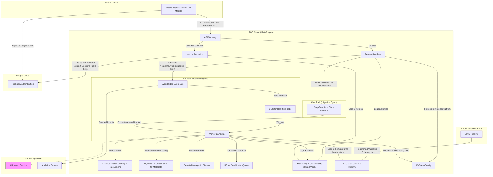

## Dependencies

### Core Dependencies
- `05-data-sync.md` - Data Synchronization & Reliability
- `07-apis-integration.md` - APIs & Integration Requirements
- `16-performance-optimization.md` - Performance & Scalability
- `17-error-handling.md` - Error Handling, Logging & Monitoring
- `18-backup-recovery.md` - Backup & Disaster Recovery
- `19-security-privacy.md` - Data Security & Privacy Policies
- `29-notifications-alerts.md` - Push Notifications & Alerts

### Strategic / Indirect Dependencies
- `01-context-vision.md` - Context & Vision
- `02-product-scope.md` - Product Scope, Personas & MVP Definition
- `14-qa-testing.md` - QA, Testing & Release Strategy
- `21-risks.md` - Risks, Constraints & Mitigation
- `25-release-management.md` - Release Management & Versioning
- `44-contingency-planning.md` - Contingency & Rollback Plans

---

# PRD Section 6: Technical Architecture, Security & Compliance

## 1. Executive Summary

This document specifies the complete technical architecture for the SyncWell application. The architecture is designed for high availability, massive scalability, and robust security to support **1 million Daily Active Users (DAU)**. It adheres to modern cloud-native principles and is engineered for a high-performing product team.

We will use the **C4 Model** as a framework to describe the architecture. The core architectural principles are **modularity**, **security by design**, and **privacy by default**. A key feature is its **hybrid sync model**, which combines a serverless backend for cloud-to-cloud syncs with on-device processing for integrations requiring native SDKs (e.g., Apple HealthKit). This approach maximizes reliability and performance. To further enhance the user experience *in the future*, the architecture makes provisions for an **AI Insights Service** to power intelligent features. The initial focus, however, will be on a robust and deterministic sync engine.

## 2. Architectural Model (C4)

### Level 1: System Context

This diagram shows the system in its environment, illustrating its relationship with users and external systems. It remains unchanged.


### Level 2: Containers

This level zooms into the system boundary to show the high-level technical containers. The architecture is composed of two primary workflows: a low-latency "hot path" for real-time syncs, and a robust "cold path" for long-running historical syncs.



1.  **Mobile Application (Kotlin Multiplatform & Native UI)**
    *   **Description:** The user-facing application that runs on iOS or Android. It handles all user interactions and is a key component of the hybrid sync model.
    *   **Technology:** Kotlin Multiplatform (KMP) for shared business logic, SwiftUI for iOS, Jetpack Compose for Android.
    *   **Responsibilities:** Provides the UI, integrates with the Firebase Authentication SDK to manage the user sign-up/sign-in flows, securely stores JWTs, and handles on-device syncs (e.g., HealthKit).

2.  **Authentication Service (Firebase Authentication)**
    *   **Description:** A managed, third-party service that handles all aspects of user identity, including sign-up, sign-in, and social provider integration (Google/Apple).
    *   **Technology:** Firebase Authentication (Google Cloud).
    *   **Responsibilities:** Manages user credentials, issues short-lived JWTs to the mobile client after a successful authentication event, and provides public keys for backend token verification.

3.  **Scalable Serverless Backend (AWS)**
    *   **Description:** A decoupled, event-driven serverless backend on AWS that orchestrates all syncs. The architecture is split into two main paths: a "hot path" for frequent, low-latency, real-time syncs, and a "cold path" for infrequent, long-running, historical syncs.
        -   **Hot Path:** For real-time jobs, the `RequestLambda` publishes a semantic event (e.g., `RealtimeSyncRequested`) to an **EventBridge Event Bus**. A rule forwards this event to an **Amazon SQS queue** that acts as a durable, high-throughput buffer. To ensure no events are lost if the target queue is unavailable, the EventBridge rule itself will be configured with a Dead-Letter Queue (DLQ). This decouples the request from the execution and ensures maximum reliability.
        -   **Cold Path:** For historical syncs, the `RequestLambda` directly triggers an **AWS Step Functions** state machine. This is a managed workflow orchestrator ideal for long-running, multi-step processes, providing superior reliability, state management, and observability for these complex jobs.
    *   The backend does not **persist** any raw user health data; data is only processed ephemerally in memory during active sync jobs.
    *   **Technology:** AWS Lambda, API Gateway with Lambda Authorizer, **Amazon EventBridge**, **Amazon SQS**, **AWS Step Functions**, DynamoDB Global Tables.
    *   **Responsibilities:** Publishes and subscribes to events, orchestrates sync jobs, executes cloud-to-cloud syncs, securely stores third-party integration credentials, and stores user metadata. The `sub` (user ID) from the validated JWT is used to identify the user for all backend operations.

4.  **Distributed Cache (Amazon ElastiCache for Redis)**
    *   **Description:** An in-memory caching layer to improve performance and reduce load on downstream services.
    *   **Technology:** Amazon ElastiCache for Redis.
    *   **Responsibilities:**
        *   Caches frequently accessed, non-sensitive data (e.g., user sync configurations).
        *   Acts as a distributed lock manager to prevent concurrent sync job collisions for the same user.
        *   Powers the rate-limiting engine to manage calls to third-party APIs.

5.  **(Future) AI Insights Service (AWS)**
    *   **Description:** A service planned for a future release to provide intelligence to the platform. It will encapsulate machine learning models and LLM integrations, allowing the core sync engine to remain deterministic and focused.
    *   **Technology:** Amazon SageMaker, Amazon Bedrock, AWS Lambda.
    *   **Responsibilities:** The initial design considers providing intelligent conflict resolution, an LLM-based troubleshooter, and personalized summaries.

6.  **Monitoring & Observability (AWS CloudWatch)**
    *   **Description:** A centralized system for collecting logs, metrics, and traces from all backend services.
    *   **Technology:** AWS CloudWatch (Logs, Metrics, Alarms), AWS X-Ray.
    *   **Responsibilities:** Provides insights into system health, performance, and error rates. Triggers alarms for critical issues.

7.  **Data Governance & Schema Registry (AWS Glue Schema Registry)**
    *   **Description:** To manage the evolution of our canonical data models (e.g., `CanonicalWorkout`), we will use the AWS Glue Schema Registry. It acts as a central, versioned repository for our data schemas.
    *   **Technology:** AWS Glue Schema Registry.
    *   **Responsibilities:**
        *   Stores all versions of the canonical data model schemas.
        *   Enforces schema evolution rules (e.g., backward compatibility) within the CI/CD pipeline, preventing the deployment of breaking changes.
        *   Provides schemas to the `WorkerLambda` for serialization and deserialization tasks, ensuring data conforms to the expected structure.

8.  **Centralized Configuration Management (AWS AppConfig)**
    *   **Description:** To manage dynamic operational configurations (like log levels or API timeouts) and feature flags, we will adopt AWS AppConfig. This allows for safe, audited changes without requiring a full code deployment.
    *   **Technology:** AWS AppConfig.
    *   **Responsibilities:**
        *   Stores and serves feature flags (e.g., enabling the `AI-Powered Merge` for Pro users).
        *   Manages operational parameters, allowing for real-time adjustments.
        *   Provides validation and deployment strategies for configuration changes, reducing the risk of outages.

### Level 3: Components (Inside the KMP Shared Module)

The KMP module contains the core business logic. This code can be executed **on the device** (for HealthKit syncs) or **on the backend**. For the backend, the KMP module will be compiled to a JAR and run on a standard JVM-based AWS Lambda runtime, maximizing code reuse.

*   **`SyncManager`:** Orchestrates the sync process based on instructions from the backend.
*   **`ConflictResolutionEngine`:** Detects data conflicts. The initial version will use deterministic strategies (e.g., newest data wins, source priority).
*   **`ProviderManager`:** Manages the different `DataProvider` modules.
*   **`DataProvider (Interface)`:** A standardized interface for all third-party integrations.
*   **`ApiClient`:** Handles HTTP calls to backend and third-party services.
*   **`SecureStorageWrapper`:** Abstraction for Keychain/Keystore (on-device) and AWS Secrets Manager (on-backend).

### Level 3: Extensible Provider Integration Architecture

The core value of the application is its ability to connect with various third-party health services. To support rapid and reliable addition of new providers, the architecture defines a "plug-in" model. This model ensures that adding a new integration (e.g., for "Polar") is a predictable process that does not require changes to the core sync engine. This is achieved through a standardized interface, a factory for dynamic loading, and a secure configuration management strategy.

#### 1. The `DataProvider` Interface

All provider-specific logic is encapsulated in a class that implements the `DataProvider` interface. This interface, defined in the KMP shared module, creates a standardized contract for all integrations.

```kotlin
// Simplified for documentation purposes.
interface DataProvider {
    /**
     * A unique, machine-readable key for the provider (e.g., "strava", "fitbit").
     */
    val providerKey: String

    /**
     * Handles the initial OAuth 2.0 authorization flow to acquire tokens.
     */
    suspend fun authenticate(authCode: String): ProviderTokens

    /**
     * Refreshes an expired access token using a refresh token.
     *
     * @throws PermanentAuthError if the refresh token is invalid or has been revoked.
     */
    suspend fun refreshAccessToken(refreshToken: String): ProviderTokens

    /**
     * Fetches data (e.g., workouts) from the provider's API for a given time range
     * and transforms it into the application's `CanonicalWorkout` model.
     */
    suspend fun fetchData(tokens: ProviderTokens, dateRange: DateRange): List<CanonicalWorkout>

    /**
     * Pushes a canonical data model to the provider's API, transforming it into the
     * provider-specific format required by the destination service.
     */
    suspend fun pushData(tokens: ProviderTokens, data: CanonicalWorkout): PushResult
}
```

#### 2. Dynamic Loading with a Factory Pattern

The `ProviderManager` component acts as a factory to dynamically instantiate and manage provider-specific logic based on user configuration. This decouples the core sync engine from the individual provider implementations.

*   **Process:**
    1.  The `SyncWorker` receives a job (e.g., "sync steps from 'fitbit' to 'strava'").
    2.  It requests the `DataProvider` for "fitbit" from the `ProviderManager`.
    3.  The `ProviderManager` consults its internal registry, finds the `FitbitProvider` class, instantiates it, and returns the object to the worker.
    4.  The worker then uses this object to perform the data fetch.


This design means that to add a new provider, a developer only needs to implement the `DataProvider` interface and register the new class with the `ProviderManager`. No other code changes are needed.

#### 3. Secure Configuration and Secret Management

A secure and scalable strategy is essential for managing provider-specific configurations and API credentials.

*   **Provider-Specific Configuration:** Non-sensitive configuration, such as API endpoint URLs or supported data types, is stored in a configuration file co-located with the provider's implementation in the codebase.
*   **Application API Credentials:** The OAuth `client_id` and `client_secret` for each third-party service are highly sensitive. These are stored securely in **AWS Secrets Manager**. The backend services retrieve these credentials at runtime using a narrowly-scoped IAM role that grants access only to the secrets required for that service.
*   **User OAuth Tokens:** User-specific `access_token` and `refresh_token` are never stored directly in the database. They are encrypted and stored in **AWS Secrets Manager**. The Amazon Resource Name (ARN) of this secret is then stored in the user's `Connection` item in the `SyncWellMetadata` DynamoDB table. When a `WorkerLambda` processes a job, its IAM role grants it permission to retrieve *only* the specific secret for the connection it is working on, enforcing the principle of least privilege.

### Level 3: Components (Future AI Insights Service)

When implemented, the AI Insights Service will be composed of several components. The exact implementation details will be defined closer to the feature's development phase and will undergo a rigorous security and privacy review. The initial high-level concepts include:

*   **`Conflict Resolution Model`:** A potential machine learning model that could take two conflicting data entries and return a suggested merged version.
*   **`LLM-based Services`:** Lambda functions that could leverage foundational models (e.g., via Amazon Bedrock) to power features like an interactive troubleshooter or human-readable data summaries.

## 3. Sync Models: A Hybrid Architecture

To ensure reliability and accommodate platform constraints, SyncWell uses a hybrid architecture. This means some integrations are handled entirely in the cloud ("Cloud-to-Cloud"), while others require on-device processing using native SDKs (like Apple's HealthKit or Google's Health Connect).

The following table clarifies the integration model for each provider supported in the MVP:

| Provider | Integration Model | Rationale |
| :--- | :--- | :--- |
| **Apple Health** | Device-to-Cloud / Cloud-to-Device | HealthKit is a device-native framework with no cloud API. All processing must happen on the user's device. |
| **Google Fit** | Hybrid (Device & Cloud) | While Google Fit has a REST API, the new Health Connect SDK is the preferred, modern way to integrate on Android. The implementation will be device-first, using the cloud API as a fallback. |
| **Fitbit** | Cloud-to-Cloud | Fitbit provides a comprehensive REST API for all data types. No on-device component is needed. |
| **Garmin** | Cloud-to-Cloud | Garmin provides a cloud-based API. No on-device component is needed. |
| **Strava** | Cloud-to-Cloud | Strava provides a cloud-based API. No on-device component is needed. |

### Model 1: Cloud-to-Cloud Sync

Cloud-to-cloud syncs are handled by two distinct architectural patterns depending on the use case.

#### **Real-time Sync (Hot Path)**
*   **Use Case:** Handling frequent, automatic, and user-initiated manual syncs for recent data.
*   **Flow:**
    1.  The Mobile App sends a request to API Gateway to start a sync.
    2.  The `RequestLambda` validates the request and publishes a semantic `RealtimeSyncRequested` event to the **EventBridge Event Bus**.
    3.  An EventBridge rule filters for these events and sends them to an **Amazon SQS queue**. This queue acts as a buffer, protecting the system from load spikes and ensuring jobs are not lost.
    4.  The SQS queue triggers the `WorkerLambda`, which processes the job.
    5.  Upon completion, the `WorkerLambda` can publish a result event back to the bus for other services to consume.
*   **Advantage:** This is a highly reliable and extensible model for high-volume, short-lived jobs.


#### **Historical Sync (Cold Path)**
*   **Use Case:** Handling user-initiated requests to backfill months or years of historical data.
*   **Flow:**
    1.  The Mobile App sends a request to a dedicated API Gateway endpoint to start a historical sync.
    2.  The `RequestLambda` validates the request and directly starts an execution of the **AWS Step Functions** state machine.
    3.  The state machine orchestrates the entire workflow, including breaking the job into chunks, processing them in parallel with `WorkerLambda` invocations, and handling errors. The detailed workflow is described in the "Historical Sync Workflow" section below.
*   **Advantage:** Step Functions provides the state management, error handling, and observability required for long-running, complex jobs, making the process far more reliable than a single, long-lived function.

### Model 2: Device-to-Cloud Sync
*(Unchanged)*

### Model 3: Cloud-to-Device Sync
*(Unchanged)*

## 3a. Unified End-to-End Idempotency Strategy

In a distributed, event-driven system, operations can be retried at multiple levels, making a robust idempotency strategy critical for data integrity. We will implement a single, unified strategy based on a client-generated **`Idempotency-Key`**. This key ensures that an operation is processed at most once, from the initial API call to the final asynchronous worker execution.

*   **Key Generation:** The mobile client is responsible for generating a unique `Idempotency-Key` (e.g., a UUID) for each new state-changing operation. This same key **must** be used for any retries of that same operation.

*   **End-to-End Flow:**
    1.  **API Request:** The client sends a `POST` request, including the `Idempotency-Key` in the HTTP header.
    2.  **API Gateway & RequestLambda:** The `RequestLambda` receives the request. It immediately checks for the `Idempotency-Key` in a dedicated idempotency store (e.g., a Redis cache with a short TTL).
        *   If the key is found, it means the request is a duplicate. The `RequestLambda` immediately returns the original, cached response without reprocessing.
        *   If the key is not found, the `RequestLambda` stores the key in the idempotency store and proceeds.
    3.  **Event Payload:** The `RequestLambda` **must** include the `Idempotency-Key` in the payload of the event it publishes to EventBridge or the job it sends to Step Functions.
    4.  **Worker Execution:** The `WorkerLambda` receives the event. Before starting any processing, it performs its own check against the same idempotency store using the key from the event payload.
        *   If the key is found, it means the job has already been processed (e.g., due to an SQS redelivery). The worker logs this and exits gracefully.
        *   If the key is not found, the worker stores the key and begins processing the job.

*   **Benefit:** This two-check approach provides comprehensive protection. The first check at the API level prevents duplicate synchronous operations. The second check in the asynchronous worker prevents duplicate processing in the case of event redeliveries, guaranteeing at-most-once execution for the entire operation.

#### Idempotency Store Implementation

The idempotency store will be implemented in the ElastiCache for Redis cluster with the following schema:
*   **Key:** `idem#<Idempotency-Key>` (e.g., `idem#a1b2c3d4-e5f6-7890-1234-567890abcdef`)
*   **Value:** The serialized JSON response that was originally returned to the client (e.g., the `202 Accepted` response for a sync job).
*   **TTL (Time-to-Live):** 24 hours. This is a safe upper bound for any reasonable client-side retry window.

## 3b. Architecture for 1M DAU

To reliably serve 1 million Daily Active Users, the architecture incorporates specific strategies for high availability, performance, and scalability.

### High Availability: Global Multi-Region Architecture

Given the requirement for a global launch across 5 continents, a high-availability, active-active multi-region architecture is essential to provide low-latency access for users worldwide and ensure resilience against regional outages.

*   **Deployment:** The entire backend infrastructure will be deployed in at least three geographically dispersed AWS regions (e.g., `us-east-1` for the Americas, `eu-west-1` for Europe/Africa, `ap-southeast-1` for Asia-Pacific). This can be expanded as the user base grows.
*   **Request Routing:** **Amazon Route 53** will be configured with **Latency-Based Routing**. This will direct users to the AWS region that provides the lowest network latency, improving their application experience. Route 53 health checks will automatically detect if a region is unhealthy and redirect traffic to the next nearest healthy region.
*   **Data Replication & Consistency:**
    *   **DynamoDB Global Tables:** User metadata and sync configurations will be stored in a DynamoDB Global Table. This provides built-in, fully managed, multi-master replication across all deployed regions, ensuring that data written in one region is automatically propagated to others with low latency.
    *   **Write Conflict Resolution:** By using a multi-master database, write conflicts can occur (e.g., if a user changes a setting in two regions simultaneously). Our application will be designed to be idempotent, and for configuration data, we will rely on DynamoDB's default "last writer wins" conflict resolution strategy. This is an acceptable trade-off for the types of non-transactional metadata we are storing.
*   **Credential Storage:** **AWS Secrets Manager** secrets will be replicated to each active region. This ensures that worker Lambdas in any region can access the necessary third-party OAuth tokens to perform sync jobs.
*   **Resilience Testing (Chaos Engineering):** To proactively validate our multi-region high availability, we will practice chaos engineering. We will use the **AWS Fault Injection Simulator (FIS)** to inject faults into our pre-production environments on a regular, scheduled basis (e.g., weekly). This practice is critical for building confidence in our system's ability to withstand turbulent conditions in production.

    **Example Experiment Catalog:**
    *   **Lambda Failure:** Terminate a random percentage (10-50%) of `WorkerLambda` instances to ensure that SQS retries and the remaining fleet can handle the load.
    *   **API Latency:** Inject a 500ms latency into calls from the `WorkerLambda` to a third-party API endpoint to verify that timeouts and retry logic work as expected.
    *   **DynamoDB Latency:** Inject latency on DynamoDB reads/writes to test application-level timeouts.
    *   **Secrets Manager Unavailability:** Block access to AWS Secrets Manager for a short period to ensure that workers with cached credentials continue to function and that the failure to retrieve new credentials is handled gracefully.
    *   **Full Regional Failover Drill:** Use FIS and Route 53 health check manipulation to simulate a full regional outage, forcing a failover and allowing us to measure the real-world RTO.

### Performance & Scalability: Caching & Load Projections

*   **Caching Strategy:** A distributed cache using **Amazon ElastiCache for Redis** is introduced to minimize latency and reduce load on backend services. It will be used for:
    1.  **Session/Configuration Caching:** Caching user sync configurations to reduce repeated reads from DynamoDB.
    2.  **Third-Party API Rate Limiting:** As a central counter/token bucket store to manage and enforce rate limits across the distributed worker fleet.
    3.  **Distributed Locking:** To prevent race conditions, such as two workers trying to perform the same sync job for the same user simultaneously.

*   **Load Projections & Resource Estimation:**
    *   **Assumptions (Bottom-Up Estimation):**
        *   1,000,000 DAU.
        *   Average user has 3 active sync configurations.
        *   Syncs run automatically every ~1 hour (24 syncs/day). Manual syncs add 25% overhead.
        *   Peak usage is concentrated in a 4-hour window (e.g., 7-9am and 8-10pm), accounting for 50% of daily traffic.
    *   **Bottom-Up Calculation:**
        *   Total daily requests: `1M users * 3 configs * 24 syncs/day * 1.25 = 90M requests/day`.
        *   Average RPS: `90M / 86400s = ~1,042 RPS`.
        *   Peak RPS from this model: `45M / 14400s = ~3,125 RPS`.
    *   **Governing Non-Functional Requirement (NFR):**
        *   While the bottom-up estimation provides a baseline of ~3,125 RPS, the system must be designed for a higher peak load to ensure resilience. The governing NFR is for the system to handle a peak load of **3,500 requests per second (RPS)**.
        *   **The architecture must be designed, provisioned, and load-tested to meet this 3,500 RPS target.** This provides a significant buffer over the calculated average peak while being a more realistic and financially viable target for a serverless architecture than a higher, more speculative number.
    *   **Worker Lambdas & SQS (at 3,500 RPS):**
        *   The critical metric for provisioning is peak concurrency. SQS can easily handle this throughput.
        *   Assuming an average real-time sync job takes 5 seconds to complete, the required concurrency during peak hours can be estimated using Little's Law (`L = λW`).
        *   Required Concurrency = `3,500 jobs/s * 5s/job = 17,500 concurrent executions`.
        *   **Note on Concurrency Calculation:** This is a high-end estimate. While still a very large number, it is more feasible to achieve than the original 50,000 projection. Nonetheless, this peak concurrency number is critical. The default AWS account limit (1,000) must be significantly increased, and this level of concurrency has **major cost and architectural implications** that must be factored into financial models. It may still warrant a re-evaluation of a purely serverless approach for the worker fleet in favor of a container-based one (e.g., AWS Fargate) which can be more cost-effective at this scale.
    *   **DynamoDB:**
        *   We will use **On-Demand Capacity Mode**. This is more cost-effective for spiky, unpredictable workloads than provisioned throughput. It automatically scales to handle the required read/write operations, although we must monitor for throttling if traffic patterns become extreme.

## 3c. DynamoDB Data Modeling & Access Patterns

To support the application's data storage needs efficiently and scalably, we will use a **single-table design** in DynamoDB. This modern approach to NoSQL data modeling minimizes operational overhead, reduces costs by optimizing read/write operations, and allows for complex access patterns with a single table.

Our primary data table will be named **`SyncWellMetadata`**. It will use a composite primary key and a Global Secondary Index (GSI) to serve all required access patterns.

### Table Definition: `SyncWellMetadata`

*   **Primary Key:**
    *   **Partition Key (PK):** `USER#{userId}` - All data for a given user is co-located in the same partition, enabling efficient retrieval of a user's entire profile with a single query.
    *   **Sort Key (SK):** A hierarchical string that defines the type of data and its relationships (e.g., `PROFILE`, `CONN#{connectionId}`).
*   **Capacity Mode:** On-Demand. This is ideal for our unpredictable, spiky traffic patterns, automatically scaling capacity to meet load.
*   **Global Tables:** The table will be configured as a DynamoDB Global Table, providing active-active multi-region replication for high availability and low-latency reads for a global user base.

### Item Types & Schema

Below are the different data entities, or "item types," that will be stored in the `SyncWellMetadata` table.

| Entity | PK (Partition Key) | SK (Sort Key) | Key Attributes & Purpose |
| :--- | :--- | :--- | :--- |
| **User Profile** | `USER#{userId}` | `PROFILE` | `SubscriptionLevel`, `CreatedAt`. Stores top-level user attributes. A user's profile is the root item for all their related data. |
| **Connection** | `USER#{userId}` | `CONN#{connectionId}` | `Status` (`active`, `needs_reauth`), `CredentialArn`. Represents a user's authenticated link to a 3rd party (e.g., Fitbit). This is referred to as a "Connection". |
| **Sync Config** | `USER#{userId}` | `SYNCCONFIG#{sourceId}#to#{destId}#to#{dataType}` | `LastSyncTime`, `ConflictStrategy`, `IsEnabled`. Defines a single data sync flow for a user. |
| **Hist. Sync Job** | `USER#{userId}` | `HISTORICAL##{orchestrationId}` | `ExecutionArn`, `StartDate`, `Status`. Acts as a pointer to the AWS Step Functions execution that orchestrates a large historical data sync. The definitive status is stored in the state machine itself. |

*Example `SYNCCONFIG` SK:* `SYNCCONFIG#fitbit#to#googlefit#steps` (Note: single `#` delimiters are used for clarity and parsing reliability).

**Note on Historical Sync Job Items:** Storing a potentially large number of `HISTORICAL` items in the same item collection as the `PROFILE` and `CONN` items can lead to performance degradation when fetching core user data. The query to "Get all settings for a user" (`PK = USER#{userId}`) will retrieve these job items, increasing payload size and read costs. To mitigate this, client-side queries for a user's core profile should explicitly filter to only retrieve items with SKs beginning with `PROFILE`, `CONN`, or `SYNCCONFIG`. This avoids fetching the potentially large list of historical job pointers unless they are explicitly needed.

### Supporting Operational Access Patterns

Some access patterns are for infrequent, non-time-sensitive operational tasks, not for real-time user-facing requests. A common example is finding all users who need to be notified to re-authenticate a service. Creating a Global Secondary Index (GSI) on a low-cardinality attribute like `Status` is an anti-pattern that leads to severe performance issues ("hot partitions").

Instead, we will address this with a more robust and scalable approach:

*   **Background Scans:** A scheduled, periodic background process (e.g., a weekly Lambda) will perform a DynamoDB `Scan` operation on the table to find all connections with a `needs_reauth` status. Because scans are slow and consume read capacity, this job will be configured to run at a very low, throttled rate during off-peak hours to avoid impacting production traffic. This is a standard and cost-effective pattern for non-urgent, full-table queries.

### Core Access Patterns Supported

This single-table design efficiently serves the following critical access patterns:

| Use Case | Access Pattern | DynamoDB Operation | Efficiency |
| :--- | :--- | :--- | :--- |
| **Get all settings for a user** | Fetch all records for a given user. | `Query` on `PK = USER#{userId}` | **High** |
| **Get state for a single sync job** | Fetch the `LastSyncTime` and `ConflictStrategy`. | `GetItem` with `PK` and `SK = SYNCCONFIG#{...}` | **Very High** |
| **Update `lastSyncTime` after sync** | Update a single sync configuration. | `UpdateItem` with `PK` and `SK = SYNCCONFIG#{...}` | **Very High** |
| **Mark a connection as invalid** | Update a connection's status to `needs_reauth`. | `UpdateItem` with `PK` and `SK = CONN#{...}` | **Very High** |
| **Get progress of a historical sync** | Fetch the orchestration record for a user. | `GetItem` with `PK` and `SK = HISTORICAL#{...}` | **Very High** |
| **Find all users to notify for re-auth**| Find all connections with status `needs_reauth`. | `Scan` operation (run as a low-priority, background job). | **Low (by design)** |

This structure provides a flexible and scalable foundation for our application's metadata needs.

**Note on "Viral User" Hot Partitions:** While this single-table design is highly efficient for the vast majority of users, it carries a risk for individual "power users" or influencers who might become exceptionally active. Because all data for a single user is on the same physical partition, a user with an extremely high volume of syncs could be throttled by DynamoDB. To mitigate this proactively, the system **will be built with a write-sharding capability from the start**. This feature will be controlled by a feature flag in AWS AppConfig, allowing it to be enabled for specific high-volume users without a new deployment. This involves distributing a single user's data across multiple partitions (e.g., using a sharded PK like `USER#{userId}-1`, `USER#{userId}-2`) to increase their individual throughput.

#### Degraded Mode: Resilience to Cache Failure

The ElastiCache for Redis cluster is a critical component for performance. However, the system must be resilient to a full cache failure. In such an event, the system will enter a **degraded mode**:
*   **Mechanism:** If the application cannot connect to the Redis cluster, it will fall back to operating directly against DynamoDB.
*   **Impact:**
    *   **Latency:** API and sync latency will increase significantly.
    *   **Functionality:** Features that rely solely on the cache, such as distributed locking and precise rate-limiting, will be disabled. Sync job race conditions will be possible, but the idempotency checks will prevent data corruption.
    *   **Alerting:** A critical alert will be triggered to notify the on-call team of the cache failure.
This strategy ensures that a cache failure results in a slower service, not a complete outage.

### Level 4: Historical Sync Workflow

To handle long-running, complex, and potentially error-prone processes like a user's historical data sync, we will use a dedicated workflow orchestrator. **AWS Step Functions** is the ideal choice as it is a fully managed service that aligns with our serverless-first approach, providing excellent reliability, state management, and observability out of the box.

The following diagram illustrates the state machine for a historical sync job.


*   **State Machine Logic:**
    1.  **Initiate & Calculate Chunks:** The workflow is triggered, and a Lambda function calculates the date range, breaking it into an array of smaller, logical chunks.
    2.  **Process in Parallel (`Map` State):** The state machine uses a `Map` state to iterate over the array of chunks, invoking a worker Lambda for each chunk in parallel. This dramatically improves performance.
    3.  **Process One Chunk:** The worker Lambda is responsible for the core logic: fetching data for its assigned chunk, transforming it, and writing it to the destination platform.
    4.  **Error Handling:** The state machine has a declarative `Retry` policy for transient errors. The `Map` state can also be configured with a `Catch` block to handle and log persistent failures for a specific chunk without halting the entire workflow.
    5.  **Finalize Sync:** After the `Map` state completes, a final Lambda function is invoked to send a "success" push notification to the user.

## 3d. Core API Contracts

To ensure clear communication between the mobile client and the backend, we define the following core API endpoints. This is not an exhaustive list but represents the most critical interactions. The API will be versioned via the URL path (e.g., `/v1/...`). A full OpenAPI 3.0 specification will be maintained in the repository as the single source of truth.

### GET /v1/connections

Retrieves a list of all third-party applications the user has connected to their SyncWell account.

*   **Success Response (200 OK):**

    ```json
    {
      "connections": [
        {
          "connectionId": "conn_12345_fitbit",
          "provider": "fitbit",
          "displayName": "Fitbit",
          "status": "active" // "active" or "needs_reauth"
        },
        {
          "connectionId": "conn_67890_strava",
          "provider": "strava",
          "displayName": "Strava",
          "status": "active"
        }
      ]
    }
    ```

### POST /v1/sync-jobs

Initiates a new synchronization job for a user.

*   **Headers:**
    *   `Idempotency-Key: <UUID>` (Required for all `POST` operations)
*   **Request Body:**

    ```json
    {
      "sourceConnectionId": "conn_12345_fitbit",
      "destinationConnectionId": "conn_67890_strava",
      "dataType": "steps", // See enum below
      "mode": "manual" // This endpoint is only for user-initiated syncs
    }
    ```
    *   **`dataType` (enum):** `steps`, `weight`, `sleep`, `workout`
    *   **`mode` (enum):**
        *   `manual`: A sync explicitly triggered by the user from the UI.
    *   **Note on Automatic Syncs:** Automatic background syncs are not triggered via this public API. They are initiated by an internal scheduling mechanism (e.g., an Amazon EventBridge scheduled rule) that places jobs directly onto the event bus.

*   **Success Response (202 Accepted):**

    The backend immediately acknowledges the request and queues it for processing.

    ```json
    {
      "jobId": "job_abc123",
      "status": "QUEUED",
      "message": "Sync job has been queued for processing."
    }
    ```

*   **Error Response (400 Bad Request):**

    ```json
    {
      "error": "InvalidConnectionId",
      "message": "The specified source or destination connection ID does not exist or is invalid."
    }
    ```

## 3e. Canonical Data Models

To handle data from various third-party sources, we must first transform it into a standardized, canonical format. This allows our sync engine and conflict resolution logic to operate on a consistent data structure, regardless of the source.

Below are examples of our core canonical models. The definitive schemas are implemented as Kotlin `data class`es in the KMP shared module and versioned in the AWS Glue Schema Registry.

### `CanonicalWorkout`

Represents a single workout or activity session. The definitive schema is implemented as a Kotlin `data class` in the KMP shared module.

```kotlin
import kotlinx.serialization.Serializable

@Serializable
data class CanonicalWorkout(
    // A unique identifier for the workout from its source system.
    val sourceId: String,

    // The platform the workout originated from (e.g., "strava", "garmin").
    val sourceProvider: String,

    // The type of activity. We will maintain a standard enum of activities.
    // e.g., "run", "cycle", "swim", "strength_training"
    val activityType: String,

    // Timestamps in ISO 8601 format (UTC).
    val startTimestamp: String,
    val endTimestamp: String,

    // Duration of the workout in seconds.
    val durationSeconds: Long,

    // Distance in meters.
    val distanceMeters: Double? = null,

    // Energy burned in kilocalories.
    val energyKcal: Double? = null,

    // Optional title or name for the activity.
    val title: String? = null
)
```

### `CanonicalSleepSession`

Represents a period of sleep. The definitive schema is implemented as a Kotlin `data class` in the KMP shared module.

```kotlin
import kotlinx.serialization.Serializable

@Serializable
data class CanonicalSleepSession(
    val sourceId: String,
    val sourceProvider: String,

    // Timestamps in ISO 8601 format (UTC).
    val startTimestamp: String,
    val endTimestamp: String,

    // Total time in bed, in seconds.
    val timeInBedSeconds: Long,

    // Total time asleep (timeInBed - awake time), in seconds.
    val timeAsleepSeconds: Long,

    // Time spent in different sleep stages, in seconds.
    val deepSleepSeconds: Long? = null,
    val lightSleepSeconds: Long? = null,
    val remSleepSeconds: Long? = null,
    val awakeSeconds: Long? = null
)
```

### `ProviderTokens`

Represents the set of authentication tokens for a specific third-party connection. This model is designed to be flexible enough to handle standard OAuth 2.0 flows. It will be stored securely in AWS Secrets Manager.

```kotlin
import kotlinx.serialization.Serializable

@Serializable
data class ProviderTokens(
    // The primary token used to authenticate API requests.
    val accessToken: String,

    // The token used to refresh an expired access token. May be null for some providers.
    val refreshToken: String? = null,

    // The lifetime of the access token in seconds from the time of issuance.
    val expiresIn: Long,

    // The time the token was issued, in epoch seconds. Used with expiresIn to calculate the expiration time.
    val issuedAt: Long = System.currentTimeMillis() / 1000,

    // A space-separated list of scopes granted by the user.
    val scope: String? = null
)
```

## 4. Technology Stack & Rationale

| Component | Technology | Rationale |
| :--- | :--- | :--- |
| **Authentication Service** | **Firebase Authentication** | **Cost-Effective & Developer-Friendly.** Provides a fully managed authentication backend with a generous free tier, excellent mobile SDKs, and built-in support for social logins, as detailed in `46-user-authentication.md`. |
| **Cross-Platform Framework** | **Kotlin Multiplatform (KMP)** | **Code Reuse & Performance.** KMP allows sharing the complex business logic (sync engine, data providers) between the mobile clients and the backend. However, to meet our strict latency SLOs, the KMP/JVM runtime should only be used for **asynchronous `WorkerLambda` functions** where cold starts are less critical. Latency-sensitive functions, such as the `RequestLambda` and `AuthorizerLambda`, **must be written in a faster-starting runtime like TypeScript or Python** to ensure the P99 API latency target can be met. |
| **On-Device Database** | **SQLDelight** | **Cross-Platform & Type-Safe.** Generates type-safe Kotlin APIs from SQL, ensuring data consistency across iOS and Android. |
| **Primary Database** | **Amazon DynamoDB with Global Tables** | **Chosen for its virtually unlimited scalability and single-digit millisecond performance required to support 1M DAU. The single-table design enables efficient, complex access patterns. We use On-Demand capacity mode, which is the most cost-effective choice for our unpredictable, spiky workload, as it automatically scales to meet traffic demands without the need for manual capacity planning. Global Tables provide the multi-region, active-active replication needed for high availability and low-latency access for our global user base.** |
| **Serverless Backend** | **AWS (Lambda, EventBridge, SQS, DynamoDB)** | **Massive Scalability & Optimal Cost-Efficiency.** An event-driven, serverless-first architecture is chosen over container-based solutions (like EKS or Fargate) for several key reasons. It provides automatic scaling to handle unpredictable, spiky workloads without manual intervention, a purely pay-per-use cost model that is highly efficient during idle periods, and significantly reduced operational overhead as there are no servers or clusters to manage. This allows the engineering team to focus on application logic rather than infrastructure management, which is critical for meeting the 1M DAU target reliably and cost-effectively. |
| **Schema Governance** | **AWS Glue Schema Registry** | **Data Integrity & Evolution.** Provides a managed, centralized registry for our canonical data schemas. Enforces backward-compatibility checks in the CI/CD pipeline, preventing breaking changes and ensuring system stability as new data sources are added. |
| **Distributed Cache** | **Amazon ElastiCache for Redis** | **Performance & Scalability.** Provides a high-throughput, low-latency in-memory cache for reducing database load and implementing distributed rate limiting. |
| **AI & Machine Learning (Future)** | **Amazon SageMaker, Amazon Bedrock** | **Rationale for Future Use:** When we implement AI features, these managed services will allow us to scale without managing underlying infrastructure, reducing operational overhead and allowing focus on feature development. |
| **Secure Credential Storage** | **AWS Secrets Manager** | **Security & Manageability.** Provides a secure, managed service for storing, rotating, and retrieving the OAuth tokens required by our backend workers. Replicated across regions for high availability. |
| **Configuration Management & Feature Flagging** | **AWS AppConfig** | **Operational Agility & Safety.** We will adopt AWS AppConfig for managing dynamic operational configurations (like log levels or API timeouts) and feature flags. This allows for safe, audited changes without requiring a full code deployment, significantly improving operational agility and reducing release risk. |
| **Infrastructure as Code** | **Terraform** | **Reproducibility & Control.** Manages all cloud infrastructure as code, ensuring our setup is version-controlled and easily reproducible. |
| **CI/CD**| **GitHub Actions** | **Automation & Quality.** Automates the build, test, and deployment of the mobile app and backend services, including security checks. |
| **Monitoring & Observability** | **AWS CloudWatch, AWS X-Ray** | **Operational Excellence.** Provides a comprehensive suite for logging, metrics, tracing, and alerting, enabling proactive issue detection and performance analysis. |
| **Local Development** | **LocalStack** | **High-Fidelity Local Testing.** Allows engineers to run and test the entire AWS serverless backend on their local machine, drastically improving the development and debugging feedback loop. |
| **Load Testing** | **k6 (by Grafana Labs)** | **Validate Scalability Assumptions.** A modern, scriptable load testing tool to simulate traffic at scale, identify performance bottlenecks, and validate that the system can meet its 1M DAU target. |

## 5. Cost-Effectiveness and Financial Modeling at Scale (1M DAU)

While the serverless architecture is designed to be cost-effective, operating at the scale of 1 million DAU introduces significant financial risks that must be proactively managed. The "pay-per-use" model can lead to unexpectedly high costs if not carefully modeled and monitored.

**A detailed financial model and cost projection is a mandatory prerequisite before beginning implementation.** This model must be based on the peak projections (~17,500 concurrent Lambdas) and account for the following major cost drivers:

1.  **AWS Lambda Concurrency:** This is likely to be the largest cost. While Lambda is pay-per-use, the cost of running tens of thousands of concurrent functions, even for short durations, is substantial. The cost of Provisioned Concurrency for any functions requiring low latency must also be factored in.
2.  **Cross-Region Data Transfer:** This is a significant and often underestimated cost. The active-active multi-region architecture incurs data transfer costs for every write operation across all replicated services:
    *   **DynamoDB Global Tables:** Every write, update, or delete is replicated and billed.
    *   **AWS Secrets Manager:** Replicating secrets incurs costs.
    *   **ElastiCache Global Datastore:** Cross-region replication traffic is a direct cost.
3.  **CloudWatch Logs, Metrics, and Traces:** At the projected scale (~90 million jobs/day), the volume of logs, metrics, and traces generated will be massive. The costs for CloudWatch Logs ingest, storage, and analysis (via Insights queries) will be a major operational expense.
4.  **NAT Gateway Data Processing:** Any outbound traffic from Lambdas in a private VPC to third-party APIs will pass through a NAT Gateway, which incurs a per-gigabyte data processing charge.

**Cost Management Strategy:**
*   **Mandatory Financial Modeling:** Develop a detailed cost model using the AWS Pricing Calculator and the high-end projections from this document.
*   **Explore Savings Plans:** For predictable compute usage (like a baseline level of Lambda or potential Fargate), utilize AWS Savings Plans to significantly reduce costs.
*   **Aggressive Log Management:** Implement strict log-level controls (via AppConfig), short retention periods in CloudWatch, and automated archiving to S3/Glacier to manage logging costs.
*   **Cost Anomaly Detection:** Configure AWS Cost Anomaly Detection to automatically alert the team to any unexpected spikes in the daily or monthly bill.

## 6. Security, Privacy, and Compliance

### Security Measures

*   **Data Encryption in Transit:** All network traffic will use TLS 1.2+. Certificate Pinning will be implemented for API calls to our own backend. This is a defense-in-depth measure against sophisticated man-in-the-middle attacks, and its operational risk will be managed via a careful certificate rotation plan.
*   **Data Encryption at Rest:**
    *   **Backend:** All data stored at rest in the AWS cloud is encrypted by default. Specifically, user OAuth tokens are encrypted in AWS Secrets Manager, DynamoDB tables are encrypted using AWS-managed keys, and the S3 bucket used for the Dead-Letter Queue is encrypted. All underlying encryption is managed by the AWS Key Management Service (KMS).
    *   **On-Device:** Any sensitive data (e.g., cached tokens) is stored in the native, hardware-backed secure storage systems: the Keychain on iOS and the Keystore on Android.
*   **Access Control and Least Privilege:** Access to all backend resources is governed by the principle of least privilege. We use AWS Identity and Access Management (IAM) to enforce this.
    *   **Granular IAM Roles:** Each AWS Lambda function has its own unique IAM role with a narrowly scoped policy. For example, a `WorkerLambda` for a specific third-party service is only granted permission to access the specific secrets and DynamoDB records relevant to its task. It cannot access resources related to other services.
    *   **Resource-Based Policies:** Where applicable, resource-based policies are used as an additional layer of defense. For example, the AWS Secrets Manager secret containing third-party tokens will have a resource policy that only allows access from the specific IAM roles of the worker Lambdas that need it.
*   **Code & Pipeline Security:** Production builds will be obfuscated. Dependency scanning (Snyk) and static application security testing (SAST) will be integrated into the CI/CD pipeline, failing the build if critical vulnerabilities are found.

### Compliance
*   **Data Handling and Ephemeral Processing:** User health data is only ever processed **ephemerally in memory** on our backend servers during an active sync job. It is **never persisted** on our systems. The maximum lifetime for data in-flight during a sync job is 5 minutes, after which it is guaranteed to be purged. This core architectural principle is our primary safeguard for user privacy.
*   **HIPAA Alignment:** While the service does not currently operate under a Business Associate Agreement (BAA) and is not formally HIPAA certified, the architecture is designed to align with HIPAA's technical safeguards. By never persisting Protected Health Information (PHI), we minimize our compliance scope. Should formal HIPAA certification be required in the future, the existing architecture provides a strong foundation.
*   **GDPR & CCPA:** For integrations requiring native SDKs (like Apple Health), data processing occurs on the user's device, further enhancing privacy. This hybrid model is designed to be compliant with GDPR, CCPA, and other privacy regulations by enforcing data minimization and user control.
*   **Audit Trails:** All administrative actions and API calls to the AWS backend are logged via **AWS CloudTrail**. This provides a comprehensive, immutable audit trail that is critical for security analysis and compliance, tracking who did what, and when.
*   **AI Service Privacy:** The future AI Insights Service will be designed to not store any Personal Health Information (PHI). Data sent for inference will be processed ephemerally.

### Data Anonymization for Analytics and AI
To enable future product improvements through analytics and machine learning without compromising user privacy, a strict data anonymization strategy will be implemented.

*   **Anonymization Pipeline:** Before any data is sent to the Analytics Service or used for training the AI Insights Service, it will pass through a dedicated anonymization pipeline. This pipeline is an AWS Lambda function responsible for stripping all Personally Identifiable Information (PII) and any other data that could be used to re-identify a user.
*   **Data Stripping:** The pipeline will remove or hash direct identifiers (like user IDs) and remove indirect identifiers (like exact timestamps or unique location data). For example, a precise timestamp would be generalized to "morning" or "afternoon".
*   **Privacy-Preserving Aggregation:** The anonymized data can then be aggregated to identify broad patterns (e.g., "what percentage of users sync workout data on weekends?") without exposing any individual's behavior. This ensures that our analytics and AI initiatives can proceed without violating our core privacy promises.

### Comprehensive Monitoring, Logging, and Alerting Framework
For operational excellence, a robust observability framework is critical. This is not just for error detection, but for proactively ensuring the system is delivering on its promises to the user.

*   **Tooling Stack:**
    *   **Metrics & Logs:** **AWS CloudWatch** will serve as the primary platform for collecting metrics and logs from all services.
    *   **Tracing:** **AWS X-Ray** will be enabled across API Gateway and Lambda functions to provide end-to-end request tracing, which is essential for debugging latency and complex workflows.
    *   **Dashboards:** While AWS CloudWatch provides default dashboards, **Grafana** will be used to build more comprehensive, at-a-glance dashboards, consuming data from CloudWatch. This provides a more powerful and flexible visualization layer.

*   **Logging Strategy:**
    *   A standardized, **structured JSON logging** format will be enforced for all services. To ensure consistency and automate best practices, all Lambda functions **must** use the **AWS Lambda Powertools for TypeScript** library.
    *   **Log Content:** Powertools will be used to automatically inject a `correlationId` into all log entries, allowing a single request to be traced through the distributed system.
    *   **Scrubbing:** All logs **must be scrubbed** of any PHI, PII, or other sensitive user data before being written. Powertools' logging utility can assist with this, but careful implementation is required.

*   **Key Metrics & Alerting:**
    *   **Alerting Flow:** Critical alerts will follow a defined path: **CloudWatch Alarms → Amazon SNS → PagerDuty/Slack**. This ensures that the on-call team is immediately notified of production issues. Non-critical alerts may be routed to a separate Slack channel for awareness.
    *   **Critical Alert Triggers:** Alarms will be configured for key performance indicators (KPIs) and system health metrics, including but not limited to:
        *   **Sync Health:** `SyncSuccessRate` < 99.9%, `SyncFailureRate` > 0.1% over a 15-minute period.
        *   **API Performance:** P99 latency on core API endpoints > 500ms.
        *   **Queue Health:** `ApproximateAgeOfOldestMessage` in the primary SQS queue > 5 minutes, or a non-zero message count in any Dead-Letter Queue (DLQ).
        *   **Function Health:** High error rates (`Errors` metric) or throttles on critical Lambda functions.
        *   **Resource Utilization:** High cache eviction rate in ElastiCache.

*   **Dashboards:**
    *   Dashboards in Grafana will be organized by service and user-facing feature (e.g., "User Onboarding," "Cloud Sync," "Historical Import").
    *   They will provide a real-time view of the KPIs listed in this document, allowing for proactive monitoring of system health.

#### Key Performance Indicators (KPIs)

In addition to generic system metrics, we will track a set of specific KPIs that are directly tied to business goals and user stories.

| KPI Metric Name | User Story | Business Goal | Description | Threshold / Alert |
| :--- | :--- | :--- | :--- | :--- |
| `SyncSuccessRate` | US-05 | Trust & Reliability | Percentage of sync jobs that complete successfully. | Alert if < 99.9% over 15 mins. |
| `P95_ManualSyncLatency` | US-06 | Engagement & Control | 95th percentile latency for a user-initiated manual sync to complete. | Alert if > 5 seconds. |
| `HistoricalSyncThroughput` | US-10 | Conversion & Retention | Number of days/records processed per minute during a historical sync. | Alert on significant drops. |
| `ReAuthRate` | US-13 | Trust & Privacy | Rate at which syncs fail due to invalid tokens, requiring user re-authentication. | Alert on unusual spikes. |
| `NewUser_TimeToFirstSync` | US-02 | Activation | Time from user signup to the first successful data sync. | Track median time. |

## 7. Open-Source Tools and Packages

| Category | Tool/Package | Description |
| :--- | :--- | :--- |
| **Mobile Development** | **Kotlin Multiplatform** | Core framework for sharing code. |
| | **SwiftUI / Jetpack Compose** | Modern UI frameworks for iOS and Android. |
| | **SQLDelight** | KMP library for type-safe SQL. |
| | **Ktor** | KMP HTTP client. |
| **Backend Development** | **AWS Lambda, SQS, DynamoDB** | Core AWS services for the serverless backend. |
| | **Terraform** | Infrastructure as Code tool. |
| **Testing** | **JUnit, XCTest, Turbine, MockK** | Standard libraries for unit and integration testing. |
| | **k6** | Modern, scriptable load testing tool. |
| **CI/CD** | **GitHub Actions, Fastlane** | CI/CD platform and mobile release automation. |
| **Monitoring** | **OpenTelemetry** | Vendor-neutral standard for instrumentation. |
| | **Prometheus / Grafana** | Alternative/complement to CloudWatch for advanced metrics and dashboards. |
| **Local Development** | **LocalStack** | High-fidelity emulator for local AWS development. |
| **Release Management** | **Unleash** | Open-source feature flagging system. |
| **Static Analysis** | **Detekt, SwiftLint** | Static analysis tools for Kotlin and Swift. |
| **Dependency Scanning** | **Snyk, Dependabot** | Vulnerability scanning for dependencies. |

## 8. Non-Functional Requirements (NFRs)

This section defines the key non-functional requirements for the SyncWell platform. These are critical quality attributes that the system must satisfy.

| Category | Requirement | Metric | Target | Notes |
| :--- | :--- | :--- | :--- | :--- |
| **Availability** | Core Service Uptime | Monthly Uptime % | > 99.9% | Measured for core API endpoints and sync processing. Excludes scheduled maintenance. |
| | Disaster Recovery RTO | Recovery Time Objective | < 4 hours | Maximum time to restore service in the DR region after a primary region failure is declared. |
| | Disaster Recovery RPO | Recovery Point Objective | < 15 minutes | Maximum acceptable data loss in a disaster recovery scenario. Governed by PITR backup frequency. |
| **Performance** | Manual Sync Latency | P95 Latency | < 45 seconds | This end-to-end latency is highly dependent on third-party API performance. Internal processing time will be tracked separately as a more precise SLO. |
| | API Gateway Latency | P99 Latency | < 500ms | For all synchronous API endpoints, measured at the gateway. |
| | Global User Read Latency | P95 Latency | < 200ms | For users accessing data from a local regional replica of the DynamoDB Global Table. |
| | Concurrent Users | Peak Concurrent Lambdas | > 17,500 | Must be able to scale to handle peak load concurrency. Requires significant AWS limit increases and has major cost and architectural implications. |
| **Security** | Data Encryption | TLS Version | TLS 1.2+ | All traffic in transit must use modern, secure protocols. |
| | Vulnerability Patching | Time to Patch Critical CVE | < 72 hours | Time from when a critical vulnerability in a dependency is identified to when it is patched in production. |
| **Scalability** | User Capacity | Daily Active Users (DAU) | 1,000,000 | The architecture must be able to support 1 million daily active users without degradation. |
| **Usability** | App Onboarding | Time to First Sync | < 3 minutes | Median time from a new user finishing signup to their first successful data sync. |

## 9. Developer Experience

To ensure high development velocity and code quality, we will establish a streamlined and automated developer experience.

*   **Local Development:** Engineers must be able to run and test the entire application stack locally. This will be achieved using:
    *   **LocalStack:** To provide a high-fidelity local emulator of AWS services (Lambda, SQS, DynamoDB, etc.).
    *   **Docker Compose:** To orchestrate the running of LocalStack and any other local dependencies.
*   **Testing Strategy:** We will employ a multi-layered testing strategy:
    *   **Unit Tests:** To test individual functions and classes in isolation. Mocking frameworks like MockK will be used.
    *   **Integration Tests:** To test the interaction between components, such as a Lambda function's interaction with a DynamoDB table (running against LocalStack).
    *   **Contract Tests:** To ensure the mobile app and backend APIs can evolve independently without breaking each other, we will use **Pact**. The backend will publish its API contract, and the mobile client will test against this contract in its CI pipeline.
    *   **End-to-End (E2E) Tests:** To test complete user flows. For the mobile app, this will involve UI automation frameworks like Espresso and XCUITest.
    *   **Load Tests:** To validate performance and scalability, using `k6` to script and execute tests against a dedicated staging environment.
*   **Continuous Integration & Delivery (CI/CD):** Our CI/CD pipeline, managed with **GitHub Actions**, automates quality checks and deployments. The goal is to enable rapid, reliable, and repeatable releases.

    ```mermaid
    graph TD
        subgraph "Development Workflow"
            A[Commit to Feature Branch] --> B{Pull Request};
        end

        subgraph "CI Pipeline (on PR)"
            B --> C[Run Linters & Unit Tests];
            C --> D[Run Integration & SAST Tests];
            D --> E[Validate Schema];
            E --> F{All Checks Pass?};
        end

        subgraph "Manual Review"
            F -- Yes --> G[Code Review & Approval];
            F -- No --> H[Fix Issues];
            H --> A;
        end

        subgraph "CD Pipeline (Post-Merge)"
            G --> I[Merge to 'main' branch];
            I --> J[Deploy to Staging];
            J --> K[Run E2E & DAST Tests];
            K --> L{Create Release Tag};
            L --> M[Deploy to Production];
            M --> N[Release to App Stores];
        end
    ```

    *   **Quality Gates:** The pipeline enforces several automated quality gates:
        *   **On every commit:** Run linters, static analysis tools (Detekt, SwiftLint), and all unit tests.
        *   **On every pull request:** Run all integration tests, Static Application Security Testing (SAST) scans (Snyk), and validate data model schemas against the AWS Glue Schema Registry.
        *   **On merge to `main`:** Automatically deploy to the staging environment, then trigger E2E tests and Dynamic Application Security Testing (DAST) scans.
    *   **Production Release:** A release to production is triggered by creating a version tag (e.g., `v1.2.0`), which automates the deployment of backend services and the mobile app release process (using Fastlane).

*   **Deployment Strategy (Canary Releases):** To minimize the risk of production incidents, all backend services will be deployed to production using a **canary release strategy**.
    *   **Process:** When a new version is deployed, a small percentage of production traffic (e.g., 5%) will be routed to the new version (the "canary"), while the majority of traffic continues to go to the stable, existing version.
    *   **Monitoring:** The canary is closely monitored for an increase in error rates, latency, or other key metrics.
    *   **Rollout/Rollback:** If the canary version performs as expected for a predefined period (e.g., 1 hour), traffic is gradually shifted to it until it serves 100% of requests. If any issues are detected, traffic is immediately routed back to the stable version, and the canary is rolled back. This strategy significantly reduces the blast radius of a potentially bad deployment.

## Appendix A: Technology Radar

To provide context on our technology choices and guide future evolution, we maintain a technology radar. This helps us track technologies we are adopting, exploring, or have decided to put on hold. It is a living document, expected to change as we learn and the technology landscape evolves.

### Adopt

These are technologies we have chosen as the foundation for the SyncWell platform. They are the standard choice for their respective domains.

| Technology | Domain | Justification |
| :--- | :--- | :--- |
| **Kotlin Multiplatform** | Cross-Platform Logic | Core strategy for code reuse between mobile clients. |
| **AWS Lambda, SQS, DynamoDB** | Backend Platform | Core of our scalable, serverless-first architecture. |
| **Terraform** | Infrastructure as Code | Standard for provisioning and managing our cloud infrastructure. |
| **LocalStack** | Local Development | Essential for providing a high-fidelity local development loop. |
| **Pact** | Contract Testing | Critical for ensuring API stability between the client and backend. |

### Trial

These are technologies we believe have high potential and should be actively prototyped on non-critical projects or features to evaluate their fit.

| Technology | Domain | Justification |
| :--- | :--- | :--- |
| **Metabase / Superset** | Business Intelligence | To empower product and business teams with self-service analytics without engineering effort. A trial is needed to select the best fit for our needs. |
| **Docusaurus** | Documentation | As our API and developer ecosystem grows, a dedicated documentation portal will be invaluable. Docusaurus is a leading candidate to trial. |

### Assess

These are technologies that could be game-changers in the longer term. We should invest time to research and understand them, but we are not yet committed to using them.

| Technology | Domain | Justification |
| :--- | :--- | :--- |
| **MLflow** | MLOps | When we begin developing the AI Insights features, MLflow is a tool we must assess for managing the end-to-end machine learning lifecycle. It is compatible with our choice of Amazon SageMaker. |

### Hold

These are technologies that we have considered but have decided not to use at this time. They may be revisited later if our architectural needs change significantly.

| Technology | Domain | Justification |
| :--- | :--- | :--- |
| **Kubernetes** | Container Orchestration | Our serverless-first approach means we have no current need for a complex container orchestrator. We will hold on this unless we develop a large suite of auxiliary services that require it. |
| **ScyllaDB / Cassandra** | NoSQL Database | DynamoDB meets all of our current and projected needs for metadata storage. We will not consider alternative NoSQL databases unless we hit a specific, insurmountable limitation with DynamoDB. |
| **Service Mesh (Linkerd, etc.)**| Service-to-Service | A service mesh is a solution for managing a large and complex microservices architecture. Our current architecture is too simple to justify this complexity. We will put this on hold indefinitely. |
