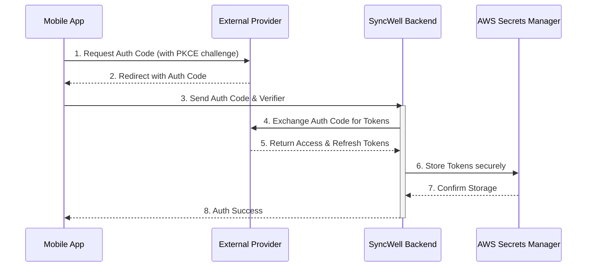
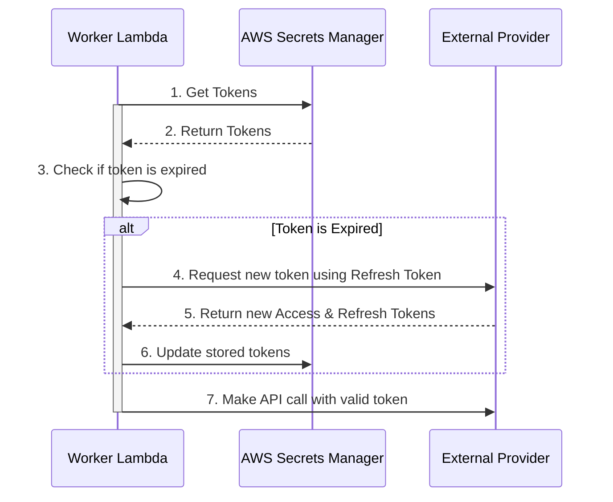

## Dependencies

### Core Dependencies
- `06-technical-architecture.md` - Technical Architecture, Security & Compliance
- `19-security-privacy.md` - Data Security & Privacy Policies
- `20-compliance-regulatory.md` - Legal & Regulatory Compliance
- `32-platform-limitations.md` - Platform-Specific Limitations
- `33-third-party-integration.md` - Third-Party Integration Strategy

### Strategic / Indirect Dependencies
- `05-data-sync.md` - Data Synchronization & Reliability
- `15-integration-testing.md` - Integration & End-to-End Testing
- `21-risks.md` - Risks, Constraints & Mitigation
- `40-error-recovery.md` - Error Recovery & Troubleshooting

---

# PRD Section 7: APIs & Integration Requirements

## 1. Executive Summary

This document provides the detailed technical requirements for integrating with third-party Health & Fitness APIs. A robust, scalable, and maintainable approach is paramount. This document specifies the design of the **`DataProvider`** architecture, the handling of authentication, and the specific endpoints for the MVP integrations. It is designed for the **engineering team** and reflects the hybrid sync model outlined in `06-technical-architecture.md`.

## 2. The `DataProvider` Architecture

To ensure consistency, maintainability, and quality as we scale to dozens of integrations, each third-party integration will be built against a standardized **`DataProvider` SDK**. This internal SDK provides a robust framework that separates the unique business logic of an integration from the boilerplate code required for all integrations.

### 2.1. The `DataProvider` SDK

The SDK will provide a set of abstract classes and utilities that every provider must implement or use. This includes:
*   **Standardized Interfaces:** A clear `fetchData` and `writeData` interface definition.
*   **Built-in OAuth Handling:** Utilities for handling the OAuth token exchange and refresh flows.
*   **Centralized Error Handling:** A common set of exceptions that provider-specific code can throw (e.g., `PermanentAuthError`, `TransientAPIError`, `RateLimitError`).
*   **Automatic Metrics & Logging:** The SDK will automatically capture and publish key metrics (e.g., API call latency, success/failure rates) and structured logs, ensuring consistent observability across all providers.
*   **Rate Limit Integration:** A simple interface to interact with the global rate-limiting service.

### 2.2. `DataProvider` Responsibilities

Each `DataProvider` implementation will focus purely on the provider-specific business logic:
*   **Authentication:** Providing the provider-specific URLs and parameters for the OAuth flow.
*   **Data Mapping:** Transforming the provider's unique data model into SyncWell's canonical data model, and vice-versa.
*   **Endpoint Logic:** Knowing which specific API endpoints to call for reading and writing data.

## 3. Authentication: A Secure Hybrid Flow

All cloud-based APIs will use the **OAuth 2.0 Authorization Code Flow with PKCE**. The key security principle is that **long-lived tokens never touch the user's device**.

### Authentication Flow Steps:

1.  **Initiate (Mobile):** The mobile app generates a `code_verifier` and `code_challenge`.
2.  **Open WebView (Mobile):** The app opens a secure in-app browser with the provider's authorization URL.
3.  **User Consent (Mobile):** The user logs in and grants consent on the provider's web page.
4.  **Redirect with Auth Code (Mobile):** The provider redirects to SyncWell's redirect URI (e.g., `syncwell://oauth-callback`) with a one-time `authorization_code`.
5.  **Secure Hand-off to Backend (Mobile -> Backend):** The mobile app sends the `authorization_code` and `code_verifier` to a secure endpoint on the SyncWell backend.
6.  **Token Exchange (Backend):** The backend worker exchanges the `authorization_code` and `code_verifier` for an `access_token` and `refresh_token` from the provider.
7.  **Secure Storage (Backend):** The backend stores the encrypted `access_token` and `refresh_token` in **AWS Secrets Manager**, associated with the user's ID. The tokens are now ready for use by the sync workers.

## 4. Token Management & Granular Error Handling

### 4.1. Token Auto-Refresh
Token management is a purely backend process. Before executing a sync, the `DataProvider` SDK will automatically perform a pre-flight check for token validity and handle the refresh flow if necessary. If a refresh fails because the user has revoked access externally, the SDK will throw a `PermanentAuthError`, causing the sync job to be marked with a `needs_reauth` status.

### 4.2. API Error Handling Strategy
A robust sync engine must intelligently handle the wide variety of errors that can occur when dealing with dozens of external APIs. The `DataProvider` SDK will classify errors and apply the appropriate retry or failure strategy.

| HTTP Status Code | Error Type | System Action | User Impact |
| :--- | :--- | :--- | :--- |
| `401 Unauthorized` / `403 Forbidden` | **Permanent Auth Error** | The sync job is immediately failed. The connection is marked as `needs_reauth` in DynamoDB. | User is notified in the app that they need to reconnect the service. |
| `429 Too Many Requests` | **Rate Limit Error** | The job is returned to the SQS queue with an increasing visibility timeout (exponential backoff). The global rate limiter is notified to slow down requests for this provider. | Syncs for this provider may be delayed. This is handled automatically. |
| `500`, `502`, `503`, `504` | **Transient Server Error** | The job is returned to the SQS queue with an increasing visibility timeout (exponential backoff). | Syncs may be delayed. The system will automatically retry. |
| `400 Bad Request` | **Permanent Request Error** | The job is failed and moved to the Dead-Letter Queue (DLQ) for manual inspection. An alarm is triggered. | The specific sync fails. An engineer is alerted to a potential bug in our `DataProvider` or an unexpected API change. |

## 4a. API Rate Limit Management

With 1M DAU, we will make millions of API calls per day. Proactively managing third-party rate limits is not optional; it is a core architectural requirement to prevent service-wide outages for a specific provider.

*   **Strategy:** We will implement a **distributed, global rate limiting** system using the **token bucket algorithm**.
*   **Implementation:**
    1.  **Centralized Ledger:** The **Amazon ElastiCache for Redis** cluster (defined in `06-technical-architecture.md`) will serve as the high-speed, centralized ledger for tracking our current usage against each provider's rate limit.
    2.  **Pre-flight Check:** Before a `DataProvider` makes an API call, it must request a "token" from our Redis-based rate limit service.
    3.  **Throttling & Queuing:** If the service determines that making a call would exceed the rate limit, it will deny the request. The `DataProvider` will then return the job to the SQS queue with a delay, effectively pausing execution until the rate limit window resets.
*   **Prioritization:** The rate limiting service will be aware of the "hot" vs. "cold" paths. When the available API budget is low, it will deny requests from `cold-path` (historical sync) workers before denying requests from `hot-path` (real-time sync) workers. This ensures that a user's large historical sync does not prevent their most recent activities from syncing quickly.

*(Note: This section directly impacts `21-risks.md` and `32-platform-limitations.md`. The rate limits for each provider must be documented.)*

## 5. MVP API Endpoint Mapping

| Platform | Data Type | Read Endpoint | Write Endpoint | Integration Model | Notes |
| :--- | :--- | :--- | :--- | :--- | :--- |
| **Google Fit** | Steps | `users/me/dataset:aggregate` | `users/me/dataSources/.../datasets:patch` | Hybrid | Requires Health Connect SDK on device. |
| **Apple Health** | Steps | `HKSampleQuery` | `HKHealthStore.save()` | Device-to-Cloud / Cloud-to-Device | Uses the native HealthKit SDK on device. |
| **Fitbit** | Steps | `1/user/-/activities/steps/date/[date]/1d.json` | `N/A` | Cloud-to-Cloud | Read-only for activity data. |
| **Garmin** | Steps | `daily-summary-service/daily-summary/...` | `N/A` | Cloud-to-Cloud | Read-only API. |
| **Strava** | Activities | `athlete/activities` | `activities` | Cloud-to-Cloud | Does not provide daily step data. |

## 6. Risk Analysis & Mitigation

| Risk ID | Risk Description | Probability | Impact | Mitigation Strategy |
| :--- | :--- | :--- | :--- | :--- |
| **R-19** | An API provider makes a breaking change, disabling a key integration. | High | High | Implement contract testing and versioned `DataProviders`. Have robust monitoring to detect API errors quickly. |
| **R-20** | SyncWell is denied access to a critical API. | Low | High | Be transparent with users. Have a plan to prioritize other integrations. |
| **R-21** | The complexity of implementing and maintaining numerous providers becomes a significant engineering burden. | Medium | High | Strictly adhere to the provider architecture. Automate testing for each provider. Allocate dedicated engineering resources for maintenance. |
| **R-22** | A vulnerability in the backend leads to a leak of user OAuth tokens from Secrets Manager. | Low | Critical | Enforce strict IAM policies with the principle of least privilege. Encrypt all secrets. Conduct regular security audits and penetration testing. |

## 7. Visual Diagrams

### Sequence Diagram for Authentication (Hybrid Flow)

### Sequence Diagram for Token Refresh (Backend)

