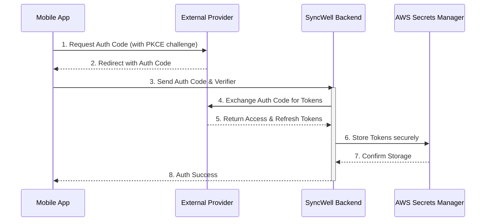
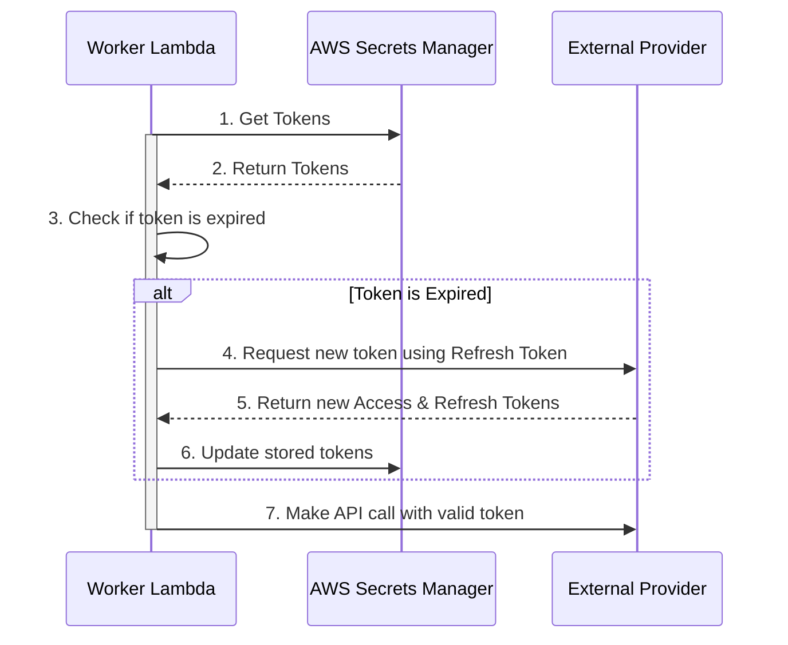

## Dependencies

### Core Dependencies
- `06-technical-architecture.md` - Technical Architecture, Security & Compliance
- `19-security-privacy.md` - Data Security & Privacy Policies
- `20-compliance-regulatory.md` - Legal & Regulatory Compliance
- `32-platform-limitations.md` - Platform-Specific Limitations
- `33-third-party-integration.md` - Third-Party Integration Strategy

### Strategic / Indirect Dependencies
- `05-data-sync.md` - Data Synchronization & Reliability
- `15-integration-testing.md` - Integration & End-to-End Testing
- `21-risks.md` - Risks, Constraints & Mitigation
- `40-error-recovery.md` - Error Recovery & Troubleshooting

---

# PRD Section 7: APIs & Integration Requirements

## 1. Executive Summary

This document provides the detailed technical requirements for integrating with third-party Health & Fitness APIs. A robust, scalable, and maintainable approach is paramount. This document specifies the design of the **`DataProvider`** architecture, the handling of authentication, and the specific endpoints for the MVP integrations. It is designed for the **engineering team** and reflects the hybrid sync model outlined in `06-technical-architecture.md`.

## 2. The `DataProvider` Concept

Each third-party integration is conceptually a `DataProvider`. This is not a single interface but a set of responsibilities split between the mobile client and the backend, ensuring a separation of concerns.

*   **Mobile Client Responsibilities:**
    *   Handle the user-facing authentication flow (OAuth).
    *   For device-native SDKs (e.g., HealthKit), read and write data directly.
*   **Backend Responsibilities:**
    *   Securely store and refresh OAuth tokens.
    *   For cloud-based APIs, execute the data fetching and writing logic within worker lambdas.

## 3. Authentication: A Secure Hybrid Flow

All cloud-based APIs will use the **OAuth 2.0 Authorization Code Flow with PKCE**. The key security principle is that **long-lived tokens never touch the user's device**.

### Authentication Flow Steps:

1.  **Initiate (Mobile):** The mobile app generates a `code_verifier` and `code_challenge`.
2.  **Open WebView (Mobile):** The app opens a secure in-app browser with the provider's authorization URL.
3.  **User Consent (Mobile):** The user logs in and grants consent on the provider's web page.
4.  **Redirect with Auth Code (Mobile):** The provider redirects to SyncWell's redirect URI (e.g., `syncwell://oauth-callback`) with a one-time `authorization_code`.
5.  **Secure Hand-off to Backend (Mobile -> Backend):** The mobile app sends the `authorization_code` and `code_verifier` to a secure endpoint on the SyncWell backend.
6.  **Token Exchange (Backend):** The backend worker exchanges the `authorization_code` and `code_verifier` for an `access_token` and `refresh_token` from the provider.
7.  **Secure Storage (Backend):** The backend stores the encrypted `access_token` and `refresh_token` in **AWS Secrets Manager**, associated with the user's ID. The tokens are now ready for use by the sync workers.

## 4. Token Management & Auto-Refresh (Backend)

Token management is a purely backend process, handled by the worker lambdas.

*   **Pre-flight Check:** Before a worker executes a sync job, it retrieves the relevant tokens from AWS Secrets Manager.
*   **Refresh Flow:** The worker checks if the token is expired. If so, it uses the `refresh_token` to request a new `access_token` and `refresh_token` from the provider's API.
*   **Update Storage:** The worker updates the new tokens in AWS Secrets Manager.
*   **Refresh Failure:** If the refresh token is invalid (e.g., user revoked access), the worker marks the sync connection as `needs_reauth` in DynamoDB. The user will be prompted to reconnect on the mobile app.

## 5. MVP API Endpoint Mapping

| Platform | Data Type | Read Endpoint | Write Endpoint | Integration Model | Notes |
| :--- | :--- | :--- | :--- | :--- | :--- |
| **Google Fit** | Steps | `users/me/dataset:aggregate` | `users/me/dataSources/.../datasets:patch` | Hybrid | Requires Health Connect SDK on device. |
| **Apple Health** | Steps | `HKSampleQuery` | `HKHealthStore.save()` | Device-to-Cloud / Cloud-to-Device | Uses the native HealthKit SDK on device. |
| **Fitbit** | Steps | `1/user/-/activities/steps/date/[date]/1d.json` | `N/A` | Cloud-to-Cloud | Read-only for activity data. |
| **Garmin** | Steps | `daily-summary-service/daily-summary/...` | `N/A` | Cloud-to-Cloud | Read-only API. |
| **Strava** | Activities | `athlete/activities` | `activities` | Cloud-to-Cloud | Does not provide daily step data. |

## 6. Risk Analysis & Mitigation

| Risk ID | Risk Description | Probability | Impact | Mitigation Strategy |
| :--- | :--- | :--- | :--- | :--- |
| **R-19** | An API provider makes a breaking change, disabling a key integration. | High | High | Implement contract testing and versioned `DataProviders`. Have robust monitoring to detect API errors quickly. |
| **R-20** | SyncWell is denied access to a critical API. | Low | High | Be transparent with users. Have a plan to prioritize other integrations. |
| **R-21** | The complexity of implementing and maintaining numerous providers becomes a significant engineering burden. | Medium | High | Strictly adhere to the provider architecture. Automate testing for each provider. Allocate dedicated engineering resources for maintenance. |
| **R-22** | A vulnerability in the backend leads to a leak of user OAuth tokens from Secrets Manager. | Low | Critical | Enforce strict IAM policies with the principle of least privilege. Encrypt all secrets. Conduct regular security audits and penetration testing. |

## 7. Visual Diagrams

### Sequence Diagram for Authentication (Hybrid Flow)

### Sequence Diagram for Token Refresh (Backend)

