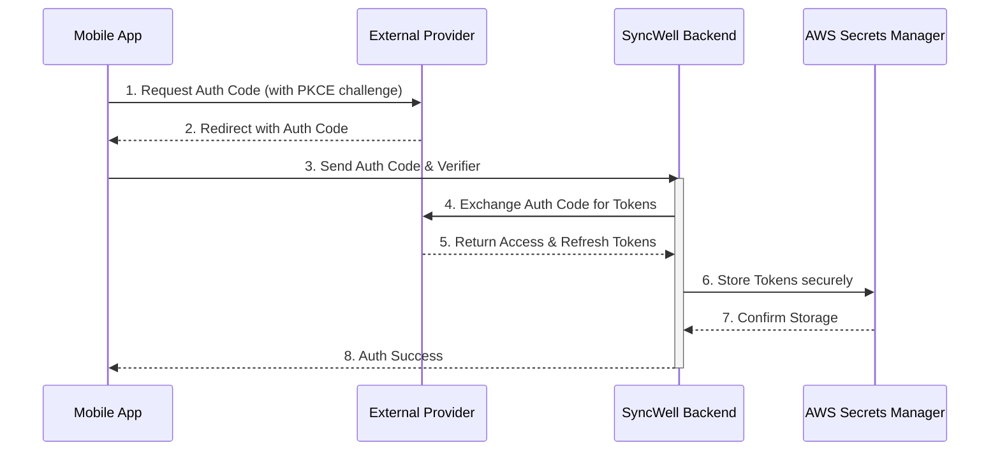
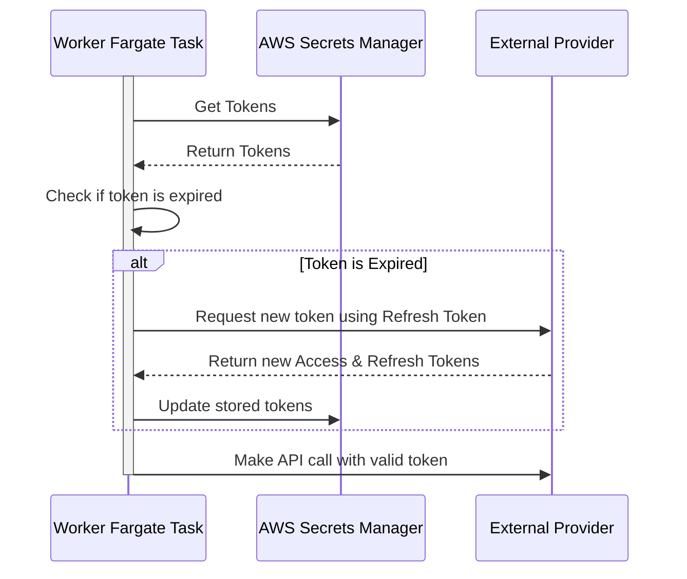

## Dependencies

### Core Dependencies
- `06-technical-architecture.md` - Technical Architecture, Security & Compliance
- `19-security-privacy.md` - Data Security & Privacy Policies
- `20-compliance-regulatory.md` - Legal & Regulatory Compliance
- `32-platform-limitations.md` - Platform-Specific Limitations
- `33-third-party-integration.md` - Third-Party Integration Strategy

### Strategic / Indirect Dependencies
- `05-data-sync.md` - Data Synchronization & Reliability
- `15-integration-testing.md` - Integration & End-to-End Testing
- `21-risks.md` - Risks, Constraints & Mitigation
- `40-error-recovery.md` - Error Recovery & Troubleshooting

---

# PRD Section 7: APIs & Integration Requirements

## 1. Executive Summary

This document provides the detailed technical requirements for integrating with third-party Health & Fitness APIs. A robust, scalable, and maintainable approach is paramount. This document specifies the design of the **`DataProvider`** architecture, the handling of authentication, and the specific endpoints for the MVP integrations. It is designed for the **engineering team** and reflects the hybrid sync model outlined in `06-technical-architecture.md`.

## 2. The `DataProvider` Architecture

To ensure consistency, maintainability, and quality as we scale to dozens of integrations, each third-party integration will be built against a standardized **`DataProvider` SDK**. This internal SDK provides a robust framework that separates the unique business logic of an integration from the boilerplate code required for all integrations.

### 2.1. The `DataProvider` SDK

The SDK will provide a set of abstract classes and utilities that every provider must implement or use. This includes:
*   **Standardized Interfaces:** A clear `fetchData` and `writeData` interface definition.
*   **Built-in OAuth Handling:** Utilities for handling the OAuth token exchange and refresh flows.
*   **Centralized Error Handling:** A common set of exceptions that provider-specific code can throw (e.g., `PermanentAuthError`, `TransientAPIError`, `RateLimitError`).
*   **Automatic Metrics & Logging:** The SDK will automatically capture and publish key metrics (e.g., API call latency, success/failure rates) and structured logs, ensuring consistent observability across all providers.
*   **Rate Limit Integration:** A simple interface to interact with the global rate-limiting service.

### 2.2. `DataProvider` Responsibilities

Each `DataProvider` implementation will focus purely on the provider-specific business logic:
*   **Authentication:** Providing the provider-specific URLs and parameters for the OAuth flow.
*   **Data Mapping:** Transforming the provider's unique data model into SyncWell's canonical data model, and vice-versa.
*   **Endpoint Logic:** Knowing which specific API endpoints to call for reading and writing data.

To enforce this separation of concerns, every provider must implement the `DataProvider` interface defined in the KMP shared module. This creates a standardized contract for all integrations.

```kotlin
// Simplified for documentation purposes.

/**
 * Defines the granular capabilities of a given DataProvider for specific data types.
 * This allows the sync engine to have fine-grained control and understanding of what
 * each provider can do. For example, a provider might be able to read steps but not
 * write them, and write workouts but not read them.
 */
enum class Capability {
    READ_STEPS, WRITE_STEPS,
    READ_WORKOUTS, WRITE_WORKOUTS,
    READ_SLEEP, WRITE_SLEEP,
    SUPPORTS_WEBHOOKS
}

/**
 * Represents the parsed and validated payload from a provider's webhook.
 */
data class WebhookPayload(
    val userId: String,
    val dataType: String, // e.g., "steps", "workouts"
    val eventTimestamp: Long
)

interface DataProvider {
    /**
     * A unique, machine-readable key for the provider (e.g., "strava", "fitbit").
     */
    val providerKey: String

    /**
     * The set of granular capabilities supported by this provider. The core sync engine
     * will check this set before attempting operations. For example, a provider that can
     * only read steps and workouts would return `setOf(Capability.READ_STEPS, Capability.READ_WORKOUTS)`.
     * This resolves ambiguity where a provider might be read-only for one data type but not another.
     */
    val capabilities: Set<Capability>

    /**
     * Handles the initial OAuth 2.0 authorization flow to acquire tokens.
     */
    suspend fun authenticate(authCode: String): ProviderTokens

    /**
     * Refreshes an expired access token using a refresh token.
     */
    suspend fun refreshAccessToken(refreshToken: String): ProviderTokens

    /**
     * Revokes the given tokens with the third-party provider. This is a critical
     * part of the user data deletion workflow.
     */
    suspend fun revoke(tokens: ProviderTokens)

    /**
     * Fetches a specific type of data from the provider's API for a given time range
     * and transforms it into a list of `CanonicalData` models.
     * @param dataType The type of data to fetch (e.g., "steps", "workouts"). The provider
     * implementation is responsible for checking if it supports the given type.
     */
    suspend fun fetchData(tokens: ProviderTokens, dateRange: DateRange, dataType: String): List<CanonicalData>

    /**
     * Pushes a list of canonical data models to the provider's API. The implementation
     * is responsible for casting the `CanonicalData` objects to the correct concrete type
     * based on the `dataType` of the sync job.
     */
    suspend fun pushData(tokens: ProviderTokens, data: List<CanonicalData>): PushResult

    /**
     * Handles an incoming webhook event. The implementation is responsible for
     * verifying the webhook's authenticity and parsing its payload.
     * @param requestHeaders The HTTP headers from the incoming request.
     * @param requestBody The raw HTTP body from the incoming request.
     * @return A `WebhookPayload` object if the webhook is valid, otherwise null.
     */
    suspend fun handleWebhook(requestHeaders: Map<String, String>, requestBody: String): WebhookPayload?
}

/**
 * Represents the result of a push operation, including any items that failed.
 */
data class PushResult(
    val success: Boolean,
    // [C-015] This list should contain the `sourceId` from the canonical model for each item that failed to push.
    // The DataProvider implementation is responsible for catching errors on a per-item basis and populating this list.
    val failedItemIds: List<String> = emptyList()
)

/**
 * [C-017] Defines a simple date range.
 */
data class DateRange(
    val startDate: String, // ISO 8601 format
    val endDate: String    // ISO 8601 format
)
```

### 2.3. SDK Packaging and Versioning

For the MVP, a formal, versioned SDK package adds unnecessary overhead. To prioritize development speed and simplicity, the `DataProvider` interfaces and shared utilities will be maintained as a **simple shared module** within the main application's monorepo.

This approach ensures all `DataProvider` implementations are always using the same version of the core interfaces, and it removes the complexity of managing a private artifact repository and coordinating SDK releases. A formal, versioned SDK can be extracted from the monorepo in the future if the number of integrations and teams grows to a scale where it becomes necessary.

### 2.4. Network Environment & Security
All backend `DataProvider` logic runs within the main application's VPC on AWS. To balance cost and security, outbound traffic is routed through a **hybrid firewall model**, as defined in `06-technical-architecture.md`.
*   **High-Security Path (AWS Network Firewall):** All outbound traffic to unknown, lower-volume, or security-sensitive endpoints is routed through an **AWS Network Firewall**. This provides advanced inspection and ensures the highest level of security.
*   **Cost-Optimized Path (AWS NAT Gateway):** High-volume, trusted traffic to the primary API endpoints of major partners (e.g., Fitbit, Strava) is routed through a standard **AWS NAT Gateway** to reduce data processing costs. This path is still secured via VPC route tables and network ACLs.

This hybrid approach means that for a new `DataProvider` to function, the domain name(s) of the third-party API it needs to call **must** be added to the allow-list of the appropriate egress path (either the Network Firewall or the route table for the NAT Gateway). This enforces a "least privilege" model at the network level and is a mandatory part of the process for enabling a new provider.

## 3. Authentication: A Secure Hybrid Flow

All cloud-based APIs will use the **OAuth 2.0 Authorization Code Flow with PKCE**. The key security principle is that **long-lived tokens never touch the user's device**.

### Authentication Flow Steps:

1.  **Initiate (Mobile):** The mobile app generates a `code_verifier` and `code_challenge`.
2.  **Open WebView (Mobile):** The app opens a secure in-app browser with the provider's authorization URL.
3.  **User Consent (Mobile):** The user logs in and grants consent on the provider's web page.
4.  **Redirect with Auth Code (Mobile):** The provider redirects to SyncWell's redirect URI (e.g., `syncwell://oauth-callback`) with a one-time `authorization_code`.
5.  **Secure Hand-off to Backend (Mobile -> Backend):** The mobile app sends the `authorization_code` and `code_verifier` to a secure endpoint on the SyncWell backend.
6.  **Token Exchange (Backend):** A dedicated backend Lambda function receives the `authorization_code`. It uses the `state` parameter from the OAuth flow to identify the correct `DataProvider` (e.g., `FitbitProvider`) and invokes its `authenticate(authCode)` method. The `DataProvider` is responsible for the direct interaction with the provider's token endpoint.
7.  **Secure Storage (Backend):** Upon receiving the tokens from the `DataProvider`, the backend stores the encrypted `access_token` and `refresh_token` in **AWS Secrets Manager**.

## 4. Token Management & Granular Error Handling

### 4.1. Token Auto-Refresh
Token management is a purely backend process. Before executing a sync, the `DataProvider` SDK will automatically perform a pre-flight check for token validity and handle the refresh flow if necessary. If a refresh fails because the user has revoked access externally, the SDK will throw a `PermanentAuthError`, causing the sync job to be marked with a `needs_reauth` status.

### 4.2. API Error Handling Strategy
A robust sync engine must intelligently handle the wide variety of errors that can occur when dealing with dozens of external APIs. The `DataProvider` SDK will classify errors and apply the appropriate retry or failure strategy.

| HTTP Status Code | Error Type | System Action | User Impact |
| :--- | :--- | :--- | :--- |
| `401 Unauthorized` / `403 Forbidden` | **Permanent Auth Error** | The sync job is immediately failed. The connection is marked as `needs_reauth`. Crucially, the Fargate task **must** also publish a `ReAuthenticationNeeded` event, which triggers an immediate push notification to the user. Waiting for a DLQ to process is too slow. | User is notified **immediately** that they need to reconnect the service. **[U-003]** When the user taps this notification, the app must deep-link directly to the "Connected Apps" screen, where the affected connection is highlighted in an error state with a "Reconnect" button. |
| `429 Too Many Requests` | **Rate Limit Error** | The job is returned to the SQS queue with an increasing visibility timeout (exponential backoff). The global rate limiter is notified to slow down requests for this provider. | Syncs for this provider may be delayed. This is handled automatically. **[U-002]** If a user's syncs are delayed by more than a configurable threshold (e.g., 1 hour) due to persistent rate limiting, a low-priority notification should be sent to the user to inform them of the delay. |
| `500`, `502`, `503`, `504` | **Transient Server Error** | The job is returned to the SQS queue with an increasing visibility timeout (exponential backoff). | Syncs may be delayed. The system will automatically retry. |
| `400 Bad Request` | **Permanent Request Error** | The job is failed and moved to the Dead-Letter Queue (DLQ) for manual inspection. An alarm is triggered. | The specific sync fails. An engineer is alerted to a potential bug in our `DataProvider` or an unexpected API change. |

## 4a. API Rate Limit Management

With 1M DAU, we will make millions of API calls per day. Proactively managing third-party rate limits is not optional; it is a core architectural requirement to prevent service-wide outages for a specific provider.

*   **Strategy:** We will implement a **distributed, global rate limiting** system using the **token bucket algorithm**.
*   **Implementation:**
    1.  **Centralized Ledger:** The **Amazon ElastiCache for Redis** cluster (defined in `06-technical-architecture.md`) will serve as the high-speed, centralized ledger for tracking our current usage against each provider's rate limit.
    2.  **Pre-flight Check:** Before a `DataProvider` makes an API call, it must request a "token" from our Redis-based rate limit service.
    3.  **Throttling & Queuing:** If the service determines that making a call would exceed the rate limit, it will deny the request. The `DataProvider` will then return the job to the SQS queue with a delay, effectively pausing execution until the rate limit window resets.
*   **Prioritization:** The rate limiting service will be aware of job priority. When the available API budget is low, it will deny requests from low-priority workers (e.g., historical syncs) before denying requests from high-priority workers (e.g., hot path syncs). This ensures that a user's large historical sync does not prevent their most recent activities from syncing quickly. The mechanism for this is simple: the event payload for every sync job **must** include a `priority` field. The worker passes this priority to the rate limiting service when requesting a token. This terminology avoids confusion with the "Cold Path" workflow name.
    *   **[C-014] `priority` Enum:** The `priority` field is a required, case-sensitive string enum with the following possible values: `"high"`, `"medium"`, `"low"`.

*(Note: This section directly impacts `21-risks.md` and `32-platform-limitations.md`. The rate limits for each provider must be documented.)*

## 5. MVP API Endpoint Mapping

| Platform | Data Type | Read Endpoint | Write Endpoint | Integration Model | Notes |
| :--- | :--- | :--- | :--- | :--- | :--- |
| **Google Fit** | Steps | `users/me/dataset:aggregate` | `users/me/dataSources/.../datasets:patch` | Hybrid (Polling) | Requires Health Connect SDK on device. Does not have a webhook API. |
| **Apple Health** | Steps | `HKSampleQuery` | `HKHealthStore.save()` | Device-to-Cloud / Cloud-to-Device | N/A (On-device) |
| **Fitbit** | Steps | `1/user/-/activities/steps/date/[date]/1d.json` | `N/A` | Cloud-to-Cloud (Webhook-First) | Read-only for activity data. Supports webhooks for near real-time updates. |
| **Strava** | Activities | `athlete/activities` | `activities` | Cloud-to-Cloud (Webhook-First) | Does not provide daily step data. Supports webhooks for activity updates. |
| **Garmin** | Steps | `daily-summary-service/daily-summary/...` | `N/A` | Cloud-to-Cloud (Polling) | **Deferred Post-MVP.** Unofficial API. No webhook support. |

## 6. Risk Analysis & Mitigation

| Risk ID | Risk Description | Probability | Impact | Mitigation Strategy |
| :--- | :--- | :--- | :--- | :--- |
| **R-19** | An API provider makes a breaking change, disabling a key integration. | High | High | Implement contract testing and versioned `DataProviders`. Have robust monitoring to detect API errors quickly. |
| **R-20** | SyncWell is denied access to a critical API. | Low | High | Be transparent with users. Have a plan to prioritize other integrations. |
| **R-21** | The complexity of implementing and maintaining numerous providers becomes a significant engineering burden. | Medium | High | Strictly adhere to the provider architecture. Automate testing for each provider. Allocate dedicated engineering resources for maintenance. |
| **R-22** | A vulnerability in the backend leads to a leak of user OAuth tokens from Secrets Manager. | Low | Critical | Enforce strict IAM policies with the principle of least privilege. Encrypt all secrets. Conduct regular security audits and penetration testing. |

## 7. Visual Diagrams

### Sequence Diagram for Authentication (Hybrid Flow)


### Sequence Diagram for Token Refresh (Backend)


## 8. Managing Unstable & Poorly Documented APIs

While the `DataProvider` architecture provides a solid foundation, a key risk is the varying quality and stability of third-party APIs. This section outlines a proactive strategy for managing this risk.

*   **Provider-Specific Monitoring:** In addition to global backend monitoring, each `DataProvider` will have its own dedicated set of CloudWatch Alarms. These alarms will monitor the error rate and P95 latency for API calls to that specific provider. A sudden spike in either metric for a single provider will trigger a low-priority alert for investigation.
*   **Circuit Breaker Pattern:** For notoriously unstable APIs, a Circuit Breaker pattern will be implemented within the `DataProvider` SDK.
    *   **Mechanism:** The circuit breaker monitors for failures. If the failure rate for a specific provider's API calls exceeds a configured threshold, the circuit "trips" or "opens".
    *   **Action:** Once the circuit is open, all subsequent calls to that provider's API will fail fast for a "cooldown" period, without making a network call. This prevents the system from wasting resources on an API that is clearly down and reduces the load on the failing service. After the cooldown, the circuit moves to a "half-open" state, allowing a single request to test if the service has recovered.
    *   **[C-016] Configuration:** The thresholds for the circuit breaker **must be configurable per-provider** via AWS AppConfig. This allows for fine-tuning based on the known stability of each third-party API. The full set of configurable parameters includes:
        *   `failureRateThreshold`: (Percentage) The failure rate to trip the circuit.
        *   `slowCallRateThreshold`: (Percentage) The percentage of calls that are considered "slow" to trip the circuit.
        *   `slowCallDurationThreshold`: (Milliseconds) The duration above which a call is considered "slow".
        *   `permittedNumberOfCallsInHalfOpenState`: (Integer) The number of trial requests to make when the circuit is half-open.
        *   `waitDurationInOpenState`: (Milliseconds) The time the circuit remains open before transitioning to half-open.
*   **Graceful Degradation via Feature Flags:** If a provider's API is causing persistent, critical problems, a remote feature flag will be used to gracefully degrade the integration.
    *   **Level 1 (Read-Only Mode):** If writing data to a provider is failing, but reading is stable, the integration can be temporarily put into a read-only mode.
    *   **Level 2 (Full Disable):** If the entire API is unstable, the integration can be temporarily disabled in the app's UI, with a message explaining that the service is experiencing issues.
*   **Defensive Coding and Documentation:** The developer responsible for an integration is also responsible for documenting any known quirks or undocumented behaviors of the provider's API directly in the `DataProvider`'s source code. This institutional knowledge is critical for long-term maintenance.
