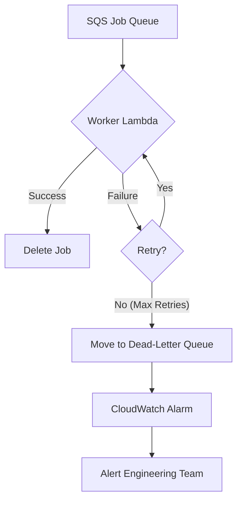

## Dependencies

### Core Dependencies
- `06-technical-architecture.md` - Technical Architecture, Security & Compliance
- `40-error-recovery.md` - Error Recovery & Troubleshooting

### Strategic / Indirect Dependencies
- `05-data-sync.md` - Data Synchronization & Reliability
- `14-qa-testing.md` - QA, Testing & Release Strategy
- `22-maintenance.md` - Maintenance & Post-Launch Operations (SRE)
- `24-user-support.md` - Help Center, Support & Feedback
- `41-metrics-dashboards.md` - Analytics Dashboard Design

---

# PRD Section 17: Error Handling, Logging & Monitoring

## 1. Executive Summary

This document specifies the comprehensive strategy for error handling, logging, and monitoring for the entire SyncWell ecosystem, including both the **mobile application and the AWS backend**. The goal is to build a highly resilient and observable system that can gracefully handle unexpected issues, provide clear feedback to the user, and give the engineering team powerful tools to diagnose and resolve problems quickly.

This enterprise-grade approach uses structured logging, centralized error handling, and targeted alerting to ensure high service quality.

## 2. Error Handling Architecture

### 2.1. Client-Side Error Handling
A centralized `ErrorHandler` service on the mobile client will be the single point through which all application-level errors flow. This ensures consistent handling of UI errors, validation errors, and network errors when communicating with our backend.

### 2.2. Backend Error Handling
The backend's error handling strategy is designed for maximum resilience and message durability. The primary goal is to ensure that no sync job is ever lost due to temporary issues and that persistent failures are isolated for analysis without impacting the rest of the system. This is achieved through a combination of SQS features and Lambda configuration.

1.  **Guaranteed Delivery & Message Durability:** When a sync job is accepted, it is first published as an event to EventBridge, which then forwards it to a durable **Amazon SQS queue**. SQS guarantees that the message is stored redundantly across multiple availability zones until a worker successfully processes it. This ensures that even if the entire worker fleet is down, no sync jobs are lost.

2.  **Handling Transient Failures with Retries:** A worker Lambda may fail for transient reasons, such as a temporary network issue, a brief third-party API outage, or being throttled. The system handles this gracefully:
    *   The SQS message remains on the queue and becomes visible again after its "visibility timeout" expires.
    *   Lambda is configured with a retry policy (typically 3-5 attempts with exponential backoff). This built-in mechanism automatically re-invokes the function, giving the transient issue time to resolve itself without any custom code.

3.  **Isolating Persistent Failures with a Dead-Letter Queue (DLQ):** If a job fails all of its retry attempts, it is considered a persistent failure (e.g., due to a bug in the code, malformed data that causes a crash, or a permanent issue with a third-party API).
    *   To prevent this single bad message from blocking the queue and being retried indefinitely, SQS automatically moves it to a pre-configured **Dead-Letter Queue (DLQ)**.
    *   This action is critical as it isolates the problematic job, allowing healthy jobs to continue processing without interruption.

4.  **Alerting and Analysis:** A CloudWatch Alarm continuously monitors the DLQ. If the number of messages rises above zero, it triggers a high-priority alert to the on-call engineering team. The failed job message, which is stored in the DLQ, contains the full context of the job, allowing engineers to diagnose and resolve the root cause.

## 3. Unified Error Code Dictionary

A version-controlled dictionary will be the single source of truth for error definitions, shared between the backend and client. When the backend encounters a specific, known error (e.g., an expired token), it will update the sync status in DynamoDB with a specific error code. The client reads this code and uses the dictionary to display the correct localized message and recovery action to the user.

**Example Entry:**
```json
{
  "FITBIT_TOKEN_EXPIRED": {
    "logLevel": "WARN",
    "userMessageKey": "error_fitbit_token_expired",
    "userAction": "NAVIGATE_TO_REAUTH_FITBIT"
  },
  "GARMIN_API_UNAVAILABLE": {
    "logLevel": "ERROR",
    "userMessageKey": "error_service_unavailable_garmin",
    "userAction": "SHOW_SUPPORT_CONTACT"
  }
}
```

## 4. Structured Logging Strategy

### 4.1. Client-Side Logging
The mobile app will maintain a local, rotating log file with structured JSON entries for targeted debugging of device-specific issues.

### 4.2. Backend Logging
All backend Lambda functions will output structured JSON logs to **AWS CloudWatch Logs**. This is the primary source of information for debugging backend processes. The log schema will be consistent with the client-side schema.

**Example Log Entry (CloudWatch):**
```json
{
  "timestamp": "2023-10-27T14:30:00.123Z",
  "level": "ERROR",
  "message": "Sync job failed: Unhandled exception from provider.",
  "context": {
    "jobId": "xyz-123",
    "source": "garmin",
    "userId": "abc-456"
  },
  "error": {
    "name": "GarminApiError",
    "statusCode": 503,
    "message": "Service Unavailable"
  }
}
```
*   **PII Scrubbing:** No sensitive data like OAuth tokens will ever be logged. User IDs are logged to allow tracing a user's journey through the system.

## 5. Monitoring & Alerting

### 5.1. Client-Side (Firebase)
*   **Dashboard:** Focuses on crashes and UI performance (see `39-performance-metrics.md`).
*   **Alerts:**
    *   New crash detected.
    *   Crash-free user rate drops below 99.9%.

### 5.2. Backend-Side (AWS CloudWatch)
*   **Dashboard:** Focuses on API health, Lambda performance, and queue depth (see `39-performance-metrics.md`).
*   **Alerts (High Priority - PagerDuty/Slack):**
    *   **Messages in the Dead-Letter Queue.** This is our most critical alert.
    *   Significant spike in Lambda errors or 5xx errors on API Gateway.
    *   SQS queue depth growing for a sustained period.
    *   DynamoDB table is being throttled.

## 6. Visual Diagrams

### Backend Error Handling Flow (DLQ)

