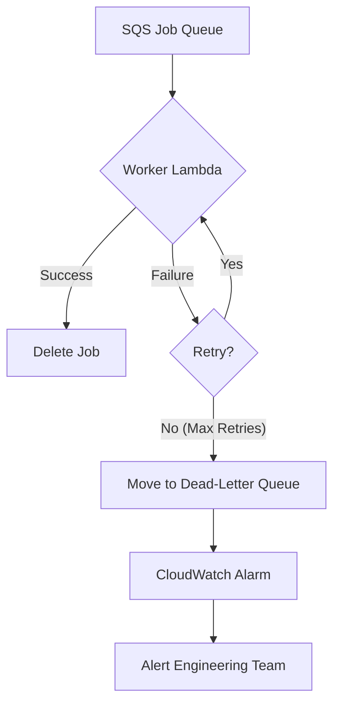

## Dependencies

### Core Dependencies
- `06-technical-architecture.md` - Technical Architecture, Security & Compliance
- `40-error-recovery.md` - Error Recovery & Troubleshooting

### Strategic / Indirect Dependencies
- `05-data-sync.md` - Data Synchronization & Reliability
- `14-qa-testing.md` - QA, Testing & Release Strategy
- `22-maintenance.md` - Maintenance & Post-Launch Operations (SRE)
- `24-user-support.md` - Help Center, Support & Feedback
- `41-metrics-dashboards.md` - Analytics Dashboard Design

---

# PRD Section 17: Error Handling, Logging & Monitoring

## 1. Executive Summary

This document specifies the comprehensive strategy for error handling, logging, and monitoring for the entire SyncWell ecosystem, including both the **mobile application and the AWS backend**. The goal is to build a highly resilient and observable system that can gracefully handle unexpected issues, provide clear feedback to the user, and give the engineering team powerful tools to diagnose and resolve problems quickly.

This enterprise-grade approach uses structured logging, centralized error handling, and targeted alerting to ensure high service quality.

## 2. Error Handling Architecture

### 2.1. Client-Side Error Handling
A centralized `ErrorHandler` service on the mobile client will be the single point through which all application-level errors flow. This ensures consistent handling of UI errors, validation errors, and network errors when communicating with our backend.

### 2.2. Backend Error Handling
The backend's error handling strategy is designed for maximum resilience and message durability. The primary goal is to ensure that no sync job is ever lost due to temporary issues and that persistent failures are isolated for analysis without impacting the rest of the system. This is achieved through a combination of SQS features and Lambda configuration.

1.  **Guaranteed Delivery & Message Durability:** When a sync job is accepted, it is first published as an event to EventBridge, which then forwards it to a durable **Amazon SQS queue**. SQS guarantees that the message is stored redundantly across multiple availability zones until a worker successfully processes it. This ensures that even if the entire worker fleet is down, no sync jobs are lost.

2.  **Handling Transient Failures with Retries:** A worker task (Fargate or Lambda) may fail for transient reasons, such as a temporary network issue, a brief third-party API outage, or being throttled. The system handles this gracefully:
    *   For SQS-triggered Fargate tasks, the SQS message remains on the queue and becomes visible again after its "visibility timeout" expires, causing the service to retry the job.
    *   For Step Functions-triggered Lambda tasks, the state machine itself is configured with a retry policy (typically 3-5 attempts with exponential backoff). This built-in mechanism automatically re-invokes the function, giving the transient issue time to resolve itself without any custom code.

3.  **Isolating Persistent Failures with a Dead-Letter Queue (DLQ):** If a job fails all of its retry attempts, it is considered a persistent failure (e.g., due to a bug in the code, malformed data that causes a crash, or a permanent issue with a third-party API).
    *   To prevent this single bad message from blocking the queue and being retried indefinitely, SQS automatically moves it to a pre-configured **Dead-Letter Queue (DLQ)**.
    *   This action is critical as it isolates the problematic job, allowing healthy jobs to continue processing without interruption.

4.  **Alerting and Analysis:** A CloudWatch Alarm continuously monitors the DLQ. If the number of messages rises above zero, it triggers a high-priority alert to the on-call engineering team. The failed job message, which is stored in the DLQ, contains the full context of the job, allowing engineers to diagnose and resolve the root cause.

5.  **EventBridge Durability:** To provide an additional layer of durability, the EventBridge rule that targets the SQS queue will also be configured with its own DLQ. This ensures that if an event fails to be delivered to the SQS queue for any reason (e.g., a misconfiguration or temporary unavailability), the event is captured and can be reprocessed, preventing data loss.

### 2.3. DLQ Management and Re-processing

Messages in a Dead-Letter Queue (DLQ) represent persistent failures that could not be resolved by automatic retries. A manual, operator-driven process is required to handle these messages to ensure no data is lost. The following runbook outlines the procedure for an on-call engineer.

**Runbook for DLQ Message Handling:**

1.  **Alerting:** A CloudWatch Alarm triggers when the `ApproximateNumberOfMessagesVisible` metric for any DLQ is greater than zero for a sustained period (e.g., 15 minutes). The on-call engineer is paged.
2.  **Inspection:** The engineer navigates to the SQS console in AWS to view the messages in the DLQ. The message body and attributes are inspected to understand the job context and the reason for failure (often available in the `ErrorMessage` attribute added by Lambda).
3.  **Diagnosis:** The engineer uses the `correlationId` from the message to query CloudWatch Logs Insights for all related logs. This provides the full context of the failure, allowing the engineer to diagnose the root cause (e.g., a bug in the worker, a breaking change in a third-party API, unexpected data format).
4.  **Archiving:** Before taking any action, all messages in the DLQ **must be archived** to a dedicated S3 bucket for long-term analysis and auditing. This can be done using a small, purpose-built Lambda function or a script.
5.  **Decision and Action:**
    *   **If the error is due to a transient issue that has since been resolved (e.g., a temporary third-party API outage):** The engineer can use the "Start DLQ redrive" feature in the SQS console to move the messages back to the main source queue for reprocessing.
    *   **If the error is due to a bug in the worker code:** A high-priority ticket is created. Once a fix is deployed, the messages can be redriven from the DLQ.
    *   **If the error is due to malformed data or a permanent, unrecoverable issue:** The messages are left in the archive S3 bucket, and the issue is logged for product/engineering review. The messages are then purged from the DLQ.

This manual-first approach ensures that an operator carefully considers each failure case, preventing potential infinite failure loops and providing a high degree of safety.

## 3. Unified Error Code Dictionary

A version-controlled dictionary will be the single source of truth for error definitions, shared between the backend and client. When the backend encounters a specific, known error (e.g., an expired token), it will update the sync status in DynamoDB with a specific error code. The client reads this code and uses the dictionary to display the correct localized message and recovery action to the user.

**Example Entry:**
```json
{
  "FITBIT_TOKEN_EXPIRED": {
    "logLevel": "WARN",
    "userMessageKey": "error_fitbit_token_expired",
    "userAction": "NAVIGATE_TO_REAUTH_FITBIT"
  },
  "GARMIN_API_UNAVAILABLE": {
    "logLevel": "ERROR",
    "userMessageKey": "error_service_unavailable_garmin",
    "userAction": "SHOW_SUPPORT_CONTACT"
  }
}
```

## 4. Structured Logging Strategy

### 4.1. Client-Side Logging
The mobile app will maintain a local, rotating log file with structured JSON entries for targeted debugging of device-specific issues.

### 4.2. Backend Logging
All backend Lambda functions will output structured JSON logs to **AWS CloudWatch Logs**. To enforce consistency and automate best practices like traceability, all functions **must** use a standardized library such as **AWS Lambda Powertools for TypeScript**.

**Example Log Entry (CloudWatch with Powertools):**
```json
{
  "timestamp": "2023-10-27T14:30:00.123Z",
  "level": "ERROR",
  "message": "Sync job failed: Unhandled exception from provider.",
  "service": "SyncWorker",
  "correlationId": "a1b2c3d4-e5f6-7890-1234-567890abcdef",
  "jobId": "xyz-123",
  "source": "garmin",
  "error": {
    "name": "GarminApiError",
    "statusCode": 503,
    "message": "Service Unavailable"
  }
}
```
*   **PII Scrubbing & Traceability:** No sensitive data (e.g., OAuth tokens, PII) will ever be logged. To align with the strict privacy policy in `19-security-privacy.md`, permanent identifiers like `userId` **must not** be logged. The mandated Powertools library will automatically handle the injection and propagation of a temporary `correlationId` across all logs, ensuring full request traceability without compromising user privacy. For the rare cases where debugging a specific user's issue is required, a secure, audited "break-glass" procedure, as defined in `19-security-privacy.md`, must be followed by authorized personnel.

## 5. Monitoring & Alerting Strategy

The comprehensive observability strategy, including the full tooling stack (CloudWatch, X-Ray, Grafana), logging standards, and key performance indicators, is defined in detail in the `06-technical-architecture.md` document. This section summarizes the aspects most relevant to error handling.

### 5.1. Client-Side Monitoring
*   **Tooling:** Firebase Crashlytics.
*   **Focus:** Monitoring for app crashes, non-fatal errors, and UI performance issues.
*   **Critical Alerts:**
    *   A newly detected crash type.
    *   A significant regression in the crash-free user rate below the target of 99.9%.

### 5.2. Backend-Side Monitoring
*   **Tooling:** The primary backend monitoring stack consists of AWS CloudWatch, AWS X-Ray, and Grafana for dashboards.
*   **Focus:** Monitoring API health, Lambda function performance, data queue health, and database performance.
*   **Alerting Flow:** High-priority alerts are routed via **CloudWatch Alarms → Amazon SNS → PagerDuty** to notify the on-call team immediately.
*   **High-Priority Alert Triggers:**
    *   **Dead-Letter Queue (DLQ):** Any message arriving in a DLQ is a critical alert, as it signifies a persistent failure.
    *   **Function & API Errors:** A significant spike in Lambda invocation errors or 5xx-level errors from API Gateway.
    *   **Queue Health:** The `ApproximateAgeOfOldestMessage` for the main SQS queue exceeds 5 minutes, indicating a processing backlog.
    *   **Database Throttling:** Sustained throttling events on the DynamoDB table, indicating a performance bottleneck.

## 6. Visual Diagrams

### Backend Error Handling Flow (DLQ)


## 7. Log Management at Scale

While structured logging is essential for debugging, logging at the scale of 1 million DAU generates a massive volume of data, which has significant cost and operational implications. This section outlines a strategy for managing logs in a cost-effective and scalable way.

*   **Log Levels:** Log levels will be used strategically to control the volume of logs.
    *   **Production:** The default log level for all production services will be `INFO`. `DEBUG` level logs will be disabled to reduce noise and cost.
    *   **Dynamic Log Level Adjustment:** AWS AppConfig will be used to dynamically adjust the log level for specific Lambda functions without requiring a deployment. This allows for temporarily enabling `DEBUG` logging for a specific service to diagnose a live issue.
*   **Log Retention and Archiving:**
    *   **CloudWatch:** Logs in Amazon CloudWatch Logs will have a short retention period (e.g., **30 days**). This provides immediate access for debugging recent events.
    *   **Archiving to S3:** An automated process will export all logs from CloudWatch to an Amazon S3 bucket for long-term, low-cost storage.
    *   **Archiving to Glacier:** S3 Lifecycle policies will be used to transition logs from the S3 Standard tier to a cheaper archival tier like S3 Glacier Deep Archive after a longer period (e.g., **1 year**). This ensures compliance with any long-term data retention requirements while minimizing storage costs.
*   **Log Analysis:**
    *   **CloudWatch Logs Insights:** Used for real-time querying and analysis of recent logs.
    *   **Amazon Athena:** For analyzing archived logs in S3, Amazon Athena can be used to run SQL queries directly on the log files. This provides a powerful tool for historical analysis without the need to re-ingest the data.
