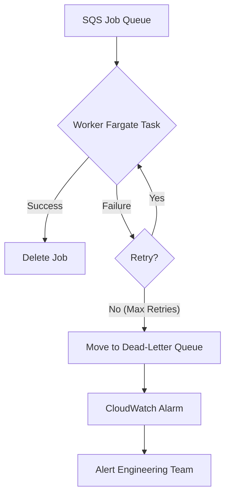

## Dependencies

### Core Dependencies
- `06-technical-architecture.md` - Technical Architecture, Security & Compliance
- `40-error-recovery.md` - Error Recovery & Troubleshooting

### Strategic / Indirect Dependencies
- `05-data-sync.md` - Data Synchronization & Reliability
- `14-qa-testing.md` - QA, Testing & Release Strategy
- `22-maintenance.md` - Maintenance & Post-Launch Operations (SRE)
- `24-user-support.md` - Help Center, Support & Feedback
- `41-metrics-dashboards.md` - Analytics Dashboard Design

---

# PRD Section 17: Error Handling, Logging & Monitoring

## 1. Executive Summary

This document specifies the comprehensive strategy for error handling, logging, and monitoring for the entire SyncWell ecosystem, including both the **mobile application and the AWS backend**. The goal is to build a highly resilient and observable system that can gracefully handle unexpected issues, provide clear feedback to the user, and give the engineering team powerful tools to diagnose and resolve problems quickly.

This enterprise-grade approach uses structured logging, centralized error handling, and targeted alerting to ensure high service quality.

## 2. Error Handling Architecture

### 2.1. Client-Side Error Handling
A centralized `ErrorHandler` service on the mobile client will be the single point through which all application-level errors flow. This ensures consistent handling of UI errors, validation errors, and network errors when communicating with our backend.

### 2.2. Backend Error Handling
The backend's error handling strategy is designed for maximum resilience and message durability. The primary goal is to ensure that no sync job is ever lost due to temporary issues and that persistent failures are isolated for analysis without impacting the rest of the system. This is achieved through a combination of SQS features and Lambda configuration.

1.  **Guaranteed Delivery & Message Durability:** When a sync job is accepted, it is first published as an event to EventBridge, which then forwards it to a durable **Amazon SQS queue**. SQS guarantees that the message is stored redundantly across multiple availability zones until a worker successfully processes it. This ensures that even if the entire worker fleet is down, no sync jobs are lost.

2.  **Handling Transient Failures with Retries:** A worker Fargate task may fail for transient reasons, such as a temporary network issue, a brief third-party API outage, or being throttled. The system handles this gracefully:
    *   **Application-Level Retries:** The worker application code running inside the Fargate task is responsible for implementing its own retry logic for transient errors when communicating with third-party APIs.
    *   **SQS-based Retries:** If a job fails due to an unhandled exception within the task, the message will be returned to the SQS queue after its visibility timeout expires, allowing another task to pick it up. This provides a robust, infrastructure-level retry mechanism.
    *   **Cold Path (Step Functions):** For historical syncs, the Step Functions state machine provides its own declarative, automated retry logic. This is configured directly in the state machine definition (e.g., 3-5 attempts with exponential backoff) for transient failures. This is supplemented by the rich observability features of Step Functions:
        *   **Automated Retries:** The state machine itself is configured with a declarative retry policy (e.g., 3-5 attempts with exponential backoff) for transient failures.
        *   **Visual Monitoring:** The visual workflow in the AWS Console provides a real-time graph of each execution, allowing operators to instantly identify which step in a long-running job has failed.
        *   **Detailed Execution History:** Every state transition, including the full input and output payload for each step, is logged. This provides an invaluable audit trail for debugging, eliminating the need to manually add extensive logging inside the business logic.
        *   **Integrated Tracing:** With AWS X-Ray enabled, it's possible to get a complete service map of the entire workflow, including the time spent in each state and in the invoked Lambda functions.
        *   **Centralized Dashboards:** To provide a single pane of glass for operators, key Step Functions execution metrics (e.g., success rate, failure rate, P95 duration) **must** be exported to CloudWatch and integrated into the primary Grafana dashboards alongside other system metrics.

3.  **Isolating Persistent Failures with a Dead-Letter Queue (DLQ):** If a job fails all of its retry attempts, it is considered a persistent failure (e.g., due to a bug in the code, malformed data that causes a crash, or a permanent issue with a third-party API).
    *   To prevent this single bad message from blocking the queue and being retried indefinitely, SQS automatically moves it to a pre-configured **Dead-Letter Queue (DLQ)**.
    *   This action is critical as it isolates the problematic job, allowing healthy jobs to continue processing without interruption.

4.  **Alerting and Analysis:** A CloudWatch Alarm continuously monitors the DLQ. If the number of messages rises above zero, it triggers a high-priority alert to the on-call engineering team. The failed job message, which is stored in the DLQ, contains the full context of the job, allowing engineers to diagnose and resolve the root cause.

5.  **EventBridge Durability:** To provide an additional layer of durability, the EventBridge rule that targets the SQS queue will also be configured with its own DLQ. This ensures that if an event fails to be delivered to the SQS queue for any reason (e.g., a misconfiguration or temporary unavailability), the event is captured and can be reprocessed, preventing data loss.

### 2.3. DLQ Management Strategy (Semi-Automated)

Messages in a Dead-Letter Queue (DLQ) represent persistent failures that could not be resolved by automatic retries. A purely manual process for handling these is not scalable at 1M DAU. Therefore, a **semi-automated DLQ handling process** will be implemented to reduce operational load while ensuring that unknown failures receive human review.

*   **DLQ Analyzer Lambda:** A dedicated Lambda function, the `DLQAnalyzer`, will be triggered whenever a message arrives in the DLQ. This function acts as an automated triage system.

*   **Automated Triage Logic:** The `DLQAnalyzer` inspects the message's error metadata and attempts to identify specific, well-understood failure patterns:
    *   **Known Transient Third-Party Errors:** If an error matches a known pattern of a temporary third-party API issue (e.g., a specific `503` error from a partner API that is known to be flaky), the `DLQAnalyzer` will automatically redrive the message back to the main queue after a much longer delay (e.g., 1 hour), without paging the on-call engineer.
    *   **Unrecoverable Data Formats:** If an error is due to a data format that is genuinely unrecoverable (e.g., fundamentally corrupt), the analyzer will archive the message and trigger a low-priority ticket. However, the primary mitigation for known "bad data" formats from a provider is defensive coding within the `DataProvider` itself to handle such cases gracefully before they cause a crash. The DLQ should be for truly unexpected errors.

*   **Alerting for Unknown Failures:** If a message's error does not match any of the known patterns, it is considered a true unknown. Only in this case will the `DLQAnalyzer` trigger a high-priority alert (via PagerDuty) to the on-call engineer for manual investigation.

*   **Operational Overhead:** It must be acknowledged that maintaining the `DLQAnalyzer`'s error patterns creates an ongoing operational burden. The long-term strategy should be to make the `DataProviders` themselves more resilient to reduce reliance on this backstop mechanism.

This semi-automated strategy ensures that engineers are only alerted for novel and critical failures that require human intelligence.

#### Runbook for Manual Handling of Unknown DLQ Messages

When an on-call engineer is paged for an unknown DLQ message (i.e., a message the `DLQAnalyzer` could not triage automatically), they must follow this runbook:

1.  **Verify Archiving:** The first step is to confirm that the `DLQAnalyzer` successfully archived the message to S3. The `correlationId` can be used to find the archived message.
2.  **Inspection & Diagnosis:** The engineer navigates to the SQS console to view the message and uses the `correlationId` to query CloudWatch Logs Insights for all related logs. This provides the full context of the failure.
3.  **Decision and Action:**
    *   **If the error is due to a transient issue that has since been resolved:** The engineer can use the "Start DLQ redrive" feature in the SQS console to move the messages back to the main source queue for reprocessing.
    *   **If the error is due to a bug in the worker code:** A high-priority ticket is created. Once a fix is deployed, the messages can be redriven from the DLQ. The new error pattern should be added to the `DLQAnalyzer`'s configuration file in S3 to prevent future alerts for the same issue.
    *   **If the error is due to malformed data or a permanent, unrecoverable issue:** The issue is logged for product/engineering review. The message, already archived in S3, is then purged from the DLQ.

#### Runbook for EventBridge DLQ
The EventBridge DLQ is a critical defense-in-depth measure. An alert on this queue is extremely rare and indicates a potential misconfiguration or major service issue between EventBridge and SQS.
1.  **Alert:** This triggers a high-priority PagerDuty alert.
2.  **Diagnosis:** An engineer must investigate the health of the SQS service and the configuration of the EventBridge rule and its target.
3.  **Action:** The messages should be manually moved from the EventBridge DLQ back to the main SQS queue for processing once the underlying issue is resolved.

## 3. Unified Error Code Dictionary

A version-controlled dictionary will be the single source of truth for error definitions, shared between the backend and client. When the backend encounters a specific, known error (e.g., an expired token), it will update the sync status in DynamoDB with a specific error code. The client reads this code and uses the dictionary to display the correct localized message and recovery action to the user.

**Example Entry:**
```json
{
  "FITBIT_TOKEN_EXPIRED": {
    "logLevel": "WARN",
    "userMessageKey": "error_fitbit_token_expired",
    "userAction": "NAVIGATE_TO_REAUTH_FITBIT"
  },
  "THIRD_PARTY_API_UNAVAILABLE": {
    "logLevel": "ERROR",
    "userMessageKey": "error_service_unavailable_generic",
    "userAction": "SHOW_SUPPORT_CONTACT"
  },
  "INTERNAL_SERVER_ERROR": {
    "logLevel": "ERROR",
    "userMessageKey": "error_generic_internal_server",
    "userAction": "SHOW_SUPPORT_CONTACT"
  }
}
```

## 4. Structured Logging Strategy

### 4.1. Client-Side Logging
The mobile app will maintain a local, rotating log file with structured JSON entries for targeted debugging of device-specific issues.

### 4.2. Backend Logging
All backend Lambda functions will output structured JSON logs to **AWS CloudWatch Logs**. To enforce consistency and automate best practices like traceability, all functions **must** use a standardized library such as **AWS Lambda Powertools for TypeScript**.

**Example Log Entry (CloudWatch with Powertools):**
```json
{
  "timestamp": "2023-10-27T14:30:00.123Z",
  "level": "ERROR",
  "message": "Sync job failed: Unhandled exception from provider.",
  "service": "WorkerFargateTask",
  "correlationId": "a1b2c3d4-e5f6-7890-1234-567890abcdef",
  "idempotencyKey": "client-generated-uuid-123",
  "source": "fitbit",
  "error": {
    "name": "ThirdPartyApiError",
    "statusCode": 503,
    "message": "Service Unavailable"
  }
}
```
*   **PII Scrubbing & Traceability:** No sensitive data will ever be logged. To enforce our strict privacy policy, `userId` **must not be written to logs**. Instead, the following identifiers will be used for traceability:
    *   **`correlationId` (Source of Truth for Tracing):** This ID is generated at the very beginning of the request lifecycle (e.g., by the Powertools library in the `AuthorizerLambda` or API Gateway) and is automatically injected into all subsequent log entries for a given request. This is the primary ID used to trace a request's journey.
    *   **`idempotencyKey` (Client-provided Job ID):** The client-provided `Idempotency-Key` (previously referred to as `jobId`) must also be logged to link backend processes to a specific client-initiated operation.
    For the rare but critical cases where debugging a specific user's issue is required, a secure, audited "break-glass" procedure must be followed. This procedure, detailed in `19-security-privacy.md`, uses the purpose-built `SyncWellBreakGlassIndex` to temporarily map a `correlationId` back to a `userId` under strict audit controls. This provides a necessary escape hatch for support while maintaining a high standard of privacy by default.

## 5. Monitoring & Alerting Strategy

The comprehensive observability strategy, including the full tooling stack (CloudWatch, X-Ray, Grafana), logging standards, and key performance indicators, is defined in detail in the `06-technical-architecture.md` document. This section summarizes the aspects most relevant to error handling.

### 5.1. Client-Side Monitoring
*   **Tooling:** Firebase Crashlytics.
*   **Focus:** Monitoring for app crashes, non-fatal errors, and UI performance issues.
*   **Critical Alerts:**
    *   A newly detected crash type.
    *   A significant regression in the crash-free user rate. The aspirational goal is **99.9%**, but a more realistic initial launch target will be **99.5%**. The alert will be triggered if the rate falls below this initial target.

### 5.2. Backend-Side Monitoring
*   **Tooling:** The primary backend monitoring stack consists of AWS CloudWatch, AWS X-Ray, and Grafana for dashboards.
*   **Focus:** Monitoring API health, Lambda function performance, data queue health, and database performance.
*   **Alerting Flow:** High-priority alerts are routed via **CloudWatch Alarms → Amazon SNS → PagerDuty** to notify the on-call team immediately.
*   **High-Priority Alert Triggers:**
    *   **Dead-Letter Queue (DLQ):** Any message arriving in a DLQ is a critical alert, as it signifies a persistent failure.
    *   **Idempotency Key Collisions (CRITICAL):** A custom CloudWatch metric **must** be created to monitor the rate of idempotency key "hits" (i.e., duplicate requests being suppressed). A sudden spike in this metric is a critical alert, as it likely indicates a bug in the client's key generation logic that could cause silent failures for users.
    *   **Regional Failover Event:** While the architecture is currently single-region, the monitoring plan must include an alert for any Route 53 health check changes that would signify a regional failover in the future multi-region architecture. A failover is a major event, and the on-call team must be notified even if it is successful.
    *   **Function & API Errors:** A significant spike in Lambda invocation errors or 5xx-level errors from API Gateway.
    *   **Queue Health:** The `ApproximateAgeOfOldestMessage` for the main SQS queue exceeds 5 minutes, indicating a processing backlog.
    *   **Database Throttling:** Sustained throttling events on the DynamoDB table, indicating a performance bottleneck.

## 6. Visual Diagrams

### Backend Error Handling Flow (DLQ)


## 7. Log Management at Scale

While structured logging is essential for debugging, logging at the scale of 1 million DAU generates a massive volume of data, which has significant cost and operational implications. This section outlines a strategy for managing logs in a cost-effective and scalable way.

*   **Log Levels:** Log levels will be used strategically to control the volume of logs.
    *   **Production:** The default log level for all production services will be `INFO`. `DEBUG` level logs will be disabled to reduce noise and cost.
    *   **Dynamic Log Level Adjustment:** AWS AppConfig will be used to dynamically adjust the log level for specific Lambda functions without requiring a deployment. This allows for temporarily enabling `DEBUG` logging for a specific service to diagnose a live issue.
*   **Log Retention and Archiving:**
    *   **CloudWatch:** Logs in Amazon CloudWatch Logs will have a short retention period (e.g., **30 days**). This provides immediate access for debugging recent events.
    *   **Archiving to S3:** An automated process will export all logs from CloudWatch to an Amazon S3 bucket for long-term, low-cost storage.
    *   **Archiving to Glacier:** S3 Lifecycle policies will be used to transition logs from the S3 Standard tier to a cheaper archival tier like S3 Glacier Deep Archive after a longer period (e.g., **1 year**). This ensures compliance with any long-term data retention requirements while minimizing storage costs.
*   **Log Analysis:**
    *   **CloudWatch Logs Insights:** Used for real-time querying and analysis of recent logs.
    *   **Amazon Athena:** For analyzing archived logs in S3, Amazon Athena can be used to run SQL queries directly on the log files. This provides a powerful tool for historical analysis without the need to re-ingest the data.
