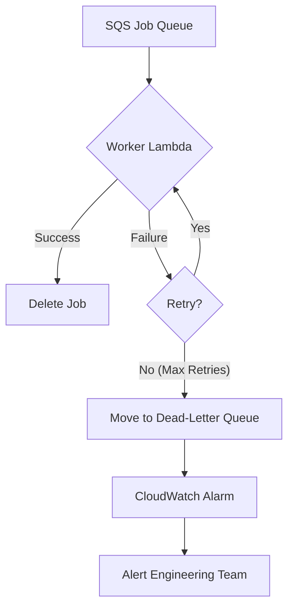

## Dependencies

### Core Dependencies
- `06-technical-architecture.md` - Technical Architecture, Security & Compliance
- `40-error-recovery.md` - Error Recovery & Troubleshooting

### Strategic / Indirect Dependencies
- `05-data-sync.md` - Data Synchronization & Reliability
- `14-qa-testing.md` - QA, Testing & Release Strategy
- `22-maintenance.md` - Maintenance & Post-Launch Operations (SRE)
- `24-user-support.md` - Help Center, Support & Feedback
- `41-metrics-dashboards.md` - Analytics Dashboard Design

---

# PRD Section 17: Error Handling, Logging & Monitoring

## 1. Executive Summary

This document specifies the comprehensive strategy for error handling, logging, and monitoring for the entire SyncWell ecosystem, including both the **mobile application and the AWS backend**. The goal is to build a highly resilient and observable system that can gracefully handle unexpected issues, provide clear feedback to the user, and give the engineering team powerful tools to diagnose and resolve problems quickly.

This enterprise-grade approach uses structured logging, centralized error handling, and targeted alerting to ensure high service quality.

## 2. Error Handling Architecture

### 2.1. Client-Side Error Handling
A centralized `ErrorHandler` service on the mobile client will be the single point through which all application-level errors flow. This ensures consistent handling of UI errors, validation errors, and network errors when communicating with our backend.

### 2.2. Backend Error Handling
The backend's error handling is centered around the **SQS Dead-Letter Queue (DLQ)**.

1.  **Error Occurs:** A worker Lambda fails to process a sync job (e.g., due to a third-party API being down or returning malformed data).
2.  **Automatic Retries:** SQS and Lambda have a built-in retry mechanism. The worker will attempt to process the job several times with exponential backoff.
3.  **Move to DLQ:** If the job fails all retry attempts, SQS automatically moves the job message to a pre-configured Dead-Letter Queue.
4.  **Alerting:** A CloudWatch Alarm is configured to monitor the DLQ. When the number of messages in the DLQ is greater than zero, an alert is sent to the engineering team.
5.  **Isolation:** This mechanism is critical because it isolates the failing job, allowing the rest of the queue to continue processing normally. The failed job can be inspected and analyzed without halting the entire system.

## 3. Unified Error Code Dictionary

A version-controlled dictionary will be the single source of truth for error definitions, shared between the backend and client. When the backend encounters a specific, known error (e.g., an expired token), it will update the sync status in DynamoDB with a specific error code. The client reads this code and uses the dictionary to display the correct localized message and recovery action to the user.

**Example Entry:**
```json
{
  "FITBIT_TOKEN_EXPIRED": {
    "logLevel": "WARN",
    "userMessageKey": "error_fitbit_token_expired",
    "userAction": "NAVIGATE_TO_REAUTH_FITBIT"
  },
  "GARMIN_API_UNAVAILABLE": {
    "logLevel": "ERROR",
    "userMessageKey": "error_service_unavailable_garmin",
    "userAction": "SHOW_SUPPORT_CONTACT"
  }
}
```

## 4. Structured Logging Strategy

### 4.1. Client-Side Logging
The mobile app will maintain a local, rotating log file with structured JSON entries for targeted debugging of device-specific issues.

### 4.2. Backend Logging
All backend Lambda functions will output structured JSON logs to **AWS CloudWatch Logs**. This is the primary source of information for debugging backend processes. The log schema will be consistent with the client-side schema.

**Example Log Entry (CloudWatch):**
```json
{
  "timestamp": "2023-10-27T14:30:00.123Z",
  "level": "ERROR",
  "message": "Sync job failed: Unhandled exception from provider.",
  "context": {
    "jobId": "xyz-123",
    "source": "garmin",
    "userId": "abc-456"
  },
  "error": {
    "name": "GarminApiError",
    "statusCode": 503,
    "message": "Service Unavailable"
  }
}
```
*   **PII Scrubbing:** No sensitive data like OAuth tokens will ever be logged. User IDs are logged to allow tracing a user's journey through the system.

## 5. Monitoring & Alerting

### 5.1. Client-Side (Firebase)
*   **Dashboard:** Focuses on crashes and UI performance (see `39-performance-metrics.md`).
*   **Alerts:**
    *   New crash detected.
    *   Crash-free user rate drops below 99.9%.

### 5.2. Backend-Side (AWS CloudWatch)
*   **Dashboard:** Focuses on API health, Lambda performance, and queue depth (see `39-performance-metrics.md`).
*   **Alerts (High Priority - PagerDuty/Slack):**
    *   **Messages in the Dead-Letter Queue.** This is our most critical alert.
    *   Significant spike in Lambda errors or 5xx errors on API Gateway.
    *   SQS queue depth growing for a sustained period.
    *   DynamoDB table is being throttled.

## 6. Visual Diagrams

### Backend Error Handling Flow (DLQ)

