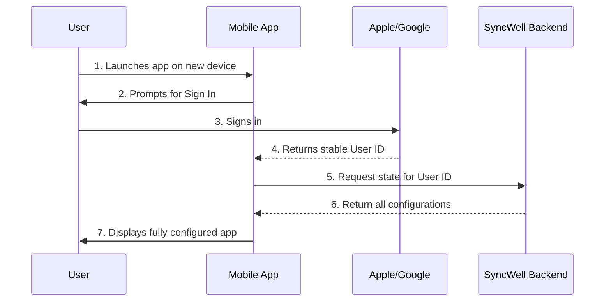

## Dependencies

### Core Dependencies
- `06-technical-architecture.md` - Technical Architecture, Security & Compliance
- `19-security-privacy.md` - Data Security & Privacy Policies

### Strategic / Indirect Dependencies
- `08-ux-onboarding.md` - UX, Onboarding & Support
- `22-maintenance.md` - Maintenance & Post-Launch Operations (SRE)
- `44-contingency-planning.md` - Contingency & Rollback Plans

---

# PRD Section 18: Backup & Disaster Recovery

## 1. Executive Summary

This document specifies the strategy for data recovery and service resilience for the SyncWell application. With the move to a backend-centric architecture, our focus shifts from on-device backups to ensuring the high availability and durability of our backend services. The primary objective is to provide a seamless user experience when switching devices or reinstalling the app, with zero data loss and no need for manual reconfiguration.

This strategy leverages user authentication ("Sign in with Apple/Google") and the robust, managed services of AWS to ensure user data is always available and that our service can recover from a major disaster.

## 2. The Recovery Model: Backend as the Source of Truth

The concept of "backing up" from the device is replaced by "recovering from the backend". The user's entire configuration is the "state" of their account on our backend.

*   **User Account:** Each user is identified by a stable, unique ID provided by "Sign in with Apple" or "Sign in with Google".
*   **Backend State:** All data associated with this user ID is stored securely on our backend:
    *   **Sync Configurations & App Settings:** Stored in DynamoDB.
    *   **OAuth Tokens:** Encrypted and stored in AWS Secrets Manager.

This means a user can install the app on any device, sign in, and their experience will be instantly restored to its last-known state.

## 3. The New Device / Re-install Experience

The recovery process is now an integral part of the onboarding flow for a returning user.

1.  **First Launch:** On first launch, the app presents the user with "Sign in with Apple" and "Sign in with Google" options.
2.  **Authentication:** The user signs in with the same method they used originally. This provides the app with a stable user ID.
3.  **State Recovery:** The app sends this user ID to the SyncWell backend. The backend returns the user's complete configuration (syncs, settings).
4.  **Instant Setup:** The app UI populates with all the user's sync configurations.
5.  **Seamless Syncing:** The user's OAuth tokens are already on the backend, so syncs can resume immediately without the user needing to re-authenticate with every third-party service. This is a critical improvement to the user experience.

### New Device Recovery Flow

## 4. Disaster Recovery Strategy (Backend)

We define a "disaster" as a complete failure of our primary AWS region or the irreversible loss of data in our primary database.

*   **Recovery Time Objective (RTO):** < 24 hours. The time it takes to restore service after a disaster.
*   **Recovery Point Objective (RPO):** < 5 minutes. The maximum amount of data loss, measured in time.

### Recovery Mechanisms:

*   **Infrastructure:** The entire backend infrastructure is defined as code using **Terraform**. In the event of a full regional failure, we can redeploy the entire stack to a different AWS region from our version-controlled Terraform code.
*   **Configuration Data (DynamoDB):**
    *   **Point-in-Time Recovery (PITR):** We will enable PITR on our DynamoDB tables. This allows us to restore the table to any point in time in the preceding 35 days, with per-second precision. This protects against accidental data deletion or corruption. Our RPO of 5 minutes is easily met.
    *   **Global Tables:** For a high-availability setup, we will use DynamoDB Global Tables, which provide a fully managed, multi-region, and multi-active database. This offers near-zero downtime for database-related issues.
*   **Credentials (AWS Secrets Manager):**
    *   Secrets Manager is a highly available, multi-AZ service by default.
    *   For disaster recovery, we can replicate secrets to another region. When we redeploy our infrastructure, the new Lambdas will point to the secrets in the new region.

## 5. Risk Analysis & Mitigation

| Risk ID | Risk Description | Probability | Impact | Mitigation Strategy |
| :--- | :--- | :--- | :--- | :--- |
| **R-50** | A bug in our code corrupts user configuration data in DynamoDB. | Low | High | Use DynamoDB Point-in-Time Recovery (PITR) to restore the database to a state before the corruption occurred. |
| **R-51** | A full AWS regional outage makes our backend unavailable. | Low | Critical | Our Terraform scripts allow us to redeploy the entire infrastructure to a new region. Using DynamoDB Global Tables further mitigates this by providing live replicas in other regions. |
| **R-52** | User loses access to their Apple/Google account. | Medium | Medium | This is largely outside of SyncWell's control. We must provide a clear path to contact support. We may need a support-driven process to re-associate a user's SyncWell data with a new Apple/Google account. |
| **R-53** | A logic error causes us to accidentally delete a user's tokens from Secrets Manager. | Low | High | Access to delete secrets will be controlled by highly restrictive IAM policies. Deletion actions will trigger high-priority alerts. |
