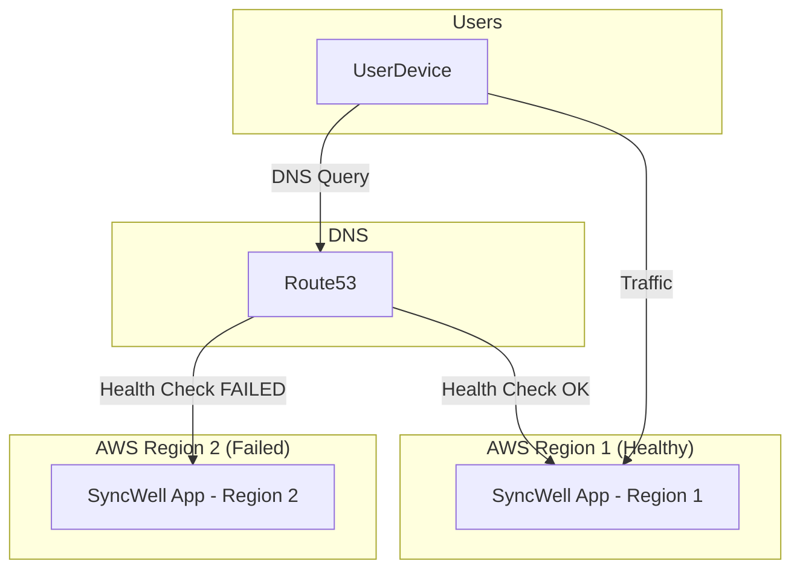

## Dependencies

### Core Dependencies
- `06-technical-architecture.md` - Technical Architecture, Security & Compliance
- `19-security-privacy.md` - Data Security & Privacy Policies
- `44-contingency-planning.md` - Contingency & Rollback Plans

### Strategic / Indirect Dependencies
- `22-maintenance.md` - Maintenance & Post-Launch Operations (SRE)

---

# PRD Section 18: Backup & Disaster Recovery

## 1. Executive Summary

This document specifies the strategy for data recovery and service resilience for the SyncWell application, architected to support 1 million DAU. Our strategy has evolved from simple backups to a comprehensive **Disaster Recovery (DR) and High Availability (HA)** plan centered on a **multi-region AWS deployment**. The primary objective is to ensure near-continuous availability and data durability, even in the event of a full regional outage, providing a seamless and reliable user experience.

## 2. The Recovery Model: A Highly Available Backend

The concept of a "backup" is superseded by a model of continuous replication and automated failover. The user's configuration and operational metadata are treated as critical assets, and the architecture is designed to protect them.

*   **User Account:** Each user is identified by a stable, unique ID from "Sign in with Apple/Google".
*   **Backend State:** All data associated with this user ID is stored in a highly available and durable backend:
    *   **Sync Configurations & App Settings:** Stored in a **DynamoDB Global Table**.
    *   **OAuth Tokens:** Encrypted and stored in **AWS Secrets Manager with cross-region replication**.

This means a user can install the app on any device, sign in, and their experience will be instantly restored. More importantly, the service itself is resilient to major infrastructure failures.

## 3. The New Device / Re-install Experience
*(Unchanged from previous version, as this flow remains the same)*

The recovery process is an integral part of the onboarding flow for a returning user.

1.  **First Launch:** On first launch, the app presents the user with "Sign in with Apple" and "Sign in with Google" options.
2.  **Authentication:** The user signs in with the same method they used originally.
3.  **State Recovery:** The app, directed by Route 53 to the nearest healthy region, sends the user's ID to the SyncWell backend. The backend retrieves the user's complete configuration from the local replica of the DynamoDB Global Table.
4.  **Instant Setup:** The app UI populates with all the user's sync configurations.
5.  **Seamless Syncing:** The user's OAuth tokens are available in the region, so syncs can resume immediately.

## 4. Disaster Recovery Strategy: Active-Active Multi-Region

As defined in `06-technical-architecture.md`, we will operate in an **active-active multi-region architecture** to achieve maximum availability and resilience. A "disaster" is now defined as an event that makes an entire AWS region unavailable.

This strategy yields different recovery objectives depending on the nature of the disaster.

| Failure Scenario | Recovery Time Objective (RTO) | Recovery Point Objective (RPO) | Mechanism |
| :--- | :--- | :--- | :--- |
| **Full Regional Outage** | **< 5 minutes** | **< 2 seconds** | **Automated Failover.** Amazon Route 53 health checks detect the failure and automatically redirect traffic to a healthy region. The RPO is governed by the replication lag of DynamoDB Global Tables. |
| **Cache Cluster Failure** | **< 5 minutes** | **N/A** | **Automatic Failover.** The ElastiCache for Redis cluster is deployed in a Multi-AZ configuration. Failover to a replica is automatic and transparent to the application, consistent with the RTO defined in `06-technical-architecture.md`. |
| **Data Corruption Event** (e.g., bad code deployment) | **< 4 hours** | **< 5 minutes** | **Manual Restore.** An engineer initiates a DynamoDB Point-in-Time Recovery (PITR) and uses AWS AppConfig to redirect traffic to the restored table. RPO is governed by the continuous backup window of PITR. See the detailed runbook below. |

### Recovery Mechanisms:

*   **Infrastructure as Code (IaC):** The entire backend infrastructure is defined in **Terraform**. This allows for consistent and repeatable deployments across multiple regions.
*   **Automated Traffic Failover (Amazon Route 53):**
    *   We will use Route 53 with latency-based routing and health checks.
    *   If the health checks for one region fail, Route 53 will automatically stop sending users to the unhealthy region and redirect all traffic to the healthy region(s). This failover is automatic and requires no manual intervention.

*   **Replicated Configuration Data (DynamoDB Global Tables):**
    *   Our core user metadata tables are configured as **DynamoDB Global Tables**.
    *   This provides a fully managed, multi-master database that automatically replicates data between AWS regions with typical latency of under one second.
    *   Both regions have a complete, live copy of the data, so if one region fails, the other can continue operating seamlessly.

*   **Replicated Credentials (AWS Secrets Manager):**
    *   The OAuth tokens stored in Secrets Manager are critical for our service.
    *   We will configure **cross-region replication** for our secrets. When a secret is updated in the primary region (e.g., a refreshed token), Secrets Manager automatically replicates that change to the replica secret in the secondary region.
    *   This ensures that if the primary region fails, the workers in the failover region have access to the up-to-date credentials needed to continue processing sync jobs.

*   **Stateless Compute (AWS Fargate):**
    *   The backend worker fleet is implemented as a set of stateless services running on **AWS Fargate**.
    *   These tasks do not store any persistent data locally. All state is externalized to DynamoDB and Secrets Manager.
    *   This stateless design is what enables a seamless, rapid failover. In a regional outage, traffic is simply redirected to the Fargate fleet in a healthy region, which can immediately resume processing using the replicated data stores. No instance-level recovery is required.

*   **Distributed Locking (DynamoDB Conditional Writes):**
    *   To prevent race conditions (e.g., two workers processing the same sync job concurrently), a distributed locking mechanism is required.
    *   **Anti-Pattern Avoidance:** Using a replicated cache (like ElastiCache Global Datastore) for distributed locking in an active-active, multi-region setup is a known anti-pattern. The inherent replication lag can break the mutual exclusion guarantee of a lock, leading to data corruption.
    *   **Correct Implementation:** We will use **DynamoDB's conditional write** functionality to implement a robust, consistent distributed lock. A worker will attempt to acquire a lock by creating a specific lock item in the `SyncWellMetadata` table with a condition that fails if the item already exists. This leverages DynamoDB's strong consistency for a single-region write, providing a reliable locking mechanism. The lock item will have a short TTL to prevent deadlocks.
*   **Replicated Cache Data (Amazon ElastiCache):**
    *   The ElastiCache for Redis cluster is a critical component for **caching and rate-limiting**. A regional failure would lead to a "cache stampede" that could overwhelm the database.
    *   To mitigate this, each regional ElastiCache cluster will operate independently. In the event of a regional failover, the cache in the newly active region will be cold. This is an acceptable trade-off, as the system will gracefully handle the initial cache misses, and the cache will warm up quickly, preventing a prolonged service degradation.

### Disaster Recovery Flow (Regional Outage)

## 5. Risk Analysis & Mitigation

| Risk ID | Risk Description | Probability | Impact | Mitigation Strategy |
| :--- | :--- | :--- | :--- | :--- |
| **R-50** | A bug in our code corrupts user configuration data in DynamoDB. | Low | High | Use DynamoDB Point-in-Time Recovery (PITR) to restore the table to a state before the corruption occurred. This is a manual recovery process, separate from the automated HA failover. |
| **R-51** | A full AWS regional outage makes one of our backend deployments unavailable. | Low | Critical | **Mitigated by Design.** The active-active multi-region architecture with Route 53 failover, DynamoDB Global Tables, and replicated secrets ensures the service remains available. |
| **R-52** | User loses access to their Apple/Google account. | Medium | Medium | Provide a clear path to contact support for a defined manual account recovery process. See Section 6. |
| **R-53** | Cross-region replication lag for DynamoDB or Secrets Manager exceeds the RPO. | Low | Medium | Monitor replication lag metrics in CloudWatch. Configure alarms to notify the on-call team of unusual delays. |

## 6. Detailed Recovery Runbooks

### Runbook: Data Corruption Recovery (PITR)
This is a last-resort, high-risk manual procedure to be followed in the event of widespread data corruption.

1.  **Declare Incident & Halt Writes:** A major incident is declared. If possible, writes to the DynamoDB table are temporarily disabled to prevent further corruption.
2.  **Identify Restore Point:** This is the most critical and difficult step. Engineers must use logs and metrics to identify the precise moment *before* the corruption began. This determines the restore timestamp. All data written between this point and the incident declaration will be lost. This data loss must be acknowledged and accepted before proceeding.
3.  **Initiate PITR:** An authorized engineer initiates a Point-in-Time Recovery of the `SyncWellMetadata` DynamoDB table from the AWS console, using the identified restore timestamp. This creates a new table (e.g., `SyncWellMetadata-restored-YYYY-MM-DD`).
4.  **Validate Restored Data:** The engineer must run validation scripts against the new table to ensure the data is consistent and the corruption is gone.
5.  **Update AppConfig & Redirect Traffic:** The application code does not contain a hardcoded table name. Instead, it fetches the table name from **AWS AppConfig**. To redirect all application traffic to the newly restored table, the engineer updates the `tableName` configuration value in AppConfig and deploys the configuration change. This is a fast and safe way to repoint the entire application without a code deployment.
6.  **Post-Mortem:** A full post-mortem analysis is conducted to understand the root cause and prevent recurrence.

### Runbook: Manual Account Recovery

**CRITICAL RISK ADVISORY:** The process of manually migrating user data from one identity to another is exceptionally high-risk and is a prime vector for catastrophic human error, social engineering attacks, and permanent data loss. A manually executed, script-based process for this operation is **unacceptable** for a production system at scale.

*   **MVP Stance:** For the MVP, this feature **is considered unsupported**. If a user permanently loses access to their sign-in provider (e.g., their Google account), they will lose access to their SyncWell data. This is a deliberate product decision to avoid the immense security and operational risks of a manual process.

*   **Future Implementation Requirements:** If this feature is prioritized in the future, it **must not** be implemented as a manual script run by an engineer. It must be built as a dedicated, secure, and audited internal tool with multiple safety checks and a robust approval workflow.

*   **Required Safety Features for a Future Tool:**
    1.  **MFA-Gated Execution:** The tool must require the executing engineer to re-authenticate with MFA.
    2.  **Two-Person Rule:** The operation must require approval from a second authorized engineer, who also authenticates with MFA (a "two-person rule").
    3.  **Soft Deletes:** The old data must not be immediately deleted. It should be "soft-deleted" (e.g., flagged for deletion with a 30-day TTL) to allow for a rollback in case of error.
    4.  **Comprehensive Auditing:** Every step of the process must be logged to an immutable audit trail.

A simple peer review of a script is insufficient for an operation of this magnitude. The process described in the previous version of this document is a recipe for disaster and **must not be implemented**.
