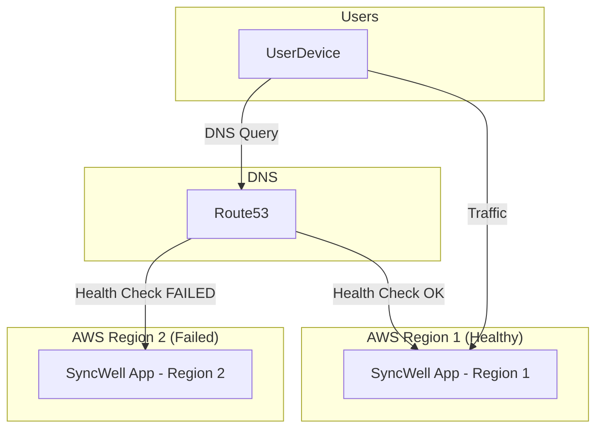

## Dependencies

### Core Dependencies
- `06-technical-architecture.md` - Technical Architecture, Security & Compliance
- `19-security-privacy.md` - Data Security & Privacy Policies
- `44-contingency-planning.md` - Contingency & Rollback Plans

### Strategic / Indirect Dependencies
- `22-maintenance.md` - Maintenance & Post-Launch Operations (SRE)

---

# PRD Section 18: Backup & Disaster Recovery

## 1. Executive Summary

This document specifies the strategy for data recovery and service resilience for the SyncWell application, architected to support 1 million DAU. Our strategy has evolved from simple backups to a comprehensive **Disaster Recovery (DR) and High Availability (HA)** plan centered on a **multi-region AWS deployment**. The primary objective is to ensure near-continuous availability and data durability, even in the event of a full regional outage, providing a seamless and reliable user experience.

## 2. The Recovery Model: A Highly Available Backend

The concept of a "backup" is superseded by a model of continuous replication and automated failover. The user's configuration and operational metadata are treated as critical assets, and the architecture is designed to protect them.

*   **User Account:** Each user is identified by a stable, unique ID from "Sign in with Apple/Google".
*   **Backend State:** All data associated with this user ID is stored in a highly available and durable backend:
    *   **Sync Configurations & App Settings:** Stored in a **DynamoDB Global Table**.
    *   **OAuth Tokens:** Encrypted and stored in **AWS Secrets Manager with cross-region replication**.

This means a user can install the app on any device, sign in, and their experience will be instantly restored. More importantly, the service itself is resilient to major infrastructure failures.

## 3. The New Device / Re-install Experience
*(Unchanged from previous version, as this flow remains the same)*

The recovery process is an integral part of the onboarding flow for a returning user.

1.  **First Launch:** On first launch, the app presents the user with "Sign in with Apple" and "Sign in with Google" options.
2.  **Authentication:** The user signs in with the same method they used originally.
3.  **State Recovery:** The app, directed by Route 53 to the nearest healthy region, sends the user's ID to the SyncWell backend. The backend retrieves the user's complete configuration from the local replica of the DynamoDB Global Table.
4.  **Instant Setup:** The app UI populates with all the user's sync configurations.
5.  **Seamless Syncing:** The user's OAuth tokens are available in the region, so syncs can resume immediately.

## 4. Disaster Recovery Strategy: Active-Active Multi-Region

As defined in `06-technical-architecture.md`, we will operate in an **active-active multi-region architecture** to achieve maximum availability and resilience. A "disaster" is now defined as an event that makes an entire AWS region unavailable.

*   **Recovery Time Objective (RTO):** < 5 minutes. This is the time it takes for Route 53 to detect an unhealthy region and stop routing traffic to it.
*   **Recovery Point Objective (RPO):** < 2 seconds. This is the typical replication lag for DynamoDB Global Tables, representing the maximum potential data loss.

### Recovery Mechanisms:

*   **Infrastructure as Code (IaC):** The entire backend infrastructure is defined in **Terraform**. This allows for consistent and repeatable deployments across multiple regions.
*   **Automated Traffic Failover (Amazon Route 53):**
    *   We will use Route 53 with latency-based routing and health checks.
    *   If the health checks for one region fail, Route 53 will automatically stop sending users to the unhealthy region and redirect all traffic to the healthy region(s). This failover is automatic and requires no manual intervention.

*   **Replicated Configuration Data (DynamoDB Global Tables):**
    *   Our core user metadata tables are configured as **DynamoDB Global Tables**.
    *   This provides a fully managed, multi-master database that automatically replicates data between AWS regions with typical latency of under one second.
    *   Both regions have a complete, live copy of the data, so if one region fails, the other can continue operating seamlessly.

*   **Replicated Credentials (AWS Secrets Manager):**
    *   The OAuth tokens stored in Secrets Manager are critical for our service.
    *   We will configure **cross-region replication** for our secrets. When a secret is updated in the primary region (e.g., a refreshed token), Secrets Manager automatically replicates that change to the replica secret in the secondary region.
    *   This ensures that if the primary region fails, the workers in the failover region have access to the up-to-date credentials needed to continue processing sync jobs.

*   **Replicated Cache Data (Amazon ElastiCache Global Datastore):**
    *   The ElastiCache for Redis cluster is a critical component for caching, rate-limiting, and distributed locking. A regional failure would lead to a "cache stampede" that could overwhelm the database.
    *   To mitigate this, the cache will be deployed as an **ElastiCache Global Datastore**. This provides fully-managed, fast, cross-region replication from a primary region to secondary regions.
    *   In the event of a regional failure, we can promote a secondary region to be the new primary, ensuring that the failover region has a warm, up-to-date replica of the cache. This prevents data loss and ensures the continued stability of the service.

### Disaster Recovery Flow (Regional Outage)

## 5. Risk Analysis & Mitigation

| Risk ID | Risk Description | Probability | Impact | Mitigation Strategy |
| :--- | :--- | :--- | :--- | :--- |
| **R-50** | A bug in our code corrupts user configuration data in DynamoDB. | Low | High | Use DynamoDB Point-in-Time Recovery (PITR) to restore the table to a state before the corruption occurred. This is a manual recovery process, separate from the automated HA failover. |
| **R-51** | A full AWS regional outage makes one of our backend deployments unavailable. | Low | Critical | **Mitigated by Design.** The active-active multi-region architecture with Route 53 failover, DynamoDB Global Tables, and replicated secrets ensures the service remains available. |
| **R-52** | User loses access to their Apple/Google account. | Medium | Medium | Provide a clear path to contact support for a potential manual account recovery process. |
| **R-53** | Cross-region replication lag for DynamoDB or Secrets Manager exceeds the RPO. | Low | Medium | Monitor replication lag metrics in CloudWatch. Configure alarms to notify the on-call team of unusual delays. |
