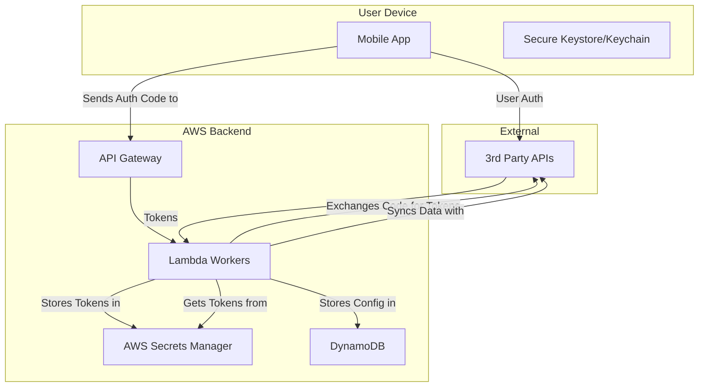

## Dependencies

### Core Dependencies
- `01-context-vision.md` - Context & Vision
- `06-technical-architecture.md` - Technical Architecture, Security & Compliance
- `20-compliance-regulatory.md` - Legal & Regulatory Compliance

### Strategic / Indirect Dependencies
- `07-apis-integration.md` - APIs & Integration Requirements
- `17-error-handling.md` - Error Handling, Logging & Monitoring
- `18-backup-recovery.md` - Backup & Disaster Recovery
- `36-user-privacy-settings.md` - User Privacy Controls & Settings

---

# PRD Section 19: Data Security & Privacy Policies

## 1. Executive Summary

This document specifies the comprehensive data security and privacy architecture for the SyncWell application. In the health data space, trust is the foundation of the product. This document codifies our commitment to protecting user data through a "privacy-first" design philosophy and a robust, multi-layered security strategy.

This internal specification is a blueprint for the **engineering team** to implement state-of-the-art security measures. It is the technical foundation for the public-facing Privacy Policy.

## 2. Guiding Principles

*   **Data Minimization:** We only request and handle data that is absolutely essential.
*   **Privacy by Design:** The system is architected from the ground up to protect user data.
*   **Ephemeral Backend Processing:** This is our core privacy promise. SyncWell's backend services **never persist user health data**. Health data is only ever held in-memory on our backend servers during an active sync job and is immediately discarded.
*   **Radical Transparency:** We are open and honest with users about what data we handle and why.

## 3. Threat Modeling & Countermeasures

| Threat Scenario | Description | Countermeasure(s) |
| :--- | :--- | :--- |
| **Backend Server Compromise** | An attacker gains access to the backend infrastructure. | - **Strict IAM Roles & Least Privilege:** Lambda functions can only access the specific resources they need.  - **AWS Secrets Manager:** User OAuth tokens are stored encrypted in a dedicated, secure service.  - **VPC & Security Groups:** Backend services are isolated from the public internet where possible.  - **Regular Audits & Pen Testing:** Proactively identify and fix vulnerabilities. |
| **Compromised Device** | A malicious actor gains root/jailbreak access to the user's device. | - **Keychain/Keystore:** Used for any on-device secrets.  - **Jailbreak/Root Detection:** The app will detect if it is running on a compromised device. |
| **Man-in-the-Middle (MitM) Attack** | An attacker intercepts traffic between the app and the backend. | - **TLS 1.2+:** All network traffic is encrypted.  - **Certificate Pinning:** Implemented for calls to our own backend to ensure the app is talking to our legitimate server. |
| **Insecure Data Storage** | Sensitive data is stored insecurely. | - **Backend:** All user tokens are stored encrypted in AWS Secrets Manager.  - **On-Device:** The local settings database is encrypted. |
| **Vulnerable Third-Party Dependency** | A library used by the app or backend has a known security vulnerability. | - **Automated Dependency Scanning:** The CI/CD pipeline will use Snyk to scan for vulnerabilities. |

## 4. Data Flow & Classification

*   **Class 1: Health Data (In-Memory, Ephemeral):** The user's actual health data (steps, etc.).
    *   **Flow:** Read from a source API -> Processed in-memory on a backend worker OR on-device -> Written to a destination API.
    *   **Storage:** **NEVER** stored at rest on SyncWell servers. It is discarded from memory immediately after the job completes.
*   **Class 2: Sensitive Credentials (OAuth Tokens):**
    *   **Flow:** Acquired via a secure hybrid flow, where the mobile app gets an auth code and the backend exchanges it for tokens.
    *   **Storage:** Stored encrypted at rest in **AWS Secrets Manager**, tightly controlled by IAM policies.
*   **Class 3: Configuration & Metadata:** User sync settings and job metadata.
    *   **Flow:** Settings are created by the user and sent to the backend.
    *   **Storage:** Stored in DynamoDB. Does not contain any raw health data.

### Data Security Flow Diagram

## 5. Credential Lifecycle Management

The lifecycle of user credentials is managed by the backend to maximize security.

*   **Creation:** Tokens are acquired via the secure hybrid OAuth 2.0 flow detailed in `07-apis-integration.md`.
*   **Storage:** Tokens are stored encrypted in **AWS Secrets Manager**.
*   **Usage:** Worker Lambdas are granted temporary, role-based access to retrieve the tokens they need for a specific job.
*   **Deletion:** When a user de-authorizes an app via the mobile client:
    1.  The mobile app sends a "revoke" request to the SyncWell backend.
    2.  The backend retrieves the token from Secrets Manager.
    3.  The backend calls the service provider's `revoke` endpoint to invalidate the token.
    4.  The backend permanently deletes the token from Secrets Manager.

## 6. Backend and API Security

The backend is a core component and must be secured accordingly.

*   **Authentication:** Communication between the mobile app and our backend API Gateway will be authenticated using short-lived JSON Web Tokens (JWTs) or a similar standard.
*   **Authorization:** API Gateway and Lambda functions will use strict IAM roles, adhering to the principle of least privilege. A worker for Fitbit should not have access to Garmin tokens.
*   **Network Security:** Services will be placed in a Virtual Private Cloud (VPC). Access to databases and secret stores will be restricted to services within the VPC, not exposed to the public internet.
*   **Logging & Monitoring:** All API calls and backend activity will be logged (without sensitive data) and monitored for anomalous behavior using services like AWS CloudTrail and CloudWatch.

## 7. Pre-Launch Security Audit Checklist

### Data Storage & Cryptography
*   [ ] User OAuth tokens are stored encrypted in AWS Secrets Manager.
*   [ ] The on-device database is encrypted.
*   [ ] No sensitive data (tokens, health data) is written to application or backend logs.

### Network Communication
*   [ ] All network traffic uses TLS 1.2+.
*   [ ] Certificate pinning is implemented for mobile-to-backend communication.
*   [ ] Backend services are properly isolated in a VPC.

### Authentication & Authorization
*   [ ] Mobile-to-backend communication is authenticated (e.g., via JWTs).
*   [ ] IAM roles follow the principle of least privilege.
*   [ ] The de-authorization process is robust and deletes tokens from the backend.

### Code Quality & Build Settings
*   [ ] The app is obfuscated in production builds.
*   [ ] All third-party dependencies (mobile and backend) have been scanned for known vulnerabilities.
