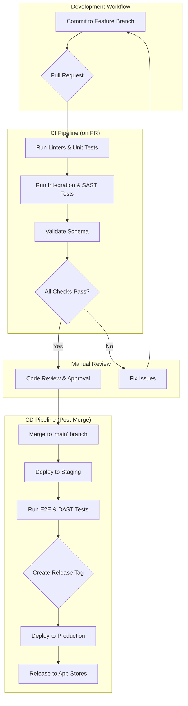

## Dependencies

### Core Dependencies
- `13-roadmap.md` - Roadmap, Milestones & Timeline
- `14-qa-testing.md` - QA & Testing Strategy
- `22-maintenance.md` - Maintenance & Post-Launch Operations (SRE)

### Strategic / Indirect Dependencies
- `43-changelog.md` - Changelog & Release Notes
- `44-contingency-planning.md` - Contingency & Rollback Plans
- `42-customer-feedback.md` - Customer Feedback Loop

---

# PRD Section 25: Release Management & Versioning

## 1. Executive Summary

This document specifies the comprehensive release management strategy for SyncWell. The goal is to establish a highly reliable, predictable, and automated process for deploying updates. This disciplined approach is essential for maintaining application stability, building user trust, and enabling the solo developer to release new features and fixes with confidence and low stress.

This strategy incorporates professional software engineering practices, including Semantic Versioning, a GitFlow branching model, a "Release Train" schedule, and a heavily automated CI/CD pipeline.

## 2. Versioning & Branching

*   **Versioning:** SyncWell will strictly adhere to **Semantic Versioning (SemVer 2.0.0)**: `MAJOR.MINOR.PATCH`.
*   **Branching Strategy:** A **GitFlow** model will be used.
    *   `main`: Represents production. Only release and hotfix branches are merged here.
    *   `develop`: The primary development branch for ongoing work.
    *   `feature/...`: Branched from `develop` for new features.
    *   `release/x.y.z`: Branched from `develop`. This is a "release candidate" branch. Only bug fixes are committed here.
    *   `hotfix/...`: Branched from `main` to address critical production bugs.

## 3. The "Release Train" Schedule

To ensure predictability, SyncWell will operate on a "Release Train" schedule.
*   **Schedule:** A new minor version release train is scheduled to **depart (i.e., a `release` branch is created) on the first Monday of every month.**
*   **Cadence:** This results in a predictable feature release approximately every **4-5 weeks**, accounting for a 1-week "hardening" and rollout period.
*   **Flexibility:** If a major feature is not ready, it does not delay the train. It simply "misses the train" and waits for the next one. This prevents release deadlines from slipping.
*   **Hotfixes:** Critical patch releases are "special services" and can be deployed at any time, outside of the train schedule.

## 4. CI/CD Automation Pipeline

The release process is heavily automated using GitHub Actions. The pipeline is designed to provide rapid feedback to developers and ensure only high-quality, well-tested code is deployed. The full developer experience, including testing strategies, is detailed in `06-technical-architecture.md`.

*   **Quality Gates:** The pipeline enforces several automated quality gates:
    *   **On every pull request:** Run linters, static analysis, unit tests, integration tests, SAST scans, and data model schema validation.
    *   **On merge to `main`:** Automatically deploy the backend services to the staging environment, then trigger E2E and DAST tests.

*   **Production Release Trigger:** A release to production is initiated by creating and pushing a version tag (e.g., `v1.2.0`). This single action triggers the automated deployment of backend services and the mobile app release process.

## 4a. Backend Deployment Strategy (Canary Releases)

To minimize the risk of production incidents, all backend services are deployed to production using a **canary release strategy**, as defined in `06-technical-architecture.md`.

*   **Process:** When a new version is deployed (triggered by a release tag), a small percentage of production traffic (e.g., 5%) is routed to the new version (the "canary").
*   **Monitoring:** The canary is closely monitored for any increase in error rates or latency.
*   **Rollout/Rollback:** If the canary is stable, traffic is gradually shifted until it serves 100% of requests. If issues are detected, traffic is immediately routed back to the stable version.

## 5. The Release Process & Checklist

### 5.1. Minor Release (The Monthly Train)
1.  [ ] **Feature Freeze & Branching:** On the first Monday of the month, create the `release/x.y.z` branch from `develop`.
2.  [ ] **RC Build & Beta Testing:** The CI/CD pipeline automatically deploys Release Candidate builds to public beta testers.
3.  [ ] **Hardening (1 week):** For one week, only critical bug fixes discovered by beta testers are committed to the `release` branch.
4.  [ ] **Merge & Tag for Release:** Once the release candidate is deemed stable, merge the `release/x.y.z` branch into `main`. Then, create and push the final version tag (e.g., `v1.2.0`). This tag is the single trigger for the production release pipeline.
5.  [ ] **Monitor Canary Deployment:** The CI/CD pipeline will automatically begin the canary release of the backend services. Monitor the health of the canary version via Grafana dashboards.
6.  [ ] **Mobile App Staged Rollout:** Once the backend deployment is stable at 100%, begin the staged rollout of the mobile app (1% -> 10% -> 50% -> 100%) in the app store consoles, monitoring analytics at each stage.
7.  [ ] **Merge Back & Communicate:** Merge `main` back into `develop`. Once the rollout is at 100%, announce the release.

### 5.2. Hotfix Release (Emergency)
1.  [ ] **Create Hotfix Branch:** Create a `hotfix/fix-critical-bug` branch directly from `main`.
2.  [ ] **Implement & Test:** Implement the minimal required fix. Write a regression test.
3.  [ ] **Merge & Tag:** Merge the hotfix branch into `main` and tag it (e.g., `v1.2.1`). Then merge `main` back into `develop`.
4.  [ ] **Deploy & Monitor:** Trigger the production deployment job. Because this is a critical fix, the staged rollout may be accelerated or skipped. Monitor the fix closely.

## 6. Release Communication Plan

| Channel | Content | Timing |
| :--- | :--- | :--- |
| **App Store Release Notes** | Detailed, user-friendly summary of new features and major bug fixes. | Submitted with the release build. |
| **In-App "What's New" Screen** | Highlights the top 1-3 new features, especially community-requested ones. | Appears on first launch after update. |
| **Social Media / Blog** | A more detailed post celebrating the new release and thanking beta testers. | After the release is at 100% rollout. |

## 7. Feature Flagging & Remote Configuration

In addition to the main app version release schedule, a **Remote Configuration** service (e.g., Firebase Remote Config) will be used to manage features and behavior at a more granular level. This allows for de-risking releases and testing new functionality without requiring a full app update.

This approach is referenced in several user stories:
*   **A/B Testing UI/UX:** The copy and imagery in the onboarding carousel (**US-01**) and the messaging in contextual upsells (**US-17**) will be managed via remote config to allow for A/B testing to optimize conversion funnels.
*   **Staged Feature Rollouts:** New, complex functionality can be rolled out progressively. For example, a new data type for sync (**US-04**) could be enabled for 1%, then 10%, then 100% of users, with performance monitored at each stage.
*   **Risk Mitigation for Major Integrations:** For new, high-risk third-party integrations (e.g., **US-25**, **US-27**), the integration can be enabled via Remote Config for a small cohort of beta testers or early adopters first. This allows for real-world testing of the API integration before a general release, minimizing the blast radius of any potential issues.
*   **Dynamic Configuration:** The list of supported apps for connection (**US-02**) will be managed remotely. This allows us to add a new app to the list or temporarily disable a misbehaving integration without forcing users to update the app.
*   **Kill Switches:** If a feature is discovered to have a critical bug in production, a "kill switch" in Remote Config can be used to disable it immediately for all users while a hotfix is prepared.

## 8. Optional Visuals / Diagram Placeholders
*   **[Diagram] GitFlow Branching Strategy:** A clear, visual diagram of the GitFlow model.
*   **[Diagram] CI/CD Pipeline:** A detailed flowchart showing the stages and triggers for the different CI/CD jobs.
*   **[Diagram] Release Train Schedule:** A visual calendar showing the "departure" dates for the next three release trains.
*   **[Checklist] Go/No-Go Release Checklist:** A detailed checklist for the final decision to start the staged rollout.
