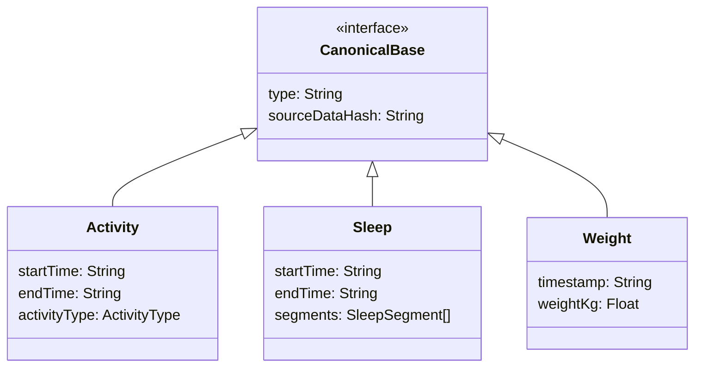

## Dependencies

### Core Dependencies
- `05-data-sync.md` - Data Sync & Conflict Resolution
- `06-technical-architecture.md` - Technical Architecture, Security & Compliance
- `07-apis-integration.md` - APIs & Integration Requirements
- `14-qa-testing.md` - QA & Testing Strategy

### Strategic / Indirect Dependencies
- `31-historical-data.md` - Historical Data Sync
- `32-platform-limitations.md` - Platform-Specific Limitations
- `33-third-party-integration.md` - Third-Party Integration Strategy

---

# PRD Section 30: Source-Destination Sync Mapping

## 1. Executive Summary

This document provides the definitive technical specification for SyncWell's data mapping and transformation engine. This engine is the core of SyncWell's intellectual property, responsible for accurately translating health data between disparate formats. The system is built around a **versioned, canonical data model** that serves as a universal intermediary.

This specification is a critical blueprint for the **engineering team**. It details the canonical models and provides rules for handling data mapping. This engine runs in two places depending on the sync type: on the **backend workers** for cloud-to-cloud syncs, and on the **mobile client** for device-native syncs (e.g., HealthKit).

## 2. The Canonical Data Schema (v1)

All data moving through the SyncWell engine is converted to and from this standardized schema. All timestamps are in ISO 8601 format and are normalized to UTC. The schema will be implemented as a set of `serializable` data classes in the **Kotlin Multiplatform (KMP) shared module**, allowing the exact same models to be used on the client and the backend.

```kotlin
// Example of the Kotlin implementation in the KMP module
@Serializable
data class Activity(
    val type: String = "ACTIVITY",
    val sourceDataHash: String,
    val startTime: String,
    val endTime: String,
    // ... and so on
)
```

## 3. The Data Mapping Cookbook

Each `DataProvider` implementation contains the business logic for transformation.

### Example 1: Normalizing Activity Enums
A provider must map the source platform's activity types to the canonical `ActivityType` enum.
```kotlin
// Pseudo-code within a GarminProvider (in Kotlin)
private fun mapGarminActivity(garminType: String): CanonicalActivityType {
    return when (garminType.lowercase()) {
        "running", "street_running" -> CanonicalActivityType.RUNNING
        "cycling" -> CanonicalActivityType.CYCLING
        "lap_swimming" -> CanonicalActivityType.SWIMMING
        else -> CanonicalActivityType.OTHER
    }
}
```

### Example 2: Timezone Normalization
All providers **must** convert source data timestamps to UTC before creating the canonical model. The canonical model is always in UTC.

## 4. Mapper Unit Testing

*   **Requirement:** Every data mapping function in every provider **must** have a corresponding suite of unit tests.
*   **Fixtures:** Tests will use static `.json` files representing real-world, anonymized API responses.
*   **CI/CD Integration:** This test suite will be a required check in the **backend's CI/CD pipeline** in GitHub Actions. No code change that breaks a data mapping test will be deployed.
*   **Benefit:** This creates a powerful regression suite. If a provider's API changes its response format, these unit tests will fail immediately, pinpointing the problem.

## 5. Schema Versioning & Migration

The canonical schema itself is versioned to ensure long-term maintainability.
*   **Backend Robustness:** The backend workers must always inspect the `schema_version` of any data sent from a mobile client. If the version is old, the data may be rejected or passed through a migration function to prevent the backend from crashing.
*   **Client Migration:** When a new version of the app restores settings from an old backup, it must check the `schema_version` and run a migration function to update the data structure before applying it.

## 6. Visual Diagrams

### Canonical Schema (High Level)


### Mapping and Testing Flow
```mermaid
graph TD
    A[Raw JSON from 3rd Party API] --> B[Mapping Function (e.g., mapFromFitbit)];
    B --> C[Canonical Model Instance];
    C --> D[Unit Test Assertions];
    E[Test Fixture (Stored JSON)] --> B;
    D -- Pass/Fail --> F[CI/CD Gate];
```
