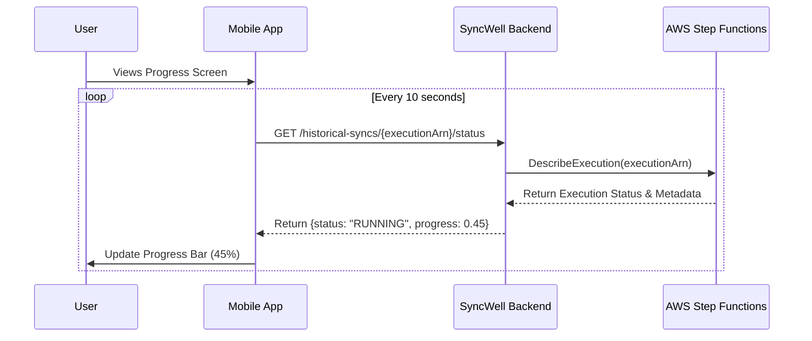

## Dependencies

### Core Dependencies
- `05-data-sync.md` - Data Synchronization & Reliability
- `06-technical-architecture.md` - Technical Architecture
- `12-trial-subscription.md` - Trial, Subscription & Paywall

### Strategic / Indirect Dependencies
- `09-ux-configuration.md` - UX, Configuration & Settings
- `16-performance-optimization.md` - Performance & Scalability
- `17-error-handling.md` - Error Handling, Logging & Monitoring

---

# PRD Section 31: Historical Data Handling

## 1. Executive Summary

This document provides the detailed technical specification for the **Historical Data Sync** feature, a core premium offering. This feature allows paying users to backfill their health data, providing a powerful incentive to upgrade.

A naive implementation of this feature (a single, long-running job) is brittle and prone to failure. To ensure maximum reliability and a transparent user experience, we will use **AWS Step Functions** to orchestrate the complex workflow, as defined in the core technical architecture.

## 2. Historical Sync Architecture: AWS Step Functions

The historical sync feature is orchestrated using a dedicated **AWS Step Functions state machine**. This managed service is purpose-built for coordinating multi-step, long-running, and potentially error-prone workflows, making it the ideal choice for this feature.

When a user requests a historical sync, the mobile app calls an API endpoint that triggers a new execution of this state machine. The state machine, not a custom application-level orchestrator, is responsible for managing the entire lifecycle of the sync.

## 3. Benefits of the AWS Step Functions Strategy

Using a managed orchestrator like AWS Step Functions provides significant advantages over a custom-built solution:

*   **Reliability & State Management:** Step Functions persists the state of every execution, meaning workflows are durable and can be resumed automatically. The service guarantees at-least-once execution of each step.
*   **Built-in Error Handling:** The state machine has robust, declarative error handling and retry logic. We can configure it to automatically retry failed API calls with exponential backoff, or route specific errors to custom cleanup logic, all without complex application code.
*   **Observability:** Every Step Functions execution is fully auditable and visualized in the AWS console. This provides immediate, detailed insight into where a workflow failed, why it failed, and what the inputs/outputs were for each step, dramatically reducing debugging time.
*   **Parallelism:** The state machine will use a `Map` state to process data chunks (e.g., one month of data) in parallel. This allows for massive scaling of `Cold-Path Worker Lambdas` to complete a multi-year sync much faster than a sequential process.

## 4. State Machine Execution Flow

The high-level logic of the state machine is defined in `06-technical-architecture.md`. The flow is as follows:

1.  **Initiate Sync & Calculate Chunks:** The workflow is triggered with the user's request details. The first state is a Lambda function that implements a **dynamic chunking strategy** to break the total date range into an array of smaller, logical jobs. The goal is to create chunks that are small enough to be processed reliably within a single Lambda execution, while being large enough to be efficient.

    *   **Primary Strategy (Volume-Based):** Where possible, the function will first make a lightweight API call to the source provider to get a *count* of records for the total date range. It will then divide the total number of records by a target chunk size (e.g., 500 records per chunk) to determine the number and date ranges of the chunks. This is the most reliable strategy.
    *   **Fallback Strategy (Time-Based):** If a source provider's API does not support an efficient way to get a total record count, the system will fall back to a time-based chunking strategy. It will break the sync into one-month intervals.
    *   **Large Chunk Splitting:** For either strategy, if a single chunk is still too large and fails due to a timeout, the error handling logic will catch this specific error, split the failed chunk into smaller pieces (e.g., a one-month chunk that failed will be split into four one-week chunks), and re-queue them for processing. This provides an extra layer of resilience.
2.  **Execute in Parallel (`Map` State):** The state machine's `Map` state iterates over the array of chunks. For each chunk, it invokes a `Cold-Path Worker Lambda`, passing the chunk's date range as input. This allows for dozens or hundreds of chunks to be processed in parallel, up to a configurable concurrency limit.
3.  **Process a Single Chunk:** The `Cold-Path Worker Lambda` is responsible for fetching data for its assigned chunk, performing the transformation, and writing it to the destination.
4.  **Handle Errors (Graceful Partial Failure):** The state machine is configured to handle failures gracefully, ensuring that one failed chunk does not halt the entire sync.
    *   **Transient Errors:** If a worker Lambda fails with a transient error (e.g., a temporary network issue), the state machine's built-in retry policy will automatically re-invoke it with exponential backoff.
    *   **Permanent Errors:** If a chunk fails all of its retry attempts (a permanent failure), the `Map` state's `Catch` configuration will route the error to a logging step. Crucially, this **does not stop the `Map` state**. The overall workflow will continue processing all other chunks.
    *   **Final Reporting:** The results of the `Map` state will be an array containing the status of each individual chunk. The final "Finalize & Notify" step will inspect this array. If any chunks have failed, the overall job will be marked as `COMPLETED_WITH_ERRORS`. The push notification sent to the user will inform them that the sync is complete but that some data could not be imported. The app will then display the specific date ranges of the failed chunks, with an option for the user to retry them individually.
5.  **Finalize & Notify:** Once all chunks in the `Map` state have completed, a final Lambda function is invoked to inspect the results, mark the overall job status appropriately (`COMPLETED` or `COMPLETED_WITH_ERRORS`), and send a push notification to the user.

## 5. Visual Diagrams

### Historical Sync State Machine
```mermaid
graph TD
    A[Start] --> B{Initiate Sync &<br>Calculate Chunks};
    B --> C{Process Chunks in Parallel<br>(Map State)};
    C -- For Each Chunk --> D[Process One Chunk<br>(Lambda)];
    D -- Success --> E{Did All Chunks Succeed?};
    C -- All Chunks Complete --> E;
    E -- Yes --> F[Finalize Sync<br>(Lambda)];
    F --> G[End];
    D -- Failure --> H{Retry?};
    H -- Yes --> D;
    H -- No --> I[Log Error &<br>Continue/Fail];
    I --> E;
```

### UI Status Polling
The mobile app can get the status of the sync by calling a backend API. This API will use the AWS SDK and the specific execution's ARN (`executionArn`) to call the `DescribeExecution` API action. This returns the current status (`RUNNING`, `SUCCEEDED`, `FAILED`) and other metadata that can be used to render a progress bar.


