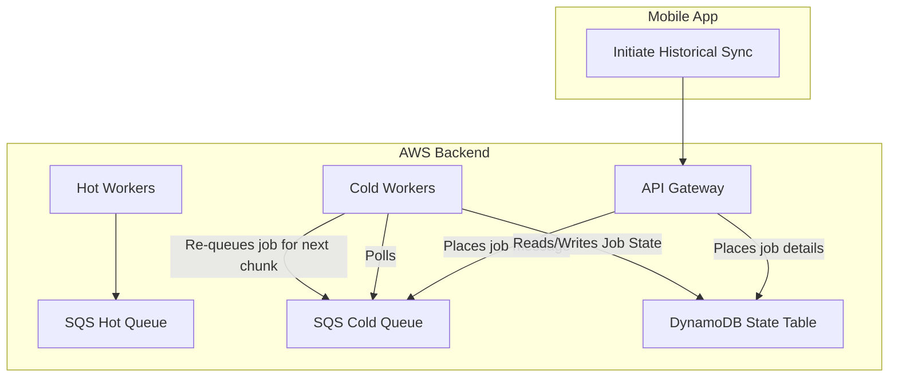
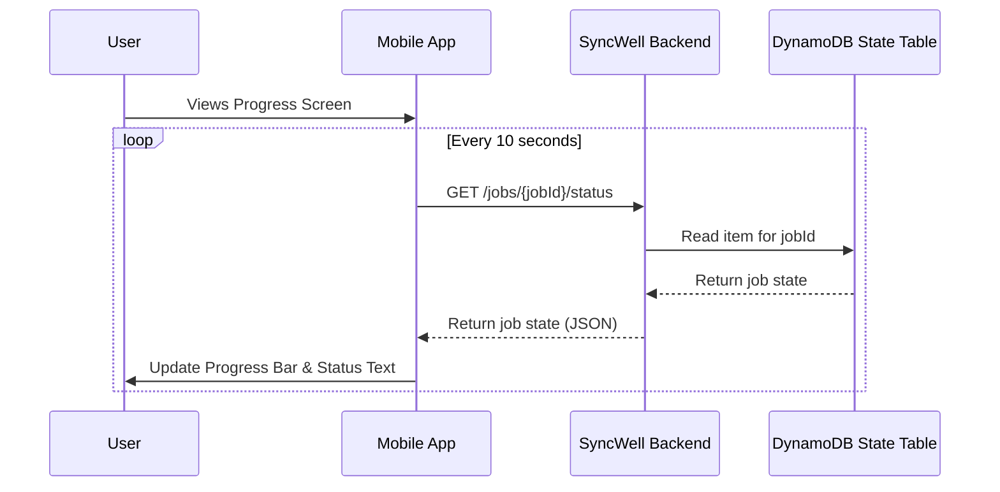

## Dependencies

### Core Dependencies
- `05-data-sync.md` - Data Sync & Conflict Resolution
- `12-trial-subscription.md` - Trial, Subscription & Paywall
- `30-sync-mapping.md` - Source-Destination Sync Mapping
- `32-platform-limitations.md` - Platform-Specific Limitations

### Strategic / Indirect Dependencies
- `09-ux-configuration.md` - UX, Configuration & Settings
- `17-error-handling.md` - Error Handling, Logging & Monitoring

---

# PRD Section 31: Historical Data Handling

## 1. Executive Summary

This document provides the detailed technical specification for the **Historical Data Sync** feature, a core premium offering. This feature allows paying users to backfill their health data, providing a powerful incentive to upgrade.

Given its complexity and potential for high API usage, this feature is built using a robust, isolated backend architecture. This specification details the **dual-queue, "hot/cold" architecture**, the job state management in DynamoDB, and the "circuit breaker" safety pattern required to deliver this feature reliably.

## 2. Historical Sync Architecture (Backend)

The historical sync feature uses a separate, dedicated "cold path" on the backend to ensure these long-running, low-priority jobs do not interfere with normal, real-time syncs.

*   **Dual SQS Queues:**
    1.  **`hot-queue`:** For normal, real-time syncs. Processed immediately.
    2.  **`cold-queue`:** A separate queue for historical backfill jobs.
*   **Dual Lambda Worker Fleets:**
    *   **`hot-workers`:** A fleet of Lambdas with short timeouts, high concurrency, and auto-scaling, dedicated to draining the `hot-queue` as fast as possible.
    *   **`cold-workers`:** A separate fleet of Lambdas configured with **long timeouts** (e.g., up to 15 minutes). These workers process the `cold-queue` and are designed to handle long-running API calls for historical data.
*   **DynamoDB Job State Table:** A dedicated DynamoDB table tracks the state of every historical sync job. This table is the "source of truth" for the job's progress.
    ```json
    // Item in the HistoricalJobs DynamoDB Table
    {
      "jobId": "uuid-123", // Partition Key
      "userId": "user-abc",
      "source": "fitbit",
      "destination": "strava",
      "startDate": "2021-01-01",
      "endDate": "2023-01-01",
      "cursorDate": "2022-10-27", // The day currently being processed
      "status": "PAUSED",
      "errorCount": 6,
      "lastAttempt": "2023-10-27T14:30:00Z"
    }
    ```

## 3. Job State Machine & "Circuit Breaker"

The `cold-worker` Lambdas orchestrate the job as a state machine, with the state being persisted in DynamoDB.

1.  A `cold-worker` picks up a message from the `cold-queue`. The message contains the `jobId`.
2.  The worker reads the full job details from the DynamoDB table using the `jobId`.
3.  It fetches data for the `cursorDate`.
4.  On success, it **updates the `cursorDate` in DynamoDB** (e.g., decrements by one day). If the job is not yet complete, it **places a new message for the same `jobId` back into the `cold-queue`** to process the next day.
5.  If a recoverable error occurs, the worker increments the `errorCount` in DynamoDB.
6.  **Circuit Breaker:** If the `errorCount` exceeds a threshold (e.g., 5 failures in 1 hour), the worker sets the job `status` to **`PAUSED`** in DynamoDB and does **not** re-queue the job. A separate scheduled task will periodically scan for `PAUSED` jobs and re-activate them after a cool-down period.
7.  If a non-recoverable error occurs (e.g., 401 invalid credentials), the worker sets the `status` to **`FAILED`**.

## 4. Dynamic UI & User Experience

The UI is decoupled from the processing logic and gets its information by polling the backend.

*   **Status Polling:** While the historical sync progress screen is open, the mobile app will poll a new API Gateway endpoint every 5-10 seconds. This endpoint reads the job's status directly from the DynamoDB job state table and returns it to the client.
*   **Progress Visualization:** The UI uses the polled data to provide rich, real-time feedback:
    *   A progress bar calculated from the `startDate`, `endDate`, and `cursorDate`.
    *   Text status: "Syncing data for {{cursorDate}}..."
    *   If `status` is `PAUSED`: "Syncing is temporarily paused because the {{sourceProvider}} servers are busy. We will automatically resume in a few hours."
*   **User Controls:** For jobs in a `PAUSED` or `FAILED` state, the user can tap "Retry Now". This calls an endpoint that immediately changes the job's status back to `PENDING` and places it in the `cold-queue`.

## 5. Visual Diagrams

### Dual Queue Backend Architecture


### Historical Job State Machine
```mermaid
graph TD
    A[Pending] --> B{Running};
    B -- Chunk Success, More to Do --> A;
    B -- Chunk Success, All Done --> C[Completed];
    B -- Recoverable Error --> D{Retry};
    D -- Retries < 5 --> B;
    D -- Retries > 5 --> E[Paused (Circuit Breaker)];
    E -- After Cooldown --> A;
    B -- Unrecoverable Error --> F[Failed];
```

### UI Status Polling

