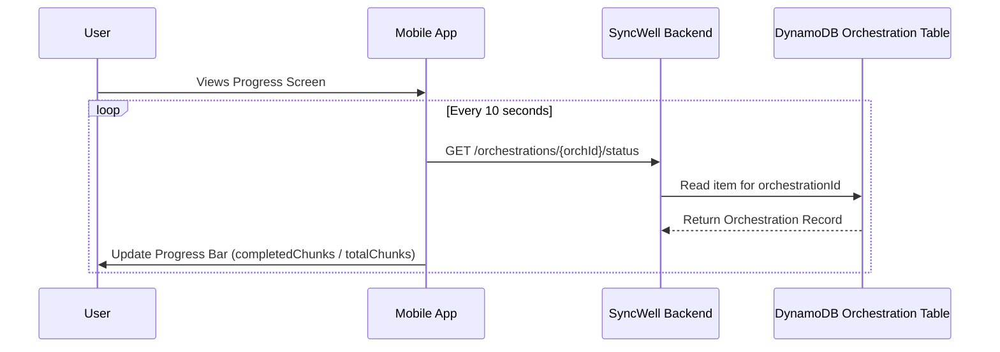

## Dependencies

### Core Dependencies
- `05-data-sync.md` - Data Synchronization & Reliability
- `06-technical-architecture.md` - Technical Architecture
- `12-trial-subscription.md` - Trial, Subscription & Paywall

### Strategic / Indirect Dependencies
- `09-ux-configuration.md` - UX, Configuration & Settings
- `16-performance-optimization.md` - Performance & Scalability
- `17-error-handling.md` - Error Handling, Logging & Monitoring

---

# PRD Section 31: Historical Data Handling

## 1. Executive Summary

This document provides the detailed technical specification for the **Historical Data Sync** feature, a core premium offering. This feature allows paying users to backfill their health data, providing a powerful incentive to upgrade.

A naive implementation of this feature (a single, long-running job) is brittle and prone to failure. To ensure maximum reliability and a transparent user experience, we will implement a robust **job chunking and orchestration** strategy. This specification, derived from `05-data-sync.md`, details this architecture, the data model for progress tracking, and the user experience for monitoring a large sync.

## 2. Historical Sync Architecture: Job Chunking & Orchestration

The historical sync feature uses the dedicated "cold path" on the backend, but instead of a single, long-running job, it uses an orchestration model to create dozens or hundreds of small, independent jobs.

1.  **Orchestration at the Start:** When a user requests a historical sync for a large date range (e.g., Jan 1, 2020 to Dec 31, 2023), the `Request Lambda` initiates the orchestration process.
2.  **Parent Record Creation:** It first creates a single "Orchestration Record" in a new DynamoDB table. This record represents the entire historical sync operation and will be used to track its overall progress.
3.  **Job Chunking:** The orchestrator then breaks the total date range into smaller, logical **chunks** (e.g., one-month intervals).
4.  **Queueing Independent Jobs:** It then enqueues one message in the `cold-queue` for each chunk. For example, a 3-year sync would generate 36 individual messages in SQS (e.g., "Sync Jan 2020", "Sync Feb 2020", etc.).

### Data Model

**`Orchestration Record` (DynamoDB)**
This record tracks the overall job.

```json
{
  "orchestrationId": "orch-uuid-123", // Partition Key
  "userId": "user-abc",
  "source": "fitbit",
  "destination": "strava",
  "startDate": "2020-01-01",
  "endDate": "2023-12-31",
  "status": "IN_PROGRESS", // PENDING, IN_PROGRESS, COMPLETED, FAILED
  "totalChunks": 36,
  "completedChunks": 15,
  "failedChunks": 1
}
```

**`Chunk Job` (SQS Message)**
This is the small, independent job processed by a worker.

```json
{
  "orchestrationId": "orch-uuid-123",
  "userId": "user-abc",
  "source": "fitbit",
  "destination": "strava",
  "chunkStartDate": "2021-03-01",
  "chunkEndDate": "2021-03-31"
}
```

## 3. Benefits of the Chunking Strategy

This architecture is fundamentally more resilient and scalable than a single-job model.

*   **Resilience & Fault Isolation:** The `Cold-Path Worker Lambdas` process one small chunk at a time. If the job for "March 2021" fails due to a temporary API error or a single corrupt data point, it has **zero impact** on the processing of "April 2021". The failed chunk job can be retried independently via the Dead-Letter Queue (DLQ) without halting the entire historical sync.
*   **Parallelism & Performance:** SQS and Lambda are massively parallel. By creating many small jobs, we can have dozens or hundreds of `Cold-Path Worker Lambdas` running in parallel, processing multiple months of data simultaneously. This dramatically reduces the total time required to complete a large backfill.
*   **Resumability:** The state is tracked in the `Orchestration Record`. The process can be paused and resumed at any time. If the entire system were to shut down, the orchestration could be restarted, identify which chunks were not yet complete, and re-enqueue only the missing jobs.
*   **Meaningful Progress Tracking:** The UI can provide a much more accurate and encouraging progress report to the user by querying the `Orchestration Record`.

## 4. Execution Flow

1.  A `Cold-Path Worker` receives a `Chunk Job` message from the `cold-queue`.
2.  It executes the sync for the small date range specified in the message (e.g., one month).
3.  Upon successful completion, the worker performs an **atomic increment** on the `completedChunks` attribute of the parent `Orchestration Record` in DynamoDB.
4.  If all chunks are complete (`completedChunks` + `failedChunks` == `totalChunks`), the worker sets the `Orchestration Record` status to `COMPLETED`.
5.  If the job fails and is moved to the DLQ, a separate process will increment the `failedChunks` count on the parent record.

## 5. Visual Diagrams

### Job Chunking & Orchestration Flow
```mermaid
graph TD
    subgraph User
        A[Requests 2-Year Sync]
    end
    subgraph AWS Backend
        B[Request Lambda (Orchestrator)]
        C[DynamoDB Orchestration Table]
        D[SQS Cold Queue]
        E[Cold-Path Workers]
    end

    A --> B
    B -- 1. Create Record --> C
    B -- 2. Generate 24 Chunk Jobs --> D
    E -- 3. Polls for chunk job --> D
    E -- 4. Process 1-month sync --> E
    E -- 5. Update Progress --> C
```

### UI Status Polling

