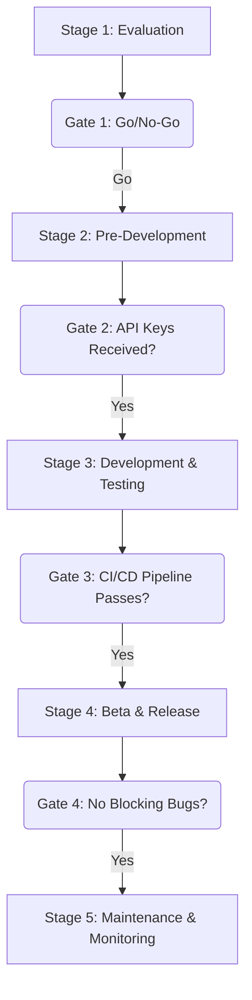

## Dependencies

### Core Dependencies
- `03-competitive-analysis.md` - Competitive & SWOT Analysis
- `13-roadmap.md` - Roadmap, Milestones & Timeline
- `42-customer-feedback.md` - Customer Feedback Loop

### Strategic / Indirect Dependencies
- `07-apis-integration.md` - APIs & Integration Requirements
- `21-risks.md` - Risks, Constraints & Mitigation
- `25-release-management.md` - Release Management & Versioning
- `32-platform-limitations.md` - Platform-Specific Limitations

---

# PRD Section 33: Third-Party Integration Strategy

## 1. Executive Summary

This document provides the strategic framework for the lifecycle of third-party integrations within SyncWell. As integrations are our core product feature, a disciplined and strategic approach to selecting, developing, and maintaining them is critical for long-term success.

The framework is designed to be data-driven and objective, using a quantitative scorecard to prioritize opportunities. This process provides a crucial defense against misallocating precious engineering resources and demonstrates a mature, strategic approach to product expansion.

## 2. The Integration Opportunity Scorecard

The decision to pursue a new integration will be based on the outcome of this scorecard. Each potential integration is scored, and opportunities are ranked.

| Category (Weight) | Criteria | Scoring (0-5) | Notes |
| :--- | :--- | :--- | :--- |
| **User Demand (50%)** | Votes on the public feedback portal. | 0 = <10 votes 5 = >500 votes | The most important factor. |
| **Strategic Value (30%)**| Opens a new, valuable user segment. | 0 = No new segment 5 = High-value, untapped segment | Does this expand our market? |
| **Strategic Value (30%)**| Achieves parity with a key competitor. | 0 = No parity gain 5 = Fills a major competitive gap | Is this a "must-have" to compete? |
| **Technical Feasibility (20%)**| Quality and stability of the partner's API. | 0 = Unstable, undocumented 5 = Well-documented, stable REST/GraphQL API | A subjective assessment of development risk. |
| **Technical Feasibility (20%)**| **Backend-Friendly API.** | 0 = Mobile-only SDK, complex flow 5 = Supports standard server-to-server OAuth 2.0 | Does the API fit our backend architecture? |

*A weighted final score is calculated, and opportunities are ranked on the backlog.*

## 3. The Gated Integration Lifecycle

Each integration proceeds through a formal, gated lifecycle.

### Stage 1: Evaluation
*   **Activities:** Complete the Opportunity Scorecard. Perform a preliminary investigation of the API documentation.
*   **Gate Review:** Is the final score above the minimum threshold?
*   **Outcome:** "Go/No-Go" decision.

### Stage 2: Pre-Development
*   **Activities:** Apply for production API access. Add the integration to the internal `32-platform-limitations.md` document.
*   **Gate Review:** Have we received production-level API keys?
*   **Outcome:** Approved for active development.

### Stage 3: Development & Testing
*   **Activities:** The `DataProvider` module is built (for backend and/or client), including auth, data mappers, and a full suite of automated tests.
*   **Gate Review:** Does the provider pass all unit and integration tests in the CI/CD pipeline?
*   **Outcome:** Ready for beta testing.

### Stage 4: Beta & Release
*   **Activities:** The integration is deployed to the public beta channel for at least two weeks.
*   **Gate Review:** Are there any blocking bugs reported by beta testers?
*   **Outcome:** Ready for public release.

### Stage 5: Maintenance & Monitoring
*   **Activities:** The integration is live. Its error rates and performance are monitored via **AWS CloudWatch and Firebase**. User-reported bugs are addressed.

## 4. Partner Relationship Management

*   **Centralized Record:** A private repository will be maintained with key information for each partner, including links to their developer portal and support contacts.
*   **Proactive Monitoring:** We will subscribe to the developer blog/newsletter for each key partner to stay informed about upcoming API changes.

## 5. Deprecation Plan

If an API provider discontinues their service or we decide to end an integration, a user-centric off-boarding process will be followed:
1.  **3-Month Notice:** Announce the planned deprecation via an in-app banner to affected users.
2.  **2-Month Notice:** Prevent new users from connecting to the service.
3.  **1-Month Notice:** Send a final push notification reminder.
4.  **Deprecation Day:** Remove the integration.

## 6. Visual Diagrams

### Gated Integration Lifecycle

