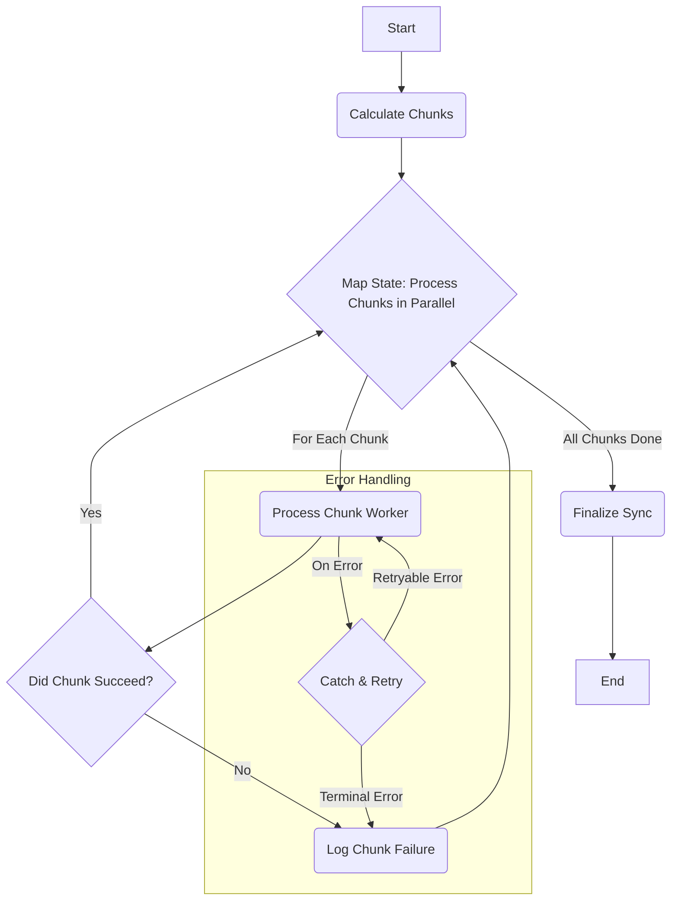

## Dependencies

### Core Dependencies
- `13-roadmap.md` - Roadmap, Milestones & Timeline

### Strategic / Indirect Dependencies
- `01-context-vision.md` - Context & Vision
- `03-competitive-analysis.md` - Competitive & SWOT Analysis
- `11-monetization.md` - Monetization, Pricing & Business Model
- `42-customer-feedback.md` - Customer Feedback Loop

---

# PRD Section 45: Future Enhancements & Roadmap Expansion

## 1. Executive Summary

This document serves as a visionary backlog and idea repository for the long-term evolution of the SyncWell application. It contains potential features, strategic directions, and product expansions that are **beyond the scope of the current 12-18 month roadmap**. The purpose of this document is to capture and explore ambitious ideas without committing to them, ensuring that we maintain a long-term vision for growth and innovation.

This is a living document that will be revisited during annual strategic planning. For the **solo developer**, it is a source of inspiration. For **investors**, it demonstrates that the vision for SyncWell extends far beyond its initial market, pointing to significant future growth potential.

## 2. Guiding Principles for Future Growth

The decision to pull an idea from this document into the official roadmap will be guided by these principles:
*   **Does it align with our core mission?** We are a data synchronization and management tool, not a social network or a content platform.
*   **Can it be a new revenue stream?** Does the feature provide enough value to support a new, optional subscription tier?
*   **Does it create a competitive moat?** Does the feature create a unique advantage that is difficult for competitors to replicate?
*   **Is it technically feasible?** Do we have the skills and resources to build it to a high standard of quality?

## 3. Potential Future Enhancements (The "Idea Backlog")

These ideas represent the long-term vision for SyncWell, building upon the foundation laid in the Year 1 Roadmap.

### Theme 1: The Insights Layer (Post-Year 1)

This theme builds on the **Q2: Intelligence & Insight** roadmap. Once SyncWell is the canonical source for a user's health data, we can build an intelligence layer on top of it.

*   **Idea:** **Cross-Platform Insights Engine**
    *   **Description:** Move beyond data management to provide proactive, cross-platform insights. The app would analyze the user's (on-device) canonical data to find interesting correlations.
    *   **Example:** "Your sleep quality from Oura improves by an average of 15% on days you run more than 5k with Garmin. Keep it up!"
    *   **Strategic Goal:** Increase user engagement and "stickiness" by providing unique value that no single platform can offer.
*   **Idea:** **Health Automation Hub (IFTTT-style)**
    *   **Description:** Allow users to create powerful "if this, then that" rules to automate their health life.
    *   **Example:** "IF I log a workout > 60 mins on Strava, THEN add a 'Hydration Reminder' to my calendar 30 minutes later."
    *   **Strategic Goal:** Transform the app from a sync tool into a personalized health automation platform, creating a powerful competitive moat.

### Theme 2: SyncWell as a Platform (Post-Year 1)

This theme builds on the **Q4: Scale & Optimize** roadmap, expanding SyncWell from a product into a platform.

*   **Idea:** **SyncWell for Web**
    *   **Description:** A premium, subscription-based web dashboard for Pro users.
    *   **Features:** View and manage syncs, advanced data visualization, and perform bulk data operations.
    *   **Strategic Goal:** Create a new, high-margin recurring revenue stream targeting our most dedicated users and solidifying our "power user" positioning.
*   **Idea:** **SyncWell Developer API**
    *   **Description:** Offer a paid, public API that allows other developers to access SyncWell's powerful provider architecture.
    *   **Value Prop:** A small nutrition app could, with one integration, read data from all 20+ services SyncWell supports.
    *   **Strategic Goal:** Diversify revenue into B2B/PaaS and deeply embed SyncWell into the health-tech ecosystem.

### Theme 3: New Business Verticals (Post-Year 1)

This theme builds on the introduction of the **Family Plan** in Q4, exploring new B2B and group-based business models.

*   **Idea:** **SyncWell for Corporate Wellness**
    *   **Description:** A B2B portal that allows companies to offer SyncWell Pro as a benefit to their employees. The portal would provide anonymized, aggregated data to the employer (e.g., "75% of employees met their weekly activity goal") while preserving individual privacy.
    *   **Strategic Goal:** Enter the lucrative corporate wellness market with a privacy-first solution.
*   **Idea:** **SyncWell for Health Coaches**
    *   **Description:** A portal for certified health and fitness coaches to (with explicit user consent) view their clients' incoming data from various platforms in one unified dashboard.
    *   **Strategic Goal:** Create a high-value B2B subscription tier and become an essential tool for the coaching industry.

### Theme 4: Quality of Life & Power User Features (Post-Year 1)

This theme focuses on enhancing the core user experience with features that provide more control, transparency, and delight.

*   **US-29:** Set custom sync frequency per connection.
*   **US-30:** Preview data before a sync is executed.
*   **US-31:** Smart, automatic backfill of recent data for new users.
*   **US-32:** Sync advanced biometric data (HRV, SpO2).
*   **US-33:** Display API rate limit status to the user.
*   **US-34:** Set a "Source of Truth" for automatic conflict resolution.
*   **US-35:** Use an interactive guide for troubleshooting sync errors.
*   **US-36:** Add a home screen widget for at-a-glance sync status.
*   **US-37:** Filter syncs by specific activity types.
*   **US-38:** Get notifications for "streaks" or "milestones."

## 4. Evaluation Framework
When it comes time to consider one of these ideas for the official roadmap, it will be evaluated against a more formal framework:
*   **Market Size & Opportunity:** What is the total addressable market for this feature?
*   **Development Cost Estimate:** What is the estimated time/resource cost to build an MVP of this feature?
*   **Revenue Potential:** How would this feature be monetized, and what is its potential revenue?
*   **Risk Assessment:** What are the key technical, legal, and market risks associated with this idea?

## 5. Optional Visuals / Diagram Placeholders
*   **[Mind Map] SyncWell Vision 2030:** A mind map showing the core "SyncWell v1" product branching out into the different future themes and ideas.
*   **[Business Model Canvas] SyncWell for Developers:** A separate Lean Canvas outlining the business model for the "SyncWell API" idea.
*   **[Pitch Deck Slide] Future Growth:** A sample slide from a future investor pitch deck, showcasing one of these enhancement themes as a major growth opportunity.

## 6. Deferred Architectural Designs from PRD-06

This section archives detailed architectural designs that were originally specified in `06-technical-architecture.md` but have been deferred to post-MVP releases to focus the initial development effort.

### Historical Sync ("Cold Path")

The ability for users to backfill months or years of historical data is a key feature planned for a post-MVP release.

*   **Terminology Note:** A "Historical Sync" is a long-running *workflow*. The individual tasks processed by this workflow are assigned a **low priority**. This priority is enforced by the distributed rate-limiter, which uses a separate, more restrictive token bucket for jobs flagged as `historical`.
*   **Use Case:** Handling user-initiated requests to backfill months or years of historical data.
*   **Flow:**
    1.  The Mobile App sends a request to a dedicated API Gateway endpoint to start a historical sync.
    2.  **API Gateway** uses a direct service integration to start an execution of the **AWS Step Functions** state machine.
    3.  The state machine orchestrates the entire workflow, breaking the job into chunks, processing them in parallel with `WorkerLambda` invocations, and handling errors.
*   **Advantages & Trade-offs:** Step Functions is the ideal choice for this workflow due to its rich, native observability and state management features. However, there are trade-offs:
    *   **Advantages:** Visual workflow monitoring, detailed execution history for auditing, and native X-Ray integration make operating and debugging these complex jobs highly transparent.
    *   **Potential Downsides:** At extreme scale, Step Functions can become costly. Additionally, the state payload passed between steps has a size limit (256KB), which requires careful management to ensure large job definitions do not exceed this limit.

#### Level 4: Historical Sync Workflow

To handle long-running historical data syncs, we will use **AWS Step Functions**.

The following diagram illustrates the state machine, reflecting the parallel processing of data chunks.

*   **State Machine Logic:**
    1.  **Initiate & Calculate Chunks:** The workflow is triggered by an API call. A Lambda function calculates the total date range and breaks it into an array of smaller, logical chunks (e.g., 7-day periods).
    2.  **Process in Parallel (`Map` State):** The state machine uses a `Map` state to iterate over the array of chunks, invoking a `WorkerLambda` for each chunk in parallel. The `Map` state has a configurable concurrency limit (which will be monitored and can be increased) to avoid overwhelming downstream APIs.
    3.  **Error Handling:**
        *   **`Retry` Policy:** Each worker invocation will have a declarative `Retry` policy for transient errors, with a configuration of **3 max attempts** and an **exponential backoff rate of 2.0**.
        *   **`Catch` Logic:** If retries fail, a `Catch` block will route the failure to a logging step. This step records the failed chunk's details for later analysis, and the `Map` state continues processing the remaining chunks.
    4.  **Finalize Sync & Notify User:** After the `Map` state completes, a final Lambda function aggregates the results. It then publishes a `HistoricalSyncCompleted` event, which triggers a push notification to the user. The notification sent will be `N-05` ("Your historical sync is complete.") or `N-06` ("Your historical sync finished with some errors.") depending on whether any chunk failures were logged.

#### Idempotency for Historical Syncs (Step Functions)
For long-running historical syncs, an additional layer of idempotency is applied at the orchestration level:
*   **Execution Naming:** The API Gateway integration **must** be configured to use the client-provided `Idempotency-Key` as the `name` for the Step Function's execution.
*   **Handling Existing Executions:** If API Gateway's attempt to start an execution fails with an `ExecutionAlreadyExists` error, the system **must not** assume success. Instead, the integration logic will call `DescribeExecution` to check the status of the existing execution.
    *   If the existing execution is `SUCCEEDED` or `RUNNING`, the API can safely return a `202 Accepted` to the client.
    *   If the existing execution `FAILED`, the API must return a `409 Conflict` (or similar error), indicating that the original request failed and a new request with a new `Idempotency-Key` is required.

#### DynamoDB Schema for Historical Sync Jobs
| Entity | PK (Partition Key) | SK (Sort Key) | Key Attributes & Defined Values |
| :--- | :--- | :--- | :--- |
| **Hist. Sync Job** | `USER#{userId}` | `HISTORICAL##{jobId}` | `ExecutionArn`, `Status`: `PENDING`, `RUNNING`, `SUCCEEDED`, `FAILED` |

### AI Insights Service

This service is planned for a future release to provide intelligence to the platform. It will encapsulate machine learning models and LLM integrations, allowing the core sync engine to remain deterministic and focused.

*   **Technology:** Amazon SageMaker, Amazon Bedrock, AWS Lambda.
*   **Responsibilities:** The initial design considers providing "intelligent conflict resolution" to address user story US-15 ("As a Pro user, I want the system to intelligently merge conflicting entries to avoid data loss"). Other potential features include an LLM-based troubleshooter and personalized summaries.

#### Level 3: Components (Future AI Insights Service)

When implemented, the AI Insights Service will be composed of several components. The exact implementation details will be defined closer to the feature's development phase and will undergo a rigorous security and privacy review. The initial high-level concepts include:

*   **`Conflict Resolution Model`:** A potential machine learning model that could take two conflicting data entries and return a suggested merged version.
*   **`LLM-based Services`:** Lambda functions that could leverage foundational models (e.g., via Amazon Bedrock) to power features like an interactive troubleshooter or human-readable data summaries.

### Mitigating "Viral User" Hot Partitions

A "hot partition" for a viral user is a significant risk. The primary mitigation strategy is to automate the migration of that user to a dedicated table.
*   **Automated Identification:** A CloudWatch Alarm on the `ThrottledRequests` metric will trigger this process. This alarm **must** be configured to use high-cardinality custom metrics generated via **CloudWatch Embedded Metric Format (EMF)** to pinpoint the specific `userId` causing the throttling.
*   **Automated Migration Workflow:** The alarm will trigger a Step Functions workflow to orchestrate the migration.
    *   **Error Handling & Rollback:** The workflow will have a comprehensive `Catch` block. If any step (e.g., data copy, verification) fails, the workflow will automatically roll back by deleting any partially copied data and removing the `migrationStatus` flag from the user's profile in the main table. A critical alert will be sent to the engineering team.
*   **Automated De-Migration:** A user can be de-migrated (moved back to the main table) if their traffic patterns return to normal for a sustained period (e.g., 7 consecutive days). This will be triggered by a separate scheduled process that analyzes traffic on the hot-user table.
*   **Secondary Strategy (Write Sharding):** If a single user's write traffic becomes too extreme for one partition, write sharding is a possible secondary strategy. This involves appending a shard number to the partition key (e.g., `USER#{userId}-1`). This adds significant read-side complexity (requiring a scatter-gather query) and is considered a major architectural project, out of scope for the MVP.
