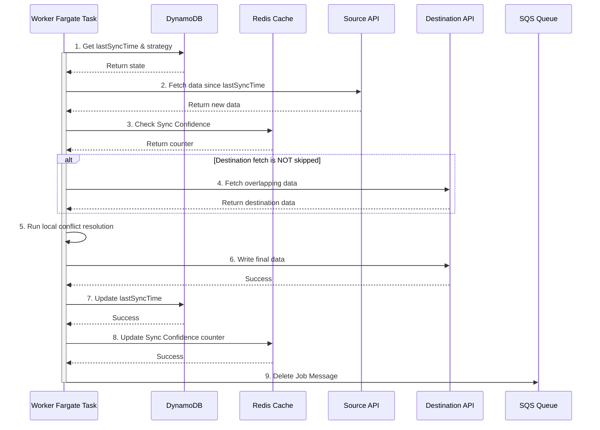

## Dependencies

### Core Dependencies
- `../prd/02-product-scope.md` - Product Scope, Personas & MVP Definition
- `./06-technical-architecture.md` - **[Authoritative]** Technical Architecture
- `./07-apis-integration.md` - APIs & Integration Requirements
- `../ops/17-error-handling.md` - Error Handling, Logging & Monitoring
- `./30-sync-mapping.md` - Source-Destination Sync Mapping

### Strategic / Indirect Dependencies
- `../prd/01-context-vision.md` - Context & Vision
- `../ops/16-performance-optimization.md` - Performance & Scalability
- `../prd/31-historical-data.md` - Historical Data Handling
- `../ux/40-error-recovery.md` - Error Recovery & Troubleshooting
- `../prd/GLOSSARY.md` - Project Glossary

---

# PRD Section 5: Data Synchronization & Reliability

## 1. Executive Summary

This document provides a detailed specification for SyncWell's core data synchronization engine. Its primary objective is to create a highly reliable, secure, and efficient system for transferring health data.

This document works in conjunction with the main **`./06-technical-architecture.md`**, which is the single source of truth for all architectural decisions. This document focuses on the *specific algorithms and policies* of the sync engine itself, while the broader architecture (including component definitions, networking, and security) is defined in the main architecture document.

## 2. Sync Engine Overview

The sync engine is a server-side, event-driven system built on AWS. For the MVP, it is focused exclusively on the **"Hot Path"** for handling syncs of recent data. The core components, including the Fargate-based worker fleet, SQS queues, and DynamoDB tables, are canonically defined in `./06-technical-architecture.md`. The specific vCPU, memory, and auto-scaling configurations for the `Worker Fargate Task` are defined in the project's Terraform IaC files.

The engine employs a multi-faceted strategy to trigger syncs, optimizing for cost, performance, and user experience:

*   **Webhook-Driven Sync:** For providers that support webhooks, this is the preferred method. It provides near real-time updates while minimizing cost. An "Event Coalescing" layer, as described in `06-technical-architecture.md`, is used to buffer and merge rapid-fire webhooks, preventing "event chatter" (defined as more than 3 events for the same user within a 60-second window).
*   **Mobile-Initiated Sync:** For manual syncs initiated by the user, the mobile app makes a direct API call. The priority of these jobs is managed via a `priority` field in the API payload, as defined in `06-technical-architecture.md`, allowing the downstream rate-limiter to prioritize them.
*   **Tiered & Adaptive Polling:** For providers without webhooks, the system uses a highly cost-effective, two-tiered polling strategy that combines adaptive scheduling with "pre-flight checks" to avoid triggering expensive compute for unnecessary work.
    *   **Tier 1: Adaptive Scheduling with SQS Delay Queues:** The system avoids expensive, fixed-schedule services. Instead, after a sync job completes, it analyzes the user's "sync velocity" and dynamically enqueues the *next* poll job for that user back into an SQS queue with a calculated `DelaySeconds`. An active user might be re-queued with a 15-minute delay, while an inactive user might be re-queued with a 24-hour delay. This adaptive model dramatically reduces the number of polls for inactive users.
    *   **Tier 2: Pre-flight Check Lambda:** The SQS message from Tier 1 does not trigger the main Fargate worker fleet directly. Instead, it triggers a new, ultra-lightweight, and low-cost Lambda function: the `PollingPreflightChecker`. This Lambda's sole responsibility is to perform a cheap "pre-flight check" (e.g., a `HEAD` request or a query for `count > 0`) to see if there is any new data at the source provider *before* initiating a full sync. If and only if new data exists, it enqueues a job for the main worker fleet.

## 3. The Synchronization Algorithm

The core sync logic resides within the `Worker Fargate Task`. This logic is invoked for all sync jobs, regardless of how they were triggered.

1.  **Job Dequeue:** The Fargate task receives a job message.
2.  **Get State from DynamoDB:** The worker retrieves the `SyncConfig` item to get the `lastSyncTime` and the user's chosen `conflictResolutionStrategy`.
3.  **Fetch New Data Metadata:** The worker calls `fetchMetadata(since: lastSyncTime)` on the source `DataProvider`. This returns a list of lightweight objects containing only metadata (IDs, timestamps), not heavy payloads (like GPX files).
4.  **Handle Empty Source:** If the metadata list is empty, the job is considered complete. The worker updates the `lastSyncTime`, deletes the SQS message, and stops. This is a critical cost-saving step.
5.  **Algorithmic Optimization ("Sync Confidence" Check):** Before fetching from the destination, the worker checks the "Sync Confidence" cache (Redis), as detailed in Section 5. If conditions are met, the destination fetch is skipped.
6.  **Fetch Destination Data for Conflict Resolution (Conditional):** If the confidence check does not result in a skip, the worker fetches potentially overlapping data from the destination `DataProvider`.
7.  **Conflict Resolution on Metadata:** The `Conflict Resolution Engine` is invoked. It compares the source and destination **metadata** and applies the user's chosen strategy. It returns a definitive list of `sourceRecordIds` that need to be written to the destination.
8.  **Intelligent Hydration:** If the list of `sourceRecordIds` to write is not empty, the worker now calls `fetchPayloads(recordIds: sourceRecordIds)` on the source `DataProvider`. This fetches the full, heavy data payloads **only for the records that will actually be written**.
    *   **Failure Handling:** If a payload fetch from the source provider fails (e.g., due to a transient API error), the entire job is considered to have failed. The worker will throw an exception, allowing the SQS message to be retried. This prevents partial data from being written to the destination.
9.  **Write Data:** The worker calls `pushData(data: hydratedData)` on the destination provider with the fully hydrated data objects.
10. **Handle Partial Failures:** The worker inspects the `PushResult`. For the MVP, if the push is not completely successful, the entire job is considered failed. The worker throws an error, allowing SQS to retry the job. The post-MVP strategy is captured in `../prd/45-future-enhancements.md`.
11. **Update State in DynamoDB:** Only upon full successful completion, the worker performs an `UpdateItem` call to set the new `lastSyncTime`.
12. **Update "Sync Confidence" Cache:** The confidence counter in Redis is updated based on the sync outcome to inform future jobs.
13. **Delete Job Message:** The worker deletes the job message from the SQS queue to mark it as complete.

## 4. Conflict Resolution Engine (MVP)

The engine uses simple, deterministic rules. The advanced "AI-Powered Merge" feature is a post-MVP enhancement captured in `../prd/45-future-enhancements.md`.

### 4.1. Conflict Detection Algorithm

A conflict is detected if a `source` activity and a `destination` activity have time ranges that overlap by more than a configured threshold (defaulting to **60 seconds**). This threshold is a global setting managed in AWS AppConfig and has an acceptable range of **10 to 300 seconds**.

### 4.2. Resolution Strategies (MVP)

*   **`source_wins` (Default):** New data from the source platform will always overwrite any existing data in the destination.
*   **`dest_wins`:** Never overwrite existing data. If a conflicting entry is found, the source entry is ignored.
*   **`newest_wins`:** The data record (source or destination) with the most recent modification timestamp is preserved. **If timestamps are identical, the source record will win** to ensure a deterministic outcome.

## 5. Algorithmic Optimizations

### 5.1. "Sync Confidence" Caching

This optimization avoids an often unnecessary API call to the destination provider.

*   **Mechanism:** The system uses a simple integer counter in Redis to track how many consecutive times a sync with a destination has yielded zero new data.
*   **Redis Implementation:** A Redis **String** is used for the counter. The key schema is `sync:confidence:{userId}:{destinationProvider}`.
*   **Logic:**
    1.  **Strategy-Based Elimination:** If the user's conflict resolution strategy is `source_wins`, the destination API call is skipped entirely.
    2.  **Pattern-Based Elimination:** If the strategy requires a destination check, the worker checks the Redis key. If the counter exceeds a configured threshold of **10**, the destination API call is also skipped.
    3.  **Counter Management:** If the destination API is called and returns data, the counter is reset to 0. If it returns no data, the counter is incremented.
*   **Graceful Degradation:** In the event of a Redis outage, the worker defaults to the safe behavior of always fetching from the destination, ensuring syncs continue correctly, albeit less efficiently.
*   **Risk Mitigation:** The risk of a stale cache causing a missed sync is mitigated by the cache's self-correcting nature. If a `pushData` operation fails due to a conflict, the confidence counter is immediately reset to zero, forcing a re-fetch on the next attempt.

### 5.2. Intelligent Data Hydration
The sync algorithm uses a "metadata-first" or "intelligent hydration" approach, as detailed in the main architecture document (`06-technical-architecture.md`, Section 3b). This process, which separates the fetching of lightweight metadata from heavy payloads, is a critical cost-optimization strategy that significantly reduces data transfer and compute usage.

## 6. Data Integrity and Reliability

Data integrity is paramount. The system ensures this through several mechanisms, which are authoritatively defined in `06-technical-architecture.md`.

*   **Idempotency:** The end-to-end idempotency strategy is based on the native deduplication capabilities of **Amazon SQS FIFO queues**. The client generates a unique `Idempotency-Key` (UUIDv4) which is passed as the `MessageDeduplicationId` to SQS, guaranteeing exactly-once processing within the 5-minute deduplication window.
*   **Durable Queueing & DLQ:** The use of SQS for the `HotPathSyncQueue` provides a durable buffer for all jobs. A corresponding Dead-Letter Queue (DLQ) is configured to catch messages that fail repeatedly (`maxReceiveCount` is set to **5**), allowing for offline analysis without blocking the main queue. The queue's `VisibilityTimeout` will be configured to **90 seconds**, a value chosen to be safely above the P95 latency for a single sync job, ensuring that a job has ample time to complete before SQS considers it to have failed and makes it visible for another consumer.
*   **Transactional State:** State updates in DynamoDB are atomic. The `lastSyncTime` is only updated if the entire sync operation succeeds.

## 7. User Support Flow for DLQ Messages

When a sync job permanently fails and lands in the DLQ, it requires manual intervention.

*   **Monitoring & Alerting:** A CloudWatch alarm on the DLQ's `ApproximateNumberOfMessagesVisible` metric (threshold > 0 for 5 minutes) notifies the on-call support engineer via PagerDuty.
*   **Investigation Process:** The support engineer inspects the non-PII metadata in the message to triage the issue (bug, third-party problem, or user account issue).
*   **User Communication:**
    *   **SLA:** The user MUST be contacted via email within **24 hours**.
    *   **In-App Status:** The user sees a persistent error indicator in the UI: *"This connection is having trouble syncing. We've been notified and are looking into it."*
    *   **Email Templates:** Pre-defined, user-friendly email templates are used for initial contact and resolution updates. These are maintained by the support team.
*   **Ownership:** The **Head of Customer Support** owns this playbook. It was reviewed and approved by Legal on 2025-08-20.

## 8. Visual Diagrams

### Sequence Diagram for Delta Sync (MVP)

This diagram details the step-by-step interaction between the `Worker Fargate Task` and other services during a single, successful delta sync job, including the "Sync Confidence" optimization.

**Detailed Description for Accessibility:** A sequence diagram shows the `Worker Fargate Task` as the main actor. It first gets state from DynamoDB. Then, it fetches data from a Source API. Next, it checks the Redis Cache for "Sync Confidence". In an optional block, if the destination fetch is not skipped, it fetches data from a Destination API. It then runs local conflict resolution. After resolution, it writes the final data to the Destination API. Upon success, it updates `lastSyncTime` in DynamoDB and updates the confidence counter in Redis. Finally, it deletes the job message from the SQS Queue.

Diagram Source Code

## 9. Data Model Definitions

The following data structures are used within the sync engine. The authoritative definitions for all canonical models are maintained in the KMP shared module and versioned in the AWS Glue Schema Registry.

| Object | Attribute | Type | Description |
| :--- | :--- | :--- | :--- |
| **`SyncConfig`** | `userId` | String | The ID of the user. |
| | `sourceId` | String | The ID of the source connection. |
| | `destinationId` | String | The ID of the destination connection. |
| | `dataType` | String | The type of data to sync (e.g., 'workout'). |
| | `conflictStrategy`| String | The chosen strategy (e.g., 'source_wins'). |
| | `lastSyncTime` | ISO 8601 | The timestamp of the last successful sync. |
| **`PushResult`** | `success` | Boolean | Whether the entire push operation succeeded. |
| | `totalItems` | Integer | The total number of items attempted. |
| | `pushedItemIds` | Array | A list of source IDs for items successfully pushed. |
| | `failedItemIds` | Array | A list of source IDs for items that failed to push. |
