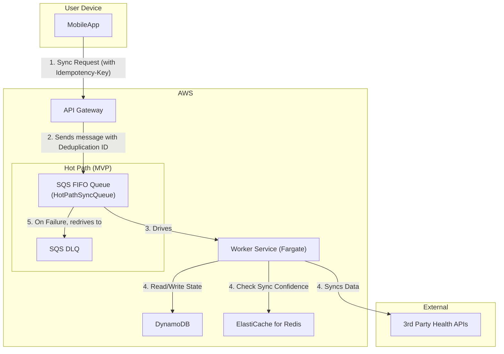
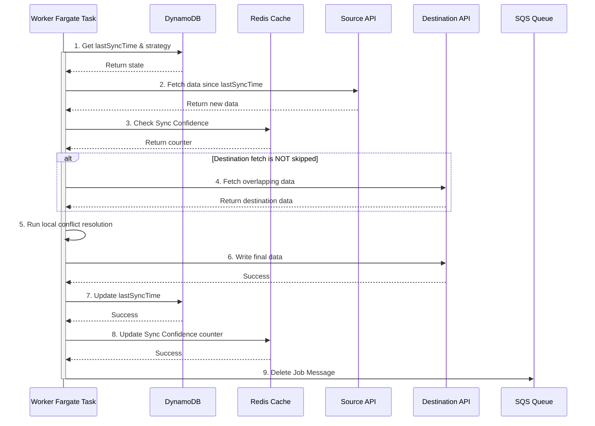
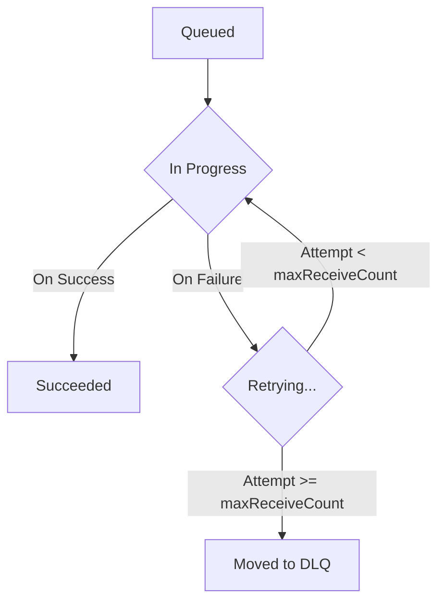
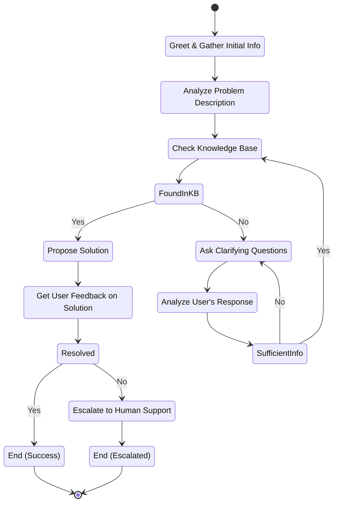

## Dependencies

### Core Dependencies
- `../prd/02-product-scope.md` - Product Scope, Personas & MVP Definition
- `./06-technical-architecture.md` - Technical Architecture
- `./07-apis-integration.md` - APIs & Integration Requirements
- `../ops/17-error-handling.md` - Error Handling, Logging & Monitoring
- `./30-sync-mapping.md` - Source-Destination Sync Mapping

### Strategic / Indirect Dependencies
- `../prd/01-context-vision.md` - Context & Vision
- `../ops/16-performance-optimization.md` - Performance & Scalability
- `../prd/31-historical-data.md` - Historical Data Handling
- `../ux/40-error-recovery.md` - Error Recovery & Troubleshooting
- `../prd/GLOSSARY.md` - Project Glossary

---

# PRD Section 5: Data Synchronization & Reliability

## 1. Executive Summary

This document provides the detailed technical and functional specification for SyncWell's core data synchronization engine. The primary objective is to create a highly reliable, secure, and efficient system for transferring health data. The success of the entire application is fundamentally dependent on the robustness and integrity of this engine.

This document serves as a blueprint for the **product and engineering teams**, detailing the specific architecture, algorithms, and policies required. A well-defined sync engine is the most critical and complex component of the project; this specification aims to de-risk its development by providing a clear and comprehensive plan. All key terms are defined in the central `../prd/GLOSSARY.md`.

## 2. Sync Engine Architecture (MVP)

The data synchronization engine for the MVP is a server-side, event-driven system built on AWS, as defined in `./06-technical-architecture.md`. The architecture is designed for reliability and is focused exclusively on the **"Hot Path"** for handling syncs of recent data. It incorporates a multi-faceted sync strategy to optimize for cost and performance:
*   **Webhook-Driven Sync with Event Coalescing:** For providers that support webhooks, this model provides near real-time updates while minimizing cost. It uses a dedicated SQS queue to buffer and coalesce incoming events, preventing "event chatter" (defined as more than 3 events for the same user within a 60-second window) and reducing downstream load.
*   **Mobile-Initiated Sync:** For manual syncs or device-native integrations (e.g., HealthKit), the mobile app makes a direct API call that places a job onto a **high-priority SQS FIFO queue**. This priority is technically enforced by using a separate SQS FIFO queue with a dedicated, scaled-up fleet of Fargate consumers, ensuring these jobs are picked up with lower latency than the standard webhook-driven queue.
*   **Adaptive Polling:** For providers without webhooks, an **intelligent adaptive polling mechanism** is used. The algorithm adjusts frequency based on a combination of time since last sync, user subscription tier (Pro users are polled more frequently), and recent data yield (if polls consistently return no new data, the frequency is reduced). The specific parameters are managed in AWS AppConfig.

These strategies are detailed in the main technical architecture document.

*   **Hot Path (for Real-time Syncs):** This path is optimized for low-latency, high-volume, short-lived sync jobs. It uses an SQS FIFO queue to reliably buffer requests and prevent duplicate processing.
*   **Post-MVP (Cold Path):** The architecture for long-running historical data backfills (the "Cold Path") is a post-MVP feature. The detailed design is captured in `../prd/45-future-enhancements.md`.

The core components for the MVP are:
*   **`API Gateway`:** The public-facing entry point. For mobile-initiated syncs, it uses a **direct AWS service integration** to send messages to the SQS FIFO queue, a critical cost and performance optimization.
*   **`SQS FIFO Queue (`HotPathSyncQueue`)`:** A primary, durable SQS FIFO queue that acts as a critical buffer for real-time sync jobs, absorbing traffic spikes and providing exactly-once processing guarantees. The queue will have a **VisibilityTimeout of 5 minutes**, which is longer than the expected maximum duration of a single hot-path sync job. The known throughput limits of SQS FIFO (~3,000 messages per second with batching) are well within the non-functional requirements for the MVP and are considered an acceptable trade-off for the benefits of native deduplication and ordering.
*   **`SQS Dead-Letter Queue (DLQ)`:** A secondary SQS queue configured as the DLQ for the primary queue. The primary queue is configured with a **`maxReceiveCount` of 5** before a message is moved to the DLQ.
*   **`Worker Service (AWS Fargate)`:** The heart of the engine. As per the key architectural decision in `06-technical-architecture.md`, this is a containerized service running on **AWS Fargate** that contains the core sync logic. The Fargate task will be configured with **1 vCPU and 2GB of memory** as a baseline, with auto-scaling adjusting the task count. Storage is ephemeral.
*   **`DataProvider` (Interface):** A standardized interface within the worker code that each third-party integration must implement.
*   **`Conflict Resolution Engine`:** A component within the worker that resolves data conflicts using simple, deterministic rules.
*   **`DynamoDB`:** The `SyncWellMetadata` table stores all essential state for the sync process.

### Data Model Definitions

| Object | Attribute | Type | Description |
| :--- | :--- | :--- | :--- |
| **`SyncConfig`** | `userId` | String | The ID of the user. |
| | `sourceId` | String | The ID of the source connection. |
| | `destinationId` | String | The ID of the destination connection. |
| | `dataType` | String | The type of data to sync (e.g., 'workout'). |
| | `conflictStrategy`| String | The chosen strategy (e.g., 'source_wins'). |
| | `lastSyncTime` | ISO 8601 | The timestamp of the last successful sync. |
| **`PushResult`** | `success` | Boolean | Whether the entire push operation succeeded. |
| | `totalItems` | Integer | The total number of items attempted. |
| | `pushedItemIds` | Array | A list of source IDs for items successfully pushed. |
| | `failedItemIds` | Array | A list of source IDs for items that failed to push. |

## 3. The Synchronization Algorithm

The core sync logic resides within the `Worker Fargate Task`. This logic is invoked for webhook-driven events and user-initiated syncs. For polling-based providers, this full algorithm is only triggered after a lightweight **"pre-flight check"** (e.g., a `HEAD` request or a lightweight API call like `GET /v1/activities?count=1&since={timestamp}`) confirms that new data is available, preventing wasted work.

The algorithm uses an **"intelligent hydration"** model to minimize data transfer.

1.  **Job Dequeue:** The Fargate task receives a job message (e.g., "Sync Workouts for User X from Strava to Garmin").
2.  **Get State from DynamoDB:** The worker retrieves the `SyncConfig` item to get the `lastSyncTime` and the user's chosen `conflictResolutionStrategy`.
3.  **Fetch New Data Metadata:** The worker calls `fetchMetadata(since: lastSyncTime)` on the source `DataProvider`. This returns a list of lightweight objects containing only metadata (IDs, timestamps), not heavy payloads (like GPX files).
4.  **Handle Empty Source:** If the metadata list is empty, the job is considered complete. The worker updates the `lastSyncTime`, deletes the SQS message, and stops. This is a critical cost-saving step.
5.  **Algorithmic Optimization ("Sync Confidence" Check):** Before fetching from the destination, the worker checks the "Sync Confidence" cache (Redis). If the conflict strategy is `source_wins` or the confidence counter is high, the destination fetch is skipped.

    *   **Detailed "Sync Confidence" Implementation:** This optimization avoids an often unnecessary API call to the destination provider. The system is designed to **degrade gracefully** in the event of a Redis outage. If the cache is unavailable, the worker will default to the safe behavior of always fetching from the destination provider, ensuring syncs continue to function correctly, albeit with lower efficiency.
        *   **Redis Cache:** The `WorkerFargateTask` will use Redis to store a simple integer counter using a Redis **String**.
        *   **Cache Key Schema:** The key will follow the format `sync:confidence:{userId}:{destinationProvider}`.
        *   **Logic:**
            1.  **Strategy-Based Elimination:** If the user's conflict resolution strategy is `source_wins`, the destination API call is skipped entirely.
            2.  **Pattern-Based Elimination:** If the strategy requires a destination check, the worker checks the value of the Redis key. If the counter exceeds a configured threshold of **10**, the destination API call is skipped.
            3.  **Counter Management:** If the destination API is called and returns data, the counter is reset to 0. If it returns no data, the counter is incremented.
        *   **Risk of Staleness & Mitigation:** The risk of the cache being stale (e.g., indicating no new data at the destination when there is) is mitigated by the cache's self-correcting nature. If a `pushData` operation fails due to a conflict, the confidence counter is immediately reset to zero, forcing a re-fetch from the destination on the next attempt.
        *   **Risk of Inconsistency & Mitigation:** The risk of state inconsistency between DynamoDB (authoritative) and Redis (non-authoritative cache) is minimal. A failure to write to Redis after a successful DB write will simply result in a less efficient sync on the next run, not data loss.

6.  **Fetch Destination Data for Conflict Resolution (Conditional):** If the confidence check does not result in a skip, the worker fetches potentially overlapping data from the destination `DataProvider`.
7.  **Conflict Resolution on Metadata:** The `Conflict Resolution Engine` is invoked. It compares the source and destination **metadata** and applies the user's chosen strategy. It returns a definitive list of `sourceRecordIds` that need to be written to the destination.
8.  **Intelligent Hydration:** If the list of `sourceRecordIds` to write is not empty, the worker now calls `fetchPayloads(recordIds: sourceRecordIds)` on the source `DataProvider`. This fetches the full, heavy data payloads **only for the records that will actually be written**.
    *   **Failure Handling:** If a payload fetch from the source provider fails (e.g., due to a transient API error), the entire job is considered to have failed. The worker will throw an exception, allowing the SQS message to be retried. This prevents partial data from being written to the destination.
9.  **Write Data:** The worker calls `pushData(data: hydratedData)` on the destination provider with the fully hydrated data objects.
10. **Handle Partial Failures:** The worker inspects the `PushResult`. For the MVP, if the push is not completely successful, the entire job is considered failed. The worker throws an error, allowing SQS to retry the job. The post-MVP strategy, detailed in `../prd/45-future-enhancements.md`, will involve tracking per-record success/failure.
11. **Update State in DynamoDB:** Only upon full successful completion, the worker performs an `UpdateItem` call to set the new `lastSyncTime`.
12. **Update "Sync Confidence" Cache:** The confidence counter in Redis is updated based on the sync outcome to inform future jobs.
13. **Delete Job Message:** The worker deletes the job message from the SQS queue to mark it as complete.

## 4. Conflict Resolution Engine (MVP)

For the MVP, the engine is designed to be simple, reliable, and deterministic. It offers a limited set of rules-based strategies. The advanced "AI-Powered Merge" feature is a post-MVP enhancement, with its design captured in `../prd/45-future-enhancements.md`.

### 4.1. Conflict Detection Algorithm

A conflict is detected if a `source` activity and a `destination` activity have time ranges that overlap by more than a configured threshold (defaulting to **60 seconds**). This threshold is a global setting managed in AWS AppConfig and has an acceptable range of **10 to 300 seconds**.

### 4.2. Resolution Strategies (MVP)

*   **`source_wins` (Default):** New data from the source platform will always overwrite any existing data in the destination for the same time period.
*   **`dest_wins`:** Never overwrite existing data. If a conflicting entry is found in the destination, the source entry is ignored.
*   **`newest_wins`:** The data record (source or destination) with the most recent modification timestamp is preserved. **If record modification timestamps are identical, the source record will win.** This provides a deterministic outcome.

## 5. Data Integrity and Idempotency

*   **Durable and Exactly-Once Queueing:** The `HotPathSyncQueue` is configured as an **Amazon SQS FIFO (First-In, First-Out) queue**. This guarantees that sync jobs are processed in the order they are received and, critically, provides native, content-based deduplication.
*   **Authoritative Idempotency Strategy:** To prevent duplicate processing from client retries, the system uses a single, authoritative idempotency mechanism. The client is responsible for generating a unique `Idempotency-Key` (which **must be a UUIDv4**) and passing it in an API header. This key is then passed by the API Gateway directly to SQS as the `MessageDeduplicationId`. This native SQS FIFO feature guarantees that a retried API call will not result in a duplicate job being processed within the 5-minute deduplication window.
*   **Transactional State:** State updates in DynamoDB are atomic. The `lastSyncTime` is only updated if the entire write operation to the destination platform succeeds.
*   **Dead Letter Queue (DLQ):** If a job fails repeatedly (e.g., due to a persistent third-party API error), SQS will automatically move it to a DLQ. This allows for manual inspection and debugging without blocking the main queue.

## 6. Historical Data Sync (Post-MVP)

Handling a user's request to sync several years of historical data is a key feature planned for a post-MVP release. It requires a more complex "Cold Path" architecture. This architecture uses **AWS Step Functions** to orchestrate a long-running workflow, breaking the historical data into manageable chunks (e.g., one month at a time) and processing them in parallel, with robust error handling and retry logic suitable for jobs that may take several hours. The detailed specification for this feature is deferred and captured in `../prd/45-future-enhancements.md`.

## 7. User Support Flow for DLQ Messages

When a sync job permanently fails and is moved to the Dead-Letter Queue (DLQ), it represents a failure that the system could not automatically resolve. These cases require manual intervention and clear user communication.

*   **Monitoring & Alerting:** An AWS CloudWatch alarm MUST be configured to trigger when the `ApproximateNumberOfMessagesVisible` metric for the DLQ is greater than zero. The alarm will be configured with a **period of 5 minutes**, **1 evaluation period**, using the **Sum** statistic, and a **threshold of > 0**. This alarm will notify the on-call support engineer via PagerDuty.
*   **Investigation Process:**
    1.  The support engineer will manually inspect the message contents in the DLQ to identify the `userId`, `connectionId`, and the error message.
    2.  The engineer will use this information to look up the error details in the centralized logging system (e.g., CloudWatch Logs).
    3.  The goal is to determine if the failure is due to a bug in SyncWell, an issue with a third-party API, or a problem with the user's account (e.g., corrupted data at the source).
*   **User Communication & SLA:**
    *   **SLA:** The user MUST be contacted within **24 hours** of the initial failure.
    *   **User-Facing State:** When a sync fails permanently, the user will see a persistent, non-intrusive error indicator next to the relevant connection in the app's UI. Tapping the indicator will display a message like: *"This connection is having trouble syncing. We've been notified and are looking into it."*
    *   **Communication:** The user will be contacted via email. The support ticket will be tracked in the primary CRM (e.g., Zendesk). The communication should be transparent, explaining that a sync failed and that the team is investigating.
*   **Legal & Compliance Review:** **Update:** This process has been reviewed and approved by the legal team as of 2025-08-20. The key determination was that inspection is limited to non-PII error metadata, and the user is proactively notified, which aligns with our privacy policy.
*   **Draft User Support Playbook for DLQ:** This playbook is owned by the **Head of Customer Support** and must be reviewed and updated quarterly.
    *   **Objective:** To provide a clear, step-by-step process for support engineers to resolve failed sync jobs from the DLQ.
    *   **Triage Steps:** (As defined in the original document)
    *   **Communication Templates (Revised for Clarity):**
        *   **Initial Contact (24hr SLA):** "Hi [User], we're writing to let you know that a recent data sync from [Source] to [Destination] failed due to an unexpected technical issue. Our team has been automatically notified and is investigating. We will update you as soon as we have more information. We apologize for any inconvenience."
        *   **Resolution (Bug Fix):** "Hi [User], we've resolved the technical issue that caused your sync to fail. We have successfully re-processed the data, and your account should now be fully up to date. Thank you for your patience."
        *   **Resolution (User Action Needed):** "Hi [User], to fix the issue with your [Source] connection, please go to Settings > Connections in the SyncWell app, disconnect your [Source] account, and then reconnect it. This will securely refresh your credentials and should resolve the problem."

## 8. Visual Diagrams

### Sync Engine Architecture (MVP)
This diagram illustrates the flow of a real-time sync request initiated by a mobile client. The components are designed to be decoupled, scalable, and resilient, with a focus on cost-efficiency.

**Detailed Description for Accessibility:**
The diagram shows a user's MobileApp initiating a sync request with an `Idempotency-Key` to an AWS API Gateway. The API Gateway sends a message with a `Deduplication ID` to a primary SQS FIFO Queue, named `HotPathSyncQueue`. This queue drives the main `Worker Service (Fargate)`. If the worker fails, the message is redriven to a secondary SQS DLQ. The worker task interacts with three other AWS services: DynamoDB for state, ElastiCache for Redis for caching, and it makes calls to external Third-Party Health APIs.

Diagram Source Code

### Sequence Diagram for Delta Sync (MVP)

This diagram details the step-by-step interaction between the `Worker Fargate Task` and other services during a single, successful delta sync job, including the "Sync Confidence" optimization.

**Detailed Description for Accessibility:**
A sequence diagram showing the `Worker Fargate Task` as the main actor. It first gets state from DynamoDB. Then, it fetches data from a Source API. Next, it checks the Redis Cache for "Sync Confidence". In an optional block, if the destination fetch is not skipped, it fetches data from a Destination API. It then runs local conflict resolution. After resolution, it writes the final data to the Destination API. Upon success, it updates `lastSyncTime` in DynamoDB and updates the confidence counter in Redis. Finally, it deletes the job message from the SQS Queue.

Diagram Source Code

### Lifecycle of a Hot Path Sync Job Message
*(This diagram illustrates the lifecycle of a single message in the SQS queue, not an AWS Step Functions state machine)*

The following steps detail the journey of a single sync job message, ensuring reliability and fault tolerance through the native features of Amazon SQS.

**Detailed Description for Accessibility:**
A state flow diagram showing the lifecycle of an SQS message. The initial state is "Queued". From "Queued", it moves to the "In Progress" state. From "In Progress", there are two paths. On a successful processing attempt, it moves to the final "Succeeded" state. On a failure, it moves to the "Retrying..." state. From "Retrying...", if the attempt count is less than the `maxReceiveCount`, it moves back to the "In Progress" state. If the attempt count is greater than or equal to the `maxReceiveCount`, it moves to the final "Moved to DLQ" state.

Diagram Source Code

## 9. Research & Recommendations on AI/Agentic Workflows

As part of a research spike, we evaluated several tools to enhance the project's AI capabilities, specifically for the `AI Insights Service`.

*   **Tools Considered:**
    *   **n8n:** A workflow automation tool. Evaluated as not suitable for the core product's real-time, custom-coded sync engine.
    *   **LangChain:** A framework for developing LLM-powered applications. This was already included in the technical architecture and remains the recommended tool for straightforward LLM interactions (like generating user summaries).
    *   **crewAI:** A framework for orchestrating multiple collaborating AI agents. Evaluated as overkill for the current scope of AI features.
    *   **LangGraph:** An extension of LangChain for building stateful, multi-step AI agents.

*   **Recommendation:**
    *   We recommend **LangGraph** for implementing the `Interactive AI Troubleshooter` feature, as specified in `./06-technical-architecture.md` and `../../ops/24-user-support.md`.
    *   **Rationale:** LangGraph's ability to model conversational flows as a graph is a perfect fit for a troubleshooting agent that needs to ask clarifying questions, remember context, and guide a user through a decision tree. This provides a more robust and powerful user experience than a simple, single-call LLM.
    *   **[C-003]** The diagram below illustrates the proposed state machine for the LangGraph-based AI Troubleshooter.

### AI Troubleshooter State Machine (LangGraph)

The state machine below represents the agent's internal logic. Each node is a step in the process, and the edges represent the flow of conversation based on conditions and user input. The agent's state (e.g., conversation history, extracted entities) is passed between nodes.

**Detailed Description for Accessibility:**
A complex state diagram for an AI troubleshooting agent. It starts at `GreetUser`, moves to `AnalyzeProblem` and `CheckKB` (Knowledge Base). A choice node `FoundInKB` either goes to `ProposeSolution` (if Yes) or `AskClarifyingQuestion` (if No). The `AskClarifyingQuestion` flow is a loop that analyzes the user response and checks if there's sufficient info to try the KB search again. The `ProposeSolution` flow gets user feedback, and another choice node `Resolved` either ends in success (`EndSuccess`) or escalates to a human (`EscalateToHuman`), which then ends in an escalated state (`EndEscalated`).

Diagram Source Code

