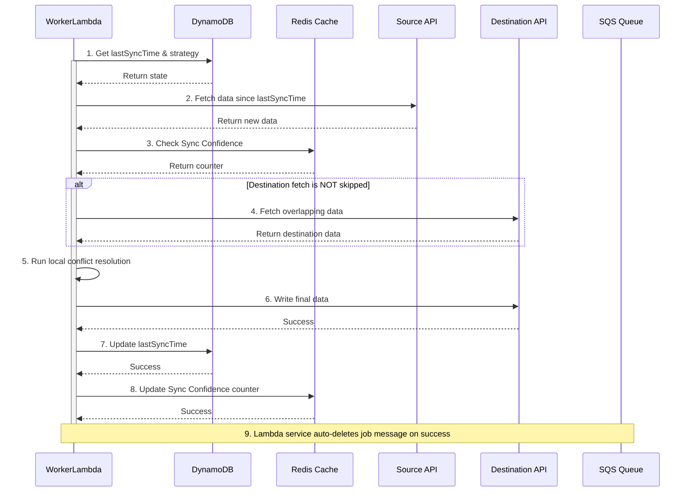

## Dependencies

### Core Dependencies
- `../prd/02-product-scope.md` - Product Scope, Personas & MVP Definition
- `./06-technical-architecture.md` - **[Authoritative]** Technical Architecture
- `./07-apis-integration.md` - APIs & Integration Requirements
- `../ops/17-error-handling.md` - Error Handling, Logging & Monitoring
- `./30-sync-mapping.md` - Source-Destination Sync Mapping

### Strategic / Indirect Dependencies
- `../prd/01-context-vision.md` - Context & Vision
- `../ops/16-performance-optimization.md` - Performance & Scalability
- `../prd/31-historical-data.md` - Historical Data Handling
- `../ux/40-error-recovery.md` - Error Recovery & Troubleshooting
- `../prd/GLOSSARY.md` - Project Glossary

---

# PRD Section 5: Data Synchronization & Reliability

## 1. Executive Summary

This document provides a detailed specification for SyncWell's core data synchronization engine. Its primary objective is to create a highly reliable, secure, and efficient system for transferring health data.

This document works in conjunction with the main **`./06-technical-architecture.md`**, which is the single source of truth for all architectural decisions. This document focuses on the *specific algorithms and policies* of the sync engine itself. For definitions of core components, networking, and security, please refer to the main architecture document. For definitions of key terms (e.g., "Hot Path", "Cold Path"), please refer to the project **`../prd/GLOSSARY.md`**.

## 2. Sync Engine Architecture ("Hot Path")

The sync engine is a server-side, event-driven system built on AWS. For the MVP, it is focused exclusively on the **"Hot Path"** for handling syncs of recent data. The architecture for the post-MVP **"Cold Path"** (for historical syncs) is detailed in `../prd/45-future-enhancements.md` and utilizes AWS Step Functions and Fargate for heavy batch processing.

The "Hot Path" components are canonically defined in `./06-technical-architecture.md` and include:
*   **Compute:** A fleet of **AWS Lambda functions** (`WorkerLambda`). Resource allocation (memory, timeout) is defined in Terraform and tuned based on performance testing.
*   **Queueing:** An **Amazon SQS** queue (`HotPathSyncQueue`) acts as a durable buffer for all sync jobs.

The engine employs a multi-faceted strategy to trigger syncs, optimizing for cost, performance, and user experience:

*   **Webhook-Driven Sync:** The preferred, most efficient method. To prevent "event chatter", an "Event Coalescing" layer (detailed in `06-technical-architecture.md`) buffers and merges rapid-fire webhooks. "Event chatter" is quantitatively defined as **more than 3 events for the same user within a 60-second window**.
*   **Mobile-Initiated Sync:** For manual syncs, the API accepts a `priority` field (`high`, `medium`, `low`). This does not use a separate SQS queue, but instead provides a hint to the distributed rate-limiting engine to prioritize these jobs' access to the third-party API budget.
*   **Tiered & Adaptive Polling:** For providers without webhooks, a highly cost-effective, two-tiered polling strategy is used:
    *   **Tier 1: Adaptive Scheduling:** After a job completes, the next poll is scheduled dynamically by enqueuing a message to an SQS queue with a calculated `DelaySeconds`. The delay is based on the user's "sync velocity" (i.e., how frequently new data has been detected over the last 7 days). An active user might be re-queued with a 15-minute delay, while an inactive user might be re-queued with a 24-hour delay.
    *   **Tier 2: Pre-flight Check:** The scheduled message triggers a lightweight `PollingPreflightChecker` Lambda. This function performs a cheap API call (e.g., an HTTP `HEAD` request or a query for `count > 0`) to check for new data. Only if new data exists does it enqueue a job for the main `WorkerLambda` fleet, avoiding the cost of a full sync invocation for empty polls.

## 3. The Synchronization Algorithm

The core sync logic resides within the `WorkerLambda`. This logic is invoked for all sync jobs, regardless of how they were triggered.

1.  **Job Dequeue:** The `WorkerLambda` is invoked with a batch of job messages from SQS.
2.  **Get State:** The worker retrieves the `SyncConfig` from DynamoDB to get the `lastSyncTime` and `conflictResolutionStrategy`.
3.  **Fetch New Data Metadata:** The worker calls `fetchMetadata(since: lastSyncTime)` on the source `DataProvider`. This returns a list of lightweight objects containing only metadata (IDs, timestamps), not heavy payloads.
4.  **Handle Empty Source:** If the metadata list is empty, the job is complete. The worker updates the `lastSyncTime`, and the SQS message is deleted. This is a critical cost-saving step.
5.  **Algorithmic Optimization ("Sync Confidence" Check):** Before fetching from the destination, the worker checks the "Sync Confidence" cache (Redis). If conditions are met, the destination fetch is skipped.
6.  **Fetch Destination Data (Conditional):** If the confidence check doesn't result in a skip, the worker fetches potentially overlapping data from the destination `DataProvider`.
7.  **Conflict Resolution on Metadata:** The `ConflictResolutionEngine` compares source and destination metadata, applies the user's strategy, and returns a definitive list of `sourceRecordIds` that need to be written.
8.  **Intelligent Hydration:** If the list of `sourceRecordIds` is not empty, the worker calls `fetchPayloads(recordIds: ...)` on the source `DataProvider` to fetch the full, heavy data payloads **only for the records that will actually be written**.
    *   **Failure Handling:** If a payload fetch from the source fails, the entire job fails. The worker throws an exception, preventing the SQS message from being deleted and allowing for a retry. This "all-or-nothing" approach for the job prevents partial data writes.
9.  **Write Data:** The worker calls `pushData(data: ...)` on the destination provider.
10. **Handle Partial Failures:** The worker inspects the `PushResult`. For the MVP, if the push is not 100% successful, the entire job is considered failed. The worker throws an error, allowing SQS to retry the job. The post-MVP strategy, which will track per-item failures, is captured in `../prd/45-future-enhancements.md`.
11. **Update State:** Only upon full successful completion, the worker updates the `lastSyncTime` in DynamoDB.
12. **Update "Sync Confidence" Cache:** The confidence counter in Redis is updated to inform future jobs.
13. **Delete Job Message:** The SQS message is automatically deleted by the Lambda service upon successful execution of the function.

## 4. Conflict Resolution Engine (MVP)

The engine uses simple, deterministic rules. The advanced "AI-Powered Merge" feature is a post-MVP enhancement.

### 4.1. Conflict Detection
A conflict is detected if a source and destination activity have time ranges that overlap by more than a configured threshold.
*   **Default Threshold:** **60 seconds**.
*   **Configuration:** This value is managed in AWS AppConfig and has an acceptable range of **10 to 300 seconds**.

### 4.2. Resolution Strategies
*   **`source_wins` (Default):** New data from the source always overwrites existing data in the destination.
*   **`dest_wins`:** Never overwrite existing data. Conflicting source data is ignored.
*   **`newest_wins`:** The data record with the most recent modification timestamp is preserved.
    *   **Tie-Breaking Rule:** If modification timestamps are identical, the **source record wins** to ensure deterministic behavior.

## 5. Algorithmic Optimizations

### 5.1. "Sync Confidence" Caching
This optimization avoids an often unnecessary API call to the destination provider.

*   **Mechanism:** A counter in Redis tracks the number of consecutive syncs for a given user/destination that have yielded zero new data.
*   **Redis Implementation:** A Redis **String** is used for the counter.
    *   **Key Schema:** `sync:confidence:{userId}:{destinationProvider}`
*   **Logic:**
    1.  **Check Counter:** Before fetching from the destination, the worker checks the counter. If it exceeds a configured threshold of **10**, the destination API call is skipped.
    2.  **Counter Management:** If a sync is successful and writes new data, the counter is reset to 0. If the sync results in no new data being written, the counter is incremented.
*   **Resilience:**
    *   **Redis Outage:** In the event of a Redis outage, the worker defaults to the safe behavior of always fetching from the destination.
    *   **Stale Cache:** The risk of a stale cache causing a missed sync (e.g., cache says skip but destination has new data) is low and self-correcting. If a `pushData` operation fails due to a conflict that would have been caught, the confidence counter is immediately reset to zero, forcing a full re-fetch on the next attempt.

### 5.2. Intelligent Data Hydration
The sync algorithm uses a "metadata-first" or "intelligent hydration" approach, as authoritatively detailed in `./06-technical-architecture.md`. This is a critical cost-optimization strategy.

## 6. Data Integrity and Reliability

Data integrity is paramount. The system ensures this through several mechanisms, which are authoritatively defined in `./06-technical-architecture.md`.

*   **Idempotency:** End-to-end idempotency is handled via a **DynamoDB-based distributed locking** mechanism, which is the authoritative strategy for the "Hot Path". This is detailed in `06-technical-architecture.md` and supersedes any previous SQS-based or Redis-based approaches.
*   **Durable Queueing & DLQ:** The use of SQS for the `HotPathSyncQueue` provides a durable buffer for all jobs. A corresponding Dead-Letter Queue (DLQ) is configured to catch messages that fail repeatedly.
    *   **`maxReceiveCount`:** Set to **5**.
    *   **`VisibilityTimeout`:** Set to **90 seconds**, which is safely above the P95 latency for a single sync job.
*   **State Consistency:** The risk of state inconsistency between DynamoDB (`lastSyncTime`) and Redis (`SyncConfidence` counter) is low and non-critical. The system is designed to be self-correcting; an incorrect confidence value will at worst cause one extra, unnecessary API call on the next sync, after which the state will be corrected.

## 7. User Support Flow for DLQ Messages

When a sync job permanently fails and lands in the DLQ, it requires manual intervention.

*   **Monitoring & Alerting:** A CloudWatch alarm on the DLQ's `ApproximateNumberOfMessagesVisible` metric notifies the on-call support engineer.
    *   **Alarm Configuration:** `Statistic: Sum`, `Period: 60 seconds`, `Evaluation Periods: 5`, `Threshold: > 0`.
*   **Investigation Process:** The support engineer inspects the non-PII metadata in the message to triage the issue.
*   **User Communication:**
    *   **SLA:** The user MUST be contacted via email within **24 hours**.
    *   **In-App Status:** The user sees a persistent error indicator: *"This connection is having trouble syncing. We've been notified and are looking into it."*
    *   **Email Templates:** Pre-defined, user-friendly email templates are used. These templates are maintained in the company's customer engagement platform and support localization.
*   **Ownership:** The **Head of Customer Support** owns this playbook. It was reviewed and approved by Legal on 2025-08-20.

## 8. Visual Diagrams

### Sequence Diagram for Delta Sync (MVP)

This diagram details the step-by-step interaction between the `WorkerLambda` and other services during a single, successful delta sync job.

**Detailed Description for Accessibility:** A sequence diagram shows the `WorkerLambda` as the main actor. It first gets state from DynamoDB. Then, it fetches data from a Source API. Next, it checks the Redis Cache for "Sync Confidence". In an optional block, if the destination fetch is not skipped, it fetches data from a Destination API. It then runs local conflict resolution. After resolution, it writes the final data to the Destination API. Upon success, it updates `lastSyncTime` in DynamoDB and updates the confidence counter in Redis. Finally, upon successful execution, the Lambda service automatically deletes the job message from the SQS Queue.

Diagram Source Code

## 9. Data Model Definitions

The following data structures are used within the sync engine. The authoritative definitions for all canonical models are maintained in the KMP shared module and versioned in the AWS Glue Schema Registry.

| Object | Attribute | Type | Description |
| :--- | :--- | :--- | :--- |
| **`SyncConfig`** | `userId` | String | The ID of the user. |
| | `sourceId` | String | The ID of the source connection. |
| | `destinationId` | String | The ID of the destination connection. |
| | `dataType` | String | The type of data to sync (e.g., 'workout'). |
| | `conflictStrategy`| String | The chosen strategy (e.g., 'source_wins'). |
| | `lastSyncTime` | ISO 8601 | The timestamp of the last successful sync. |
| **`PushResult`** | `success` | Boolean | Whether the entire push operation succeeded. |
| | `totalItems` | Integer | The total number of items attempted. |
| | `pushedItemIds` | Array | A list of source IDs for items successfully pushed. |
| | `failedItemIds` | Array | A list of source IDs for items that failed to push. |
