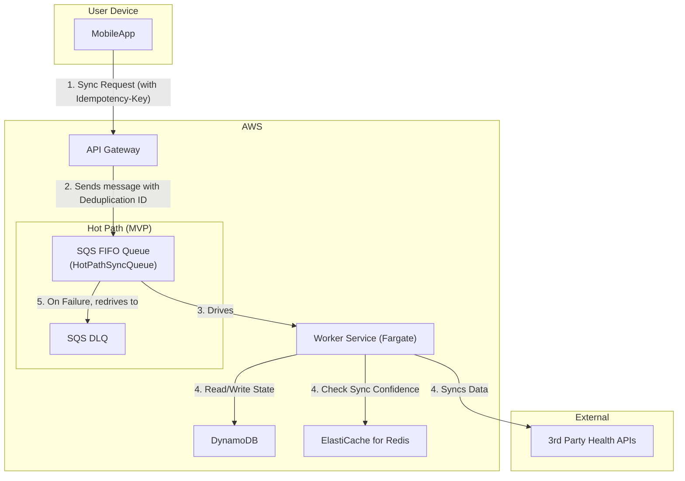
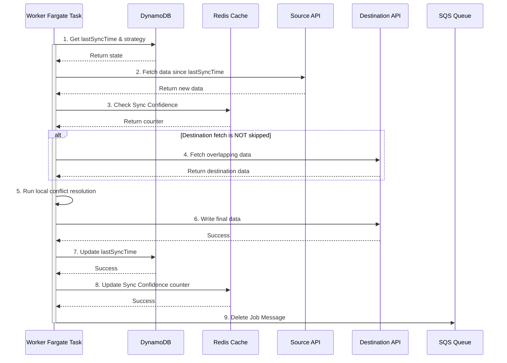
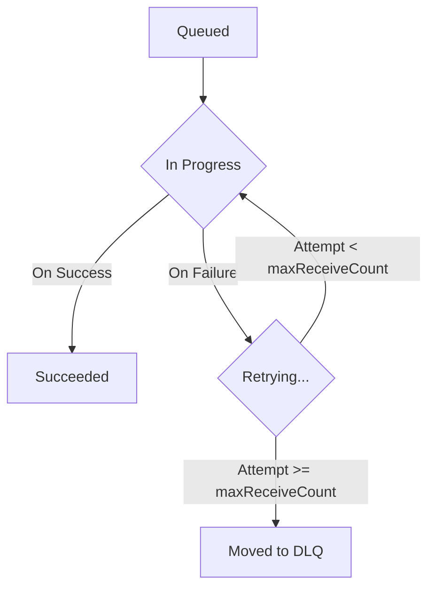
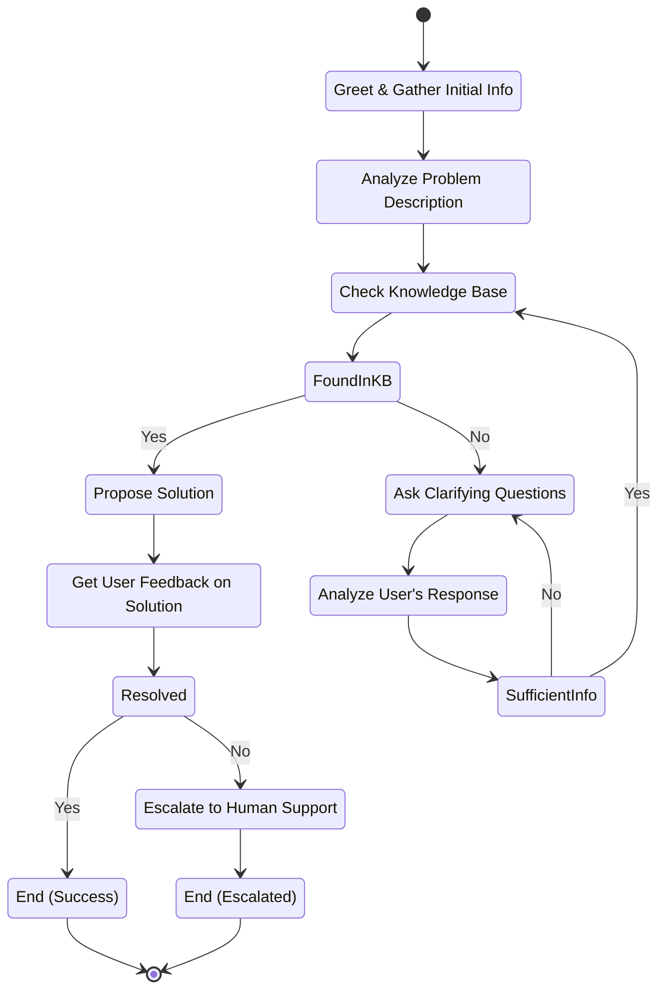

## Dependencies

### Core Dependencies
- `../prd/02-product-scope.md` - Product Scope, Personas & MVP Definition
- `./06-technical-architecture.md` - Technical Architecture
- `./07-apis-integration.md` - APIs & Integration Requirements
- `../ops/17-error-handling.md` - Error Handling, Logging & Monitoring
- `./30-sync-mapping.md` - Source-Destination Sync Mapping

### Strategic / Indirect Dependencies
- `../prd/01-context-vision.md` - Context & Vision
- `../ops/16-performance-optimization.md` - Performance & Scalability
- `../prd/31-historical-data.md` - Historical Data Handling
- `../ux/40-error-recovery.md` - Error Recovery & Troubleshooting

---

# PRD Section 5: Data Synchronization & Reliability

## 1. Executive Summary

This document provides the detailed technical and functional specification for SyncWell's core data synchronization engine. The primary objective is to create a highly reliable, secure, and efficient system for transferring health data. The success of the entire application is fundamentally dependent on the robustness and integrity of this engine.

This document serves as a blueprint for the **product and engineering teams**, detailing the specific architecture, algorithms, and policies required. A well-defined sync engine is the most critical and complex component of the project; this specification aims to de-risk its development by providing a clear and comprehensive plan.

## 2. Sync Engine Architecture (MVP)

The data synchronization engine for the MVP is a server-side, event-driven system built on AWS, as defined in `./06-technical-architecture.md`. The architecture is designed for reliability and is focused exclusively on the **"Hot Path"** for handling syncs of recent data. It incorporates a multi-faceted sync strategy to optimize for cost and performance:
*   **Webhook-Driven Sync with Event Coalescing:** For providers that support webhooks, this model provides near real-time updates while minimizing cost. It uses a dedicated SQS queue to buffer and coalesce incoming events, preventing "event chatter" and reducing downstream load.
*   **Mobile-Initiated Sync:** For manual syncs or device-native integrations (e.g., HealthKit), the mobile app makes a direct API call that places a job onto a high-priority SQS FIFO queue.
*   **Adaptive Polling:** For providers without webhooks, an intelligent adaptive polling mechanism is used to adjust sync frequency based on user activity, reducing the number of "empty" polls.

These strategies are detailed in the main technical architecture document.

*   **Hot Path (for Real-time Syncs):** This path is optimized for low-latency, high-volume, short-lived sync jobs. It uses an SQS FIFO queue to reliably buffer requests and prevent duplicate processing.
*   **Post-MVP (Cold Path):** The architecture for long-running historical data backfills (the "Cold Path") is a post-MVP feature. The detailed design, which uses AWS Step Functions, is captured in `../prd/45-future-enhancements.md`.

The core components for the MVP are:
*   **`API Gateway`:** The public-facing entry point. For mobile-initiated syncs, it uses a **direct AWS service integration** to send messages to the SQS FIFO queue, a critical cost and performance optimization.
*   **`SQS FIFO Queue (`HotPathSyncQueue`)`:** A primary, durable SQS FIFO queue that acts as a critical buffer for real-time sync jobs, absorbing traffic spikes and providing exactly-once processing guarantees.
*   **`SQS Dead-Letter Queue (DLQ)`:** A secondary SQS queue configured as the DLQ for the primary queue. If a `WorkerFargateTask` fails to process a message after multiple retries, SQS automatically moves the message here for analysis.
*   **`Worker Service (AWS Fargate)`:** The heart of the engine. A containerized service running on AWS Fargate that contains the core sync logic, invoked by SQS messages.
*   **`DataProvider` (Interface):** A standardized interface within the worker code that each third-party integration must implement.
*   **`Conflict Resolution Engine`:** A component within the worker that resolves data conflicts using simple, deterministic rules.
*   **`DynamoDB`:** The `SyncWellMetadata` table stores all essential state for the sync process.

## 3. The Synchronization Algorithm

The core sync logic resides within the `Worker Fargate Task`. This logic is invoked for webhook-driven events and user-initiated syncs. For polling-based providers, this full algorithm is only triggered after a lightweight **"pre-flight check"** confirms that new data is available, preventing wasted work.

The algorithm uses an **"intelligent hydration"** model to minimize data transfer.

1.  **Job Dequeue:** The Fargate task receives a job message (e.g., "Sync Workouts for User X from Strava to Garmin").
2.  **Get State from DynamoDB:** The worker retrieves the `SyncConfig` item to get the `lastSyncTime` and the user's chosen `conflictResolutionStrategy`.
3.  **Fetch New Data Metadata:** The worker calls `fetchMetadata(since: lastSyncTime)` on the source `DataProvider`. This returns a list of lightweight objects containing only metadata (IDs, timestamps), not heavy payloads (like GPX files).
4.  **Handle Empty Source:** If the metadata list is empty, the job is considered complete. The worker updates the `lastSyncTime`, deletes the SQS message, and stops. This is a critical cost-saving step.
5.  **Algorithmic Optimization ("Sync Confidence" Check):** Before fetching from the destination, the worker checks the "Sync Confidence" cache (Redis). If the conflict strategy is `Prioritize Source` or the confidence counter is high, the destination fetch is skipped.

    *   **Detailed "Sync Confidence" Implementation:** To improve the efficiency of the core sync algorithm, the system employs this "Sync Confidence" caching strategy. The default sync behavior fetches data from the destination provider to perform conflict resolution. However, this destination fetch is often unnecessary, and this optimization avoids that fetch under specific conditions.
        *   **Redis Cache:** The `WorkerFargateTask` will use Redis to store a simple integer counter.
        *   **Cache Key Schema:** The key will follow the format `sync:confidence:{userId}:{destinationProvider}`.
        *   **Logic:**
            1.  **Strategy-Based Elimination:** Before a sync job, the worker will check the user's conflict resolution strategy. If it is `source_wins` (the new default, formerly `Prioritize Source`), the destination API call will be skipped entirely.
            2.  **Pattern-Based Elimination:** If the strategy requires a destination check, the worker will check the value of the Redis key. If the counter exceeds a configured threshold of **10**, the destination API call will be skipped.
            3.  **Counter Management:** If the destination API is called and returns data, the counter is reset to 0. If it returns no data, the counter is incremented. If a `pushData` operation later fails due to a conflict (indicating the cache was wrong), the counter is also reset to zero, forcing a re-fetch on the next attempt.
        *   **Configuration:** The threshold for consecutive empty polls (10) will be managed as an environment variable in the `WorkerFargateTask` to allow for tuning without code redeployment.

6.  **Fetch Destination Data for Conflict Resolution (Conditional):** If the confidence check does not result in a skip, the worker fetches potentially overlapping data from the destination `DataProvider`.
7.  **Conflict Resolution on Metadata:** The `Conflict Resolution Engine` is invoked. It compares the source and destination **metadata** and applies the user's chosen strategy. It returns a definitive list of `sourceRecordIds` that need to be written to the destination.
8.  **Intelligent Hydration:** If the list of `sourceRecordIds` to write is not empty, the worker now calls `fetchPayloads(recordIds: sourceRecordIds)` on the source `DataProvider`. This fetches the full, heavy data payloads **only for the records that will actually be written**.
9.  **Write Data:** The worker calls `pushData(data: hydratedData)` on the destination provider with the fully hydrated data objects.
10. **Handle Partial Failures:** The worker inspects the `PushResult`. For the MVP, if the push is not completely successful, the entire job is considered failed. The worker throws an error, allowing SQS to retry the job.
11. **Update State in DynamoDB:** Only upon full successful completion, the worker performs an `UpdateItem` call to set the new `lastSyncTime`.
12. **Update "Sync Confidence" Cache:** The confidence counter in Redis is updated based on the sync outcome to inform future jobs.
13. **Delete Job Message:** The worker deletes the job message from the SQS queue to mark it as complete.

## 4. Conflict Resolution Engine (MVP)

For the MVP, the engine is designed to be simple, reliable, and deterministic. It offers a limited set of rules-based strategies. The advanced "AI-Powered Merge" feature is a post-MVP enhancement, with its design captured in `../prd/45-future-enhancements.md`.

### 4.1. Conflict Detection Algorithm

A conflict is detected if a `source` activity and a `destination` activity have time ranges that overlap by more than a configured threshold (defaulting to **60 seconds**). This threshold is a global setting managed in AWS AppConfig.

### 4.2. Resolution Strategies (MVP)

*   **`source_wins` (Default):** New data from the source platform will always overwrite any existing data in the destination for the same time period.
*   **`dest_wins`:** Never overwrite existing data. If a conflicting entry is found in the destination, the source entry is ignored.
*   **`newest_wins`:** The data record (source or destination) with the most recent modification timestamp is preserved.

## 5. Data Integrity

*   **Durable and Exactly-Once Queueing:** The `HotPathSyncQueue` is configured as an **Amazon SQS FIFO (First-In, First-Out) queue**. This guarantees that sync jobs are processed in the order they are received and, critically, provides native, content-based deduplication.
*   **Idempotency:** To prevent duplicate processing from client retries, the system leverages the native deduplication feature of SQS FIFO queues. The client-generated `Idempotency-Key` (passed in the API header) is used as the `MessageDeduplicationId` when the message is sent to SQS. This ensures that a retried API call will not result in a duplicate job being processed within the 5-minute deduplication window, which is a simpler and more cost-effective solution than a separate application-level lock.
*   **Transactional State:** State updates in DynamoDB are atomic. The `lastSyncTime` is only updated if the entire write operation to the destination platform succeeds.
*   **Dead Letter Queue (DLQ):** If a job fails repeatedly (e.g., due to a persistent third-party API error), SQS will automatically move it to a DLQ. This allows for manual inspection and debugging without blocking the main queue.

## 6. Historical Data Sync (Post-MVP)

Handling a user's request to sync several years of historical data is a key feature planned for a post-MVP release. It requires a more complex "Cold Path" architecture using AWS Step Functions to ensure reliability over long-running jobs. The detailed specification for this feature is deferred and captured in `../prd/45-future-enhancements.md`.

## 7. User Support Flow for DLQ Messages

When a sync job permanently fails and is moved to the Dead-Letter Queue (DLQ), it represents a failure that the system could not automatically resolve. These cases require manual intervention and clear user communication.

*   **Monitoring & Alerting:** An AWS CloudWatch alarm MUST be configured to trigger when the `ApproximateNumberOfMessagesVisible` metric for the DLQ is greater than zero. This alarm will notify the on-call support engineer via PagerDuty.
*   **Investigation Process:**
    1.  The support engineer will manually inspect the message contents in the DLQ to identify the `userId`, `connectionId`, and the error message.
    2.  The engineer will use this information to look up the error details in the centralized logging system (e.g., CloudWatch Logs).
    3.  The goal is to determine if the failure is due to a bug in SyncWell, an issue with a third-party API, or a problem with the user's account (e.g., corrupted data at the source).
*   **User Communication & SLA:**
    *   **SLA:** The user MUST be contacted within **24 hours** of the initial failure.
    *   **Communication:** The user will be contacted via email. The support ticket will be tracked in the primary CRM (e.g., Zendesk). The communication should be transparent, explaining that a sync failed and that the team is investigating.
    *   **Resolution:** Once the root cause is identified, the support engineer will work to resolve the issue. This may involve asking the user to re-authenticate their connection or, in the case of a bug, creating a high-priority ticket for the engineering team.
*   **[NEEDS_CLARIFICATION: Q-06] Legal & Compliance Review:** The process of manually inspecting user sync jobs, even if it only involves metadata, has privacy implications. This entire DLQ handling and user notification process MUST be reviewed by a legal and data privacy expert before the system is launched to ensure compliance with regulations like GDPR.
*   **[REC-MED-04] Draft User Support Playbook for DLQ:**
    *   **Objective:** To provide a clear, step-by-step process for support engineers to resolve failed sync jobs from the DLQ.
    *   **Triage Steps:**
        1.  **Identify Error Type:** From the PagerDuty alert, open the message in the SQS DLQ console. Examine the `errorMessage` attribute.
        2.  **Check for Known Issues:** Search the internal knowledge base (e.g., Confluence) for the error message to see if this is a known, ongoing incident.
        3.  **Categorize the Error:**
            *   **Category 1: Third-Party API Failure (e.g., `5xx` error from a partner API):** Check the partner's public status page. If there is a known outage, link the support ticket to the master incident ticket. No immediate user action is needed beyond the initial notification.
            *   **Category 2: Bad Data (e.g., `400 Bad Request`):** This indicates a likely bug in our `DataProvider` (we sent malformed data) or an unannounced breaking change in the partner's API. This is high priority. The message should be re-queued for processing later, and a P1 bug ticket must be filed with the full message payload for engineering to analyze.
            *   **Category 3: Authentication Failure (e.g., `401 Unauthorized`):** This should be rare, as the main error handling flow should catch this. If it appears in the DLQ, it may indicate a bug in our auth error handling. The user may need to be prompted to reconnect, but engineering should investigate the root cause.
    *   **Communication Templates:**
        *   **Initial Contact (24hr SLA):** "Hi [User], we're writing to let you know that a recent data sync from [Source] to [Destination] failed due to an unexpected error. Our engineering team is investigating the issue. We will update you as soon as we have more information. We apologize for the inconvenience."
        *   **Resolution (Bug Fix):** "Hi [User], we've resolved the issue that caused your sync to fail. We have re-processed the data, and everything should now be up to date. Please let us know if you see any other problems."
        *   **Resolution (User Action Needed):** "Hi [User], to resolve the issue with your [Source] connection, please go to Settings > Connected Apps in the SyncWell app, disconnect [Source], and then reconnect it. This will refresh your credentials and should fix the problem."

## 8. Visual Diagrams

### Sync Engine Architecture (MVP)
This diagram illustrates the flow of a real-time sync request initiated by a mobile client. The components are designed to be decoupled, scalable, and resilient, with a focus on cost-efficiency.

1.  **Request Initiation (`MobileApp`)**: The user initiates a sync from the mobile application. The app sends a secure HTTPS request to the API Gateway endpoint, including a unique `Idempotency-Key` header.
2.  **Ingestion & Queueing (`API Gateway` -> `HotPathSyncQueue`)**: The API Gateway validates the request. Using a direct AWS service integration, it sends the job message directly to the `HotPathSyncQueue`. This bypasses AWS Lambda or EventBridge for the ingestion step, significantly reducing cost and latency. The `Idempotency-Key` from the header is passed as the `MessageDeduplicationId`.
3.  **Processing (`HotPathSyncQueue` -> `WorkerFargateTask`)**: The `HotPathSyncQueue` is an SQS FIFO queue, which provides exactly-once processing and acts as a durable buffer. It is polled by the `WorkerFargateTask`, a containerized service that contains the core sync logic.
4.  **State Management & Data Sync (`WorkerFargateTask` -> `DynamoDB`, `Redis`, `ThirdPartyAPIs`)**: The worker reads/writes state from DynamoDB, checks the "Sync Confidence" cache in Redis, and communicates with external third-party APIs.
5.  **Fault Tolerance (`HotPathSyncQueue` -> `DLQ_SQS`)**: If the `WorkerFargateTask` fails to process a message after multiple retries, SQS automatically moves the message to the Dead-Letter Queue (`DLQ_SQS`) for manual inspection.

### Sequence Diagram for Delta Sync (MVP)

This diagram details the step-by-step interaction between the `Worker Fargate Task` and other services during a single, successful delta sync job, including the "Sync Confidence" optimization.

1.  **Get State**: The worker begins by retrieving the `SyncConfig` item from DynamoDB to get the `lastSyncTime` and `conflictResolutionStrategy`.
2.  **Fetch from Source**: The worker fetches new data from the source provider since the `lastSyncTime`.
3.  **Check Sync Confidence**: The worker queries the Redis cache to check the "Sync Confidence" counter. If the strategy is `source_wins` or the counter is high, it skips the next step.
4.  **Fetch from Destination (Conditional)**: If the confidence check did not result in a skip, the worker fetches overlapping data from the destination provider.
5.  **Resolve Conflicts**: The `Conflict Resolution Engine` runs, using destination data only if it was fetched.
6.  **Write to Destination**: The worker pushes the final, conflict-free data to the destination provider.
7.  **Update State**: After a successful write, the worker updates the `lastSyncTime` in DynamoDB.
8.  **Update Sync Confidence**: The worker increments or resets the confidence counter in Redis based on the outcome.
9.  **Acknowledge Completion**: The worker deletes the message from the SQS queue to mark the job as complete.

### Lifecycle of a Hot Path Sync Job Message
*(This diagram illustrates the lifecycle of a single message in the SQS queue, not an AWS Step Functions state machine)*

The following steps detail the journey of a single sync job message, ensuring reliability and fault tolerance through the native features of Amazon SQS.

1.  **Queued:** A `RealtimeSyncRequested` event is routed to the primary SQS queue. The message is now durably stored and waiting to be processed by a worker.
2.  **In Progress:** A `WorkerFargateTask` instance polls the queue and receives the message. Upon receipt, SQS makes the message temporarily invisible to other consumers for a configured `VisibilityTimeout` period. This prevents other workers from processing the same job simultaneously.
3.  **Succeeded:** If the `WorkerFargateTask` successfully completes all steps of the synchronization algorithm (fetching, resolving conflicts, writing data, and updating state), it makes an explicit call to SQS to delete the message from the queue. This marks the job as complete.
4.  **Retrying:** If the worker encounters a transient error (e.g., a temporary network issue, a brief third-party API outage) or a bug, it will throw an exception. It does **not** delete the message. When the `VisibilityTimeout` expires, the message reappears in the queue and can be picked up by another worker for a new attempt. SQS automatically increments the message's internal `ReceiveCount`.
5.  **Moved to DLQ:** The SQS queue is configured with a `maxReceiveCount` threshold (e.g., 5 attempts). If a message fails to be processed successfully after this many attempts, SQS automatically gives up and moves the message to the configured Dead-Letter Queue (DLQ). This "poison pill" handling prevents a single, consistently failing job from blocking the entire sync pipeline. The DLQ can then be inspected by support engineers to diagnose the root cause of the failure.

## 9. Research & Recommendations on AI/Agentic Workflows

As part of a research spike, we evaluated several tools to enhance the project's AI capabilities, specifically for the `AI Insights Service`.

*   **Tools Considered:**
    *   **n8n:** A workflow automation tool. Evaluated as not suitable for the core product's real-time, custom-coded sync engine.
    *   **LangChain:** A framework for developing LLM-powered applications. This was already included in the technical architecture and remains the recommended tool for straightforward LLM interactions (like generating user summaries).
    *   **crewAI:** A framework for orchestrating multiple collaborating AI agents. Evaluated as overkill for the current scope of AI features.
    *   **LangGraph:** An extension of LangChain for building stateful, multi-step AI agents.

*   **Recommendation:**
    *   We recommend **LangGraph** for implementing the `Interactive AI Troubleshooter` feature, as specified in `./06-technical-architecture.md` and `../../24-user-support.md`.
    *   **Rationale:** LangGraph's ability to model conversational flows as a graph is a perfect fit for a troubleshooting agent that needs to ask clarifying questions, remember context, and guide a user through a decision tree. This provides a more robust and powerful user experience than a simple, single-call LLM.
    *   **[C-003]** The diagram below illustrates the proposed state machine for the LangGraph-based AI Troubleshooter.

### AI Troubleshooter State Machine (LangGraph)

The state machine below represents the agent's internal logic. Each node is a step in the process, and the edges represent the flow of conversation based on conditions and user input. The agent's state (e.g., conversation history, extracted entities) is passed between nodes.

1.  **Greet & Gather Info (`GreetUser`)**: The graph's entry point. The agent greets the user and prompts for their issue, establishing the initial conversation state.

2.  **Analyze & Check KB (`AnalyzeProblem`, `CheckKB`)**: This node uses an LLM to analyze the user's free-text problem description. It extracts key entities (e.g., provider names, error messages) and then uses a `Tool` to perform a semantic search against a vector database of our Help Center articles and known issues.

3.  **Decision: Found in KB? (`FoundInKB`)**: This is a conditional edge. Based on the search results from the previous step, the graph routes the conversation:
    *   **Yes:** If a high-confidence match is found, the flow proceeds to `ProposeSolution`.
    *   **No:** If no relevant information is found, the agent needs more context and moves to `AskClarifyingQuestion`.

4.  **Clarification Loop (`AskClarifyingQuestion` -> `AnalyzeUserResponse` -> `SufficientInfo`)**: This is a sub-cycle to gather more information.
    *   The agent uses an LLM to generate a targeted question based on the conversation history.
    *   After the user responds, the new information is added to the state.
    *   A conditional edge (`SufficientInfo`) determines if the agent should re-attempt the KB search (`CheckKB`) or if it needs to ask another question.

5.  **Propose & Verify (`ProposeSolution` -> `GetUserFeedback`)**: The agent presents the potential solution from the knowledge base and asks the user if it worked.

6.  **Decision: Resolved? (`Resolved`)**: This is the final conditional edge based on the user's feedback.
    *   **Yes:** The conversation moves to the `EndSuccess` terminal state.
    *   **No:** The issue is escalated. The agent proceeds to `EscalateToHuman`.

7.  **Escalate to Human (`EscalateToHuman`)**: This node's job is to prepare a seamless handoff. It uses an LLM to generate a concise summary of the entire interaction (user's problem, steps taken, failed solution). This summary is then used to pre-populate a support ticket, which is then passed to the `EndEscalated` state.

