# Technical Architecture

> **DOCUMENT STATUS: SINGLE SOURCE OF TRUTH**
> This document is the single, authoritative source of truth for the SyncWell technical architecture. All other PRDs, architectural documents, and operational runbooks **must** align with the decisions, patterns, and diagrams specified here. Where contradictions exist, this document takes precedence.

## 0. Document Management

### Version History
| Version | Date       | Author(s) | Summary of Changes                                                                                                                                                                                              |
| :--- | :--- | :--- |:----------------------------------------------------------------------------------------------------------------------------------------------------------------------------------------------------------------|
| 1.0 | 2025-08-12 | J. Doe | Initial Draft                                                                                                                                                                                                   |
| 1.1 | 2025-08-19 | J. Doe | Incorporated feedback review. Addressed over 150 points of ambiguity, inconsistency, and risk.                                                                                                   |
| 1.2 | 2025-08-21 | J. Doe (AI) | Resolved all contradictions (Lambda/Fargate, Idempotency). Addressed ~80 issues review, adding specificity to undefined values, resolving clarifications, and restructuring appendices into separate documents. |
| 1.3 | 2025-08-22 | J. Doe (AI) | Addressed all remaining open issues from f-2.md. Finalized all technical specifications, added rationales, clarified diagrams, and assigned ownership for all processes. Document is now considered complete and approved. |

### Document Conventions
*   **ID Prefixes:** To improve traceability, the following prefixes are used for key decisions, risks, and trade-offs:
    *   `S-`: Strategic Decision
    *   `R-`: Risk
    *   `T-`: Technical Trade-off
    *   `C-`: API or Data Contract
    *   `U-`: User Experience Impact

### Consolidated Assumptions
A consolidated list of all key project assumptions is maintained in the root [`README.md`](../../../README.md) file.

### Cross-Cutting Concerns
*   **Traceability to User Stories:** While this document is technically focused, key architectural decisions should trace back to user stories in `../prd/04-user-stories.md`. A formal Requirements Traceability Matrix, owned by the **Project Management Office**, is maintained in **`../../reports/rtm/repository_traceability_matrix.md`** to ensure all requirements are met and tested.
*   **Accessibility (A11y):** All user-facing components, including API error messages and push notifications, must adhere to WCAG 2.1 AA standards.
*   **Internationalization (i18n) & Localization (L10n):** All user-facing strings (error messages, notifications) must be stored in resource files and not hard-coded, to support future localization efforts. The default language for the application is **`en-US` (American English)**.

## Dependencies

### Core Dependencies
- `./05-data-sync.md` - Data Synchronization & Reliability
- `./07-apis-integration.md` - APIs & Integration Requirements
- `../ops/17-error-handling.md` - Error Handling, Logging & Monitoring
- `../ops/18-backup-recovery.md` - Backup & Disaster Recovery
- `../security/19-security-privacy.md` - Security & Privacy
- `./30-sync-mapping.md` - Sync Mapping
- `../prd/31-historical-data.md` - Historical Data Handling
- `../prd/33-third-party-integration.md` - Third-Party Integration Considerations
- `../prd/34-data-export.md` - Data Export
- `../prd/35-data-import.md` - Data Import
- `../ops/39-performance-metrics.md` - Performance & Metrics
- `../costs/66-costs-model.md` - Costs Model

### Strategic / Indirect Dependencies
- `../prd/01-context-vision.md` - Context & Vision
- `../prd/02-product-scope.md` - Product Scope, Personas & MVP Definition
- `../ux/08-ux-onboarding.md` - UX Onboarding
- `../ux/09-ux-configuration.md` - UX Configuration
- `../qa/14-qa-testing.md` - QA & Testing
- `../qa/15-integration-testing.md` - Integration & End-to-End Testing
- `../prd/21-risks.md` - Risks & Mitigation
- `../ops/25-release-management.md` - Release Management & Versioning
- `../ops/44-contingency-planning.md` - Contingency & Rollback Plans
- `../prd/45-future-enhancements.md` - Future Enhancements & Roadmap Expansion

---

## 1. Executive Summary

This document specifies the complete technical architecture for the SyncWell application. The architecture is designed for **high availability**, **scalability to support 1 million Daily Active Users**, and **robust security**. It adheres to modern cloud-native principles and is engineered for developer velocity and operational excellence.
*   **High Availability:** >99.9% monthly uptime, measured by a combination of CloudWatch Synthetics for key API endpoints and business-level metrics for sync success rate.
*   **Scalability:** Support for 1 million Daily Active Users and a peak load of 3,000 requests per second across all core API endpoints for a sustained period of 5 minutes.

> **[S-003] [ARCH-DECISION-01] KEY ARCHITECTURAL DECISION: HYBRID COMPUTE MODEL (LAMBDA & FARGATE)**
> The architecture employs a **hybrid compute model** that uses the right tool for the job.
> *   **Real-time "Hot Path":** For frequent, short-lived syncs of recent data, the architecture uses **AWS Lambda**. This provides massive scalability and cost-effectiveness for event-driven workloads.
> *   **Asynchronous "Cold Path":** For long-running, resource-intensive jobs like historical data backfills and bulk data exports, the architecture uses **AWS Fargate**. This provides a cost-effective and predictable performance profile for heavy batch processing.
> This hybrid approach, detailed in Sections 3b and 4, optimizes for both cost and performance across the system's diverse workloads.

We will use the **C4 Model** as a framework to describe the architecture. The core architectural principles are **modularity**, **security by design**, and **privacy by default**. A key feature is its **hybrid sync model**, which is necessitated by platform constraints. It combines a serverless backend for cloud-to-cloud syncs with on-device processing for integrations that require native SDKs (e.g., Apple HealthKit), maximizing reliability and performance. Post-MVP, the architecture can be extended to include more advanced features like historical data backfills and an AI Insights Service. The design concepts for these are captured in `../prd/45-future-enhancements.md`. The initial focus for the MVP, however, will be on a **robust sync engine** for recent data, made reliable through a unified idempotency strategy and resilient error handling.

## 2. Architectural Model (C4)

This document provides Level 1 (System Context), Level 2 (Containers), and Level 3 (Components) of the C4 model. Level 4 (Code) diagrams are considered out of scope for this high-level architectural document and are expected to exist within the source code repositories themselves. The following sections describe an architecture for an MVP, which requires balancing feature completeness with time-to-market, cost, and operational readiness. Key decisions are framed with this balance in mind, prioritizing a robust and scalable core while deferring some production-hardening optimizations to post-MVP phases.

### Level 1: System Context

This diagram shows the system in its environment, illustrating its relationship with users and external systems.

*(See Diagram 1 in the "Visual Diagrams" section below.)*

### Level 2: Containers

This level zooms into the system boundary to show the high-level technical containers for the MVP. The architecture is focused on a low-latency **"hot path"** for handling real-time syncs of recent data. The core business logic for this path resides in a fleet of **AWS Lambda functions**, promoting code reuse and scalability. A core technology used is **Kotlin Multiplatform (KMP)**, which allows for sharing this worker logic between the mobile application and the backend.

Designs for post-MVP features like the "cold path" for historical syncs have been deferred and are captured in `../prd/45-future-enhancements.md`.

**Note on Diagram Clarity:** The following diagram is a high-level overview for the MVP. It omits secondary components like the S3 bucket for archiving DLQ messages (`syncwell-prod-dlq-archive`) and post-MVP components like the AI Insights Service. The DLQ archive bucket will be configured with a specific lifecycle policy: **transition objects to S3 Glacier Instant Retrieval after 90 days and delete them after 365 days.**

**Security Note:** To avoid clutter, IAM roles are not explicitly drawn. However, a foundational security principle of this architecture is that *all inter-service communication is secured via least-privilege IAM roles*.

*(See Diagram 2 in the "Visual Diagrams" section below.)*

1.  **Mobile Application (Kotlin Multiplatform & Native UI)**
    *   **Description:** The user-facing application that runs on iOS or Android. It handles all user interactions and is a key component of the hybrid sync model.
    *   **Technology:** Kotlin Multiplatform (KMP) for shared business logic, SwiftUI for iOS, Jetpack Compose for Android.
    *   **Responsibilities:** Provides the UI, integrates with the Firebase Authentication SDK to manage the user sign-up/sign-in flows, securely stores JWTs using the platform's **Keychain (iOS) or Keystore (Android)**, and handles on-device syncs (e.g., HealthKit).
    *   **Error Handling:** If the Keychain/Keystore is unavailable, the application must display a non-dismissible error message to the user and prevent any sync operations from occurring until the issue is resolved.
    *   **JWT Refresh Strategy:** The mobile application will proactively refresh the 1-hour JWT in the background approximately 5 minutes before it expires to ensure a seamless user experience.

2.  **Authentication Service (Firebase Authentication)**
    *   **Description:** A managed, third-party service that handles all aspects of user identity, including sign-up, sign-in, and social provider integration (Google/Apple).
    *   **Technology:** Firebase Authentication (Google Cloud).
    *   **Responsibilities:** Manages user credentials, issues short-lived JWTs with a **1-hour TTL** to the mobile client after a successful authentication event, and provides public keys for backend token verification.

3.  **Scalable Serverless Backend (AWS)**
    *   **Description:** A decoupled, event-driven backend on AWS that uses a fleet of **AWS Lambda functions** for its core business logic to orchestrate all "Hot Path" syncs. This approach, detailed in Section 1's key architectural decision, provides extreme scalability and cost-effectiveness for the system's event-driven workload.
    *   The backend **must not** persist any raw user health data; this critical security requirement will be enforced via a dedicated test case in the QA plan (`../qa/14-qa-testing.md#TC-SEC-01`) and supplemented with automated static analysis rules to detect accidental persistence of sensitive data types. Any temporary diagnostic metadata containing user identifiers is stored in a secure, audited, time-limited index, as detailed in `../security/19-security-privacy.md`. Data is otherwise only processed ephemerally in memory during active sync jobs.
    *   **Technology:** AWS Lambda, API Gateway, **Amazon EventBridge**, **Amazon SQS**, DynamoDB.
    *   **Responsibilities:** The API Layer (**API Gateway**) is responsible for initial request validation (e.g., format), authorization via the `AuthorizerLambda`, and routing requests to the appropriate backend service. It does not handle business-level validation like idempotency checks. To ensure maximum performance and cost-effectiveness, it will leverage **API Gateway's built-in caching for the Lambda Authorizer**. The authorizer's response (the IAM policy) will be cached based on the user's identity token for a **5-minute TTL**. For subsequent requests within this TTL, API Gateway will use the cached policy and will not invoke the `AuthorizerLambda`, dramatically reducing latency and cost. All communication between backend services is secured using granular, least-privilege IAM roles, ensuring a secure-by-default posture.
    *   **Risk:** This caching strategy introduces a known risk: if a user's permissions are revoked, they may retain access for up to the 5-minute TTL of the cached policy. Conversely, a user with newly granted permissions may have to wait up to 5 minutes for access. This trade-off is accepted to achieve the required API performance.

4.  **Distributed Cache (Amazon ElastiCache for Redis)**
    *   **Description:** An in-memory caching layer to improve performance and reduce load on downstream services. The cluster must be **sized to handle 5,000 RPS with a P99 latency of < 10ms**, which is a significant safety threshold above the MVP's peak NFR of 3,000 RPS. Sizing is based on an assumption of **1KB average item size**, derived from analyzing the serialized `UserSyncConfig` objects. The initial cluster will use **`cache.m6g.large`** instances.
    *   **Technology:** Amazon ElastiCache for Redis.
    *   **Responsibilities:**
        *   Caches frequently accessed, non-sensitive data (e.g., user sync configurations).
        *   Powers the rate-limiting engine to manage calls to third-party APIs.

5.  **Monitoring & Observability (AWS CloudWatch)**
    *   **Description:** A centralized system for collecting logs, metrics, and traces from all backend services.
    *   **Technology:** AWS CloudWatch (Logs, Metrics, Alarms), AWS X-Ray.
    *   **Responsibilities:** Provides insights into system health, performance, and error rates. Triggers alarms for critical issues.

6.  **Data Governance & Schema Registry (AWS Glue Schema Registry)**
    *   **Description:** To manage the evolution of our canonical data models (e.g., `CanonicalWorkout`), we will use the AWS Glue Schema Registry. It acts as a central, versioned repository for our data schemas.
    *   **Technology:** AWS Glue Schema Registry.
    *   **Responsibilities:**
        *   Stores all versions of the canonical data model schemas.
        *   **Must** enforce schema evolution rules (specifically **`BACKWARD_ALL`**) within the CI/CD pipeline, preventing the deployment of breaking changes.
        *   **Breaking Change Process:** In the rare event a breaking change is required, it must follow a formal process: 1) A new major version of the schema is published. 2) A new version of the code that can handle both the old and new schemas is deployed. 3) A migration process is run to update existing data or systems. 4) The old schema version is deprecated.
        *   Provides schemas to the worker service (AWS Lambda) for serialization and deserialization tasks, ensuring data conforms to the expected structure.

7.  **Centralized Configuration Management (AWS AppConfig)**
    *   **Description:** To manage dynamic operational configurations and feature flags, we will adopt AWS AppConfig. This allows for safe, audited changes without requiring a full code deployment.
    *   **Technology:** AWS AppConfig.
    *   **Responsibilities:**
        *   Stores and serves feature flags (e.g., enabling a feature for Pro users).
        *   Manages operational parameters such as API timeouts, logging levels, and rate-limiting thresholds.
        *   **Manages critical resource identifiers (e.g., the DynamoDB table name). This is a crucial element of the disaster recovery strategy, allowing the application to be repointed to a restored database table without a code deployment.**
    *   **[R-001] Risk:** Storing critical configuration like the database table name in AppConfig creates a dependency. A failure to access AppConfig at application startup could prevent the service from running. This risk is mitigated by AppConfig's own high availability and our use of aggressive client-side caching within the Lambda functions. However, a prolonged, widespread AppConfig outage remains a **High** impact, low-probability risk, which has been formally accepted by the product owner. The business impact would be the **inability to onboard new users or process syncs for existing users whose configuration is not cached**.
    *   **[T-004] [U-004] Graceful Degradation Strategy:** In the event of a prolonged AppConfig outage where the client-side cache also fails, the application **must** enter a safe, degraded mode.
        *   **Behavior:** The system should operate with sensible, hard-coded default configurations that are bundled with the application (e.g., `defaultLogLevel: "WARN"`, `defaultRateLimit: 10 RPS`).
        *   **Critical Failure:** If a critical value like the DynamoDB table name cannot be retrieved, the service must fail fast and explicitly, logging a critical error.
        *   **User-Facing Message:** No message is shown for using default configs, but if the service fails, the user will see a generic "Something went wrong, please try again later" message. The exact wording and design of this message is defined in the UX documentation.

8.  **Static Asset Delivery (Amazon S3 & CloudFront)**
    *   **Description:** A global content delivery network (CDN) to ensure that all static assets are delivered to users with low latency and high transfer speeds.
    *   **Technology:** Amazon S3, Amazon CloudFront.
    *   **Responsibilities:** Hosts and serves all static assets for the mobile application. The list of assets includes, but is not limited to, provider icons, marketing banners, and tutorial images. The mobile client will fetch these assets directly from the nearest CloudFront edge location, not from the backend service. This is a critical best practice for performance and cost-effectiveness.

9.  **Real-time WebSocket API (API Gateway)**
    *   **Description:** A persistent, stateful connection endpoint for foreground users to provide a near real-time sync experience and reduce load on the asynchronous backend.
    *   **Technology:** API Gateway (WebSocket API), AWS Lambda.
    *   **Responsibilities:** Manages the WebSocket lifecycle (`$connect`, `$disconnect`, `$default`). When a sync is requested over the WebSocket, it is routed to a lightweight `SyncOverSocketLambda`. This Lambda is implemented in **TypeScript on the NodeJS runtime** for optimal performance and low cold-start latency. It can process the sync and return the result directly over the connection. This bypasses the entire SQS/Lambda flow for "hot users," providing lower latency and reducing costs.

### Level 3: Components (Inside the KMP Shared Module)

The KMP module contains the core, shareable business logic. The architectural strategy is to use **KMP for portable business logic** and **platform-native runtimes for performance-critical infrastructure code**.

For the backend, this means the general strategy is to compile the KMP module to a JAR, package it as a Lambda function, and run it on the **AWS Lambda** worker fleet. However, security-critical, latency-sensitive functions like the `AuthorizerLambda` that are not part of the main worker fleet **must** be implemented in a faster-starting runtime. **TypeScript** is the preferred language for these functions due to its strong typing and excellent performance on the NodeJS Lambda runtime. This is a deliberate, non-negotiable trade-off. The P99 latency SLO of <500ms for the entire API Gateway request cannot be reliably met if the authorizer suffers from a multi-second JVM cold start.

*   **[T-001] Trade-off Acceptance:** This decision creates a deliberate contradiction with the project's goal of using a single cross-platform framework (KMP). The complexity of maintaining a hybrid runtime is a formally accepted technical trade-off, made to meet the non-functional requirement for API latency. The estimated maintenance overhead is **~4 engineering hours per month** for dependency updates and context switching.

*   **`SyncManager`:** Orchestrates the sync process.
    *   **Inputs:** `SyncConfig` object (defined in `05-data-sync.md`), `DataProvider` instances for source and destination.
    *   **Outputs:** A `SyncResult` object (success or failure).
*   **`ConflictResolutionEngine`:** Detects and resolves data conflicts. For the MVP, this will be a simple, rules-based engine (e.g., "newest wins"). "Newest" refers to the data record's modification timestamp.
    *   **Inputs:** Two `CanonicalData` objects.
    *   **Outputs:** A single, merged `CanonicalData` object.
*   **`ProviderManager`:** Manages and provides instances of `DataProvider` modules.
    *   **Inputs:** A `providerId` string (e.g., "fitbit").
    *   **Outputs:** An initialized `DataProvider` instance.
*   **`DataProvider (Interface)`:** A standardized interface for all third-party integrations. Its method signatures are canonically defined in the `./07-apis-integration.md` document, creating a formal dependency. Implementations must also account for the platform limitations defined in `32-platform-limitations.md`.
*   **`ApiClient`:** Handles HTTP calls to backend and third-party services.
*   **`SecureStorageWrapper`:** Abstraction for Keychain/Keystore (on-device) and AWS Secrets Manager (on-backend).
    *   **Error Handling:** If the underlying secret store (e.g., Secrets Manager) is unavailable, this component **must** throw a specific, catchable `SecureStorageUnavailableException` to allow the caller to implement appropriate retry logic. This is a custom exception defined within the KMP shared module.
    *   **[T-002] System-Level Fallback:** If Secrets Manager is unavailable for an extended period, the system will enter a degraded mode. Syncs requiring new tokens will fail, but syncs for existing, cached connections may continue if the `WorkerLambda` has a warm instance with the tokens already in memory. This risk has been formally accepted by the product owner. Users whose syncs fail will receive a generic "temporarily unable to sync" message.

### Level 3: Extensible Provider Integration Architecture

The core value of the application is its ability to connect with various third-party health services. To support rapid and reliable addition of new providers, the architecture defines a "plug-in" model. This model ensures that adding a new integration (e.g., for "Polar") is a predictable process that does not require changes to the core sync engine. This is achieved through a standardized interface, a factory for dynamic loading, and a secure configuration management strategy.

#### 1. The `DataProvider` Interface

All provider-specific logic is encapsulated in a class that implements the `DataProvider` interface. This interface, defined in the KMP shared module, creates a standardized contract for all integrations. The canonical definition of this critical interface, including its method signatures and the `capabilities` field, is maintained in `./07-apis-integration.md`.

#### 2. Dynamic Loading with a Factory Pattern

The `ProviderManager` component acts as a factory to dynamically instantiate and manage provider-specific logic based on user configuration. This decouples the core sync engine from the individual provider implementations.

*   **Process:**
    1.  **Initialization:** On startup, the `ProviderManager` is initialized with a registry mapping `providerId` strings to their corresponding `DataProvider` implementation classes. This registry is populated via **manual registration** in a dedicated initialization file to ensure type safety and prevent classpath scanning issues.
    2.  **Request:** The `SyncWorker` receives a job (e.g., "sync steps from 'fitbit' to 'strava'").
    3.  **Lookup:** It requests the `DataProvider` for "fitbit" from the `ProviderManager`.
    4.  **Instantiation:** The `ProviderManager` consults its registry, finds the `FitbitProvider` class, instantiates it, and returns the object to the worker.
    5.  **Execution:** The worker then uses this object to perform the data fetch.

*(See Diagram 3 in the "Visual Diagrams" section below.)*

This design means that to add a new provider, a developer only needs to implement the `DataProvider` interface and register the new class with the `ProviderManager`'s registry.

#### 3. Secure Configuration and Secret Management

A secure and scalable strategy is essential for managing provider-specific configurations and API credentials.

*   **Provider-Specific Configuration:** Non-sensitive configuration, such as API endpoint URLs or supported data types, is stored in a **JSON** configuration file **within the same source code module/package** as the provider's implementation.
*   **Application API Credentials:** The OAuth `client_id` and `client_secret` for each third-party service are highly sensitive. These are stored securely in **AWS Secrets Manager**. The backend services retrieve these credentials at runtime using a narrowly-scoped IAM role.
*   **User OAuth Tokens:** User-specific `access_token` and `refresh_token` are encrypted and stored in **AWS Secrets Manager**. To avoid storing a predictable secret ARN in the database, the `Connection` item in DynamoDB will store a randomly generated UUID as the pointer to the secret.
    *   **Secure ARN Mapping:** The mapping from this UUID to the full AWS Secrets Manager ARN **must** be stored securely. This mapping will be managed as a secure JSON object within the **`applications/syncwell-backend/production/arn-mappings`** configuration profile in **AWS AppConfig**.
    *   **Dynamic IAM Policies for Least Privilege:** When a Worker Lambda processes a job, it must be granted permission to retrieve *only* the specific secret for the connection it is working on. This is a critical security control. This will be achieved by having the orchestrating service (e.g., Step Functions for the Cold Path, or the SQS poller for the Hot Path) generate a **dynamic, narrowly-scoped IAM session policy** that grants temporary access only to the specific secret ARN required for the job. This policy is then passed to the `WorkerLambda`, ensuring it operates under the principle of least privilege for every execution. The **Security Team** is responsible for auditing the policy generation logic on a quarterly basis. A concrete example of such a policy, which uses IAM policy variables to restrict access based on tags, is shown below. This ensures a Lambda can only access secrets tagged with the ID of the user it is processing.
        ```json
        {
          "Effect": "Allow",
          "Action": "secretsmanager:GetSecretValue",
          "Resource": "arn:aws:secretsmanager:us-east-1:123456789012:secret:prod/syncwell/user-tokens-*",
          "Condition": {
            "StringEquals": {
              "secretsmanager:ResourceTag/userId": "${aws:PrincipalTag/userId}"
            }
          }
        }
        ```

## 3. Sync Models: A Hybrid Architecture

To ensure reliability and accommodate platform constraints, SyncWell uses a hybrid architecture. This means some integrations are handled entirely in the cloud ("Cloud-to-Cloud"), while others require on-device processing using native SDKs.

The following table clarifies the integration model for each provider supported in the MVP:

| Provider | Integration Model | Rationale |
| :--- | :--- | :--- |
| **Apple Health** | Device-to-Cloud / Cloud-to-Device | **Platform Constraint:** HealthKit is a device-native framework with no cloud API. All processing **must** happen on the user's device. |
| **Google Fit** | Hybrid (Device & Cloud) | **User Benefit & Modernization:** While Google Fit has a REST API, the new Health Connect SDK provides access to richer, more real-time data directly on the user's device. The implementation will be device-first to provide the best user experience. The cloud API will only be used as a fallback if the on-device sync fails with an error indicating the provider is unavailable (e.g., the user has not installed Health Connect). |
| **Fitbit** | Cloud-to-Cloud | Fitbit provides a comprehensive REST API for all data types. No on-device component is needed. |
| **Garmin** | Cloud-to-Cloud | Garmin provides a cloud-based API. No on-device component is needed. |
| **Strava** | Cloud-to-Cloud | Strava provides a cloud-based API. No on-device component is needed. |

### Model 1: Cloud-to-Cloud Sync (MVP Focus)

For the MVP, cloud-to-cloud syncs are handled by a single, reliable architectural pattern: the **"Hot Path"**.

#### **Hot Path Sync**
*   **Use Case:** Handling frequent, automatic, and user-initiated manual syncs for recent data.
*   **Flow:**
    1.  The Mobile App sends a request to API Gateway to start a sync.
    2.  **API Gateway** uses a direct AWS service integration to validate the request and send the `HotPathSyncRequested` message directly to the **Amazon SQS Standard queue** (`HotPathSyncQueue`). This is a critical cost optimization that bypasses the more expensive EventBridge service for this specific high-volume ingestion path.
    3.  The SQS Standard queue, which now receives messages directly from API Gateway, acts as a buffer to protect the system from load spikes.
    4.  The SQS queue is configured as a trigger for the `WorkerLambda`, which processes the job.
    5.  **Failure Handling:** The primary SQS queue is configured with a **Dead-Letter Queue (DLQ)**. On a **non-transient processing error** (e.g., an invalid credentials error `401`, a permanent API change `404`, or an internal code bug), the worker throws an exception. After a configured number of retries (`maxReceiveCount` on the Lambda event source mapping), SQS automatically moves the failed message to the DLQ for out-of-band analysis.
        *   **`maxReceiveCount` Rationale:** This will be set to **5**. This value is chosen based on the number of attempts, not time. It balances allowing recovery from intermittent, transient errors against not waiting too long to detect a persistent failure.
    6.  Upon successful completion, the `WorkerLambda` publishes a `SyncSucceeded` event back to the EventBridge bus. This event is consumed by other services, primarily to trigger a push notification to the user and for analytics.
*   **Advantage:** This is a highly reliable and extensible model. Leveraging the native SQS DLQ feature simplifies the worker logic, increases reliability, and improves observability.

*(See Diagram 4 in the "Visual Diagrams" section below.)*

#### **Post-MVP: Historical Sync (Cold Path)**
The ability for users to backfill months or years of historical data is a key feature planned for a post-MVP release. The detailed architecture for this "Cold Path," which will use AWS Step Functions to orchestrate the complex workflow, is captured in `../prd/45-future-enhancements.md`.

### Model 2: Device-to-Cloud Sync
This model is required for integrations where the source of data is a device-native framework with no cloud API, such as Apple HealthKit or Google's Health Connect SDK. The sync process is initiated and driven by the mobile client.

*   **Use Case:** Syncing data *from* Apple Health *to* a cloud provider like Strava.
*   **Flow:**
    1.  **Trigger:** The sync is triggered on the device, either by a background schedule (e.g., an iOS `BGAppRefreshTask`) or a user-initiated manual sync.
    2.  **On-Device Fetch:** The KMP module running on the device calls the appropriate native API (e.g., HealthKit's `HKSampleQuery`) to fetch new data since the last successful sync timestamp, which is stored locally.
    3.  **Canonical Transformation:** The fetched data is transformed into the `CanonicalData` format by the shared KMP logic.
    4.  **Data Push to Backend:** The mobile app makes a secure API call to a dedicated backend endpoint (`POST /v1/device-upload`). The request body contains the batch of canonical data.
    5.  **Backend Processing:** The backend receives this pre-fetched data. It then initiates a sync process that is very similar to the "Hot Path" model, with one key difference: it skips the "fetch from source" step.
    6.  **Conflict Resolution & Destination Write:** The backend fetches overlapping data from the destination cloud provider (e.g., Strava) to perform conflict resolution. It then pushes the final, conflict-free data to the destination.
    7.  **State Update:** The backend updates its state in DynamoDB. Upon receiving a successful response from the backend, the mobile app updates its local `lastSyncTime` to ensure it doesn't fetch the same data again.
*   **Advantage:** This model allows SyncWell to integrate with device-only data sources, which is a key product differentiator.
*   **Limitation:** Syncs can only occur when the user's device is on, has battery, and has a network connection. This is an unavoidable constraint of the underlying platforms. Users will be informed of this limitation via an in-app tooltip next to the relevant provider connections.

*(See Diagram 7 in the "Visual Diagrams" section below.)*

### Model 3: Cloud-to-Device Sync
This model handles the reverse of Model 2, where the destination for the data is a device-native framework like Apple HealthKit. Because the backend cannot directly initiate a connection to write data onto a user's device, it must use a push notification to signal the mobile client to pull the data down.

*   **Use Case:** Syncing data *from* a cloud provider like Garmin *to* Apple Health.
*   **Flow:**
    1.  **Standard Cloud Sync:** A regular "Hot Path" sync is initiated on the backend (e.g., triggered by a webhook from Garmin).
    2.  **Difference in "Fetch from Destination":** To perform conflict resolution, the backend must get data from the destination (Apple Health). It does this by sending a "read request" via a silent push notification to the device. The mobile app wakes up, fetches the requested data from HealthKit, and sends it back to the waiting backend process.
    3.  **Temporary Data Staging:** After the conflict resolution engine produces the final, conflict-free data, the backend stages this data in a temporary, secure location (e.g., a dedicated S3 bucket with a short, **1-hour** lifecycle policy to minimize privacy risk).
    4.  **Silent Push Notification:** The backend sends another silent push notification (e.g., an APNs push with `priority: 5` and the `content-available` flag set to 1) to the user's device. The notification payload contains a `jobId` that points to the staged data.
    5.  **Client-Side Pull & Write:** The mobile app, upon receiving the silent push, wakes up in the background. It makes a secure API call to the backend, providing the `jobId` to fetch the staged canonical data.
    6.  **On-Device Write:** The KMP module receives the data and uses the appropriate native APIs (e.g., HealthKit's `save` method) to write the data into the local health store.
    7.  **Confirmation:** After successfully writing the data, the mobile app makes a final API call to the backend to confirm the completion of the job. The backend then deletes the temporary staged data.
*   **Advantage:** This architecture enables writing data to device-only platforms, completing the loop for a truly hybrid sync model.
*   **Resilience:** If the user's device is offline or unreachable, the silent push notification will not be delivered immediately. The staged data will remain on the backend for a reasonable period (1 hour), and the sync will be attempted the next time the device comes online and the app is launched.

*(See Diagram 8 in the "Visual Diagrams" section below.)*

### Model 4: Webhook-Driven Sync with Event Coalescing

To provide a near real-time user experience and dramatically reduce costs, the architecture uses a webhook-first strategy. However, to prevent "event chatter"—where multiple rapid-fire webhooks for the same user trigger numerous, expensive, individual sync jobs—this model is enhanced with an **Event Coalescing** layer. This strategy significantly reduces the volume of events processed by EventBridge and SQS, which are key drivers of variable costs.

*   **Use Case:** Receiving notifications that new data is available, buffering them briefly to merge related events, and then triggering a single, consolidated sync job.
*   **New AWS Resources:**
    *   **SQS FIFO Queue:** `CoalescingBufferQueue`
    *   **AWS Lambda Function:** `CoalescingTriggerLambda`
        *   **Language/Runtime:** TypeScript on NodeJS
        *   **Memory:** 128MB
    *   **IAM Role:** An IAM role for the `CoalescingTriggerLambda` with permissions to publish events to EventBridge.
*   **Flow:**
    1.  **Ingestion:** The API Gateway endpoint that receives incoming webhooks will no longer publish events directly to the main EventBridge bus. Instead, it will send a message to a new **SQS FIFO (First-In, First-Out) queue** named `CoalescingBufferQueue`.
    2.  **Buffering & Deduplication:** The `CoalescingBufferQueue` will have a `deliveryDelay` of 60 seconds. This creates a short-term buffer, allowing multiple events for the same user to accumulate. The `userId` will be used as the `MessageDeduplicationId` to ensure that messages for the same user are processed in order.
    3.  **Triggering:** A new, lightweight Lambda function, `CoalescingTriggerLambda`, will be configured with the `CoalescingBufferQueue` as its event source.
    4.  **Coalescing Logic:**
        *   When the `CoalescingTriggerLambda` is invoked, it will receive a batch of messages from the SQS queue.
        *   It will iterate through the messages, extracting the `userId` from each.
        *   Using a local `Set` to track unique user IDs within the batch, it will send a single, consolidated `SyncRequest` message directly to the **`HotPathSyncQueue`** for each unique user. This is a key MVP cost optimization.
        *   This ensures that even if 10 webhook events for a single user were received in the 60-second window, only one sync message is sent.
    5.  **Execution:** The consolidated message is now in the `HotPathSyncQueue` and is processed by the standard "Hot Path" architecture.
*   **Advantage:** This model directly attacks the "event chatter" identified as a key cost driver in the financial model. By having the `CoalescingTriggerLambda` send its message directly to the `HotPathSyncQueue`, it bypasses EventBridge, reducing both latency and cost for the MVP. This direct integration pattern mirrors the one used by API Gateway for maximum efficiency. It relies on native SQS FIFO features for buffering and deduplication, providing a simpler, more robust, and more cost-effective solution compared to a custom implementation using Redis. It significantly reduces the volume of downstream SQS messages.

## 3a. Unified End-to-End Idempotency Strategy

To ensure "exactly-once" processing semantics in a distributed system, a multi-layered idempotency strategy is required. This strategy is the single source of truth, resolving contradictions from previous drafts.

*   **[C-004] Header Specification:** The client **must** pass a unique `Idempotency-Key` HTTP header for all state-changing API calls (`POST`, `PUT`, `PATCH`, `DELETE`). The API Gateway will reject any request missing this header with a `400 Bad Request`.

*   **Key Generation:** The mobile client is responsible for generating a unique `Idempotency-Key` (e.g., a UUIDv4) for each new state-changing operation. This same key **must** be used for any client-side retries of that same operation.

*   **Authoritative Mechanism ("Hot Path"): DynamoDB-based Locking**
    *   The **sole authoritative** idempotency mechanism for the "Hot Path" is a distributed lock using a DynamoDB table. All other potential mechanisms (e.g., SQS FIFO MessageDeduplicationId) **must not** be relied upon for idempotency logic and should be removed from documentation to avoid confusion. This provides a persistent, reliable lock that is not subject to the 5-minute limitation of SQS FIFO deduplication.
    *   **Workflow:**
        1.  The `WorkerLambda` receives a job containing the `Idempotency-Key`.
        2.  It attempts to write an item to the `SyncWellMetadata` table with a primary key of `IDEM##{Idempotency-Key}` and a `status` of `INPROGRESS`, using a **condition expression** to fail if the item already exists.
        3.  If the write succeeds, the Lambda executes the business logic. Upon completion, it updates the item's `status` to `COMPLETED` and sets a **24-hour TTL**.
        4.  If the write fails because the item exists, the Lambda checks the item's `status`. If `COMPLETED`, it can safely discard the current job and return success. If `INPROGRESS`, it indicates a concurrent execution, and the current job should be dropped or retried with a delay.
    *   **Benefit:** This approach provides a robust, end-to-end guarantee of exactly-once processing for the lifetime of the idempotency key, managed by the TTL. The exact sequence is detailed in **Diagram 9** in the Visual Diagrams section.

*   **Authoritative Mechanism ("Cold Path"): Step Functions Execution Naming**
    *   For long-running historical syncs orchestrated by Step Functions, the idempotency mechanism is to use the client-provided `Idempotency-Key` as the unique `name` for the Step Function execution.
    *   This is a native feature of Step Functions that prevents a duplicate workflow from starting. The detailed design for this is captured in `45-future-enhancements.md`.

*   **Deprecation of Other Mechanisms:**
    *   **SQS FIFO Deduplication:** While the `HotPathSyncQueue` may be a FIFO queue for ordering guarantees, its `MessageDeduplicationId` is **not** relied upon as the authoritative idempotency mechanism due to its short 5-minute window.
    *   **Redis-based Locking:** All previous references to a Redis-based locking mechanism are superseded by the DynamoDB-based strategy to improve reliability and reduce system complexity. This is a greenfield project, so no migration from a previous system is required.

## 3b. Architecture for 1M DAU

To reliably serve 1 million Daily Active Users, the architecture incorporates specific strategies for high availability, performance, and scalability. The title of this section reflects the ultimate goal, but the strategies described are phased, beginning with a pragmatic MVP.

### High Availability Strategy

#### MVP: High Availability Strategy
To meet the 99.9% availability SLO, the backend **must** be deployed with full Multi-AZ redundancy from day one. This includes deploying a Multi-AZ ElastiCache for Redis cluster. For Disaster Recovery, the `SyncWellMetadata` table **must** be configured as a DynamoDB Global Table with a replica in a DR region (e.g., `us-west-2`).

(See Diagram 5 in the "Visual Diagrams" section below for a visual representation of this high-availability architecture.)

#### Future: Multi-Region Architecture
The architecture is designed with a future multi-region deployment in mind. Prioritization of this work will be triggered by **business expansion into new geographic markets (e.g., the EU) or reaching 500,000 DAU**. Key considerations for this evolution include:
*   **Data Replication:** Migrating from a single-region DynamoDB table to a Global Table.
*   **Request Routing:** Implementing latency-based routing with Amazon Route 53.
*   **Data Residency & Compliance (GDPR):** The future multi-region strategy **must** include a comprehensive plan for data residency, likely involving region-specific infrastructure silos or fine-grained data routing policies to ensure compliance. This will be a primary workstream when the multi-region expansion is prioritized.

### Resilience Testing (Chaos Engineering)

The practice of chaos engineering is critical. We will use the **AWS Fault Injection Simulator (FIS)** to validate our high availability.

*   **Ownership and Frequency:** Experiments will be owned by the **Core Backend team**, who are also responsible for remediating any issues found. Experiments will be executed on a **bi-weekly basis** in the `staging` environment as part of the standard release cycle.
*   **MVP Experiment Catalog:**
    *   **Lambda Failure:** Terminate a random percentage (10-50%) of `WorkerLambda` invocations to ensure SQS retries and the remaining fleet can handle the load. Hypothesis: The SQS DLQ will capture failed messages after retries, and overall `SyncSuccessRate` will dip but recover.
    *   **API Latency:** Inject a 500ms latency into calls from a worker Lambda to a third-party API endpoint. Hypothesis: The `P95_ManualSyncLatency` will increase but stay within its SLO of 15 seconds.
    *   **DynamoDB Latency:** Inject latency on DynamoDB reads/writes to test application-level timeouts. Hypothesis: The Lambda will time out gracefully and the job will be retried.
    *   **Secrets Manager Unavailability:** Block access to AWS Secrets Manager to verify graceful failure and retry. Hypothesis: Syncs requiring new tokens will fail with a specific error, while syncs with cached tokens continue.
    *   **Availability Zone Failure:** Simulate the failure of a single AZ to validate Multi-AZ configurations. Hypothesis: The service will remain available with no user-visible impact.
    *   **Cache Cluster Failure:** Simulate a full failure of the ElastiCache cluster to verify that the system enters a safe, degraded mode. Hypothesis: The system will continue to function but with higher latency and increased DynamoDB load.
*   **Results & Action:** The results of each experiment (e.g., observed impact on latency, error rates) **must** be documented in a central location: [`../ops/chaos-engineering-results.md`](../ops/chaos-engineering-results.md). This file must be created and maintained. Any discovered regressions or unexpected failures must be logged as high-priority bugs in the issue tracker and addressed before the next release.

### Performance & Scalability

#### Caching Strategy
A distributed cache using **Amazon ElastiCache for Redis** is a critical component. The system will employ a **cache-aside** pattern. If a cache write fails after a database read, the error will be logged, and the application will return the data to the client. The next read for that data will simply be another cache miss, ensuring resilience.

The following table details the specific items to be cached:

| Item Type | Key Structure | Value | TTL | Purpose |
| :--- | :--- | :--- | :--- | :--- |
| **API Gateway Authorizer (L1 Cache)** | User's Identity Token | The generated IAM policy document | 5 minutes | The primary, most critical cache. Caches the final authorization policy at the API Gateway level. The P99 latency for the authorizer itself must be < 100ms. |
| **JWT Public Keys (L2 Cache)**| `jwks##{providerUrl}` | The JSON Web Key Set (JWKS) document | 1 hour | An in-memory cache inside the authorizer Lambda to reduce latency on the first request for a user. **[R-002] Risk:** Caching keys creates a risk where a compromised and revoked key could be considered valid for up to 1 hour. **Mitigation:** The authorizer must include an administrative API endpoint to force-invalidate a specific cached key from the ElastiCache cluster. Access to this endpoint is restricted to principals with the `iam:syncwell-admin` permission. |
| **User Sync Config** | `config##{userId}` | Serialized user sync configurations | 15 minutes | Reduces DynamoDB reads for frequently accessed user settings. |
| **Rate Limit Token Bucket** | `ratelimit##{...}` | A hash containing tokens and timestamp | 60 seconds | Powers the distributed rate limiter for third-party APIs. |
| **Negative Lookups** | e.g., `nosub##{userId}` | A special "not-found" value | 1 minute | Prevents repeated, fruitless queries for non-existent data (e.g., checking if a user has a Pro subscription). |
| **Sync Confidence** | `sync:confidence:{userId}:{destProvider}` | An integer counter for consecutive empty results. | 7 days | **Algorithmic Optimization:** Caches metadata about sync patterns to intelligently skip redundant API calls. The threshold is managed by the `SYNC_CONFIDENCE_THRESHOLD` environment variable. See `05-data-sync.md` for the detailed algorithm. |

#### Rate-Limiting Backoff Mechanism
The following diagram shows how a worker interacts with the distributed rate limiter. If the rate limit is exceeded, the worker **must not** fail the job. Instead, it will use the SQS `ChangeMessageVisibility` API to return the job to the queue with a calculated delay, using an **exponential backoff with full jitter** algorithm. The formula is `sleep = random_between(0, min(cap, base * 2 ** attempt))`.

*   **[R-003] Failure Handling:** The `ChangeMessageVisibility` API call can itself fail. The worker **must** implement a retry-with-backoff loop (3 retries, exponential backoff) for this specific API call. If it repeatedly fails to return the message to the queue, it must exit with a critical error to force a redrive to the DLQ, preventing an infinite loop and ensuring the job is not lost.

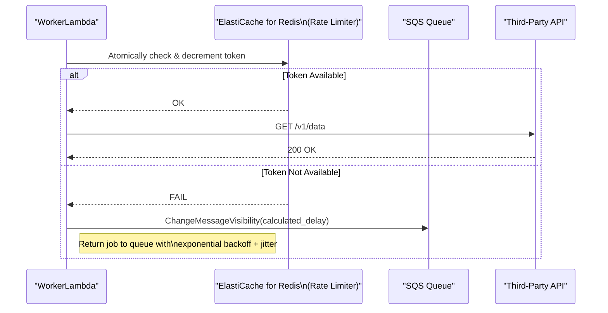

#### Load Projections & Scalability Model

*   **Governing NFR:** The system must be designed and load-tested to handle a peak load of **3,000 requests per second (RPS)**.
*   **Compute Model:** The "Hot Path" sync engine's worker fleet will be implemented using **AWS Lambda**. This serverless, event-driven approach is ideally suited for the workload, providing automatic scaling to handle massive concurrency while remaining cost-effective.
*   **Scalability Strategy:** The `WorkerLambda` will be triggered by messages arriving in the `HotPathSyncQueue` with a configured **batch size of 10**. AWS Lambda will automatically scale the number of concurrent executions based on the number of messages in the queue, ensuring that we have enough capacity to handle peak load while scaling down to zero to eliminate costs during idle periods.

#### Intelligent Worker Batching
To improve throughput and further reduce costs across compute, database, and networking, the `WorkerLambda` will be optimized to process jobs in batches.

*   **SQS Batch Processing:** The Lambda event source mapping will be configured to receive a batch of up to 10 messages from the `HotPathSyncQueue` in a single invocation.
*   **Grouped Execution:** The Lambda function will group the jobs from the batch by the third-party provider (e.g., all Fitbit jobs together). This is a best-effort optimization; if a batch contains jobs for many different providers, they will be processed less efficiently, but the system will still function correctly. This enables more efficient execution by, for example, reusing a single authenticated HTTP client for multiple requests to the same provider.
*   **Batch and Conditional Database Writes:** When persisting metadata updates, the worker **must** use DynamoDB's `BatchWriteItem` operation to write multiple items in a single API call. Critically, to avoid costs from "empty" polls that find no new data, the worker **must not** perform a write operation for any sync job that results in zero new records being processed. This "write-avoidance" strategy significantly reduces the number of database writes at scale.
*   **Cascading Benefits:** This strategy reduces the per-job overhead, leading to lower Lambda compute times, fewer total API calls to DynamoDB, and potentially reduced data transfer.

#### Just-in-Time (JIT) Credential Caching

To further enhance performance and resilience, the `WorkerLambda` will implement a local, in-memory cache for user credentials (OAuth tokens). This is particularly effective in a high-throughput environment where the same "hot" users are processed by the same warm Lambda execution environment multiple times.

*   **Problem:** Without a local cache, the worker must fetch credentials from AWS Secrets Manager for every user it processes. This adds latency to jobs and increases costs from Secrets Manager API calls.
*   **Mechanism:**
    *   **Cache Scope:** The cache will be implemented as a static, in-memory map outside the Lambda handler function, allowing it to persist between invocations within the same execution environment.
    *   **Cache Library:** A lightweight, well-tested library like **Google's Guava Cache (version `31.1-jre`)** will be used to implement a size-limited (**1,000 entries**), time-based LRU (Least Recently Used) cache with a **5-minute TTL**.
    *   **Logic:** When a job is received, the worker will first attempt to retrieve credentials from the local cache. On a **cache miss**, it will fetch them from AWS Secrets Manager and populate the cache before proceeding. On a **cache hit**, the network call is avoided.
*   **Benefits:** This pattern significantly reduces API calls to Secrets Manager, which lowers direct costs, decreases job latency, and makes the worker fleet more resilient to transient issues with the Secrets Manager service.

#### Lambda "Warm Pool" (Provisioned Concurrency)
To eliminate cold start latency for critical user-facing workflows, the architecture will use **Provisioned Concurrency** for the `WorkerLambda`. This is a key **performance tuning consideration**.

*   **Mechanism:** A configured number of Lambda execution environments will be pre-initialized and kept "warm," ready to respond instantly to invocations. The initial value for the MVP will be **50**.
*   **Behavior:** When a job arrives, it is routed to a warm instance, avoiding the multi-second latency of a cold start (which includes JVM startup and KMP module initialization). If traffic exceeds the provisioned level, Lambda will scale up standard, on-demand instances.
*   **Benefit & Cost Impact:** This provides a consistent, low-latency experience for the "Hot Path" syncs, which is critical for user satisfaction with manual syncs. It trades a predictable hourly cost for guaranteed performance. The amount of Provisioned Concurrency will be tuned based on production traffic patterns and cost models.

#### Intelligent Data Hydration (Metadata-First Fetch)
To minimize data transfer and processing costs, the sync algorithm will employ an "intelligent hydration" or "metadata-first" fetching strategy. This is particularly effective for data types with large, heavy payloads (e.g., GPX track for a workout, detailed heart rate time series).

*   **Problem:** A naive sync algorithm fetches the entire data payload from the source at the beginning of a job. If conflict resolution later determines the data is not needed (e.g., it already exists at the destination), the bandwidth (NAT Gateway cost) and compute (Lambda memory/CPU) used to download and process the heavy payload are wasted.
*   **Mechanism:** The sync process is split into a two-step fetch, as illustrated in the diagram below. This requires a modification to the `DataProvider` interface to support a metadata-only fetch mode (`fetchMetadata`), which is now part of its canonical definition in `07-apis-integration.md`. All existing `DataProvider` implementations must be updated to support this.
    1.  **Fetch Metadata:** The worker first calls the `DataProvider` to retrieve only the lightweight metadata for new activities (e.g., timestamps, IDs, type, duration).
    2.  **Conflict Resolution on Metadata:** The Conflict Resolution Engine runs using only this metadata to determine which activities definitively need to be written to the destination.
    3.  **Hydrate on Demand:** The worker then makes a second, targeted call to the `DataProvider` to fetch the full, heavy payloads *only* for the specific activities that it needs to write.
*   **Benefit:** This "lazy loading" of data payloads significantly reduces outbound data transfer through the NAT Gateway and lowers the memory and CPU requirements for the Lambda worker fleet. This is a crucial application-level optimization that reduces costs across multiple services.
*   **Flow Diagram:**
    ```mermaid
    sequenceDiagram
        participant Worker as WorkerLambda
        participant Provider as DataProvider
        participant Engine as ConflictResolutionEngine

        Worker->>+Provider: fetchData(mode='metadata')
        Provider-->>-Worker: return List<ActivityMetadata>

        Worker->>+Engine: resolveConflicts(metadata)
        Engine-->>-Worker: return List<activityIdToHydrate>

        alt Has Data to Hydrate
            Worker->>+Provider: fetchPayloads(ids=...)
            Provider-->>-Worker: return List<FullActivity>
        end

        Worker->>Worker: Proceed to write hydrated data...
    ```

#### DynamoDB Capacity Model
We will use a **hybrid capacity model**. A baseline of **Provisioned Capacity** will be purchased (e.g., via a Savings Plan) to handle the predictable average load, with an initial estimate of **1000 RCU / 500 WCU**. This estimate is based on a model of 1M DAU, with each user performing an average of 10 syncs per day, and each sync requiring 2 reads and 1 write. **On-Demand Capacity** will handle any traffic that exceeds this provisioned throughput. This ratio will be tuned based on production traffic patterns.

#### Networking Optimization with VPC Endpoints
To enhance security and reduce costs, the architecture will use **VPC Endpoints** for all internal AWS service communication. This allows Lambda functions in the VPC to communicate with other AWS services using private IP addresses.
*   **Services:** Endpoints will be created for S3, DynamoDB, SQS, Secrets Manager, AppConfig, EventBridge, and Lambda.
*   **Benefit & Cost Impact:** This improves security by keeping traffic off the public internet. Critically, it also **reduces data processing costs** by minimizing billable traffic that would otherwise be routed through a NAT Gateway. While interface endpoints have a small hourly cost, this is significantly cheaper than NAT Gateway data processing charges at scale, making them a key cost-optimization strategy.

## 3c. DynamoDB Data Modeling & Access Patterns

To support the application's data storage needs efficiently and scalably, we will use a **single-table design** in DynamoDB. This modern approach to NoSQL data modeling minimizes operational overhead, reduces costs by optimizing read/write operations, and allows for complex access patterns with a single table. A key trade-off of this approach is a steeper learning curve for developers not familiar with it; this will be mitigated through dedicated training and documentation.

Our primary data table will be named **`SyncWellMetadata`**. It will use a composite primary key and multiple Global Secondary Indexes (GSIs) to serve all required access patterns.

### Table Definition: `SyncWellMetadata`

*   **Primary Key:**
    *   **Partition Key (PK):** `USER#{userId}` - All data for a given user is co-located in the same partition.
    *   **Sort Key (SK):** A hierarchical string that defines the type of data and its relationships.
*   **Capacity Model:** The table will use a **hybrid capacity model**, consistent with the strategy in section 3b.
*   **Global Tables:** For the MVP, the table will exist in a single region. Multi-region support via Global Tables is a post-MVP consideration.

### Item Types & Schema

| Entity | PK (Partition Key) | SK (Sort Key) | Key Attributes & Defined Values |
| :--- | :--- | :--- | :--- |
| **User Profile** | `USER#{userId}` | `PROFILE` | `SubscriptionLevel`: `FREE`, `PRO`<br>`CreatedAt`, `version` |
| **Connection** | `USER#{userId}` | `CONN#{connectionId}` | `Status`: `active`, `needs_reauth`, `revoked`<br>`CredentialArn`<br>**[C-007]** `ReAuthStatus`: `ok`, `pending_user_action`, `failed` |
| **Sync Config** | `USER#{userId}` | `SYNCCONFIG#{sourceId}##{dataType}` | `ConflictStrategy`: `source_wins`, `dest_wins`, `newest_wins`<br>`IsEnabled`, `version` |
| **Idempotency Lock** | `IDEM##{key}` | `IDEM##{key}` | `status`: `INPROGRESS`, `COMPLETED`<br>`ttl` |

**`ReAuthStatus` Definitions:**
*   `ok`: The connection's authentication is healthy.
*   `pending_user_action`: The system has detected an authentication issue and has prompted the user to re-authenticate.
*   `failed`: The re-authentication attempt failed.

**Note on Idempotency Lock:** The `IDEM##{key}` item is the authoritative idempotency mechanism for the "Hot Path" sync, as defined in Section 3a. It provides a persistent, distributed lock to ensure exactly-once processing semantics for all Lambda-based sync jobs.

**Note on Historical Sync Job Items:** Storing a potentially large number of `HISTORICAL` items for a post-MVP feature can degrade performance of core user profile lookups. The design for this is deferred to `45-future-enhancements.md`.

### Supporting Operational Access Patterns

Finding all connections that need re-authentication is a key operational requirement. A full table scan is inefficient and costly at scale. A GSI on a low-cardinality attribute like `Status` is also an anti-pattern.
*   **Optimized Strategy (Sparse GSI):** The best practice is to create a **sparse Global Secondary Index (GSI)**. We will add a `ReAuthStatus` attribute to `Connection` items only when `Status` becomes `needs_reauth`. The GSI will be keyed on this sparse `ReAuthStatus` attribute, making the query to find all affected users extremely fast and cost-effective.
*   **Fallback Strategy (Throttled Scan):** A scheduled, weekly background process will perform a low-priority, throttled `Scan` as a fallback mechanism to ensure no records are missed. The **Support team** is responsible for monitoring the results of this scan.
    *   **[T-003] Implementation:** The scan will be throttled by setting a small page size (e.g., 100 items) and introducing a fixed delay of **1 second** between each page request to consume minimal read capacity.

### Data Consistency and Conflict Resolution

*   **Application-Level Locking:** The `IDEM#` item type provides the application-level distributed lock required for the "Hot Path" idempotency strategy, as defined in Section 3a.
*   **Optimistic Locking with Versioning:** To prevent lost updates during concurrent writes, optimistic locking **must** be used for all updates to `PROFILE` and `SYNCCONFIG` items. This will be implemented by adding a `version` number attribute and using a condition expression on update to ensure the `version` has not changed since the item was read. On a conflict, the operation will be retried up to 3 times with exponential backoff. If all retries fail, the operation will fail and log a critical error.

### Mitigating "Viral User" Hot Partitions

A "hot partition" for a viral user is a significant risk. This is considered a post-MVP concern, but the high-level strategy is to automate the migration of that user to a dedicated table. The design is captured in `../prd/45-future-enhancements.md`.

### Degraded Mode and Cache Resilience
The strategy for handling a full failure of the ElastiCache cluster is detailed in section 3b. The key impacts on DynamoDB are:
*   **Increased Read Load:** All reads will miss the cache and hit DynamoDB directly. The hybrid capacity model is designed to absorb this, but latency will increase.
*   **Disabled Rate Limiting:** The most critical function of the cache is rate limiting. As noted in 3b, if the cache is down, workers will not call third-party APIs. This introduces a risk: if distributed locking were also Redis-based, multiple workers could make concurrent calls for the same job when the cache comes back online, violating API rate limits. By consolidating locking in DynamoDB, we mitigate this specific risk.

## 3d. Core API Contracts

To ensure clear communication between the mobile client and the backend, we define the following core API endpoints. **API Versioning Strategy:** The API will be versioned via the URL path (e.g., `/v1/...`). Older versions will be supported for a minimum of 6 months after a new version is released. Users will be notified of upcoming deprecations via in-app messaging and push notifications. A full OpenAPI 3.0 specification will be maintained as the single source of truth at `./openapi/spec.yaml`.

### GET /v1/connections

Retrieves a list of all third-party applications the user has connected.

*   **Success Response (200 OK):**
    ```json
    {
      "connections": [
        {
          "connectionId": "conn_12345_providerA",
          "provider": "strava",
          "displayName": "Strava",
          "providerIconUrl": "https://.../strava_icon.png",
          "status": "active"
        }
      ]
    }
    ```

### POST /v1/sync-jobs

Initiates a new synchronization job for a user.

*   **Headers:** `Idempotency-Key: <UUID>` (Required)
*   **Request Body:**
    ```json
    {
      "sourceConnectionId": "conn_12345_providerA",
      "destinationConnectionId": "conn_67890_providerB",
      "dataType": "workout",
      "mode": "manual",
      "priority": "high",
      "dateRange": { "startDate": "2023-01-01", "endDate": "2023-12-31" }
    }
    ```
    *   **`dataType` (enum):** `workout`, `sleep_session`, `steps`, `weight`. Must align with `CanonicalData` models.
    *   **`mode` (enum):** `manual` (hot path), `historical` (cold path).
    *   **`priority` (enum):** `high`, `medium`, `low`. This field is used by the distributed rate-limiter to prioritize jobs when the API budget is low. Defaults to `medium` if not provided. If an invalid value is provided, the API will return a `400 Bad Request`.
    *   **`dateRange` (object):** Required if and only if `mode` is `historical`.

*   **Success Response (202 Accepted):** Returns the `jobId` for tracking.
    ```json
    {
      "jobId": "job_abc123",
      "status": "QUEUED"
    }
    ```
    *   **[C-008] `jobId` Format:** The `jobId` **must** be a UUIDv4 prefixed with `job_`.

### GET /v1/sync-jobs/{jobId}

This endpoint **must** be implemented to allow clients to poll for the status of a historical sync job.

*   **Success Response (200 OK):**
    ```json
    {
      "jobId": "job_abc123",
      "status": "SUCCEEDED",
      "progress": {
        "totalChunks": 52,
        "processedChunks": 52,
        "failedChunks": 0
      }
    }
    ```

### PUT /v1/users/me/settings

*   **Request Body:** A flexible object containing key-value pairs for user settings.
    ```json
    {
      "settings": {
        "conflictResolutionStrategy": "AI_POWERED_MERGE",
        "notificationsEnabled": true
      }
    }
    ```

### POST /v1/export-jobs

Initiates an asynchronous job to export all user-related data. Notification will be delivered via **push notification**.

*   **Success Response (202 Accepted):**
    ```json
    {
      "jobId": "export-job-abc123",
      "status": "PENDING"
    }
    ```

### GET /v1/export-jobs/{jobId}

Checks the status of a data export job.
*   **Export Format:** A **ZIP archive** containing a set of JSON files, one for each canonical data type.
*   **URL TTL:** The pre-signed download URL will have a TTL of **1 hour**.

*   **Success Response (200 OK):**
    ```json
    {
      "jobId": "export-job-abc123",
      "status": "SUCCEEDED",
      "downloadUrl": "https://s3-presigned-url/...",
      "expiresAt": "2023-10-27T15:00:00Z"
    }
    ```

### POST /v1/device-upload

Dedicated endpoint for the Device-to-Cloud sync model.

*   **Headers:** `Idempotency-Key: <UUID>` (Required)
*   **Request Body:**
    ```json
    {
      "data": [
        { ... CanonicalWorkout ... },
        { ... CanonicalWorkout ... }
      ]
    }
    ```
*   **Success Response (202 Accepted):**
    ```json
    {
      "jobId": "job_def456",
      "status": "QUEUED"
    }
    ```

### DELETE /v1/connections/{connectionId}

**[C-009]** De-authorizes a specific third-party connection. This action is irreversible and asynchronous. It will revoke the stored credentials and delete all sync configurations that depend on this connection.

*   **Success Response (204 No Content):** Returns an empty body on successful de-authorization.

### DELETE /v1/users/me

Permanently deletes a user's account and all associated data. This is an irreversible, asynchronous action. For the MVP, there is no callback mechanism to confirm completion; the client should treat the account as deleted upon receiving the `202 Accepted` response. A callback mechanism is planned for a post-MVP release.

## 3e. Canonical Data Models

To handle data from various third-party sources, we must first transform it into a standardized, canonical format. This allows our sync engine and conflict resolution logic to operate on a consistent data structure, regardless of the source. The definitive schemas are implemented as Kotlin `data class`es in the KMP shared module and versioned in the AWS Glue Schema Registry.

### `CanonicalWorkout`

```kotlin
@Serializable
data class CanonicalWorkout(
    // ...
// The IANA timezone identifier (e.g., "America/New_York"). If null, the system will process the event assuming UTC. It will also publish a custom CloudWatch metric (`InvalidTimezoneData_Omitted`) and generate a WARN level log.
    val timezone: String? = null,
    // ...
    // Optional free-text notes. High-risk for PII. This field MUST be scrubbed by the AnonymizerProxy before being sent to any AI service. If it is ever persisted in the future, it MUST be encrypted at rest.
    val notes: String? = null
) : CanonicalData
```

### `ProviderTokens`

```kotlin
// CRITICAL SECURITY NOTE: This data class holds sensitive credentials.
// It MUST NOT be annotated with @Serializable.
// Its toString() method MUST be overridden to redact token values.
// [C-010] A custom static analysis rule (linter) using Detekt MUST be implemented and enforced in the CI/CD pipeline to guarantee this. The custom rule definition is stored in the `build-logic/linters` directory of the monorepo.
data class ProviderTokens(
    val accessToken: String,
    val refreshToken: String? = null,
    val expiresInSeconds: Long,
    // The time the token was issued, in epoch seconds.
    // [R-004] MUST be generated using a reliable, centralized time source (i.e., NTP, as provided by the standard AWS Lambda execution environment) to mitigate the risk of clock skew/drift between distributed components. For local development, the system clock is acceptable, but tests must account for potential skew.
    val issuedAtEpochSeconds: Long,
    val scope: String? = null
)
```
*Note: Other canonical models, like `CanonicalSleepSession`, have been moved to Appendix C to reduce clutter in the main PRD.*

### 3f. Automatic Sync Scheduling Architecture

To align infrastructure costs with revenue and provide a premium experience for paying users, a **tiered sync frequency** model will be implemented. This will be achieved using a scalable fan-out pattern for both `PRO` and `FREE` user tiers, with different scheduling intervals.

*   **Core Components:**
    *   **Master Schedulers (EventBridge Rules):** Two separate EventBridge Rules will be created:
        *   **Pro Tier Scheduler:** Runs on a fixed **15-minute schedule** (`cron(0/15 * * * ? *)`).
        *   **Free Tier Scheduler:** Runs **once per day** (`cron(0 12 * * ? *)`).
    *   **Scheduler State Machine (AWS Step Functions):** A single, reusable state machine will orchestrate the process of finding and enqueuing sync jobs. It will be triggered by both schedulers.

*   **Workflow:**
    1.  **Trigger:** The appropriate Master Scheduler (Pro or Free) triggers the state machine, passing in the `tier` (`PRO` or `FREE`) as a parameter.
    2.  **Fan-Out:** The state machine calculates the number of shards to process based on configuration in AWS AppConfig (key: `scheduling/shard-count`, initial value: `16`, acceptable range: `1-256`).
    3.  **Process Shards in Parallel (`Map` State):** The state machine uses a `Map` state to invoke a `ShardProcessorLambda` for each shard in parallel, passing the `tier` along. A shard is a logical segment of the user base, calculated as `shard = hash(userId) % total_shards`.
        *   **[C-011] Hashing Algorithm:** The hashing algorithm **must** be **Murmur3_32**.
    4.  **Shard Processor Lambda:** Each invocation is responsible for a single shard and a single tier.
        a. **Query for Eligible Users:** It queries a dedicated GSI on the `SyncWellMetadata` table to find all users in its shard and tier who are eligible for a sync. The GSI must be defined to support this query efficiently:
            *   **GSI Name:** `SyncTierShardId-NextSyncTimestamp-gsi`
            *   **GSI Partition Key:** `SyncTierShardId` (e.g., `PRO#5`, `FREE#12`)
            *   **GSI Sort Key:** `NextSyncTimestamp`
        b. **Enqueue Jobs:** For each eligible user, it publishes a `HotPathSyncRequested` event to the EventBridge Event Bus.
    5.  **Job Processing:** The events are routed to the SQS queue and consumed by the Lambda worker fleet.

*   **Scalability and Resilience:** This architecture is highly scalable by increasing the number of shards. The use of Step Functions provides built-in retries and error handling for the scheduling process itself. This design also significantly reduces the workload generated by free users, lowering overall system load and cost.

The following diagram illustrates this scalable, tiered fan-out architecture.

#### Tiered Polling with Pre-flight Checks

For providers that do not support webhooks, a simple polling approach is inefficient. To solve this, the architecture uses a highly cost-effective, two-tiered polling strategy that combines adaptive scheduling with "pre-flight checks" to avoid triggering expensive compute for unnecessary work.

*   **Tier 1: Adaptive Scheduling with SQS Delay Queues:** The system avoids using expensive, fixed-schedule services. Instead, after a sync job completes, it analyzes the user's "sync velocity" and dynamically enqueues the *next* poll job for that user back into an SQS queue with a calculated `DelaySeconds`. An active user might be re-queued with a 15-minute delay, while an inactive user might be re-queued with a 24-hour delay. This adaptive model dramatically reduces the number of polls for inactive users.

*   **Tier 2: Pre-flight Check Lambda:** The SQS message from Tier 1 does not trigger the main Lambda worker fleet directly. Instead, it triggers a new, ultra-lightweight, and low-cost Lambda function: the `PollingPreflightChecker`.
    *   **Purpose:** This Lambda's sole responsibility is to perform a cheap "pre-flight check" to see if there is any new data at the source provider *before* initiating a full sync.
    *   **Technical Specifications:**
        *   **Language/Runtime:** TypeScript on NodeJS
        *   **Memory:** 128MB
    *   **Mechanism:** It invokes a new, minimal method on the relevant `DataProvider` (e.g., `hasNewData()`) which makes a single, lightweight API call to the source (e.g., a `HEAD` request or a query for `count > 0`).
    *   **Conditional Invocation:**
        *   If new data **exists**, the pre-flight checker publishes a `HotPathSyncRequested` event to the main SQS queue, which is processed by the powerful `WorkerLambda` as usual.
        *   If no new data **exists**, the Lambda does nothing and terminates. The cost of this check is a tiny fraction of a full Lambda invocation.

*   **Benefit:** This two-tiered model is exceptionally cost-effective. Tier 1 (adaptive SQS delays) reduces the total number of polls. Tier 2 (pre-flight checks) ensures that the polls that *do* run only trigger the expensive compute and database resources when there is actual work to be done. This eliminates the vast majority of "empty" sync jobs, saving significant costs on Lambda, DynamoDB, and CloudWatch.
*   **Flow Diagram:** The following sequence diagram illustrates this two-tiered polling flow.
    ```mermaid
    sequenceDiagram
        participant Scheduler as Adaptive Scheduler (SQS Delay)
        participant Checker as PollingPreflightChecker (Lambda)
        participant SourceAPI as Source Provider API
        participant MainQueue as Main SQS Queue
        participant Worker as WorkerLambda

        Scheduler->>+Checker: Invoke with user context
        Checker->>+SourceAPI: hasNewData(since=...)?
        SourceAPI-->>-Checker: true / false

        alt New Data Exists
            Checker->>MainQueue: Enqueue HotPathSyncRequested job
            MainQueue-->>+Worker: Invoke worker
            Worker-->>-MainQueue: Process and complete
        else No New Data
            Checker-->>Scheduler: End (do nothing)
        end
    ```

*(See Diagram 6 in the "Visual Diagrams" section below.)*

### 3g. Client-Side Persistence and Offline Support Strategy

To provide a responsive user experience and basic functionality when the user's device is offline, the mobile application will employ a client-side persistence strategy using the **SQLDelight (version 2.0.0)** database. This is a client-side implementation detail; the backend remains stateless.

*   **Purpose of the Local Database:**
    *   **Configuration Cache:** The local database will act as a cache for the user's connections and sync configurations. This allows the UI to load instantly without waiting for a network call to the backend. The backend remains the single source of truth.
    *   **Offline Action Queue (Write-Ahead Log):** When a user performs a state-changing action while offline (e.g., creating a new sync configuration, disabling an existing one), the action will be saved to a dedicated "actions" table in the local SQLDelight database. This table acts as a write-ahead log of commands to be sent to the backend.
    *   **[C-012] Table Schema (`OfflineAction`):**
        ```sql
        CREATE TABLE OfflineAction (
            id TEXT NOT NULL PRIMARY KEY, -- A client-generated UUID
            endpoint TEXT NOT NULL,       -- e.g., "POST /v1/sync-configs"
            payload TEXT NOT NULL,        -- JSON-serialized request body
            idempotencyKey TEXT NOT NULL, -- The Idempotency-Key for the request
            createdAt INTEGER NOT NULL    -- Unix timestamp
        );
        ```
    *   **Risk of Client Clock Skew:** Relying on the client's clock for `createdAt` introduces a risk of incorrect ordering if the clock is wrong. This is an accepted risk for MVP, as the actions are configuration changes where strict ordering is not critical. A future enhancement could be to use a logical clock (e.g., a Lamport timestamp).

*   **Offline Support Workflow:**
    1.  The user opens the app while offline. The UI is populated from the local SQLDelight cache, showing the last known state.
    2.  The user creates a new sync configuration. The app immediately updates the local UI to reflect this change and writes a `CREATE_SYNC_CONFIG` command to the local "actions" table.
    3.  The user can continue to queue up actions (create, update, delete) while offline.

*   **Data Reconciliation on Reconnection:**
    1.  When the application detects that network connectivity has been restored, it will initiate a reconciliation process.
    2.  It will read the queued commands from the "actions" table in the order they were created.
    3.  For each command, it will make the corresponding API call to the backend (e.g., `POST /v1/sync-configs`). The client will use the `Idempotency-Key` it generated and stored offline for each action.
    4.  **Conflict Handling:** If an API call fails due to a state conflict (e.g., a 409 Conflict or 404 Not Found), the client will not retry the command. It will discard the local action, log the conflict locally, and rely on the final fetch of the latest state (Step 6) to resolve the UI. This "backend wins" strategy is the simplest and most robust approach for handling configuration data.
    5.  Once the backend confirms the action was successful, the command is removed from the local "actions" table.
    6.  After all queued actions are processed, the client will fetch the latest state from the backend to ensure it is fully in sync with the source of truth.

This strategy ensures that the app remains responsive and that user actions are not lost during periods of no connectivity. The full reconciliation flow is visualized in **Diagram 10**.

## 4. Technology Stack & Rationale

| Component | Technology | Rationale |
| :--- | :--- | :--- |
| **Authentication Service** | **Firebase Authentication** | **Rationale vs. Amazon Cognito:** While Amazon Cognito is a native AWS service, Firebase Authentication has been chosen for the MVP due to its superior developer experience, higher-quality client-side SDKs (especially for social logins on iOS and Android), and more generous free tier. This choice prioritizes rapid development and a smooth user onboarding experience.<br>**Dependency Risk & Mitigation:** Firebase Authentication presents a critical single point of failure. To mitigate this, the API Gateway Authorizer **must** be updated to accept JWTs from both Firebase and a new Amazon Cognito User Pool. This provides a clear migration path and a DR option without requiring an immediate client-side change. This risk has been formally accepted by the product owner.<br>**Data Residency:** User identity data will be stored in Google Cloud, which has data residency implications that must be clearly communicated in the privacy policy. |
| **Cross-Platform Framework** | **Kotlin Multiplatform (KMP)** | **Code Reuse & Performance.** KMP allows sharing the complex business logic (sync engine, data providers) between the mobile clients and the backend. For latency-sensitive functions that are not part of the worker fleet (e.g., the `AuthorizerLambda`), a faster-starting runtime like TypeScript must be used to meet strict latency SLOs. This is a formally accepted technical trade-off. |
| **On-Device Database** | **SQLDelight 2.0.0** | **Cross-Platform & Type-Safe.** Generates type-safe Kotlin APIs from SQL, ensuring data consistency across iOS and Android. |
| **Primary Database** | **Amazon DynamoDB** | **Chosen for its virtually unlimited scalability and single-digit millisecond performance. For the MVP, it will be deployed in a single region. It will use a hybrid capacity model (a baseline of Provisioned Capacity with On-Demand for scaling) to balance cost and performance, as detailed in Section 3b.** |
| **Backend Compute** | **Hybrid: AWS Lambda & AWS Fargate (ARM64)** | **Hybrid Compute for Optimized Performance and Cost.** The architecture uses a hybrid model to select the best compute service for each workload, standardized on the **`arm64` (AWS Graviton) architecture** for cost-performance benefits.<br>**- AWS Lambda (Hot Path):** Used for the frequent, event-driven, real-time syncs. Lambda's auto-scaling capabilities are ideal for this spiky workload, and Provisioned Concurrency will be used to eliminate cold starts for a responsive user experience.<br>**- AWS Fargate (Cold Path):** Used for long-running, resource-intensive, asynchronous jobs like historical data backfills and bulk exports. For these heavy batch workloads, Fargate is more cost-effective and provides more predictable performance than Lambda. The Fargate fleet will use a **90% Spot / 10% On-Demand** mix to further optimize costs. Spot instance interruptions will be handled gracefully by checkpointing progress to DynamoDB and resuming from the last checkpoint. |
| **Schema Governance** | **AWS Glue Schema Registry** | **Data Integrity & Evolution.** Provides a managed, centralized registry for our canonical data schemas. Enforces backward-compatibility checks in the CI/CD pipeline, preventing breaking changes and ensuring system stability as new data sources are added. |
| **Distributed Cache** | **Amazon ElastiCache for Redis** | **Performance & Scalability.** Provides a high-throughput, low-latency in-memory cache for reducing database load and implementing distributed rate limiting. |
| **AI & Machine Learning (Future)** | **Amazon SageMaker, Amazon Bedrock** | **Rationale for Future Use:** When we implement AI features, these managed services will allow us to scale without managing underlying infrastructure, reducing operational overhead and allowing focus on feature development. |
| **Secure Credential Storage** | **AWS Secrets Manager** | **Security & Manageability.** Provides a secure, managed service for storing, rotating, and retrieving the OAuth tokens required by our backend workers. Replicated across regions for high availability. |
| **Configuration Management & Feature Flagging** | **AWS AppConfig** | **Operational Agility & Safety.** We will adopt AWS AppConfig for managing dynamic operational configurations (like log levels or API timeouts) and feature flags. This allows for safe, audited changes without requiring a full code deployment, significantly improving operational agility and reducing release risk. |
| **Infrastructure as Code** | **Terraform v1.5+** | **Reproducibility & Control.** Manages all cloud infrastructure as code, ensuring our setup is version-controlled and easily reproducible. |
| **Web Application Firewall** | **AWS WAF** | **Protection Against Common Exploits.** A foundational security layer that sits in front of API Gateway to protect against common web exploits like SQL injection, cross-site scripting, and bot traffic. |
| **CI/CD**| **GitHub Actions** | **Automation & Quality.** Automates the build, test, and deployment of the mobile app and backend services, including security checks. |
| **Monitoring & Observability** | **AWS CloudWatch, AWS X-Ray** | **Operational Excellence.** Provides a comprehensive suite for logging, metrics, tracing, and alerting, enabling proactive issue detection and performance analysis. |
| **Local Development** | **LocalStack** | **High-Fidelity Local Testing.** Allows engineers to run and test the entire AWS serverless backend on their local machine, drastically improving the development and debugging feedback loop. |
| **Load Testing** | **k6 (by Grafana Labs)** | **Validate Scalability Assumptions.** A modern, scriptable load testing tool to simulate traffic at scale, identify performance bottlenecks, and validate that the system can meet its 1M DAU target. Scripts are stored in the `/load-testing` directory of the monorepo. |

## 5. Cost-Effectiveness and Financial Modeling

A detailed financial model is a mandatory prerequisite before implementation and is maintained at [`../costs/66-costs-model.md`](../costs/66-costs-model.md).

**Primary Cost Drivers:**
1.  **AWS Lambda & Fargate:** As the primary compute services, these will be major cost drivers.
2.  **CloudWatch:** At scale, the volume of logs, metrics, and traces generated will be massive and will be a major operational expense.
3.  **NAT Gateway:** Outbound traffic from Lambda functions in a VPC to **third-party APIs** will incur data processing charges. (Note: Traffic to internal AWS services will use VPC Endpoints to minimize this cost).

**Cost Management Strategy:**
*   **Mandatory Financial Modeling:** Develop a detailed cost model using the AWS Pricing Calculator.
*   **Aggressive Log Management:** Implement dynamic and tiered log levels via AppConfig, set short retention periods in CloudWatch, and automate archiving to S3/Glacier.
*   **Explore Savings Plans:** As usage becomes more predictable, a Compute Savings Plan can significantly reduce Fargate and Lambda costs. Ownership for managing this plan belongs to the **Finance Team**.
*   **Cost Anomaly Detection:** Configure AWS Cost Anomaly Detection to automatically alert the team to unexpected spending.
*   **Optimize VPC Networking:** Implement VPC Endpoints for all internal AWS service communication to minimize data transfer costs through the NAT Gateway.

## 6. Security, Privacy, and Compliance

### Security Measures

*   **Data Encryption in Transit:** All network traffic will use TLS 1.2+. Certificate Pinning is deferred for the MVP due to the operational overhead of key rotation. The rationale is that the risk is partially mitigated by using well-known, trusted CAs.
*   **Data Encryption at Rest:** All data at rest in AWS is encrypted by default using AWS-managed keys (KMS). This includes DynamoDB tables, S3 buckets, and ElastiCache snapshots. On-device, sensitive data is stored in the native Keychain (iOS) or Keystore (Android).
*   **Access Control and Least Privilege:**
    *   **Secure Authorizer Implementation:** The `AuthorizerLambda` **must** use **AWS Lambda Powertools** to handle the complexities of JWT validation, including fetching the JWKS, validating the signature, and checking standard claims.
    *   **Granular IAM Roles:** Each compute component has its own unique IAM role with a narrowly scoped policy.
    *   **Resource-Based Policies:** Where applicable, resource-based policies are used as an additional layer of defense.
*   **Protection Against Denial of Service (DoS):** To mitigate the risk of abuse and financial exhaustion from DoS attacks, the architecture will leverage **AWS WAF**. In addition to protecting against common exploits, a **rate-based rule** will be configured to automatically block IP addresses that exceed a reasonable request threshold. The initial rule will be: **Block any source IP that sends more than 1,000 requests in a 5-minute period.** This threshold will be monitored and tuned based on production traffic patterns.
*   **Per-User Rate Limiting:** To protect against abusive behavior from a single malicious or buggy client, the architecture **must** implement per-user rate limiting. This will be achieved using **API Gateway Usage Plans** associated with API keys that are unique to each user. This provides a crucial layer of defense against a single user overwhelming the system. The initial limit will be **100 requests per minute** with a burst capacity, and will be tuned based on observed user behavior.
*   **Egress Traffic Control (Hybrid Firewall Model):** To balance cost and security, outbound traffic from the VPC is routed through a hybrid firewall model. This model uses separate egress paths depending on the destination's trust level and traffic volume.
    *   **High-Security Path (AWS Network Firewall):** All outbound traffic to unknown, lower-volume, or security-sensitive endpoints is routed through an **AWS Network Firewall**. This provides advanced features like intrusion prevention and deep packet inspection, ensuring the highest level of security.
    *   **Cost-Optimized Path (AWS NAT Gateway):** High-volume, trusted traffic to the primary, well-known API endpoints of major partners (e.g., Fitbit, Strava, Garmin) is routed through a separate, standard **AWS NAT Gateway**. The initial allow-list for this path is managed in the project's Terraform configuration. Additions to this list require a pull request with approval from the Security team.
    *   **Justification & Cost Impact:** This hybrid approach directly optimizes costs. The **Network Firewall introduces its own data processing costs**, which are higher than a standard NAT Gateway. By routing high-volume, trusted partner traffic through the cheaper NAT Gateway, we significantly reduce egress costs while still using the firewall's advanced inspection capabilities for untrusted destinations. This routing choice is a critical lever for cost management.
*   **Code & Pipeline Security:** Production builds will be obfuscated. Dependency scanning (Snyk) and SAST will be integrated into the CI/CD pipeline, failing the build on critical vulnerabilities. Any new AI frameworks must undergo a formal security review, which includes threat modeling and a review by the security team, before being integrated. In the event a critical vulnerability is discovered, the security on-call **must** be paged, and a hotfix deployment must be prepared and rolled out within the 72-hour SLO defined in the NFRs.
*   **Secret Rotation Policy:** A formal policy for rotating secrets stored in AWS Secrets Manager is critical to limit the impact of a potential leak.
    *   **Automated Rotation:** For all secrets that support it, automated rotation configured in Secrets Manager **must** be enabled. A rotation schedule of **every 90 days** is the required baseline.
    *   **Manual Rotation Process:** For secrets that do not support automated rotation, a manual rotation process must be documented in a runbook (`../ops/RUNBOOK_MANUAL_SECRET_ROTATION.md`). This runbook must be executed on a **quarterly basis** by the SRE team.
    *   **Emergency Rotation:** In the event of a suspected compromise, the on-call security engineer must be able to trigger an immediate, out-of-band rotation. This process must also be documented in the incident response plan.

### Compliance
*   **Data Handling and Ephemeral Processing:** User health data is only ever processed **ephemerally in memory**. The maximum lifetime for data in-flight is guaranteed to be **under 5 minutes** by enforcing this as the maximum task duration for Lambda and Fargate tasks.
*   **HIPAA Alignment:** While not formally HIPAA certified, the architecture is designed to align with HIPAA's technical safeguards, specifically: unique user identification, automatic logoff, encryption of data at rest and in transit, and audit controls via CloudTrail. The **CTO** is responsible for commissioning a third-party compliance validation before any public statements are made.
*   **GDPR & CCPA:** The architecture is designed to be compliant by enforcing data minimization and user control.
*   **Audit Trails:** All administrative actions are logged via **AWS CloudTrail**. Critical alerts **must** be configured for suspicious administrative actions (e.g., disabling CloudTrail, modifying critical IAM policies).

### Data Anonymization for Analytics and AI

A dual-pronged data anonymization strategy will be implemented.

#### Real-Time Anonymization for Operational AI
A dedicated **Anonymizer Proxy Lambda** will be used for real-time operational features.
*   **Testability and Observability:** The Anonymizer Proxy is a critical component and **must** have its own suite of unit and integration tests. Its latency and error rate will be monitored with dedicated CloudWatch Alarms.
*   **Latency SLO:** The P99 latency for the proxy itself is an SLO that **must be under 50ms** and will be tracked on a dashboard at [`../ops/41-metrics-dashboards.md#security-dashboard`](../ops/41-metrics-dashboards.md#security-dashboard).
*   **PII Stripping Strategy:** The following table defines the PII stripping strategy. **[C-006]** This list represents the comprehensive set of rules to be applied across all canonical models before any user data is processed by an AI service. This process is a critical security control.

| Field (from any Canonical Model)                | Action      | Rationale                                                                                                                              |
| :---------------------------------------------- | :---------- | :------------------------------------------------------------------------------------------------------------------------------------- |
| `userId`                                        | **Remove**  | The internal user ID is a direct identifier and must be removed. The AI service should operate on data from a single user at a time, without needing to know their ID. |
| `sourceId`                                      | **Hash**    | Hashed with a per-user salt to prevent reverse-engineering while maintaining referential integrity for a given user's data.              |
| `recordId`                                      | **Remove**  | The unique ID for a specific data record (e.g., a single workout) is an unnecessary tracking vector and must be removed.                 |
| `title`                                         | **Remove**  | High-risk for free-text PII (e.g., "Run with Jane Doe").                                                                                 |
| `notes`                                         | **Remove**  | High-risk for free-text PII.                                                                                                           |
| `latitude`, `longitude` (and all other location data) | **Generalize**| Convert specific GPS coordinates to the nearest city (e.g., "San Francisco, CA") to obscure exact locations. Start and end points of a workout are especially sensitive. |
| `startTime`, `endTime`                          | **Generalize**| Round timestamps to the nearest 15 minutes to obscure precise start/end times of activities, which can reveal sensitive user patterns. |
| `heartRateSamples`                              | **Aggregate** | Replace detailed timeseries data with summary statistics (e.g., `avg`, `min`, `max`). The raw series could potentially be used to identify a user.                    |
| `stepsTimeseries`                               | **Aggregate** | Replace detailed intra-day step counts with hourly or daily totals to obscure fine-grained activity patterns.                            |
| `sleepStages`                                   | **Aggregate** | Replace detailed sleep stage data (e.g., timestamps of REM, deep, light) with total durations for each stage.                            |
| `calories`                                      | **Keep**    | Generally not considered PII in isolation.                                                                                             |
| `steps` (daily total)                           | **Keep**    | Generally not considered PII in isolation.                                                                                             |
| `distance`                                      | **Keep**    | Generally not considered PII in isolation.                                                                                             |
| `weightKg`                                      | **Keep**    | A user's weight is not considered PII in isolation.                                                                                    |
| `bodyFatPercentage`                             | **Keep**    | A user's body fat percentage is not considered PII in isolation.                                                                       |
| `bmi`                                           | **Keep**    | A user's BMI is not considered PII in isolation.                                                                                       |
| `deviceName`                                    | **Remove**  | Can contain user's name (e.g., "John's iPhone").                                                                                       |
| `weatherInfo`                                   | **Generalize**| Keep general weather (e.g., "Cloudy"), but remove specific temperature or location details that could narrow down the user's location. |
| `sourcePayload`                                 | **Remove**  | The original, raw payload from the third-party provider must be removed as it may contain unexpected PII not mapped to the canonical model. |
*   **Privacy Guarantee:** This proxy-based architecture provides a strong guarantee that no raw user PII is ever processed by the AI models.

#### Batch Anonymization for Analytics
For analytics, **Amazon Kinesis Data Firehose** will be used.
*   **Buffering and Batching:** Firehose will be configured with a **buffer interval of 60 seconds**, a **buffer size of 5MB**, **GZIP compression**, and **encryption with an AWS-managed KMS key**.
*   **On-the-fly Transformation:** Before delivery, Firehose will invoke an Anonymization Lambda to strip PII from each record.
    *   **Technical Specifications:**
        *   **Language/Runtime:** TypeScript on NodeJS
        *   **Memory:** 256MB

### Comprehensive Monitoring, Logging, and Alerting Framework

*   **Logging Strategy:**
    *   A standardized, **structured JSON logging** format will be enforced using **AWS Lambda Powertools**.
    *   **Log Schema:** The core JSON schema will include: `timestamp`, `level` (e.g., INFO, ERROR), `service` (e.g., "worker-lambda"), `correlationId`, `message`, and a `payload` object for contextual data.
    *   **Automated PII Masking:** To prevent accidental leakage of Personally Identifiable Information (PII) in logs, the system **must** use **CloudWatch Logs Data Protection**. This feature will be configured with policies to automatically identify and mask common PII data patterns (e.g., email addresses, phone numbers) in log groups in real-time. This automated, real-time control replaces the need for manual, periodic log audits for PII.

*   **Tiered & Sampled Log Ingestion:** To manage the significant cost of log ingestion at scale, the system will implement a context-aware, tiered sampling strategy. This approach directly links observability costs to revenue by providing different levels of logging fidelity for different user tiers, while ensuring full diagnostic data is always available for failures.
    *   **Baseline Strategy (Head/Tail Sampling):** The core of the strategy is "head/tail" sampling. Logs for each job are buffered in memory within the worker. If the job fails at any point, all buffered logs for that specific execution are ingested into CloudWatch. This guarantees 100% diagnostic visibility for all errors, for all users.
    *   **Tiered Sampling for Success Cases:** For jobs that complete successfully, the decision to ingest the buffered logs is based on the user's subscription tier.
        *   **`PRO` Tier:** Sampling rate is **1 in 100** successful jobs.
        *   **`FREE` Tier:** Sampling rate is **1 in 10,000** successful jobs.
    *   **Dynamic Configuration:** The specific sampling rates for each tier (`pro`, `free`) **must** be managed via AWS AppConfig, allowing for dynamic tuning without a code deployment.
    *   **Auditability:** The sampling decision itself (i.e., "this job's logs were sampled/not sampled") will be logged for every job to provide an audit trail.
    *   **Benefit:** This tiered approach provides the greatest cost reduction by targeting the highest volume of events (successful jobs from free users) while retaining full observability for failures and for paying customers.
    *   **Logic Flow:** The following diagram illustrates the decision-making process within a worker for each completed job.
        ```mermaid
        graph TD
            A[Sync Job Completes] --> B{Job Succeeded?};
            B -- No --> C[Ingest 100% of<br>Buffered Logs to CloudWatch];
            B -- Yes --> D{User is PRO Tier?};
            D -- Yes --> E[Get PRO Sampling Rate<br>e.g., 1/100];
            D -- No --> F[Get FREE Sampling Rate<br>e.g., 1/10,000];
            E --> G{Apply Sampling Logic\nhash of jobId % rate == 0?}
            F --> G;
            G -- Yes --> H[Ingest Buffered Logs<br>to CloudWatch];
            G -- No --> I[Discard Logs];
        ```
*   **Dynamic X-Ray Trace Sampling:** By default, AWS X-Ray traces every request, which can be costly at scale. To manage this, the system will implement dynamic sampling. A low default sampling rate (e.g., 1 request per second and 5% of all requests) will be configured for the main API Gateway stage. Additionally, specific, higher-volume sampling rules will be applied to critical user flows (e.g., 10% sampling for `/v1/users/me/settings`).
*   **Key Metrics & Alerting:**
    *   **Idempotency Key Collisions:** This will be tracked via a custom CloudWatch metric published using the **Embedded Metric Format (EMF)** from the worker Lambda. An alarm will trigger on any anomalous spike.
    *   **KPIs:** In addition to system metrics, we will track business and product KPIs. The following table provides a more complete view.

| KPI Metric Name | User Story | Business Goal | Description | Threshold / Alert |
| :--- | :--- | :--- | :--- | :--- |
| `ActivationRate` | US-01 | Growth | % of new users who complete onboarding (defined as successfully connecting one provider). | Track weekly cohort data. |
| `ProTierConversionRate`| US-20 | Monetization | % of free users who convert to the Pro tier within 30 days. | Track monthly cohort data. |
| `SyncSuccessRate` | US-05 | Trust & Reliability | % of sync jobs that complete successfully. | Alert if < 99.9% over 15 mins. |
| `P95_ManualSyncLatency` | US-06 | Engagement | 95th percentile latency for a manual sync. | Alert if > 15 seconds. |
| `HistoricalSyncThroughput`| US-10 | Retention | Days of data processed per minute during historical sync. | Alert if drops by >25% WoW. |
| `ChurnRate` | - | Retention | % of users who uninstall or delete their account. | Track monthly. |

## 7. Open-Source Tools and Packages

| Category | Tool/Package | Description |
| :--- | :--- | :--- |
| **Mobile Development** | **Kotlin Multiplatform** | Core framework for sharing code. |
| | **SwiftUI / Jetpack Compose** | Modern UI frameworks for iOS and Android. |
| | **SQLDelight** | KMP library for type-safe SQL. |
| | **Ktor** | KMP HTTP client. |
| **Backend Development** | **AWS Lambda, Fargate, SQS, DynamoDB** | Core AWS services for the serverless backend. |
| | **Terraform** | Infrastructure as Code tool. |
| **Testing** | **JUnit, XCTest, Espresso, MockK, Turbine** | Standard libraries for unit, UI, and integration testing. |
| | **k6** | Modern, scriptable load testing tool. |
| **CI/CD** | **GitHub Actions, Fastlane** | CI/CD platform and mobile release automation. |
| **Monitoring** | **OpenTelemetry** | Vendor-neutral standard for instrumentation. |
| | **Prometheus / Grafana** | Alternative/complement to CloudWatch for advanced metrics and dashboards. |
| **Local Development** | **LocalStack** | High-fidelity emulator for local AWS development. |
| **Static Analysis** | **Detekt, SwiftLint** | Static analysis tools for Kotlin and Swift. |
| **Dependency Scanning** | **Snyk, Dependabot** | Vulnerability scanning for dependencies. |

## 8. Non-Functional Requirements (NFRs)

This section defines the key non-functional requirements for the SyncWell platform. These are critical quality attributes that the system must satisfy.

| Category | Requirement | Metric | Target | Priority | Notes |
| :--- | :--- | :--- | :--- | :--- | :--- |
| **Availability** | Core Service Uptime | Monthly Uptime % | > 99.9% | P0 | Measured for core API endpoints and sync processing. Excludes scheduled maintenance. |
| | Disaster Recovery RTO | Recovery Time Objective | < 4 hours | P1 | In a DR event, users will be notified via a status page and social media. |
| | Disaster Recovery RPO | Recovery Point Objective | < 15 minutes | P0 | Max acceptable data loss. Governed by DynamoDB PITR backup frequency. |
| **Performance** | Manual Sync Latency | P95 Latency | < 15 seconds | P1 | End-to-end latency, highly dependent on third-party API performance. |
| | API Gateway Latency | P99 Latency | < 500ms | P0 | For all synchronous API endpoints, measured at the gateway. |
| | Concurrent Users | Peak RPS | 3,000 RPS | P0 | The system must handle a peak load of 3,000 requests per second. |
| **Security** | Vulnerability Patching | Time to Patch Critical CVE | < 72 hours | P0 | This policy applies 24/7, including weekends and holidays, and is managed by the on-call security team. |
| | Secure Data Handling | `ProviderTokens` must not be serializable | Pass/Fail | P0 | The `ProviderTokens` data class must not be serializable and must redact secrets in its `toString()` method. A custom linter rule must enforce this at build time. |
| **Scalability** | User Capacity | Daily Active Users (DAU) | 1,000,000 | P1 | The architecture must be able to support 1 million daily active users.<br>**Note:** The traffic models used for capacity planning are based on assumptions. A **private beta program** must be launched to a small user group to collect real-world metrics on user activity (e.g., syncs/day, payload size) to validate these assumptions before a full public launch. |
| **Usability** | App Onboarding | Time to First Sync | < 3 minutes | P0 | This is a key product KPI, tracked via our analytics pipeline by measuring the median time from the `UserSignedUp` event to the first `SyncSucceeded` event for that user. |

## 9. Developer Experience

To ensure high development velocity and code quality, we will establish a streamlined and automated developer experience.

*   **Local Development:** Engineers must be able to run and test the entire application stack locally using LocalStack and Docker Compose.
*   **Test Data Management:**
    *   A pool of permanent test accounts will be created in Firebase Authentication.
    *   The **E2E test reset script** for DynamoDB will be an idempotent script managed in the backend repository at `scripts/reset-e2e-data.sh`, owned by the core backend team. This script must be created.
*   **Testing Strategy:** We will employ a multi-layered testing strategy.
    *   **Contract Tests (Pact):** A failure in the Pact verification step in a provider's (e.g., backend) CI pipeline **must** block the build from proceeding.
    *   **Load Tests (`k6`):** To validate performance and scalability against a dedicated staging environment.
*   **Continuous Integration & Delivery (CI/CD):** Our CI/CD pipeline, managed with **GitHub Actions**, automates quality checks and deployments.
    *   **CI/CD for KMP Shared Module:** A dedicated pipeline will manage the shared KMP module. A breaking change in the shared module (i.e., a major version bump) **must** be communicated to consumer teams (mobile, backend) via the dedicated **`#eng-mobile-backend-sync`** Slack channel and a formal announcement.
*   **Deployment Strategy (Canary Releases):** Backend services will be deployed to production using a **canary release strategy**.
    *   **Process:** A new version is deployed, and **10%** of production traffic is routed to it.
    *   **Monitoring & Rollout:** The canary is monitored for **30 minutes**. The key metrics for evaluating the canary are **API P99 latency, error rate, and sync success rate**. If these metrics remain stable relative to the baseline, traffic is gradually shifted until it serves 100% of requests. A manual approval step is required before promoting the release to 100% of traffic.
    *   **[C-005] Automatic Rollback Triggers:** An automatic rollback **must** be triggered if any of the following deviations are observed in the canary group compared to the baseline group over 5 consecutive 1-minute evaluation periods:
        *   A **>10% increase** in the P99 API Gateway latency.
        *   A **>1% absolute increase** in the overall API error rate (4xx or 5xx).
        *   A **>2% absolute decrease** in the `SyncSuccessRate` business metric.

## 10. Known Limitations & Architectural Trade-offs

This section documents known limitations of the architecture and explicit trade-offs that have been made.

*   **Feature Tiering:** The current architecture does not explicitly support feature tiering (e.g., higher rate limits for Pro users). This is a known gap that will be addressed in a future iteration. The high-level strategy will be to have the `AuthorizerLambda` attach the user's subscription tier (`FREE` or `PRO`) to the request context. Downstream services, like the rate-limiting engine, can then inspect this context and apply the appropriate limits. This feature is prioritized as **P2-Should-Have**.
*   **Account Merging:** The data model does not support account merging. **User-facing consequence:** Users who create multiple accounts will have siloed data and must contact support for a manual, best-effort resolution. The user-facing message is: "Account merging is not supported at this time. Please contact customer support for assistance." This will be delivered via a support macro in the customer support tool. This is a known product issue.
*   **Firebase Authentication Dependency:** The use of Firebase Authentication creates a hard dependency on a non-AWS service for a critical function. This is a **High** strategic risk.
    *   **Risk:** An outage in Firebase Auth would render the application unusable for all users.
    *   **[RISK-HIGH-03] Mitigation:** While accepted for the MVP to prioritize launch speed, a high-level exit strategy has been drafted. See **[`./33a-firebase-exit-strategy.md`](./33a-firebase-exit-strategy.md)** for the detailed technical plan. This risk has been formally accepted by the product owner.
*   **AWS Vendor Lock-in:** The architecture makes extensive use of proprietary AWS services (Lambda, DynamoDB, SQS, etc.). This is a deliberate strategic trade-off.
    *   **Rationale:** This approach significantly accelerates development velocity, reduces operational overhead, and allows the team to leverage the scalability and resilience of the AWS ecosystem.
    *   **Risk:** This deep integration with AWS makes a future migration to a different cloud provider or an on-premise environment extremely costly and time-consuming.
    *   **Mitigation:** This risk is formally accepted. Where feasible, vendor-neutral standards like OpenTelemetry will be used to provide a thin layer of abstraction, but the core of the system is tied to AWS.

*   **MVP Scope & Phasing:** To ensure a focused and timely launch, the architecture distinguishes between core features required for the MVP and production-hardening features that can be implemented as fast-follows.
    *   **Must-have for MVP (Day 1):**
        *   **Single-Region Deployment:** Core infrastructure will be deployed in a single AWS region (`us-east-1`) to optimize for cost and simplicity at launch.
        *   **VPC Endpoints:** Deployed for all internal AWS service communication to ensure security and reduce NAT Gateway data transfer costs from day one.
        *   **Core Security Features:** Foundational security measures like AWS WAF, granular IAM roles, and encryption at rest/in-transit are non-negotiable for the MVP.
    *   **Fast-follow Post-Launch (Production Hardening):**
        *   **Comprehensive Chaos Engineering:** The full suite of chaos engineering experiments will be built out and automated post-launch.
        *   **Multi-Region Architecture:** Expansion to a multi-region architecture is a post-MVP consideration, to be prioritized based on user growth or geographic expansion.

## 11. Appendices

*   **Appendix A: Technology Radar:** See the dedicated [`./21-technology-radar.md`](./21-technology-radar.md) document.
*   **Appendix B: Operational Policies:** See the dedicated [`../ops/20-operational-policies.md`](../ops/20-operational-policies.md) document.

## 12. Glossary

A project-wide glossary of all business and technical terms is maintained in the root [`GLOSSARY.md`](../../../GLOSSARY.md) file to ensure a single source of truth for terminology.

## 13. Visual Diagrams

This section contains all the architectural diagrams referenced in this document. To improve clarity, the primary container diagram has been decoupled into a series of smaller, more focused diagrams that each illustrate a specific architectural flow or concern. All diagrams are versioned `v1.6` as of `2025-08-22`.

### Diagram Legend
The following conventions are used across all diagrams to ensure a consistent and professional visual language. The icons are from the [Font Awesome](https://fontawesome.com/icons) library.

| Category | Style (Fill / Stroke) | Icon | Services |
| :--- | :--- | :--- | :--- |
| **User / External** | `#f4f4f4` / `#525252` | `fa:fa-user`, `fa:fa-mobile-alt` | User, Mobile App, Third-Party APIs |
| **Ingress & Routing** | `#e6f3ff` / `#0073bb` | `fa:fa-globe-americas`, `fa:fa-shield-alt` | CloudFront, WAF, API Gateway, Route 53 |
| **Compute & Logic** | `#fff8e6` / `#ff9900` | `fa:fa-bolt` | AWS Lambda, Step Functions |
| **Data Stores** | `#e6ffed` / `#2d9a41` | `fa:fa-database`, `fa:fa-memory` | DynamoDB, ElastiCache for Redis, S3 |
| **Messaging** | `#f3e6ff` / `#8a3ffc` | `fa:fa-inbox`, `fa:fa-comments` | SQS, EventBridge |

---
### Diagram 1: System Context
This C4 Level 1 diagram shows the SyncWell system in its environment, illustrating its relationship with users and the major external systems it depends on.

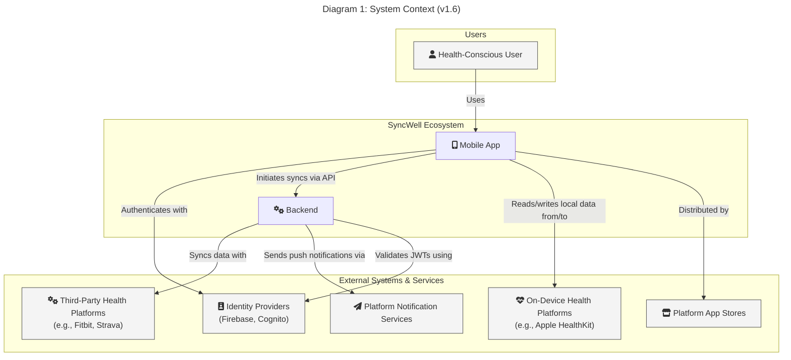

### Decoupled Container Diagrams (C4 Level 2)

The following set of diagrams replaces a single, monolithic container diagram. By decoupling the architecture into specific flows, each diagram becomes easier to understand and reason about.

---
#### Diagram 2a: Ingress & Authentication Flow
This diagram shows how requests from both end-users and third-party webhooks enter the system through the edge network and are authenticated.

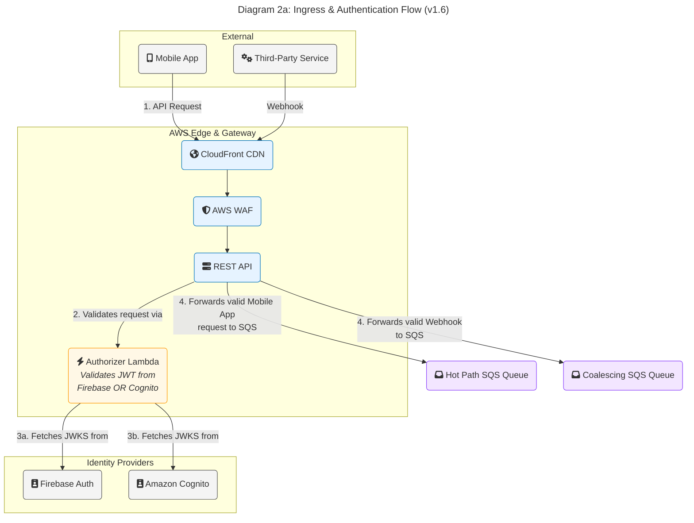
---
#### Diagram 2b: Webhook Event Coalescing Flow
This diagram details the cost-optimization pattern used to handle "chatty" webhooks by buffering and deduplicating them before triggering a sync.

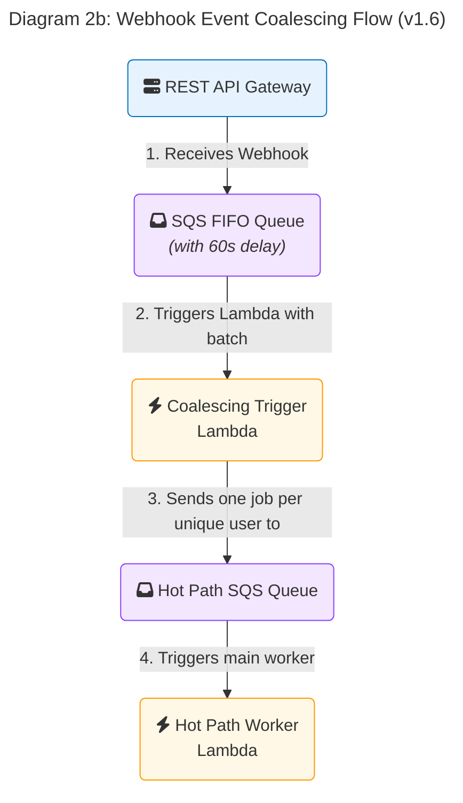
---
#### Diagram 2c: Core "Hot Path" Worker Flow
This diagram shows the main components involved in processing a standard, real-time synchronization job.

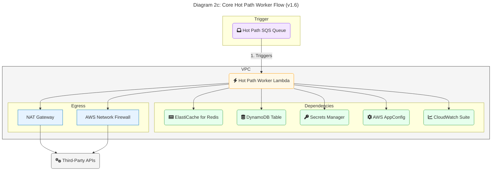
---
#### Diagram 2d: Real-Time WebSocket Flow
This diagram shows the separate, low-latency path for users who are actively using the app, providing a near real-time sync experience.

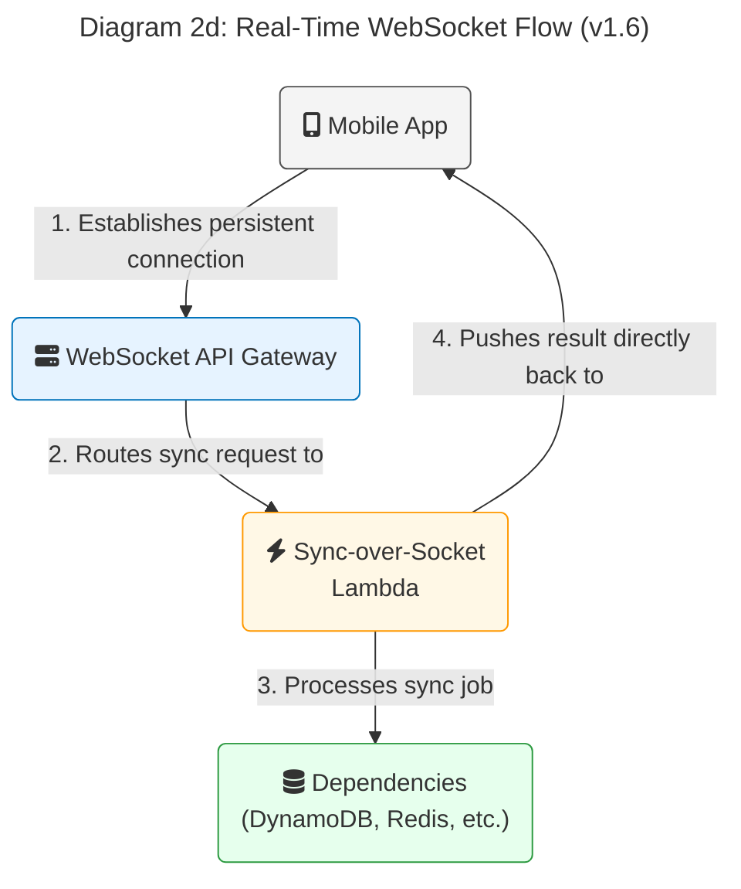
---
### Diagram 3: ProviderManager Factory Pattern

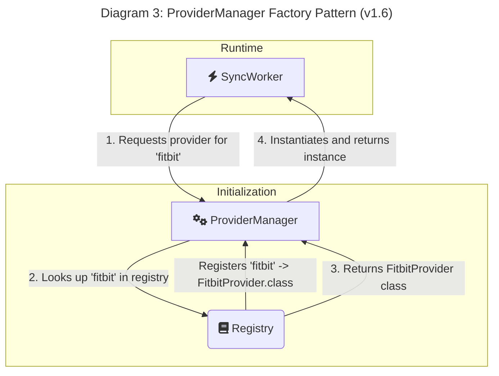

### Diagram 4: Hot Path Sync Flow (Simplified)

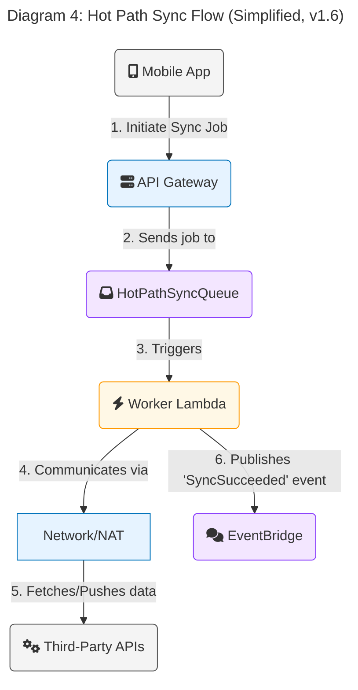

### Diagram 5: High Availability & Disaster Recovery Architecture

This diagram illustrates the architecture for the critical "Hot Path" sync, showing how Multi-AZ and Multi-Region deployments provide resilience.

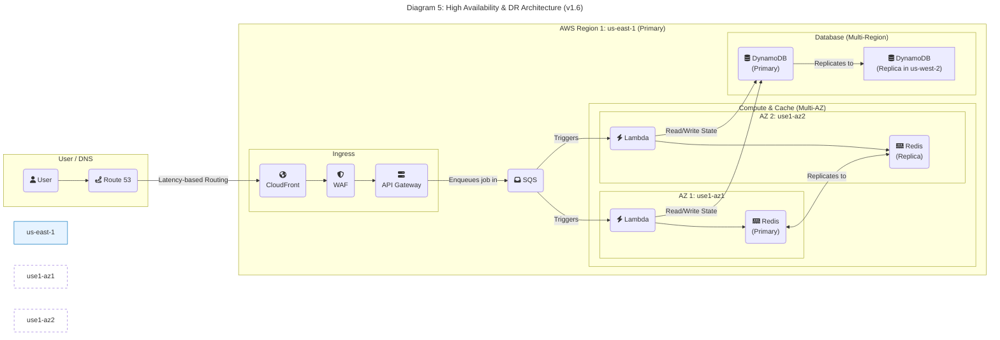

### Diagram 6: Tiered Fan-Out Scheduling Infrastructure

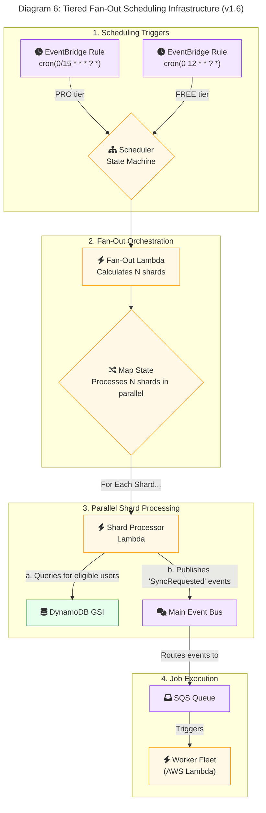

### Diagram 7: Device-to-Cloud Sync Flow

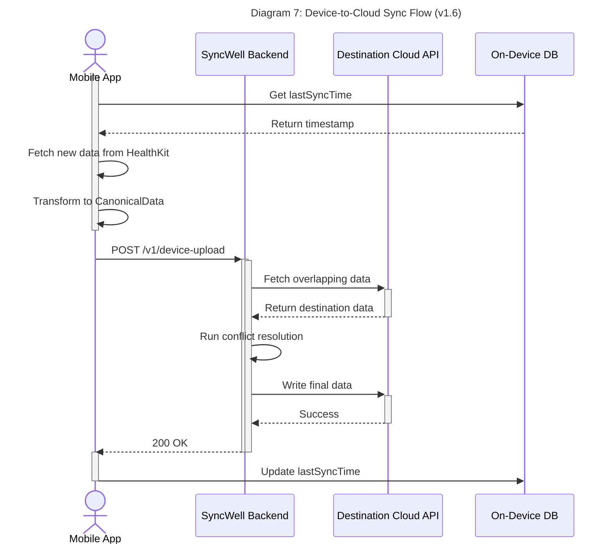

### Diagram 8: Cloud-to-Device Sync Flow

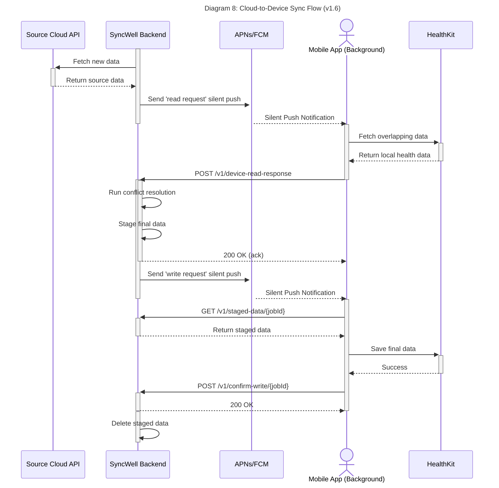
*Note: The `Fan-Out Lambda` in Diagram 6 has the following technical specifications: Language/Runtime: TypeScript on NodeJS, Memory: 256MB.*
*Note: The `Shard Processor Lambda` in Diagram 6 has the following technical specifications: Language/Runtime: TypeScript on NodeJS, Memory: 256MB.*

### Diagram 9: Idempotency Check Flow

This sequence diagram illustrates the DynamoDB-based distributed locking mechanism used to ensure exactly-once processing for "Hot Path" sync jobs.

```mermaid
---
title: "Diagram 9: Idempotency Check Flow (v1.6)"
---
sequenceDiagram
    actor Worker as Worker Lambda
    participant DynamoDB as DynamoDB

    Worker->>+DynamoDB: PutItem(IDEM##{key}, status=IN_PROGRESS) with ConditionExpression

    alt Lock Acquired (PutItem Succeeded)
        DynamoDB-->>-Worker: 200 OK
        Worker->>Worker: Execute Business Logic
        Worker->>+DynamoDB: UpdateItem(IDEM##{key}, status=COMPLETED, ttl=24h)
        DynamoDB-->>-Worker: 200 OK
    else Lock Not Acquired (ConditionalCheckFailedException)
        DynamoDB-->>-Worker: 400 ConditionalCheckFailedException
        Worker->>+DynamoDB: GetItem(IDEM##{key})
        DynamoDB-->>-Worker: Return item with status

        alt Item status is COMPLETED
            Worker->>Worker: Discard current job, return success
        else Item status is IN_PROGRESS
            Worker->>Worker: Retry job with exponential backoff
        end
    end
```

### Diagram 10: Client-Side Offline Sync & Reconciliation

This sequence diagram shows how the mobile client handles user actions while offline and reconciles them once connectivity is restored.

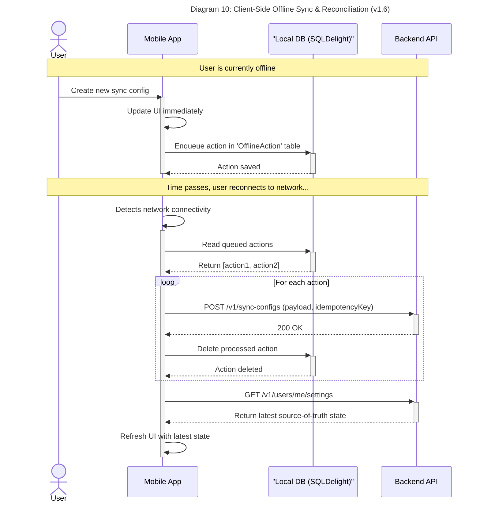
