# Technical Architecture

> **DOCUMENT STATUS: SINGLE SOURCE OF TRUTH**
> This document is the single, authoritative source of truth for the SyncWell technical architecture. All other PRDs, architectural documents, and operational runbooks **must** align with the decisions, patterns, and diagrams specified here. Where contradictions exist, this document takes precedence.

## 0. Document Management

### Version History
| Version | Date       | Author(s) | Summary of Changes                                                                                                                                                                                              |
| :--- | :--- | :--- |:----------------------------------------------------------------------------------------------------------------------------------------------------------------------------------------------------------------|
| 1.0 | 2025-08-12 | J. Doe | Initial Draft                                                                                                                                                                                                   |
| 1.1 | 2025-08-19 | J. Doe | Incorporated feedback review. Addressed over 150 points of ambiguity, inconsistency, and risk.                                                                                                   |
| 1.2 | 2025-08-21 | J. Doe (AI) | Resolved all contradictions (Lambda/Fargate, Idempotency). Addressed ~80 issues review, adding specificity to undefined values, resolving clarifications, and restructuring appendices into separate documents. |
| 1.3 | 2025-08-22 | J. Doe (AI) | Addressed all remaining open issues from f-2.md. Finalized all technical specifications, added rationales, clarified diagrams, and assigned ownership for all processes. Document is now considered complete and approved. |

### Document Conventions
*   **ID Prefixes:** To improve traceability, the following prefixes are used for key decisions, risks, and trade-offs:
    *   `S-`: Strategic Decision
    *   `R-`: Risk
    *   `T-`: Technical Trade-off
    *   `C-`: API or Data Contract
    *   `U-`: User Experience Impact

### Consolidated Assumptions
A consolidated list of all key project assumptions is maintained in the root [`README.md`](../../../README.md) file.

### Cross-Cutting Concerns
*   **Traceability to User Stories:** While this document is technically focused, key architectural decisions should trace back to user stories in `../prd/04-user-stories.md`. A formal Requirements Traceability Matrix, owned by the **Project Management Office**, is maintained in **`../../reports/rtm/repository_traceability_matrix.md`** to ensure all requirements are met and tested.
*   **Accessibility (A11y):** All user-facing components, including API error messages and push notifications, must adhere to WCAG 2.1 AA standards.
*   **Internationalization (i18n) & Localization (L10n):** All user-facing strings (error messages, notifications) must be stored in resource files and not hard-coded, to support future localization efforts. The default language for the application is **`en-US` (American English)**.

## Dependencies

### Core Dependencies
- `./05-data-sync.md` - Data Synchronization & Reliability
- `./07-apis-integration.md` - APIs & Integration Requirements
- `../ops/17-error-handling.md` - Error Handling, Logging & Monitoring
- `../ops/18-backup-recovery.md` - Backup & Disaster Recovery
- `../security/19-security-privacy.md` - Security & Privacy
- `./30-sync-mapping.md` - Sync Mapping
- `../prd/31-historical-data.md` - Historical Data Handling
- `../prd/33-third-party-integration.md` - Third-Party Integration Considerations
- `../prd/34-data-export.md` - Data Export
- `../prd/35-data-import.md` - Data Import
- `../ops/39-performance-metrics.md` - Performance & Metrics
- `../costs/66-costs-model.md` - Costs Model

### Strategic / Indirect Dependencies
- `../prd/01-context-vision.md` - Context & Vision
- `../prd/02-product-scope.md` - Product Scope, Personas & MVP Definition
- `../ux/08-ux-onboarding.md` - UX Onboarding
- `../ux/09-ux-configuration.md` - UX Configuration
- `../qa/14-qa-testing.md` - QA & Testing
- `../qa/15-integration-testing.md` - Integration & End-to-End Testing
- `../prd/21-risks.md` - Risks & Mitigation
- `../ops/25-release-management.md` - Release Management & Versioning
- `../ops/44-contingency-planning.md` - Contingency & Rollback Plans
- `../prd/45-future-enhancements.md` - Future Enhancements & Roadmap Expansion

---

## 1. Executive Summary

This document specifies the complete technical architecture for the SyncWell application. The architecture is designed for **high availability**, **scalability to support 1 million Daily Active Users**, and **robust security**. It adheres to modern cloud-native principles and is engineered for developer velocity and operational excellence.
*   **High Availability:** >99.9% monthly uptime, measured by a combination of CloudWatch Synthetics for key API endpoints and business-level metrics for sync success rate.
*   **Scalability:** Support for 1 million Daily Active Users and a peak load of 3,000 requests per second across all core API endpoints for a sustained period of 5 minutes.

> **[S-003] [ARCH-DECISION-01] KEY ARCHITECTURAL DECISION: HYBRID COMPUTE MODEL (LAMBDA & FARGATE)**
> The architecture employs a **hybrid compute model** that uses the right tool for the job.
> *   **Real-time "Hot Path":** For frequent, short-lived syncs of recent data, the architecture uses **AWS Lambda**. This provides massive scalability and cost-effectiveness for event-driven workloads.
> *   **Asynchronous "Cold Path":** For long-running, resource-intensive jobs like historical data backfills and bulk data exports, the architecture uses **AWS Fargate**. This provides a cost-effective and predictable performance profile for heavy batch processing.
> This hybrid approach, detailed in Sections 3b and 4, optimizes for both cost and performance across the system's diverse workloads.

We will use the **C4 Model** as a framework to describe the architecture. The core architectural principles are **modularity**, **security by design**, and **privacy by default**. A key feature is its **hybrid sync model**, which is necessitated by platform constraints. It combines a serverless backend for cloud-to-cloud syncs with on-device processing for integrations that require native SDKs (e.g., Apple HealthKit), maximizing reliability and performance. Post-MVP, the architecture can be extended to include more advanced features like historical data backfills and an AI Insights Service. The design concepts for these are captured in `../prd/45-future-enhancements.md`. The initial focus for the MVP, however, will be on a **robust sync engine** for recent data, made reliable through a unified idempotency strategy and resilient error handling.

## 2. Architectural Model (C4)

This document provides Level 1 (System Context), Level 2 (Containers), and Level 3 (Components) of the C4 model. Level 4 (Code) diagrams are considered out of scope for this high-level architectural document and are expected to exist within the source code repositories themselves. The following sections describe an architecture for an MVP, which requires balancing feature completeness with time-to-market, cost, and operational readiness. Key decisions are framed with this balance in mind, prioritizing a robust and scalable core while deferring some production-hardening optimizations to post-MVP phases.

### Level 1: System Context

This diagram shows the system in its environment, illustrating its relationship with users and external systems.

<details>
<summary>Diagram 1: System Context</summary>

This C4 Level 1 diagram shows the SyncWell system in its environment, illustrating its relationship with users and the major external systems it depends on.

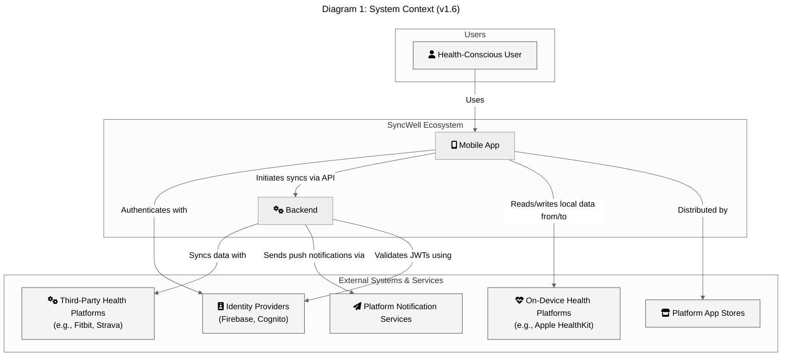

</details>

### Level 2: Containers

This level zooms into the system boundary to show the high-level technical containers for the MVP. The architecture is focused on a low-latency **"hot path"** for handling real-time syncs of recent data. The core business logic for this path resides in a fleet of **AWS Lambda functions**, promoting code reuse and scalability. A core technology used is **Kotlin Multiplatform (KMP)**, which allows for sharing this worker logic between the mobile application and the backend.

Designs for post-MVP features like the "cold path" for historical syncs have been deferred and are captured in `../prd/45-future-enhancements.md`.

**Note on Diagram Clarity:** The following diagram is a high-level overview for the MVP. It omits secondary components like the S3 bucket for archiving DLQ messages (`syncwell-prod-dlq-archive`) and post-MVP components like the AI Insights Service. The DLQ archive bucket will be configured with a specific lifecycle policy: **transition objects to S3 Glacier Instant Retrieval after 90 days and delete them after 365 days.**

**Security Note:** To avoid clutter, IAM roles are not explicitly drawn. However, a foundational security principle of this architecture is that *all inter-service communication is secured via least-privilege IAM roles*.

<details>
<summary>Diagram 2a: Ingress & Authentication Flow</summary>

This diagram shows how requests from both end-users and third-party webhooks enter the system through the edge network and are authenticated.

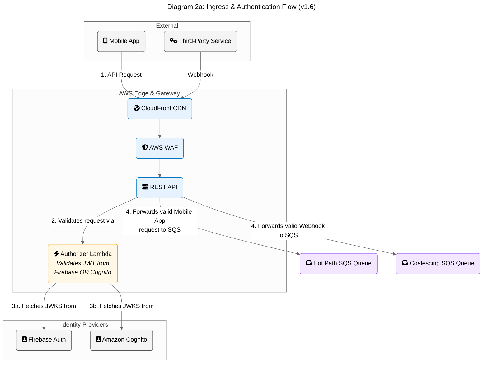

</details>
<details>
<summary>Diagram 2b: Webhook Event Coalescing Flow</summary>

This diagram details the cost-optimization pattern used to handle "chatty" webhooks by buffering and deduplicating them before triggering a sync.

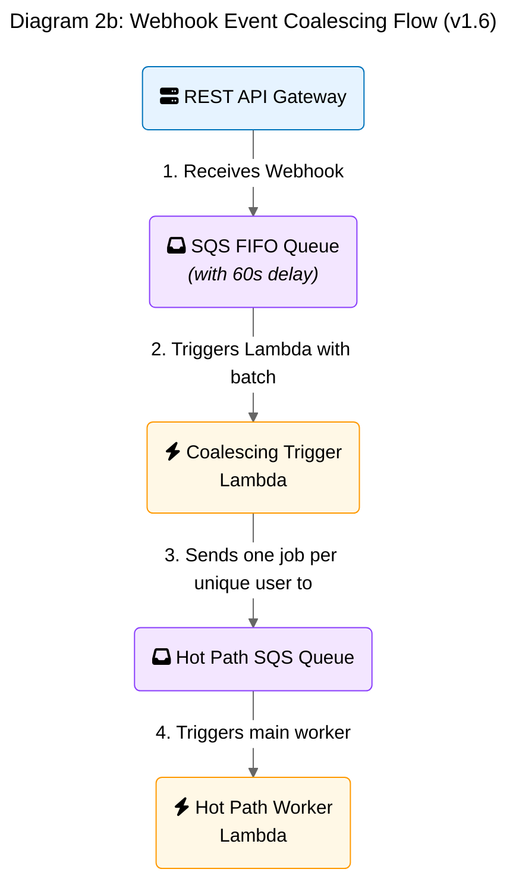

</details>
<details>
<summary>Diagram 2c: Core "Hot Path" Worker Flow</summary>

This diagram shows the main components involved in processing a standard, real-time synchronization job.

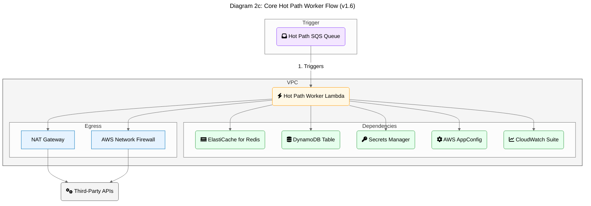

</details>
<details>
<summary>Diagram 2d: Real-Time WebSocket Flow</summary>

This diagram shows the separate, low-latency path for users who are actively using the app, providing a near real-time sync experience.

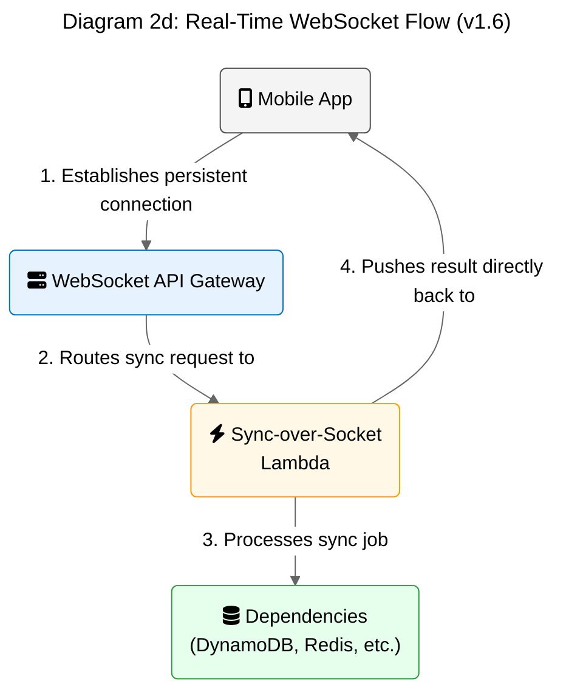

</details>

1.  **Mobile Application (Kotlin Multiplatform & Native UI)**
    *   **Description:** The user-facing application that runs on iOS or Android. It handles all user interactions and is a key component of the hybrid sync model.
    *   **Technology:** Kotlin Multiplatform (KMP) for shared business logic, SwiftUI for iOS, Jetpack Compose for Android.
    *   **Responsibilities:** Provides the UI, integrates with the Firebase Authentication SDK to manage the user sign-up/sign-in flows, securely stores JWTs using the platform's **Keychain (iOS) or Keystore (Android)**, and handles on-device syncs (e.g., HealthKit).
    *   **Error Handling:** If the Keychain/Keystore is unavailable, the application must display a non-dismissible error message to the user and prevent any sync operations from occurring until the issue is resolved.
    *   **JWT Refresh Strategy:** The mobile application will proactively refresh the 1-hour JWT in the background approximately 5 minutes before it expires to ensure a seamless user experience.

2.  **Authentication Service (Firebase Authentication)**
    *   **Description:** A managed, third-party service that handles all aspects of user identity, including sign-up, sign-in, and social provider integration (Google/Apple).
    *   **Technology:** Firebase Authentication (Google Cloud).
    *   **Responsibilities:** Manages user credentials, issues short-lived JWTs with a **1-hour TTL** to the mobile client after a successful authentication event, and provides public keys for backend token verification.

3.  **Scalable Serverless Backend (AWS)**
    *   **Description:** A decoupled, event-driven backend on AWS that uses a fleet of **AWS Lambda functions** for its core business logic to orchestrate all "Hot Path" syncs. This approach, detailed in Section 1's key architectural decision, provides extreme scalability and cost-effectiveness for the system's event-driven workload.
    *   The backend **must not** persist any raw user health data; this critical security requirement will be enforced via a dedicated test case in the QA plan (`../qa/14-qa-testing.md#TC-SEC-01`) and supplemented with automated static analysis rules to detect accidental persistence of sensitive data types. Any temporary diagnostic metadata containing user identifiers is stored in a secure, audited, time-limited index, as detailed in `../security/19-security-privacy.md`. Data is otherwise only processed ephemerally in memory during active sync jobs.
    *   **Technology:** AWS Lambda, API Gateway, **Amazon EventBridge**, **Amazon SQS**, DynamoDB.
    *   **Responsibilities:** The API Layer (**API Gateway**) is responsible for initial request validation (e.g., format), authorization via the `AuthorizerLambda`, and routing requests to the appropriate backend service. It does not handle business-level validation like idempotency checks. To ensure maximum performance and cost-effectiveness, it will leverage **API Gateway's built-in caching for the Lambda Authorizer**. The authorizer's response (the IAM policy) will be cached based on the user's identity token for a **5-minute TTL**. For subsequent requests within this TTL, API Gateway will use the cached policy and will not invoke the `AuthorizerLambda`, dramatically reducing latency and cost. All communication between backend services is secured using granular, least-privilege IAM roles, ensuring a secure-by-default posture.
    *   **Risk:** This caching strategy introduces a known risk: if a user's permissions are revoked, they may retain access for up to the 5-minute TTL of the cached policy. Conversely, a user with newly granted permissions may have to wait up to 5 minutes for access. This trade-off is accepted to achieve the required API performance.

4.  **Distributed Cache (Amazon ElastiCache for Redis)**
    *   **Description:** An in-memory caching layer to improve performance and reduce load on downstream services. The cluster must be **sized to handle 5,000 RPS with a P99 latency of < 10ms**, which is a significant safety threshold above the MVP's peak NFR of 3,000 RPS. Sizing is based on an assumption of **1KB average item size**, derived from analyzing the serialized `UserSyncConfig` objects. The initial cluster will use **`cache.m6g.large`** instances.
    *   **Technology:** Amazon ElastiCache for Redis.
    *   **Responsibilities:**
        *   Caches frequently accessed, non-sensitive data (e.g., user sync configurations).
        *   Powers the rate-limiting engine to manage calls to third-party APIs.

5.  **Monitoring & Observability (AWS CloudWatch)**
    *   **Description:** A centralized system for collecting logs, metrics, and traces from all backend services. A robust observability strategy is critical for operating this system reliably and cost-effectively.
    *   **Technology:** AWS CloudWatch (Logs, Metrics, Alarms), AWS X-Ray.
    *   **Responsibilities:** Provides insights into system health, performance, and error rates. Triggers alarms for critical issues.

    ### Required Telemetry

    *   **Metrics:**
        *   **Standard:** All Lambda functions must use the **CloudWatch Embedded Metric Format (EMF)** to publish custom business and operational metrics (e.g., `SyncSuccessRate`, `CacheHitRate`). This is more cost-effective than making individual `PutMetricData` API calls.
        *   **Cardinality Guidance:** High-cardinality dimensions (like `userId` or `jobId`) **must not** be used in CloudWatch metrics as this will lead to exorbitant costs. Use low-cardinality dimensions like `Tier: [PRO|FREE]`, `Outcome: [SUCCESS|FAILURE]`, `Provider: [Fitbit|Strava]`.
    *   **Distributed Tracing:**
        *   **Standard:** **OpenTelemetry** must be adopted as the standard for instrumenting all services.
        *   **Correlation ID:** A `correlationId` (the trace ID) must be generated at the edge (API Gateway) for every request. This ID **must** be propagated through all services (SQS, Lambda) and **must** be included in every log line. This is non-negotiable for enabling distributed tracing.
    *   **Structured Logging:**
        *   All log output **must** be structured JSON.
        *   The **AWS Lambda Powertools** library should be used as it provides out-of-the-box support for structured logging, tracing, and metrics.
        *   Every log entry must contain the `correlationId`.

    ### SLI/SLO Examples & Alerting

    The SLOs are defined in Section 3b. The following are examples of the alerts that must be configured to monitor them.

    *   **High-Severity Alert (Pages On-Call Engineer):**
        *   **Name:** `P0 - Core API Availability Below SLO`
        *   **Metric:** `(count(non-5xx responses) / count(total responses)) * 100`
        *   **Threshold:** `Value < 99.95%`
        *   **Evaluation Period:** For 5 consecutive periods of 1 minute.
        *   **Action:** Page the SRE on-call via PagerDuty.

    *   **Low-Severity Alert (Creates a Ticket):**
        *   **Name:** `P2 - Cache Latency Nearing SLO`
        *   **Metric:** `p99(ElastiCache_Latency)`
        *   **Threshold:** `Value > 10ms`
        *   **Evaluation Period:** For 30 consecutive periods of 1 minute.
        *   **Action:** Create a `P2-High` ticket in Jira assigned to the core backend team.

    ### Must-Have Dashboards & Runbooks

    *   **Required Dashboards:**
        1.  **API Gateway Health:** RPS, 4xx/5xx error rates, p95/p99 latency, per-endpoint breakdown.
        2.  **Lambda Worker Health:** Invocation count, throttles, error rate, average/p99 duration, provisioned vs. on-demand concurrency.
        3.  **Business KPIs:** DAU, `SyncSuccessRate`, new user signups, Pro tier conversion rate, churn rate.
        4.  **Database Health:** Consumed vs. provisioned RCU/WCU, throttle count, latency, GSI utilization.
        5.  **Cost Analysis:** Real-time estimated cost by service (via AWS Cost Explorer), with alerts for anomalies.
        6.  **Security Operations:** WAF blocked requests, API key usage patterns, suspicious IAM activity from CloudTrail.

    *   **Required Runbooks:**
        1.  `runbook-region-failover.md` (Created in Section 3b)
        2.  `runbook-db-cache-failure.md` (Created in Section 3b, expanded to include cache)
        3.  `runbook-traffic-spike.md` (Created in Section 3b)
        4.  **`runbook-third-party-outage.md`:** Steps to identify and isolate a failing third-party API, including how to disable a specific provider via AppConfig to prevent cascading failures.
        5.  **`runbook-deployment-rollback.md`:** Step-by-step guide for rolling back a failed canary deployment, including how to analyze canary metrics and how to force a full rollback via the CI/CD system.

6.  **Data Governance & Schema Registry (AWS Glue Schema Registry)**
    *   **Description:** To manage the evolution of our canonical data models (e.g., `CanonicalWorkout`), we will use the AWS Glue Schema Registry. It acts as a central, versioned repository for our data schemas.
    *   **Technology:** AWS Glue Schema Registry.
    *   **Responsibilities:**
        *   Stores all versions of the canonical data model schemas.
        *   **Must** enforce schema evolution rules (specifically **`BACKWARD_ALL`**) within the CI/CD pipeline, preventing the deployment of breaking changes.
        *   **Breaking Change Process:** In the rare event a breaking change is required, it must follow a formal process: 1) A new major version of the schema is published. 2) A new version of the code that can handle both the old and new schemas is deployed. 3) A migration process is run to update existing data or systems. 4) The old schema version is deprecated.
        *   Provides schemas to the worker service (AWS Lambda) for serialization and deserialization tasks, ensuring data conforms to the expected structure.

7.  **Centralized Configuration Management (AWS AppConfig)**
    *   **Description:** To manage dynamic operational configurations and feature flags, we will adopt AWS AppConfig. This allows for safe, audited changes without requiring a full code deployment.
    *   **Technology:** AWS AppConfig.
    *   **Responsibilities:**
        *   Stores and serves feature flags (e.g., enabling a feature for Pro users).
        *   Manages operational parameters such as API timeouts, logging levels, and rate-limiting thresholds.
        *   **Manages critical resource identifiers (e.g., the DynamoDB table name). This is a crucial element of the disaster recovery strategy, allowing the application to be repointed to a restored database table without a code deployment.**
    *   **[R-001] Risk:** Storing critical configuration like the database table name in AppConfig creates a dependency. A failure to access AppConfig at application startup could prevent the service from running. This risk is mitigated by AppConfig's own high availability and our use of aggressive client-side caching within the Lambda functions. However, a prolonged, widespread AppConfig outage remains a **High** impact, low-probability risk, which has been formally accepted by the product owner. The business impact would be the **inability to onboard new users or process syncs for existing users whose configuration is not cached**.
    *   **[T-004] [U-004] Graceful Degradation Strategy:** In the event of a prolonged AppConfig outage where the client-side cache also fails, the application **must** enter a safe, degraded mode.
        *   **Behavior:** The system should operate with sensible, hard-coded default configurations that are bundled with the application (e.g., `defaultLogLevel: "WARN"`, `defaultRateLimit: 10 RPS`).
        *   **Critical Failure:** If a critical value like the DynamoDB table name cannot be retrieved, the service must fail fast and explicitly, logging a critical error.
        *   **User-Facing Message:** No message is shown for using default configs, but if the service fails, the user will see a generic "Something went wrong, please try again later" message. The exact wording and design of this message is defined in the UX documentation.

8.  **Static Asset Delivery (Amazon S3 & CloudFront)**
    *   **Description:** A global content delivery network (CDN) to ensure that all static assets are delivered to users with low latency and high transfer speeds.
    *   **Technology:** Amazon S3, Amazon CloudFront.
    *   **Responsibilities:** Hosts and serves all static assets for the mobile application. The list of assets includes, but is not limited to, provider icons, marketing banners, and tutorial images. The mobile client will fetch these assets directly from the nearest CloudFront edge location, not from the backend service. This is a critical best practice for performance and cost-effectiveness.

9.  **Real-time WebSocket API (API Gateway)**
    *   **Description:** A persistent, stateful connection endpoint for foreground users to provide a near real-time sync experience and reduce load on the asynchronous backend.
    *   **Technology:** API Gateway (WebSocket API), AWS Lambda.
    *   **Responsibilities:** Manages the WebSocket lifecycle (`$connect`, `$disconnect`, `$default`). When a sync is requested over the WebSocket, it is routed to a lightweight `SyncOverSocketLambda`. This Lambda is implemented in **TypeScript on the NodeJS runtime** for optimal performance and low cold-start latency. It can process the sync and return the result directly over the connection. This bypasses the entire SQS/Lambda flow for "hot users," providing lower latency and reducing costs.

### Level 3: Components (Inside the KMP Shared Module)

The KMP module contains the core, shareable business logic. The architectural strategy is to use **KMP for portable business logic** and **platform-native runtimes for performance-critical infrastructure code**.

For the backend, this means the general strategy is to compile the KMP module to a JAR, package it as a Lambda function, and run it on the **AWS Lambda** worker fleet. However, security-critical, latency-sensitive functions like the `AuthorizerLambda` that are not part of the main worker fleet **must** be implemented in a faster-starting runtime. **TypeScript** is the preferred language for these functions due to its strong typing and excellent performance on the NodeJS Lambda runtime. This is a deliberate, non-negotiable trade-off. The P99 latency SLO of <500ms for the entire API Gateway request cannot be reliably met if the authorizer suffers from a multi-second JVM cold start.

*   **[T-001] Trade-off Acceptance:** This decision creates a deliberate contradiction with the project's goal of using a single cross-platform framework (KMP). The complexity of maintaining a hybrid runtime is a formally accepted technical trade-off, made to meet the non-functional requirement for API latency. The estimated maintenance overhead is **~4 engineering hours per month** for dependency updates and context switching.

*   **`SyncManager`:** Orchestrates the sync process.
    *   **Inputs:** `SyncConfig` object (defined in `05-data-sync.md`), `DataProvider` instances for source and destination.
    *   **Outputs:** A `SyncResult` object (success or failure).
*   **`ConflictResolutionEngine`:** Detects and resolves data conflicts. For the MVP, this will be a simple, rules-based engine (e.g., "newest wins"). "Newest" refers to the data record's modification timestamp.
    *   **Inputs:** Two `CanonicalData` objects.
    *   **Outputs:** A single, merged `CanonicalData` object.
*   **`ProviderManager`:** Manages and provides instances of `DataProvider` modules.
    *   **Inputs:** A `providerId` string (e.g., "fitbit").
    *   **Outputs:** An initialized `DataProvider` instance.
*   **`DataProvider (Interface)`:** A standardized interface for all third-party integrations. Its method signatures are canonically defined in the `./07-apis-integration.md` document, creating a formal dependency. Implementations must also account for the platform limitations defined in `32-platform-limitations.md`.
*   **`ApiClient`:** Handles HTTP calls to backend and third-party services.
*   **`SecureStorageWrapper`:** Abstraction for Keychain/Keystore (on-device) and AWS Secrets Manager (on-backend).
    *   **Error Handling:** If the underlying secret store (e.g., Secrets Manager) is unavailable, this component **must** throw a specific, catchable `SecureStorageUnavailableException` to allow the caller to implement appropriate retry logic. This is a custom exception defined within the KMP shared module.
    *   **[T-002] System-Level Fallback:** If Secrets Manager is unavailable for an extended period, the system will enter a degraded mode. Syncs requiring new tokens will fail, but syncs for existing, cached connections may continue if the `WorkerLambda` has a warm instance with the tokens already in memory. This risk has been formally accepted by the product owner. Users whose syncs fail will receive a generic "temporarily unable to sync" message.

### Level 3: Extensible Provider Integration Architecture

The core value of the application is its ability to connect with various third-party health services. To support rapid and reliable addition of new providers, the architecture defines a "plug-in" model. This model ensures that adding a new integration (e.g., for "Polar") is a predictable process that does not require changes to the core sync engine. This is achieved through a standardized interface, a factory for dynamic loading, and a secure configuration management strategy.

#### 1. The `DataProvider` Interface

All provider-specific logic is encapsulated in a class that implements the `DataProvider` interface. This interface, defined in the KMP shared module, creates a standardized contract for all integrations. The canonical definition of this critical interface, including its method signatures and the `capabilities` field, is maintained in `./07-apis-integration.md`.

#### 2. Dynamic Loading with a Factory Pattern

The `ProviderManager` component acts as a factory to dynamically instantiate and manage provider-specific logic based on user configuration. This decouples the core sync engine from the individual provider implementations.

*   **Process:**
    1.  **Initialization:** On startup, the `ProviderManager` is initialized with a registry mapping `providerId` strings to their corresponding `DataProvider` implementation classes. This registry is populated via **manual registration** in a dedicated initialization file to ensure type safety and prevent classpath scanning issues.
    2.  **Request:** The `SyncWorker` receives a job (e.g., "sync steps from 'fitbit' to 'strava'").
    3.  **Lookup:** It requests the `DataProvider` for "fitbit" from the `ProviderManager`.
    4.  **Instantiation:** The `ProviderManager` consults its registry, finds the `FitbitProvider` class, instantiates it, and returns the object to the worker.
    5.  **Execution:** The worker then uses this object to perform the data fetch.

<details>
<summary>Diagram 3: ProviderManager Factory Pattern</summary>

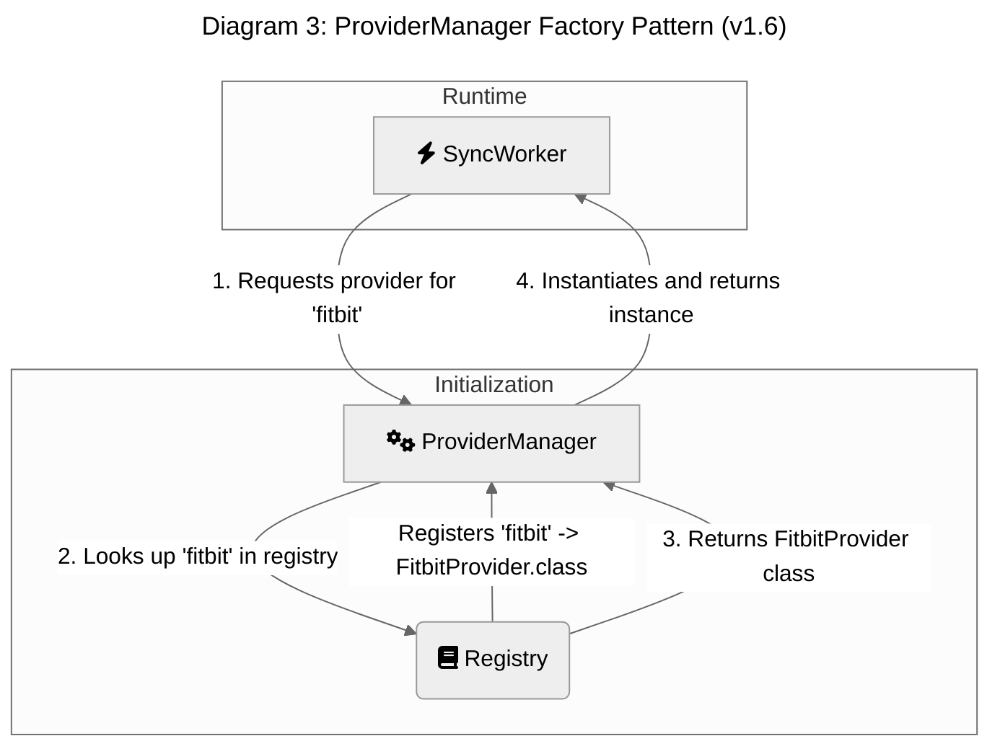

</details>

This design means that to add a new provider, a developer only needs to implement the `DataProvider` interface and register the new class with the `ProviderManager`'s registry.

#### 3. Secure Configuration and Secret Management

A secure and scalable strategy is essential for managing provider-specific configurations and API credentials.

*   **Provider-Specific Configuration:** Non-sensitive configuration, such as API endpoint URLs or supported data types, is stored in a **JSON** configuration file **within the same source code module/package** as the provider's implementation.
*   **Application API Credentials:** The OAuth `client_id` and `client_secret` for each third-party service are highly sensitive. These are stored securely in **AWS Secrets Manager**. The backend services retrieve these credentials at runtime using a narrowly-scoped IAM role.
*   **User OAuth Tokens:** User-specific `access_token` and `refresh_token` are encrypted and stored in **AWS Secrets Manager**. To avoid storing a predictable secret ARN in the database, the `Connection` item in DynamoDB will store a randomly generated UUID as the pointer to the secret.
    *   **Secure ARN Mapping:** The mapping from this UUID to the full AWS Secrets Manager ARN **must** be stored securely. This mapping will be managed as a secure JSON object within the **`applications/syncwell-backend/production/arn-mappings`** configuration profile in **AWS AppConfig**.
    *   **Dynamic IAM Policies for Least Privilege:** When a Worker Lambda processes a job, it must be granted permission to retrieve *only* the specific secret for the connection it is working on. This is a critical security control. This will be achieved by having the orchestrating service (e.g., Step Functions for the Cold Path, or the SQS poller for the Hot Path) generate a **dynamic, narrowly-scoped IAM session policy** that grants temporary access only to the specific secret ARN required for the job. This policy is then passed to the `WorkerLambda`, ensuring it operates under the principle of least privilege for every execution. The **Security Team** is responsible for auditing the policy generation logic on a quarterly basis. A concrete example of such a policy, which uses IAM policy variables to restrict access based on tags, is shown below. This ensures a Lambda can only access secrets tagged with the ID of the user it is processing.
        ```json
        {
          "Effect": "Allow",
          "Action": "secretsmanager:GetSecretValue",
          "Resource": "arn:aws:secretsmanager:us-east-1:123456789012:secret:prod/syncwell/user-tokens-*",
          "Condition": {
            "StringEquals": {
              "secretsmanager:ResourceTag/userId": "${aws:PrincipalTag/userId}"
            }
          }
        }
        ```

## 3. Sync Models: A Hybrid Architecture

To ensure reliability and accommodate platform constraints, SyncWell uses a hybrid architecture. This means some integrations are handled entirely in the cloud ("Cloud-to-Cloud"), while others require on-device processing using native SDKs.

The following table clarifies the integration model for each provider supported in the MVP:

| Provider | Integration Model | Rationale |
| :--- | :--- | :--- |
| **Apple Health** | Device-to-Cloud / Cloud-to-Device | **Platform Constraint:** HealthKit is a device-native framework with no cloud API. All processing **must** happen on the user's device. |
| **Google Fit** | Hybrid (Device & Cloud) | **User Benefit & Modernization:** While Google Fit has a REST API, the new Health Connect SDK provides access to richer, more real-time data directly on the user's device. The implementation will be device-first to provide the best user experience. The cloud API will only be used as a fallback if the on-device sync fails with an error indicating the provider is unavailable (e.g., the user has not installed Health Connect). |
| **Fitbit** | Cloud-to-Cloud | Fitbit provides a comprehensive REST API for all data types. No on-device component is needed. |
| **Garmin** | Cloud-to-Cloud | Garmin provides a cloud-based API. No on-device component is needed. |
| **Strava** | Cloud-to-Cloud | Strava provides a cloud-based API. No on-device component is needed. |

### Model 1: Cloud-to-Cloud Sync (MVP Focus)

For the MVP, cloud-to-cloud syncs are handled by a single, reliable architectural pattern: the **"Hot Path"**.

#### **Hot Path Sync**
*   **Use Case:** Handling frequent, automatic, and user-initiated manual syncs for recent data.
*   **Flow:**
    1.  The Mobile App sends a request to API Gateway to start a sync.
    2.  **API Gateway** uses a direct AWS service integration to validate the request and send the `HotPathSyncRequested` message directly to the **Amazon SQS Standard queue** (`HotPathSyncQueue`). This is a critical cost optimization that bypasses the more expensive EventBridge service for this specific high-volume ingestion path.
    3.  The SQS Standard queue, which now receives messages directly from API Gateway, acts as a buffer to protect the system from load spikes.
    4.  The SQS queue is configured as a trigger for the `WorkerLambda`, which processes the job.
    5.  **Failure Handling:** The primary SQS queue is configured with a **Dead-Letter Queue (DLQ)**. On a **non-transient processing error** (e.g., an invalid credentials error `401`, a permanent API change `404`, or an internal code bug), the worker throws an exception. After a configured number of retries (`maxReceiveCount` on the Lambda event source mapping), SQS automatically moves the failed message to the DLQ for out-of-band analysis.
        *   **`maxReceiveCount` Rationale:** This will be set to **5**. This value is chosen based on the number of attempts, not time. It balances allowing recovery from intermittent, transient errors against not waiting too long to detect a persistent failure.
    6.  Upon successful completion, the `WorkerLambda` publishes a `SyncSucceeded` event back to the EventBridge bus. This event is consumed by other services, primarily to trigger a push notification to the user and for analytics.
*   **Advantage:** This is a highly reliable and extensible model. Leveraging the native SQS DLQ feature simplifies the worker logic, increases reliability, and improves observability.

<details>
<summary>Diagram 4: Hot Path Sync Flow (Simplified)</summary>

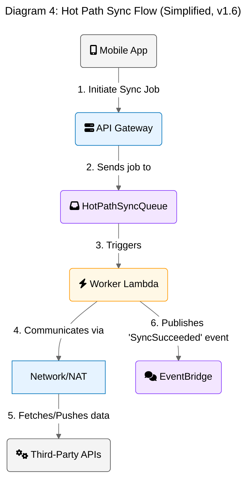

</details>

#### **Post-MVP: Historical Sync (Cold Path)**
The ability for users to backfill months or years of historical data is a key feature planned for a post-MVP release. The detailed architecture for this "Cold Path," which will use AWS Step Functions to orchestrate the complex workflow, is captured in `../prd/45-future-enhancements.md`.

### Model 2: Device-to-Cloud Sync
This model is required for integrations where the source of data is a device-native framework with no cloud API, such as Apple HealthKit or Google's Health Connect SDK. The sync process is initiated and driven by the mobile client.

*   **Use Case:** Syncing data *from* Apple Health *to* a cloud provider like Strava.
*   **Flow:**
    1.  **Trigger:** The sync is triggered on the device, either by a background schedule (e.g., an iOS `BGAppRefreshTask`) or a user-initiated manual sync.
    2.  **On-Device Fetch:** The KMP module running on the device calls the appropriate native API (e.g., HealthKit's `HKSampleQuery`) to fetch new data since the last successful sync timestamp, which is stored locally.
    3.  **Canonical Transformation:** The fetched data is transformed into the `CanonicalData` format by the shared KMP logic.
    4.  **Data Push to Backend:** The mobile app makes a secure API call to a dedicated backend endpoint (`POST /v1/device-upload`). The request body contains the batch of canonical data.
    5.  **Backend Processing:** The backend receives this pre-fetched data. It then initiates a sync process that is very similar to the "Hot Path" model, with one key difference: it skips the "fetch from source" step.
    6.  **Conflict Resolution & Destination Write:** The backend fetches overlapping data from the destination cloud provider (e.g., Strava) to perform conflict resolution. It then pushes the final, conflict-free data to the destination.
    7.  **State Update:** The backend updates its state in DynamoDB. Upon receiving a successful response from the backend, the mobile app updates its local `lastSyncTime` to ensure it doesn't fetch the same data again.
*   **Advantage:** This model allows SyncWell to integrate with device-only data sources, which is a key product differentiator.
*   **Limitation:** Syncs can only occur when the user's device is on, has battery, and has a network connection. This is an unavoidable constraint of the underlying platforms. Users will be informed of this limitation via an in-app tooltip next to the relevant provider connections.

<details>
<summary>Diagram 7: Device-to-Cloud Sync Flow</summary>

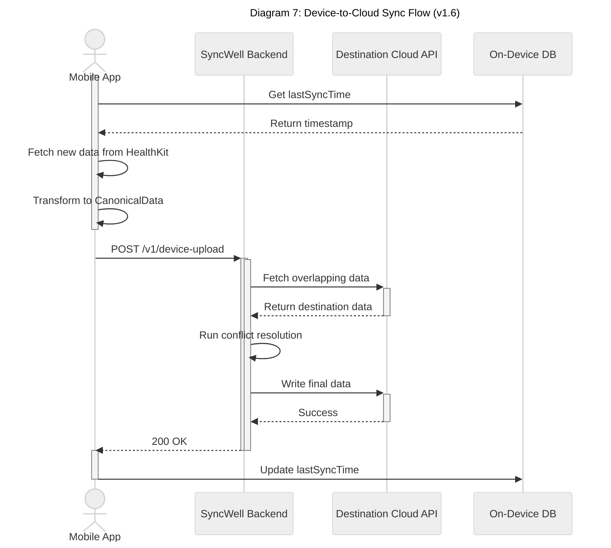

</details>

### Model 3: Cloud-to-Device Sync
This model handles the reverse of Model 2, where the destination for the data is a device-native framework like Apple HealthKit. Because the backend cannot directly initiate a connection to write data onto a user's device, it must use a push notification to signal the mobile client to pull the data down.

*   **Use Case:** Syncing data *from* a cloud provider like Garmin *to* Apple Health.
*   **Flow:**
    1.  **Standard Cloud Sync:** A regular "Hot Path" sync is initiated on the backend (e.g., triggered by a webhook from Garmin).
    2.  **Difference in "Fetch from Destination":** To perform conflict resolution, the backend must get data from the destination (Apple Health). It does this by sending a "read request" via a silent push notification to the device. The mobile app wakes up, fetches the requested data from HealthKit, and sends it back to the waiting backend process.
    3.  **Temporary Data Staging:** After the conflict resolution engine produces the final, conflict-free data, the backend stages this data in a temporary, secure location (e.g., a dedicated S3 bucket with a short, **1-hour** lifecycle policy to minimize privacy risk).
    4.  **Silent Push Notification:** The backend sends another silent push notification (e.g., an APNs push with `priority: 5` and the `content-available` flag set to 1) to the user's device. The notification payload contains a `jobId` that points to the staged data.
    5.  **Client-Side Pull & Write:** The mobile app, upon receiving the silent push, wakes up in the background. It makes a secure API call to the backend, providing the `jobId` to fetch the staged canonical data.
    6.  **On-Device Write:** The KMP module receives the data and uses the appropriate native APIs (e.g., HealthKit's `save` method) to write the data into the local health store.
    7.  **Confirmation:** After successfully writing the data, the mobile app makes a final API call to the backend to confirm the completion of the job. The backend then deletes the temporary staged data.
*   **Advantage:** This architecture enables writing data to device-only platforms, completing the loop for a truly hybrid sync model.
*   **Resilience:** If the user's device is offline or unreachable, the silent push notification will not be delivered immediately. The staged data will remain on the backend for a reasonable period (1 hour), and the sync will be attempted the next time the device comes online and the app is launched.

<details>
<summary>Diagram 8: Cloud-to-Device Sync Flow</summary>

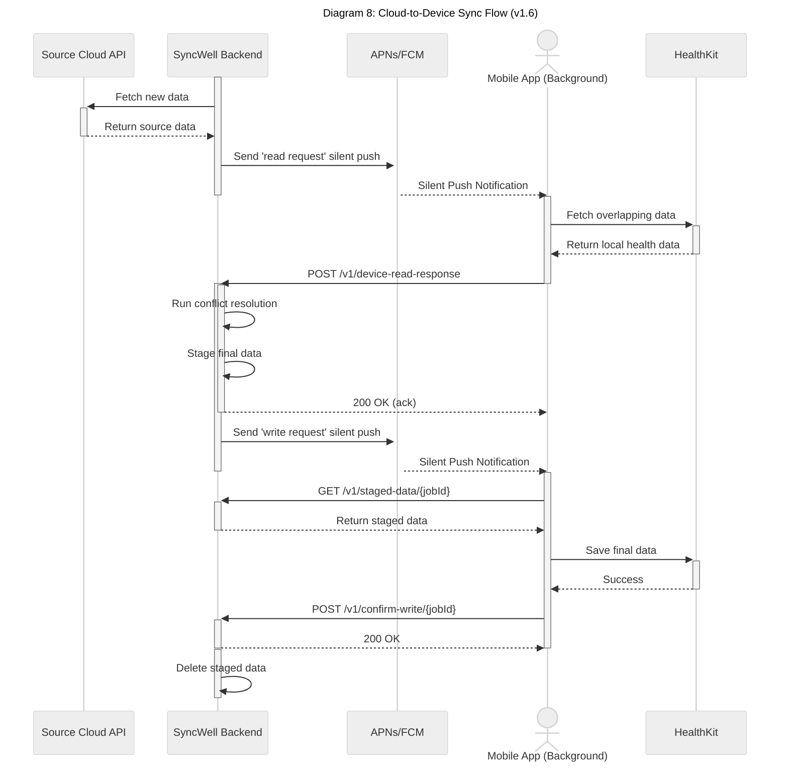

</details>

### Model 4: Webhook-Driven Sync with Event Coalescing

To provide a near real-time user experience and dramatically reduce costs, the architecture uses a webhook-first strategy. However, to prevent "event chatter"where multiple rapid-fire webhooks for the same user trigger numerous, expensive, individual sync jobsthis model is enhanced with an **Event Coalescing** layer. This strategy significantly reduces the volume of events processed by EventBridge and SQS, which are key drivers of variable costs.

*   **Use Case:** Receiving notifications that new data is available, buffering them briefly to merge related events, and then triggering a single, consolidated sync job.
*   **New AWS Resources:**
    *   **SQS FIFO Queue:** `CoalescingBufferQueue`
    *   **AWS Lambda Function:** `CoalescingTriggerLambda`
        *   **Language/Runtime:** TypeScript on NodeJS
        *   **Memory:** 128MB
    *   **IAM Role:** An IAM role for the `CoalescingTriggerLambda` with permissions to publish events to EventBridge.
*   **Flow:**
    1.  **Ingestion:** The API Gateway endpoint that receives incoming webhooks will no longer publish events directly to the main EventBridge bus. Instead, it will send a message to a new **SQS FIFO (First-In, First-Out) queue** named `CoalescingBufferQueue`.
    2.  **Buffering & Deduplication:** The `CoalescingBufferQueue` will have a `deliveryDelay` of 60 seconds. This creates a short-term buffer, allowing multiple events for the same user to accumulate. The `userId` will be used as the `MessageDeduplicationId` to ensure that messages for the same user are processed in order.
    3.  **Triggering:** A new, lightweight Lambda function, `CoalescingTriggerLambda`, will be configured with the `CoalescingBufferQueue` as its event source.
    4.  **Coalescing Logic:**
        *   When the `CoalescingTriggerLambda` is invoked, it will receive a batch of messages from the SQS queue.
        *   It will iterate through the messages, extracting the `userId` from each.
        *   Using a local `Set` to track unique user IDs within the batch, it will send a single, consolidated `SyncRequest` message directly to the **`HotPathSyncQueue`** for each unique user. This is a key MVP cost optimization.
        *   This ensures that even if 10 webhook events for a single user were received in the 60-second window, only one sync message is sent.
    5.  **Execution:** The consolidated message is now in the `HotPathSyncQueue` and is processed by the standard "Hot Path" architecture.
*   **Advantage:** This model directly attacks the "event chatter" identified as a key cost driver in the financial model. By having the `CoalescingTriggerLambda` send its message directly to the `HotPathSyncQueue`, it bypasses EventBridge, reducing both latency and cost for the MVP. This direct integration pattern mirrors the one used by API Gateway for maximum efficiency. It relies on native SQS FIFO features for buffering and deduplication, providing a simpler, more robust, and more cost-effective solution compared to a custom implementation using Redis. It significantly reduces the volume of downstream SQS messages.

## 3a. Unified End-to-End Idempotency Strategy

To ensure "exactly-once" processing semantics in a distributed system, a multi-layered idempotency strategy is required. This strategy is the single source of truth, resolving contradictions from previous drafts.

*   **[C-004] Header Specification:** The client **must** pass a unique `Idempotency-Key` HTTP header for all state-changing API calls (`POST`, `PUT`, `PATCH`, `DELETE`). The API Gateway will reject any request missing this header with a `400 Bad Request`.

*   **Key Generation:** The mobile client is responsible for generating a unique `Idempotency-Key` (e.g., a UUIDv4) for each new state-changing operation. This same key **must** be used for any client-side retries of that same operation.

*   **Authoritative Mechanism ("Hot Path"): DynamoDB-based Locking**
    *   The **sole authoritative** idempotency mechanism for the "Hot Path" is a distributed lock using a DynamoDB table. All other potential mechanisms (e.g., SQS FIFO MessageDeduplicationId) **must not** be relied upon for idempotency logic and should be removed from documentation to avoid confusion. This provides a persistent, reliable lock that is not subject to the 5-minute limitation of SQS FIFO deduplication.
    *   **Workflow:**
        1.  The `WorkerLambda` receives a job containing the `Idempotency-Key`.
        2.  It attempts to write an item to the `SyncWellMetadata` table with a primary key of `IDEM##{Idempotency-Key}` and a `status` of `INPROGRESS`, using a **condition expression** to fail if the item already exists.
        3.  If the write succeeds, the Lambda executes the business logic. Upon completion, it updates the item's `status` to `COMPLETED` and sets a **24-hour TTL**.
        4.  If the write fails because the item exists, the Lambda checks the item's `status`. If `COMPLETED`, it can safely discard the current job and return success. If `INPROGRESS`, it indicates a concurrent execution, and the current job should be dropped or retried with a delay.
    *   **Benefit:** This approach provides a robust, end-to-end guarantee of exactly-once processing for the lifetime of the idempotency key, managed by the TTL.

<details>
<summary>Diagram 9: Idempotency Check Flow</summary>

This sequence diagram illustrates the DynamoDB-based distributed locking mechanism used to ensure exactly-once processing for "Hot Path" sync jobs.

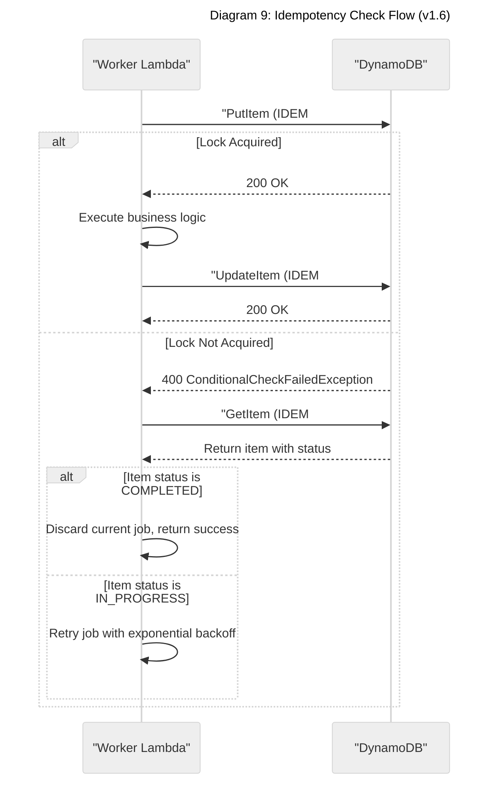

</details>

*   **Authoritative Mechanism ("Cold Path"): Step Functions Execution Naming**
    *   For long-running historical syncs orchestrated by Step Functions, the idempotency mechanism is to use the client-provided `Idempotency-Key` as the unique `name` for the Step Function execution.
    *   This is a native feature of Step Functions that prevents a duplicate workflow from starting. The detailed design for this is captured in `45-future-enhancements.md`.

*   **Deprecation of Other Mechanisms:**
    *   **SQS FIFO Deduplication:** While the `HotPathSyncQueue` may be a FIFO queue for ordering guarantees, its `MessageDeduplicationId` is **not** relied upon as the authoritative idempotency mechanism due to its short 5-minute window.
    *   **Redis-based Locking:** All previous references to a Redis-based locking mechanism are superseded by the DynamoDB-based strategy to improve reliability and reduce system complexity. This is a greenfield project, so no migration from a previous system is required.

## 3b. Architecture for 1M DAU

To reliably serve 1 million Daily Active Users, the architecture incorporates specific strategies for high availability, performance, and scalability. The title of this section reflects the ultimate goal, but the strategies described are phased, beginning with a pragmatic MVP.

### High Availability Strategy

#### MVP: High Availability Strategy
To meet the 99.9% availability SLO, the backend **must** be deployed with full Multi-AZ redundancy from day one. This includes deploying a Multi-AZ ElastiCache for Redis cluster. For Disaster Recovery, the `SyncWellMetadata` table **must** be configured as a DynamoDB Global Table with a replica in a DR region (e.g., `us-west-2`). **Point-in-Time Recovery (PITR) must also be enabled** on the table as a non-negotiable requirement to protect against data corruption events.

<details>
<summary>Diagram 5: Recommended Critical Path (Multi-AZ & Multi-Region)</summary>

This diagram illustrates the recommended end-to-end flow, incorporating multi-AZ and multi-region resilience boundaries.

```mermaid
---
title: "Recommended Critical Path (Multi-AZ & Multi-Region)"
---
graph TD
    subgraph "Global / DNS"
        User("`fa:fa-user User`")
        Route53("`fa:fa-route Route 53`")
    end

    subgraph "AWS Region: us-east-1 (Primary)"
        style `AWS Region: us-east-1 (Primary)` fill:#e6f3ff,stroke:#0073bb

        subgraph "Edge"
            CloudFront("`fa:fa-globe-americas CloudFront`")
            WAF("`fa:fa-shield-alt WAF`")
        end

        subgraph "API Layer"
            ApiGateway("`fa:fa-server API Gateway`")
            Authorizer("`fa:fa-bolt Authorizer Lambda`")
            UsagePlan("`fa:fa-tachometer-alt Usage Plan<br>(Per-User Rate Limit)`")
        end

        subgraph "Availability Zone 1"
            style `Availability Zone 1` fill:#ffffff,stroke-dasharray: 5 5
            Lambda_A("`fa:fa-bolt Worker Lambda`")
            Redis_A("`fa:fa-memory Redis Primary`")
        end

        subgraph "Availability Zone 2"
            style `Availability Zone 2` fill:#ffffff,stroke-dasharray: 5 5
            Lambda_B("`fa:fa-bolt Worker Lambda`")
            Redis_B("`fa:fa-memory Redis Replica`")
        end

        SQS("`fa:fa-inbox SQS Queue`")
        Dynamo_P["`fa:fa-database DynamoDB<br>(Primary)`"]
    end

    subgraph "AWS Region: us-west-2 (DR)"
        style `AWS Region: us-west-2 (DR)` fill:#fde4d8,stroke:#d95300
        Dynamo_DR["`fa:fa-database DynamoDB<br>(Replica)`"]
    end

    %% Connections
    User --> Route53
    Route53 -- "Latency Routing" --> CloudFront
    CloudFront --> WAF
    WAF --> ApiGateway
    ApiGateway -- "Authorizes via" --> Authorizer
    ApiGateway -- "Enforces" --> UsagePlan
    ApiGateway -- "Enqueues job" --> SQS

    SQS -- "Triggers" --> Lambda_A & Lambda_B
    Lambda_A & Lambda_B -- "Read/Write" --> Redis_A
    Redis_A -- "Replicates to" --> Redis_B
    Lambda_A & Lambda_B -- "Read/Write State" --> Dynamo_P
    Dynamo_P -- "Global Table Replication" --> Dynamo_DR
```

</details>

#### Future: Multi-Region Architecture
The architecture is designed with a future multi-region deployment in mind. Prioritization of this work will be triggered by **business expansion into new geographic markets (e.g., the EU) or reaching 500,000 DAU**. Key considerations for this evolution include:
*   **Data Replication:** Migrating from a single-region DynamoDB table to a Global Table.
*   **Request Routing:** Implementing latency-based routing with Amazon Route 53.
*   **Data Residency & Compliance (GDPR):** The future multi-region strategy **must** include a comprehensive plan for data residency, likely involving region-specific infrastructure silos or fine-grained data routing policies to ensure compliance. This will be a primary workstream when the multi-region expansion is prioritized.

### Resilience Testing (Chaos & Load Testing Program)

The practice of chaos and load testing is critical to validate our high availability and scalability claims.

*   **Tools:**
    *   **Chaos Engineering:** **AWS Fault Injection Simulator (FIS)**.
    *   **Load Testing:** **k6** (scripts must be stored in the `/load-testing` directory of the repository).

*   **Ownership:** Experiments will be owned by the **Core Backend team**, who are also responsible for remediating any issues found.

*   **Schedule:**
    *   **Load Testing:** A suite of k6 tests must be run against the `staging` environment as a required gate in the CI/CD pipeline before any production deployment.
    *   **Chaos Engineering:**
        *   Automated chaos experiments must be run **weekly** in the `staging` environment.
        *   A formal "gameday" where chaos experiments are run manually in the **production** environment must be conducted **quarterly**.

*   **Experiment Catalog:** The catalog of experiments must include, at a minimum:
    *   **AZ failure:** Terminate all instances in one AZ to validate multi-AZ failover.
    *   **Lambda function failure:** Inject failure/exceptions into the Lambda runtime.
    *   **API latency injection:** Add delay to calls to critical third-party APIs.
    *   **Dependency failure:** Block access to DynamoDB, SQS, or Secrets Manager to test graceful degradation.
    *   **Cache cluster failure:** Reboot the ElastiCache cluster to ensure the application can function without its cache.
    *   **DNS failure:** Simulate failure to resolve a critical internal or external endpoint.

*   **Results & Action:** The results of each experiment (e.g., observed impact on latency, error rates) **must** be documented in a central location: [`../ops/chaos-engineering-results.md`](../ops/chaos-engineering-results.md). This file must be created and maintained. Any discovered regressions or unexpected failures must be logged as high-priority bugs in the issue tracker and addressed before the next release.

### Service Level Objectives (SLOs) & Error Budget Policy

*   **SLOs (Service Level Objectives):**
    *   **Availability:**
        *   **Core API:** `99.95%` of requests to `/v1/` endpoints, measured over a 28-day window, return a non-5xx response.
        *   **Hot-Path Sync Success:** `99.9%` of `HotPathSyncRequested` jobs complete successfully (i.e., do not end in the DLQ).
    *   **Latency:**
        *   **API Gateway (p99):** `< 500ms` for all synchronous API calls.
        *   **Manual Sync (p95):** `< 15 seconds` from user request to success confirmation.

*   **SLIs (Service Level Indicators):**
    *   **Availability:** `(count(non-5xx responses) / count(total responses)) * 100`
    *   **Latency:** `histogram_quantile(0.99, sum(rate(api_latency_bucket[5m])))`

*   **Error Budget Policy:**
    *   An error budget is the inverse of the SLO (e.g., `100% - 99.95% = 0.05%` budget).
    *   **If 50% of the 28-day error budget is consumed in any 7-day period:** An automatic, high-severity alert is sent to the on-call lead and engineering manager. A retrospective is required.
    *   **If 100% of the 28-day error budget is consumed:** All new feature development for the affected service is frozen. Engineering efforts must be redirected to reliability improvements until the service is back within SLO.

### RTO/RPO Targets & DR Strategy

*   **RTO (Recovery Time Objective):** `< 4 hours`. This is the target time to restore service after a declared disaster (e.g., full region outage).
*   **RPO (Recovery Point Objective):** `< 15 minutes`. This is the maximum acceptable data loss. This is primarily governed by DynamoDB Point-in-Time Recovery (PITR) and Global Table replication lag.
*   **DR Strategy:**
    *   **Primary Failure Domain:** A single AWS Availability Zone.
        *   **Mitigation:** All critical services (Lambda, ElastiCache, NAT Gateway) must be deployed in a multi-AZ configuration. An AZ failure should be a non-event with no user impact.
    *   **Secondary Failure Domain:** A full AWS Region (`us-east-1`).
        *   **Mitigation:** The primary DR strategy relies on failing over to the `us-west-2` region.
        *   **Failover Mechanics:**
            1.  **Data:** The DynamoDB Global Table replica in `us-west-2` is promoted to be the new primary.
            2.  **Traffic:** Amazon Route 53 health checks will detect the failure of the primary region's API endpoints and automatically change DNS records to route all traffic to a standby API Gateway deployment in `us-west-2`.
            3.  **Compute:** The Lambda functions and other compute resources will be deployed in the DR region (ideally via IaC) and will be activated to handle the traffic.

### High-Level Emergency Runbooks

These are short, actionable guides for on-call engineers.

#### **Runbook 1: Sudden 5x-10x Traffic Spike**
1.  **Acknowledge Alert:** Acknowledge the CloudWatch alarm for "High API Gateway 5xx Errors" or "High Lambda Throttles".
2.  **Verify Autoscaling:**
    *   Check the CloudWatch dashboard for "Lambda Concurrent Executions". Verify that the number is scaling up to meet demand.
    *   Check the "DynamoDB Throttled Requests" metric. Verify it is zero, indicating On-Demand capacity is scaling correctly.
3.  **Identify Source:**
    *   Check the AWS WAF dashboard for anomalous traffic patterns from specific IPs or regions.
    *   Check API Gateway logs for a spike in requests to a specific endpoint or from a specific user (if per-user logging is available).
4.  **Mitigate:**
    *   **If Malicious:** Use AWS WAF to block the offending IP addresses or apply a more aggressive rate-based rule.
    *   **If Legitimate (e.g., viral event):**
        *   If Lambda is throttling, manually increase the "Provisioned Concurrency" reservation in the AWS console as a temporary measure.
        *   Post a notification to the public status page acknowledging a high-traffic event and potential for degraded performance.
5.  **Escalate:** If the situation is not controlled within 15 minutes, escalate to the Head of Engineering.

#### **Runbook 2: Primary Region (`us-east-1`) Outage**
1.  **Acknowledge Alert:** Acknowledge the Route 53 Health Check failure alarm and PagerDuty alert for "Primary Region Unresponsive".
2.  **Confirm Outage:** Verify the outage via the official AWS Status page.
3.  **Initiate Failover Procedure:**
    *   In the Route 53 console, confirm that traffic has been automatically failed over to the `us-west-2` endpoints. If not, manually trigger the failover.
    *   In the DynamoDB console, verify that the `us-west-2` replica table is now handling all read/write traffic.
    *   Verify that the Lambda functions and API Gateway in `us-west-2` are processing requests by checking their logs and metrics.
4.  **Communicate:**
    *   Update the public status page to "Major Outage" and indicate that the system is operating in a degraded state from the DR region.
    *   Notify the Head of Engineering and Product leadership.
5.  **Plan for Failback:** Once the primary region is restored (as confirmed by the AWS Status page), plan a maintenance window to fail back traffic and data replication to `us-east-1`.

#### **Runbook 3: Master Database Failure (DynamoDB Unavailability in Primary AZ)**
*Note: With DynamoDB, a "master" failure is not the right model. This runbook addresses the unavailability of the DynamoDB endpoint in a single AZ or the entire primary region.*

1.  **Acknowledge Alert:** Acknowledge the CloudWatch alarm for "High DynamoDB Read/Write Errors" or "High DynamoDB Latency".
2.  **Assess Impact:**
    *   Check if the errors are isolated to a single AZ. If so, the multi-AZ Lambda deployment should handle this gracefully by routing requests to healthy AZs. Monitor the error rate to ensure it does not escalate.
    *   Check if the errors are region-wide. This indicates a larger-scale problem.
3.  **Verify Application Behavior:**
    *   Check if sync jobs are being correctly retried and eventually sent to the DLQ.
    *   Confirm that the application is failing "open" or "closed" as expected (e.g., returning a 503 error to clients).
4.  **Trigger Manual Failover (if region-wide):**
    *   If DynamoDB is unavailable across the entire `us-east-1` region, the incident becomes a "Region Outage".
    *   **Immediately escalate to the "Primary Region Outage" runbook.** The procedure is the same: fail over DNS and data plane to the `us-west-2` DR site.
5.  **Communicate:** Keep the status page and internal stakeholders updated on the impact and mitigation steps.

### Performance & Scalability

#### Caching Strategy
A distributed cache using **Amazon ElastiCache for Redis** is a critical component. The system will employ a **cache-aside** pattern. If a cache write fails after a database read, the error will be logged, and the application will return the data to the client. The next read for that data will simply be another cache miss, ensuring resilience.

The following table details the specific items to be cached:

| Item Type | Key Structure | Value | TTL | Purpose |
| :--- | :--- | :--- | :--- | :--- |
| **API Gateway Authorizer (L1 Cache)** | User's Identity Token | The generated IAM policy document | 5 minutes | The primary, most critical cache. Caches the final authorization policy at the API Gateway level. The P99 latency for the authorizer itself must be < 100ms. |
| **JWT Public Keys (L2 Cache)**| `jwks##{providerUrl}` | The JSON Web Key Set (JWKS) document | 1 hour | An in-memory cache inside the authorizer Lambda to reduce latency on the first request for a user. **[R-002] Risk:** Caching keys creates a risk where a compromised and revoked key could be considered valid for up to 1 hour. **Mitigation:** The authorizer must include an administrative API endpoint to force-invalidate a specific cached key from the ElastiCache cluster. Access to this endpoint is restricted to principals with the `iam:syncwell-admin` permission. |
| **User Sync Config** | `config##{userId}` | Serialized user sync configurations | 15 minutes | Reduces DynamoDB reads for frequently accessed user settings. |
| **Rate Limit Token Bucket** | `ratelimit##{...}` | A hash containing tokens and timestamp | 60 seconds | Powers the distributed rate limiter for third-party APIs. |
| **Negative Lookups** | e.g., `nosub##{userId}` | A special "not-found" value | 1 minute | Prevents repeated, fruitless queries for non-existent data (e.g., checking if a user has a Pro subscription). |
| **Sync Confidence** | `sync:confidence:{userId}:{destProvider}` | An integer counter for consecutive empty results. | 7 days | **Algorithmic Optimization:** Caches metadata about sync patterns to intelligently skip redundant API calls. The threshold is managed by the `SYNC_CONFIDENCE_THRESHOLD` environment variable. See `05-data-sync.md` for the detailed algorithm. |

#### Rate-Limiting Backoff Mechanism
The following diagram shows how a worker interacts with the distributed rate limiter. If the rate limit is exceeded, the worker **must not** fail the job. Instead, it will use the SQS `ChangeMessageVisibility` API to return the job to the queue with a calculated delay, using an **exponential backoff with full jitter** algorithm. The formula is `sleep = random_between(0, min(cap, base * 2 ** attempt))`.

*   **[R-003] Failure Handling:** The `ChangeMessageVisibility` API call can itself fail. The worker **must** implement a retry-with-backoff loop (3 retries, exponential backoff) for this specific API call. If it repeatedly fails to return the message to the queue, it must exit with a critical error to force a redrive to the DLQ, preventing an infinite loop and ensuring the job is not lost.

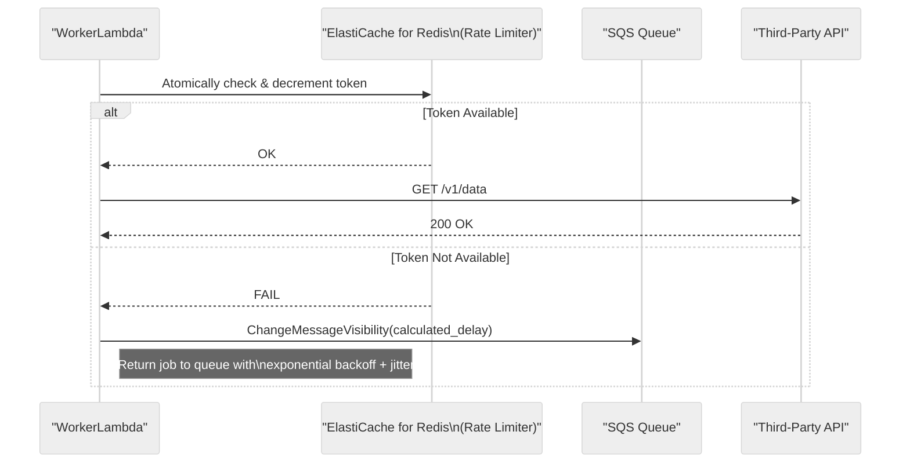

#### Load Projections & Scalability Model

*   **Governing NFR:** The system must be designed and load-tested to handle a peak load of **3,000 requests per second (RPS)**.

##### Foundational Traffic Model
The following model provides three scenarios (Conservative, Nominal, Aggressive) to bound the problem. The **Nominal** scenario is used for all subsequent capacity and cost calculations.

> **BLOCKER - Missing Data:** The following assumptions must be validated with real-world data from a private beta before public launch.

**Core User Activity Assumptions**

| Metric | Conservative | **Nominal (Used for Review)** | Aggressive | Unit | Rationale / Source |
| :--- | :--- | :--- | :--- | :--- | :--- |
| Daily Active Users (DAU) | 1,000,000 | **1,000,000** | 1,000,000 | Users | Target specified in prompt. |
| User Sessions / Day | 2 | **3** | 5 | Sessions/User | Industry standard for a health/fitness app. |
| API Requests / Session | 10 | **15** | 25 | Requests/Session | Assumes a mix of foreground/background activity. |
| "Hot Path" Syncs / User / Day | 5 | **10** | 20 | Syncs/User/Day | Includes automatic, webhook, and manual syncs. |
| Write/Read Ratio (DB) | 1:2 | **1:1** | 2:1 | Ratio | Nominal assumes each sync reads config then writes state. |
| Peak-to-Average Ratio | 3:1 | **5:1** | 8:1 | Ratio | A 5x peak is standard for global apps with daily usage patterns (e.g., morning/evening spikes). |
| Avg. API Payload Size | 2 KB | **5 KB** | 10 KB | Kilobytes | **BLOCKER:** This is a critical assumption for egress costs. Needs validation. |
| Avg. "Heavy" Payload Size | 250 KB | **500 KB** | 1 MB | Kilobytes | For payloads like workout GPX tracks. |
| % Heavy Payloads | 5% | **10%** | 20% | Percentage | Assumes 1 in 10 syncs involves a "heavy" payload. |

**Capacity Calculations (Derived from Nominal Assumptions)**

Here we derive the core capacity requirements based on the **Nominal** scenario.

*   **API Request Load**
    *   Total Daily Requests: 1,000,000 DAU * 3 sessions/day * 15 requests/session = **45,000,000 requests/day**
    *   Average Requests Per Second (RPS): 45,000,000 / (24 * 3600) = **~520 RPS**
    *   Peak Requests Per Second (RPS): 520 RPS * 5 (Peak/Avg Ratio) = **2,600 RPS**
        *   *Sanity Check:* This aligns with the NFR of 3,000 RPS specified in this document.

*   **"Hot Path" Sync Job Load**
    *   Total Daily Syncs: 1,000,000 DAU * 10 syncs/day = **10,000,000 syncs/day**
    *   Average Syncs Per Second: 10,000,000 / (24 * 3600) = **~115 syncs/sec**
    *   Peak Syncs Per Second: 115 syncs/sec * 5 (Peak/Avg Ratio) = **~575 syncs/sec**

*   **Database Query Load (DynamoDB QPS)**
    *   Assumption: Each sync job performs 1 read (e.g., get config) and 1 write (e.g., update state).
    *   Average Read QPS: 115 syncs/sec * 1 read/sync = **115 R-QPS**
    *   Average Write QPS: 115 syncs/sec * 1 write/sync = **115 W-QPS**
    *   Peak Read QPS: 575 syncs/sec * 1 read/sync = **575 R-QPS**
    *   Peak Write QPS: 575 syncs/sec * 1 write/sync = **575 W-QPS**
        *   *Note on Global Tables:* With a Global Table for DR, the effective write QPS for billing purposes is doubled to **1,150 W-QPS** at peak.

*   **Cache Throughput (Redis)**
    *   Assumption: The cache handles config reads, rate limiting, and session data. We'll model this as 2 cache operations per sync.
    *   Peak Cache Ops/Sec: 575 syncs/sec * 2 ops/sync = **1,150 ops/sec**
        *   *Sanity Check:* The architecture doc specifies a target of 5,000 RPS for the cache, which provides a healthy >4x headroom.

*   **Network Egress Bandwidth**
    *   This is a critical, cost-driving calculation.
    *   Light Payload Egress:
        *   90% of syncs are "light": 10,000,000 * 0.90 = 9,000,000 syncs/day
        *   Data per day: 9,000,000 syncs * 5 KB/sync = 45,000,000 KB = **45 GB/day**
    *   Heavy Payload Egress:
        *   10% of syncs are "heavy": 10,000,000 * 0.10 = 1,000,000 syncs/day
        *   Data per day: 1,000,000 syncs * 500 KB/sync = 500,000,000 KB = **500 GB/day**
    *   Total Daily Egress: 45 GB + 500 GB = **545 GB/day**
    *   Total Monthly Egress: 545 GB/day * 30 days = **16,350 GB/month = ~16 TB/month**
        *   **Conclusion:** This egress volume highlights the extreme sensitivity of the cost model to payload size and is a major financial risk. The "metadata-first" hydration pattern is not just an optimization; it is a **mandatory architectural requirement** to control costs.

*   **Compute Model:** The "Hot Path" sync engine's worker fleet will be implemented using **AWS Lambda**. This serverless, event-driven approach is ideally suited for the workload, providing automatic scaling to handle massive concurrency while remaining cost-effective.
*   **Scalability Strategy:** The `WorkerLambda` will be triggered by messages arriving in the `HotPathSyncQueue` with a configured **batch size of 10**. AWS Lambda will automatically scale the number of concurrent executions based on the number of messages in the queue, ensuring that we have enough capacity to handle peak load while scaling down to zero to eliminate costs during idle periods.

#### Intelligent Worker Batching
To improve throughput and further reduce costs across compute, database, and networking, the `WorkerLambda` will be optimized to process jobs in batches.

*   **SQS Batch Processing:** The Lambda event source mapping will be configured to receive a batch of up to 10 messages from the `HotPathSyncQueue` in a single invocation.
*   **Grouped Execution:** The Lambda function will group the jobs from the batch by the third-party provider (e.g., all Fitbit jobs together). This is a best-effort optimization; if a batch contains jobs for many different providers, they will be processed less efficiently, but the system will still function correctly. This enables more efficient execution by, for example, reusing a single authenticated HTTP client for multiple requests to the same provider.
*   **Batch and Conditional Database Writes:** When persisting metadata updates, the worker **must** use DynamoDB's `BatchWriteItem` operation to write multiple items in a single API call. Critically, to avoid costs from "empty" polls that find no new data, the worker **must not** perform a write operation for any sync job that results in zero new records being processed. This "write-avoidance" strategy significantly reduces the number of database writes at scale.
*   **Cascading Benefits:** This strategy reduces the per-job overhead, leading to lower Lambda compute times, fewer total API calls to DynamoDB, and potentially reduced data transfer.

#### Just-in-Time (JIT) Credential Caching

To further enhance performance and resilience, the `WorkerLambda` will implement a local, in-memory cache for user credentials (OAuth tokens). This is particularly effective in a high-throughput environment where the same "hot" users are processed by the same warm Lambda execution environment multiple times.

*   **Problem:** Without a local cache, the worker must fetch credentials from AWS Secrets Manager for every user it processes. This adds latency to jobs and increases costs from Secrets Manager API calls.
*   **Mechanism:**
    *   **Cache Scope:** The cache will be implemented as a static, in-memory map outside the Lambda handler function, allowing it to persist between invocations within the same execution environment.
    *   **Cache Library:** A lightweight, well-tested library like **Google's Guava Cache (version `31.1-jre`)** will be used to implement a size-limited (**1,000 entries**), time-based LRU (Least Recently Used) cache with a **5-minute TTL**.
    *   **Logic:** When a job is received, the worker will first attempt to retrieve credentials from the local cache. On a **cache miss**, it will fetch them from AWS Secrets Manager and populate the cache before proceeding. On a **cache hit**, the network call is avoided.
*   **Benefits:** This pattern significantly reduces API calls to Secrets Manager, which lowers direct costs, decreases job latency, and makes the worker fleet more resilient to transient issues with the Secrets Manager service.

#### Lambda "Warm Pool" (Provisioned Concurrency)
To eliminate cold start latency for critical user-facing workflows, the architecture will use **Provisioned Concurrency** for the `WorkerLambda`. This is a key **performance tuning consideration**.

*   **Mechanism:** A configured number of Lambda execution environments will be pre-initialized and kept "warm," ready to respond instantly to invocations. The initial value for the MVP will be **50**.
*   **Behavior:** When a job arrives, it is routed to a warm instance, avoiding the multi-second latency of a cold start (which includes JVM startup and KMP module initialization). If traffic exceeds the provisioned level, Lambda will scale up standard, on-demand instances.
*   **Benefit & Cost Impact:** This provides a consistent, low-latency experience for the "Hot Path" syncs, which is critical for user satisfaction with manual syncs. It trades a predictable hourly cost for guaranteed performance. The amount of Provisioned Concurrency will be tuned based on production traffic patterns and cost models.

#### Lambda Hardening for Cost & Performance
The following configurations are mandatory to ensure the Lambda fleet is cost-effective and performant at scale.

1.  **Standardize on ARM64:** All Lambda functions must use the Graviton2 (`arm64`) architecture for a ~20% price-performance benefit. This is a non-negotiable standard for all compute services in this architecture.
2.  **Set Provisioned Concurrency:** To meet the P99 latency SLO of <500ms for the API, the `AuthorizerLambda` and any other synchronous Lambdas connected to API Gateway must have **Provisioned Concurrency** enabled. Start with a value of **100** and tune based on traffic. For the main `WorkerLambda`, start with **50** to ensure fast manual syncs.
3.  **Memory Configuration:**
    *   `AuthorizerLambda`: 256MB.
    *   `WorkerLambda`: **1024MB**. This is a starting point and must be tuned using AWS Lambda Power Tuning to find the optimal cost-performance ratio.
4.  **Enforce Tiered Logging:** The tiered logging strategy described in the Observability section is **not optional**. It is a mandatory requirement to control CloudWatch costs and must be enforced via code reviews and specific tests.

#### Intelligent Data Hydration (Metadata-First Fetch)
To minimize data transfer and processing costs, the sync algorithm will employ an "intelligent hydration" or "metadata-first" fetching strategy. This is particularly effective for data types with large, heavy payloads (e.g., GPX track for a workout, detailed heart rate time series).

*   **Problem:** A naive sync algorithm fetches the entire data payload from the source at the beginning of a job. If conflict resolution later determines the data is not needed (e.g., it already exists at the destination), the bandwidth (NAT Gateway cost) and compute (Lambda memory/CPU) used to download and process the heavy payload are wasted.
*   **Mechanism:** The sync process is split into a two-step fetch, as illustrated in the diagram below. This requires a modification to the `DataProvider` interface to support a metadata-only fetch mode (`fetchMetadata`), which is now part of its canonical definition in `07-apis-integration.md`. All existing `DataProvider` implementations must be updated to support this.
    1.  **Fetch Metadata:** The worker first calls the `DataProvider` to retrieve only the lightweight metadata for new activities (e.g., timestamps, IDs, type, duration).
    2.  **Conflict Resolution on Metadata:** The Conflict Resolution Engine runs using only this metadata to determine which activities definitively need to be written to the destination.
    3.  **Hydrate on Demand:** The worker then makes a second, targeted call to the `DataProvider` to fetch the full, heavy payloads *only* for the specific activities that it needs to write.
*   **Benefit:** This "lazy loading" of data payloads significantly reduces outbound data transfer through the NAT Gateway and lowers the memory and CPU requirements for the Lambda worker fleet. This is a crucial application-level optimization that reduces costs across multiple services.
*   **Flow Diagram:**
    ```mermaid
    %%{init: {'theme': 'neutral'}}%%
    sequenceDiagram
        participant Worker as WorkerLambda
        participant Provider as DataProvider
        participant Engine as ConflictResolutionEngine

        Worker->>+Provider: fetchData(mode='metadata')
        Provider-->>-Worker: return List<ActivityMetadata>

        Worker->>+Engine: resolveConflicts(metadata)
        Engine-->>-Worker: return List<activityIdToHydrate>

        alt Has Data to Hydrate
            Worker->>+Provider: fetchPayloads(ids=...)
            Provider-->>-Worker: return List<FullActivity>
        end

        Worker->>Worker: Proceed to write hydrated data...
    ```

#### DynamoDB Capacity Model
We will use a **hybrid capacity model**. A baseline of **Provisioned Capacity** will be purchased (e.g., via a Savings Plan) to handle the predictable average load, with an initial estimate of **1000 RCU / 500 WCU**. This estimate is based on a model of 1M DAU, with each user performing an average of 10 syncs per day, and each sync requiring 2 reads and 1 write. **On-Demand Capacity** will handle any traffic that exceeds this provisioned throughput. This ratio will be tuned based on production traffic patterns.

#### Networking Optimization with VPC Endpoints
To enhance security and reduce costs, the use of VPC Endpoints is **mandatory** for all internal AWS service communication. This allows Lambda functions in the VPC to communicate with other AWS services (S3, SQS, DynamoDB, Secrets Manager, AppConfig) using private IP addresses instead of traversing the public internet.

*   **Security Benefit:** Keeps all internal traffic within the AWS private network, dramatically reducing the attack surface.
*   **Cost Benefit:** This is a **critical cost-optimization lever.** Data transfer to VPC Gateway Endpoints (for S3 and DynamoDB) is free. Data transfer to VPC Interface Endpoints (for other services) is significantly cheaper per-GB than data processed by a NAT Gateway. At scale, this strategy will save thousands of dollars per month in data transfer costs.
*   **Implementation:** VPC Gateway and Interface Endpoints **must** be created for all AWS services that the Lambda functions communicate with. Routing all internal traffic through a NAT Gateway is not an acceptable fallback as it would incur significant and unnecessary data transfer costs.

## 3c. DynamoDB Data Modeling & Access Patterns

To support the application's data storage needs efficiently and scalably, we will use a **single-table design** in DynamoDB. This modern approach to NoSQL data modeling minimizes operational overhead, reduces costs by optimizing read/write operations, and allows for complex access patterns with a single table. A key trade-off of this approach is a steeper learning curve for developers not familiar with it; this will be mitigated through dedicated training and documentation.

Our primary data table will be named **`SyncWellMetadata`**. It will use a composite primary key and multiple Global Secondary Indexes (GSIs) to serve all required access patterns.

### Table Definition: `SyncWellMetadata`

*   **Primary Key:**
    *   **Partition Key (PK):** `USER#{userId}` - All data for a given user is co-located in the same partition.
    *   **Sort Key (SK):** A hierarchical string that defines the type of data and its relationships.
*   **Capacity Model:** The table will use a **hybrid capacity model**, consistent with the strategy in section 3b.
*   **Global Tables:** For the MVP, the table will exist in a single region. Multi-region support via Global Tables is a post-MVP consideration.

### Item Types & Schema

| Entity | PK (Partition Key) | SK (Sort Key) | Key Attributes & Defined Values |
| :--- | :--- | :--- | :--- |
| **User Profile** | `USER#{userId}` | `PROFILE` | `SubscriptionLevel`: `FREE`, `PRO`<br>`CreatedAt`, `version` |
| **Connection** | `USER#{userId}` | `CONN#{connectionId}` | `Status`: `active`, `needs_reauth`, `revoked`<br>`CredentialArn`<br>**[C-007]** `ReAuthStatus`: `ok`, `pending_user_action`, `failed` |
| **Sync Config** | `USER#{userId}` | `SYNCCONFIG#{sourceId}##{dataType}` | `ConflictStrategy`: `source_wins`, `dest_wins`, `newest_wins`<br>`IsEnabled`, `version` |
| **Idempotency Lock** | `IDEM##{key}` | `IDEM##{key}` | `status`: `INPROGRESS`, `COMPLETED`<br>`ttl` |

**`ReAuthStatus` Definitions:**
*   `ok`: The connection's authentication is healthy.
*   `pending_user_action`: The system has detected an authentication issue and has prompted the user to re-authenticate.
*   `failed`: The re-authentication attempt failed.

**Note on Idempotency Lock:** The `IDEM##{key}` item is the authoritative idempotency mechanism for the "Hot Path" sync, as defined in Section 3a. It provides a persistent, distributed lock to ensure exactly-once processing semantics for all Lambda-based sync jobs.

**Note on Historical Sync Job Items:** Storing a potentially large number of `HISTORICAL` items for a post-MVP feature can degrade performance of core user profile lookups. The design for this is deferred to `45-future-enhancements.md`.

### Data Partitioning & Indexing Strategy

*   **Partitioning Plan:** The single-table design using `PK = USER#{userId}` is the correct approach. This co-locates all data for a single user, making most queries highly efficient.
    *   **Hot Partition Risk:** As noted in the architecture doc, this design carries a risk of "hot partitions" if a single user becomes extremely active. The proposed post-MVP mitigation (migrating the user to a dedicated table) is appropriate, but a detection mechanism must be built.
    *   **Detection:** Configure a CloudWatch Contributor Insights rule on the `SyncWellMetadata` table to identify the most frequently accessed keys. An alarm should be set to trigger if a single partition key accounts for >1% of total table traffic for a sustained period (e.g., 1 hour).
*   **Indexing Strategy:** The use of a **sparse GSI** on the `ReAuthStatus` attribute is a critical and correct implementation detail for efficiently finding users who need to re-authenticate without scanning the entire table. This pattern should be considered the default for any future operational query needs.

### Backup/Restore & Snapshot Cadence

While the Global Table provides DR, a robust backup strategy is still required to protect against data corruption or catastrophic operator error.

*   **Backup Service:** **AWS Backup** must be used to centrally manage and automate all backup and retention policies for DynamoDB.
*   **Backup Cadence:**
    *   **Point-in-Time Recovery (PITR):** Must be **enabled** on the `SyncWellMetadata` table. This provides continuous backups and allows for restoration to any point in the preceding 35 days.
    *   **Daily Snapshots:** AWS Backup will be configured to take a daily snapshot of the table.
*   **Retention Policy:**
    *   **PITR backups:** Retained for **35 days**.
    *   **Daily snapshots:** Retained for **35 days**.
    *   **Monthly snapshots:** A monthly snapshot will be archived for **1 year** for compliance purposes.
*   **Restore Time Estimates:**
    *   A full restore from a snapshot for a 1TB table can take several hours. This procedure is for **catastrophic data loss**, not for HA/DR.
    *   **Restore Drills:** The SRE team must conduct a restore drill **quarterly** to validate the backup integrity and document the end-to-end restore time. The results must be logged in `../ops/dr-test-results.md`.

### Transactional Patterns & Decision Guidance

The architecture employs several implicit transactional patterns that must be understood and managed.

*   **Idempotency:** The DynamoDB-based distributed lock (`IDEM##{key}`) is the **sole authoritative** mechanism for ensuring exactly-once processing in the "Hot Path". This is a critical control and must not be compromised.
*   **Optimistic Locking:** The use of a `version` attribute and condition expressions for updating user profiles and configurations is a non-negotiable requirement to prevent lost updates from concurrent operations.
*   **CQRS (Command Query Responsibility Segregation):** The system implicitly uses a CQRS pattern.
    *   **Commands:** Writing a message to the `HotPathSyncQueue` is a "command" to change the system's state.
    *   **Queries:** Reading user configuration or sync status from DynamoDB is a "query".
    *   **Guidance:** This separation is a strength. The team should avoid adding synchronous "read-your-writes" logic to the command path, as this would increase coupling and reduce scalability. Instead, the client should be designed to poll for the result of a command or receive a push notification.
*   **Batching:** The use of DynamoDB's `BatchWriteItem` operation within the worker Lambda is a critical performance and cost optimization. Code reviews should verify that individual `PutItem` calls are not being made inside a loop where a batch operation would be more efficient.

### Mitigating "Viral User" Hot Partitions

A "hot partition" for a viral user is a significant risk. This is considered a post-MVP concern, but the high-level strategy is to automate the migration of that user to a dedicated table. The design is captured in `../prd/45-future-enhancements.md`.

### Degraded Mode and Cache Resilience
The strategy for handling a full failure of the ElastiCache cluster is detailed in section 3b. The key impacts on DynamoDB are:
*   **Increased Read Load:** All reads will miss the cache and hit DynamoDB directly. The hybrid capacity model is designed to absorb this, but latency will increase.
*   **Disabled Rate Limiting:** The most critical function of the cache is rate limiting. As noted in 3b, if the cache is down, workers will not call third-party APIs. This introduces a risk: if distributed locking were also Redis-based, multiple workers could make concurrent calls for the same job when the cache comes back online, violating API rate limits. By consolidating locking in DynamoDB, we mitigate this specific risk.

## 3d. Core API Contracts

To ensure clear communication between the mobile client and the backend, we define the following core API endpoints. **API Versioning Strategy:** The API will be versioned via the URL path (e.g., `/v1/...`). Older versions will be supported for a minimum of 6 months after a new version is released. Users will be notified of upcoming deprecations via in-app messaging and push notifications. A full OpenAPI 3.0 specification will be maintained as the single source of truth at `./openapi/spec.yaml`.

### GET /v1/connections

Retrieves a list of all third-party applications the user has connected.

*   **Success Response (200 OK):**
    ```json
    {
      "connections": [
        {
          "connectionId": "conn_12345_providerA",
          "provider": "strava",
          "displayName": "Strava",
          "providerIconUrl": "https://.../strava_icon.png",
          "status": "active"
        }
      ]
    }
    ```

### POST /v1/sync-jobs

Initiates a new synchronization job for a user.

*   **Headers:** `Idempotency-Key: <UUID>` (Required)
*   **Request Body:**
    ```json
    {
      "sourceConnectionId": "conn_12345_providerA",
      "destinationConnectionId": "conn_67890_providerB",
      "dataType": "workout",
      "mode": "manual",
      "priority": "high",
      "dateRange": { "startDate": "2023-01-01", "endDate": "2023-12-31" }
    }
    ```
    *   **`dataType` (enum):** `workout`, `sleep_session`, `steps`, `weight`. Must align with `CanonicalData` models.
    *   **`mode` (enum):** `manual` (hot path), `historical` (cold path).
    *   **`priority` (enum):** `high`, `medium`, `low`. This field is used by the distributed rate-limiter to prioritize jobs when the API budget is low. Defaults to `medium` if not provided. If an invalid value is provided, the API will return a `400 Bad Request`.
    *   **`dateRange` (object):** Required if and only if `mode` is `historical`.

*   **Success Response (202 Accepted):** Returns the `jobId` for tracking.
    ```json
    {
      "jobId": "job_abc123",
      "status": "QUEUED"
    }
    ```
    *   **[C-008] `jobId` Format:** The `jobId` **must** be a UUIDv4 prefixed with `job_`.

### GET /v1/sync-jobs/{jobId}

This endpoint **must** be implemented to allow clients to poll for the status of a historical sync job.

*   **Success Response (200 OK):**
    ```json
    {
      "jobId": "job_abc123",
      "status": "SUCCEEDED",
      "progress": {
        "totalChunks": 52,
        "processedChunks": 52,
        "failedChunks": 0
      }
    }
    ```

### PUT /v1/users/me/settings

*   **Request Body:** A flexible object containing key-value pairs for user settings.
    ```json
    {
      "settings": {
        "conflictResolutionStrategy": "AI_POWERED_MERGE",
        "notificationsEnabled": true
      }
    }
    ```

### POST /v1/export-jobs

Initiates an asynchronous job to export all user-related data. Notification will be delivered via **push notification**.

*   **Success Response (202 Accepted):**
    ```json
    {
      "jobId": "export-job-abc123",
      "status": "PENDING"
    }
    ```

### GET /v1/export-jobs/{jobId}

Checks the status of a data export job.
*   **Export Format:** A **ZIP archive** containing a set of JSON files, one for each canonical data type.
*   **URL TTL:** The pre-signed download URL will have a TTL of **1 hour**.

*   **Success Response (200 OK):**
    ```json
    {
      "jobId": "export-job-abc123",
      "status": "SUCCEEDED",
      "downloadUrl": "https://s3-presigned-url/...",
      "expiresAt": "2023-10-27T15:00:00Z"
    }
    ```

### POST /v1/device-upload

Dedicated endpoint for the Device-to-Cloud sync model.

*   **Headers:** `Idempotency-Key: <UUID>` (Required)
*   **Request Body:**
    ```json
    {
      "data": [
        { ... CanonicalWorkout ... },
        { ... CanonicalWorkout ... }
      ]
    }
    ```
*   **Success Response (202 Accepted):**
    ```json
    {
      "jobId": "job_def456",
      "status": "QUEUED"
    }
    ```

### DELETE /v1/connections/{connectionId}

**[C-009]** De-authorizes a specific third-party connection. This action is irreversible and asynchronous. It will revoke the stored credentials and delete all sync configurations that depend on this connection.

*   **Success Response (204 No Content):** Returns an empty body on successful de-authorization.

### DELETE /v1/users/me

Permanently deletes a user's account and all associated data. This is an irreversible, asynchronous action. For the MVP, there is no callback mechanism to confirm completion; the client should treat the account as deleted upon receiving the `202 Accepted` response. A callback mechanism is planned for a post-MVP release.

## 3e. Canonical Data Models

To handle data from various third-party sources, we must first transform it into a standardized, canonical format. This allows our sync engine and conflict resolution logic to operate on a consistent data structure, regardless of the source. The definitive schemas are implemented as Kotlin `data class`es in the KMP shared module and versioned in the AWS Glue Schema Registry.

### `CanonicalWorkout`

```kotlin
@Serializable
data class CanonicalWorkout(
    // ...
// The IANA timezone identifier (e.g., "America/New_York"). If null, the system will process the event assuming UTC. It will also publish a custom CloudWatch metric (`InvalidTimezoneData_Omitted`) and generate a WARN level log.
    val timezone: String? = null,
    // ...
    // Optional free-text notes. High-risk for PII. This field MUST be scrubbed by the AnonymizerProxy before being sent to any AI service. If it is ever persisted in the future, it MUST be encrypted at rest.
    val notes: String? = null
) : CanonicalData
```

### `ProviderTokens`

```kotlin
// CRITICAL SECURITY NOTE: This data class holds sensitive credentials.
// It MUST NOT be annotated with @Serializable.
// Its toString() method MUST be overridden to redact token values.
// [C-010] A custom static analysis rule (linter) using Detekt MUST be implemented and enforced in the CI/CD pipeline to guarantee this. The custom rule definition is stored in the `build-logic/linters` directory of the monorepo.
data class ProviderTokens(
    val accessToken: String,
    val refreshToken: String? = null,
    val expiresInSeconds: Long,
    // The time the token was issued, in epoch seconds.
    // [R-004] MUST be generated using a reliable, centralized time source (i.e., NTP, as provided by the standard AWS Lambda execution environment) to mitigate the risk of clock skew/drift between distributed components. For local development, the system clock is acceptable, but tests must account for potential skew.
    val issuedAtEpochSeconds: Long,
    val scope: String? = null
)
```
*Note: Other canonical models, like `CanonicalSleepSession`, have been moved to Appendix C to reduce clutter in the main PRD.*

### 3f. Automatic Sync Scheduling Architecture

To align infrastructure costs with revenue and provide a premium experience for paying users, a **tiered sync frequency** model will be implemented. This will be achieved using a scalable fan-out pattern for both `PRO` and `FREE` user tiers, with different scheduling intervals.

*   **Core Components:**
    *   **Master Schedulers (EventBridge Rules):** Two separate EventBridge Rules will be created:
        *   **Pro Tier Scheduler:** Runs on a fixed **15-minute schedule** (`cron(0/15 * * * ? *)`).
        *   **Free Tier Scheduler:** Runs **once per day** (`cron(0 12 * * ? *)`).
    *   **Scheduler State Machine (AWS Step Functions):** A single, reusable state machine will orchestrate the process of finding and enqueuing sync jobs. It will be triggered by both schedulers.

*   **Workflow:**
    1.  **Trigger:** The appropriate Master Scheduler (Pro or Free) triggers the state machine, passing in the `tier` (`PRO` or `FREE`) as a parameter.
    2.  **Fan-Out:** The state machine calculates the number of shards to process based on configuration in AWS AppConfig (key: `scheduling/shard-count`, initial value: `16`, acceptable range: `1-256`).
    3.  **Process Shards in Parallel (`Map` State):** The state machine uses a `Map` state to invoke a `ShardProcessorLambda` for each shard in parallel, passing the `tier` along. A shard is a logical segment of the user base, calculated as `shard = hash(userId) % total_shards`.
        *   **[C-011] Hashing Algorithm:** The hashing algorithm **must** be **Murmur3_32**.
    4.  **Shard Processor Lambda:** Each invocation is responsible for a single shard and a single tier.
        a. **Query for Eligible Users:** It queries a dedicated GSI on the `SyncWellMetadata` table to find all users in its shard and tier who are eligible for a sync. The GSI must be defined to support this query efficiently:
            *   **GSI Name:** `SyncTierShardId-NextSyncTimestamp-gsi`
            *   **GSI Partition Key:** `SyncTierShardId` (e.g., `PRO#5`, `FREE#12`)
            *   **GSI Sort Key:** `NextSyncTimestamp`
        b. **Enqueue Jobs:** For each eligible user, it publishes a `HotPathSyncRequested` event to the EventBridge Event Bus.
    5.  **Job Processing:** The events are routed to the SQS queue and consumed by the Lambda worker fleet.

*   **Scalability and Resilience:** This architecture is highly scalable by increasing the number of shards. The use of Step Functions provides built-in retries and error handling for the scheduling process itself. This design also significantly reduces the workload generated by free users, lowering overall system load and cost.

The following diagram illustrates this scalable, tiered fan-out architecture.

<details>
<summary>Diagram 6: Tiered Fan-Out Scheduling Infrastructure</summary>

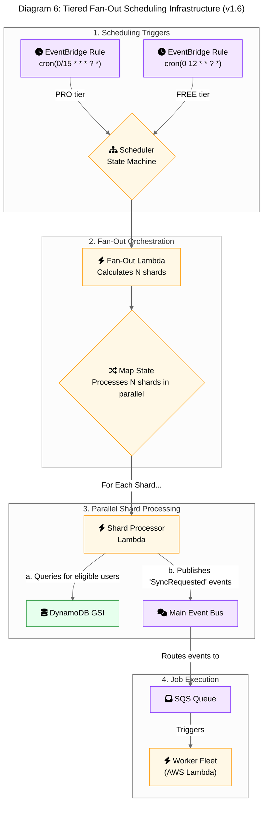

</details>

*Note: The `Fan-Out Lambda` in Diagram 6 has the following technical specifications: Language/Runtime: TypeScript on NodeJS, Memory: 256MB.*
*Note: The `Shard Processor Lambda` in Diagram 6 has the following technical specifications: Language/Runtime: TypeScript on NodeJS, Memory: 256MB.*

#### Tiered Polling with Pre-flight Checks

For providers that do not support webhooks, a simple polling approach is inefficient. To solve this, the architecture uses a highly cost-effective, two-tiered polling strategy that combines adaptive scheduling with "pre-flight checks" to avoid triggering expensive compute for unnecessary work.

*   **Tier 1: Adaptive Scheduling with SQS Delay Queues:** The system avoids using expensive, fixed-schedule services. Instead, after a sync job completes, it analyzes the user's "sync velocity" and dynamically enqueues the *next* poll job for that user back into an SQS queue with a calculated `DelaySeconds`. An active user might be re-queued with a 15-minute delay, while an inactive user might be re-queued with a 24-hour delay. This adaptive model dramatically reduces the number of polls for inactive users.

*   **Tier 2: Pre-flight Check Lambda:** The SQS message from Tier 1 does not trigger the main Lambda worker fleet directly. Instead, it triggers a new, ultra-lightweight, and low-cost Lambda function: the `PollingPreflightChecker`.
    *   **Purpose:** This Lambda's sole responsibility is to perform a cheap "pre-flight check" to see if there is any new data at the source provider *before* initiating a full sync.
    *   **Technical Specifications:**
        *   **Language/Runtime:** TypeScript on NodeJS
        *   **Memory:** 128MB
    *   **Mechanism:** It invokes a new, minimal method on the relevant `DataProvider` (e.g., `hasNewData()`) which makes a single, lightweight API call to the source (e.g., a `HEAD` request or a query for `count > 0`).
    *   **Conditional Invocation:**
        *   If new data **exists**, the pre-flight checker publishes a `HotPathSyncRequested` event to the main SQS queue, which is processed by the powerful `WorkerLambda` as usual.
        *   If no new data **exists**, the Lambda does nothing and terminates. The cost of this check is a tiny fraction of a full Lambda invocation.

*   **Benefit:** This two-tiered model is exceptionally cost-effective. Tier 1 (adaptive SQS delays) reduces the total number of polls. Tier 2 (pre-flight checks) ensures that the polls that *do* run only trigger the expensive compute and database resources when there is actual work to be done. This eliminates the vast majority of "empty" sync jobs, saving significant costs on Lambda, DynamoDB, and CloudWatch.
*   **Flow Diagram:** The following sequence diagram illustrates this two-tiered polling flow.
    ```mermaid
    %%{init: {'theme': 'neutral'}}%%
    sequenceDiagram
        participant Scheduler as Adaptive Scheduler (SQS Delay)
        participant Checker as PollingPreflightChecker (Lambda)
        participant SourceAPI as Source Provider API
        participant MainQueue as Main SQS Queue
        participant Worker as WorkerLambda

        Scheduler->>+Checker: Invoke with user context
        Checker->>+SourceAPI: hasNewData(since=...)?
        SourceAPI-->>-Checker: true / false

        alt New Data Exists
            Checker->>MainQueue: Enqueue HotPathSyncRequested job
            MainQueue-->>+Worker: Invoke worker
            Worker-->>-MainQueue: Process and complete
        else No New Data
            Checker-->>Scheduler: End (do nothing)
        end
    ```

### 3g. Client-Side Persistence and Offline Support Strategy

To provide a responsive user experience and basic functionality when the user's device is offline, the mobile application will employ a client-side persistence strategy using the **SQLDelight (version 2.0.0)** database. This is a client-side implementation detail; the backend remains stateless.

*   **Purpose of the Local Database:**
    *   **Configuration Cache:** The local database will act as a cache for the user's connections and sync configurations. This allows the UI to load instantly without waiting for a network call to the backend. The backend remains the single source of truth.
    *   **Offline Action Queue (Write-Ahead Log):** When a user performs a state-changing action while offline (e.g., creating a new sync configuration, disabling an existing one), the action will be saved to a dedicated "actions" table in the local SQLDelight database. This table acts as a write-ahead log of commands to be sent to the backend.
    *   **[C-012] Table Schema (`OfflineAction`):**
        ```sql
        CREATE TABLE OfflineAction (
            id TEXT NOT NULL PRIMARY KEY, -- A client-generated UUID
            endpoint TEXT NOT NULL,       -- e.g., "POST /v1/sync-configs"
            payload TEXT NOT NULL,        -- JSON-serialized request body
            idempotencyKey TEXT NOT NULL, -- The Idempotency-Key for the request
            createdAt INTEGER NOT NULL    -- Unix timestamp
        );
        ```
    *   **Risk of Client Clock Skew:** Relying on the client's clock for `createdAt` introduces a risk of incorrect ordering if the clock is wrong. This is an accepted risk for MVP, as the actions are configuration changes where strict ordering is not critical. A future enhancement could be to use a logical clock (e.g., a Lamport timestamp).

*   **Offline Support Workflow:**
    1.  The user opens the app while offline. The UI is populated from the local SQLDelight cache, showing the last known state.
    2.  The user creates a new sync configuration. The app immediately updates the local UI to reflect this change and writes a `CREATE_SYNC_CONFIG` command to the local "actions" table.
    3.  The user can continue to queue up actions (create, update, delete) while offline.

*   **Data Reconciliation on Reconnection:**
    1.  When the application detects that network connectivity has been restored, it will initiate a reconciliation process.
    2.  It will read the queued commands from the "actions" table in the order they were created.
    3.  For each command, it will make the corresponding API call to the backend (e.g., `POST /v1/sync-configs`). The client will use the `Idempotency-Key` it generated and stored offline for each action.
    4.  **Conflict Handling:** If an API call fails due to a state conflict (e.g., a 409 Conflict or 404 Not Found), the client will not retry the command. It will discard the local action, log the conflict locally, and rely on the final fetch of the latest state (Step 6) to resolve the UI. This "backend wins" strategy is the simplest and most robust approach for handling configuration data.
    5.  Once the backend confirms the action was successful, the command is removed from the local "actions" table.
    6.  After all queued actions are processed, the client will fetch the latest state from the backend to ensure it is fully in sync with the source of truth.

This strategy ensures that the app remains responsive and that user actions are not lost during periods of no connectivity.

<details>
<summary>Diagram 10: Client-Side Offline Sync & Reconciliation</summary>

This sequence diagram shows how the mobile client handles user actions while offline and reconciles them once connectivity is restored.

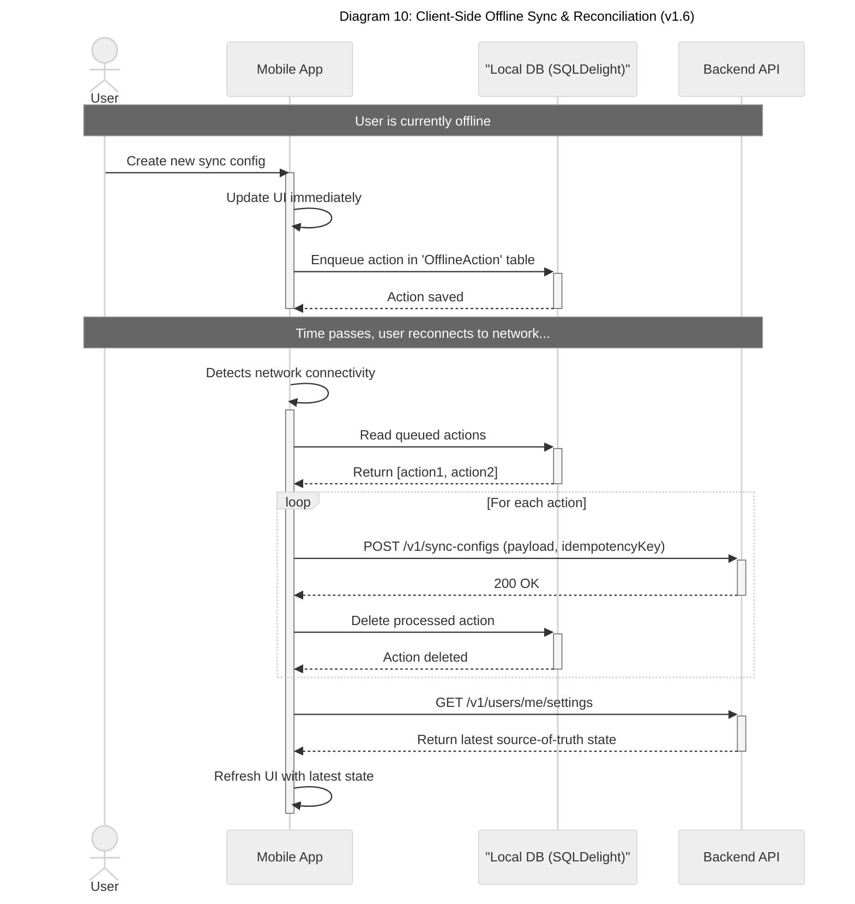

</details>

## 4. Technology Stack & Rationale

| Component | Technology | Rationale |
| :--- | :--- | :--- |
| **Authentication Service** | **Firebase Authentication** | **Rationale vs. Amazon Cognito:** While Amazon Cognito is a native AWS service, Firebase Authentication has been chosen for the MVP due to its superior developer experience. **However, this creates a critical single-vendor dependency.** To mitigate this, a **dual-authorizer strategy must be implemented.** The API Gateway Authorizer will be configured to validate JWTs from both Firebase and a standby Amazon Cognito User Pool. A runbook and configuration flag must exist to failover to Cognito in a DR scenario. This risk has been formally accepted by the product owner.<br>**Data Residency:** User identity data will be stored in Google Cloud, which has data residency implications that must be clearly communicated in the privacy policy. |
| **Cross-Platform Framework** | **Kotlin Multiplatform (KMP)** | **Code Reuse & Performance.** KMP allows sharing the complex business logic (sync engine, data providers) between the mobile clients and the backend. For latency-sensitive functions that are not part of the worker fleet (e.g., the `AuthorizerLambda`), a faster-starting runtime like TypeScript must be used to meet strict latency SLOs. This is a formally accepted technical trade-off. |
| **On-Device Database** | **SQLDelight 2.0.0** | **Cross-Platform & Type-Safe.** Generates type-safe Kotlin APIs from SQL, ensuring data consistency across iOS and Android. |
| **Primary Database** | **Amazon DynamoDB** | **Chosen for its virtually unlimited scalability and single-digit millisecond performance. For the MVP, it will be deployed in a single region. It will use a hybrid capacity model (a baseline of Provisioned Capacity with On-Demand for scaling) to balance cost and performance, as detailed in Section 3b.** |
| **Backend Compute** | **Hybrid: AWS Lambda & AWS Fargate (ARM64)** | **Hybrid Compute for Optimized Performance and Cost.** The architecture uses a hybrid model to select the best compute service for each workload, standardized on the **`arm64` (AWS Graviton) architecture** for cost-performance benefits.<br>**- AWS Lambda (Hot Path):** Used for the frequent, event-driven, real-time syncs. Lambda's auto-scaling capabilities are ideal for this spiky workload, and Provisioned Concurrency will be used to eliminate cold starts for a responsive user experience.<br>**- AWS Fargate (Cold Path):** Used for long-running, resource-intensive, asynchronous jobs like historical data backfills and bulk exports. For these heavy batch workloads, Fargate is more cost-effective and provides more predictable performance than Lambda. The Fargate fleet will use a **90% Spot / 10% On-Demand** mix to further optimize costs. Spot instance interruptions will be handled gracefully by checkpointing progress to DynamoDB and resuming from the last checkpoint. |
| **Schema Governance** | **AWS Glue Schema Registry** | **Data Integrity & Evolution.** Provides a managed, centralized registry for our canonical data schemas. Enforces backward-compatibility checks in the CI/CD pipeline, preventing breaking changes and ensuring system stability as new data sources are added. |
| **Distributed Cache** | **Amazon ElastiCache for Redis** | **Performance & Scalability.** Provides a high-throughput, low-latency in-memory cache for reducing database load and implementing distributed rate limiting. |
| **AI & Machine Learning (Future)** | **Amazon SageMaker, Amazon Bedrock** | **Rationale for Future Use:** When we implement AI features, these managed services will allow us to scale without managing underlying infrastructure, reducing operational overhead and allowing focus on feature development. |
| **Secure Credential Storage** | **AWS Secrets Manager** | **Security & Manageability.** Provides a secure, managed service for storing, rotating, and retrieving the OAuth tokens required by our backend workers. Replicated across regions for high availability. |
| **Configuration Management & Feature Flagging** | **AWS AppConfig** | **Operational Agility & Safety.** We will adopt AWS AppConfig for managing dynamic operational configurations (like log levels or API timeouts) and feature flags. This allows for safe, audited changes without requiring a full code deployment, significantly improving operational agility and reducing release risk. |
| **Infrastructure as Code** | **Terraform v1.5+** | **Reproducibility & Control.** Manages all cloud infrastructure as code, ensuring our setup is version-controlled and easily reproducible. |
| **Web Application Firewall** | **AWS WAF** | **Protection Against Common Exploits.** A foundational security layer that sits in front of API Gateway to protect against common web exploits like SQL injection, cross-site scripting, and bot traffic. |
| **CI/CD**| **GitHub Actions** | **Automation & Quality.** Automates the build, test, and deployment of the mobile app and backend services, including security checks. |
| **Monitoring & Observability** | **AWS CloudWatch, AWS X-Ray** | **Operational Excellence.** Provides a comprehensive suite for logging, metrics, tracing, and alerting, enabling proactive issue detection and performance analysis. |
| **Local Development** | **LocalStack** | **High-Fidelity Local Testing.** Allows engineers to run and test the entire AWS serverless backend on their local machine, drastically improving the development and debugging feedback loop. |
| **Load Testing** | **k6 (by Grafana Labs)** | **Validate Scalability Assumptions.** A modern, scriptable load testing tool to simulate traffic at scale, identify performance bottlenecks, and validate that the system can meet its 1M DAU target. Scripts are stored in the `/load-testing` directory of the monorepo. |

## 5. Cost-Effectiveness and Financial Modeling

A detailed financial model is a mandatory prerequisite before implementation and is maintained at [`../costs/66-costs-model.md`](../costs/66-costs-model.md).

**Primary Cost Drivers:**
1.  **AWS Lambda & Fargate:** As the primary compute services, these will be major cost drivers.
2.  **CloudWatch:** At scale, the volume of logs, metrics, and traces generated will be massive and will be a major operational expense.
3.  **NAT Gateway:** Outbound traffic from Lambda functions in a VPC to **third-party APIs** will incur data processing charges. (Note: Traffic to internal AWS services will use VPC Endpoints to minimize this cost).

**Cost Management Strategy:**
*   **Mandatory Financial Modeling:** Develop a detailed cost model using the AWS Pricing Calculator.
*   **Aggressive Log Management:** Implement dynamic and tiered log levels via AppConfig, set short retention periods in CloudWatch, and automate archiving to S3/Glacier.
*   **Explore Savings Plans:** As usage becomes more predictable, a Compute Savings Plan can significantly reduce Fargate and Lambda costs. Ownership for managing this plan belongs to the **Finance Team**.
*   **Cost Anomaly Detection:** Configure AWS Cost Anomaly Detection to automatically alert the team to unexpected spending.
*   **Optimize VPC Networking:** Implement VPC Endpoints for all internal AWS service communication to minimize data transfer costs through the NAT Gateway.

## 6. Security & Compliance

This section provides a prioritized list of vulnerabilities and concrete controls required to harden the system for production.

### 6.1. Attack-Surface Summary & Top 10 Vulnerabilities

The primary attack surface consists of:
1.  **The Public API Gateway:** Exposed to the internet, it is the main entry point for attacks against the backend logic.
2.  **Third-Party Webhooks:** An ingress point that can be used for DoS or to inject malicious data if not properly validated.
3.  **The Mobile Client:** Can be reverse-engineered, and vulnerabilities could lead to client-side data leakage or abuse of the backend API.
4.  **Third-Party Dependencies:** Vulnerabilities in open-source packages (NPM, Maven) are a major source of risk.

**Top 10 Prioritized Vulnerabilities & Missing Controls:**

1.  **BLOCKER - Missing Per-User Rate Limiting:** The lack of per-user abuse protection is the single most critical security gap. A single malicious or buggy authenticated user could cause a massive DoS or financial exhaustion attack.
2.  **BLOCKER - Insecure Direct Object Reference (IDOR) Risk:** The architecture relies on the authorizer to control access, but there is no explicit mention of how a worker Lambda is prevented from accessing data belonging to another user *after* it has been authorized.
3.  **High - Single Point of Failure for Auth (Firebase):** As noted previously, the dependency on a single external identity provider is a high-impact availability and security risk.
4.  **High - Risk of PII Leakage in Logs:** The tiered logging strategy is excellent for cost but increases the risk that sensitive data from `PRO` users could be logged. The proposed CloudWatch Logs Data Protection is a good control but needs to be explicitly configured and tested.
5.  **Medium - Insufficient Egress Controls:** The hybrid firewall model is advanced but complex. A misconfiguration could allow a compromised worker to exfiltrate data to an untrusted destination.
6.  **Medium - Lack of Automated Dependency Scanning:** The document mentions Snyk/Dependabot, but this is not optional. An automated dependency scanning tool that fails the build on critical vulnerabilities must be integrated into the CI/CD pipeline.
7.  **Medium - No Formal Secrets Rotation Policy:** The document mentions secret rotation but does not define a formal cadence or an emergency procedure.
8.  **Medium - No Web Application Firewall (WAF) Rule Details:** The architecture specifies AWS WAF but provides no detail on the rules to be configured.
9.  **Low - No Client-Side Hardening Mentioned:** The focus is on the backend, but the mobile client should be hardened against reverse engineering (e.g., via code obfuscation) and tampering.
10. **Low - Lack of Security-Specific Logging & Alerting:** The observability plan is focused on performance and availability. It needs to be augmented with security-specific alerts (e.g., for WAF rule triggers, suspicious IAM activity).

### 6.2. Concrete Remediation & Hardening

#### **Remediation for IDOR (Vulnerability #2)**
The `AuthorizerLambda` must inject the authenticated `userId` into the request context that is passed to the `WorkerLambda`. The `WorkerLambda` **must** then use this context `userId` as the partition key for all DynamoDB queries. It must **never** trust a `userId` provided in a request body.

*   **Example IAM Policy Snippet (Least Privilege):**
    This policy, attached to the `WorkerLambda`, uses IAM policy variables to restrict its access to DynamoDB items that are tagged with the same `userId` as the principal (the Lambda function) that is running. This is a powerful defense-in-depth control.

    ```json
    {
      "Version": "2012-10-17",
      "Statement": [
        {
          "Effect": "Allow",
          "Action": [
            "dynamodb:GetItem",
            "dynamodb:PutItem",
            "dynamodb:UpdateItem"
          ],
          "Resource": "arn:aws:dynamodb:us-east-1:123456789012:table/SyncWellMetadata",
          "Condition": {
            "ForAllValues:StringEquals": {
              "dynamodb:LeadingKeys": [
                "USER#${aws:PrincipalTag/userId}"
              ]
            }
          }
        }
      ]
    }
    ```

#### **Remediation for WAF & Rate Limiting (Vulnerabilities #1 & #8)**
*   **AWS WAF Configuration:** The WAF WebACL associated with the API Gateway must have the following rules, in this order:
    1.  **AWS Managed Rule: `AWSManagedRulesCommonRuleSet`:** Protects against the OWASP Top 10.
    2.  **AWS Managed Rule: `AWSManagedRulesAmazonIpReputationList`:** Blocks known malicious IP addresses.
    3.  **Custom Rule: Global Rate-Based Rule:** Block any source IP that sends more than **1,000 requests in a 5-minute period**.
*   **Per-User Rate Limiting:** Implement API Gateway Usage Plans as described in this document.

#### **Remediation for Secrets Management (Vulnerability #7)**
*   **Secrets Management:** All secrets must be stored in AWS Secrets Manager, encrypted with a dedicated customer-managed KMS key.
*   **Rotation Policy:**
    *   **Automated Rotation:** Must be enabled for all secrets that support it (e.g., RDS credentials if used in the future). The rotation cadence must be set to **90 days**.
    *   **Manual Rotation:** For other secrets (e.g., third-party API keys), a quarterly manual rotation process must be documented and tracked via recurring tickets assigned to the SRE team.
    *   **Emergency Rotation:** A runbook for out-of-band, emergency rotation must be created and placed in `../ops/runbook-emergency-secret-rotation.md`.

### 6.3. Encryption Strategy

*   **Encryption in Transit:** All public endpoints (API Gateway, CloudFront) must be configured with a security policy that enforces **TLS 1.2 or higher**. All internal traffic between services must also be encrypted.
*   **Encryption at Rest:** All AWS services that store data (DynamoDB, S3, ElastiCache snapshots, SQS queues) must have server-side encryption **enabled**. Where possible, this should use a customer-managed KMS key instead of an AWS-managed key to provide a stronger audit trail.
*   **KMS Key Rotation:** The KMS keys used for at-rest encryption must have **automated annual rotation enabled**.

### 6.4. Compliance Controls

This architecture provides a strong foundation for future compliance audits but does not constitute certification.
*   **GDPR:** The architecture supports key GDPR principles:
    *   **Data Minimization:** The ephemeral processing of health data adheres to this.
    *   **Right to Access/Erasure:** The implementation of the `POST /v1/export-jobs` and `DELETE /v1/users/me` endpoints are necessary controls for this.
*   **SOC 2:** The controls recommended in this review map directly to SOC 2 trust service criteria:
    *   **Security:** IAM policies, WAF, encryption, vulnerability scanning.
    *   **Availability:** Multi-AZ/Multi-Region architecture, DR plans, SLO monitoring.
    *   **Confidentiality:** Encryption at rest and in transit, strict access controls.
    *   **Change Management:** The CI/CD pipeline with automated testing and approval gates is a required control.

## 7. Open-Source Tools and Packages

| Category | Tool/Package | Description |
| :--- | :--- | :--- |
| **Mobile Development** | **Kotlin Multiplatform** | Core framework for sharing code. |
| | **SwiftUI / Jetpack Compose** | Modern UI frameworks for iOS and Android. |
| | **SQLDelight** | KMP library for type-safe SQL. |
| | **Ktor** | KMP HTTP client. |
| **Backend Development** | **AWS Lambda, Fargate, SQS, DynamoDB** | Core AWS services for the serverless backend. |
| | **Terraform** | Infrastructure as Code tool. |
| **Testing** | **JUnit, XCTest, Espresso, MockK, Turbine** | Standard libraries for unit, UI, and integration testing. |
| | **k6** | Modern, scriptable load testing tool. |
| **CI/CD** | **GitHub Actions, Fastlane** | CI/CD platform and mobile release automation. |
| **Monitoring** | **OpenTelemetry** | Vendor-neutral standard for instrumentation. |
| | **Prometheus / Grafana** | Alternative/complement to CloudWatch for advanced metrics and dashboards. |
| **Local Development** | **LocalStack** | High-fidelity emulator for local AWS development. |
| **Static Analysis** | **Detekt, SwiftLint** | Static analysis tools for Kotlin and Swift. |
| **Dependency Scanning** | **Snyk, Dependabot** | Vulnerability scanning for dependencies. |

## 8. Non-Functional Requirements (NFRs)

This section defines the key non-functional requirements for the SyncWell platform. These are critical quality attributes that the system must satisfy.

| Category | Requirement | Metric | Target | Priority | Notes |
| :--- | :--- | :--- | :--- | :--- | :--- |
| **Availability** | Core Service Uptime | Monthly Uptime % | > 99.9% | P0 | Measured for core API endpoints and sync processing. Excludes scheduled maintenance. |
| | Disaster Recovery RTO | Recovery Time Objective | < 4 hours | P1 | In a DR event, users will be notified via a status page and social media. |
| | Disaster Recovery RPO | Recovery Point Objective | < 15 minutes | P0 | Max acceptable data loss. Governed by DynamoDB PITR backup frequency. |
| **Performance** | Manual Sync Latency | P95 Latency | < 15 seconds | P1 | End-to-end latency, highly dependent on third-party API performance. |
| | API Gateway Latency | P99 Latency | < 500ms | P0 | For all synchronous API endpoints, measured at the gateway. |
| | Concurrent Users | Peak RPS | 3,000 RPS | P0 | The system must handle a peak load of 3,000 requests per second. |
| **Security** | Vulnerability Patching | Time to Patch Critical CVE | < 72 hours | P0 | This policy applies 24/7, including weekends and holidays, and is managed by the on-call security team. |
| | Secure Data Handling | `ProviderTokens` must not be serializable | Pass/Fail | P0 | The `ProviderTokens` data class must not be serializable and must redact secrets in its `toString()` method. A custom linter rule must enforce this at build time. |
| **Scalability** | User Capacity | Daily Active Users (DAU) | 1,000,000 | P1 | The architecture must be able to support 1 million daily active users.<br>**Note:** The traffic models used for capacity planning are based on assumptions. A **private beta program** must be launched to a small user group to collect real-world metrics on user activity (e.g., syncs/day, payload size) to validate these assumptions before a full public launch. |
| **Usability** | App Onboarding | Time to First Sync | < 3 minutes | P0 | This is a key product KPI, tracked via our analytics pipeline by measuring the median time from the `UserSignedUp` event to the first `SyncSucceeded` event for that user. |

## 9. CI/CD, Release Strategy & Runbook Automation

A mature CI/CD process is non-negotiable for deploying changes to this complex system safely and frequently.

### Branching, Testing Gates & Release Strategy

*   **Branching Strategy:** A **trunk-based development** model is recommended for services, with short-lived feature branches.
    *   `main`: The trunk. Represents the latest production-ready code.
    *   `feature/<ticket-id>-<description>`: Short-lived branches for new development. Must be merged to `main` via a Pull Request with mandatory reviews and passing checks.
    *   Hotfixes are created from a tag on `main` and merged back in.
*   **Release Strategy (Canary Deployments):** All backend services **must** be deployed to production using a **canary release strategy** managed by AWS CodeDeploy or a similar tool.
    *   **Process:**
        1.  Deploy the new version to a small percentage of the fleet (the "canary"), e.g., **5%**.
        2.  Route **10%** of production traffic to the canary.
        3.  **Bake Time:** Monitor the canary for **30 minutes**.
        4.  **Automated Rollback:** An automatic rollback **must** be triggered if key canary metrics (error rate, latency) deviate significantly from the baseline fleet, as defined in the architecture document.
        5.  **Gradual Rollout:** If the canary is healthy, gradually shift traffic and deploy to the rest of the fleet over a defined period (e.g., 1 hour).
*   **Database Migration Pattern:** For any changes to the DynamoDB schema (e.g., adding a new attribute that code depends on), the **expand/contract pattern** must be used to ensure zero-downtime deployments.
    *   **Release 1 (Expand):** Deploy code that can read both the old and new schema but only writes the old schema. Deploy code to start writing the new schema in addition to the old.
    *   **Release 2 (Migrate):** Run a data migration script to backfill the new schema for all existing items.
    *   **Release 3 (Contract):** Deploy code that now only reads/writes the new schema. Remove the code that handles the old schema.

### Required Automated Tests & Pre-Deploy Gates

The following checks **must** be automated in the CI/CD pipeline and must pass before a deployment to production can occur. A failure in any of these gates must fail the build.

1.  **Static Analysis:** Detekt (Kotlin) and SwiftLint (iOS) with project-specific rules.
2.  **Unit Tests:** A minimum of **80% line coverage** must be maintained for all new code.
3.  **Security Scans:**
    *   **SAST (Static Application Security Testing):** Snyk Code or similar.
    *   **Dependency Scanning:** Snyk Open Source or GitHub Dependabot. Must fail the build for any `Critical` or `High` severity vulnerabilities.
4.  **Integration Tests:** A suite of tests that run against a live `staging` environment.
5.  **Contract Tests (Pact):** The backend provider pipeline must run a Pact verification check. A failure here indicates a breaking change and must block the deployment.
6.  **Load Tests (k6):** The k6 performance test suite must be run against the `staging` environment. The deployment is blocked if p99 latency exceeds the SLO or if the error rate is >1%.

### Example CI/CD Pipeline Snippet (GitHub Actions)

This snippet illustrates a simplified deployment pipeline for a backend service, showing the key gates and the canary deployment strategy.

```yaml
# .github/workflows/deploy-worker.yml
name: Deploy Worker Service

on:
  push:
    branches:
      - main

jobs:
  test-and-build:
    runs-on: ubuntu-latest
    steps:
      - name: Checkout code
        uses: actions/checkout@v3

      - name: Run unit tests
        run: ./gradlew test

      - name: Run Snyk security scan
        uses: snyk/actions/golang@master
        env:
          SNYK_TOKEN: ${{ secrets.SNYK_TOKEN }}

      - name: Build and push container image
        run: |
          # Build, tag, and push Docker image to ECR
          # ...

  deploy-to-prod:
    needs: test-and-build
    runs-on: ubuntu-latest
    strategy:
      matrix:
        # Define the canary and full rollout weights
        rollout: [10, 100]
    steps:
      - name: Deploy to Production (Canary: ${{ matrix.rollout }}%)
        uses: aws-actions/amazon-ecs-deploy-task-definition@v1
        with:
          # ... task definition, cluster, service ...
          wait-for-service-stability: true
          codedeploy-app-name: my-app
          codedeploy-deployment-group-name: my-deployment-group
          codedeploy-deployment-config-name: CodeDeployDefault.LambdaCanary${{ matrix.rollout }}Percent5Minutes

      - name: Monitor bake time
        if: matrix.rollout == 10
        run: sleep 300 # 5 minutes bake time

      - name: Check CloudWatch alarms
        if: matrix.rollout == 10
        # Script to check if any critical alarms have fired for the canary
        # If so, exit 1 to trigger a rollback
        run: ./scripts/check-canary-alarms.sh
```

## 10. Known Limitations & Architectural Trade-offs

This section documents known limitations of the architecture and explicit trade-offs that have been made.

*   **Feature Tiering:** The current architecture does not explicitly support feature tiering (e.g., higher rate limits for Pro users). This is a known gap that will be addressed in a future iteration. The high-level strategy will be to have the `AuthorizerLambda` attach the user's subscription tier (`FREE` or `PRO`) to the request context. Downstream services, like the rate-limiting engine, can then inspect this context and apply the appropriate limits. This feature is prioritized as **P2-Should-Have**.
*   **Account Merging:** The data model does not support account merging. **User-facing consequence:** Users who create multiple accounts will have siloed data and must contact support for a manual, best-effort resolution. The user-facing message is: "Account merging is not supported at this time. Please contact customer support for assistance." This will be delivered via a support macro in the customer support tool. This is a known product issue.
*   **Firebase Authentication Dependency:** The use of Firebase Authentication creates a hard dependency on a non-AWS service for a critical function. This is a **High** strategic risk.
    *   **Risk:** An outage in Firebase Auth would render the application unusable for all users.
    *   **[RISK-HIGH-03] Mitigation:** While accepted for the MVP to prioritize launch speed, a high-level exit strategy has been drafted. See **[`./33a-firebase-exit-strategy.md`](./33a-firebase-exit-strategy.md)** for the detailed technical plan. This risk has been formally accepted by the product owner.
*   **AWS Vendor Lock-in:** The architecture makes extensive use of proprietary AWS services (Lambda, DynamoDB, SQS, etc.). This is a deliberate strategic trade-off.
    *   **Rationale:** This approach significantly accelerates development velocity, reduces operational overhead, and allows the team to leverage the scalability and resilience of the AWS ecosystem.
    *   **Risk:** This deep integration with AWS makes a future migration to a different cloud provider or an on-premise environment extremely costly and time-consuming.
    *   **Mitigation:** This risk is formally accepted. Where feasible, vendor-neutral standards like OpenTelemetry will be used to provide a thin layer of abstraction, but the core of the system is tied to AWS.

*   **MVP Scope & Phasing:** To ensure a focused and timely launch, the architecture distinguishes between core features required for the MVP and production-hardening features that can be implemented as fast-follows.
    *   **Must-have for MVP (Day 1):**
        *   **Single-Region Deployment:** Core infrastructure will be deployed in a single AWS region (`us-east-1`) to optimize for cost and simplicity at launch.
        *   **VPC Endpoints:** Deployed for all internal AWS service communication to ensure security and reduce NAT Gateway data transfer costs from day one.
        *   **Core Security Features:** Foundational security measures like AWS WAF, granular IAM roles, and encryption at rest/in-transit are non-negotiable for the MVP.
    *   **Fast-follow Post-Launch (Production Hardening):**
        *   **Comprehensive Chaos Engineering:** The full suite of chaos engineering experiments will be built out and automated post-launch.
        *   **Multi-Region Architecture:** Expansion to a multi-region architecture is a post-MVP consideration, to be prioritized based on user growth or geographic expansion.

## 11. Appendices

*   **Appendix A: Technology Radar:** See the dedicated [`./21-technology-radar.md`](./21-technology-radar.md) document.
*   **Appendix B: Operational Policies:** See the dedicated [`../ops/20-operational-policies.md`](../ops/20-operational-policies.md) document.

### Appendix C: Prioritized Implementation Roadmap

| Priority | Task | Effort | Owner |
| :--- | :--- | :--- | :--- |
| **Must** | **BLOCKER:** Launch private beta to validate traffic & payload assumptions. | M | Product |
| **Must** | **BLOCKER:** Implement Per-User Rate Limiting (API Gateway Usage Plans). | M | Backend |
| **Must** | **BLOCKER:** Implement application-level Tiered & Sampled Logging. | L | Backend |
| **Must** | **BLOCKER:** Implement Metadata-First Data Hydration pattern. | M | Backend |
| **Must** | Formalize CI/CD pipeline with all required testing gates (Security, Load). | L | SRE/DevOps|
| **Must** | Implement least-privilege IAM policies with IDOR protection. | M | Security |
| **Should** | Implement dual-authorizer (Cognito DR) strategy. | L | Backend |
| **Should** | Establish formal Chaos Engineering program and run first gameday. | M | SRE |
| **Should** | Purchase Compute Savings Plan (after beta validates usage). | S | Finance |
| **Should** | Create all required Dashboards and Runbooks. | M | SRE |
| **Can** | Implement client-side hardening (code obfuscation). | M | Mobile |
| **Can** | Conduct full-table restore drill from AWS Backup. | S | SRE |

### Appendix D: IaC Snippet: Autoscaled Lambda Worker (Terraform)

This snippet defines the core `WorkerLambda`, including configuration for ARM64 architecture and Provisioned Concurrency for performance, with variants for cost optimization.

```terraform
# terraform/lambda.tf

resource "aws_lambda_function" "worker_lambda" {
  function_name = "syncwell-prod-worker"
  role          = aws_iam_role.worker_lambda_role.arn
  package_type  = "Image"
  image_uri     = "123456789012.dkr.ecr.us-east-1.amazonaws.com/syncwell-worker:latest"

  # Use ARM64 for better price-performance
  architectures = ["arm64"]
  memory_size   = 1024 # Tuned via Lambda Power Tuning
  timeout       = 300  # 5 minutes

  environment {
    variables = {
      # ... env vars ...
    }
  }

  # Cost Optimization: To eliminate cold starts for performance, uncomment below.
  # This adds a fixed cost but guarantees low latency.
  # provisioned_concurrency_config {
  #   provisioned_concurrent_executions = 50
  # }
}

resource "aws_lambda_provisioned_concurrency_config" "worker_concurrency" {
  count = var.enable_provisioned_concurrency ? 1 : 0

  function_name                     = aws_lambda_function.worker_lambda.function_name
  provisioned_concurrent_executions = 50
  qualifier                         = aws_lambda_function.worker_lambda.version
}

variable "enable_provisioned_concurrency" {
  description = "Set to true to enable provisioned concurrency for the worker Lambda."
  type        = bool
  default     = false # Default to on-demand for cost savings
}
```

### Appendix E: Production Readiness Gate Checklist

This checklist must be completed and signed off by the CTO, Head of Engineering, and Finance Lead before public launch.

| Category | Item | Status | Sign-off |
| :--- | :--- | :--- | :--- |
| **Architecture** | Final architecture diagram reflects implemented reality. | [ ] Done | CTO |
| | All "Must-Have" tasks from the roadmap are complete. | [ ] Done | Eng Lead |
| | Private beta has run and traffic assumptions are validated/updated. | [ ] Done | Product |
| **Availability** | Multi-AZ and Multi-Region DR strategy is fully implemented and tested. | [ ] Done | SRE |
| | All required SLOs, dashboards, and alerts are configured. | [ ] Done | SRE |
| | A successful chaos engineering gameday has been completed in staging. | [ ] Done | SRE |
| **Security** | All BLOCKER vulnerabilities from review are remediated. | [ ] Done | Security |
| | WAF, per-user rate limiting, and least-privilege IAM are implemented. | [ ] Done | Security |
| | A clean Snyk/dependency scan report is available for the release candidate. | [ ] Done | Eng Lead |
| **Operations** | CI/CD pipeline is fully automated with all required gates. | [ ] Done | SRE |
| | All required runbooks are created and accessible to on-call staff. | [ ] Done | SRE |
| | On-call rotation is established and PagerDuty is configured. | [ ] Done | Eng Manager |
| **Cost** | **Reconciled cost model is reviewed and accepted.** | [ ] Done | **Finance** |
| | **Monthly budget is agreed upon and a budget owner is assigned.** | [ ] Done | **Finance** |
| | Cost allocation tagging policy is implemented and enforced. | [ ] Done | SRE |
| | Application-level cost optimizations (logging, hydration) are implemented. | [ ] Done | Eng Lead |

## 12. Glossary

A project-wide glossary of all business and technical terms is maintained in the root [`GLOSSARY.md`](../../../GLOSSARY.md) file to ensure a single source of truth for terminology.

## 13. Risks, Open Questions & Blockers

This final section summarizes the most critical risks and open questions that must be addressed before proceeding with a public launch.

### 13.1. Top 10 Risks (Likelihood  Impact)

1.  **Financial Overrun (High  High):** The cost model is extremely sensitive to unvalidated traffic and payload assumptions. A 2x increase in "heavy" syncs could increase monthly costs by thousands.
2.  **Third-Party Outage (Low  High):** A major, prolonged outage of Firebase Authentication would render the entire application unusable. The Cognito DR plan is a mitigation, not a preventative measure.
3.  **Economic Denial of Service (Medium  High):** The lack of per-user rate limiting exposes the platform to financial exhaustion attacks from a single malicious or buggy authenticated client.
4.  **Execution Complexity (High  Medium):** The architecture relies on sophisticated, custom application-level logic (tiered logging, metadata hydration). Failure to implement and test these patterns correctly will lead to significant cost and performance issues.
5.  **Data Inconsistency (Medium  Medium):** The "newest wins" conflict resolution strategy is simple but may lead to data loss scenarios that frustrate users.
6.  **Vendor Lock-in (High  Medium):** The architecture is deeply tied to proprietary AWS services. This is an accepted strategic risk, but it makes future platform migrations extremely costly.
7.  **Compliance/Data Breach (Low  High):** A security breach resulting in the leak of user health data would have severe legal, financial, and reputational consequences.
8.  **Performance Degradation (High  Low):** While provisioned concurrency helps, unexpected traffic spikes could still lead to cold starts and a degraded user experience for a subset of users.
9.  **Alert Fatigue (High  Medium):** A poorly tuned monitoring system can generate excessive noise, causing on-call engineers to ignore critical alerts.
10. **Scalability Bottleneck (Medium  Medium):** The "hot partition" risk for a viral user, while deferred, could cause significant performance degradation for that user and their immediate neighbors in the data store.

### 13.2. Open Questions & Blockers

The following questions must be answered before this project proceeds to a full public launch. They are considered **BLOCKERS** because they fundamentally impact the project's capacity, cost, and legal standing.

*   **BLOCKER 1: What are the real-world traffic and payload metrics from a private beta?**
    *   **Why it blocks:** All capacity planning and financial forecasting in this review are based on a series of nested assumptions. The financial risk of launching without validating these assumptions is unacceptably high. The team cannot make an informed budget decision without this data.

*   **BLOCKER 2: Who is the assigned budget owner, and has the reconciled monthly cost model (~$13k/mo on-demand) been approved?**
    *   **Why it blocks:** The reconciled cost is significantly higher than all previous estimates. Proceeding without formal financial approval and a named owner for the budget is fiscally irresponsible and puts the project at risk of being defunded post-launch.

*   **BLOCKER 3: What is the specific, documented, and tested disaster recovery plan for a multi-hour Firebase Authentication outage?**
    *   **Why it blocks:** The current mitigation (a dual authorizer) is a technical prerequisite but not a complete DR plan. A formal plan, including client-side failover logic, user communication strategy, and an estimated RTO, must be documented and approved by leadership.

*   **BLOCKER 4: What are the specific data residency requirements for all target launch markets?**
    *   **Why it blocks:** The current architecture stores all data in `us-east-1`. If the company plans to launch in markets with strict data residency laws (e.g., the EU/GDPR), this architecture may not be compliant. Legal and compliance teams must provide a definitive answer to this question before launch to avoid significant legal and reputational risk.
