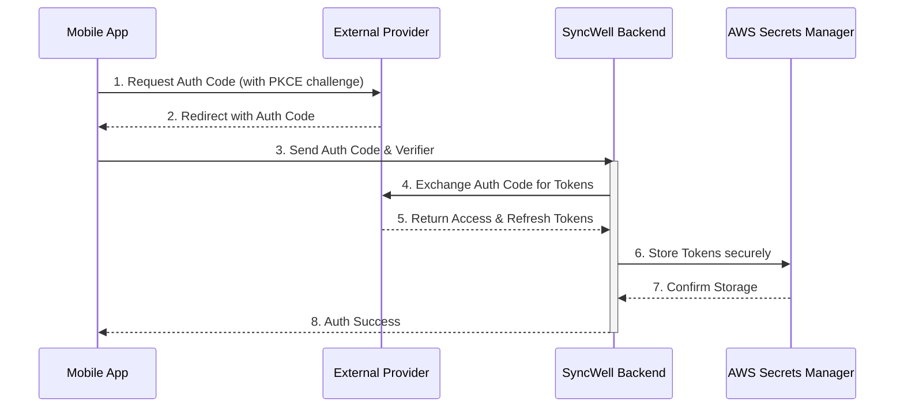

## Dependencies

### Core Dependencies
- `./06-technical-architecture.md` - **[Authoritative]** Technical Architecture
- `../security/19-security-privacy.md` - Data Security & Privacy Policies
- `../security/20-compliance-regulatory.md` - Legal & Regulatory Compliance
- `./32-platform-limitations.md` - Platform-Specific Limitations
- `../prd/33-third-party-integration.md` - Third-Party Integration Strategy

### Strategic / Indirect Dependencies
- `./05-data-sync.md` - Data Synchronization & Reliability
- `../qa/15-integration-testing.md` - Integration & End-to-End Testing
- `../prd/21-risks.md` - Risks, Constraints & Mitigation
- `../ux/40-error-recovery.md` - Error Recovery & Troubleshooting

---

# PRD Section 7: APIs & Integration Requirements

## 1. Executive Summary

This document provides the detailed technical requirements for integrating with third-party Health & Fitness APIs. A robust, scalable, and maintainable approach is paramount. This document specifies the design of the **`DataProvider`** architecture, the handling of authentication, and the specific endpoints for the MVP integrations. It is designed for the **engineering team** and reflects the hybrid sync model outlined in `./06-technical-architecture.md`.

## 2. The `DataProvider` Architecture

To ensure consistency and quality as we scale to dozens of integrations, each third-party integration will be built against a standardized set of interfaces and utilities. This framework, maintained as a **Kotlin Multiplatform (KMP) shared module** within the main application's monorepo, separates the unique business logic of an integration from the boilerplate code required for all integrations. The module is owned by the **Core Backend team**, and its versioning is tied to the main application's release cycle.

### 2.1. The Shared Integration Module

The shared module provides a set of abstract classes and utilities that every provider must implement or use. This includes:
*   **Standardized Interfaces:** A clear `DataProvider` interface definition (see below).
*   **Centralized Error Handling:** A common set of exceptions that provider-specific code can throw to signal specific outcomes to the sync engine.

| Exception | Properties | Description |
| :--- | :--- | :--- |
| `PermanentAuthError`| `message: String` | Thrown for non-recoverable authentication errors (e.g., 401 Unauthorized), indicating the user must re-authenticate. The `message` is for internal logging and not for the user. |
| `TransientAPIError` | `message: String` | Thrown for temporary server-side errors (e.g., 5xx status codes) that can be retried by the sync engine. The `message` is for internal logging. |
| `RateLimitError` | `retryAfterSeconds: Int?`| Thrown when a rate limit is hit (e.g., 429 Too Many Requests), signaling the worker to back off. Includes optional provider-supplied delay. The `message` is for internal logging. |

*   **Automatic Metrics & Logging:** The framework will automatically capture and publish key metrics (e.g., API call latency, success/failure rates) and structured logs for any actions performed through the shared `ApiClient`.

### 2.2. `DataProvider` Interface & Responsibilities

Each `DataProvider` implementation will focus purely on the provider-specific business logic:
*   **Authentication:** Providing the provider-specific URLs and parameters for the OAuth flow.
*   **Data Mapping:** Transforming the provider's unique data model into SyncWell's canonical data model, and vice-versa.
*   **Endpoint Logic:** Knowing which specific API endpoints to call to perform data sync operations.

To enforce this separation of concerns, every provider must implement the `DataProvider` interface defined in the KMP shared module.

**Note on Complexity:** This is a comprehensive interface. For integrations that only support a subset of functionality (e.g., read-only), a future iteration may introduce smaller, more focused interfaces (e.g., `ReadableDataProvider`). For the MVP, all methods must be implemented, even if they simply throw a `NotImplementedError`.

```kotlin
// Simplified for documentation purposes.

/**
 * Defines the granular capabilities of a given DataProvider for specific data types.
 */
enum class Capability {
    READ_STEPS, WRITE_STEPS,
    READ_WORKOUTS, WRITE_WORKOUTS,
    READ_SLEEP, WRITE_SLEEP,
    SUPPORTS_WEBHOOKS
}

/**
 * Represents the parsed and validated payload from a provider's webhook.
 */
data class WebhookPayload(
    val userId: String,
    // Must be one of the keys from the canonical data model registry (e.g., "workout", "sleep_session", "weight").
    val dataType: String,
    val eventTimestamp: Long
)

interface DataProvider {
    /**
     * A unique, machine-readable key for the provider (e.g., "strava", "fitbit").
     */
    val providerKey: String

    /**
     * The set of granular capabilities supported by this provider.
     */
    val capabilities: Set<Capability>

    /**
     * Handles the initial OAuth 2.0 authorization flow to acquire tokens.
     */
    suspend fun authenticate(authCode: String): ProviderTokens

    /**
     * Refreshes an expired access token using a refresh token.
     */
    suspend fun refreshAccessToken(refreshToken: String): ProviderTokens

    /**
     * Revokes the given tokens with the third-party provider.
     */
    suspend fun revoke(tokens: ProviderTokens)

    /**
     * Fetches lightweight metadata for a specific type of data. This is the first step in the "Intelligent Hydration" flow.
     */
    suspend fun fetchMetadata(tokens: ProviderTokens, dateRange: DateRange, dataType: String): List<CanonicalData>

    /**
     * Fetches the full, heavy data payloads for a specific list of record IDs. This is the second step in the "Intelligent Hydration" flow.
     */
    suspend fun fetchPayloads(tokens: ProviderTokens, recordIds: List<String>, dataType: String): List<CanonicalData>

    /**
     * Pushes a list of canonical data models to the provider's API. The implementation
     * is responsible for casting the `CanonicalData` objects to the correct concrete type.
     * If a cast fails, it should be logged as a critical error and the item should be included in the `failedItemIds` of the result, ensuring the job doesn't fail due to a single malformed item.
     */
    suspend fun pushData(tokens: ProviderTokens, data: List<CanonicalData>): PushResult

    /**
     * Optional: Performs a lightweight pre-flight check to see if there is any new data available.
     * If `null` is returned, the calling worker will **assume `true`** (new data might exist). This is a safe default
     * that prevents missed syncs at the cost of a potentially unnecessary worker invocation.
     */
    suspend fun hasNewData(tokens: ProviderTokens, dateRange: DateRange): Boolean? = null

    /**
     * Handles an incoming webhook event. The implementation is responsible for
     * verifying the webhook's authenticity (e.g., by verifying an `X-Hub-Signature-256` header). The specific authentication mechanism is provider-dependent and must be documented in the implementation.
     */
    suspend fun handleWebhook(requestHeaders: Map<String, String>, requestBody: String): WebhookPayload?
}

/**
 * Represents the result of a push operation, including any items that failed.
 */
data class PushResult(
    val success: Boolean,
    // This list should contain the `sourceId` for each item that failed. `sourceId` is the unique
    // identifier for the record from the source platform's perspective.
    val failedItemIds: List<String> = emptyList()
)

/**
 * Defines a simple date range using a full ISO 8601 timestamp with timezone.
 */
data class DateRange(
    val startDate: String, // e.g., "2023-01-01T00:00:00Z"
    val endDate: String    // e.g., "2023-12-31T23:59:59Z"
)
```

### 2.3. Network Environment & Security
All backend `DataProvider` logic runs within the main application's VPC on AWS. To balance cost and security, outbound traffic is routed through a **hybrid firewall model**, as defined in `06-technical-architecture.md`.

The process for updating the allow-list is to submit a Pull Request to the infrastructure-as-code (Terraform) repository. The PR must be reviewed and approved by at least one member of the **Security team** and one member of the **Core Backend team**.

## 3. Authentication: A Secure Hybrid Flow

The primary authentication flow assumes **OAuth 2.0 Authorization Code Flow with PKCE**. The key security principle is that **long-lived tokens never touch the user's device**. For providers that use other schemes (e.g., static API keys), a separate, non-user-facing flow will be used where the key is provisioned directly into AWS Secrets Manager by an administrator. The `DataProvider` will fetch the key directly, bypassing the user-facing authentication flow.

### OAuth 2.0 Flow Steps:

1.  **Initiate (Mobile):** The mobile app generates a `code_verifier` and `code_challenge`.
2.  **Open WebView (Mobile):** The app opens a secure in-app browser with the provider's authorization URL.
3.  **User Consent (Mobile):** The user logs in and grants consent on the provider's web page.
4.  **Redirect with Auth Code (Mobile):** The provider redirects to SyncWell's redirect URI (e.g., `syncwell://oauth-callback`) with a one-time `authorization_code`. The `state` parameter is a short-lived, signed JWT created by the SyncWell backend, containing the `providerId` and a CSRF token.
5.  **Secure Hand-off to Backend (Mobile -> Backend):** The mobile app sends the `authorization_code` and `code_verifier` to a secure endpoint on the SyncWell backend.
6.  **Token Exchange (Backend):** A dedicated backend function receives the `authorization_code` and invokes the correct `DataProvider` to perform the token exchange.
7.  **Secure Storage (Backend):** Upon receiving the tokens, the backend stores them securely in **AWS Secrets Manager**.

## 4. Token Management & Granular Error Handling

### 4.1. Token Auto-Refresh
Token management is a purely backend process. The shared module will automatically perform a pre-flight check for token validity and handle the refresh flow if necessary. If a refresh fails, it will throw a `PermanentAuthError`.

### 4.2. API Error Handling Strategy
A robust sync engine must intelligently handle the wide variety of errors that can occur. The canonical error handling policies, retry strategies, and user-facing notifications are defined in **`../ops/17-error-handling.md`**, which serves as the single source of truth. The user-facing content is specified below.

*   **`PermanentAuthError` Notification:**
    *   **Content:** `Your connection to [Provider Name] has expired. Please tap here to reconnect.`
    *   **Deep-link:** The deep-link will follow the schema `syncwell://reconnect?connectionId={connectionId}`.
*   **Rate-Limiting Delay Notification:**
    *   If a sync is delayed by more than a configurable threshold (default: **15 minutes**, key: `ratelimit.notification.delay_minutes` in AppConfig), a notification will be sent.
    *   **Content:** `Syncs with [Provider Name] are temporarily delayed due to high volume. We are working on it.`

## 4a. API Rate Limit Management

Proactively managing third-party rate limits is a core architectural requirement. The strategy is to use a **distributed, global rate limiting** system using the **token bucket algorithm**, implemented in Redis.

*   **Prioritization:** The rate limiting service will be aware of job priority. The event payload for every sync job **must** include a `priority` field. If omitted from a request, the `priority` field defaults to `medium`. The enum (`high`, `medium`, `low`) is authoritatively defined in `06-technical-architecture.md`.

## 5. MVP API Endpoint Mapping

| Platform | Data Type | Read Endpoint | Write Endpoint | Integration Model | Notes |
| :--- | :--- | :--- | :--- | :--- | :--- |
| **Google Fit** | Steps | `users/me/dataset:aggregate` | `users/me/dataSources/.../datasets:patch` | Hybrid (Polling) | Requires Health Connect SDK on device. Does not have a webhook API. |
| **Apple Health** | Steps | `HKSampleQuery` | `HKHealthStore.save()` | Device-to-Cloud / Cloud-to-Device | N/A (On-device) |
| **Fitbit** | Steps | `1/user/-/activities/steps/date/[date]/1d.json` | `N/A` | Cloud-to-Cloud (Webhook-First) | Read-only for activity data. Supports webhooks. |
| **Strava** | Activities | `athlete/activities` | `activities` | Cloud-to-Cloud (Webhook-First) | Does not provide daily step data. Supports webhooks. |
| **Garmin** | Steps | `daily-summary-service/daily-summary/...` | `N/A` | Cloud-to-Cloud (Polling) | **Deferred Post-MVP.** Unofficial API presents high maintenance risk. Re-evaluation tracked in ticket `PROD-1234`. |

## 6. Risk Analysis & Mitigation

| Risk ID | Risk Description | Probability | Impact | Mitigation Strategy | Owner |
| :--- | :--- | :--- | :--- | :--- | :--- |
| **R-19** | An API provider makes a breaking change, disabling a key integration. | High | High | Implement contract testing and versioned `DataProviders`. Have robust monitoring to detect API errors quickly. | Core Backend Lead |
| **R-21** | The complexity of implementing and maintaining numerous providers becomes a significant engineering burden. | Medium | High | Strictly adhere to the provider architecture. Automate testing for each provider. Allocate dedicated engineering resources for maintenance. | Core Backend Lead |
| **R-22** | A vulnerability in the backend leads to a leak of user OAuth tokens from Secrets Manager. | Low | Critical | Enforce strict IAM policies with the principle of least privilege. Encrypt all secrets. Conduct regular security audits and penetration testing. | Security Lead |
| **R-24** | A bug in a single `DataProvider` implementation leaks user tokens. | Low | Critical | Rigorous code reviews, static analysis for security hotspots, and principle of least privilege for the worker's IAM role. | Security Lead |
| **R-25** | Inconsistent `DataProvider` implementations lead to varied quality and behavior. | Medium | Medium | The shared module mitigates this, but a strict, automated QA certification suite for new providers is essential. | QA Lead |

## 7. Visual Diagrams

### Sequence Diagram for Authentication (Hybrid Flow)

This diagram illustrates the secure flow where the mobile client initiates authentication but the backend handles the sensitive token exchange, ensuring long-lived secrets never touch the device.



<details>
<summary>Diagram Source Code</summary>


</details>

## 8. Managing Unstable & Poorly Documented APIs

A key risk is the varying quality and stability of third-party APIs. This section outlines a proactive strategy for managing this risk, which all engineers must follow as per [`ENGINEERING_STANDARDS.md`](../../../ENGINEERING_STANDARDS.md).

*   **Provider-Specific Monitoring:** Each `DataProvider` will have its own dedicated set of CloudWatch Alarms monitoring error rate and P95 latency.
*   **Circuit Breaker Pattern:** For notoriously unstable APIs, a Circuit Breaker pattern will be implemented within the shared module.
    *   **Mechanism:** If the failure rate for a specific provider's API calls exceeds a configured threshold, the circuit "opens," and all subsequent calls will fail fast for a cooldown period.
    *   **Configuration:** The thresholds for the circuit breaker **must be configurable per-provider** via AWS AppConfig under the path `features/circuit_breaker/{providerKey}`. The default configuration is: `failureRateThreshold` = 50%, `slowCallRateThreshold` = 100%, `slowCallDurationThreshold` = 5s, `minimumNumberOfCalls` = 20.
*   **Graceful Degradation via Feature Flags:** If a provider's API is causing persistent problems, a remote feature flag will be used to gracefully degrade or disable the integration.
    *   **Flags:** `integrations.{providerKey}.enabled` (boolean) and `integrations.{providerKey}.readOnly` (boolean).
    *   **User-Facing Text (Read-Only):** If an integration is in read-only mode, the user will see a banner in the integration's settings screen: `Data can only be synced from [Provider Name], not to it.`
    *   **User-Facing Text (Disabled):** If an integration is disabled, it will be greyed out in the connection list with a label: `Temporarily Unavailable`.
*   **Defensive Coding and Documentation:** The developer responsible for an integration is also responsible for documenting any known quirks or undocumented behaviors of the provider's API directly in the `DataProvider`'s source code.
