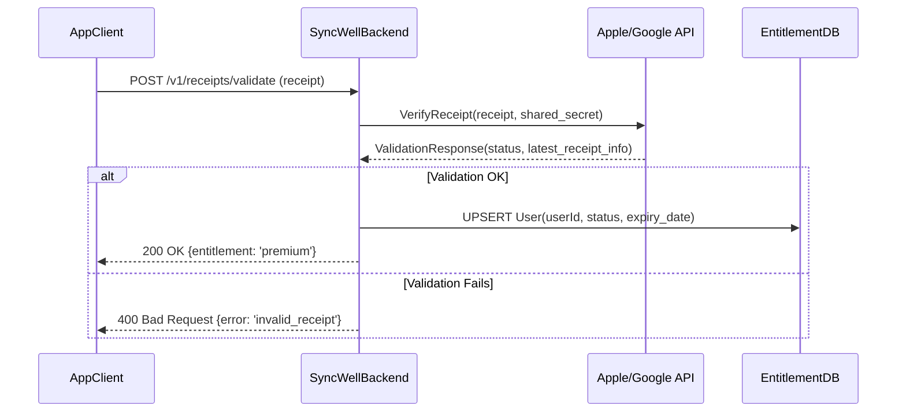

## Dependencies

### Core Dependencies
- `../prd/11-monetization.md` - Monetization, Pricing & Business Model
- `../prd/12-trial-subscription.md` - Trial & Subscription
- `../architecture/50-payment-gateway-integration.md` - Native Payment Gateway Integration (Deep Dive)

### Strategic / Indirect Dependencies
- `../ux/29-notifications-alerts.md` - Notifications & Alerts
- `../ux/08-ux-onboarding.md` - UX Onboarding

---

# PRD Section 49: Subscription Management (Deep Dive)

## 1. Introduction
Subscription management is the core of SyncWell's business model. This document provides a granular breakdown of the subscription lifecycle, feature gating, and user experience, from initial trial to long-term retention.

## 2. Subscription Tiers & Feature Gating
A clear distinction between the Free and Premium tiers is essential for driving conversions.

| Feature | Free Tier | Premium Tier |
| :--- | :--- | :--- |
| **Number of Sync Pairs** | 1 | Unlimited |
| **Sync Frequency** | Manual Only | Automatic (every hour) |
| **Historical Data Sync** | Not Available | Available |
| **Customer Support** | Standard (24-48h response) | Priority ( < 8h response) |
| **App Icon** | Standard Icon | Access to custom app icons |
| **Advertisements** | None (for now) | None |

## 3. Detailed User Flows & Logic

### 3.1. Trial Logic & Experience
1.  **Start of Trial:** The free trial (7 days) begins automatically on first app launch after sign-up.
2.  **UI During Trial:** A persistent banner at the top of the main screen will show the days remaining in the trial (e.g., "6 days left in your Premium trial").
3.  **Conversion Prompts:**
    -   At 3 days remaining, the banner becomes more prominent.
    -   An in-app message will be shown explaining the value of upgrading.
    -   A push notification will be sent 24 hours before trial expiration.
4.  **End of Trial:** When the trial expires, premium features are disabled. The UI will clearly indicate this and provide a prominent CTA to "Upgrade to Premium."

### 3.2. IAP Flow - New Subscription
1.  **Entry Point:** User taps an "Upgrade to Premium" CTA.
2.  **UI:** A paywall screen is presented, clearly showing the monthly and annual price points, with the annual option highlighted as "Best Value."
3.  **User Action:** User selects a plan and taps "Subscribe."
4.  **Client Action:** The app initiates the native In-App Purchase flow via the platform's SDK.
5.  **UI (Native):** The OS presents the standard payment sheet (e.g., Apple's Face ID/Touch ID confirmation).
6.  **Client Action:** Upon successful payment, the client receives a purchase receipt.
7.  **Backend Call:** The client sends the receipt to the backend for validation (see **Section 3.6**).
8.  **UI:** The app shows a "Welcome to Premium!" confirmation screen and unlocks all premium features.

### 3.3. Subscription Upgrade/Downgrade Flow
-   **Proration:** All plan changes (e.g., monthly to annual) are handled by the native App Store/Google Play logic, which automatically calculates prorated charges or credits.
-   **User Flow:** The user initiates a plan change from the OS-level subscription management screen, not directly within the SyncWell app. Our app will be notified of the change via server-to-server notifications.

### 3.4. Cancellation & Resubscription Flow
-   **Cancellation:** A user cancels their subscription via the OS subscription management page. The subscription remains active until the end of the current billing period.
-   **In-App State:** The app will reflect the status as "Premium, expires on [Date]."
-   **Expiration:** Once the period ends, the user's account reverts to the Free tier.
-   **Resubscription:** A previously subscribed user can tap any "Upgrade" CTA to start a new subscription immediately.

### 3.5. "Restore Purchases" Flow
1.  **Entry Point:** User taps "Restore Purchases" on the Settings or paywall screen.
2.  **Client Action:** The app calls the platform SDK's restore transaction function.
3.  **Client Action:** The SDK fetches the user's active subscriptions from Apple/Google.
4.  **Backend Call:** If an active SyncWell subscription receipt is found, it is sent to our backend for validation to ensure it's linked to the correct user account.
5.  **UI:** If successful, premium features are unlocked, and a "Purchases Restored" message is shown.

## 4. Technical Deep Dives

### 4.1. Grace Period & Billing Retry Logic
-   **State:** When a subscription renewal fails, the user enters a "Grace Period" state.
-   **Duration:** The grace period will be **16 days** for Apple (as per App Store guidelines) and **30 days** for Google Play.
-   **App Experience:** During the grace period, the user retains full premium access. However, a non-intrusive banner will be shown in the app: "There's an issue with your payment method. Please update it in your device settings to continue using Premium."
-   **Resolution:** If the user fixes their payment method within the window, the subscription automatically renews, and the banner is removed. If the period ends, the subscription is marked as "Canceled."

### 4.2. Server-Side Receipt Validation - Deep Dive
This expands on the high-level flow.

### 4.3. Subscription Status Communication
-   **Source of Truth:** The SyncWell backend is the single source of truth for a user's subscription status. The client should never rely on its own local state.
-   **UI Updates:**
    -   A "Premium" badge will be shown next to the user's avatar.
    -   Paywalled feature screens will be replaced with the actual feature UI.
    -   The "Upgrade" CTA will be hidden or replaced with a "Manage Subscription" link.

## 5. Future Considerations

### 5.1. Family Sharing
-   Apple's Family Sharing allows a subscription to be shared among family members. We will need to enable this option in App Store Connect and ensure our backend logic can handle multiple users being entitled from a single original purchase transaction.

### 5.2. Promotional Offers
-   Both platforms support promotional offers (e.g., a discounted introductory price for the first 3 months).
-   We can create and manage these offers in App Store/Play Connect and use them in targeted marketing campaigns. The paywall UI will need to be updated to display these offers when applicable.

## 6. Analysis & Calculations
### 6.1. Year 1 Revenue Projection Model
-   **Objective:** To achieve the Year 1 Strategic Goal of $5,000 Monthly Recurring Revenue (MRR) as defined in `../prd/01-context-vision.md`.
-   **Assumptions:**
    -   Price Point: **$4.99/month** or **$49.99/year** (we will assume the monthly price for this calculation).
    -   Target Trial-to-Paid Conversion Rate: **15%** (as per `../prd/01-context-vision.md`).
    -   Average New Installs per Month: To be determined by marketing efforts.
-   **Calculation:**
    -   *Required Number of Subscribers* = Target MRR / Monthly Price = $5,000 / $4.99 ≈ **1,002 subscribers**.
    -   *Required New Trials per Month* = Required Subscribers / Conversion Rate = 1,002 / 0.15 ≈ **6,680 new trial starts per month**.
-   **Conclusion:** This model shows that achieving the Year 1 revenue target is highly dependent on the marketing team's ability to drive a significant number of new users to start a trial. The 15% conversion rate is ambitious and will require a highly optimized paywall and onboarding experience.

### 6.2. Churn Rate Analysis
-   **Definition:** Churn rate is the percentage of subscribers who cancel their subscription in a given period.
-   **Industry Benchmark:** For consumer SaaS/apps, a monthly churn rate of 5-7% is considered acceptable. We will target **<5%** as per `../prd/01-context-vision.md`.
-   **Calculation & Impact:**
    -   With 1,002 subscribers, a 5% churn rate means losing ~50 subscribers each month.
    -   This means we must acquire **50 new subscribers each month just to maintain our MRR**, in addition to the new subscribers needed for growth.
-   **Mitigation Strategy:**
    -   **Proactive:** Continuously improve the core product, add new integrations, and use engagement features (`../ux/53-gamification.md`) to provide ongoing value.
    -   **Reactive:** Implement an exit survey for users who cancel to understand their reasons. For payment-related churn, the grace period handling (SUB-F-05) is critical.

## 7. Out of Scope
-   Direct credit card payments (all payments will be handled via native IAP).
-   Custom promotional codes or discounts (V1 will focus on standard pricing).
