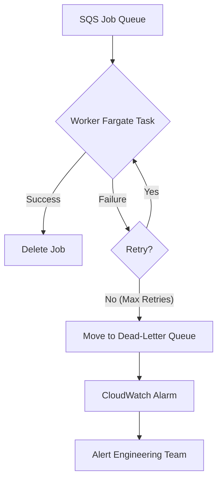

## Dependencies

### Core Dependencies
- `../architecture/06-technical-architecture.md` - Technical Architecture, Security & Compliance
- `../ux/40-error-recovery.md` - Error Recovery & Troubleshooting

### Strategic / Indirect Dependencies
- `../architecture/05-data-sync.md` - Data Synchronization & Reliability
- `../qa/14-qa-testing.md` - QA, Testing & Release Strategy
- `./22-maintenance.md` - Maintenance & Post-Launch Operations (SRE)
- `./24-user-support.md` - Help Center, Support & Feedback
- `./41-metrics-dashboards.md` - Analytics Dashboard Design

---

# PRD Section 17: Error Handling, Logging & Monitoring

## 1. Executive Summary

This document specifies the comprehensive strategy for error handling, logging, and monitoring for the entire SyncWell ecosystem. The goal is to build a highly resilient and observable system that can gracefully handle unexpected issues, provide clear feedback to the user, and give the engineering team powerful tools to diagnose and resolve problems quickly.

This enterprise-grade approach uses structured logging, centralized error handling, and targeted alerting to ensure high service quality.

## 2. Error Handling Architecture

### 2.1. Client-Side Error Handling
A centralized `ErrorHandler` service on the mobile client will be the single point through which all application-level errors flow. [NEEDS_CLARIFICATION: The interface and implementation details for this client-side service should be defined in the mobile-specific architecture documents.]

### 2.2. Backend Error Handling
The backend's error handling strategy is designed for maximum resilience and message durability.

1.  **Guaranteed Delivery & Message Durability:** Jobs are published to a durable **Amazon SQS FIFO queue**. SQS guarantees that the message is stored redundantly until a worker successfully processes it.

2.  **Handling Transient Failures with Retries:**
    *   **Infrastructure-Level Retries:** The primary retry mechanism is the SQS queue itself. If a `Worker Fargate Task` fails to process a message, the message becomes visible again in the queue after the `VisibilityTimeout` expires and is picked up by another worker.
    *   **Application-Level Resilience:** For specific, predictable transient errors (like API rate limiting), the application uses more advanced patterns like the **Circuit Breaker** and **Rate Limit Backoff**, which are defined in `../architecture/07-apis-integration.md`.
    *   **Cold Path (Step Functions):** For historical syncs, the Step Functions state machine provides its own declarative, automated retry logic (e.g., **3 max attempts** with an **exponential backoff rate of 2.0**).

3.  **Isolating Persistent Failures with a Dead-Letter Queue (DLQ):**
    *   If a job fails all retry attempts, SQS automatically moves it to a pre-configured **Dead-Letter Queue (DLQ)** after the `maxReceiveCount` is exceeded.
    *   **`maxReceiveCount` Configuration:** This value is definitively set to **5**. This provides a balance between recovering from transient errors and quickly isolating persistent failures.
    *   This isolates the problematic job, allowing healthy jobs to continue processing.

4.  **EventBridge Durability:** The EventBridge rules that target SQS queues will also be configured with their own DLQs. This ensures that if an event fails to be delivered to SQS, the event is captured and can be reprocessed.

### 2.3. Advanced Error Handling Patterns

To build a truly resilient system, the backend will employ several advanced patterns. These patterns are canonically defined in `../architecture/07-apis-integration.md` and are summarized here for context.

*   **API Rate Limit Backoff:** When a `429 Too Many Requests` error occurs, the worker uses the SQS `ChangeMessageVisibility` API to return the job to the queue with a calculated delay.
*   **Circuit Breaker for Unstable APIs:** For unstable third-party APIs, a Circuit Breaker pattern is used to "fail fast" when a high failure rate is detected, preventing wasted resources.
*   **Third-Party API Error Classification:** The `DataProvider` shared module classifies HTTP errors and applies the appropriate strategy. The full classification table is maintained in `../architecture/07-apis-integration.md`.

### 2.4. DLQ Management Strategy (Semi-Automated)

A **semi-automated DLQ handling process** will be implemented to reduce operational load.

*   **DLQ Analyzer Lambda:** A dedicated Lambda function, the `DLQAnalyzer`, is triggered whenever a message arrives in the main `HotPathSyncDLQ`.
    *   **Event Source Mapping:** The `DLQAnalyzer` Lambda will be configured with the DLQ as its event source, with a `batchSize` of 1 to process messages individually.

*   **Automated Triage Logic:** The `DLQAnalyzer` inspects the message's error metadata and attempts to identify specific, well-understood failure patterns from a configuration file.
    *   **Known Transient Errors:** If an error matches a known pattern, the `DLQAnalyzer` will automatically redrive the message back to the main queue after a longer delay (e.g., 1 hour).
    *   **Unrecoverable Errors:** If an error is known to be unrecoverable, the analyzer will archive the message to S3 and create a low-priority ticket.

*   **Alerting for Unknown Failures:** If a message's error does not match any known patterns, the `DLQAnalyzer` triggers a high-priority alert (via PagerDuty) to the on-call engineer.

#### Runbook for Manual Handling of Unknown DLQ Messages

When an on-call engineer is paged for an unknown DLQ message, they must follow this runbook:
1.  **Verify Archiving:** Confirm the message has been archived to the `s3://syncwell-prod-dlq-archive` bucket.
2.  **Inspection & Diagnosis:** Use the `correlationId` from the message to query CloudWatch Logs Insights for all related logs.
3.  **Decision and Action:**
    *   **If transient:** Redrive the message from the DLQ.
    *   **If bug:** Create a high-priority ticket. Add the new error pattern to the `DLQAnalyzer`'s configuration file in S3 to prevent future alerts. [NEEDS_CLARIFICATION: The exact S3 path and schema for this configuration file must be defined.]
    *   **If unrecoverable:** Log the issue and purge the message from the DLQ.

## 3. Unified Error Code Dictionary

A version-controlled dictionary, located in the **KMP shared module**, will be the single source of truth for error definitions. The client reads an error code from the backend and uses this dictionary to find the appropriate user-facing message key and recommended action. The user-facing strings themselves are managed in standard localization files.

**Example Entry:**
```json
{
  "FITBIT_TOKEN_EXPIRED": {
    "logLevel": "WARN",
    "userMessageKey": "error_fitbit_token_expired",
    "userAction": "NAVIGATE_TO_REAUTH_FITBIT"
  }
}
```

## 4. Structured Logging Strategy

### 4.1. Client-Side Logging
The mobile app will maintain a local, rotating log file with structured JSON entries. [NEEDS_CLARIFICATION: The rotation strategy (e.g., size-based, time-based) must be defined.]

### 4.2. Backend Logging
All backend services will output structured JSON logs to **AWS CloudWatch Logs** using a standardized library like **AWS Lambda Powertools**.

**Example Log Entry:**
```json
{
  "timestamp": "2023-10-27T14:30:00.123Z",
  "level": "ERROR",
  "message": "Sync job failed: Unhandled exception from provider.",
  "service": "WorkerFargateTask",
  "correlationId": "a1b2c3d4-e5f6-7890-1234-567890abcdef",
  "idempotencyKey": "client-generated-uuid-123",
  ...
}
```
*   **PII Scrubbing & Traceability:** `userId` **must not be written to logs**. The `correlationId` is the primary ID for tracing. For rare cases requiring user-specific debugging, the secure "break-glass" procedure defined in `../security/19-security-privacy.md` must be used.

## 5. Monitoring & Alerting Strategy

The comprehensive observability strategy is defined in `../architecture/06-technical-architecture.md`. This section summarizes key alert triggers.

### 5.1. Client-Side Monitoring
*   **Tooling:** Firebase Crashlytics.
*   **Critical Alerts:** A newly detected crash type or a significant regression in the **99.5%** crash-free user rate SLO.

### 5.2. Backend-Side Monitoring
*   **Tooling:** AWS CloudWatch, AWS X-Ray, and Grafana.
*   **Alerting Flow:** CloudWatch Alarms → SNS → PagerDuty. [NEEDS_CLARIFICATION: The PagerDuty service integration key must be defined.]
*   **High-Priority Alert Triggers:**
    *   **Dead-Letter Queue (DLQ):** Any message arriving in a DLQ.
    *   **Idempotency Key Collisions:** A custom CloudWatch metric monitoring a spike in suppressed duplicate requests.
    *   **Function & API Errors:** Spike in Lambda/Fargate errors or 5xx API Gateway errors.
    *   **Queue Health:** `ApproximateAgeOfOldestMessage` for the main SQS queue exceeds 5 minutes.
    *   **Database Throttling:** Sustained throttling events on the DynamoDB table.

## 6. Visual Diagrams

### Backend Error Handling Flow (DLQ)


## 7. Log Management at Scale

A tiered and sampled logging strategy will be used to manage costs, as defined in `../architecture/06-technical-architecture.md`. This section specifies the retention policies.

*   **Log Levels:** Default to `INFO` in production. Dynamically adjustable to `DEBUG` via AWS AppConfig for targeted issue diagnosis.
*   **Log Retention and Archiving:**
    *   **CloudWatch:** **30-day** retention.
    *   **S3 (Long-term Archive):** Logs are automatically exported from CloudWatch to S3.
    *   **S3 Glacier:** S3 Lifecycle policies transition logs to S3 Glacier Deep Archive after **1 year**.
*   **Log Analysis:** CloudWatch Logs Insights for recent logs, Amazon Athena for archived logs in S3.
