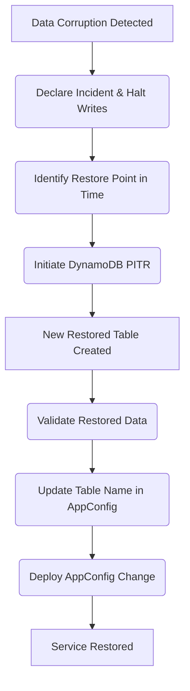

## Dependencies

### Core Dependencies
- `06-technical-architecture.md` - Technical Architecture, Security & Compliance
- `19-security-privacy.md` - Data Security & Privacy Policies
- `44-contingency-planning.md` - Contingency & Rollback Plans

### Strategic / Indirect Dependencies
- `22-maintenance.md` - Maintenance & Post-Launch Operations (SRE)

---

# PRD Section 18: Backup & Disaster Recovery

## 1. Executive Summary

This document specifies the strategy for data backup, high availability, and disaster recovery for the SyncWell application's MVP. To balance cost, complexity, and time-to-market, the MVP will be deployed to a **single AWS region**. The strategy is therefore focused on **intra-region high availability** and a robust, well-tested plan for recovering from a disaster scenario such as data corruption or the failure of an entire Availability Zone.

## 2. High Availability Strategy (Intra-Region)

High availability for the MVP is achieved by deploying services across multiple Availability Zones (AZs) within our primary AWS region.
*   **Stateless Services:** API Gateway and AWS Fargate are inherently highly available and run across multiple AZs by default.
*   **Stateful Services:**
    *   **DynamoDB:** The `SyncWellMetadata` table is configured for Multi-AZ deployment.
    *   **ElastiCache for Redis:** The Redis cluster is configured with Multi-AZ failover.
    *   **Secrets Manager:** This is a regional service that is resilient to AZ failure by default.

This multi-AZ approach ensures that the failure of a single Availability Zone does not result in a service outage.

## 3. The New Device / Re-install Experience
*(Unchanged from previous version, as this flow remains the same)*

The recovery process is an integral part of the onboarding flow for a returning user.

1.  **First Launch:** On first launch, the app presents the user with "Sign in with Apple" and "Sign in with Google" options.
2.  **Authentication:** The user signs in with the same method they used originally.
3.  **State Recovery:** The app sends the user's ID to the SyncWell backend. The backend retrieves the user's complete configuration from the DynamoDB table.
4.  **Instant Setup:** The app UI populates with all the user's sync configurations.
5.  **Seamless Syncing:** The user's OAuth tokens are retrieved from Secrets Manager, and syncs can resume immediately.

## 4. Disaster Recovery Strategy (Single-Region MVP)

For the single-region MVP, a "disaster" is defined as an event that makes the service entirely unavailable or results in widespread data corruption. This could be a full regional outage or a critical bug. The recovery plan is manual and focuses on restoring data integrity and service functionality from backups.

This strategy yields the following recovery objectives, which are aligned with the NFRs in `06-technical-architecture.md`:

| Failure Scenario | Recovery Time Objective (RTO) | Recovery Point Objective (RPO) | Mechanism |
| :--- | :--- | :--- | :--- |
| **Full Regional Outage** or **Data Corruption Event** | **< 4 hours** | **< 15 minutes** | **Manual Restore.** An engineer initiates a DynamoDB Point-in-Time Recovery (PITR) to a new table. The application is then repointed to the new table using AWS AppConfig. The RPO is governed by the continuous backup window of PITR. |
| **Availability Zone Failure** | **< 5 minutes** | **~0** | **Automatic Failover.** Handled automatically by the Multi-AZ configuration of AWS services. |

### Recovery Mechanisms:

*   **Infrastructure as Code (IaC):** The entire backend infrastructure is defined in **Terraform**. In the event of a full regional outage, this allows for the rapid redeployment of the entire stack to a new, healthy region.
*   **Data Backup (DynamoDB Point-in-Time Recovery):**
    *   Our primary recovery mechanism for data is **DynamoDB Point-in-Time Recovery (PITR)**, which is enabled on the `SyncWellMetadata` table.
    *   PITR provides continuous backups of our table data, allowing us to restore to any single second in the preceding 35 days. This provides an RPO of minutes, or even seconds, depending on how quickly the incident is detected.
*   **Credential Backup (AWS Secrets Manager):** Secrets Manager is a highly available regional service. In the event of a full regional outage, the secrets would need to be restored from a backup or recreated as part of the recovery process in a new region.
*   **Configuration-Driven Recovery (AWS AppConfig):**
    *   The application code does not contain hardcoded resource names (like the DynamoDB table name). Instead, it fetches these from **AWS AppConfig** at startup.
    *   This is a crucial element of the DR strategy. After restoring a table via PITR, which creates a new table with a new name, an engineer simply updates the `tableName` configuration value in AppConfig.
    *   This allows the entire application to be repointed to the restored database without requiring a new code deployment, dramatically reducing the RTO.
*   **Stateless Compute (AWS Fargate):**
    *   The backend worker fleet is stateless. This is critical for recovery, as no data is stored on the compute instances themselves. In a disaster recovery scenario, a new Fargate fleet can be deployed, and it can immediately start processing jobs once the data layer (DynamoDB) is restored and repointed.

### Disaster Recovery Flow (Data Corruption)

## 5. Risk Analysis & Mitigation

| Risk ID | Risk Description | Probability | Impact | Mitigation Strategy |
| :--- | :--- | :--- | :--- | :--- |
| **R-50** | A bug in our code corrupts user configuration data in DynamoDB. | Low | High | **Mitigated.** Use the manual DynamoDB Point-in-Time Recovery (PITR) runbook to restore the table to a state before the corruption occurred. |
| **R-51** | A full AWS regional outage makes the backend unavailable. | Low | Critical | **Partially Mitigated.** The RTO is < 4 hours via a manual restore process to a new region using IaC and PITR. The business has accepted this RTO for the MVP to avoid the cost and complexity of a multi-region architecture. |
| **R-52** | User loses access to their Apple/Google account. | Medium | Medium | **Accepted Risk for MVP.** Manual account recovery is not supported for the MVP due to the high security risk. See Section 6 for details. |

## 6. Future Enhancement: Multi-Region Active-Active

As specified in `06-technical-architecture.md`, a future enhancement to dramatically improve the RTO and RPO is to migrate to a **multi-region, active-active architecture**. This would involve promoting the DynamoDB table to a Global Table, enabling cross-region replication for Secrets Manager, and using Route 53 for automatic, latency-based failover. This would reduce the RTO for a regional outage from hours to minutes, but it is deferred from the MVP due to its significant cost and operational complexity.

## 6. Detailed Recovery Runbooks

### Runbook: Data Corruption Recovery (PITR)
This is a last-resort, high-risk manual procedure to be followed in the event of widespread data corruption.

1.  **Declare Incident & Halt Writes:** A major incident is declared. If possible, writes to the DynamoDB table are temporarily disabled to prevent further corruption.
2.  **Identify Restore Point:** This is the most critical and difficult step. Engineers must use logs and metrics to identify the precise moment *before* the corruption began. This determines the restore timestamp. All data written between this point and the incident declaration will be lost. This data loss must be acknowledged and accepted before proceeding.
3.  **Initiate PITR:** An authorized engineer initiates a Point-in-Time Recovery of the `SyncWellMetadata` DynamoDB table from the AWS console, using the identified restore timestamp. This creates a new table (e.g., `SyncWellMetadata-restored-YYYY-MM-DD`).
4.  **Validate Restored Data:** The engineer must run validation scripts against the new table to ensure the data is consistent and the corruption is gone.
5.  **Update AppConfig & Redirect Traffic:** The application code does not contain a hardcoded table name. Instead, it fetches the table name from **AWS AppConfig**. To redirect all application traffic to the newly restored table, the engineer updates the `tableName` configuration value in AppConfig and deploys the configuration change. This is a fast and safe way to repoint the entire application without a code deployment.
6.  **Post-Mortem:** A full post-mortem analysis is conducted to understand the root cause and prevent recurrence.

### Runbook: Manual Account Recovery

**CRITICAL RISK ADVISORY:** The process of manually migrating user data from one identity to another is exceptionally high-risk and is a prime vector for catastrophic human error, social engineering attacks, and permanent data loss. A manually executed, script-based process for this operation is **unacceptable** for a production system at scale.

*   **MVP Stance:** For the MVP, this feature **is considered unsupported**. If a user permanently loses access to their sign-in provider (e.g., their Google account), they will lose access to their SyncWell data. This is a deliberate product decision to avoid the immense security and operational risks of a manual process.

*   **Future Implementation Requirements:** If this feature is prioritized in the future, it **must not** be implemented as a manual script run by an engineer. It must be built as a dedicated, secure, and audited internal tool with multiple safety checks and a robust approval workflow.

*   **Required Safety Features for a Future Tool:**
    1.  **MFA-Gated Execution:** The tool must require the executing engineer to re-authenticate with MFA.
    2.  **Two-Person Rule:** The operation must require approval from a second authorized engineer, who also authenticates with MFA (a "two-person rule").
    3.  **Soft Deletes:** The old data must not be immediately deleted. It should be "soft-deleted" (e.g., flagged for deletion with a 30-day TTL) to allow for a rollback in case of error.
    4.  **Comprehensive Auditing:** Every step of the process must be logged to an immutable audit trail.

A simple peer review of a script is insufficient for an operation of this magnitude. The process described in the previous version of this document is a recipe for disaster and **must not be implemented**.
