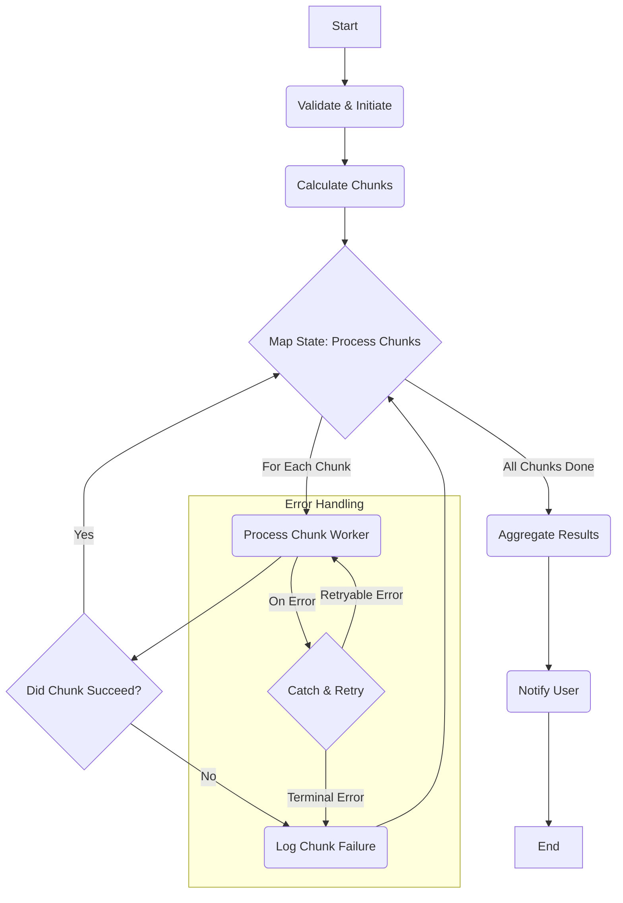

# PRD: Historical Data Sync

## 1. Executive Summary

This document specifies the requirements for the **Historical Data Sync** feature. This is a core premium offering that allows users to perform a one-time, large-scale backfill of their historical health data from a connected provider. This feature is a key driver for monetization, providing a powerful incentive for users to upgrade to the Pro subscription tier.

The "Cold Path" architecture, which uses AWS Step Functions, is designed to handle these long-running, asynchronous jobs reliably and cost-effectively.

*   **Target Audience:** New users who want to import their complete history, and data-conscious users who want a complete, unified record of their health data in one place.
*   **Business Goal:** [NEEDS_CLARIFICATION: What is the primary business goal? E.g., "Increase Pro tier conversion rate by 15% within 6 months of launch."]
*   **Success Metrics:** [NEEDS_CLARIFICATION: What are the primary KPIs? E.g., "Number of historical syncs initiated per week," "Completion success rate > 98%," "Average time to completion."]

## 2. User Stories

| ID | User Story | Persona | Priority |
| :--- | :--- | :--- | :--- |
| **US-31** | As a new user (Sarah), I want the app to automatically sync the last 7 days of my data upon setting up a new connection, so I can see immediate value and confirm it's working without manually running a full historical sync. | Sarah | Should-Have (S-2) |
| **US-39** | As a user (Alex), if my large historical sync finishes with some errors, I want to clearly see which parts failed and be able to retry them easily, so I don't have to re-run the entire sync. | Alex | Should-Have (S-1) |

## 3. Functional Requirements

### 3.1. User Experience & UI
*   **FR-1:** The user must be able to initiate a historical sync from a clearly marked button or menu within the application. [NEEDS_CLARIFICATION: Link to UI/UX mockups needed.]
*   **FR-2:** Before starting the sync, the app must display an estimated time to completion.
*   **FR-3:** While a sync is in progress, the app must display a persistent, non-blocking status indicator.
*   **FR-4:** Upon completion, the user must receive a push notification indicating success or failure.
    *   `N-05`: "Your historical sync is complete."
    *   `N-06`: "Your historical sync finished with some errors."
*   **FR-5:** If a sync fails partially, the user must be able to view a list of the specific date ranges or data types that failed to sync.
*   **FR-6:** The user must have a clear option to retry only the failed parts of a sync job.

### 3.2. Technical Requirements
*   **FR-7:** The historical sync must be processed asynchronously on the backend.
*   **FR-8:** The system must use a long-running workflow orchestrator (AWS Step Functions) to manage the process.
*   **FR-9:** The system must break the total date range into smaller, manageable chunks (e.g., 7-day periods) to be processed in parallel.
*   **FR-10:** The system must support retries with exponential backoff for transient errors encountered while processing a chunk.
*   **FR-11:** The system must log the success or failure of each individual chunk to enable partial retries.
*   **FR-12:** The entire process must be idempotent, driven by a client-provided `Idempotency-Key`.

## 4. Non-Functional Requirements

*   **NFR-1 (Reliability):** The success rate for completed historical sync jobs must be > 98%.
*   **NFR-2 (Performance):** A historical sync of 1 year of data for a typical user should complete in under 4 hours. [NEEDS_CLARIFICATION: Validate this assumption with load testing.]
*   **NFR-3 (Scalability):** The system must be able to handle at least 100 concurrent historical sync jobs.
*   **NFR-4 (Cost):** The cloud infrastructure cost for a single 1-year historical sync should not exceed $1.00. [NEEDS_CLARIFICATION: Validate this with cost modeling.]

## 5. Architectural Design ("Cold Path")

The "Cold Path" is designed for large-scale, non-urgent data processing and is architecturally distinct from the "Hot Path" used for real-time syncs.

### 5.1. Level 4: Historical Sync Workflow (AWS Step Functions)

To handle long-running historical data syncs, we will use an **AWS Step Functions Standard Workflow**. This provides the required durability, observability, and error handling for a process that could last for hours.

*   **State Machine Logic:**
    1.  **Initiate & Validate:** Triggered by an API call from the app. A Lambda function validates the request, confirms the user's subscription status, and creates a job record in DynamoDB. It then sends a push notification (`N-04`: "Your historical sync has started...") to the user.
    2.  **Calculate Chunks:** A Lambda function calculates the total date range and breaks it into an array of smaller, logical chunks (e.g., 7-day periods). This array is passed as the input to the next state.
        *   *Payload Management:* To avoid the 256KB state payload limit, if the chunk array is very large, it will be written to an S3 object, and only the S3 object key will be passed in the state.
    3.  **Process in Parallel (`Map` State):** The state machine uses a `Map` state to iterate over the array of chunks. For each chunk, it invokes a `WorkerLambda` in parallel.
        *   *Concurrency Control:* The `Map` state has a configurable concurrency limit (e.g., `MaxConcurrency: 10`) to avoid overwhelming downstream provider APIs. This is a critical cost and performance control.
    4.  **Error Handling (`Retry` and `Catch`):**
        *   **`Retry` Policy:** Each `WorkerLambda` invocation will have a declarative `Retry` policy for transient errors (e.g., API rate limiting), with **3 max attempts** and an **exponential backoff rate of 2.0**.
        *   **`Catch` Logic:** If retries fail, a `Catch` block routes the failure to a `Log Chunk Failure` Lambda. This function records the failed chunk's details in DynamoDB for later analysis or retry (see US-39). The `Map` state continues processing the remaining chunks.
    5.  **Aggregate Results & Notify User:** After the `Map` state completes, a final Lambda function aggregates the results (total successes, total failures). It updates the main job status in DynamoDB and publishes a `HistoricalSyncCompleted` event. This event triggers a final push notification: `N-05` ("Your historical sync is complete.") or `N-06` ("Your historical sync finished with some errors.").

*   **Scalability and Cost Management:**
    *   **Compute:** The `Process Chunk Worker` will be implemented as a Fargate task invoked by Step Functions, which is the most cost-effective solution for potentially long-running data processing jobs.
    *   **Intelligent Tiering:** All artifacts generated by the workflow (e.g., chunk definitions, logs) will be stored in Amazon S3 with an "Intelligent Tiering" lifecycle policy to automatically manage storage costs.

### 5.2. Idempotency for Historical Syncs

For long-running historical syncs, an additional layer of idempotency is applied at the orchestration level:
*   **Execution Naming:** The API Gateway integration **must** be configured to use the client-provided `Idempotency-Key` as the `name` for the Step Function's execution.
*   **Handling Existing Executions:** If API Gateway's attempt to start an execution fails with an `ExecutionAlreadyExists` error, the system **must not** assume success. Instead, the integration logic will call `DescribeExecution` to check the status of the existing execution.
    *   If the existing execution is `SUCCEEDED` or `RUNNING`, the API can safely return a `202 Accepted` to the client.
    *   If the existing execution `FAILED`, the API must return a `409 Conflict` (or similar error), indicating that the original request failed and a new request with a new `Idempotency-Key` is required.

### 5.3. DynamoDB Schema for Historical Sync Jobs
| Entity | PK (Partition Key) | SK (Sort Key) | Key Attributes & Defined Values |
| :--- | :--- | :--- | :--- |
| **Hist. Sync Job** | `USER#{userId}` | `HISTORICAL##{jobId}` | `ExecutionArn`, `Status`: `PENDING`, `RUNNING`, `SUCCEEDED`, `FAILED` |

## 6. Risk Analysis
[NEEDS_CLARIFICATION: A full risk analysis should be completed. Initial thoughts below.]
| Risk ID | Description | Probability | Impact | Mitigation Strategy |
| :--- | :--- | :--- | :--- | :--- |
| **R-71** | High cloud costs from inefficient queries or very large backfills. | Medium | High | Implement cost monitoring and alerts. Use Fargate Spot for workers. Validate cost assumptions with load testing. |
| **R-72** | Hitting third-party API rate limits during large backfills. | High | Medium | Use a configurable concurrency limit in the Step Functions `Map` state. Implement exponential backoff. |
| **R-73** | A bug in the `Process Chunk Worker` causes silent data corruption. | Low | High | Implement data validation checks and "golden file" comparison in the CI/CD pipeline. |
