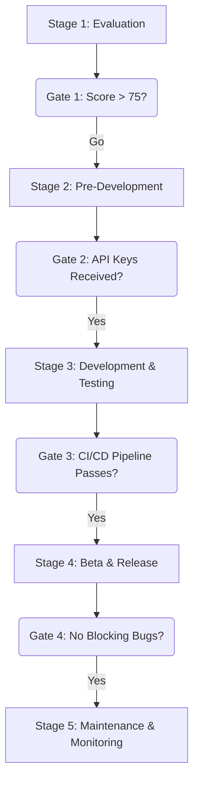

## Dependencies

### Core Dependencies
- `./01-context-vision.md` - Context & Vision
- `./03-competitive-analysis.md` - Competitive & SWOT Analysis
- `./13-roadmap.md` - Roadmap, Milestones & Timeline
- `../ux/42-customer-feedback.md` - Customer Feedback Loop

### Strategic / Indirect Dependencies
- `../architecture/07-apis-integration.md` - APIs & Integration Requirements
- `./21-risks.md` - Risks, Constraints & Mitigation
- `../ops/25-release-management.md` - Release Management & Versioning
- `../architecture/32-platform-limitations.md` - Platform-Specific Limitations

---

# PRD: Third-Party Integration Strategy

## 1. Executive Summary

This document provides the strategic framework for the lifecycle of third-party integrations within SyncWell. As integrations are our core product feature, a disciplined and strategic approach to selecting, developing, and maintaining them is critical for long-term success.

The framework is designed to be data-driven and objective, using a quantitative scorecard to prioritize opportunities. This process provides a crucial defense against misallocating precious engineering resources by ensuring we only work on integrations that provide maximum value to our users and align with our business goals, as defined in `01-context-vision.md`.

## 2. The Integration Opportunity Scorecard

The decision to pursue a new integration will be based on the outcome of this scorecard. Each potential integration is scored, and opportunities are ranked. An opportunity is pursued if its final score is **above 75**. The final score maps to a priority on the main product roadmap (`13-roadmap.md`).

| Category (Weight) | Criteria | Scoring (0-5) | Notes |
| :--- | :--- | :--- | :--- |
| **User Demand (40%)** | Votes on the public feedback portal: `https://feedback.syncwell.com` | 0 = <10 votes 5 = >500 votes | The most important factor. |
| **Strategic Value (30%)**| Expands our total addressable market. | 0 = No new segment 5 = Opens a **high-value, untapped user segment**. | Directly tied to company OKRs.   - *High-value segment: A user group with high willingness to pay (e.g., dedicated athletes).*   - *Untapped segment: A large user base (>1M DAU) for which we have no current integration.* |
| **Technical Feasibility (20%)** | Quality of the provider's API and documentation. | 0 = Poorly documented, no SDK 5 = Excellent docs, modern API, official SDK | Can our engineers build and maintain this efficiently? |
| **Competitive Landscape (10%)**| Achieves parity with a key competitor. | 0 = No parity gain 5 = Fills a **major competitive gap**. | *Major gap: An integration offered by at least 2 of our top 3 competitors.* |

## 3. The Gated Integration Lifecycle

Each integration proceeds through a formal, gated lifecycle.

### Stage 1: Evaluation
*   **Activities:** Complete the Opportunity Scorecard. Perform a preliminary investigation of the API documentation.
*   **Gate Review:** Is the final score above the 75 threshold?
*   **Outcome:** "Go/No-Go" decision.

### Stage 2: Pre-Development
*   **Activities:** Apply for production API access. Add an entry to `../architecture/32-platform-limitations.md`, which serves as a centralized, engineering-level record of known technical limitations or API quirks for each platform.
*   **Gate Review:** Have we received production-level API keys?
*   **Outcome:** Approved for active development.

### Stage 3: Development & Testing
*   **Activities:** The `DataProvider` module is built, including auth, data mappers, and a full suite of automated tests.
*   **Gate Review:** Does the provider pass all unit and integration tests in the CI/CD pipeline?
*   **Outcome:** Ready for beta testing.

### Stage 4: Beta & Release
*   **Activities:** The integration is deployed to the public beta channel for at least two weeks. Users can opt-in to the beta channel via a toggle in the app's Settings screen. Feedback is collected through a dedicated 'Submit Beta Feedback' button that opens a pre-populated email to `beta-feedback@syncwell.com`.
*   **Gate Review:** Are there any blocking bugs reported by beta testers?
*   **Outcome:** Ready for public release.

### Stage 5: Maintenance & Monitoring
*   **Activities:** The integration is live. Its error rates and performance are monitored. Key health metrics for each integration are the **API error rate (per endpoint)**, **P95 API latency**, and **sync job success rate**. These are tracked in a dedicated Grafana dashboard.

## 4. Partner Relationship Management

*   **Centralized Record:** A private repository (`https://github.com/SyncWell/internal-partner-relations`) will be maintained with key information for each partner (contacts, API keys, etc.).
*   **Proactive Monitoring:** We will subscribe to the developer blog/newsletter for each key partner to stay informed about upcoming API changes.

## 5. Deprecation Plan

If an API provider discontinues their service or we decide to end an integration, a user-centric off-boarding process will be followed:
1.  **3-Month Notice:** Announce the planned deprecation via an in-app banner to affected users: `[Provider Name] will no longer be supported after [Date]. Please see our blog for more details.`
2.  **2-Month Notice:** Prevent new users from connecting to the service.
3.  **1-Month Notice:** Send a final push notification reminder: `Heads up: Your connection to [Provider Name] will be removed in 30 days.`
4.  **Deprecation Day:** Remove the integration.

## 6. Process Risk Analysis

| Risk ID | Risk Description | Probability | Impact | Mitigation Strategy |
| :--- | :--- | :--- | :--- | :--- |
| **R-80** | We invest heavily in an integration that has low user adoption. | Medium | High | The data-driven scorecard, with its heavy weight on user demand, is the primary mitigation against this. |
| **R-81** | A key partner revokes our API access or becomes a direct competitor. | Low | High | Maintain a diversified portfolio of integrations. Nurture good partner relationships. |
| **R-82** | Opportunity cost: Engineering resources are spent on a low-impact integration instead of a higher-impact one. | Medium | Medium | Strict adherence to the gated lifecycle and objective scorecard process. |

## 7. Visual Diagrams

### Gated Integration Lifecycle

Diagram Source Code

