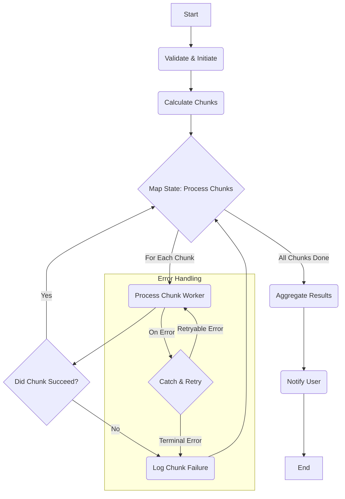

## Dependencies

### Core Dependencies
- `13-roadmap.md` - Roadmap, Milestones & Timeline

### Strategic / Indirect Dependencies
- `01-context-vision.md` - Context & Vision
- `03-competitive-analysis.md` - Competitive & SWOT Analysis
- `11-monetization.md` - Monetization, Pricing & Business Model
- `42-customer-feedback.md` - Customer Feedback Loop

---

# PRD Section 45: Future Enhancements & Roadmap Expansion

## 1. Executive Summary

This document serves as a visionary backlog and idea repository for the long-term evolution of the SyncWell application. It contains potential features, strategic directions, and product expansions that are **beyond the scope of the current 12-18 month roadmap**. The purpose of this document is to capture and explore ambitious ideas without committing to them, ensuring that we maintain a long-term vision for growth and innovation.

This is a living document that will be revisited during annual strategic planning. For the **solo developer**, it is a source of inspiration. For **investors**, it demonstrates that the vision for SyncWell extends far beyond its initial market, pointing to significant future growth potential.

## 2. Guiding Principles for Future Growth

The decision to pull an idea from this document into the official roadmap will be guided by these principles:
*   **Does it align with our core mission?** We are a data synchronization and management tool, not a social network or a content platform.
*   **Can it be a new revenue stream?** Does the feature provide enough value to support a new, optional subscription tier?
*   **Does it create a competitive moat?** Does the feature create a unique advantage that is difficult for competitors to replicate?
*   **Is it technically feasible?** Do we have the skills and resources to build it to a high standard of quality?

## 3. Potential Future Enhancements (The "Idea Backlog")

These ideas represent the long-term vision for SyncWell, building upon the foundation laid in the Year 1 Roadmap.

### Theme 1: The Insights Layer (Post-Year 1)

This theme builds on the **Q2: Intelligence & Insight** roadmap. Once SyncWell is the canonical source for a user's health data, we can build an intelligence layer on top of it.

*   **Idea:** **Cross-Platform Insights Engine**
    *   **Description:** Move beyond data management to provide proactive, cross-platform insights. The app would analyze the user's (on-device) canonical data to find interesting correlations.
    *   **Example:** "Your sleep quality from Oura improves by an average of 15% on days you run more than 5k with Garmin. Keep it up!"
    *   **Strategic Goal:** Increase user engagement and "stickiness" by providing unique value that no single platform can offer.
*   **Idea:** **Health Automation Hub (IFTTT-style)**
    *   **Description:** Allow users to create powerful "if this, then that" rules to automate their health life.
    *   **Example:** "IF I log a workout > 60 mins on Strava, THEN add a 'Hydration Reminder' to my calendar 30 minutes later."
    *   **Strategic Goal:** Transform the app from a sync tool into a personalized health automation platform, creating a powerful competitive moat.

### Theme 2: SyncWell as a Platform (Post-Year 1)

This theme builds on the **Q4: Scale & Optimize** roadmap, expanding SyncWell from a product into a platform.

*   **Idea:** **SyncWell for Web**
    *   **Description:** A premium, subscription-based web dashboard for Pro users.
    *   **Features:** View and manage syncs, advanced data visualization, and perform bulk data operations.
    *   **Strategic Goal:** Create a new, high-margin recurring revenue stream targeting our most dedicated users and solidifying our "power user" positioning.
*   **Idea:** **SyncWell Developer API**
    *   **Description:** Offer a paid, public API that allows other developers to access SyncWell's powerful provider architecture.
    *   **Value Prop:** A small nutrition app could, with one integration, read data from all 20+ services SyncWell supports.
    *   **Strategic Goal:** Diversify revenue into B2B/PaaS and deeply embed SyncWell into the health-tech ecosystem.

### Theme 3: New Business Verticals (Post-Year 1)

This theme builds on the introduction of the **Family Plan** in Q4, exploring new B2B and group-based business models.

*   **Idea:** **SyncWell for Corporate Wellness**
    *   **Description:** A B2B portal that allows companies to offer SyncWell Pro as a benefit to their employees. The portal would provide anonymized, aggregated data to the employer (e.g., "75% of employees met their weekly activity goal") while preserving individual privacy.
    *   **Strategic Goal:** Enter the lucrative corporate wellness market with a privacy-first solution.
*   **Idea:** **SyncWell for Health Coaches**
    *   **Description:** A portal for certified health and fitness coaches to (with explicit user consent) view their clients' incoming data from various platforms in one unified dashboard.
    *   **Strategic Goal:** Create a high-value B2B subscription tier and become an essential tool for the coaching industry.

### Theme 4: Consolidated Post-MVP User Story Backlog

This section contains a backlog of proposed user stories for future consideration, organized by epic.

#### Epic 6: Advanced Sync Control & Automation

---

##### **US-19:** Prioritize the execution order of syncs.
*   **User Story:** As a power user (Alex), I want to set a priority order for my sync configurations so that more important syncs (like my daily run) are executed before less important ones.
*   **Persona:** Alex
*   **Priority:** Could-Have (C-1)

##### **US-20:** Pause and resume all syncing globally.
*   **User Story:** As a user (Sarah), I want to be able to pause all syncing temporarily with a single tap so I can conserve battery or data when traveling.
*   **Persona:** Sarah, Alex
*   **Priority:** Should-Have (S-3)

##### **US-21:** Back up health data to personal cloud storage.
*   **User Story:** As a user (Alex), I want to create a "backup" sync that only runs once a week to archive my data to a cloud storage provider (e.g., Google Drive, Dropbox) so I have a personal, long-term record.
*   **Persona:** Alex
*   **Priority:** Could-Have (C-1)

#### Epic 7: Data Insights & Visualization

---

##### **US-22:** Compare data from two sources in a chart.
*   **User Story:** As a user (Sarah), I want to see a simple chart comparing my step count from two different sources over the last week so I can see how well they correlate.
*   **Persona:** Sarah
*   **Priority:** Could-Have (C-2)

##### **US-23:** See a data completeness score.
*   **User Story:** As a user (Alex), I want to see a "data completeness" score for each day so I can easily identify if key data points (like sleep or workouts) are missing from my records.
*   **Persona:** Alex
*   **Priority:** Could-Have (C-1)

##### **US-24:** Receive a weekly summary notification.
*   **User Story:** As a user (Sarah), I want to receive a weekly summary notification with my key stats (e.g., total steps, average sleep) so I can see my progress at a glance.
*   **Persona:** Sarah
*   **Priority:** Should-Have (S-3)

#### Epic 8: Expanded Platform & Data Support

---

##### **US-25:** Connect to smart scales.
*   **User Story:** As a user (Alex), I want to connect my smart scale (e.g., Withings) as a data source so that my weight is automatically synced.
*   **Persona:** Alex
*   **Priority:** Should-Have (S-1)

##### **US-26:** Connect to mindfulness apps.
*   **User Story:** As a user (Sarah), I want to connect my mindfulness app (e.g., Calm, Headspace) so that my meditation sessions are synced to Apple Health / Google Fit.
*   **Persona:** Sarah
*   **Priority:** Could-Have (C-2)

##### **US-27:** Connect to nutrition apps.
*   **User Story:** As a user (Alex), I want the app to sync nutrition data (calories, macros) from MyFitnessPal so I have a complete picture of my health inputs.
*   **Persona:** Alex
*   **Priority:** Should-Have (S-1)

##### **US-28:** Export sync history to a CSV file.
*   **User Story:** As a user (Alex), I want to be able to export a specific sync's history as a CSV file so I can do my own analysis in a spreadsheet.
*   **Persona:** Alex
*   **Priority:** Should-Have (S-2)

##### **US-29:** Granular Sync Frequency Control.
*   **User Story:** As a power user (Alex), I want to be able to override the default sync frequency for a specific connection (e.g., sync my primary running watch every hour, even if the adaptive polling algorithm would normally sync it less frequently), so I have fine-grained control over data freshness.
*   **Persona:** Alex
*   **Priority:** Could-Have (C-1)

##### **US-30:** Preview data before a sync is executed.
*   **User Story:** As a cautious user (Sarah), I want to see a preview of the data that will be synced before it's written to the destination app, so I can review and approve the changes.
*   **Persona:** Sarah
*   **Priority:** Could-Have (C-1)

##### **US-31:** Smart, automatic backfill of recent data for new users.
*   **User Story:** As a new user (Sarah), I want the app to automatically sync the last 7 days of my data upon setting up a new connection, so I can see immediate value and confirm it's working without manually running a full historical sync.
*   **Persona:** Sarah
*   **Priority:** Should-Have (S-2)

##### **US-32:** Sync advanced biometric data (e.g., HRV, SpO2).
*   **User Story:** As a data-driven athlete (Alex), I want to sync advanced biometric data like Heart Rate Variability (HRV) and Blood Oxygen (SpO2) between my compatible devices, so I can analyze my recovery and performance in my preferred app.
*   **Persona:** Alex
*   **Priority:** Should-Have (S-1)

##### **US-33:** Display API rate limit status to the user.
*   **User Story:** As a user (Alex) performing a large historical sync, I want to see the current status of my API rate limits for each service (e.g., "Garmin: 75% of hourly limit remaining"), so I can understand why a sync might be paused or running slowly.
*   **Persona:** Alex
*   **Priority:** Could-Have (C-3)
*   **Note:** The UX for this feature needs careful consideration to avoid confusing non-technical users. It should be an optional, advanced setting.

##### **US-34:** Set a "Source of Truth" for automatic conflict resolution.
*   **User Story:** As a user (Alex) who trusts my Garmin for runs, I want to declare it as the "Source of Truth" for running activities, so that if a conflict with another source is detected, the Garmin data is kept automatically without prompting me every time.
*   **Persona:** Alex
*   **Priority:** Should-Have (S-2)

##### **US-35:** Use an interactive guide for troubleshooting sync errors.
*   **User Story:** As a user (Sarah) who sees a "Sync Failed" error, I want the app to provide an interactive guide that asks me questions to diagnose the problem and provide a specific solution, instead of me having to read a long FAQ.
*   **Persona:** Sarah
*   **Priority:** Should-Have (S-3)

##### **US-36:** Add a home screen widget for at-a-glance sync status.
*   **User Story:** As a user (Sarah), I want a home screen widget that shows the status of my most important syncs at a glance, so I don't even have to open the app to know things are working.
*   **Persona:** Sarah
*   **Priority:** Could-Have (C-2)

##### **US-37:** Filter syncs by specific activity types.
*   **User Story:** As a user (Alex) who uses my Garmin for many activities but only wants to post my runs and bike rides to Strava, I want to configure my "Garmin to Strava" sync to only include those specific activity types.
*   **Persona:** Alex
*   **Priority:** Could-Have (C-3)

##### **US-38:** Get notifications for "streaks" or "milestones."
*   **User Story:** As a user (Sarah), I want to get a fun, encouraging notification when I hit a milestone, like "You've synced 1 million steps!" or "You've synced your workout every day for 7 days straight!", so I feel motivated.
*   **Persona:** Sarah
*   **Priority:** Could-Have (C-3)

##### **US-39:** Understand and retry failed historical syncs.
*   **User Story:** As a user (Alex), if my large historical sync finishes with some errors, I want to clearly see which parts failed and be able to retry them easily, so I don't have to re-run the entire sync.
*   **Persona:** Alex
*   **Priority:** Should-Have (S-1, dependency for Historical Sync)

##### **US-40:** Receive proactive health trend notifications.
*   **User Story:** As a user (Sarah), I want the app to optionally analyze my long-term data and notify me of significant trends, like "Your average resting heart rate has been consistently lower for the past month," so I can be more aware of my health patterns.
*   **Persona:** Sarah, Alex
*   **Priority:** Could-Have (C-2)
*   **Note:** This feature depends on the AI Insights Service and requires a very strong emphasis on user privacy and consent.

## 4. Evaluation Framework
When it comes time to consider one of these ideas for the official roadmap, it will be evaluated against a more formal framework:
*   **Market Size & Opportunity:** What is the total addressable market for this feature?
*   **Development Cost Estimate:** What is the estimated time/resource cost to build an MVP of this feature?
*   **Revenue Potential:** How would this feature be monetized, and what is its potential revenue?
*   **Risk Assessment:** What are the key technical, legal, and market risks associated with this idea?

## 5. Optional Visuals / Diagram Placeholders
*   **[Mind Map] SyncWell Vision 2030:** A mind map showing the core "SyncWell v1" product branching out into the different future themes and ideas.
*   **[Business Model Canvas] SyncWell for Developers:** A separate Lean Canvas outlining the business model for the "SyncWell API" idea.
*   **[Pitch Deck Slide] Future Growth:** A sample slide from a future investor pitch deck, showcasing one of these enhancement themes as a major growth opportunity.

## 6. Deferred Architectural Designs from PRD-06

This section archives detailed architectural designs that were originally specified in `06-technical-architecture.md` but have been deferred to post-MVP releases to focus the initial development effort.

### Historical Sync ("Cold Path")

The ability for users to backfill months or years of historical data is a key feature planned for a post-MVP release. This "Cold Path" is designed for large-scale, non-urgent data processing and is architecturally distinct from the "Hot Path" used for real-time syncs.

*   **User Experience Goals:**
    *   The user should be able to start a historical sync with a clear understanding of how long it might take.
    *   The process must be resilient to app closures, network changes, and other interruptions.
    *   The user must be clearly notified of progress, success, and any failures that require their attention.
*   **Architectural Principles:**
    *   **Asynchronous & Server-Driven:** The entire workflow is orchestrated on the backend to ensure reliability.
    *   **Resilient & Idempotent:** The system must be able to recover from transient failures and prevent duplicate data processing.
    *   **Observable:** Every step of the long-running process must be logged and monitored.
    *   **Cost-Effective:** The solution must be designed to minimize cloud spend for potentially very long-running jobs.

#### Level 4: Historical Sync Workflow (AWS Step Functions)

To handle long-running historical data syncs, we will use an **AWS Step Functions Standard Workflow**. This provides the required durability, observability, and error handling for a process that could last for hours.

*   **State Machine Logic:**
    1.  **Initiate & Validate:** Triggered by an API call from the app. A Lambda function validates the request, confirms the user's subscription status, and creates a job record in DynamoDB. It then sends a push notification (`N-04`: "Your historical sync has started...") to the user.
    2.  **Calculate Chunks:** A Lambda function calculates the total date range and breaks it into an array of smaller, logical chunks (e.g., 7-day periods). This array is passed as the input to the next state.
        *   *Payload Management:* To avoid the 256KB state payload limit, if the chunk array is very large, it will be written to an S3 object, and only the S3 object key will be passed in the state.
    3.  **Process in Parallel (`Map` State):** The state machine uses a `Map` state to iterate over the array of chunks. For each chunk, it invokes a `WorkerLambda` in parallel.
        *   *Concurrency Control:* The `Map` state has a configurable concurrency limit (e.g., `MaxConcurrency: 10`) to avoid overwhelming downstream provider APIs. This is a critical cost and performance control.
    4.  **Error Handling (`Retry` and `Catch`):**
        *   **`Retry` Policy:** Each `WorkerLambda` invocation will have a declarative `Retry` policy for transient errors (e.g., API rate limiting), with **3 max attempts** and an **exponential backoff rate of 2.0**.
        *   **`Catch` Logic:** If retries fail, a `Catch` block routes the failure to a `Log Chunk Failure` Lambda. This function records the failed chunk's details in DynamoDB for later analysis or retry (see US-39). The `Map` state continues processing the remaining chunks.
    5.  **Aggregate Results & Notify User:** After the `Map` state completes, a final Lambda function aggregates the results (total successes, total failures). It updates the main job status in DynamoDB and publishes a `HistoricalSyncCompleted` event. This event triggers a final push notification: `N-05` ("Your historical sync is complete.") or `N-06` ("Your historical sync finished with some errors.").

*   **Scalability and Cost Management:**
    *   **Compute:** The `Process Chunk Worker` will be implemented as a Fargate task invoked by Step Functions, which is the most cost-effective solution for potentially long-running data processing jobs.
    *   **Intelligent Tiering:** All artifacts generated by the workflow (e.g., chunk definitions, logs) will be stored in Amazon S3 with an "Intelligent Tiering" lifecycle policy to automatically manage storage costs.

#### Idempotency for Historical Syncs (Step Functions)
For long-running historical syncs, an additional layer of idempotency is applied at the orchestration level:
*   **Execution Naming:** The API Gateway integration **must** be configured to use the client-provided `Idempotency-Key` as the `name` for the Step Function's execution.
*   **Handling Existing Executions:** If API Gateway's attempt to start an execution fails with an `ExecutionAlreadyExists` error, the system **must not** assume success. Instead, the integration logic will call `DescribeExecution` to check the status of the existing execution.
    *   If the existing execution is `SUCCEEDED` or `RUNNING`, the API can safely return a `202 Accepted` to the client.
    *   If the existing execution `FAILED`, the API must return a `409 Conflict` (or similar error), indicating that the original request failed and a new request with a new `Idempotency-Key` is required.

#### DynamoDB Schema for Historical Sync Jobs
| Entity | PK (Partition Key) | SK (Sort Key) | Key Attributes & Defined Values |
| :--- | :--- | :--- | :--- |
| **Hist. Sync Job** | `USER#{userId}` | `HISTORICAL##{jobId}` | `ExecutionArn`, `Status`: `PENDING`, `RUNNING`, `SUCCEEDED`, `FAILED` |

### AI Insights Service

This service is a long-term strategic pillar, planned for a future release cycle, designed to add a layer of intelligence on top of the user's synchronized data. It will encapsulate all machine learning (ML) models and Large Language Model (LLM) integrations, ensuring the core sync engine remains deterministic and focused.

*   **Core Principle: Privacy by Design.** All features in this service will be **opt-in only**. No user data will be processed by any AI model without explicit, granular consent. Where feasible, models will be designed to run on-device to maximize privacy. For cloud-based models, all data will be anonymized before processing. A comprehensive Data Protection Impact Assessment (DPIA) will be required before development begins.

*   **Technology Stack:** The proposed stack includes Amazon SageMaker for custom model training, Amazon Bedrock for accessing foundational LLMs, and AWS Lambda for serverless inference.

#### Potential AI-Powered Features

1.  **Intelligent Conflict Resolution (US-15):**
    *   **User Problem:** When two sources provide conflicting data for the same time period (e.g., different calorie counts for the same workout), the user is forced to manually choose.
    *   **Proposed Solution:** A cloud-based ML model that analyzes the two conflicting data points along with historical user preferences. It would not just pick one, but generate a *suggested merge*.
    *   **Example:** If a user consistently prefers the higher calorie count from their heart rate monitor over their fitness app's estimate, the model learns this preference. When a new conflict arises, the app would present a pre-filled, merged entry with a "Smart Suggestion" tag, which the user can accept with a single tap.

2.  **Proactive Trend Analysis & Notifications (US-40):**
    *   **User Problem:** Users have vast amounts of data but may not have the time or expertise to spot meaningful, long-term trends.
    *   **Proposed Solution:** An on-device model that periodically analyzes the user's local data store for statistically significant trends (e.g., changes in resting heart rate, sleep duration, or activity levels over weeks or months).
    *   **Example:** The system would generate a notification like: "Health Trend Detected: Your average resting heart rate has decreased by 5bpm over the last 30 days. Great job!" This feature is purely for insights and will not provide medical advice.

3.  **LLM-Powered Sync Troubleshooter (related to US-35):**
    *   **User Problem:** Standard FAQ documents can be generic and frustrating for users facing a specific, complex sync error.
    *   **Proposed Solution:** An interactive, conversational troubleshooter powered by an LLM (via Amazon Bedrock). The LLM would be provided with anonymized error logs and our full technical documentation as context.
    *   **Example:** Instead of a static error page, the user could interact with a chatbot: "It looks like your Garmin sync is failing with a '429' error. This usually means you've hit an API limit. This can happen during a large historical sync. Would you like me to check the status of your sync job?"

#### Level 3: Conceptual Components (Future AI Insights Service)

The AI Insights Service will be composed of several conceptual components. The implementation will be subject to rigorous security, privacy, and cost-benefit analysis.

*   **`On-Device Analytics Engine`:** A lightweight library integrated into the mobile app for running privacy-preserving trend analysis directly on the user's phone.
*   **`Conflict Resolution Model`:** A cloud-hosted SageMaker model trained on anonymized, historical conflict resolution choices to predict user preferences.
*   **`LLM Gateway Service`:** A dedicated backend service (API Gateway + Lambda) that acts as a secure intermediary between the app and Amazon Bedrock. This service will be responsible for prompt engineering, injecting relevant context (like documentation), and stripping any PII from requests before they are sent to the LLM.

### Mitigating "Viral User" Hot Partitions

A "hot partition" for a viral user is a significant risk. The primary mitigation strategy is to automate the migration of that user to a dedicated table.
*   **Automated Identification:** A CloudWatch Alarm on the `ThrottledRequests` metric will trigger this process. This alarm **must** be configured to use high-cardinality custom metrics generated via **CloudWatch Embedded Metric Format (EMF)** to pinpoint the specific `userId` causing the throttling.
*   **Automated Migration Workflow:** The alarm will trigger a Step Functions workflow to orchestrate the migration.
    *   **Error Handling & Rollback:** The workflow will have a comprehensive `Catch` block. If any step (e.g., data copy, verification) fails, the workflow will automatically roll back by deleting any partially copied data and removing the `migrationStatus` flag from the user's profile in the main table. A critical alert will be sent to the engineering team.
*   **Automated De-Migration:** A user can be de-migrated (moved back to the main table) if their traffic patterns return to normal for a sustained period (e.g., 7 consecutive days). This will be triggered by a separate scheduled process that analyzes traffic on the hot-user table.
*   **Secondary Strategy (Write Sharding):** If a single user's write traffic becomes too extreme for one partition, write sharding is a possible secondary strategy. This involves appending a shard number to the partition key (e.g., `USER#{userId}-1`). This adds significant read-side complexity (requiring a scatter-gather query) and is considered a major architectural project, out of scope for the MVP.

## 6. Deferred Architectural Designs from PRD-06

This section archives detailed architectural designs that were originally specified in `06-technical-architecture.md` but have been deferred to post-MVP releases to focus the initial development effort.

### Historical Sync ("Cold Path")

The ability for users to backfill months or years of historical data is a key feature planned for a post-MVP release. This "Cold Path" is designed for large-scale, non-urgent data processing and is architecturally distinct from the "Hot Path" used for real-time syncs.

*   **User Experience Goals:**
    *   The user should be able to start a historical sync with a clear understanding of how long it might take.
    *   The process must be resilient to app closures, network changes, and other interruptions.
    *   The user must be clearly notified of progress, success, and any failures that require their attention.
*   **Architectural Principles:**
    *   **Asynchronous & Server-Driven:** The entire workflow is orchestrated on the backend to ensure reliability.
    *   **Resilient & Idempotent:** The system must be able to recover from transient failures and prevent duplicate data processing.
    *   **Observable:** Every step of the long-running process must be logged and monitored.
    *   **Cost-Effective:** The solution must be designed to minimize cloud spend for potentially very long-running jobs.

#### Level 4: Historical Sync Workflow (AWS Step Functions)

To handle long-running historical data syncs, we will use an **AWS Step Functions Standard Workflow**. This provides the required durability, observability, and error handling for a process that could last for hours.

*   **State Machine Logic:**
    1.  **Initiate & Validate:** Triggered by an API call from the app. A Lambda function validates the request, confirms the user's subscription status, and creates a job record in DynamoDB. It then sends a push notification (`N-04`: "Your historical sync has started...") to the user.
    2.  **Calculate Chunks:** A Lambda function calculates the total date range and breaks it into an array of smaller, logical chunks (e.g., 7-day periods). This array is passed as the input to the next state.
        *   *Payload Management:* To avoid the 256KB state payload limit, if the chunk array is very large, it will be written to an S3 object, and only the S3 object key will be passed in the state.
    3.  **Process in Parallel (`Map` State):** The state machine uses a `Map` state to iterate over the array of chunks. For each chunk, it invokes a `WorkerLambda` in parallel.
        *   *Concurrency Control:* The `Map` state has a configurable concurrency limit (e.g., `MaxConcurrency: 10`) to avoid overwhelming downstream provider APIs. This is a critical cost and performance control.
    4.  **Error Handling (`Retry` and `Catch`):**
        *   **`Retry` Policy:** Each `WorkerLambda` invocation will have a declarative `Retry` policy for transient errors (e.g., API rate limiting), with **3 max attempts** and an **exponential backoff rate of 2.0**.
        *   **`Catch` Logic:** If retries fail, a `Catch` block routes the failure to a `Log Chunk Failure` Lambda. This function records the failed chunk's details in DynamoDB for later analysis or retry (see US-39). The `Map` state continues processing the remaining chunks.
    5.  **Aggregate Results & Notify User:** After the `Map` state completes, a final Lambda function aggregates the results (total successes, total failures). It updates the main job status in DynamoDB and publishes a `HistoricalSyncCompleted` event. This event triggers a final push notification: `N-05` ("Your historical sync is complete.") or `N-06` ("Your historical sync finished with some errors.").

*   **Scalability and Cost Management:**
    *   **Compute:** The `Process Chunk Worker` will be implemented as a Fargate task invoked by Step Functions, which is the most cost-effective solution for potentially long-running data processing jobs.
    *   **Intelligent Tiering:** All artifacts generated by the workflow (e.g., chunk definitions, logs) will be stored in Amazon S3 with an "Intelligent Tiering" lifecycle policy to automatically manage storage costs.

#### Idempotency for Historical Syncs (Step Functions)
For long-running historical syncs, an additional layer of idempotency is applied at the orchestration level:
*   **Execution Naming:** The API Gateway integration **must** be configured to use the client-provided `Idempotency-Key` as the `name` for the Step Function's execution.
*   **Handling Existing Executions:** If API Gateway's attempt to start an execution fails with an `ExecutionAlreadyExists` error, the system **must not** assume success. Instead, the integration logic will call `DescribeExecution` to check the status of the existing execution.
    *   If the existing execution is `SUCCEEDED` or `RUNNING`, the API can safely return a `202 Accepted` to the client.
    *   If the existing execution `FAILED`, the API must return a `409 Conflict` (or similar error), indicating that the original request failed and a new request with a new `Idempotency-Key` is required.

#### DynamoDB Schema for Historical Sync Jobs
| Entity | PK (Partition Key) | SK (Sort Key) | Key Attributes & Defined Values |
| :--- | :--- | :--- | :--- |
| **Hist. Sync Job** | `USER#{userId}` | `HISTORICAL##{jobId}` | `ExecutionArn`, `Status`: `PENDING`, `RUNNING`, `SUCCEEDED`, `FAILED` |

### AI Insights Service

This service is a long-term strategic pillar, planned for a future release cycle, designed to add a layer of intelligence on top of the user's synchronized data. It will encapsulate all machine learning (ML) models and Large Language Model (LLM) integrations, ensuring the core sync engine remains deterministic and focused.

*   **Core Principle: Privacy by Design.** All features in this service will be **opt-in only**. No user data will be processed by any AI model without explicit, granular consent. Where feasible, models will be designed to run on-device to maximize privacy. For cloud-based models, all data will be anonymized before processing. A comprehensive Data Protection Impact Assessment (DPIA) will be required before development begins.

*   **Technology Stack:** The proposed stack includes Amazon SageMaker for custom model training, Amazon Bedrock for accessing foundational LLMs, and AWS Lambda for serverless inference.

#### Potential AI-Powered Features

1.  **Intelligent Conflict Resolution (US-15):**
    *   **User Problem:** When two sources provide conflicting data for the same time period (e.g., different calorie counts for the same workout), the user is forced to manually choose.
    *   **Proposed Solution:** A cloud-based ML model that analyzes the two conflicting data points along with historical user preferences. It would not just pick one, but generate a *suggested merge*.
    *   **Example:** If a user consistently prefers the higher calorie count from their heart rate monitor over their fitness app's estimate, the model learns this preference. When a new conflict arises, the app would present a pre-filled, merged entry with a "Smart Suggestion" tag, which the user can accept with a single tap.

2.  **Proactive Trend Analysis & Notifications (US-40):**
    *   **User Problem:** Users have vast amounts of data but may not have the time or expertise to spot meaningful, long-term trends.
    *   **Proposed Solution:** An on-device model that periodically analyzes the user's local data store for statistically significant trends (e.g., changes in resting heart rate, sleep duration, or activity levels over weeks or months).
    *   **Example:** The system would generate a notification like: "Health Trend Detected: Your average resting heart rate has decreased by 5bpm over the last 30 days. Great job!" This feature is purely for insights and will not provide medical advice.

3.  **LLM-Powered Sync Troubleshooter (related to US-35):**
    *   **User Problem:** Standard FAQ documents can be generic and frustrating for users facing a specific, complex sync error.
    *   **Proposed Solution:** An interactive, conversational troubleshooter powered by an LLM (via Amazon Bedrock). The LLM would be provided with anonymized error logs and our full technical documentation as context.
    *   **Example:** Instead of a static error page, the user could interact with a chatbot: "It looks like your Garmin sync is failing with a '429' error. This usually means you've hit an API limit. This can happen during a large historical sync. Would you like me to check the status of your sync job?"

#### Level 3: Conceptual Components (Future AI Insights Service)

The AI Insights Service will be composed of several conceptual components. The implementation will be subject to rigorous security, privacy, and cost-benefit analysis.

*   **`On-Device Analytics Engine`:** A lightweight library integrated into the mobile app for running privacy-preserving trend analysis directly on the user's phone.
*   **`Conflict Resolution Model`:** A cloud-hosted SageMaker model trained on anonymized, historical conflict resolution choices to predict user preferences.
*   **`LLM Gateway Service`:** A dedicated backend service (API Gateway + Lambda) that acts as a secure intermediary between the app and Amazon Bedrock. This service will be responsible for prompt engineering, injecting relevant context (like documentation), and stripping any PII from requests before they are sent to the LLM.

### Mitigating "Viral User" Hot Partitions

A "hot partition" for a viral user is a significant risk. The primary mitigation strategy is to automate the migration of that user to a dedicated table.
*   **Automated Identification:** A CloudWatch Alarm on the `ThrottledRequests` metric will trigger this process. This alarm **must** be configured to use high-cardinality custom metrics generated via **CloudWatch Embedded Metric Format (EMF)** to pinpoint the specific `userId` causing the throttling.
*   **Automated Migration Workflow:** The alarm will trigger a Step Functions workflow to orchestrate the migration.
    *   **Error Handling & Rollback:** The workflow will have a comprehensive `Catch` block. If any step (e.g., data copy, verification) fails, the workflow will automatically roll back by deleting any partially copied data and removing the `migrationStatus` flag from the user's profile in the main table. A critical alert will be sent to the engineering team.
*   **Automated De-Migration:** A user can be de-migrated (moved back to the main table) if their traffic patterns return to normal for a sustained period (e.g., 7 consecutive days). This will be triggered by a separate scheduled process that analyzes traffic on the hot-user table.
*   **Secondary Strategy (Write Sharding):** If a single user's write traffic becomes too extreme for one partition, write sharding is a possible secondary strategy. This involves appending a shard number to the partition key (e.g., `USER#{userId}-1`). This adds significant read-side complexity (requiring a scatter-gather query) and is considered a major architectural project, out of scope for the MVP.
