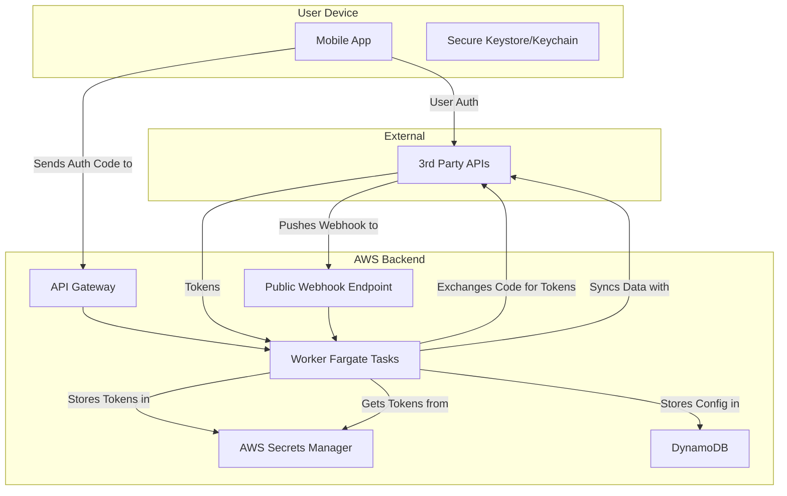

## Dependencies

### Core Dependencies
- `../prd/01-context-vision.md` - Context & Vision
- `../architecture/06-technical-architecture.md` - Technical Architecture, Security & Compliance
- `20-compliance-regulatory.md` - Legal & Regulatory Compliance

### Strategic / Indirect Dependencies
- `../architecture/07-apis-integration.md` - APIs & Integration Requirements
- `../ops/17-error-handling.md` - Error Handling, Logging & Monitoring
- `../ops/18-backup-recovery.md` - Backup & Disaster Recovery
- `../ux/36-user-privacy-settings.md` - User Privacy Controls & Settings

---

# PRD Section 19: Data Security & Privacy Policies

## 1. Executive Summary

This document specifies the comprehensive data security and privacy architecture for the SyncWell application. In the health data space, trust is the foundation of the product. This document codifies our commitment to protecting user data through a "privacy-first" design philosophy and a robust, multi-layered security strategy.

This internal specification is a blueprint for the **engineering team** to implement state-of-the-art security measures. It is the technical foundation for the public-facing Privacy Policy.

## 2. Guiding Principles

*   **Data Minimization:** We only request and handle data that is absolutely essential.
*   **Privacy by Design:** The system is architected from the ground up to protect user data.
*   **Ephemeral Backend Processing:** This is our core privacy promise. SyncWell's backend services do not persist raw user health data. As detailed later in this document, the only user-related data stored is a temporary, time-limited mapping of `userId` to a `correlationId` in the `SyncWellBreakGlassIndex` for debugging. Health data itself is only ever held in-memory on our backend servers during an active sync job and is immediately discarded.
*   **Radical Transparency:** We are open and honest with users about what data we handle and why.

## 3. Threat Modeling & Countermeasures

| Threat Scenario | Description | Countermeasure(s) |
| :--- | :--- | :--- |
| **Backend Server Compromise** | An attacker gains access to the backend infrastructure. | - **Strict IAM Roles & Least Privilege:** All compute services (Fargate tasks) have narrowly scoped IAM task roles that grant access only to the specific resources they need.  - **AWS Secrets Manager:** User OAuth tokens are stored encrypted in a dedicated, secure service.  - **VPC & Security Groups:** Backend services run in a private VPC and are isolated from the public internet.  - **Regular Audits & Pen Testing:** Proactively identify and fix vulnerabilities. |
| **Compromised Device** | A malicious actor gains root/jailbreak access to the user's device. | - **Keychain/Keystore:** This is the primary countermeasure for protecting on-device secrets, as it utilizes hardware-backed secure storage.  - **Jailbreak/Root Detection (Defense-in-Depth):** The app will make a best effort to detect if it is running on a compromised OS. If a compromised OS is detected, the app **will display a persistent warning** to the user and **log the event** to the backend for monitoring. It will not block functionality, acknowledging the risk of false positives. |
| **Man-in-the-Middle (MitM) Attack** | An attacker intercepts traffic between the app and the backend. | - **TLS 1.2+:** All network traffic is encrypted. This is the primary and sufficient countermeasure for the MVP.  - **(Future) Dynamic Certificate Pinning:** While providing an additional layer of security, dynamic certificate pinning adds significant operational complexity and risk (e.g., "bricking" older app versions). This feature is **deferred for the MVP** and will be re-assessed for a future release when the product's risk profile justifies the added complexity. |
| **Insecure Data Storage** | Sensitive data is stored insecurely. | - **Backend:** All user tokens are stored encrypted in AWS Secrets Manager.  - **On-Device:** The local settings database is encrypted. |
| **Vulnerable Container Image (Supply Chain Attack)** | The base container image for a Fargate task, or a dependency within it, has a known OS or library vulnerability (CVE). | - **Automated Image Scanning:** The CI/CD pipeline **must** be configured to scan every container image for known vulnerabilities using a tool like **Amazon ECR Scanning** or a third-party tool (e.g., Snyk, Trivy). The pipeline **must** fail the build if a new critical or high-severity vulnerability is detected.  - **Minimal Base Images:** Use minimal, vetted base images (e.g., "distroless" or Alpine) to reduce the attack surface.  - **Regular Rebuilds:** The CI/CD pipeline will be scheduled to automatically rebuild and redeploy application images weekly to ensure OS patches are incorporated. |
| **Vulnerable Third-Party Dependency (Supply Chain Attack)** | A library used by the app or backend has a known security vulnerability, or a build tool/dependency is compromised. | - **Automated Dependency Scanning:** The CI/CD pipeline **must** be configured to use Snyk/Dependabot to scan for known CVEs. The pipeline **must** be configured to fail the build if a new critical or high-severity vulnerability is detected, preventing vulnerable code from being deployed.  - **Dependency Pinning:** All dependencies will be pinned to specific, audited versions.  - **Reproducible Builds:** Build environments will be scripted and version-controlled to detect unauthorized changes. |
| **Webhook Endpoint Abuse** | The public-facing webhook ingestion endpoint is targeted by attackers. | - **Signature Validation:** All incoming webhooks **must** be validated using the provider's signature mechanism (e.g., checking an `X-Hub-Signature` header). This is the primary defense against spoofed or unauthorized payloads.  - **Strict Input Validation:** The body of every incoming webhook payload **must** be validated against a strict schema. Any data that does not conform to the expected format will be rejected immediately.  - **AWS WAF Protection:** The endpoint will be protected by **AWS WAF** with rules for rate limiting, IP blacklisting, and filtering common web exploits (e.g., SQL injection, XSS), providing defense-in-depth. |
| **AI Service Data Poisoning or Leakage** | The future AI Insights Service is attacked, either by "poisoning" the training data to produce incorrect results, or by an attacker crafting inputs to extract information about the model or other users' data. | - **Ephemeral Processing:** The AI service will process data ephemerally, just like the core sync engine.  - **Input Sanitization:** All inputs to the AI service will be strictly sanitized and validated.  - **Model Monitoring:** The outputs of the AI models will be monitored for anomalous results or statistical drift.  - **Data Provenance:** The training data for any future ML models will come from trusted, audited sources. |

## 4. Data Flow & Classification

*   **Class 1: Health Data (In-Memory, Ephemeral):** The user's actual health data (steps, etc.).
    *   **Flow:** Read from a source API -> Processed in-memory on a backend worker task OR on-device -> Written to a destination API.
    *   **Storage:** **NEVER** stored at rest on SyncWell servers. It is discarded from memory immediately after the job completes.
*   **Class 2: Sensitive Credentials (OAuth Tokens):**
    *   **Flow:** Acquired via a secure hybrid flow, where the mobile app gets an auth code and the backend exchanges it for tokens.
    *   **Storage:** Stored encrypted at rest in **AWS Secrets Manager**, tightly controlled by IAM policies.
*   **Class 3: Configuration & Metadata:** User sync settings and job metadata.
    *   **Flow:** Settings are created by the user and sent to the backend.
    *   **Storage:** Stored in DynamoDB. Does not contain any raw health data.

### Data Security Flow Diagram

The following workflow describes the secure process of acquiring and using credentials for a third-party service:
1.  The user initiates the authentication flow from the **Mobile App**, which directs them to the third-party service's login page.
2.  After successful authentication, the third-party service redirects back to the app with a short-lived authorization code.
3.  The Mobile App sends this authorization code to the SyncWell backend via the secure **API Gateway**.
4.  A **Worker Fargate Task** receives the code.
5.  The Worker Fargate Task makes a backend call to the third-party service's API, exchanging the authorization code for a long-lived refresh token and a short-lived access token.
6.  These tokens are immediately stored securely in **AWS Secrets Manager**, encrypted at rest. The `CredentialArn` is stored in DynamoDB.
7.  For subsequent sync jobs, the Worker Fargate Task retrieves the required tokens from Secrets Manager using its IAM role to communicate with the **3rd Party APIs** on the user's behalf.

## 5. Credential Lifecycle Management

The lifecycle of user credentials is managed by the backend to maximize security.

*   **Creation:** Tokens are acquired via the secure hybrid OAuth 2.0 flow detailed in `../architecture/07-apis-integration.md`.
*   **Storage:** Tokens are stored encrypted in **AWS Secrets Manager**.
*   **Usage:** Worker Fargate Tasks are granted temporary, role-based access via their IAM Task Role to retrieve the tokens they need for a specific job.
*   **Re-authentication:** When a connection is marked as `needs_reauth` (e.g., after a 401 error), the mobile client will prompt the user to reconnect. To initiate this flow, the client will call a dedicated API endpoint to get a new provider authorization URL.
    *   **API Endpoint:** `POST /v1/connections/{connectionId}/reauth`
    *   **Response:** A `200 OK` with the new `authorizationUrl` in the response body.
*   **Deletion:** When a user de-authorizes an app via the mobile client:
    1.  The mobile app sends a "revoke" request to the SyncWell backend.
    2.  The backend retrieves the token from Secrets Manager.
    3.  The backend calls the service provider's `revoke` endpoint to invalidate the token.
    4.  The backend permanently deletes the token from Secrets Manager.

## 6. Backend and API Security

The backend is a core component and must be secured accordingly.

*   **Authentication:** Communication between the mobile app and our backend API Gateway will be authenticated using short-lived JSON Web Tokens (JWTs) issued by the user's identity provider (Apple/Google).
*   **Webhook Endpoint Security:** The public-facing webhook ingestion endpoint is a critical entry point that must be secured. As detailed in the Threat Model, all incoming webhooks **must** be authenticated by validating their signature, and the endpoint will be protected by AWS WAF for rate limiting and filtering of malicious traffic.
*   **Secure JWT Validation:** The Lambda Authorizer is a security-critical component. To avoid common pitfalls in security implementation ("don't roll your own crypto"), the authorizer **must** use a well-vetted, open-source library for JWT validation. A library like **AWS Lambda Powertools** will be used to handle the complexities of fetching the JWKS, validating the signature, and checking standard claims (`iss`, `aud`, `exp`).
*   **API Rate Limiting:** All public-facing API endpoints, including the API Gateway and the Webhook endpoint, **must** have robust rate limiting configured to prevent abuse (e.g., credential stuffing, denial-of-service attacks). This will be implemented using AWS WAF, providing a centralized point of control for defining and applying rate-based rules.
*   **Authorization:** All backend compute services (including the API Gateway Authorizer and the Fargate tasks) will use strict IAM roles, adhering to the principle of least privilege. A Fargate task definition for a Fitbit worker should not have an IAM task role that grants access to Garmin tokens.
*   **Authorizer Policy Caching:** The architecture uses API Gateway's built-in authorizer caching to improve performance. From a security perspective, the Time-to-Live (TTL) of this cache represents a window during which a user's permissions might be stale. For example, if a user's access is revoked, they may retain access until the cached policy expires. The TTL will be set to a short duration (e.g., 5 minutes) as a balance between performance and security responsiveness.
*   **Network Security:** The entire backend compute layer runs within a private Virtual Private Cloud (VPC), providing strong network isolation.
    *   **Ingress:** The only points of entry are the API Gateway (for user-initiated requests) and the Application Load Balancer (for provider webhooks), both of which are protected by AWS WAF. There is no direct public internet access to the Fargate tasks.
    *   **Internal Traffic:** To ensure traffic between our Fargate tasks and other AWS services (like DynamoDB, SQS, and Secrets Manager) does not traverse the public internet, we use **VPC Gateway Endpoints**. This creates a private, secure connection to these services from within our VPC.
    *   **Egress:** To control outbound traffic from the VPC to third-party APIs, a **hybrid firewall model** will be implemented, as defined in `../architecture/06-technical-architecture.md`. This balances cost and security by using separate egress paths depending on the destination's trust level and traffic volume.
        *   **High-Security Path (AWS Network Firewall):** All outbound traffic to unknown, lower-volume, or security-sensitive endpoints is routed through an **AWS Network Firewall**. This provides advanced features like intrusion prevention and deep packet inspection, ensuring the highest level of security.
        *   **Cost-Optimized Path (AWS NAT Gateway):** High-volume, trusted traffic to the primary, well-known API endpoints of major partners (e.g., Fitbit, Strava, Garmin) is routed through a separate, standard **AWS NAT Gateway**. This path is secured via VPC route tables and network ACLs.
    *   **Justification:** This hybrid approach enforces the principle of least privilege at the network layer and provides a critical defense-in-depth measure against data exfiltration. It provides significant cost savings by routing the bulk of the data through the cheaper NAT Gateway, while preserving the advanced security features of the Network Firewall for traffic that requires it. This is a pragmatic trade-off between cost and risk.
*   **Logging & Monitoring:** All API calls and backend activity will be logged and monitored for anomalous behavior using services like AWS CloudTrail and CloudWatch. All logs will be scrubbed of sensitive data before being persisted.

*   **Security of Critical Operational Scripts:** Certain operational procedures, like the manual account recovery described in `../ops/18-backup-recovery.md`, require powerful, privileged scripts. These scripts represent a significant security risk if not properly controlled.
    *   **Storage and Access Control:** All such critical operational scripts **must** be stored in a dedicated, private Git repository with strict branch protection rules.
    *   **Execution Permissions:** The ability to execute these scripts (e.g., via an IAM role that the script assumes) **must** be granted only to a small, named group of senior engineers. Access will be managed via an AWS SSO permission set that requires re-authentication with MFA for every session.
    *   **Peer Review:** As with the "break-glass" procedure, any execution of a critical script **must** be triggered by a pull request that is peer-reviewed and approved by at least one other authorized engineer. The PR must contain the exact command and parameters to be run.

### 6.1. Secure Logging Practices

To comply with privacy regulations like GDPR and to protect user anonymity, our logging strategy will adhere to the following principles:

*   **No Persistent User Identifiers:** We will **not** log the permanent `userId` in any backend service. Logging unique identifiers that can be tied to a specific person is a violation of our privacy promise and can be a legal liability.
*   **Use of Correlation IDs:** For debugging and tracing purposes, each request will be assigned a temporary, randomly generated `correlationId`. This ID can be used to trace a single request's journey through our backend systems. Any other temporary IDs used for a specific process (e.g., a `jobId` which may be the client-provided `Idempotency-Key`) should be logged alongside the `correlationId` to ensure a unified trace. The `userId` itself must never be logged.
*   **Strict PII Scrubbing:** All logging libraries and services will be configured with strict scrubbing rules to remove any potential PII (names,emails, locations, etc.) that might accidentally be captured in error messages or stack traces.

#### 6.1.1. "Break-Glass" Procedure for User-Specific Debugging

While `userId` is never logged by default, a critical operational gap exists for debugging specific user-reported issues. To address this for the MVP, a secure, manual, and fully-audited "break-glass" procedure will be used. Building a fully-featured internal tool is deferred as a post-launch enhancement.

*   **Security Requirements:** This procedure, despite being manual, must adhere to strict security controls.
    *   **Authentication:** The engineer running the procedure must authenticate to AWS via SSO with mandatory MFA.
    *   **Peer Review:** The script to be run and the parameters to be used (`userId`, `ticketId`) must be submitted as a pull request and receive approval from a second authorized engineer (the "Four-Eyes" principle).
    *   **Immutable Auditing:** All actions performed via the AWS console or CLI are logged by default in AWS CloudTrail. This provides a permanent, immutable audit log of who ran what, and when.

*   **MVP Workflow:**
    1.  **Request:** An authorized support engineer, working on a specific support ticket (e.g., `TICKET-123`), identifies the need to debug for a specific `userId`.
    2.  **Approval:** The engineer creates a pull request containing the script to be run (e.g., a simple AWS CLI command to query a purpose-built lookup index) and the `userId` as a parameter. To ensure a timely review for a critical support issue, the requestor **must** notify the secondary on-call engineer via a direct PagerDuty alert or by posting the request in a dedicated, monitored Slack channel (`#break-glass-requests`). A second authorized engineer reviews the PR, verifies the legitimacy of the support ticket, and approves the PR.
    3.  **Execution:** Once approved, the engineer executes the peer-reviewed script from their local machine using their MFA-authenticated AWS credentials. The script performs a temporary lookup to find recent `correlationId`s associated with that `userId`.
    4.  **Debugging:** The engineer uses the retrieved `correlationId`s to find the relevant logs in CloudWatch to diagnose the issue. The mapping between `userId` and `correlationId` is not stored permanently; it is only available for a short time in the secure lookup index as described below.
*   **Future Enhancement:** The manual, PR-based workflow is recognized as having significant operational friction that could unacceptably slow down support response times during a live incident. While a necessary trade-off for the MVP, replacing this process with a dedicated internal web tool that automates the approval and lookup workflow is a high-priority follow-up item for the first quarter post-launch. The core security principles (MFA, peer approval, auditing) will remain the same in the automated tool.

#### 6.1.2. Break-Glass Lookup Index Design

The "purpose-built lookup index" is a critical component of the break-glass procedure. It will be implemented as a dedicated, highly secure DynamoDB table with the following characteristics:

*   **Table Name:** `SyncWellBreakGlassIndex`
*   **Primary Key:**
    *   **Partition Key (PK):** `USER#{userId}`
    *   **Sort Key (SK):** `TIMESTAMP#{timestamp}`
*   **Attributes:**
    *   `correlationId`: The correlation ID for a specific request.
    *   `ttl`: An epoch timestamp for automatic deletion.
*   **Time-to-Live (TTL):** The `ttl` attribute will be enabled on this table. All items written to this table **must** have a TTL of **72 hours**. This duration is a pragmatic compromise between the principle of data minimization and the practical needs of a support team that may need to investigate issues over a weekend. It ensures that the mapping between a user's permanent ID and their temporary correlation IDs is automatically and permanently deleted after a reasonable period.
*   **Population:** The **Lambda Authorizer** at the API Gateway entrypoint will be the only component responsible for writing to this table. Upon successfully validating a user's JWT, it will write a new item containing the `userId` and the newly generated `correlationId` for that request. (Note: Using Lambda for the authorizer is still the recommended and most efficient pattern, even with a Fargate backend).
*   **Security:** Access to this table will be the most stringently controlled in the entire system. Access is restricted via IAM policies: only the **Lambda Authorizer's** execution role has write permissions, and read permissions are granted only to a specific IAM role assumable by authorized engineers. As an additional defense-in-depth measure, the table **should be encrypted with a customer-managed KMS key**, which provides a separate layer of access control and a detailed audit trail of key usage.

## 7. Pre-Launch Security Audit Checklist

### Data Storage & Cryptography
*   [ ] User OAuth tokens are stored encrypted in AWS Secrets Manager.
*   [ ] The on-device database is encrypted.
*   [ ] No sensitive data (tokens, health data) is written to application or backend logs.

### Network Communication
*   [ ] All network traffic uses TLS 1.2+.
*   [ ] Backend services are properly isolated in a VPC.
*   [ ] Certificate Pinning is confirmed as deferred for MVP to manage operational risk.

### Authentication & Authorization
*   [ ] Mobile-to-backend communication is authenticated (e.g., via JWTs).
*   [ ] IAM roles follow the principle of least privilege.
*   [ ] The de-authorization process is robust and deletes tokens from the backend.

### Code Quality & Build Settings
*   [ ] The app is obfuscated in production builds.
*   [ ] All third-party dependencies (mobile and backend) have been scanned for known vulnerabilities.

## 8. Data Portability and Deletion

To comply with privacy regulations such as GDPR, the system must provide users with the ability to export their data and to permanently delete their account and all associated information. These flows are critical for user trust and legal compliance.

### 8.1. User Data Export

Users will be able to request an export of all their configuration data stored by SyncWell.

*   **Workflow:**
    1.  A user initiates a data export from the app settings, which requires re-authentication.
    2.  The app sends a request to a dedicated backend API endpoint.
    3.  An asynchronous job is sent to a dedicated SQS queue for data exports. A specialized **Fargate task** processes jobs from this queue to prepare the export file and save it to a secure S3 bucket.
    4.  Once the export is ready, the user is sent a push notification.
    5.  Crucially, the notification **does not contain the download link**. It instructs the user to return to the app.
    6.  Within the app, the user can now access the secure, pre-signed S3 URL to download their data. This additional step of requiring the user to be authenticated in the app to get the link prevents an attacker from gaining access to the data export via a compromised email or notification channel.
*   **S3 Bucket Security:** The S3 bucket used to temporarily store data exports **must** be configured with the following security settings:
    *   **Block Public Access:** All "Block Public Access" settings must be enabled at the bucket level.
    *   **Default Encryption:** Server-side encryption with AWS-managed keys (SSE-S3) must be enabled by default.
    *   **Restrictive Lifecycle Policy:** A lifecycle policy must be configured to permanently delete objects after a short period (e.g., 3 days) to ensure exported data is not retained indefinitely.
    *   **Least Privilege Bucket Policy:** The bucket policy must be configured to only allow `s3:PutObject` from the **Data Export Fargate task's** IAM role and `s3:GetObject` from pre-signed URLs.

### 8.2. Account Deletion ("Right to be Forgotten")

Users will have a clear and irreversible option to delete their account. This process must be comprehensive and robust against partial failures, ensuring all user-related metadata and credentials are purged from our systems.

*   **Workflow:**
    1.  A user confirms their intent to delete their account from the app settings. This is a high-friction action requiring re-authentication.
    2.  The app sends a request to a dedicated `DELETE /v1/users/me` endpoint. The backend immediately returns a `202 Accepted` response and queues an asynchronous deletion job.
    3.  A specialized **Account Deletion Fargate task** is triggered with the user's validated `userId`.
    4.  **Mark for Deletion:** The first step is to update the user's `PROFILE` item in DynamoDB, setting a `status` attribute to `DELETING`. This makes the process idempotent and prevents other operations from occurring on the account during deletion.
    5.  **Revoke and Delete Credentials:** The function then proceeds with the "scorched earth" policy. It iterates through all `CONN#{connectionId}` items, revokes the tokens with the third-party providers, and deletes the secrets from Secrets Manager. This process should be idempotent, gracefully handling already-revoked tokens.
    6.  **Delete DynamoDB Data:** After all credentials have been successfully revoked, the function deletes all items from the `SyncWellMetadata` table with the partition key `USER#{userId}`.
    7.  Once the process is complete, any active sessions for the user are invalidated.

*   **Data in Backups:** User data will remain in DynamoDB backups (e.g., PITR) for their retention period (e.g., 35 days). This is an accepted practice under GDPR, provided the data is not used for any purpose and is overwritten in due course. This will be clearly stated in our public privacy policy.

### 8.3. Manual Account Recovery

As detailed in the risk advisory in `18-backup-recovery.md`, a manual process for migrating user data between identity providers is exceptionally high-risk and prone to social engineering.

*   **MVP Policy: Not Supported.** For the MVP, manual account recovery is **not supported**. If a user loses access to their primary authentication method (e.g., their Google account), they will lose access to their SyncWell data. This is a deliberate product decision to eliminate the significant security risks associated with manual, script-based data migration.
