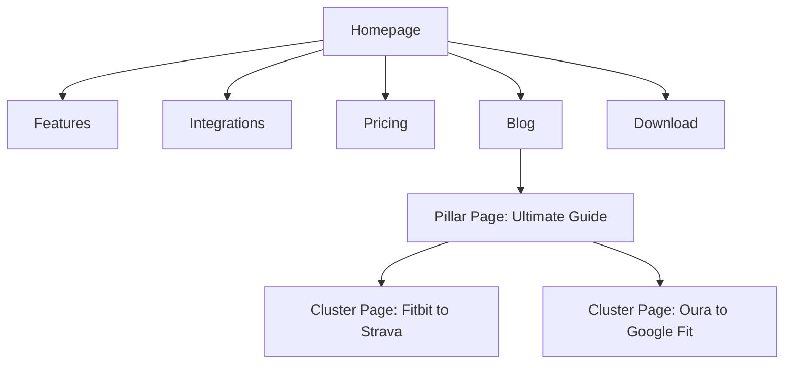

## Dependencies

### Core Dependencies
- `01-context-vision.md` - Context & Vision
- `03-competitive-analysis.md` - Competitive Analysis & Differentiation
- `57-app-analytics.md` - App Analytics (Deep Dive)

### Strategic / Indirect Dependencies
- `60-brand-assets.md` - Brand Assets & Identity Guidelines
- `54-social-sharing.md` - Social Sharing (Deep Dive)

---

# PRD Section 58: Marketing & SEO Strategy (Deep Dive)

## 1. Introduction
This document provides a granular, actionable marketing and SEO strategy for SyncWell. It covers our target audience, messaging, and the specific tactics we will employ across organic and paid channels to drive user acquisition and growth. This process is owned by the **Head of Marketing**.

## 2. Go-to-Market Strategy

### 2.1. Target Personas
-   **"The Quantified Selfer":** Tech-savvy, data-obsessed user who owns multiple devices (e.g., a Wahoo bike computer, Oura ring, smart scale) and wants to aggregate all their data in one place for analysis.
-   **"The Casual Athlete":** Uses a primary device for workouts (e.g., Apple Watch for running) but wants to sync that data to a social fitness app (e.g., Strava) to share with friends.
-   **"The Health-Conscious Professional":** Uses a wellness tracker (e.g., Fitbit) for daily activity but their corporate wellness program uses a different platform. Needs a simple way to sync the data.

### 2.2. Value Proposition & Messaging
-   **Core Value Proposition:** Your health data, in one place, automatically.
-   **Key Messages:**
    -   *For Quantified Selfer:* "Stop juggling apps. See your complete health picture."
    -   *For Casual Athlete:* "Sync your workouts effortlessly. Get credit on every platform."
    -   *For Professional:* "Connect any device to any wellness program."

## 3. Organic Acquisition: SEO & Content

### 3.1. ASO Keyword Strategy - Deep Dive
-   **Keyword Research:** We will use tools like AppTweak to identify high-intent, low-competition keywords.
-   **Keyword Clusters:** We will target clusters of keywords for each integration.
    -   *Example Cluster (Fitbit):* "sync fitbit to apple health", "fitbit samsung health sync", "fitbit to strava".
-   **Localization:** App Store metadata (title, keywords, description) will be localized for our top 5 target geos to improve ranking in those regions.

### 3.2. Content Marketing - Topic Clusters
-   **Pillar Page:** A comprehensive guide titled "The Ultimate Guide to Syncing Your Health Data in 2025". This page will link to all cluster pages.
-   **Cluster Pages:** A dedicated, SEO-optimized landing page for every possible sync combination (e.g., "How to Sync Oura to Google Fit"). Each page will contain a step-by-step guide and a clear CTA to download SyncWell.
-   **Content Calendar:** We will produce two new high-value blog posts per month on related topics (e.g., "The Best Smart Scales of 2025," "Analyzing Your HRV Data").

### 3.3. Public Relations & Outreach Strategy
-   **Target List:** We will build a media list of 50 key tech journalists, fitness tech reviewers, and YouTube creators.
-   **Pitch:** We will offer them free lifetime access to SyncWell Premium for their review.
-   **Goal:** Secure at least 5 high-quality reviews or mentions in the first 3 months post-launch.

### 3.4. Social Media Strategy
-   **Primary Platform:** Twitter. We will engage with the #quantifiedself, #healthtech, and #fitness communities, and share product updates and content.
-   **Secondary Platform:** Reddit. We will monitor and participate in relevant subreddits like r/Fitbit, r/OuraRing, and r/AppleWatch, offering helpful advice (not spammy links).

## 4. Paid Acquisition (Post-Launch)

### 4.1. Paid Acquisition Channel Analysis
-   **Apple Search Ads:** High-intent channel. We will bid on competitor brand names and long-tail keywords directly within the App Store search.
-   **Google App Campaigns:** Broader reach. Good for driving volume but requires careful monitoring of CPI and conversion rates.
-   **Social Media Ads (Facebook/Instagram):** Best for targeting users by interest (e.g., users who follow Fitbit and Strava). Will require more creative assets (video, images).
-   **Initial Focus:** Apple Search Ads, as it typically has the highest intent and ROI.

### 4.2. Measuring Marketing Effectiveness
-   **ASO:** Track keyword rankings, App Store impressions, and impression-to-install conversion rate.
-   **Content/SEO:** Track organic search traffic to the website, bounce rate, and website-to-app-store click-through rate.
-   **Paid:** Track Cost Per Install (CPI), Cost Per Trial, and ultimately, Customer Acquisition Cost (CAC) for each channel.

## 5. Marketing Assets

### 5.1. Marketing Website - Sitemap

### 5.2. Competitive Landscape - Marketing Analysis
| Competitor | Strengths | Weaknesses | Our Opportunity |
| :--- | :--- | :--- | :--- |
| Health Sync | Strong brand recognition on Android. | Website is dated; no strong content marketing. | Outrank them on SEO for key terms with better content. |
| RunGap | Good for runners, many integrations. | iOS only; complex UI. | Offer a simpler, cross-platform solution. |

## 6. Analysis & Calculations
### 6.1. Customer Acquisition Cost (CAC) and Lifetime Value (LTV)
-   **Hypothesis:** For the business to be sustainable, the Lifetime Value (LTV) of a customer must be significantly greater than the Customer Acquisition Cost (CAC). A common target is an LTV:CAC ratio of 3:1 or higher.
-   **Definitions:**
    -   **CAC:** The total cost to acquire a new paying customer.
    -   **LTV:** The total net revenue a customer generates before they churn.
-   **LTV Calculation:**
    -   *Assumptions:*
        -   Net Monthly Revenue per User (after platform fees): $4.25 (from `50-payment-gateway-integration.md`)
        -   Monthly Churn Rate: 5% (from `49-subscription-management.md`)
    -   *Customer Lifetime* = 1 / Monthly Churn Rate = 1 / 0.05 = 20 months.
    -   *LTV* = Net Monthly Revenue per User * Customer Lifetime = $4.25 * 20 = **$85**.
-   **Target CAC Calculation:**
    -   To achieve a 3:1 LTV:CAC ratio, our target CAC should be:
    -   *Target CAC* = LTV / 3 = $85 / 3 ≈ **$28.33**.
-   **Conclusion:** This calculation is critical for our paid acquisition strategy. We must ensure that the Cost Per Install (CPI) and subsequent conversion rates result in a final CAC of under $28 for each new subscriber. Any paid channel that exceeds this CAC will be considered unprofitable and will be discontinued.

### 6.2. SEO Keyword Analysis
-   **Hypothesis:** Targeting long-tail keywords will be more effective than broad keywords for attracting high-intent users.
-   **Example Analysis:**
    -   **Broad Keyword:** "health app"
        -   *Volume:* Very High
        -   *Competition:* Very High
        -   *User Intent:* Low (User could be looking for anything)
    -   **Long-Tail Keyword:** "sync fitbit to apple health"
        -   *Volume:* Low to Medium
        -   *Competition:* Low to Medium
        -   *User Intent:* Extremely High (User has a specific problem that our app solves)
-   **Strategy:** Our content marketing will focus exclusively on creating high-quality landing pages for hundreds of these long-tail keyword variations. While each page may only bring in a small amount of traffic, the aggregate traffic will be substantial, and the visitors will be highly likely to convert because we are directly addressing their stated need.

## 7. Out of Scope
-   A large-scale brand marketing campaign (e.g., TV, billboards).
-   A dedicated community forum (V1 will use social media).
