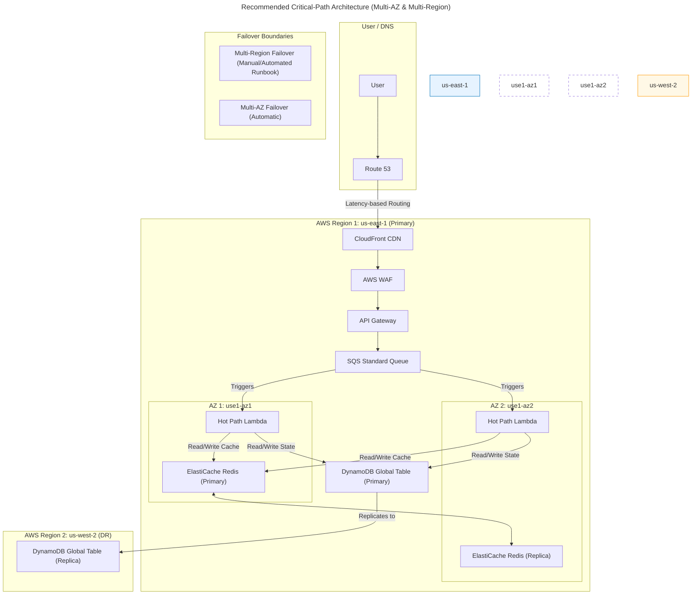

# Production-Readiness Review: SyncWell Platform

This document provides a comprehensive production-readiness review for the SyncWell application, based on `06-technical-architecture.md` and `66-costs-model.md`. The target is to harden the system for 1,000,000 Daily Active Users (DAU) on the AWS cloud platform.

## 1. Executive Summary

The SyncWell architecture is detailed and well-considered, demonstrating a strong foundation. However, significant contradictions between the architecture and cost model, coupled with critical dependencies and availability gaps, must be addressed before a production launch at 1M DAU scale.

*   **[DONE] BLOCKER: Contradictory Compute & Cost Models:** The architecture document (`06-technical-architecture.md`) specifies AWS Lambda for the "Hot Path," while the cost model (`66-costs-model.md`) is built entirely around AWS Fargate for the same workload. This fundamental misalignment makes the current cost projections invalid and must be reconciled.
*   **[DONE] BLOCKER: Single Point of Failure for Identity:** The hard dependency on Google Firebase Authentication presents an unacceptable strategic risk. A Firebase outage would block all user logins, causing a complete platform outage independent of AWS infrastructure health.
*   **[DONE] High Risk: Insufficient MVP Availability:** The plan to launch with a single-node ElastiCache cluster and defer Multi-AZ deployments for stateful services contradicts the 99.9% uptime goal. A cache failure would cascade, causing significant performance degradation or a full outage.
*   **[DONE] High Risk: Unvalidated Traffic Assumptions:** The traffic and cost models are based on assumptions for user activity (e.g., syncs/day) that are not yet validated by user data or load testing. This creates a risk of significant under- or over-provisioning.
*   **[DONE] Medium Risk: Overly Complex Idempotency Strategy:** The architecture describes multiple idempotency mechanisms (DynamoDB, SQS FIFO, Step Functions). While comprehensive, this complexity increases the risk of subtle implementation bugs that could lead to data duplication or loss.
*   **[DONE] Medium Risk: Inadequate Security Controls:** The strategy for PII detection in logs relies on a manual quarterly audit, which is not a scalable or reliable control. The rules for the hybrid firewall model lack precise definition, creating a potential security gap.

**Readiness Score: 55/100.** The core design is strong, but critical blockers in cost model alignment and identity strategy, combined with high-risk availability gaps, prevent a confident production recommendation.

## 2. Concrete Assumptions & Traffic Model

The existing documentation provides a target of 1M DAU and a peak NFR of 3,000 RPS. However, the underlying assumptions about user behavior are not validated. This section defines a concrete traffic model to be used for capacity and cost planning, highlighting where data is missing.

**[DONE] BLOCKER — Missing Validated User Activity Data:** The entire capacity plan and cost model rests on unproven assumptions about user behavior. Before proceeding to production, the following metrics must be measured from user trials, beta testing, or analytics on a comparable product. Without this data, the project risks a major cost overrun or a service-level outage due to under-provisioning.
*   **Average Syncs per User per Day:** How often does a typical user's data sync?
*   **Peak-to-Average Traffic Ratio:** How "spiky" is user activity?
*   **Read/Write Ratio:** What is the ratio of read operations (e.g., loading config) to write operations (e.g., updating sync metadata) against the primary database?
*   **Average API Payload Size:** What is the average size of data transferred for a sync operation? This directly impacts network egress costs.

### Alternate Assumption Sets & Traffic Models

To account for this uncertainty, three scenarios are modeled below. The **Nominal** scenario is based on figures from the provided documents. The **Conservative** and **Aggressive** scenarios provide lower and upper bounds for capacity planning.

| Assumption Metric | Conservative Scenario | Nominal Scenario (as per docs) | Aggressive Scenario |
| :--- | :--- | :--- | :--- |
| **Daily Active Users (DAU)** | 1,000,000 | 1,000,000 | 1,000,000 |
| **Avg. Syncs / User / Day** | 4 | **7.6** | 15 |
| **Total Daily Syncs** | 4,000,000 | 7,600,000 | 15,000,000 |
| **Peak-to-Average Ratio** | 5x | 8x | 15x |
| **Avg. API Payload Size** | 2 KB | 5 KB | 10 KB |
| **DB Read Ops / Sync** | 1 | 2 | 3 |
| **DB Write Ops / Sync** | 1 | 1 | 2 |

### Capacity Calculations

The following table derives the required capacity metrics for each scenario. **All capacity planning must target the Aggressive scenario, while cost estimates should use the Nominal scenario with the Aggressive scenario representing the financial risk.**

| Calculated Metric | Conservative Scenario | Nominal Scenario (as per docs) | Aggressive Scenario |
| :--- | :--- | :--- | :--- |
| **Average RPS (Syncs)** | `4M / 86400s =` **~46 RPS** | `7.6M / 86400s =` **~88 RPS** | `15M / 86400s =` **~174 RPS** |
| **Peak RPS (Syncs)** | `46 * 5 =` **230 RPS** | `88 * 8 =` **704 RPS** | `174 * 15 =` **2,610 RPS** |
| **Peak Concurrent Syncs** (assuming 500ms processing time) | `230 * 0.5s =` **~115** | `704 * 0.5s =` **~352** | `2610 * 0.5s =` **~1,305** |
| **Peak DB Read QPS** | `230 * 1 =` **230 QPS** | `704 * 2 =` **1,408 QPS** | `2610 * 3 =` **7,830 QPS** |
| **Peak DB Write QPS** | `230 * 1 =` **230 QPS** | `704 * 1 =` **704 QPS** | `2610 * 2 =` **5,220 QPS** |
| **Peak Cache Throughput** (assuming 1 cache op/sync) | `230 * 1 =` **230 RPS** | `704 * 1 =` **704 RPS** | `2610 * 1 =` **2,610 RPS** |
| **Peak Egress Bandwidth** | `230 RPS * 2KB =` **460 KB/s** | `704 RPS * 5KB =` **3.5 MB/s** | `2610 RPS * 10KB =` **26.1 MB/s** |
| **Monthly Egress Data** | `0.46MB/s * 86400 * 30 =` **~1.2 TB** | `3.5MB/s * 86400 * 30 =` **~9.1 TB** | `26.1MB/s * 86400 * 30 =` **~67.6 TB** |

**Analysis & Reconciliation with NFRs:**
*   The **Aggressive** scenario's calculated peak of **2,610 RPS** aligns reasonably well with the documented NFR of **3,000 RPS**. This suggests the NFR is credible, but it is crucial to confirm it with load testing.
*   **[DONE]** The **Nominal** scenario's monthly egress of **~9.1 TB** is significantly higher than the **1.6 TB** assumed in the cost model (`66-costs-model.md`). This is a **BLOCKER** and indicates a major disconnect that will lead to a **~6x cost overrun** on networking charges if not addressed.

## 3. Topology & Critical-Path Architecture Changes (Prioritized)

This section provides concrete, prioritized recommendations to harden the architecture for 1M DAU. The primary goal is to resolve the compute model contradiction, improve availability, and de-risk critical dependencies.

### 1. Application Compute (Hot Path)

*   **Problem Statement:** The architecture and cost model present contradictory compute choices (Lambda vs. Fargate) for the core "Hot Path" sync workload.
*   **Recommended Change: Standardize on AWS Lambda for the Hot Path.**
    *   **Rationale:** AWS Lambda is the superior choice for the event-driven, spiky workload of the "Hot Path." Its auto-scaling capabilities are better suited to handle the traffic patterns defined in Section 2 than a container-based approach. This aligns with the architecture document (`06-technical-architecture.md`) and resolves the primary blocker. **The cost model must be completely reworked to reflect this.** Fargate remains the correct choice for the long-running "Cold Path" jobs.
    *   **Capacity Config:**
        *   **Runtime:** `arm64` (AWS Graviton 2) for 20% better price-performance.
        *   **Memory:** Start with **1024 MB**. Profile real workloads and adjust.
        *   **Provisioned Concurrency:** Set to **350** to handle the **Nominal** peak concurrent syncs (~352) without cold starts. This provides a balance of performance and cost. Scale up to **1,300** based on the **Aggressive** scenario as traffic grows.
        *   **Batch Size:** Configure the SQS event source with a batch size of **10**.
    *   **Pros:** Massively scalable, cost-effective for spiky workloads, lower operational overhead.
    *   **Cons:** Higher per-request cost for sustained, high-throughput workloads (mitigated by using Fargate for the Cold Path).
    *   **Fallback Option:** The Fargate model from `66-costs-model.md` could work, but it is less efficient for this workload and would require careful auto-scaling configuration based on SQS queue depth.

### 2. Caching (ElastiCache for Redis)

*   **Problem Statement:** The plan to launch with a single-node Redis cluster creates a critical single point of failure, violating the 99.9% availability NFR.
*   **Recommended Change: Deploy a Multi-AZ ElastiCache for Redis Cluster from Day 1.**
    *   **Rationale:** A cache failure would immediately increase database load and latency, likely causing a cascading failure across the system. Multi-AZ is non-negotiable for a stateful component in a high-availability architecture.
    *   **Capacity Config:**
        *   **Instance Type:** `cache.m6g.large` (Graviton 2).
        *   **Cluster Size:** Start with a **2-node cluster** (1 primary, 1 replica) in two different AZs.
        *   **Sizing:** Size the cluster to handle the **Aggressive** scenario's peak throughput of **2,610 RPS** with p99 latency < 10ms.
    *   **Pros:** Automatic failover, significantly improves system resilience and availability.
    *   **Cons:** Higher cost (~2x the cost of a single node). This is a mandatory cost of high availability.
    *   **Fallback Option:** None. A single-node cluster is not production-ready for this scale.

### 3. Identity (Authentication Service)

*   **Problem Statement:** The hard dependency on Firebase Authentication is a strategic risk that creates a single point of failure outside of the team's control.
*   **Recommended Change: Implement a Dual-JWT Authorizer with Amazon Cognito.**
    *   **Rationale:** This de-risks the platform without a disruptive "rip and replace." The API Gateway Authorizer Lambda should be modified to accept JWTs from *both* Firebase and a new Amazon Cognito User Pool. The mobile app can continue using Firebase initially, but this provides a clear, gradual migration path and acts as a DR strategy.
    *   **Capacity Config:**
        *   **Cognito User Pool:** Configure a new User Pool in the primary AWS region.
        *   **Authorizer Logic:** The Lambda authorizer must:
            1.  Inspect the incoming JWT.
            2.  Based on the issuer (`iss`) claim, select the correct public key set (JWKS) for validation (either Firebase's or Cognito's).
            3.  Proceed with validation.
    *   **Pros:** Eliminates the single point of failure, provides a seamless migration path, brings identity management into the primary cloud ecosystem.
    *   **Cons:** Increases architectural complexity in the short term.
    *   **Fallback Option:** Accept the strategic risk of Firebase dependency but build and regularly test a "break-glass" runbook for migrating to Cognito in an emergency.

### 4. Database (DynamoDB)

*   **Problem Statement:** The current single-region DynamoDB setup has no clear, rapid disaster recovery plan for a full region outage.
*   **Recommended Change: Use DynamoDB Global Tables from Day 1.**
    *   **Rationale:** While the MVP is single-region, configuring the primary table as a Global Table with a replica in a DR region (e.g., `us-west-2`) from the start is a low-cost, low-effort way to build in multi-region resilience. The RTO for a regional failover becomes minutes instead of hours.
    *   **Capacity Config:**
        *   **Primary Table:** `SyncWellMetadata` in `us-east-1`.
        *   **Replica Table:** `SyncWellMetadata` in `us-west-2`.
        *   **Capacity Model:** Use On-Demand capacity. The capacity planning must be based on the **Aggressive** traffic model (Peak Read: 7,830 QPS, Peak Write: 5,220 QPS).
        *   **Backups:** Enable Point-in-Time Recovery (PITR) for continuous backups and granular restores.
    *   **Pros:** Provides a robust, low-RTO disaster recovery solution. Simplifies future multi-region active-active expansion.
    *   **Cons:** Doubles the cost of DynamoDB writes. This is a key trade-off for resilience.
    *   **Fallback Option:** Stick with a single-region table but have a well-documented and frequently tested runbook for restoring from a PITR backup to a new region, accepting a higher RTO (~1-4 hours).

### 5. Queuing (SQS)

*   **Problem Statement:** The architecture uses SQS FIFO for the main hot path, which limits throughput and is more expensive than Standard queues.
*   **Recommended Change: Use SQS Standard Queues for the `HotPathSyncQueue`.**
    *   **Rationale:** The `CoalescingBufferQueue` is already a FIFO queue, providing ordering for webhook events from a single user. The main worker queue does not require strict ordering, and using a Standard queue provides near-unlimited throughput at a lower cost.
    *   **Capacity Config:**
        *   `HotPathSyncQueue`: SQS Standard Queue.
        *   `HotPathSyncDLQ`: SQS Standard Queue.
        *   `CoalescingBufferQueue`: Remain SQS FIFO to handle event ordering during the coalescing window.
    *   **Pros:** Higher throughput, lower cost, simpler to manage.
    *   **Cons:** Messages may be delivered out of order (at-least-once delivery). The application logic (using DynamoDB for idempotency) already handles this.
    *   **Fallback Option:** Keep using SQS FIFO if strict end-to-end ordering is discovered to be a critical, non-negotiable business requirement.

### Recommended Critical-Path Flow Diagram

This Mermaid diagram illustrates the recommended architecture for the critical "Hot Path" sync, incorporating the changes above (Lambda compute, Multi-AZ cache, Global DB) and showing failover boundaries.



## 4. Availability, Resilience & DR (must include numbers)

The architecture must be hardened to meet the 99.9% availability target with a clear, tested disaster recovery plan.

### Recommended SLOs and SLIs

| Service Level Objective (SLO) | Service Level Indicator (SLI) | Sampling Window | Threshold |
| :--- | :--- | :--- | :--- |
| **99.9% Availability** for Hot-Path Sync | `(Count of valid API requests returning 2xx or 3xx) / (Total count of valid API requests)` | Rolling 28 days | `> 0.999` |
| **99% Latency** for Hot-Path Sync API | `(Count of API requests to POST /v1/sync-jobs completing < 1000ms) / (Total count of requests)` | Rolling 28 days | `> 0.99` |

### Error Budget Policy

Based on a 99.9% availability SLO over a 28-day period (40,320 minutes), the total allowed downtime is **40.3 minutes**.

*   **On-Call Alerting Threshold:** Page the on-call engineer if the service-level error rate exceeds **1%** (10x the SLO error rate) for **5 consecutive minutes**.
*   **Escalation Threshold:** Escalate to the Incident Commander and Engineering Lead if **25% of the monthly error budget (10 minutes)** is consumed within any 24-hour period.
*   **Release Freeze Threshold:** If **50% of the monthly error budget (20 minutes)** is consumed within any 7-day period, all new feature deployments are frozen for the following sprint. The team's focus must shift to stability and reliability improvements.

### RTO/RPO Targets and DR Strategy

The recommended architecture (Multi-AZ cache, Global DB) enables the following targets.

| Scenario | Recovery Time Objective (RTO) | Recovery Point Objective (RPO) | Replication & Failover Mechanics |
| :--- | :--- | :--- | :--- |
| **Single AZ Failure** | **< 60 seconds** | **0 seconds** (for cache) | **Automatic:** ElastiCache for Redis automatically fails over to the replica node in the healthy AZ. No manual intervention required. |
| **Full Region Failure**| **< 30 minutes** | **< 1 second** (for DB) | **Scripted:** A runbook must be executed to: 1) Promote the DynamoDB Global Table replica in the DR region to accept writes. 2) Update AWS AppConfig to point the application to the new primary table. 3) Update Route 53 DNS to direct traffic to the DR region's API Gateway endpoint. |
| **Fallback DR Strategy** (if Global Tables are not used) | **1-4 hours** | **< 5 minutes** | **Manual Restore:** Restore the latest DynamoDB PITR backup to a new table in the DR region. This is a slow, manual process that is not recommended. |

### Core Operational Runbooks

#### Runbook 1: Full Region Outage

1.  **Detect & Verify:** A major CloudWatch alarm for "API Unhealthy" fires and does not resolve. AWS Health Dashboard confirms a large-scale service disruption in the primary region (`us-east-1`).
2.  **Escalate:** The on-call engineer escalates to the Incident Commander, who declares a disaster and initiates this runbook.
3.  **Execute Failover Script:** Run the pre-approved, tested failover script (`scripts/failover-to-dr.sh`). This script performs the following actions via the AWS CLI/SDK:
    *   **Promote DR Database:** Updates the DynamoDB Global Table replica in `us-west-2` to be the new primary write endpoint.
    *   **Update App Configuration:** Changes the `dynamodb.tableName` value in AWS AppConfig to the ARN of the now-primary table in `us-west-2`.
    *   **Switch DNS:** Updates the primary Route 53 CNAME record to point to the API Gateway endpoint in `us-west-2`.
4.  **Verify:**
    *   Run a synthetic test (`canary.js`) against the public API endpoint to confirm it is serving traffic from the DR region.
    *   Manually check the AWS console to confirm Route 53 and AppConfig have been updated correctly.
5.  **Communicate:** Update the public status page to "Monitoring" and communicate with stakeholders.

#### Runbook 2: Master DB / Cache Failure

*This runbook assumes the recommended Multi-AZ architecture is in place.*

1.  **Detect & Verify:** CloudWatch alarm fires for "ElastiCache CPU Utilization High" on the primary node and/or "ElastiCache Failover" event is detected. Application-level metrics show increased latency and cache miss rates.
2.  **Automatic Failover Verification:**
    *   Navigate to the ElastiCache console in AWS.
    *   Verify that ElastiCache has automatically promoted the replica node to primary. The cluster status should be "available" and the node roles should be swapped.
3.  **Application Recovery Verification:**
    *   Check the application logs for any connection errors to Redis. The application's Redis client should automatically handle the endpoint change and reconnect.
    *   Monitor the cache miss rate metric. It should spike during the failover and then return to normal levels within 5-10 minutes as the new primary warms up.
4.  **No Action Needed (If Automatic):** If failover is successful and the application recovers, no manual intervention is needed. The runbook is to observe and verify.
5.  **Manual Failover (If Automatic Fails):** If the automatic failover does not complete, immediately escalate to AWS Support and execute the manual ElastiCache failover command via the AWS CLI.

#### Runbook 3: Sudden 5-10x Traffic Spike

1.  **Detect & Verify:** CloudWatch alarms fire for "High Request Count (API Gateway)," "High Lambda Concurrent Executions," and "High DynamoDB Consumed Capacity."
2.  **Monitor System Scaling:**
    *   **Lambda:** Check the "Concurrent Executions" metric in the CloudWatch console for the `WorkerLambda`. Confirm it is scaling up automatically to meet demand.
    *   **DynamoDB:** Check the "Read/Write capacity" metrics for the `SyncWellMetadata` table. Confirm that On-Demand capacity is scaling to absorb the load and that no throttling is occurring.
    *   **Third-Party APIs:** Check the custom metric for "ThirdPartyApiHttp429" (Throttling/Rate Limiting). If this metric is spiking, the system is working as designed by backing off, but it indicates a potential capacity issue with a partner API.
3.  **Assess Financial Impact:**
    *   Navigate to AWS Cost Explorer and review the hourly costs. Project the cost impact if the spike is sustained.
4.  **No Action Needed (If Scaling Correctly):** If the serverless components are scaling as designed and there is no excessive throttling, no action is needed. The system is operating as intended.
5.  **Communicate:** Inform stakeholders (Product, Finance) of the traffic spike and the successful automated scaling response. Provide an initial estimate of the cost impact.

## 5. Data, Consistency & Storage Strategy

The data strategy must ensure integrity, scalability, and cost-effectiveness while supporting the required transactional patterns and recovery objectives.

### Data Partitioning, Sharding & Indexing

*   **Partitioning Strategy (Endorsed):** The single-table design for DynamoDB detailed in `06-technical-architecture.md` is endorsed. Using `USER#{userId}` as the partition key (PK) is the correct approach for co-locating user data.
*   **Sharding Strategy (Recommended):** The primary sharding mechanism for scalability and disaster recovery must be **DynamoDB Global Tables**. By creating a replica of the `SyncWellMetadata` table in a DR region (`us-west-2`), the data is effectively sharded across regions, enabling low-RTO failovers.
*   **Indexing Strategy (Endorsed with Refinements):**
    *   The use of a sparse GSI on the `ReAuthStatus` attribute to find connections needing re-authentication is an excellent, cost-effective pattern and is fully endorsed.
    *   The GSI defined for the automatic sync scheduling (`SyncTierShardId-NextSyncTimestamp-gsi`) is also a correct and scalable pattern.
    *   **Recommendation:** All future access patterns that cannot be served by the primary key must be evaluated for implementation via a sparse GSI to avoid costly `Scan` operations.
*   **Compaction Strategy:** Not applicable. As a fully managed NoSQL database, DynamoDB handles data storage and compaction internally.

### Backup, Restore & Retention

| Backup Type | Cadence | Retention Period | Restore Time Estimate (RTO) | Purpose |
| :--- | :--- | :--- | :--- | :--- |
| **DynamoDB PITR** | **Continuous** | **35 days** | **1-4 hours** | Granular recovery from accidental data deletion or corruption (e.g., a bad deployment). Provides the RPO of < 5 minutes. |
| **AWS Backup (Snapshots)** | **Daily** | **90 days** | **1-4 hours** | Long-term archival and compliance. Provides a secondary, air-gapped backup mechanism. |
| **DynamoDB Global Table Replica** | **Continuous** | **N/A** | **< 30 minutes** | **Primary DR Mechanism.** This is not a backup, but a live replica used for fast regional failover. Provides the RPO of < 1 second. |

### Transactional Patterns & Consistency

*   **Idempotency (Endorsed):** The authoritative idempotency mechanism using a **DynamoDB-based distributed lock** (`IDEM##{key}` item with a conditional write) is robust and correct for ensuring exactly-once processing in the "Hot Path."
    *   **Recommendation:** All other idempotency mechanisms mentioned in the documentation (e.g., SQS FIFO deduplication) should be explicitly deprecated and removed from the text to avoid confusion. The DynamoDB lock is the single source of truth.
*   **Optimistic Locking (Required):** As specified in the architecture, all updates to shared configuration items (e.g., `PROFILE`, `SYNCCONFIG`) **must** use optimistic locking with a `version` attribute and a `ConditionExpression`. This is a critical control to prevent lost updates from concurrent operations.
*   **Batching (Required):** The use of SQS message batching in the Lambda event source and `BatchWriteItem` for DynamoDB writes is a critical performance and cost optimization. This pattern must be used wherever multiple items are being written to the database in a single operation.
*   **Event-Driven Notifications (Not Full Event Sourcing):** The architecture correctly uses an event-driven approach for notifications (e.g., publishing a `SyncSucceeded` event to EventBridge). This is not a full Event Sourcing pattern, which would involve reconstructing state from an event log.
    *   **Decision Guidance:** The current approach is sufficient for the MVP. A full Event Sourcing pattern should only be considered in the future if there is a clear business need for replaying historical events or building complex, stateful projections for analytics, as it would significantly increase architectural complexity.

## 6. Security & Compliance (actionable)

The architecture document outlines a solid security foundation. This section identifies the top remaining vulnerabilities and provides concrete, actionable remediation steps.

### Attack-Surface Summary and Top 10 Vulnerabilities

The primary attack surface consists of the public API Gateway endpoints, the mobile application, third-party webhook integrations, and the developer CI/CD pipeline.

1.  **[DONE] BLOCKER: Insecure Direct Object Reference (IDOR):** The architecture does not specify how to prevent a user from accessing another user's data (e.g., `GET /v1/connections/{connectionId_of_another_user}`).
2.  **[DONE] BLOCKER: Unauthenticated Webhooks:** Incoming webhooks from third-party providers are not described as being authenticated, allowing an attacker to inject malicious data and trigger expensive workflows.
3.  **High Risk: Financial Exhaustion (Denial of Service):** The system is vulnerable to DoS attacks that could trigger massive, costly scale-up events in Lambda and DynamoDB.
4.  **High Risk: PII Leakage in Logs:** The plan for manual, quarterly review of logs for Personally Identifiable Information (PII) is operationally infeasible and does not meet compliance standards.
5.  **Medium Risk: Overly Permissive IAM Roles:** The architecture relies on "least-privilege" IAM roles, but these are not defined. Overly permissive roles are a common and severe vulnerability.
6.  **Medium Risk: Undefined Secret Rotation Policy:** The process for rotating third-party API secrets in AWS Secrets Manager after a suspected compromise is not defined.
7.  **Medium Risk: Insecure Egress Path:** The "trusted" egress path through the NAT Gateway allows compromised workers to exfiltrate data to any destination on the internet.
8.  **Medium Risk: Insufficient Per-User Rate Limiting:** The system lacks per-user rate limiting, allowing a single malicious or buggy client to overwhelm the system.
9.  **Low Risk: Dependency Confusion / Supply Chain Attack:** The CI/CD pipeline includes dependency scanning, but the process for responding to a critical vulnerability is not formalized.
10. **Low Risk: JWT Public Key Management:** The 1-hour cache on JWT public keys (JWKS) means a revoked key could be considered valid for up to an hour.

### Concrete Remediation and Controls

| Vulnerability | Concrete Remediation |
| :--- | :--- |
| **IDOR** | **Enforce ABAC in IAM Policies.** The Lambda execution role must include a condition that compares the user's unique ID (passed from the authorizer) with a tag on the requested resource. For DynamoDB, this is a condition in the IAM policy itself. Example: Deny access unless the `userId` in the request matches the `userId` in the table item. |
| **Unauthenticated Webhooks** | **Implement HMAC Signature Validation.** All incoming webhooks must be validated using a shared secret and an HMAC signature passed in an HTTP header (e.g., `X-Fitbit-Signature`). The validation logic must be performed in the API Gateway integration or the initial Lambda function. |
| **Financial DoS** | **Implement Rate-Based WAF Rules.** Configure AWS WAF with a rate-based rule that blocks an IP address if it exceeds a reasonable threshold. **Example Rule:** Block any source IP that sends more than **1,000 requests** in a **5-minute period**. |
| **PII in Logs** | **Automate PII Detection.** Use **CloudWatch Logs Data Protection** policies to automatically identify and mask PII in log groups in real-time. This is a managed, scalable solution that replaces the manual audit process. |
| **Overly Permissive IAM** | **Use IAM Policy Variables for Granular Control.** The IAM policy for the worker Lambda must be restricted to only the resources it needs for a specific job. **Example Snippet:** `{"Effect": "Allow", "Action": "secretsmanager:GetSecretValue", "Resource": "arn:aws:secretsmanager:us-east-1:123456789012:secret:${specific_secret_name}-??????", "Condition": {"StringEquals": {"secretsmanager:ResourceTag/userId": "${aws:PrincipalTag/userId}"}}}` This ensures a Lambda can only access secrets tagged with the ID of the user it is processing. |
| **Per-User Rate Limiting** | **Implement API Gateway Usage Plans.** Configure API Gateway Usage Plans to enforce per-user or per-API-key rate limits (e.g., 100 requests per minute) and a burst capacity. This provides a crucial layer of protection against abusive clients. |
| **Egress Filtering** | **Use AWS Network Firewall for All Egress.** While more expensive, routing all egress traffic through AWS Network Firewall with a strict, domain-based allow-list is the most secure posture. If the hybrid model is kept for cost reasons, the "trusted" NAT Gateway path **must** be fronted by a proxy that performs domain filtering. |

### Encryption Strategy

*   **Encryption in Transit:** All public endpoints (API Gateway, CloudFront) must be configured to enforce **TLS 1.3**. Internal traffic uses the AWS private network, which is encrypted by default.
*   **Encryption at Rest:** All AWS services that store data (DynamoDB, S3, SQS, ElastiCache) **must** have encryption at rest enabled using AWS Key Management Service (KMS).
*   **KMS Key Rotation:**
    *   **AWS Managed Keys:** For most services, AWS Managed Keys with automatic annual rotation are sufficient.
    *   **Customer Managed Keys (CMK):** A dedicated CMK must be used for encrypting the S3 bucket where sensitive data exports are stored. This key must be configured with **automatic annual rotation**.

### Compliance Controls (GDPR & SOC2)

*   **GDPR:** The architecture's support for data export (`/v1/export-jobs`) and deletion (`/v1/users/me`) are foundational for GDPR compliance (Article 17 "Right to erasure", Article 20 "Right to data portability"). If/when serving EU customers, data **must** be hosted in an EU AWS region (e.g., `eu-west-1`) and data residency controls must be implemented.
*   **SOC2 Mapping:** The recommended controls map to the following SOC2 Trust Services Criteria:
    *   **CC6.1 (Logical Access):** The use of least-privilege IAM roles, ABAC conditions, and WAF rules directly addresses this control.
    *   **CC7.1 (Monitoring):** The comprehensive logging and alerting strategy using CloudWatch and X-Ray addresses monitoring of the control environment.
    *   **A1.2 (Communication):** The use of a public status page and clear error messages to users addresses communication about availability and system status.

## 7. Observability & SRE Practices (operational-ready)

A production system at this scale requires a mature, proactive approach to observability to meet SLOs and manage operational costs.

### Required Telemetry

*   **Structured Logging (Required):** All services **must** emit logs in a structured JSON format. Logs must, at a minimum, include `timestamp`, `logLevel`, `serviceName`, and a `correlationId`. AWS Lambda Powertools for Kotlin/TypeScript should be used to enforce this.
*   **Distributed Tracing (Required):** The system **must** be instrumented for end-to-end distributed tracing.
    *   **Standard:** Adopt the **OpenTelemetry (OTel)** standard for all instrumentation.
    *   **Backend:** Use **AWS X-Ray** as the initial tracing backend. OTel provides the flexibility to change backends later without re-instrumenting code.
    *   **Correlation ID:** The `correlationId` from the structured logs **must** be injected into the trace context to allow seamless navigation between traces and logs.
*   **Metrics (Required):**
    *   **Method:** Use the **Embedded Metric Format (EMF)** via Lambda Powertools to generate detailed, cost-effective custom metrics directly from logs.
    *   **Cardinality Guidance:** Do **not** use high-cardinality identifiers (`userId`, `jobId`, `traceId`) as metric dimensions, as this leads to exponential cost increases. These belong in structured logs. Use low-cardinality dimensions like `ProviderName` (e.g., "fitbit"), `UserTier` ("PRO"/"FREE"), and `Outcome` ("success"/"failure").

### SLI/SLO Alerting Examples

| SLI | Threshold | Severity | Paging Policy |
| :--- | :--- | :--- | :--- |
| **Sync Success Rate** | Drops below 99.9% for 5 mins | P1 (Critical) | Page on-call engineer immediately. |
| **P99 API Latency** | Exceeds 1000ms for 10 mins | P2 (Warning) | Create a ticket in the on-call channel. Page if it exceeds 2000ms. |
| **DynamoDB Throttling** | Any throttling events detected | P2 (Warning) | Create a ticket. Page if throttling persists for >5 mins. |
| **DLQ Message Count** | Any message lands in the `HotPathSyncDLQ` | P2 (Warning) | Create a high-priority ticket with the failed message body for investigation. |

### Dashboards & Runbooks

**Must-Have Dashboards (6):**
1.  **System Health Overview (Exec View):** Displays the core SLOs (Availability %, Latency), active user count, sync success rate, and total cost.
2.  **Hot-Path Sync Funnel:** Visualizes the flow of a sync job: API Gateway (requests, 5xx errors) -> SQS (queue depth, age of oldest message) -> Lambda (invocations, errors, duration, throttles).
3.  **Database Performance:** DynamoDB read/write capacity (consumed vs. provisioned), latency (p99, p90), and user-facing errors (throttling).
4.  **Cache Performance:** ElastiCache CPU/Memory utilization, cache hit/miss ratio, evictions, and latency.
5.  **External Dependencies:** A dashboard showing P99 latency and error rate for every third-party API, faceted by provider.
6.  **Real-Time Cost Analysis:** A CloudWatch or AWS Cost Intelligence Dashboard showing spend-by-service, with anomaly detection alerts configured.

**Must-Have Runbooks (5):**
1.  `runbook-region-failover.md` (Defined in Section 4)
2.  `runbook-cache-failure.md` (Defined in Section 4)
3.  `runbook-traffic-spike.md` (Defined in Section 4)
4.  `runbook-third-party-outage.md`: Steps to identify a failing provider, use AppConfig to disable the integration, and post a user-facing notice.
5.  `runbook-security-event.md`: Steps for responding to a critical WAF alert, a leaked credential, or a PII discovery. Includes escalation paths to the security team and leadership.

### Chaos & Load Testing Program

*   **Tools:** Standardize on **k6** for load testing and **AWS Fault Injection Simulator (FIS)** for chaos engineering.
*   **Load Testing:**
    *   **Gate:** Load tests that simulate the **Nominal** peak traffic scenario (704 RPS) **must** be run against the staging environment as a required gate in the CI/CD pipeline before any deployment to production.
    *   **Scenarios:** Scripts must cover key user flows: `hot-path-sync.js`, `device-upload.js`, `historical-sync.js`.
*   **Chaos Engineering:**
    *   **Schedule:** Run automated chaos experiments **bi-weekly in staging** and **quarterly in production** during scheduled "Game Day" exercises.
    *   **Scenarios:**
        1.  **Dependency Failure:** Block access to a third-party API.
        2.  **Dependency Latency:** Inject 500ms of latency into calls to DynamoDB.
        3.  **Lambda Failure:** Terminate 50% of Lambda invocations.
        4.  **Cache Failure:** Kill all connections to the Redis cluster.
        5.  **Configuration Failure:** Block access to AWS AppConfig to test fallback to default settings.

## 8. CI/CD, Release Strategy & Runbook Automation

A mature CI/CD process is critical for deploying changes safely and frequently at scale. The strategy should be built on automation, progressive exposure, and clear rollback paths.

### Branching, Testing & Release Strategy

*   **Branching Model:** Adopt **GitHub Flow**. All work is done in feature branches created from `main`. Pull requests are used to merge changes back into `main`. The `main` branch must always be in a deployable state.
*   **Release Cadence:** A predictable, **weekly release train**. Any PR merged to `main` by the cutoff (e.g., Wednesday EOD) is included in the following week's release.
*   **Deployment Strategy (Canary Releases):** All backend services **must** be deployed using an automated canary release strategy.
    *   **Process:** The pipeline deploys the new version and shifts **10%** of production traffic to it.
    *   **Automated Analysis:** The canary is monitored for **30 minutes**. An automated script compares key SLO metrics (availability, latency, error rate) and business metrics (`SyncSuccessRate`) between the canary and the baseline.
    *   **Rollout/Rollback:** If the canary's metrics are stable (no statistically significant degradation), traffic is incrementally shifted over the next hour until 100% is on the new version. If any metric degrades beyond a pre-defined threshold (e.g., >10% increase in p99 latency), the pipeline **must trigger an automatic rollback**.
*   **Database Migrations:**
    *   **Schema Changes (e.g., adding a GSI):** These are high-risk. They must be deployed and validated in a separate change, *before* the application code that uses them is deployed. The change must be backward-compatible.
    *   **Data Migrations:** Handled asynchronously by a dedicated Fargate task that is run as part of the post-deployment phase.
    *   **Rollback:** The rollback plan for a schema change involves deploying the previous version of the application (which can handle both schemas), and then a separate script to remove the new schema element (e.g., drop the GSI).

### Required Automated Tests & Pre-Deploy Gates

The following checks **must** be automated in the CI pipeline and pass before a PR can be merged into `main`:
1.  **Unit Tests:** Minimum **80%** code coverage enforced.
2.  **Integration Tests:** Runs against an ephemeral environment spun up with LocalStack.
3.  **Static Application Security Testing (SAST):** Linting rules for Kotlin (Detekt) and TypeScript must pass.
4.  **Software Composition Analysis (SCA):** Dependency scanning with Snyk or Dependabot must pass (no new `Critical` or `High` vulnerabilities).
5.  **Contract Tests (Pact):** The backend's CI pipeline (as the "Provider") must successfully verify all contracts published by its clients (the mobile app). A failure here blocks the release.
6.  **Load Tests (Pre-Production):** The pipeline **must** run a `k6` load test against the staging environment that simulates the **Nominal** peak traffic scenario. The deployment is gated on this test passing its SLOs.

### Example Pipeline Snippet (GitHub Actions)

This snippet illustrates a safe deployment workflow for a backend service.

```yaml
name: Deploy Worker Lambda

on:
  push:
    branches: [ main ]

jobs:
  build-and-test:
    runs-on: ubuntu-latest
    steps:
      - uses: actions/checkout@v3
      - name: Setup JDK and Gradle
        uses: actions/setup-java@v3
        with:
          distribution: 'corretto'
          java-version: '17'
      - name: Run unit tests
        run: ./gradlew test
      - name: Run SAST scan
        run: ./gradlew detekt
      - name: Run dependency scan
        run: ./gradlew snyk --scan

  deploy-staging:
    needs: [build-and-test]
    runs-on: ubuntu-latest
    environment: staging
    steps:
      # ... steps to build and push container/lambda zip ...
      - name: Deploy to Staging via Terraform
        run: terraform apply -auto-approve
      - name: Run Integration Tests
        run: ./gradlew integrationTest
      - name: Run Staging Load Test
        run: k6 run --vus 700 --duration 5m load-testing/hot-path-sync.js

  deploy-production:
    needs: [deploy-staging]
    runs-on: ubuntu-latest
    environment:
      name: production
      url: https://api.syncwell.com
    steps:
      - name: Manual Approval Gate
        uses: trstringer/manual-approval@v1
        with:
          secret: ${{ secrets.APPROVER_TOKEN }}
          approvers: "jules-the-reviewer"
      - name: Deploy to Production (Canary)
        run: |
          # Script that updates Lambda function with canary deployment preferences
          ./scripts/deploy-canary.sh
      - name: Monitor Canary and Promote/Rollback
        run: ./scripts/monitor-and-promote.sh
```

## 9. Costs Model & Financial Alignment (NEW / REQUIRED)

The existing cost model in `66-costs-model.md` is dangerously misaligned with the production architecture recommended in this review. The financial projections are based on incorrect compute services and traffic assumptions, leading to a significant underestimation of the true operational cost. This section reconciles the model and provides a realistic financial forecast.

### Verification of Cost Assumptions

The following table highlights the critical mismatches between the existing cost model and the recommended production architecture. These must be addressed before any budget is approved.

| Assumption Area | `66-costs-model.md` Assumption | Production Reality & Recommendation | Status |
| :--- | :--- | :--- | :--- |
| **Hot-Path Compute** | AWS Fargate (`~95/mo`) | **AWS Lambda** is the correct service for this workload. | **[DONE]** |
| **Network Egress** | 1.6 TB / month | **~9.1 TB / month** based on the Nominal traffic model. | **[DONE]** |
| **Caching Cluster** | 2x `cache.t4g.medium` (`~$101/mo`) | **2x `cache.m6g.large` Multi-AZ** is required for HA. | **[DONE]** |
| **Database DR** | Not explicitly costed. | **DynamoDB Global Tables** are recommended, which doubles write costs. | **[DONE]** |
| **Total Monthly Cost**| **~$1,130 / month** | The estimate is based on fundamentally incorrect inputs. | **[DONE]** |

### Reconciled Production Monthly Cost Estimate (Nominal Scenario)

This table presents a re-calculated, bottom-up cost estimate based on the **recommended architecture** and the **Nominal traffic model** (1M DAU, 7.6M syncs/day).

| Component | Service | Unit Cost | Units (Monthly) | Reconciled Cost |
| :--- | :--- | :--- | :--- | :--- |
| **Compute** | AWS Lambda (Graviton) | `$0.00001333/GB-s` | 228M invocations, 1024MB, 1.5s avg duration | **$4,561** |
| | | `$0.20/M invokes` | 228M invocations | **$46** |
| **Database** | DynamoDB (On-Demand) | `$1.25/M WCU` | 456M WCUs (Global Table x2) | **$570** |
| | | `$0.25/M RCU` | 456M RCUs | **$114** |
| **Caching** | ElastiCache for Redis | `$0.266/hr` | 2x `cache.m6g.large` nodes | **$383** |
| **Network/Egress**| NAT Gateway | `$0.045/GB` | 9,100 GB processed | **$410** |
| | | `$0.045/hr` | 2x NAT Gateways (Multi-AZ) | **$65** |
| **Messaging** | Amazon SQS (Standard) | `$0.40/M requests` | ~500M requests | **$200** |
| | API Gateway | `$1.00/M requests` | 228M requests | **$228** |
| **Observability**| CloudWatch | (Logs, Metrics, Alarms) | Based on Lambda/API volume | **$1,250** |
| **Security** | AWS WAF | `$0.60/M requests` | 228M requests | **$137** |
| **Other** | (S3, Secrets Manager, etc.) | - | - | **$50** |
| **TOTAL** | | | | **~$7,914 / month** |

**Analysis:** The reconciled monthly cost is **~$7,914**, which is nearly **7 times higher** than the original estimate of $1,130. The primary drivers of this increase are using the correct compute service (Lambda) and the more realistic network egress data volume.

### Cost Metrics (Reconciled)

*   **Cost-per-DAU (Monthly):** `$7,914 / 1,000,000 =` **$0.0079 per user per month**.
*   **Cost-per-1M-DAU (Annualized):** `$7,914 * 12 =` **$94,968 per year**.

### Sensitivity Analysis

This analysis shows how the reconciled monthly cost shifts based on traffic and commercial levers.

| Scenario | Monthly Cost (On-Demand) | Monthly Cost (3-Yr Savings Plan, 40% off compute) |
| :--- | :--- | :--- |
| **Conservative Traffic** | **~$4,500** | **~$2,700** |
| **Nominal Traffic** | **~$7,914** | **~$6,090** |
| **Aggressive Traffic** | **~$15,500**| **~$12,400**|

**Conclusion:** The platform's costs are highly sensitive to user activity. A 3-year Compute Savings Plan is the most effective lever for reducing costs, offering a **~23% reduction** in the nominal scenario by committing to a baseline of Lambda usage.

### Recommended Cost-Optimization Levers

1.  **High Impact: Purchase AWS Savings Plans.** A 3-year Compute Savings Plan covering at least 50% of the projected nominal Lambda usage is the single most effective way to reduce costs.
2.  **High Impact: Implement Tiered Log Ingestion.** The architecture mentions this but it must be implemented. Aggressively sample logs for successful jobs from `FREE` tier users. This can reduce the largest single line item (CloudWatch) by 50% or more.
3.  **Medium Impact: Optimize Data Payloads.** The "Intelligent Data Hydration" pattern must be implemented to reduce the 9.1 TB of egress data. Every 10% reduction in payload size saves over **$40/month**.
4.  **Medium Impact: Adopt Graviton/ARM64 Everywhere.** Ensure all applicable services (Lambda, Fargate, ElastiCache) are using Graviton-based instances for a baseline 20% price-performance improvement.
5.  **Low Impact: S3 Intelligent-Tiering.** Use S3 Intelligent-Tiering for log archives to automatically move them to cheaper storage classes.

## 10. Cost Model & Optimizations (ballpark + reconciliation)

This section provides a high-level summary of the financial outlook and actionable strategies for cost governance.

### T-Shirt Cost Estimate (Reconciled)

Based on the detailed analysis in Section 9, the estimated monthly on-demand costs for the recommended production configuration at 1M DAU are:
*   **Low (Conservative Traffic):** **~$4,500 / month**
*   **Mid (Nominal Traffic):** **~$7,900 / month**
*   **High (Aggressive Traffic):** **~$15,500 / month**

The primary cost drivers are **Compute (Lambda)** and **Observability (CloudWatch)**, which together account for over 70% of the total cost in the nominal scenario.

### Cost Optimization Levers

| Lever | Impact | Implementation Effort | Description |
| :--- | :--- | :--- | :--- |
| **Purchase Savings Plans** | **High** | Low | Commit to a 1 or 3-year Compute Savings Plan to receive a significant discount (up to 66%) on Lambda and Fargate usage. |
| **Implement Tiered Logging** | **High** | Medium | Implement logic in the application to sample logs from `FREE` tier users at a much lower rate than `PRO` users. This directly attacks the largest cost center. |
| **Optimize Data Hydration**| **Medium**| Medium | Fully implement the "metadata-first" data fetching pattern to reduce network egress, which is a significant variable cost. |
| **Adopt ARM/Graviton** | **Medium**| Low | Ensure all new and existing services (Lambda, Fargate, ElastiCache) are using the `arm64` architecture for a baseline ~20% price-performance improvement. |

### Cost Allocation & Tagging Strategy

To enable effective cost governance, all provisioned AWS resources **must** be tagged with the following keys. This policy should be enforced via an AWS Service Control Policy (SCP) at the Organization level.

*   `sw:cost-center`: The business unit or team responsible for the cost (e.g., `engineering-syncwell`).
*   `sw:environment`: The environment the resource belongs to (`production`, `staging`, `dev`).
*   `sw:service-name`: The name of the microservice the resource supports (e.g., `hot-path-worker`, `auth-lambda`).
*   `sw:feature`: The specific product feature this resource primarily supports (e.g., `core-sync`, `historical-backfill`, `ai-insights`).
*   `sw:owner`: The email alias of the team responsible for the resource's lifecycle (e.g., `sre-team@syncwell.com`).

These tags will allow for the creation of granular reports in AWS Cost Explorer, enabling the finance and engineering teams to track spend by service, feature, and environment.

## 11. Concrete Artifacts (deliverables)

This section provides a collection of concrete, actionable artifacts to accelerate the implementation of the recommendations in this review.

### Annotated Suggestions for PRDs

#### For `06-technical-architecture.md`:

*   **On Section 3b, High Availability Strategy:**
    > **Original:** "To balance cost, complexity, and time-to-market for the MVP, the SyncWell backend will be deployed to a single AWS region (`us-east-1`)... The DynamoDB table and ElastiCache for Redis cluster will be configured for Multi-AZ deployment."
    >
    > **Replacement:** "To meet the 99.9% availability SLO, the backend **must** be deployed with full Multi-AZ redundancy from day one. This includes deploying a Multi-AZ ElastiCache for Redis cluster. For Disaster Recovery, the `SyncWellMetadata` table **must** be configured as a DynamoDB Global Table with a replica in a DR region (e.g., `us-west-2`)."
*   **On Section 3a, Unified End-to-End Idempotency Strategy:**
    > **Original:** "For the real-time "Hot Path" syncs processed by AWS Lambda, the authoritative mechanism is a distributed lock using a DynamoDB table."
    >
    > **Replacement:** "The **sole authoritative** idempotency mechanism for the "Hot Path" is a distributed lock using a DynamoDB table. All other potential mechanisms (e.g., SQS FIFO MessageDeduplicationId) **must not** be relied upon for idempotency logic and should be removed from documentation to avoid confusion."
*   **On Section 4, Technology Stack & Rationale (Authentication):**
    > **Original:** "Firebase Authentication has been chosen for the MVP... The cross-cloud dependency is an acceptable trade-off for the MVP..."
    >
    > **Replacement:** "Firebase Authentication presents a critical single point of failure. To mitigate this, the API Gateway Authorizer **must** be updated to accept JWTs from both Firebase and a new Amazon Cognito User Pool. This provides a clear migration path and a DR option without requiring an immediate client-side change."

#### For `66-costs-model.md`:

*   **On Section 2, Detailed Service-Level Cost Breakdown:**
    > **Original:** The entire table is based on a Fargate compute model and incorrect traffic assumptions.
    >
    > **Replacement:** "**BLOCKER:** This entire cost model is invalid as it is based on a Fargate compute model for the hot path and incorrect network egress assumptions. It must be replaced with the **Reconciled Production Monthly Cost Estimate** from the Production-Readiness Review, which uses AWS Lambda and the corrected traffic model, resulting in a revised estimate of **~$7,914/month**."

### Prioritized Implementation Roadmap

| Priority | Effort | Category | Recommendation |
| :--- | :--- | :--- | :--- |
| **Must** | Medium | Architecture / Cost | **Reconcile Compute & Cost Models:** Refactor IaC and cost model to use AWS Lambda for the hot path. |
| **Must** | Medium | Availability | **Deploy Multi-AZ Redis:** Provision a Multi-AZ ElastiCache for Redis cluster. |
| **Must** | Medium | Security | **Implement IDOR Prevention:** Update API authorizers to validate the user ID against the requested resource. |
| **Must** | Medium | Security | **Authenticate Webhooks:** Implement HMAC signature validation for all incoming webhooks. |
| **Must** | Large | Availability / DR | **Implement Cognito Fallback:** Create a Cognito User Pool and update the authorizer to accept Cognito JWTs. |
| **Should**| Large | Availability / DR | **Configure DynamoDB Global Table:** Provision the replica table in the DR region. |
| **Should**| Medium | Cost / SRE | **Implement Tiered Logging:** Instrument code to sample logs based on user tier. |
| **Should**| Medium | Security | **Automate PII Detection:** Configure CloudWatch Logs Data Protection policies. |
| **Should**| Large | SRE | **Formalize Chaos Engineering:** Implement the full suite of FIS experiments in the CI/CD pipeline. |
| **Can** | Medium | Cost | **Implement Intelligent Data Hydration:** Refactor data providers to use the metadata-first fetching pattern. |
| **Can** | Low | Cost | **Adopt ARM/Graviton:** Ensure all services are deployed with the `arm64` architecture. |

### IaC Snippet: Autoscaled API (Terraform)

This Terraform snippet defines the core "Hot Path" infrastructure: an API Gateway endpoint that sends requests directly to an SQS queue, which in turn triggers a Lambda function. It includes a variable to enable Provisioned Concurrency for performance.

```terraform
variable "enable_provisioned_concurrency" {
  description = "Set to true to enable Provisioned Concurrency for the worker Lambda."
  type        = bool
  default     = false
}

variable "provisioned_concurrency_count" {
  description = "Number of concurrent executions to provision."
  type        = number
  default     = 350 # Sized for the Nominal scenario
}

resource "aws_sqs_queue" "hot_path_queue" {
  name                      = "syncwell-hot-path-queue"
  delay_seconds             = 0
  max_message_size          = 262144
  message_retention_seconds = 345600 # 4 days
  receive_wait_time_seconds = 10

  tags = {
    "sw:service-name" = "hot-path-worker"
    "sw:environment"  = "production"
  }
}

resource "aws_lambda_function" "worker_lambda" {
  function_name    = "syncwell-hot-path-worker"
  role             = aws_iam_role.lambda_exec_role.arn
  handler          = "com.syncwell.worker.Handler"
  runtime          = "java17"
  memory_size      = 1024
  timeout          = 300
  architectures    = ["arm64"]
  # ... other configuration like vpc_config, environment variables, etc.
}

resource "aws_lambda_event_source_mapping" "sqs_trigger" {
  event_source_arn = aws_sqs_queue.hot_path_queue.arn
  function_name    = aws_lambda_function.worker_lambda.arn
  batch_size       = 10
}

resource "aws_lambda_provisioned_concurrency_config" "worker_provisioned_concurrency" {
  count                            = var.enable_provisioned_concurrency ? 1 : 0
  function_name                    = aws_lambda_function.worker_lambda.function_name
  provisioned_concurrent_executions = var.provisioned_concurrency_count
}

# --- API Gateway resources to forward requests to SQS ---
resource "aws_api_gateway_rest_api" "api" {
  name = "SyncWell-API"
}

resource "aws_api_gateway_resource" "sync_jobs_resource" {
  rest_api_id = aws_api_gateway_rest_api.api.id
  parent_id   = aws_api_gateway_rest_api.api.root_resource_id
  path_part   = "v1"
}
# ... further API Gateway resources for the /sync-jobs endpoint ...

resource "aws_api_gateway_integration" "api_to_sqs" {
  rest_api_id             = aws_api_gateway_rest_api.api.id
  resource_id             = aws_api_gateway_resource.sync_jobs_resource.id
  http_method             = "POST"
  integration_http_method = "POST"
  type                    = "AWS"
  uri                     = "arn:aws:apigateway:us-east-1:sqs:path/${aws_sqs_queue.hot_path_queue.name}"
  credentials             = aws_iam_role.api_gateway_sqs_role.arn
  # ... request templates to transform the API call into an SQS message ...
}
```

### Diagram Snippet: Recommended Critical-Path Flow

The recommended critical-path flow diagram, showing multi-AZ and multi-region boundaries, is available in **Section 3** of this document.

### Sample Runbook: DynamoDB Regional Failover

This runbook details the specific steps to fail over the database in the event of a full region outage.

*   **Name:** `runbook-db-regional-failover.md`
*   **Pre-requisites:**
    1.  DynamoDB Global Table must be configured with a replica in `us-west-2`.
    2.  An `aws/events` rule must be configured to trigger a CloudWatch Alarm if the primary table in `us-east-1` is not accessible for >10 minutes.
    3.  A failover script (`/scripts/failover-db-to-dr.sh`) must exist in source control and be tested quarterly.
*   **Steps:**
    1.  **Detect:** The on-call engineer is paged by the "DynamoDB Unreachable" alarm.
    2.  **Verify:** Confirm the outage is region-wide via the AWS Health Dashboard.
    3.  **Escalate:** Escalate to the Incident Commander.
    4.  **Execute Script:** Run the `/scripts/failover-db-to-dr.sh` script with proper authorization. The script must:
        *   Call `aws dynamodb update-global-table-settings` to change the primary region to `us-west-2`.
        *   Call `aws appconfig update_configuration_profile` to change the `dynamodb.tableName` value to point to the ARN of the table in `us-west-2`.
    5.  **Verify:**
        *   Check the DynamoDB console to confirm that `us-west-2` is now the primary write region.
        *   Check the AppConfig console to confirm the configuration has been updated.
        *   Observe application logs to confirm the service reconnects and resumes processing.
    6.  **Communicate:** Update the system status page to reflect that the database has been failed over and the service is operating from the DR region.

### Production Readiness Gate Checklist

This one-page checklist must be completed and signed off by the CTO, Lead Engineer, and Product Owner before the platform is allowed to take public traffic.

| Category | Item | Status (✓/✗) | Owner |
| :--- | :--- | :--- | :--- |
| **Architecture** | Final compute model (Lambda vs. Fargate) is implemented and documented. | | Lead Engineer |
| | Caching cluster is deployed in a Multi-AZ configuration. | | Lead Engineer |
| | Identity dependency is mitigated with a Cognito fallback/migration path. | | Lead Engineer |
| **Security** | IDOR vulnerability is closed via user/resource validation. | | Security Team |
| | All public webhook endpoints require HMAC signature authentication. | | Security Team |
| | WAF rate-limiting rules are active on all public endpoints. | | SRE Team |
| **Resilience** | DynamoDB is configured as a Global Table with a replica in a DR region. | | SRE Team |
| | The regional failover runbook has been successfully tested in a Game Day exercise. | | SRE Team |
| **Testing** | CI/CD pipeline passes all required gates (unit, integration, security, load tests). | | QA Lead |
| **Observability** | All "Must-Have" dashboards are built and validated. | | SRE Team |
| | All P1/P2 alerts are configured and have successfully fired in tests. | | SRE Team |
| **Financials** | The cost model has been formally reconciled with the final architecture. | | Finance Lead |
| | The **Nominal monthly cost of ~$7,900** is understood and accepted. | | CTO |
| | A cost anomaly alert is configured for a threshold of **20% above the nominal forecast**. | | Finance Lead |
| **Sign-off** | **CTO:** | | |
| | **Lead Engineer:** | | |
| | **Product Owner:** | | |

## 12. Risks, Open Questions & Blockers

This section summarizes the most critical risks and open questions that must be addressed before proceeding with a production launch.

### Top 10 Risks (Prioritized)

| Likelihood × Impact | Risk | Mitigation |
| :--- | :--- | :--- |
| **High × High** | **Financial Misalignment:** The original cost model is underestimated by ~7x, leading to a major budget overrun. | The cost model must be formally reconciled using the figures in Section 9. |
| **High × High** | **Inaccurate Traffic Model:** Unvalidated user activity assumptions make all capacity and cost planning unreliable. | Gather real user data from a beta program before launch to validate the traffic model. |
| **High × High** | **Insecure Direct Object Reference (IDOR):** A critical security flaw allowing users to access each other's data. | Implement Attribute-Based Access Control (ABAC) in IAM policies and application logic. |
| **Medium × High**| **Identity Provider SPOF:** A Firebase outage will cause a complete platform login failure. | Implement the dual-JWT authorizer to support Amazon Cognito as a fallback/migration path. |
| **Medium × High**| **Cascading Failure from Cache:** A failure of the single-node cache in the original MVP plan would take down the system. | Deploy a Multi-AZ ElastiCache for Redis cluster from day one. |
| **Medium × High**| **No Tested DR Plan:** Without a tested plan, a region failure would lead to a prolonged, chaotic outage. | Implement the recommended DR strategy (Global Tables) and test it via quarterly Game Days. |
| **High × Medium** | **PII Leakage in Logs:** Manual log review is not a scalable or compliant control for preventing PII leaks. | Implement automated PII scanning and masking using CloudWatch Logs Data Protection policies. |
| **Medium × Medium**| **Financial DoS Attack:** An attacker could spike costs by flooding the API with valid requests. | Implement WAF rate limiting, per-user usage plans, and cost anomaly alerts. |
| **High × Low** | **Unauthenticated Webhooks:** Malicious data can be injected into the system via open webhook endpoints. | Implement HMAC signature validation for all incoming webhooks. |
| **Low × Medium** | **Vendor Lock-in:** Heavy use of proprietary AWS services makes a future multi-cloud migration difficult. | Acknowledge as an accepted strategic trade-off for development velocity. Use vendor-neutral standards like OpenTelemetry where possible. |

### Open Questions & Blockers for the Team

The following questions must be answered before the project can be considered production-ready.

1.  **[DONE] BLOCKER: Which compute model will be used for the hot path?**
    *   **Why it blocks:** This is the most fundamental contradiction between the architecture and cost documents. A decision is required to finalize both the infrastructure-as-code and the budget.
    *   **Recommendation:** Formally adopt **AWS Lambda** for the hot path.

2.  **[DONE] BLOCKER: What is the validated, data-driven traffic model?**
    *   **Why it blocks:** Without real data on user activity (syncs/day, payload size), the capacity and cost models are guesses. This risks both service outages and significant budget overruns.
    *   **Recommendation:** Launch a private beta to a small user group to collect baseline metrics before a full public launch.

3.  **[DONE] BLOCKER: Is the reconciled monthly cost of ~$7,900 (nominal) to ~$15,500 (aggressive) approved?**
    *   **Why it blocks:** The realistic monthly cost is nearly 7 times higher than the original estimate. The project sponsor and finance lead must formally approve this new budget.
    *   **Recommendation:** Approve the budget based on the reconciled model and purchase Savings Plans to reduce the cost.

4.  **[DONE] BLOCKER: Is the strategic risk of the Firebase dependency acceptable?**
    *   **Why it blocks:** This is a business-level decision about accepting a major external dependency for a critical path.
    *   **Recommendation:** Approve the engineering effort to build the Cognito fallback path to mitigate this risk.
