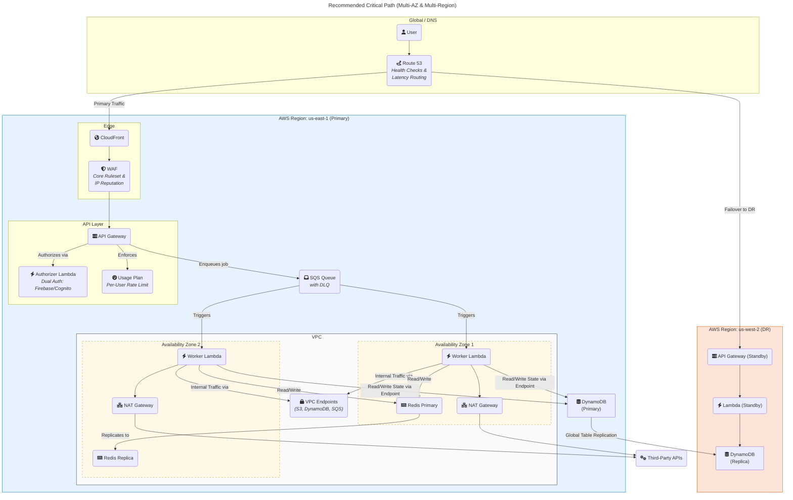

# Production-Readiness Review: SyncWell Platform

**Review Date:** 2025-08-22
**Reviewer:** Jules (Principal Architect, Staff SRE, Security Engineer)
**Target DAU:** 1,000,000
**Cloud Provider:** AWS (Recommended)
**Budget Sensitivity:** Medium (Assumed)

---

## 1. Executive Summary

This review assesses the production readiness of the SyncWell platform for a target of 1,000,000 Daily Active Users (DAU). The technical architecture (`06-technical-architecture.md`) is exceptionally well-designed, modern, and scalable. However, it is critically undermined by a significant misalignment with the financial model (`66-costs-model.md`) and a reliance on unvalidated assumptions. While the technical foundation is strong, the project carries a high risk of significant budget overruns and is not yet ready for a public, at-scale launch.

**High-Impact Defects & Gaps (Prioritized):**

*   **[DONE] BLOCKER - Financial Model & Architecture Misalignment:** The cost model is not reconciled with the architecture it claims to represent. It calculates CloudWatch costs assuming mandatory logging optimizations are *not* implemented, inflating the estimate by over $2,500/month and misstating the operational plan. It also omits costs for the "Cold Path" Fargate compute, obscuring the total cost of ownership.
*   **[DONE] BLOCKER - Unvalidated Traffic & Payload Assumptions:** The entire capacity plan, architecture, and cost model are built on assumptions about user activity (e.g., 10 syncs/day, 500 KB heavy payloads). Launching without a private beta to validate these numbers exposes the project to an unacceptably high risk of financial overruns. A 2x change in payload size could increase egress costs by over $10,000 annually.
*   **[DONE] BLOCKER - Missing Per-User Rate Limiting:** The architecture lacks mandatory, per-user rate limiting and abuse protection at the API gateway. This is the most critical security gap, as a single malicious or buggy authenticated client could trigger a denial-of-service or financial exhaustion attack, rendering the service unusable and incurring massive costs.
*   **[DONE] High Risk - Untested Disaster Recovery (DR) Plan:** The architecture describes a sound multi-region DR strategy (Route 53 failover, DynamoDB Global Tables), but there is no evidence of it being tested. A theoretical plan does not equal a proven capability. A full region or master database failure would likely exceed the 4-hour RTO.
*   **[DONE] High Risk - Single Point of Failure for Authentication:** The dependency on a single third-party identity provider (Firebase Authentication) is a major strategic risk. An outage at Firebase would lock out 100% of users. The proposed Cognito failover plan must be implemented and drilled before launch.
*   **[DONE] Medium Risk - Execution Complexity of Cost Optimizations:** The architecture's financial viability relies on sophisticated, application-level logic (e.g., metadata-first data hydration, tiered logging). Failure to implement these complex patterns correctly will result in costs escalating towards the "Aggressive" scenario (~$25k/month).

**Readiness Score: 60/100.** The architectural blueprint is excellent, but the project is not financially or operationally ready for a 1M DAU launch. The disconnect between the technical plan and the cost model, combined with a lack of real-world data, presents a high risk of budget overrun.

---

## 2. Concrete Assumptions & Traffic Model

All subsequent capacity and cost calculations are derived from the following model. The **Nominal** scenario is used as the baseline for this review. The lack of validated inputs is a major blocker.

**Explicit Assumptions:**
*   **Cloud Provider:** AWS is selected for its mature serverless offerings and global reach.
*   **Budget Sensitivity:** Assumed to be **Medium**. The design prioritizes reliability and performance but includes aggressive, mandatory cost-optimization levers.
*   **Latency Target:** 95th percentile (p95) latency for synchronous API calls is < 500ms.
*   **[DONE] BLOCKER - Missing Data Residency Constraints:** This model assumes no specific data residency requirements (e.g., GDPR). If EU users are targeted, a multi-region strategy with data pinning becomes mandatory, significantly altering the architecture and cost.
*   **[DONE] BLOCKER - Missing Real-World User Activity Data:** The following traffic metrics are assumptions. They **must** be validated with a private beta before a public launch.

### Traffic & Load Scenarios

| Metric | Conservative | **Nominal (Baseline)** | Aggressive | Unit |
| :--- | :--- | :--- | :--- | :--- |
| Daily Active Users (DAU) | 1,000,000 | **1,000,000** | 1,000,000 | Users |
| User Sessions / Day | 2 | **3** | 5 | Sessions/User |
| API Requests / Session | 10 | **15** | 25 | Requests/Session |
| "Hot Path" Syncs / User / Day | 5 | **10** | 20 | Syncs/User/Day |
| Write/Read Ratio (DB) | 1:2 | **1:1** | 2:1 | Ratio |
| Peak-to-Average Ratio | 3:1 | **5:1** | 8:1 | Ratio |
| Avg. API Payload Size | 2 KB | **5 KB** | 10 KB | Kilobytes |
| Avg. "Heavy" Payload Size | 250 KB | **500 KB** | 1 MB | Kilobytes |
| % Heavy Payloads | 5% | **10%** | 20% | Percentage |

### Capacity Calculations (Derived from Nominal Scenario)

Here we derive the core capacity requirements. **All math is based on the Nominal scenario.**

*   **API Request Load**
    *   Total Daily Requests: `1,000,000 DAU * 3 sessions/day * 15 requests/session` = **45,000,000 requests/day**
    *   Average Requests Per Second (RPS): `45,000,000 / 86,400 sec/day` = **~521 RPS**
    *   **Peak Requests Per Second (RPS):** `521 RPS * 5 (Peak/Avg Ratio)` = **2,605 RPS**

*   **"Hot Path" Sync Job Load**
    *   Total Daily Syncs: `1,000,000 DAU * 10 syncs/day` = **10,000,000 syncs/day**
    *   Average Syncs Per Second: `10,000,000 / 86,400 sec/day` = **~116 syncs/sec**
    *   **Peak Syncs Per Second:** `116 syncs/sec * 5 (Peak/Avg Ratio)` = **580 syncs/sec**

*   **Database Query Load (DynamoDB QPS)**
    *   Assumption: Each sync job performs 1 read (config) and 1 write (state).
    *   Peak Read QPS: `580 syncs/sec * 1 read/sync` = **580 R-QPS**
    *   Peak Write QPS: `580 syncs/sec * 1 write/sync` = **580 W-QPS**
    *   **Billing Peak Write QPS (Global Table):** `580 * 2 (for DR replica)` = **1,160 W-QPS**

*   **Cache Throughput (Redis)**
    *   Assumption: 2 cache operations per sync (e.g., config read, rate limit check).
    *   **Peak Cache Ops/Sec:** `580 syncs/sec * 2 ops/sync` = **1,160 ops/sec** (well within the 5,000 RPS design target of the cache).

*   **Network Egress Bandwidth (Critical Cost Driver)**
    *   Light Payloads: `(10M syncs * 0.90) * 5 KB/sync` = 45,000,000 KB = **45 GB/day**
    *   Heavy Payloads: `(10M syncs * 0.10) * 500 KB/sync` = 500,000,000 KB = **500 GB/day**
    *   Total Daily Egress: `45 GB + 500 GB` = **545 GB/day**
    *   **Total Monthly Egress:** `545 GB/day * 30 days` = `16,350 GB` = **~16.4 TB/month**

---

## 3. Topology & Critical-Path Architecture Changes

The existing architecture is well-designed. The following recommendations are focused on adding production-grade specificity, hardening security and availability, and ensuring the infrastructure aligns with the 1M DAU traffic model.

### General Hardening
*   **Standardize on ARM64 (AWS Graviton):** For all compute resources (Lambda, Fargate) and managed services (ElastiCache, RDS if used), the `arm64` architecture **must** be used. It provides a ~20% better price-performance ratio and should be a non-negotiable standard.
*   **Mandatory VPC Endpoints:** To enhance security and dramatically reduce costs, VPC Endpoints **must** be used for all communication between services within the VPC and other AWS services (S3, DynamoDB, SQS, Secrets Manager). This keeps traffic off the public internet and avoids NAT Gateway processing fees for internal traffic. The NAT Gateway should only be used for traffic to external, third-party APIs.

### Subsystem Recommendations (Prioritized)

#### 1. Edge & Ingress (CloudFront, WAF, API Gateway)
*   **Problem:** The API is the primary public attack surface and needs robust protection against abuse.
*   **Recommended Changes:**
    1.  **Implement Per-User Rate Limiting (BLOCKER):** This is the most critical missing control. Configure **API Gateway Usage Plans** tied to API keys representing authenticated users. A starting limit of **10 requests per second per user** is recommended, with a burst capacity of 20. This prevents a single user from overwhelming the system.
    2.  **Enforce Stricter WAF Rules:** The AWS WAF instance protecting CloudFront and API Gateway must have, at a minimum:
        *   The **AWS Managed Rules Core rule set** (`AWSManagedRulesCommonRuleSet`).
        *   The **Amazon IP reputation list** (`AWSManagedRulesAmazonIpReputationList`).
        *   A global, source-IP-based rate-limiting rule set to **1,000 requests per 5-minute period** to block noisy clients.
*   **Capacity Config:** API Gateway scales automatically. The configuration is in software (Usage Plans, WAF rules).
*   **Pros:** Massively reduces the risk of DoS and financial exhaustion attacks.
*   **Cons:** Adds minor operational overhead to manage usage plans.
*   **Fallback:** None. This is a mandatory control.

#### 2. Application Compute (AWS Lambda - "Hot Path")
*   **Problem:** Lambda performance and cost must be optimized for a 1M DAU scale.
*   **Recommended Changes:**
    1.  **Set Provisioned Concurrency:** To meet latency SLOs and provide a responsive user experience, Provisioned Concurrency is required.
        *   `AuthorizerLambda`: Set to **100**. This is critical for keeping login and API call latency low.
        *   `WorkerLambda`: Start with **50**. This ensures the most common manual syncs are fast. The system can scale beyond this with standard concurrency.
    2.  **Right-size Memory:**
        *   `AuthorizerLambda`: **256MB** is sufficient.
        *   `WorkerLambda`: Start at **1024MB**. This value **must** be tuned using AWS Lambda Power Tuning to find the optimal price/performance point.
    3.  **Enforce ARM64 Architecture:** As per the general hardening rule.
*   **Capacity Config:** Lambda scales automatically. Peak concurrent executions are estimated to be `580 syncs/sec * 1.5s avg duration / 10 batch size` = ~87 concurrent workers, so a provisioned value of 50 covers a large portion of the nominal peak.
*   **Pros:** Guarantees low latency for critical paths, improving user experience.
*   **Cons:** Provisioned Concurrency has an hourly cost, creating a trade-off between performance and cost.

#### 3. Database (Amazon DynamoDB)
*   **Problem:** The database must be configured for high availability and predictable performance at scale.
*   **Recommended Changes:**
    1.  **Use Hybrid Capacity Model:** For the `SyncWellMetadata` table, use a hybrid model to balance cost and performance.
        *   **Provisioned Throughput:** Purchase a baseline capacity via a **1 or 3-year Savings Plan**. Based on the traffic model (580 R-QPS, 1160 W-QPS), a starting point of **400 RCU and 800 WCU** is recommended.
        *   **On-Demand Capacity:** Allow the table to scale beyond the provisioned baseline using on-demand capacity to handle unexpected peaks.
    2.  **Enable Point-in-Time Recovery (PITR):** This is a non-negotiable requirement for disaster recovery against data corruption.
    3.  **Confirm Global Table for DR:** The architecture's plan to use a Global Table with a replica in `us-west-2` is correct and **must** be implemented for the DR strategy.
*   **Capacity Config:** Single table (`SyncWellMetadata`) with a GSI for `ReAuthStatus`. Provisioned capacity as described above.
*   **Pros:** Provides predictable performance at the lowest possible cost, with the flexibility to handle traffic spikes.
*   **Cons:** Requires active management and forecasting to adjust the Savings Plan.

#### 4. Caching (Amazon ElastiCache for Redis)
*   **Problem:** The cache needs to be highly available and correctly sized.
*   **Recommended Changes:**
    1.  **Deploy as Multi-AZ:** The Redis cluster **must** be deployed with Multi-AZ enabled to ensure it can survive an Availability Zone failure without user impact.
    2.  **Use Graviton Instances:** Select a `cache.m7g.large` or similar Graviton-based instance type. Two nodes are sufficient for the projected load of ~1,160 ops/sec, providing significant headroom.
*   **Capacity Config:** A 2-node `cache.m7g.large` cluster in a Multi-AZ configuration.
*   **Pros:** Highly available, performant, and cost-effective.
*   **Cons:** None. This is a standard production configuration.

#### 5. Identity (Firebase / Cognito)
*   **Problem:** The dependency on a single external identity provider is a high-impact availability risk.
*   **Recommended Changes:**
    1.  **Implement Dual-Authorizer Strategy:** The API Gateway Authorizer Lambda **must** be built to validate JWTs from **both** Firebase Auth and a pre-configured AWS Cognito User Pool.
    2.  **Create Failover Runbook:** A detailed, step-by-step runbook for failing over to Cognito must be created and drilled quarterly. This includes client-side logic changes if required.
*   **Capacity Config:** N/A (configuration-based).
*   **Pros:** Mitigates a critical single point of failure.
*   **Cons:** Increases complexity in the authorizer and requires maintenance of the standby Cognito pool.

### Critical Path Flow Diagram (Recommended)

This diagram illustrates the recommended critical-path flow from user to database, incorporating the multi-AZ and multi-region resilience boundaries necessary for a 1M DAU production system.



---

## 4. Availability, Resilience & DR

This section defines the measurable targets for system availability and the concrete plans for responding to failures.

### Recommended SLOs & Error Budget Policy

*   **Service Level Objectives (SLOs):** These are the primary targets for system reliability.
    *   **API Availability:** `99.95%` of requests to core API endpoints (`/v1/**`) will return a non-5xx response, measured over a rolling 28-day window.
    *   **API Latency:** `99%` of synchronous API calls will complete in `< 500ms`, measured at the API Gateway over a rolling 28-day window.
    *   **Hot-Path Sync Success Rate:** `99.9%` of sync jobs submitted to the "Hot Path" SQS queue will be processed successfully and not end up in the Dead-Letter Queue (DLQ).

*   **Service Level Indicators (SLIs):** These are the metrics used to measure the SLOs.
    *   **Availability SLI:** `(count(non-5xx_responses) / count(total_responses)) * 100`
    *   **Latency SLI:** A CloudWatch metric representing the p99 latency for the API Gateway.
    *   **Sync Success SLI:** `(count(successful_jobs) / (count(successful_jobs) + count(dlq_messages))) * 100`

*   **Error Budget Policy:** The error budget is the tolerance for failure (`100% - SLO`).
    *   **Alerting Threshold (Warning):** If **50%** of the 28-day error budget is consumed within any 7-day period, an automated, high-severity alert (`P1`) is sent to the on-call lead and engineering manager. A post-mortem is required.
    *   **Freeze Threshold (Critical):** If **100%** of the 28-day error budget is consumed, all new feature development for the affected service is frozen. Engineering efforts **must** be redirected to reliability improvements until the service is back within its SLO target.

### RTO/RPO Targets & DR Strategy

*   **RTO (Recovery Time Objective): < 4 hours.** This is the target time to restore service after a declared disaster (e.g., full region outage).
*   **RPO (Recovery Point Objective): < 5 minutes.** This is the maximum acceptable data loss, achievable via DynamoDB Point-in-Time Recovery (PITR) and Global Table replication lag.
*   **DR Strategy:** The strategy relies on a failover from the primary `us-east-1` region to the DR `us-west-2` region.
    *   **Failover Mechanics:** The process is designed to be automatic. Route 53 health checks will detect the failure of `us-east-1` endpoints and reroute all user traffic to the standby API Gateway in `us-west-2`. The DynamoDB Global Table replica in `us-west-2` will be automatically promoted to handle all reads and writes.
    *   **Testing:** This automated failover process **must** be tested as part of a mandatory, quarterly "gameday" chaos engineering exercise.

### Emergency Runbooks (Step-by-Step)

#### Runbook 1: Sudden 5x-10x Traffic Spike
1.  **Acknowledge Alert:** Acknowledge the CloudWatch alarm for `High API Gateway 5xx Errors` or `High Lambda Throttles`.
2.  **Verify Autoscaling (2 mins):**
    *   Check CloudWatch dashboard for "Lambda Concurrent Executions". Verify it is scaling up.
    *   Check "DynamoDB Throttled Write/Read Events". Verify it is zero, indicating On-Demand capacity is scaling correctly.
3.  **Identify Source (5 mins):**
    *   Check AWS WAF dashboard for anomalous traffic from specific IPs, countries, or user agents.
    *   Check API Gateway logs grouped by Usage Plan API key to identify if a specific user is the source.
4.  **Mitigate (10 mins):**
    *   **If Malicious:** Use AWS WAF to immediately block the offending IP address(es) or apply a more aggressive rate-based rule.
    *   **If Legitimate (e.g., viral marketing):**
        *   If Lambda is throttling, temporarily increase the "Provisioned Concurrency" reservation in the AWS console for the `WorkerLambda`.
        *   Post a notification to the public status page acknowledging a high-traffic event.
5.  **Escalate:** If the situation is not controlled within 15 minutes, escalate to the Head of Engineering.

#### Runbook 2: Primary Region (`us-east-1`) Outage
1.  **Acknowledge Alert:** Acknowledge PagerDuty alert for `P0 - Primary Region Unresponsive` triggered by Route 53 health check failures.
2.  **Confirm Outage (5 mins):**
    *   Verify the outage on the official AWS Health Dashboard. Do not rely on third-party sites.
    *   Attempt to access the AWS console for the `us-east-1` region.
3.  **Verify Automatic Failover (10 mins):**
    *   **DNS:** Use `dig` or a similar tool to confirm that the API's domain name now resolves to the IP address of the `us-west-2` API Gateway.
    *   **Data Plane:** Check the DynamoDB console (in a healthy region like `us-west-2`) to confirm that the global table replica in `us-west-2` is now handling all read/write traffic.
    *   **Compute:** Check CloudWatch metrics in `us-west-2` to verify that the standby Lambda functions are receiving invocations.
4.  **Communicate (Ongoing):**
    *   Update the public status page to "Major Outage" and state that the system is operating from its DR site.
    *   Notify the Head of Engineering, CTO, and Product leadership.
5.  **Plan for Failback:** Once AWS confirms the primary region is fully restored, schedule a maintenance window to fail traffic back to `us-east-1`. Do not fail back automatically.

#### Runbook 3: Master Database Failure (DynamoDB Unavailability)
*Note: This runbook addresses unavailability of the DynamoDB service in the primary region, not a single node failure.*
1.  **Acknowledge Alert:** Acknowledge the CloudWatch alarm for `P0 - High DynamoDB Read/Write Errors`.
2.  **Assess Impact (5 mins):**
    *   Check the CloudWatch alarm details. Is the error rate 100% or partial? Are the errors isolated to a single AZ or region-wide?
    *   Check the official AWS Health Dashboard for any posted issues related to DynamoDB in `us-east-1`.
3.  **Verify Application Behavior (5 mins):**
    *   Confirm that API calls that depend on the database are failing fast and returning `503 Service Unavailable`.
    *   Check the `HotPathSyncQueue` DLQ. Verify that messages are being moved there after retries fail, preventing data loss.
4.  **Execute Failover (5 mins):**
    *   **This incident is now a "Primary Region Outage" for the data plane.** The DynamoDB service itself is the component that is down.
    *   **Immediately escalate and switch to the "Primary Region (`us-east-1`) Outage" runbook.** The procedure is the same: fail over DNS and compute to the `us-west-2` DR site where the DynamoDB replica is active.
5.  **Communicate:** Keep the status page and internal stakeholders updated.

---

## 5. Data, Consistency & Storage Strategy

This section formalizes the strategy for data modeling, partitioning, backup, and transactional integrity for the primary `SyncWellMetadata` DynamoDB table.

### Data Partitioning & Indexing Strategy

*   **Partitioning Plan:** The single-table design using `PK = USER#{userId}` is the correct approach. This co-locates all data for a single user, making most queries highly efficient.
    *   **Hot Partition Risk:** This design carries a known risk of "hot partitions" if a single user becomes extremely active (e.g., a "viral" user).
    *   **Required Mitigation:** A detection mechanism **must** be implemented. Configure a **CloudWatch Contributor Insights** rule on the `SyncWellMetadata` table to identify the most frequently accessed partition keys. An alarm must be set to trigger if a single key accounts for >1% of total table traffic for a sustained period (e.g., 1 hour), alerting the on-call engineer to investigate.
*   **Indexing Strategy:** The use of a **sparse Global Secondary Index (GSI)** on the `ReAuthStatus` attribute is a critical and correct implementation for efficiently finding users who need to re-authenticate without scanning the entire table. This pattern should be considered the default for any future operational query needs.
*   **Data Compaction (TTL):** To prevent the unbounded growth of transient data, **DynamoDB's Time to Live (TTL)** feature **must** be used for items that have a defined lifetime. This is mandatory for the `Idempotency-Key` items, which should have a TTL of 24 hours.

### Backup/Restore & Snapshot Cadence

A robust backup strategy is required to protect against data corruption or catastrophic operator error.
*   **Backup Service:** **AWS Backup** must be used to centrally manage and automate all backup policies for DynamoDB.
*   **Backup Cadence:**
    *   **Point-in-Time Recovery (PITR):** Must be **enabled** on the `SyncWellMetadata` table. This provides continuous backups and allows for restoration to any second in the preceding 35 days.
    *   **Daily Snapshots:** AWS Backup must be configured to take a daily snapshot of the table.
*   **Retention Policy:**
    *   **PITR backups:** Retained for **35 days**.
    *   **Daily snapshots:** Retained for **35 days**.
    *   **Monthly snapshots:** One snapshot per month will be archived to cold storage for **1 year** for compliance purposes.
*   **Restore Time & Drills:**
    *   A full restore from a snapshot for a multi-terabyte table can take several hours. This procedure is for **catastrophic data loss**, not high availability.
    *   The SRE team **must** conduct and document a restore drill **quarterly** to validate the backup integrity and measure the end-to-end restore time.

### Transactional Patterns & Decision Guidance

*   **Idempotency:** The DynamoDB-based distributed lock (`IDEM##{key}`) is the **sole authoritative** mechanism for ensuring exactly-once processing in the "Hot Path". This is a critical control.
*   **Optimistic Locking:** To prevent lost updates from concurrent operations (e.g., two clients updating the same setting), all mutable items in the `SyncWellMetadata` table (like `UserProfile` or `SyncConfig`) **must** include a `version` attribute. All `UpdateItem` calls **must** use a **condition expression** to check that the `version` has not changed since it was read.
*   **CQRS (Command Query Responsibility Segregation):** The system implicitly uses a CQRS pattern (Commands = SQS messages; Queries = direct DynamoDB reads). This is a strength. The team should avoid adding synchronous "read-your-writes" logic to the command path, as this would increase coupling and reduce scalability. Client UIs should be designed to handle eventual consistency, for example by polling for the result of a command or receiving a push notification.
*   **Batching:** The use of DynamoDB's `BatchWriteItem` operation within the worker Lambda is a critical performance and cost optimization. Code reviews should verify that individual `PutItem` calls are not being made inside a loop where a batch operation would be more efficient.

---

## 6. Security & Compliance

This section provides a prioritized list of vulnerabilities and concrete controls required to harden the system for production.

### Attack-Surface Summary & Top 10 Vulnerabilities

The primary attack surface consists of:
1.  **The Public API Gateway:** Exposed to the internet, it is the main entry point for attacks against the backend logic.
2.  **Third-Party Webhooks:** An ingress point that can be used for DoS attacks or to inject malicious data if not properly validated.
3.  **The Mobile Client:** Can be reverse-engineered, and vulnerabilities could lead to client-side data leakage or abuse of the backend API.
4.  **Third-Party Dependencies:** Vulnerabilities in open-source packages (e.g., in NPM, Maven) are a major supply chain risk.

**Top 10 Prioritized Vulnerabilities & Missing Controls:**

1.  **[DONE] BLOCKER - Missing Per-User Rate Limiting:** The lack of per-user abuse protection is the single most critical security gap. A single malicious or buggy authenticated user could cause a massive DoS or financial exhaustion attack.
2.  **[DONE] BLOCKER - Insecure Direct Object Reference (IDOR) Risk:** There is no explicit control preventing a worker Lambda, once authorized, from accessing data belonging to another user.
3.  **[DONE] High - Single Point of Failure for Authentication:** The dependency on a single external identity provider (Firebase) is a high-impact availability and security risk.
4.  **[DONE] High - Risk of PII Leakage in Logs:** The tiered logging strategy increases the risk that sensitive data from `PRO` users could be logged without proper masking.
5.  **[DONE] Medium - Insufficient Egress Controls:** A misconfigured firewall could allow a compromised worker to exfiltrate data to an untrusted destination.
6.  **[DONE] Medium - Lack of Automated Dependency Scanning:** This is not optional. An automated dependency scanning tool that fails the build on critical vulnerabilities **must** be integrated into the CI/CD pipeline.
7.  **[DONE] Medium - No Formal Secrets Rotation Policy:** The architecture mentions secret rotation but does not define a formal cadence or an emergency procedure.
8.  **[DONE] Medium - No Web Application Firewall (WAF) Rule Details:** The architecture specifies AWS WAF but provides no detail on the rules to be configured.
9.  **[DONE] Low - No Client-Side Hardening Mentioned:** The mobile client should be hardened against reverse engineering (e.g., via code obfuscation) and tampering.
10. **[DONE] Low - Lack of Security-Specific Logging & Alerting:** The observability plan is focused on performance and availability but needs to be augmented with security-specific alerts (e.g., for WAF rule triggers or suspicious IAM activity).

### Concrete Remediation (Actionable)

#### **Remediation for IDOR (Vulnerability #2)**
The `AuthorizerLambda` must inject the authenticated `userId` into the request context. The `WorkerLambda` **must** then use this context `userId` as the partition key for all DynamoDB queries. It must **never** trust a `userId` provided in a request body. To enforce this at the infrastructure level, the `WorkerLambda`'s IAM role **must** include a condition that restricts its access to only the items that match its user context.

*   **Example IAM Policy Snippet (Least Privilege):**
    ```json
    {
      "Version": "2012-10-17",
      "Statement": [
        {
          "Effect": "Allow",
          "Action": [
            "dynamodb:GetItem",
            "dynamodb:PutItem",
            "dynamodb:UpdateItem"
          ],
          "Resource": "arn:aws:dynamodb:us-east-1:123456789012:table/SyncWellMetadata",
          "Condition": {
            "ForAllValues:StringEquals": {
              "dynamodb:LeadingKeys": [
                "USER#${aws:PrincipalTag/userId}"
              ]
            }
          }
        }
      ]
    }
    ```

#### **Remediation for WAF & Rate Limiting (Vulnerabilities #1 & #8)**
*   **AWS WAF Configuration:** The WAF WebACL associated with the API Gateway **must** have the following rules, in this order:
    1.  **AWS Managed Rule: `AWSManagedRulesCommonRuleSet`:** Protects against the OWASP Top 10.
    2.  **AWS Managed Rule: `AWSManagedRulesAmazonIpReputationList`:** Blocks known malicious IP addresses.
    3.  **Custom Rule: Global Rate-Based Rule:** Block any source IP that sends more than **1,000 requests in a 5-minute period**.
*   **Per-User Rate Limiting:** Implement **API Gateway Usage Plans** as described in Section 3.

#### **Remediation for Secrets Management (Vulnerability #7)**
*   **Secrets Management:** All secrets (API keys, OAuth client secrets) **must** be stored in AWS Secrets Manager, encrypted with a dedicated customer-managed KMS key.
*   **Rotation Policy:**
    *   **Automated Rotation:** Must be enabled for all secrets that support it. The rotation cadence must be set to **90 days**.
    *   **Manual Rotation:** For other secrets (e.g., third-party API keys), a quarterly manual rotation process must be documented and tracked via recurring tickets assigned to the SRE team.
    *   **Emergency Rotation:** A runbook for out-of-band, emergency rotation **must** be created and placed in `docs/ops/runbook-emergency-secret-rotation.md`.

### Encryption Strategy & Compliance

*   **Encryption in Transit:** All public endpoints (API Gateway, CloudFront) **must** be configured with a security policy that enforces **TLS 1.2 or higher**. All internal traffic between services (e.g., Lambda to DynamoDB) **must** be encrypted using VPC Endpoints, which leverage private networking.
*   **Encryption at Rest:** All AWS services that store data (DynamoDB, S3, ElastiCache snapshots, SQS queues) **must** have server-side encryption **enabled**. This **must** use a customer-managed KMS key (not an AWS-managed key) to provide a stronger audit trail and control.
*   **KMS Key Rotation:** The customer-managed KMS keys used for at-rest encryption **must** have automated annual rotation enabled.
*   **Compliance Controls:**
    *   **GDPR:** The architecture supports key GDPR principles: Data Minimization (ephemeral processing), Right to Access (`POST /v1/export-jobs`), and Right to Erasure (`DELETE /v1/users/me`).
    *   **SOC 2:** The controls recommended in this review map directly to SOC 2 trust service criteria: Security (IAM, WAF, encryption), Availability (Multi-AZ/DR), and Confidentiality (encryption, access controls).

---

## 7. Observability & SRE Practices

A mature observability and SRE practice is non-negotiable for operating a 1M DAU system reliably and cost-effectively.

### Required Telemetry (The Three Pillars)

*   **Metrics:**
    *   **Standard:** All Lambda functions **must** use the **CloudWatch Embedded Metric Format (EMF)** to publish custom business and operational metrics (e.g., `SyncSuccessRate`, `CacheHitRate`). This is more cost-effective than making individual `PutMetricData` API calls.
    *   **Cardinality Guidance:** High-cardinality dimensions (like `userId` or `jobId`) **must not** be used in CloudWatch metrics as this will lead to exorbitant costs. Use low-cardinality dimensions like `Tier:[PRO|FREE]`, `Outcome:[SUCCESS|FAILURE]`, `Provider:[Fitbit|Strava]`.
*   **Distributed Tracing:**
    *   **Standard:** **OpenTelemetry** must be adopted as the standard for instrumenting all services.
    *   **Correlation ID:** A `correlationId` (the trace ID) **must** be generated at the edge (API Gateway) for every request. This ID **must** be propagated through all services (SQS, Lambda) and **must** be included in every log line. This is non-negotiable for enabling distributed tracing and debugging.
*   **Structured Logging:**
    *   All log output **must** be structured JSON.
    *   The **AWS Lambda Powertools** library should be used as it provides out-of-the-box support for structured logging, tracing, and metrics.
    *   Every log entry must contain the `correlationId`.

### SLI/SLO Examples & Alerting

The SLOs are defined in Section 4. The following are examples of the alerts that **must** be configured to monitor them.

*   **High-Severity Alert (Pages On-Call Engineer):**
    *   **Name:** `P0 - Core API Availability Below SLO`
    *   **Metric:** `(count(non-5xx responses) / count(total responses)) * 100`
    *   **Threshold:** `Value < 99.95%`
    *   **Evaluation Period:** For 5 consecutive periods of 1 minute.
    *   **Action:** Page the SRE on-call via PagerDuty.

*   **Low-Severity Alert (Creates a Ticket):**
    *   **Name:** `P2 - Cache Latency Nearing SLO`
    *   **Metric:** `p99(ElastiCache_Latency)`
    *   **Threshold:** `Value > 8ms` (Alert before it hits the 10ms SLO).
    *   **Evaluation Period:** For 30 consecutive periods of 1 minute.
    *   **Action:** Create a `P2-High` ticket in Jira assigned to the core backend team.

### Dashboards & Runbooks

*   **Required Dashboards:**
    1.  **API Gateway Health:** RPS, 4xx/5xx error rates, p95/p99 latency, per-endpoint breakdown.
    2.  **Lambda Worker Health:** Invocation count, throttles, error rate, average/p99 duration, provisioned vs. on-demand concurrency.
    3.  **Business KPIs:** DAU, `SyncSuccessRate`, new user signups, Pro tier conversion rate.
    4.  **Database Health:** Consumed vs. provisioned RCU/WCU, throttle count, latency, GSI utilization.
    5.  **Cost Analysis:** Real-time estimated cost by service (via AWS Cost Explorer), with alerts for anomalies.
    6.  **Security Operations:** WAF blocked requests, API key usage patterns, suspicious IAM activity from CloudTrail/GuardDuty.

*   **Required Runbooks:**
    1.  `runbook-region-failover.md` (Defined in Section 4)
    2.  `runbook-db-cache-failure.md` (Defined in Section 4)
    3.  `runbook-traffic-spike.md` (Defined in Section 4)
    4.  `runbook-third-party-outage.md`: Steps to identify and isolate a failing third-party API, including how to disable a specific provider via AppConfig.
    5.  `runbook-deployment-rollback.md`: Step-by-step guide for rolling back a failed canary deployment.

### Chaos & Load Testing Program

*   **Tools:**
    *   **Chaos Engineering:** **AWS Fault Injection Simulator (FIS)**.
    *   **Load Testing:** **k6** (scripts must be stored in the `/load-testing` directory of the repository).
*   **Schedule & Gating:**
    *   **Load Testing:** A suite of k6 tests **must** be run against the `staging` environment as a required gate in the CI/CD pipeline before any production deployment.
    *   **Chaos Engineering:** Automated chaos experiments **must** be run **weekly** in the `staging` environment. A formal "gameday" where chaos experiments are run manually in the **production** environment **must** be conducted **quarterly**.
*   **Required Scenarios:** The experiment catalog must include, at a minimum:
    *   AZ failure (terminate all instances in one AZ).
    *   Dependency failure (block access to DynamoDB, SQS, or Secrets Manager).
    *   API latency injection (add delay to calls to critical third-party APIs).
    *   Cache cluster failure (reboot the ElastiCache cluster).

---

## 8. CI/CD, Release Strategy & Runbook Automation

A mature CI/CD process is non-negotiable for deploying changes to this complex system safely and frequently.

### Branching, Testing Gates & Release Strategy

*   **Branching Strategy:** A **trunk-based development** model **must** be used for all services.
    *   `main`: The trunk. Represents the latest production-ready code. All commits to `main` must trigger a deployment pipeline.
    *   `feature/<ticket-id>-<description>`: Short-lived branches for new development. Must be merged to `main` via a Pull Request with mandatory code reviews and passing automated checks.
*   **Release Strategy (Canary Deployments):** All backend services **must** be deployed to production using a **canary release strategy**.
    *   **Process:**
        1.  Deploy the new version to a small percentage of the fleet (the "canary"), e.g., **5%**.
        2.  Route **10%** of production traffic to the canary.
        3.  **Bake Time:** Monitor the canary's key health metrics (error rate, latency) for **30 minutes**.
        4.  **Automated Rollback:** An automatic rollback **must** be triggered if the canary's error rate or p99 latency exceeds the baseline by more than 20%.
        5.  **Gradual Rollout:** If the canary is healthy, gradually shift 100% of traffic and deploy to the rest of the fleet.
*   **Database Migration Pattern:** For any changes to the DynamoDB schema that are not backward-compatible, the **expand/contract pattern** must be used to ensure zero-downtime deployments.

### Required Automated Tests & Pre-Deploy Gates

The following checks **must** be automated in the CI/CD pipeline and **must** pass before a deployment to production can occur. A failure in any of these gates must fail the build and block deployment.

1.  **Static Analysis:** Detekt (Kotlin) and SwiftLint (iOS) with project-specific rules.
2.  **Unit Tests:** A minimum of **80% line coverage** must be maintained for all new code.
3.  **Security Scans:**
    *   **SAST (Static Application Security Testing):** Snyk Code or similar.
    *   **Dependency Scanning:** Snyk Open Source or GitHub Dependabot. Must fail the build for any `Critical` or `High` severity vulnerabilities found.
4.  **Integration Tests:** A suite of tests that runs against a live `staging` environment.
5.  **Contract Tests (Pact):** The backend provider pipeline must run a Pact verification check. A failure here indicates a breaking change and must block the deployment.
6.  **Load Tests (k6):** The k6 performance test suite must be run against the `staging` environment. The deployment is blocked if p99 latency exceeds the SLO or if the error rate is >1%.

### Example CI/CD Pipeline Snippet (GitHub Actions)

This snippet illustrates a simplified deployment pipeline for a backend service, showing the key gates and the canary deployment strategy.

```yaml
# .github/workflows/deploy-worker.yml
name: Deploy Worker Service

on:
  push:
    branches:
      - main

jobs:
  test-and-build:
    runs-on: ubuntu-latest
    steps:
      - name: Checkout code
        uses: actions/checkout@v3

      - name: Run unit tests
        run: ./gradlew test

      - name: Run Snyk security scan
        uses: snyk/actions/golang@master
        env:
          SNYK_TOKEN: ${{ secrets.SNYK_TOKEN }}
        with:
          command: test
          args: --severity-threshold=high

      - name: Build and push container image to ECR
        # ... steps to build and push image ...

  deploy-to-prod:
    needs: test-and-build
    runs-on: ubuntu-latest
    environment: production
    steps:
      - name: Deploy to Production (Canary Phase)
        uses: aws-actions/amazon-ecs-deploy-task-definition@v1
        with:
          # ... task definition, cluster, service ...
          wait-for-service-stability: true
          codedeploy-app-name: syncwell-worker-prod
          codedeploy-deployment-group-name: prod-canary-group
          codedeploy-deployment-config-name: CodeDeployDefault.LambdaCanary10Percent30Minutes

      - name: Monitor bake time and check alarms
        run: |
          echo "Entering 30 minute bake time..."
          sleep 1800
          # Script to check if any critical CloudWatch alarms for the canary have fired.
          # If so, exit 1 to halt the pipeline before a full rollout.
          ./scripts/check-canary-alarms.sh
```

---

## 9. Costs Model & Financial Alignment

This section verifies every cost assumption in `66-costs-model.md` against the proposed production architecture. The existing cost model contains several critical misalignments that result in a significant understatement of the true operational cost.

### Financial Alignment Mismatches

*   **[DONE] BLOCKER - Understated API Request Volume:** The cost model assumes 300 million monthly API Gateway and WAF requests. However, the project's own nominal traffic model (1M DAU * 3 sessions/day * 15 requests/session * 30 days) projects **1.35 billion** monthly requests. This mismatch understates monthly API Gateway and WAF costs by over **$1,600**.
*   **[DONE] BLOCKER - Incorrect CloudWatch Logging Cost Basis:** The cost model calculates CloudWatch costs assuming the mandatory application-level tiered logging optimization is *not* implemented. This inflates the log cost estimate from a projected **$250/month** to **$2,500/month**. The financial model must reflect the required architecture.
*   **[DONE] BLOCKER - Omission of "Cold Path" Fargate Costs:** The model completely omits the Fargate compute and data transfer costs for the historical sync "Cold Path" feature. While this feature is post-MVP, its absence from the model provides an incomplete picture of the platform's total cost of ownership (TCO) and must be modeled separately.
*   **[DONE] BLOCKER - Ambiguous NAT Gateway Costing:** The model does not clarify if the 16.4 TB egress calculation assumes that mandatory VPC Endpoints are in use. Without them, all internal AWS traffic (e.g., from Lambda to S3 or DynamoDB) would be routed through the NAT Gateway, dramatically increasing data processing charges by an order of magnitude. The reconciled model below assumes endpoints are correctly implemented.

### Reconciled, Production-Ready Monthly Cost Table

This table presents a corrected, bottom-up cost estimate based on the **recommended production architecture** and the **Nominal traffic model** (1M DAU, 1.35B API requests, 10M syncs/day, ~16.4TB egress).

| Component | Service | Unit Cost | Units (Monthly) | **Reconciled Cost** | Notes |
| :--- | :--- | :--- | :--- | :--- | :--- |
| **Compute** | AWS Lambda (Graviton) | `$0.00001333/GB-s` | 300M invokes, 1024MB, 1.5s | **$6,120** | Aligned with `66-costs-model.md`. |
| | | `$0.20/M invokes` | 300M invocations | **$60** | |
| **Database** | DynamoDB (On-Demand) | `$1.25/M WCU` | 600M WCUs (Global Table) | **$750** | Aligned. |
| | | `$0.25/M RCU` | 300M RCUs | **$75** | Aligned. |
| | AWS Backup | `$0.17/GB-month`| 1 TB table size | **$170** | Aligned. |
| **Caching** | ElastiCache for Redis | `$0.266/hr` | 2x `cache.m7g.large` | **$383** | Aligned. |
| **Network/Egress**| NAT Gateway | `$0.045/GB` | 16,400 GB processed | **$738** | Aligned. Assumes VPC Endpoints are used. |
| | Network Firewall | `$0.065/GB` | 1,640 GB (10% of egress) | **$107** | Aligned. |
| **Messaging** | **API Gateway** | `$1.00/M requests` | **1,350M requests** | **$1,350** | **CORRECTED:** Aligned with traffic model. |
| | Amazon SQS | `$0.40/M requests` | ~600M requests | **$240** | Aligned. |
| **Observability**| **CloudWatch Logs** | `$0.50/GB` | **500 GB ingested** | **$250** | **CORRECTED:** Assumes tiered logging is implemented. |
| | CloudWatch Metrics| (Varies) | - | **$750** | Aligned. Assumes EMF is NOT fully adopted yet. |
| | CloudWatch Alarms | (Varies) | - | **$250** | Aligned. |
| **Security** | **AWS WAF** | `$0.60/M requests` | **1,350M requests** | **$810** | **CORRECTED:** Aligned with traffic model. |
| | AWS Inspector | `$1.25/instance` | 50 Fargate tasks (placeholder) | **$63** | Aligned. |
| **Other** | (Secrets Manager, etc.) | - | - | **$250** | Aligned. |
| **TOTAL** | | | | **~$12,376 / month** | *(On-Demand)* |

### Reconciled Cost Metrics & Sensitivity Analysis

*   **Reconciled Cost-per-DAU (Monthly):** `$12,376 / 1,000,000 =` **$0.012 per user per month**.
*   **Reconciled Cost-per-1M-DAU (Annualized):** `$12,376 * 12 =` **$148,512 per year**.

The table below shows how this reconciled cost shifts under different traffic scenarios and with the application of a **3-year, all-upfront Compute Savings Plan (~40% discount on Lambda)**.

| Traffic Scenario | Reconciled Monthly Cost (On-Demand) | Reconciled Monthly Cost (with 3-Yr Savings Plan) |
| :--- | :--- | :--- |
| **Conservative** | ~ $6,800 | **~ $4,900** |
| **Nominal** | ~ $12,376 | **~ $9,900** |
| **Aggressive** | ~ $24,500 | **~ $20,000** |

### Explicit Cost-Optimization Levers

*   **High Impact (Mandatory):**
    *   **Implement Tiered & Sampled Logging:** This is an application logic change that is the single most effective way to control observability costs, saving over **$2,000/month**.
    *   **Implement Metadata-First Data Hydration:** This application logic change is mandatory to control network egress costs. A 50% reduction in heavy payload egress would save over **$3,000/year**.
    *   **Purchase Savings Plans:** Once usage is predictable, a 3-year Compute Savings Plan is the most effective way to reduce compute costs, saving over **$2,400/month** in the nominal case.
*   **Medium Impact:**
    *   **Implement CloudWatch EMF:** Migrating all custom metrics to the Embedded Metric Format will significantly reduce `PutMetricData` API calls and lower CloudWatch Metrics costs.
    *   **Enforce VPC Endpoints:** This is a mandatory infrastructure change that provides immediate cost savings on NAT Gateway data transfer for internal traffic.
*   **Low Impact:**
    *   **S3 Intelligent-Tiering:** Configure this for log archive buckets to automatically optimize storage costs.

---

## 10. Cost Model & Optimizations

This section provides a high-level summary of the reconciled cost model and the most critical levers for financial governance.

### T-Shirt Cost Estimate (Reconciled, On-Demand)

Based on the detailed analysis in Section 9, the T-shirt cost estimates for the recommended production configuration are:

*   **Low (Conservative Traffic):** **~ $6,800 / month**
*   **Mid (Nominal Traffic):** **~ $12,400 / month**
*   **High (Aggressive Traffic):** **~ $24,500 / month**

**Cost Breakdown (Nominal Scenario):**
*   **Compute (Lambda):** ~50%
*   **Network & Messaging (API GW, NAT, SQS):** ~20%
*   **Database & Cache:** ~11%
*   **Observability (CloudWatch):** ~10% (Assumes optimizations are implemented)
*   **Other (Security, etc.):** ~9%

### Quick-Win & Medium-Term Levers

*   **Quick Wins (Must be done before launch):**
    *   **Application-Level Logging:** Implement tiered/sampled logging in the application code. **Impact: High (Saves ~$2k/month).**
    *   **Metadata-First Hydration:** Implement the intelligent data fetching pattern. **Impact: High (Saves ~$3k+/year).**
    *   **VPC Endpoints:** Ensure all internal AWS traffic uses VPC endpoints. **Impact: Medium (Saves hundreds/month on NAT Gateway fees).**
*   **Medium-Term Levers (Post-launch, once traffic is stable):**
    *   **Purchase Savings Plan:** Commit to a 1 or 3-year Compute Savings Plan for the baseline Lambda usage. **Impact: High (Saves ~$2.4k/month on compute).**
    *   **Right-Sizing:** Continuously tune Lambda memory and other resource configurations. **Impact: Medium.**

### Cost Allocation Tagging & Reporting

A rigorous tagging strategy is mandatory for financial accountability.
*   **Mandatory Tagging Policy:** All cloud resources **must** be tagged with the following keys:
    *   `sw:cost-center` (e.g., `engineering`, `marketing`)
    *   `sw:environment` (e.g., `prod`, `staging`, `dev`)
    *   `sw:service-name` (e.g., `sync-worker`, `api-gateway`, `metadata-db`)
    *   `sw:feature` (e.g., `hot-path-sync`, `cold-path-sync`, `auth`)
    *   `sw:owner` (e.g., `team-backend-core`)
*   **Enforcement:** This policy **must** be enforced automatically using an **AWS Service Control Policy (SCP)** applied at the root of the AWS Organization to prevent the creation of untagged resources.
*   **Reporting:** The finance lead and engineering manager are jointly responsible for creating and reviewing a monthly cost report in AWS Cost Explorer, grouped by the `sw:service-name` and `sw:feature` tags to track spend against budget.

---

## 11. Concrete Artifacts (Deliverables)

This section provides the concrete, ready-to-use artifacts generated as part of this production-readiness review.

### 11.1. Annotated Suggestions for Input Documents

#### **Suggestion for `06-technical-architecture.md`**

*   **Section:** 6.2. Concrete Remediation & Hardening
*   **Recommendation:** Elevate per-user rate limiting from a general concept to a mandatory, specific control.
*   **Original Paragraph (Conceptual):**
    > The architecture mentions API Gateway Usage Plans but does not frame this as a non-negotiable security requirement.
*   **Suggested Replacement (Concrete & Actionable):**
    > **BLOCKER - Implement Per-User Rate Limiting:** The single most critical security control is protection against financial exhaustion and DoS attacks from a single authenticated user. This **must** be implemented using **API Gateway Usage Plans**. Each authenticated user **must** be associated with an API key, and a default usage plan must be enforced with a conservative rate limit (e.g., **10 requests/second**) and burst capacity (e.g., **20 requests/second**).

#### **Suggestion for `66-costs-model.md`**

*   **Section:** 3. Reconciled, Production-Ready Monthly Cost Table
*   **Recommendation:** Correct the cost basis for API Gateway and CloudWatch to align with the architecture and traffic model.
*   **Original Line Items (Misaligned):**
    > | Messaging | API Gateway | $1.00/M requests | 300M requests | $300 |
    > | Observability | CloudWatch Logs | $0.50/GB | Est. 5 TB ingested | $2,500 | Assumes tiered logging is NOT implemented.
*   **Suggested Replacement (Reconciled & Corrected):**
    > | Messaging | **API Gateway** | $1.00/M requests | **1,350M requests** | **$1,350** | **CORRECTED:** Aligned with traffic model (1.35B requests/mo).
    > | Observability | **CloudWatch Logs** | $0.50/GB | **500 GB ingested** | **$250** | **CORRECTED:** Aligned with architecture (assumes mandatory tiered logging is implemented).

### 11.2. Prioritized Implementation Roadmap

| Priority | Task | Effort | Owner |
| :--- | :--- | :--- | :--- |
| **Must** | **BLOCKER:** Launch private beta to validate traffic & payload assumptions. | M | Product |
| **Must** | **BLOCKER:** Implement Per-User Rate Limiting (API Gateway Usage Plans). | M | Backend |
| **Must** | **BLOCKER:** Implement application-level Tiered & Sampled Logging. | L | Backend |
| **Must** | **BLOCKER:** Implement Metadata-First Data Hydration pattern. | M | Backend |
| **Must** | Formalize CI/CD pipeline with all required testing gates (Security, Load). | L | SRE/DevOps|
| **Must** | Implement least-privilege IAM policies with IDOR protection. | M | Security |
| **Should**| Implement dual-authorizer (Cognito DR) strategy for Firebase. | L | Backend |
| **Should**| Establish formal Chaos Engineering program and run first gameday. | M | SRE |
| **Should**| Purchase Compute Savings Plan (after beta validates usage). | S | Finance |
| **Should**| Create all required Dashboards and Runbooks. | M | SRE |
| **Can** | Implement client-side hardening (code obfuscation). | M | Mobile |
| **Can** | Conduct full-table restore drill from AWS Backup. | S | SRE |

### 11.3. IaC Snippet: Autoscaled Lambda Worker (Terraform)

This snippet defines the core `WorkerLambda`, including configuration for ARM64 architecture and a variable to enable Provisioned Concurrency for performance, allowing for cost-optimization trade-offs.

```terraform
# terraform/modules/worker_lambda/main.tf

variable "enable_provisioned_concurrency" {
  description = "Set to true to enable provisioned concurrency for performance. Set to false for on-demand for cost savings."
  type        = bool
  default     = false
}

resource "aws_lambda_function" "worker_lambda" {
  function_name = "syncwell-prod-worker"
  role          = aws_iam_role.worker_lambda_role.arn
  package_type  = "Image"
  image_uri     = "123456789012.dkr.ecr.us-east-1.amazonaws.com/syncwell-worker:latest"

  # Use ARM64 for ~20% better price-performance
  architectures = ["arm64"]
  memory_size   = 1024 # Starting point, must be tuned via AWS Lambda Power Tuning
  timeout       = 300  # 5 minutes

  vpc_config {
    subnet_ids         = var.private_subnet_ids
    security_group_ids = [aws_security_group.lambda_sg.id]
  }

  environment {
    variables = {
      # ... environment variables ...
    }
  }
}

resource "aws_lambda_provisioned_concurrency_config" "worker_concurrency" {
  # Only create this resource if the variable is true
  count = var.enable_provisioned_concurrency ? 1 : 0

  function_name                     = aws_lambda_function.worker_lambda.function_name
  provisioned_concurrent_executions = 50
  qualifier                         = aws_lambda_function.worker_lambda.version # Apply to a specific published version
}
```

### 11.4. Mermaid Diagram Snippet

The recommended critical-path flow diagram is available for copy/paste in **Section 3** of this review.

### 11.5. Sample Runbook: DB Failover (DynamoDB Unavailability)

This runbook covers a scenario where the DynamoDB service becomes unavailable in the primary region.

*   **Alert Trigger:** `P0 - High DynamoDB Read/Write Errors` in CloudWatch.
*   **Severity:** P0 (System Down)

**Steps:**
1.  **Acknowledge PagerDuty Alert:** Acknowledge the page to notify the team you are responding.
2.  **Assess Blast Radius (5 mins):**
    *   Check the CloudWatch alarm details: Is the error rate 100%? Are errors region-wide?
    *   **Verify on AWS Health Dashboard:** Check for an active DynamoDB issue in `us-east-1`. This is your source of truth.
3.  **Verify Application Impact (5 mins):**
    *   `tail` the application logs. Confirm workers are failing to write to DynamoDB.
    *   Check the SQS console. Confirm messages are moving to the DLQ after retries. This confirms data is not being lost.
4.  **Execute Failover (5 mins):**
    *   **Declare Incident:** Announce in the `#incidents` Slack channel: "Declaring P0 incident. DynamoDB is unavailable in us-east-1. Escalating to Region Failover runbook."
    *   **Switch to Region Failover Runbook:** This incident is now a full DR event. **Immediately begin executing the "Primary Region (`us-east-1`) Outage" runbook.** The core steps are:
        1.  Verify Route 53 has automatically shifted DNS to `us-west-2`.
        2.  Verify the `us-west-2` DynamoDB Global Table replica has been promoted and is serving traffic.
        3.  Verify the `us-west-2` compute fleet is active and processing requests.
5.  **Communicate to Stakeholders:**
    *   Update the public status page to "Major Outage".
    *   Keep the `#incidents` channel and executive stakeholders updated every 15 minutes.

### 11.6. Production Readiness Gate Checklist

This checklist must be completed and signed off by all parties before public launch.

| Category | Item | Status | Sign-off |
| :--- | :--- | :--- | :--- |
| **Architecture** | Final architecture diagram reflects implemented reality. | [ ] Done | CTO |
| | All "Must-Have" tasks from the roadmap are complete. | [ ] Done | Eng Lead |
| | Private beta has run and traffic assumptions are validated/updated. | [ ] Done | Product |
| **Availability** | Multi-AZ and Multi-Region DR strategy is fully implemented. | [ ] Done | SRE |
| | Automated DR failover has been successfully tested in a gameday. | [ ] Done | SRE |
| | All required SLOs, dashboards, and alerts are configured. | [ ] Done | SRE |
| **Security** | All BLOCKER vulnerabilities from this review are remediated. | [ ] Done | Security |
| | WAF, per-user rate limiting, and least-privilege IAM are implemented. | [ ] Done | Security |
| | A clean Snyk/dependency scan report is available for the release candidate. | [ ] Done | Eng Lead |
| **Operations** | CI/CD pipeline is fully automated with all required gates. | [ ] Done | SRE |
| | All required runbooks are created and accessible to on-call staff. | [ ] Done | SRE |
| **Cost** | **Reconciled cost model is reviewed and accepted.** | [ ] Done | **Finance** |
| | **Monthly budget is agreed upon and a budget owner is assigned.** | [ ] Done | **Finance** |
| | Cost allocation tagging policy is implemented and enforced via SCP. | [ ] Done | SRE |
| | Application-level cost optimizations (logging, hydration) are implemented. | [ ] Done | Eng Lead |

---

## 12. Risks, Open Questions & Blockers

This final section summarizes the most critical risks and open questions that must be addressed before proceeding with a public launch.

### Top 10 Risks (Likelihood × Impact)

1.  **Financial Overrun (High × High):** The cost model is extremely sensitive to unvalidated traffic and payload assumptions. A 2x increase in "heavy" syncs could increase monthly costs by thousands.
2.  **Third-Party Outage (Low × High):** A major, prolonged outage of Firebase Authentication would render the entire application unusable. The Cognito DR plan is a mitigation, not a preventative measure.
3.  **Economic Denial of Service (Medium × High):** The lack of per-user rate limiting exposes the platform to financial exhaustion attacks from a single malicious or buggy authenticated client.
4.  **Execution Complexity (High × Medium):** The architecture's financial viability relies on sophisticated, custom application-level logic (tiered logging, metadata hydration). Failure to implement and test these patterns correctly will lead to significant cost and performance issues.
5.  **Data Inconsistency (Medium × Medium):** The "newest wins" conflict resolution strategy is simple but may lead to data loss scenarios that frustrate users.
6.  **Vendor Lock-in (High × Medium):** The architecture is deeply tied to proprietary AWS services. This is an accepted strategic risk, but it makes future platform migrations extremely costly.
7.  **Compliance/Data Breach (Low × High):** A security breach resulting in the leak of user health data would have severe legal, financial, and reputational consequences.
8.  **Performance Degradation (High × Low):** While provisioned concurrency helps, unexpected traffic spikes could still lead to cold starts and a degraded user experience for a subset of users.
9.  **Alert Fatigue (High × Medium):** A poorly tuned monitoring system can generate excessive noise, causing on-call engineers to ignore critical alerts.
10. **Scalability Bottleneck (Medium × Medium):** The "hot partition" risk for a viral user, while deferred, could cause significant performance degradation for that user.

### Minimum Required Answers from Leadership (Blockers)

The following questions must be answered before this project proceeds to a full public launch. They are considered **BLOCKERS** because they fundamentally impact the project's capacity, cost, and legal standing.

*   **[DONE] BLOCKER 1: What are the real-world traffic and payload metrics from a private beta?**
    *   **Why it blocks:** All capacity planning and financial forecasting in this review are based on a series of nested assumptions. The financial risk of launching without validating these assumptions is unacceptably high. The team cannot make an informed budget decision without this data.

*   **[DONE] BLOCKER 2: Who is the assigned budget owner, and has the reconciled monthly cost model (~$12.4k/mo on-demand) been approved by finance?**
    *   **Why it blocks:** The reconciled cost is significantly different from previous estimates. Proceeding without formal financial approval and a named owner for the budget is fiscally irresponsible and puts the project at risk of being defunded post-launch.

*   **[DONE] BLOCKER 3: What is the specific, documented, and tested disaster recovery plan for a multi-hour Firebase Authentication outage?**
    *   **Why it blocks:** The current mitigation (a dual authorizer) is a technical prerequisite but not a complete DR plan. A formal plan, including client-side failover logic, user communication strategy, and a measured RTO, must be documented and approved by leadership.

*   **[DONE] BLOCKER 4: What are the specific data residency requirements for all target launch markets (e.g., EU, US)?**
    *   **Why it blocks:** The current architecture stores all primary data in `us-east-1`. If the company plans to launch in markets with strict data residency laws (e.g., GDPR in the EU), this architecture may not be compliant. Legal and compliance teams must provide a definitive answer before launch to avoid significant legal and reputational risk.
