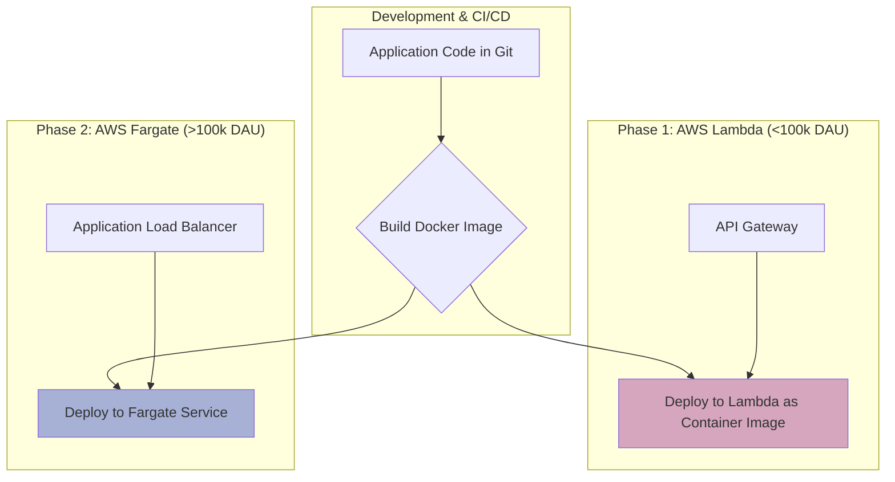
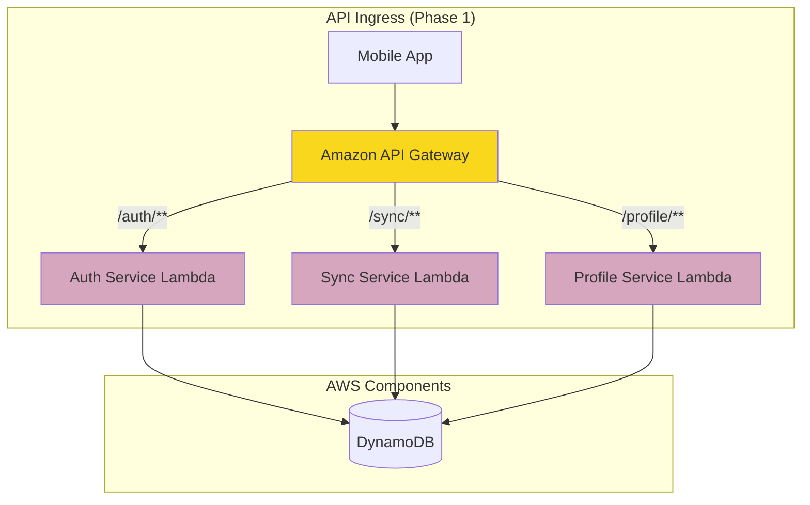
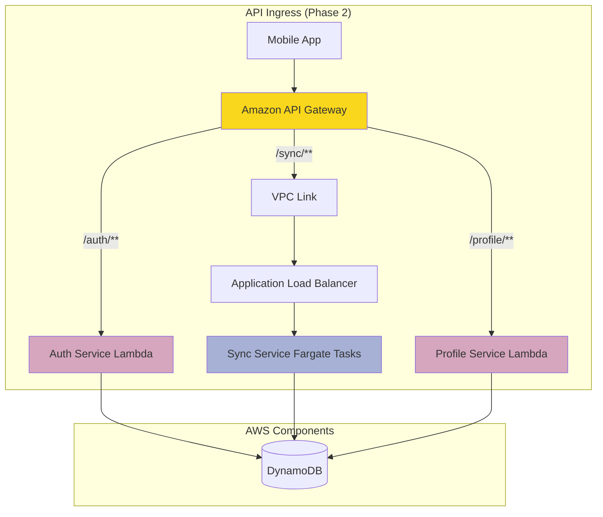
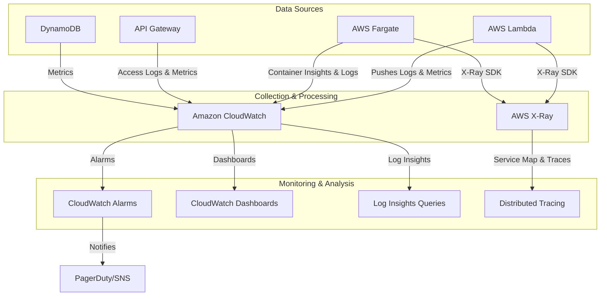
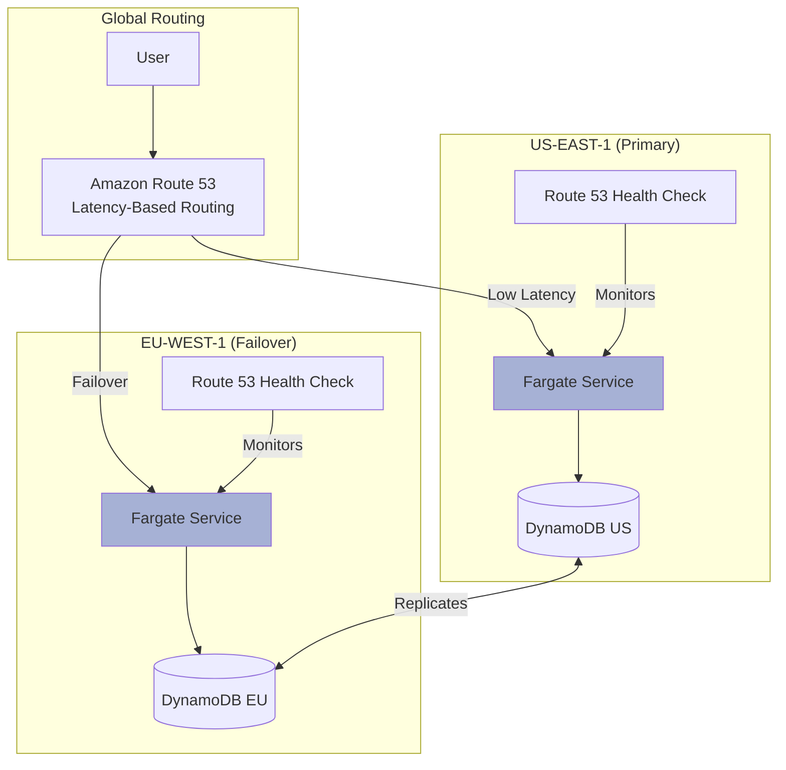

# SyncWell Technical Architecture: A Phased AWS Blueprint (v2)

## 0. Document Management

| Version | Date       | Author(s)                 | Summary of Changes                                                                                             |
| :------ | :--------- | :------------------------ | :------------------------------------------------------------------------------------------------------------- |
| 2.0     | 2025-08-22 | Jules, Solutions Architect | Initial draft of the V2 architecture, formalizing the phased Lambda-to-Fargate compute strategy and global tables. |

---

## 1. Architectural Principles & Tenets

This architecture is designed to support SyncWell's rapid growth from launch to over 1 million Daily Active Users (DAU). The following principles guide all technical decisions, ensuring the platform is scalable, resilient, secure, and cost-effective throughout its lifecycle.

*   **Design for Graceful Evolution:** The architecture is not a static endpoint but a living system designed to evolve. The phased compute strategy (Lambda -> Fargate) is the prime example, allowing us to use the right tool for the right stage of growth, optimizing for speed and cost.
*   **Secure by Design:** Security is not an afterthought. We will leverage AWS's security primitives (IAM, KMS, WAF, Shield) and best practices from day one. All data is encrypted in transit and at rest. The principle of least privilege is enforced everywhere.
*   **Infrastructure as Code (IaC) is Non-Negotiable:** All cloud infrastructure will be defined, versioned, and deployed using AWS CDK. This eliminates manual configuration, ensures consistency across environments, and enables repeatable, automated deployments.
*   **Embrace Serverless First, Not Serverless Forever:** We will start with AWS Lambda to maximize development velocity and minimize operational overhead at launch. However, we recognize its economic limitations at extreme scale and have a clear, pre-defined path to migrate high-throughput workloads to AWS Fargate for sustained cost-performance.
*   **Automate Everything:** CI/CD pipelines are the backbone of our development and operations. Automation reduces human error, increases deployment frequency, and enables rapid iteration. This applies to testing, deployment, and infrastructure provisioning.
*   **Data is the Crown Jewels:** Our data architecture, centered on DynamoDB Global Tables, is designed for global availability, low-latency access, and resilience against regional failures. Data integrity and accuracy, especially during synchronization, are paramount.
*   **Build for Observability:** We cannot manage what we cannot measure. The system is designed for deep observability from the start, using a combination of Amazon CloudWatch (Logs, Metrics, Alarms), AWS X-Ray for tracing, and Container Insights for Fargate. This allows for proactive monitoring, rapid debugging, and performance optimization.
*   **Align with the AWS Well-Architected Framework:** Our design choices are continuously evaluated against the six pillars of the Well-Architected Framework: Operational Excellence, Security, Reliability, Performance Efficiency, Cost Optimization, and Sustainability.

---

## 2. Phased Compute Strategy: Lambda to Fargate

This is the core of our evolutionary architecture. The strategy allows us to launch quickly and operate leanly, while having a clear, planned-for transition to a compute platform optimized for cost at high, sustained throughput.

### Architectural Pattern: Portable Application Design

The key to a seamless transition is ensuring the application code is portable from day one.

*   **Containerization from the Start:** All application logic for our microservices (e.g., Auth Service, Sync Service, Profile Service) will be packaged as **container images**.
*   **Lambda with Container Images:** In Phase 1, we will deploy these container images directly to AWS Lambda. This gives us the operational benefits of Lambda while ensuring our core application artifact is already a Fargate-compatible container.
*   **Shared Codebase:** The core application logic, dependencies, and runtime are identical for both Lambda and Fargate. The only difference is the "bootstrap" or entrypoint script that handles the invocation source (API Gateway event for Lambda vs. HTTP request for Fargate/ALB).

This pattern makes the "migration" from Lambda to Fargate less of a rewrite and more of a *re-platforming* of the same core application artifact.



### Routing & Ingress: API Gateway as the Stable Entrypoint

Amazon API Gateway will serve as the stable, public-facing entry point for our API throughout both phases. This provides a consistent client experience and allows us to change the backend implementation without impacting the mobile application.

#### Phase 1: API Gateway -> Lambda Integration

Initially, API Gateway routes requests directly to the corresponding Lambda functions via Lambda Proxy Integration.



#### Phase 2: API Gateway -> ALB -> Fargate Integration

When a service is migrated, we will change the API Gateway integration for that specific route (e.g., `/sync/**`) to use an **API Gateway VPC Link**. This privately and securely forwards requests to an internal Application Load Balancer (ALB), which then distributes traffic across the Fargate tasks for that service.


*Note: In Phase 2, we can choose to migrate services individually. For example, the high-throughput `Sync Service` might move to Fargate while the less-frequently-called `Profile Service` remains on Lambda for cost-efficiency.*

### Migration Triggers

The decision to migrate a service from Lambda to Fargate will be data-driven, based on a combination of technical and financial metrics. The primary trigger point is **100,000 DAU**, but we will monitor the following specific KPIs:

*   **Sustained Invocation Count:** A service consistently exceeding **2.5 million invocations per day** (approx. 1 req/user/day at 100k DAU x 25 days/month).
*   **Cost Threshold:** When the monthly cost of a single Lambda function begins to exceed the projected cost of a continuously running, scaled Fargate service (typically around **$500-$700/month** per function).
*   **P99 Latency:** If Lambda cold starts or execution duration consistently contribute to a P99 latency exceeding **500ms** for a core user-facing API endpoint.
*   **Execution Duration Limits:** If a service's core logic begins to approach the **15-minute execution limit** of a Lambda function (e.g., historical data sync).

### Migration Process (Zero-Downtime)

The migration for a given service (e.g., the Sync Service) will be executed with zero downtime using a blue/green deployment strategy managed by API Gateway.

1.  **Deploy Fargate Stack:** The Fargate service, ALB, and associated resources are deployed via AWS CDK. The Fargate service is scaled to a minimum number of tasks and passes health checks.
2.  **Configure VPC Link:** The API Gateway VPC Link is created and configured to point to the new ALB.
3.  **API Gateway Canary Release:** We will use API Gateway's canary deployment feature. Initially, 0% of traffic is routed to the new Fargate integration.
4.  **Gradual Traffic Shifting:** We will gradually shift traffic from the Lambda integration to the Fargate integration:
    *   **1% -> 10% -> 50% -> 100%**
    *   At each stage, we will monitor CloudWatch dashboards for error rates, latency, and Fargate service metrics (CPU/Memory utilization).
5.  **Rollback or Roll Forward:** If any issues are detected, API Gateway can immediately shift 100% of traffic back to the stable Lambda integration. If the canary is successful at 100%, the deployment is promoted.
6.  **Decommission Lambda (Optional):** Once the Fargate service is stable, the old Lambda integration in API Gateway can be removed, and the Lambda function itself can be decommissioned to save costs.

---

## 3. System & Component Architecture

### System Context Diagram

This diagram shows the overall ecosystem in which the SyncWell platform operates.

```mermaid
graph TD
    subgraph "Users"
        User[Mobile App User]
    end

    subgraph "SyncWell AWS Ecosystem"
        MobileApp[SyncWell Mobile App]
        APIGW[Amazon API Gateway]
        Compute[Compute Layer <br/> (Lambda / Fargate)]
        DB[(Amazon DynamoDB <br/> Global Tables)]
        S3[(Amazon S3 <br/> for Large Data)]
        Cognito[Amazon Cognito <br/> User Pools]

        MobileApp --> APIGW;
        APIGW --> Compute;
        Compute --> DB;
        Compute --> S3;
        MobileApp --> Cognito;
    end

    subgraph "External Health Platforms"
        Apple[Apple Health]
        Google[Google Fit]
        Fitbit[Fitbit API]
        Strava[Strava API]
    end

    User --> MobileApp;
    Compute --> Apple;
    Compute --> Google;
    Compute --> Fitbit;
    Compute --> Strava;

    style User fill:#c9d1d9
    style APIGW fill:#f9d71c
```

### Container Diagram (Phase 1 - Lambda @ <100k DAU)

This diagram details the primary components and their interactions during the initial Lambda-based phase.

```mermaid
graph TD
    User[Mobile App User] -- Interacts with --> MobileApp[SyncWell Mobile App];

    subgraph "AWS Cloud"
        MobileApp -- Signs up/in --> Cognito[Amazon Cognito];
        MobileApp -- API Calls (HTTPS) --> APIGW[Amazon API Gateway];

        APIGW -- /auth/** --> AuthLambda[Auth Service <br/> Lambda];
        APIGW -- /sync/** --> SyncLambda[Sync Service <br/> Lambda];
        APIGW -- /profile/** --> ProfileLambda[Profile Service <br/> Lambda];
        APIGW -- /jobs/** --> JobLambda[Job Service <br/> Lambda];

        AuthLambda -- Stores tokens --> SecretsManager[AWS Secrets Manager];
        AuthLambda -- Reads/writes user data --> DynamoDB[(DynamoDB Global Table)];

        SyncLambda -- Reads/writes sync config --> DynamoDB;
        SyncLambda -- Fetches tokens --> SecretsManager;
        SyncLambda -- Calls 3rd party APIs --> ExternalAPIs[External Health APIs];
        SyncLambda -- Publishes jobs --> SQS[Amazon SQS <br/> (Standard & FIFO Queues)];

        ProfileLambda -- Reads/writes user profile --> DynamoDB;

        SQS -- Triggers --> JobLambda;
        JobLambda -- Processes sync jobs --> DynamoDB;
        JobLambda -- Writes large objects --> S3[(Amazon S3)];
    end

    style APIGW fill:#f9d71c
    style AuthLambda fill:#D5A6BD
    style SyncLambda fill:#D5A6BD
    style ProfileLambda fill:#D5A6BD
    style JobLambda fill:#D5A6BD
```

### Container Diagram (Phase 2 - Fargate @ >100k DAU)

This diagram shows the evolved architecture after the high-throughput `Sync Service` and `Job Service` have been migrated to AWS Fargate.

```mermaid
graph TD
    User[Mobile App User] -- Interacts with --> MobileApp[SyncWell Mobile App];

    subgraph "AWS Cloud"
        MobileApp -- Signs up/in --> Cognito[Amazon Cognito];
        MobileApp -- API Calls (HTTPS) --> APIGW[Amazon API Gateway];

        APIGW -- /auth/** --> AuthLambda[Auth Service <br/> Lambda];
        APIGW -- /profile/** --> ProfileLambda[Profile Service <br/> Lambda];
        APIGW -- /sync/** --> VPCLink[VPC Link];

        VPCLink -- Forwards to --> ALB[Application Load Balancer];
        ALB -- Routes to --> SyncFargate[Sync Service <br/> on Fargate];

        AuthLambda -- Stores tokens --> SecretsManager[AWS Secrets Manager];
        AuthLambda -- Reads/writes user data --> DynamoDB[(DynamoDB Global Table)];

        SyncFargate -- Reads/writes sync config --> DynamoDB;
        SyncFargate -- Fetches tokens --> SecretsManager;
        SyncFargate -- Calls 3rd party APIs --> ExternalAPIs[External Health APIs];
        SyncFargate -- Publishes jobs --> SQS[Amazon SQS <br/> (Standard & FIFO Queues)];

        ProfileLambda -- Reads/writes user profile --> DynamoDB;

        SQS -- Polled by --> JobFargate[Job Service <br/> on Fargate];
        JobFargate -- Processes sync jobs --> DynamoDB;
        JobFargate -- Writes large objects --> S3[(Amazon S3)];
    end

    style APIGW fill:#f9d71c
    style SyncFargate fill:#A6B1D5
    style JobFargate fill:#A6B1D5
    style AuthLambda fill:#D5A6BD
    style ProfileLambda fill:#D5A6BD
```

### Data Architecture: DynamoDB Global Tables

Our database must be highly available and provide low-latency access to a global user base. DynamoDB Global Tables are the ideal choice.

*   **Global Tables:** We will deploy our DynamoDB tables in at least two AWS regions (e.g., `us-east-1` and `eu-west-1`). DynamoDB automatically replicates data between these regions, providing active-active multi-region resilience.
*   **Regional Endpoints:** The application running in a specific region (e.g., Fargate services in `us-east-1`) will interact with its local DynamoDB endpoint, ensuring minimal latency. If a region fails, traffic can be re-routed to the healthy region, which has a complete, up-to-date copy of the data.

#### DynamoDB Table Design & Access Patterns

We will use a single-table design to minimize operational overhead and allow for complex queries.

**Table Name:** `SyncWellData`

| Attribute Name (Key) | Type   | Description & Purpose                                                                                                                                                                                                                                |
| :------------------- | :----- | :--------------------------------------------------------------------------------------------------------------------------------------------------------------------------------------------------------------------------------------------------- |
| `PK` (Partition Key) | String | **Partition Key.** Uniquely identifies an item collection. We will use composite keys like `USER#<UserID>` or `SYNC#<SyncID>`.                                                                                                                        |
| `SK` (Sort Key)      | String | **Sort Key.** Defines the sort order within a partition. Used for hierarchical data and relationships. Examples: `PROFILE`, `CONFIG#<Platform>`, `DATA#<TimestampISO>`.                                                                                 |
| `GSI1PK`             | String | **GSI 1 Partition Key.** Used for the first Global Secondary Index to query data by a different access pattern. Example: `SYNC#<SyncID>`.                                                                                                                |
| `GSI1SK`             | String | **GSI 1 Sort Key.** Example: `JOB#<TimestampISO>#<Status>`.                                                                                                                                                                                          |
| `data`               | Map    | A flexible map to store the actual item data (e.g., user profile info, sync configuration details, health data payload).                                                                                                                                 |
| `type`               | String | A discriminator field to identify the item type (e.g., "UserProfile", "SyncConfig", "HealthData").                                                                                                                                                    |
| `ttl`                | Number | **Time To Live.** Used for ephemeral data like job status records to automatically delete them after a certain period, reducing storage costs.                                                                                                        |

**Example Access Patterns:**

1.  **Get a user's profile and all their sync configurations:**
    *   `Query PK = "USER#<UserID>"`
    *   This will fetch the `PROFILE` item and all `CONFIG#...` items for that user in a single, efficient query.

2.  **Get all sync jobs for a specific sync configuration:**
    *   `Query GSI1PK = "SYNC#<SyncID>" AND GSI1SK begins_with("JOB#")`
    *   This uses the GSI to efficiently find all job records associated with a specific sync, allowing us to display a history to the user.

3.  **Get all health data for a user for a specific day:**
    *   `Query PK = "USER#<UserID>" AND SK between "DATA#2025-08-22T00:00:00Z" AND "DATA#2025-08-22T23:59:59Z"`
    *   This allows for efficient retrieval of time-series data, essential for historical sync.

---

## 4. Cross-Cutting Concerns

### Security & Identity

Security is woven into every layer of the architecture.

```mermaid
graph LR
    subgraph "Protection Layers"
        Shield[AWS Shield Advanced <br/> DDoS Protection];
        WAF[AWS WAF <br/> Web Application Firewall];
    end

    subgraph "Identity & Access"
        Cognito[Cognito User Pools <br/> (User Authentication)];
        IAM[IAM Roles & Policies <br/> (Least Privilege)];
    end

    subgraph "Data Encryption"
        KMS[AWS KMS <br/> (Customer Managed Keys)];
        ACM[AWS Certificate Manager <br/> (TLS/SSL Certificates)];
    end

    User[User] --> Shield & WAF --> APIGW[API Gateway];
    APIGW --> Compute[Lambda/Fargate];
    Compute -- Uses --> IAM;
    Compute -- Encrypts/Decrypts with --> KMS;
    User -- Authenticates with --> Cognito;
    APIGW -- Uses TLS Cert from --> ACM;
```

*   **User Authentication:** Amazon Cognito User Pools will handle all user sign-up, sign-in, and token management. The mobile app will authenticate with Cognito and receive JWTs, which are passed to API Gateway on every request.
*   **API Authorization:** API Gateway will use a Cognito Authorizer to validate the JWT on every incoming request, ensuring only authenticated users can access the API.
*   **Infrastructure Protection:** AWS Shield Advanced will protect against DDoS attacks, and AWS WAF will be configured on API Gateway to block common web exploits (e.g., SQL injection, XSS).
*   **Least Privilege:**
    *   Each Lambda function and Fargate service will have a unique IAM Role with narrowly scoped permissions.
    *   For example, the `AuthLambda` role will have permission to write to Secrets Manager, but the `SyncLambda` role will only have permission to read from it.
*   **Encryption:**
    *   **In Transit:** All communication is encrypted with TLS 1.2+ (enforced by API Gateway and other AWS services). AWS Certificate Manager (ACM) provides the SSL/TLS certificates.
    *   **At Rest:** All data stored in DynamoDB and S3 will be encrypted at rest using a Customer Managed Key (CMK) in AWS KMS. This gives us full control over the data encryption key lifecycle. Sensitive credentials (OAuth tokens) are stored in AWS Secrets Manager, which also uses KMS for encryption.

### Observability Strategy

Our observability strategy is built on the "three pillars": logs, metrics, and traces.



*   **Logs:** All Lambda functions and Fargate containers will output structured JSON logs to Amazon CloudWatch Logs. We will use CloudWatch Log Insights for powerful, fast log querying and analysis.
*   **Metrics:**
    *   **CloudWatch Metrics:** We will use standard metrics from Lambda, Fargate, API Gateway, SQS, and DynamoDB.
    *   **Custom Metrics:** We will publish custom metrics for key business and application-level events (e.g., `SyncsSucceeded`, `SyncsFailed`, `NewUsers`).
    *   **Container Insights:** For Fargate, we will enable CloudWatch Container Insights to get detailed performance metrics on CPU, memory, disk, and network at the task and container level.
*   **Tracing:** AWS X-Ray will be integrated into our Lambda and Fargate services via the X-Ray SDK. This will provide end-to-end distributed tracing, allowing us to visualize the entire request path from API Gateway through our microservices and identify performance bottlenecks.
*   **Dashboards & Alarms:** We will build comprehensive CloudWatch Dashboards for each service. We will configure CloudWatch Alarms on key metrics (e.g., P99 latency, 5xx error rate, SQS queue depth) that will trigger notifications to our on-call team via SNS and PagerDuty.

### DevOps & CI/CD

Our CI/CD pipeline enables rapid, safe, and automated deployments. We will use GitHub Actions.

```mermaid
graph TD
    subgraph "Development"
        A[Developer Commits to Git Branch] --> B[Opens Pull Request];
    end

    subgraph "CI Pipeline (GitHub Actions)"
        B --> C{Trigger Workflow};
        C --> D[Run Linting & Unit Tests];
        D --> E[Build Docker Image];
        E --> F[Push Image to ECR];
        F --> G[Run Integration Tests];
    end

    subgraph "CD Pipeline (GitHub Actions)"
        H[PR Merged to `main`] --> I{Trigger Deploy};
        I --> J[Deploy to Staging <br/> (via AWS CDK)];
        J --> K[Run Automated E2E Tests];
        K --> L{Manual Approval Gate};
        L --> M[Deploy to Production <br/> (via AWS CDK)];
    end

    G --> H;
```

*   **Source Control:** GitHub will be our source code repository.
*   **Infrastructure as Code (IaC):** We will use the **AWS Cloud Development Kit (CDK)** with TypeScript. This allows us to define our cloud infrastructure using a high-level programming language, which is then synthesized into CloudFormation templates.
*   **CI (Continuous Integration):** On every pull request, a GitHub Actions workflow will:
    1.  Run static analysis, linting, and unit tests.
    2.  Build the Docker container image for the application.
    3.  Push the image to Amazon Elastic Container Registry (ECR) with a git-commit tag.
    4.  Run automated integration tests against a test environment.
*   **CD (Continuous Deployment):** On every merge to the `main` branch:
    1.  The CDK application is deployed to a **Staging** environment that mirrors production.
    2.  A suite of automated end-to-end tests (e.g., using Playwright or a similar framework) is run against the Staging environment.
    3.  A manual approval gate in the GitHub Actions workflow requires a team lead to approve the promotion to production.
    4.  Upon approval, the same CDK application is deployed to the **Production** environment.

---

## 5. Scalability & Resilience

### Performance Modeling (Fargate @ 1M DAU)

*   **Assumptions:**
    *   1,000,000 Daily Active Users.
    *   Each user generates an average of 5 API calls per day related to the `Sync Service`.
    *   Peak traffic is 3x the average, concentrated in a 4-hour window.
*   **Calculations:**
    *   Total Daily Requests: 1M users * 5 req/user = 5,000,000 requests/day.
    *   Average Requests Per Second (RPS): 5,000,000 / 86,400s = ~58 RPS.
    *   Peak RPS: 58 * 3 = ~174 RPS.
*   **Fargate Task Sizing (`Sync Service`):**
    *   **vCPU/Memory:** We'll start with tasks sized at **0.5 vCPU** and **1 GB Memory**. This is a good balance for I/O-bound applications.
    *   **RPS per Task:** Assuming a single task can comfortably handle 25 RPS (allowing for processing time and overhead).
    *   **Required Tasks:**
        *   Average: 58 RPS / 25 RPS/task = ~3 tasks.
        *   Peak: 174 RPS / 25 RPS/task = ~7 tasks.
*   **Auto-Scaling Policy:**
    *   The Fargate service for the `Sync Service` will have a target tracking auto-scaling policy.
    *   **Target:** `CPUUtilization` at **60%**.
    *   **Min Tasks:** 2 (for high availability across two Availability Zones).
    *   **Max Tasks:** 20 (a safe upper bound to control costs).
    *   This policy will automatically add tasks when CPU utilization climbs during peak hours and remove them during lulls, ensuring we only pay for the capacity we need.

### Disaster Recovery (DR)

Our DR strategy leverages the native capabilities of AWS multi-region services to provide high resilience against a regional failure.

*   **RTO (Recovery Time Objective):** < 15 minutes. This is the time it takes to detect a regional failure and re-route all user traffic to the healthy region.
*   **RPO (Recovery Point Objective):** < 1 second. This is the maximum amount of data loss. Because DynamoDB Global Tables replicate data continuously, data loss is near-zero.

**DR Plan & Architecture:**



1.  **Active-Active Deployment:** Our Fargate services and supporting infrastructure are deployed via CDK to both `us-east-1` and `eu-west-1`.
2.  **DynamoDB Global Tables:** As described earlier, our primary table is a Global Table, replicated across both regions.
3.  **Route 53 DNS Failover:** We use Amazon Route 53 for DNS.
    *   **Latency-Based Routing:** Under normal conditions, Route 53 directs users to the region with the lowest latency for them.
    *   **Health Checks:** Route 53 is configured with health checks that continuously monitor the health of the ALB/Fargate service in each region.
    *   **Automated Failover:** If the health checks for `us-east-1` fail, Route 53 will automatically stop sending traffic to that region and direct all users to `eu-west-1`.
4.  **Failback:** Once the issue in `us-east-1` is resolved and the health checks pass, Route 53 will automatically resume sending traffic to it.

This automated, multi-region setup provides a robust DR posture that can withstand a complete AWS regional outage with minimal downtime and near-zero data loss.
