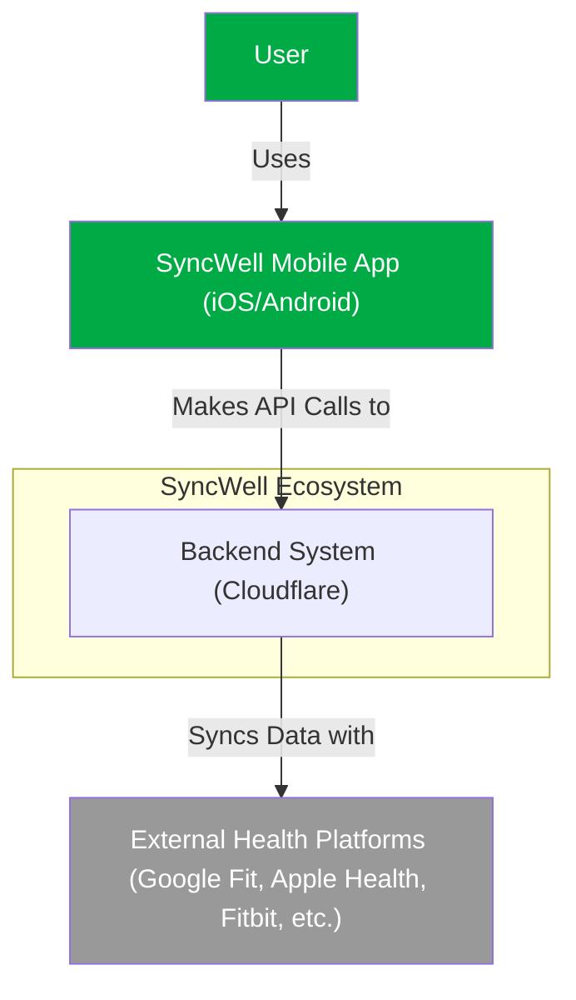
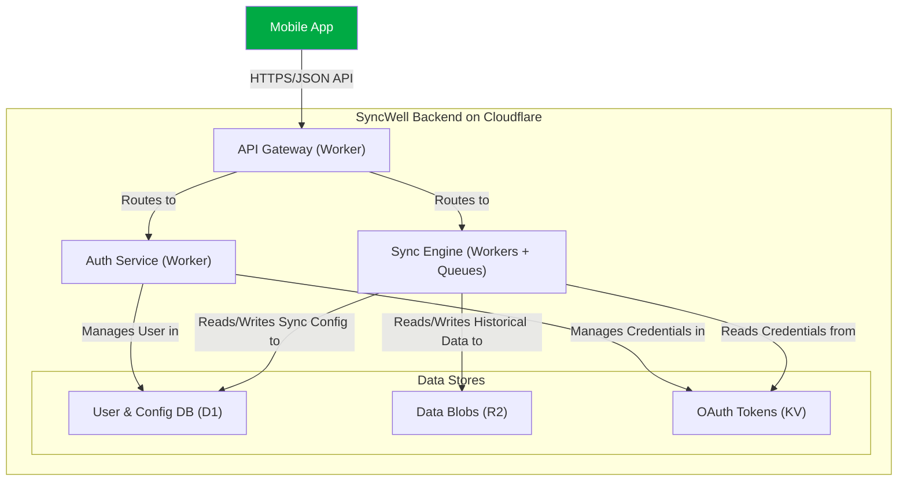
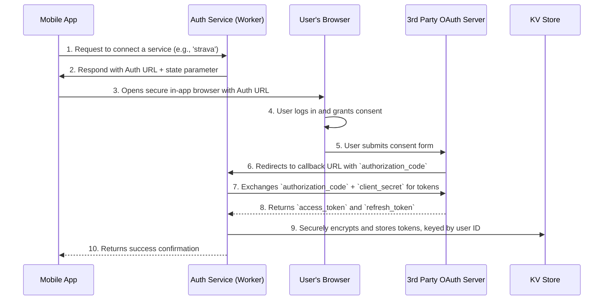
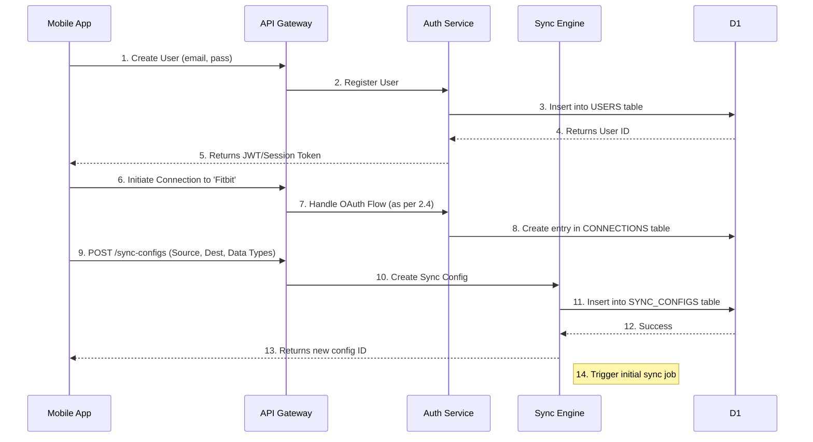
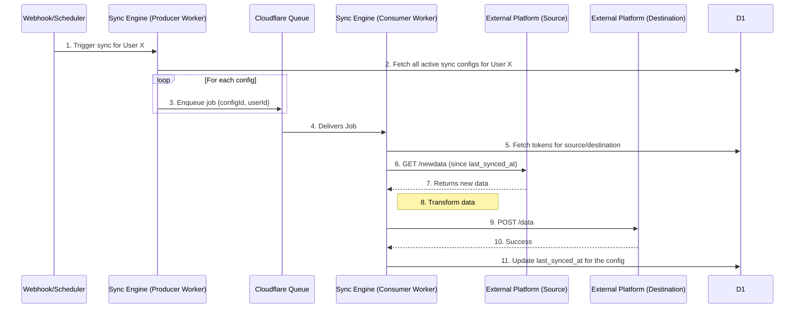
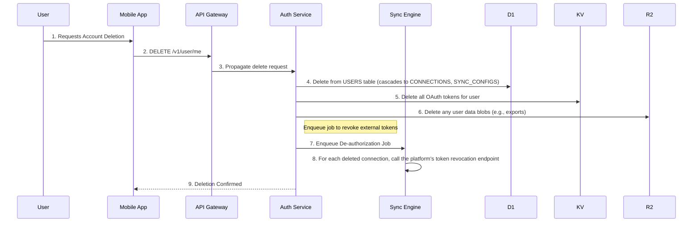
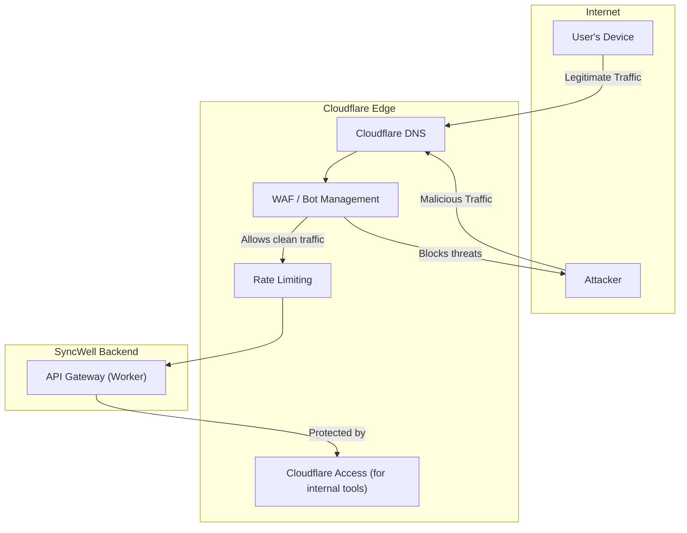
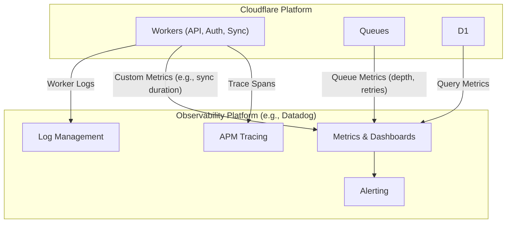
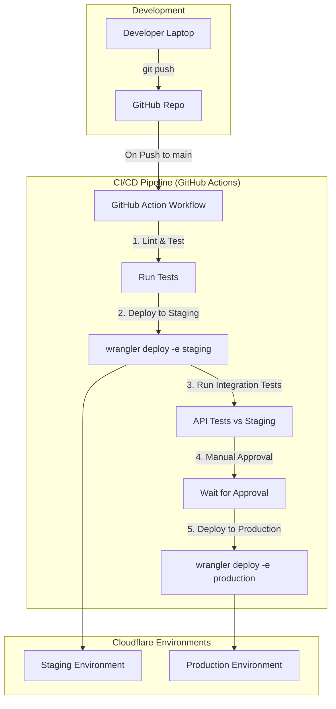

# PRD 1: Technical Architecture for SyncWell

| Version | Date       | Author(s)                 | Summary of Changes                                   |
| :------ | :--------- | :------------------------ | :--------------------------------------------------- |
| 2.0     | 2025-08-22 | Jules, Principal Architect | Initial draft based on Product Scope and User Stories. |

---

## 1. Architectural Principles & Tenets

This architecture is designed to provide a secure, resilient, high-performance, and financially optimized foundation for the SyncWell platform. The following principles guide all technical decisions.

*   **Edge-Native First:** We will prioritize using the Cloudflare global network for all compute and data storage. The goal is to process data as close to the user as possible, minimizing latency and maximizing performance. This is our primary strategic advantage.
*   **Security by Design & Default:** Security is not an afterthought; it is integrated into every layer of the stack. We will leverage Cloudflare's security services (WAF, Access, Rate Limiting) and implement security best practices within our application code (e.g., principle of least privilege, encrypted-at-rest and in-transit data).
*   **Serverless & Managed Services:** We will aggressively leverage serverless compute (Cloudflare Workers) and managed data stores (D1, R2, KV, Queues). This strategy minimizes operational overhead, reduces total cost of ownership (TCO), and allows the engineering team to focus on delivering business value, not managing infrastructure.
*   **FinOps-Driven Design:** Cost-efficiency is a primary architectural driver. We will design our system to be highly efficient, leveraging Cloudflare's cost structure (e.g., zero egress fees from R2) and building cost monitoring into our observability strategy from day one.
*   **API-First:** The backend exists to serve the mobile application. All functionality will be exposed through a well-defined, secure, and versioned API. This enforces a clean separation of concerns between the client and backend.
*   **Infrastructure as Code (IaC):** All Cloudflare resources (Workers, D1 databases, R2 buckets, etc.) will be defined and managed declaratively using code (e.g., Wrangler `wrangler.toml` files and deployment scripts). This ensures reproducibility, auditability, and simplifies environment management.
*   **Resilience and Scalability by Default:** By building on Cloudflare's global, distributed platform, we inherit a high degree of scalability and resilience. Our application architecture will complement this by using patterns like asynchronous processing with Queues to handle load spikes and transient failures gracefully.

## 2. Core Architectural Diagrams

### 2.1. System Context Diagram (C4 Model)

This diagram shows the high-level view of the SyncWell ecosystem, its users, and its relationship with external third-party health platforms.



### 2.2. Container Diagram (C4 Model)

This diagram decomposes the "Backend System" into its logical containers and maps them to specific Cloudflare services.



### 2.3. Data Flow Diagram

This diagram illustrates the complete lifecycle of health data through the system, from initial connection to final synchronization.

```mermaid
sequenceDiagram
    participant User
    participant Mobile App
    participant API Gateway (Worker)
    participant Auth Service (Worker)
    participant External Platform (e.g., Fitbit)
    participant Sync Engine (Worker + Queue)
    participant D1 Database

    User->>Mobile App: 1. Connects Fitbit Account
    Mobile App->>API Gateway (Worker): 2. POST /v1/connections/fitbit
    API Gateway (Worker)->>Auth Service (Worker): 3. Forward Request
    Auth Service (Worker)->>External Platform (e.g., Fitbit): 4. Initiates OAuth 2.0 Flow
    External Platform (e.g., Fitbit)-->>Auth Service (Worker): 5. Returns Auth Code
    Auth Service (Worker)->>External Platform (e.g., Fitbit): 6. Exchanges Code for Tokens
    External Platform (e.g., Fitbit)-->>Auth Service (Worker): 7. Returns Access & Refresh Tokens
    Auth Service (Worker)->>Auth Service (Worker): 8. Encrypts and stores tokens in KV
    Auth Service (Worker)->>D1 Database: 9. Saves connection status for user

    Note over Sync Engine (Worker + Queue): 10. Background Sync (Scheduled or Real-time)
    Sync Engine (Worker + Queue)->>External Platform (e.g., Fitbit): 11. Fetches new data using stored token
    Sync Engine (Worker + Queue)->>Sync Engine (Worker + Queue): 12. Enqueues transformation job
    Sync Engine (Worker + Queue)->>Sync Engine (Worker + Queue): 13. Transforms data for destination format
    Sync Engine (Worker + Queue)->>External Platform (e.g., Fitbit): 14. Writes transformed data to destination platform
    Sync Engine (Worker + Queue)->>D1 Database: 15. Updates 'Last Synced' timestamp
```

### 2.4. Authentication Flow Diagram

This sequence diagram details the OAuth 2.0 authorization code flow used to connect third-party services.



## 3. Component Deep Dive

### 3.1. API Gateway
*   **Technology Choice:** Cloudflare Worker.
*   **Justification:** The API Gateway is the front door to our backend. A Cloudflare Worker is the ideal choice as it provides the lowest possible latency by running at the edge. It integrates seamlessly with Cloudflare's security stack (WAF, Bot Management, Access) and can handle routing, request validation, and authentication checks before requests hit our core services.
*   **Alternative Dismissed:** AWS API Gateway. While a powerful service, it introduces an additional network hop and would not be fully Edge-native. Its pricing model is also less favorable for our high-request-volume scenario compared to the Cloudflare Workers model.

### 3.2. Authentication Service
*   **Technology Choice:** Cloudflare Worker + Cloudflare KV.
*   **Justification:** This service manages the OAuth 2.0 flows and the lifecycle of user credentials. A Worker provides a secure, scalable, serverless endpoint to handle the OAuth callbacks. Cloudflare KV is used for storing the encrypted OAuth tokens, offering extremely fast read performance, which is critical when the Sync Engine needs to fetch credentials for a job.
*   **Alternative Dismissed:** Auth0. Auth0 is an excellent identity platform but represents a significant additional cost and external dependency. By building this service ourselves on Cloudflare, we maintain a unified stack, reduce vendor complexity, and have full control over the user experience and security posture.

### 3.3. Sync Engine
*   **Technology Choice:** Cloudflare Workers + Cloudflare Queues.
*   **Justification:** This is the core of the application, responsible for executing data synchronizations. This is a perfect use case for an Event-Driven Architecture.
    *   **Workers** provide the serverless compute for fetching, transforming, and writing data.
    *   **Queues** provide the critical decoupling mechanism. When a sync is triggered, a message is sent to a queue. A consumer Worker then picks up this message, ensuring reliable, at-least-once delivery. This makes the system resilient to transient failures and allows us to easily scale the number of consumers to handle load. We will use separate queues for different priority tasks (e.g., `realtime-sync` for Pro users, `daily-sync` for Free users, `historical-sync` for bulk jobs).
*   **Alternative Dismissed:** AWS Lambda + SQS. This is a classic and valid serverless pattern, but it is not Edge-native. Building on Cloudflare keeps our entire stack on the edge, minimizing latency between components and simplifying our operational model.

### 3.4. Data Stores & Data Model

#### 3.4.1. Cloudflare D1 (Relational Data)
*   **Technology Choice:** Cloudflare D1.
*   **Justification:** D1 provides a serverless SQL database that is easy to use directly from Cloudflare Workers. It is the ideal choice for storing structured, relational data such as user profiles, sync configurations, and connection metadata. Its integration with the Workers ecosystem simplifies development.
*   **Alternative Dismissed:** PlanetScale/Turso. While excellent serverless SQL databases, they introduce another external dependency and network latency. D1's native integration with the Cloudflare stack makes it the superior choice for our use case.
*   **Logical Data Model (ERD):**
    ```mermaid
    erDiagram
        USERS ||--o{ CONNECTIONS : "has"
        USERS ||--o{ SYNC_CONFIGS : "creates"

        USERS {
            string id PK "User ID"
            string email
            string subscription_tier "Free, Pro"
            timestamp created_at
        }

        CONNECTIONS {
            string id PK "Connection ID"
            string user_id FK "User ID"
            string platform "fitbit, strava, etc."
            string status "active, revoked"
            timestamp created_at
        }

        SYNC_CONFIGS {
            string id PK "Sync Config ID"
            string user_id FK "User ID"
            string source_connection_id FK "Source Connection ID"
            string destination_connection_id FK "Destination Connection ID"
            string data_types "JSON array: ['steps', 'sleep']"
            string status "active, paused, error"
            timestamp last_synced_at
        }
    ```

#### 3.4.2. Cloudflare R2 (Object Storage)
*   **Technology Choice:** Cloudflare R2.
*   **Justification:** R2 is used for storing large data objects, primarily for features like historical data export/import (US-10) and potentially for caching large payloads from third-party APIs. Its key advantage is the complete absence of data egress fees, which is a massive cost saving for a data-intensive application.
*   **Alternative Dismissed:** AWS S3. S3 is the industry standard for object storage, but its data egress fees would be prohibitively expensive for our use case, especially for data export features. R2's S3-compatible API makes it an easy choice.

#### 3.4.3. Cloudflare KV (Key-Value Store)
*   **Technology Choice:** Cloudflare KV.
*   **Justification:** KV is used for high-read, low-write data that needs to be accessed with minimal latency. Its primary use case here is storing the encrypted OAuth tokens for connected platforms. When a sync job runs, the Worker can read the required token from KV with millisecond latency.
*   **Alternative Dismissed:** Cloudflare D1. While D1 could store the tokens, KV is specifically optimized for this type of high-availability key-value access pattern and offers better read performance.

## 4. Key User Flow Sequence Diagrams

### 4.1. New User Onboarding & First Data Sync


### 4.2. Incremental Data Synchronization (Pro User)


### 4.3. GDPR Data Deletion


## 5. Cross-Cutting Concerns

### 5.1. Security Architecture
Our security model is based on layered defense, with Cloudflare providing the outer perimeter.



### 5.2. Observability Strategy
The strategy focuses on collecting logs, metrics, and traces from all components to provide a complete picture of system health.



### 5.3. DevOps & CI/CD Pipeline
The pipeline automates the deployment process from code commit to production, with distinct environments.



## 6. Scalability & Resilience

### 6.1. Performance Modeling (at 1M DAU)
*   **Core Assumptions:**
    *   Daily Active Users (DAU): 1,000,000
    *   User Mix: 80% Free (1 sync/day), 20% Pro (syncs every 15 mins = 96 syncs/day)
    *   Average Syncs per User per Day: `(0.8 * 1) + (0.2 * 96) = 0.8 + 19.2 = 20`
    *   API Calls per Sync: 2 (1 fetch from source, 1 write to destination)
*   **Request Volume:**
    *   Total Syncs per Day: `1,000,000 users * 20 syncs/user = 20,000,000`
    *   Total Worker Invocations per Day (for syncs): `20,000,000 * 2 = 40,000,000`
    *   Average Requests Per Second (RPS): `40,000,000 / 86,400 seconds = ~463 RPS`
*   **Latency Expectations:**
    *   The architecture is designed for low latency. By leveraging Workers at the Edge, we eliminate significant network overhead.
    *   **P95 Latency (Worker Execution):** < 50ms.
    *   **P99 Latency (Worker Execution):** < 100ms.
    *   **End-to-End Sync Latency (Pro):** The bottleneck will be the third-party APIs. However, our internal processing time from receiving a trigger to writing to the destination queue will be under 1 second.

### 6.2. Disaster Recovery (DR)
*   **Strategy:** Our DR strategy relies on the inherent resilience of the Cloudflare global network. An outage in a single data center does not impact the availability of the service, as requests are automatically rerouted to the next nearest location.
*   **Data Backup & Recovery:**
    *   **D1:** D1 provides point-in-time recovery capabilities. We will configure daily backups.
    *   **R2:** R2 is a multi-region storage system by design. We will enable object versioning to protect against accidental deletions.
    *   **KV:** KV data will be backed up to R2 on a daily schedule via a dedicated Worker.
*   **Recovery Time Objective (RTO):** The time to recover from a service disruption. For our compute layer (Workers), the RTO is near-zero due to Cloudflare's automatic failover. For our data layer, RTO is dependent on the D1 restore time, estimated at < 1 hour.
*   **Recovery Point Objective (RPO):** The maximum acceptable amount of data loss. With daily backups, our RPO for D1 and KV is 24 hours. For R2, with versioning, the RPO is near-zero.
